# GUANWANGGAID-32｜安卓 PC 模拟器竞品真机体验分析报告

> 产品：GameHub（盖世游戏）Android App  
> 竞品：233 乐园、GameNative  
> 测试日期：2026-08-17—2026-08-18  
> 报告版本：V1.1（增加管理层汇总矩阵与关键证据图）  
> 结论口径：同一真机、同一网络、同一批本地游戏文件；事实、历史数据与推断分开标注

## 1. 执行摘要

### 1.1 核心结论

本轮真机对比的第一结论不是“谁的页面更好看”，而是：**GameHub 已经把导入后的信息服务做得最好，但尚未把“信息优势”转化为“启动确定性”；233 乐园的信息层明显粗糙，却在同一台手机、同一个 Neon Abyss 文件上成功进入可玩场景。**

| 关键结论 | 真机事实 | 对 GameHub 的含义 |
|---|---|---|
| GameHub 导入体验领先 | Neon Abyss 自动补全封面、中文名、简介、标签、开发商、发行日期、年龄评级、语言和玩家评分；233 仅显示通用图标与文件名 | 元数据能力应保留，并进一步服务于兼容性决策，不应退回纯工具型导入 |
| GameHub 默认启动存在致命缺口 | Neon Abyss 连续两次启动都在约 12—16 秒内返回详情页；日志为 `returnCode=139`，但用户端没有失败原因、重试或恢复建议 | P0 不是再打磨详情页，而是修复默认配置、正确识别异常退出，并建立失败自愈链 |
| 233 的 Neon Abyss 路径能走通 | 首次选择 EXE、安装 Bionic 后约 10 秒到标题页、约 20 秒进入可玩场景；二次启动约 10 秒到标题页 | 233 证明同一游戏文件与同一设备具备可运行条件，但不能据此直接断言其引擎全面优于 GameHub |
| 两家都不是绝对胜者 | Prodeus 在 GameHub 与 233 均能启动；Neon Abyss 仅 233 默认路径成功 | 兼容性必须下沉到“游戏 × 机型 × 引擎 × 配置”的组合，而不是做平台级笼统排名 |
| GameNative 仍不能参与同版本完整排名 | 已归档核心走查来自 0.9.0；设备释放后系统包已为 1.1.1，但新版内存在可用 Steam 在线会话，未获授权使用 | 仅可评价旧版工具型导入与配置负担；Steam 库、登录后启动、付费与新版兼容性均列为待验证 |

### 1.2 核心结论证据图

| GameHub：信息服务领先 | GameHub：默认启动失败 | 233：同文件进入可玩场景 |
|---|---|---|
| 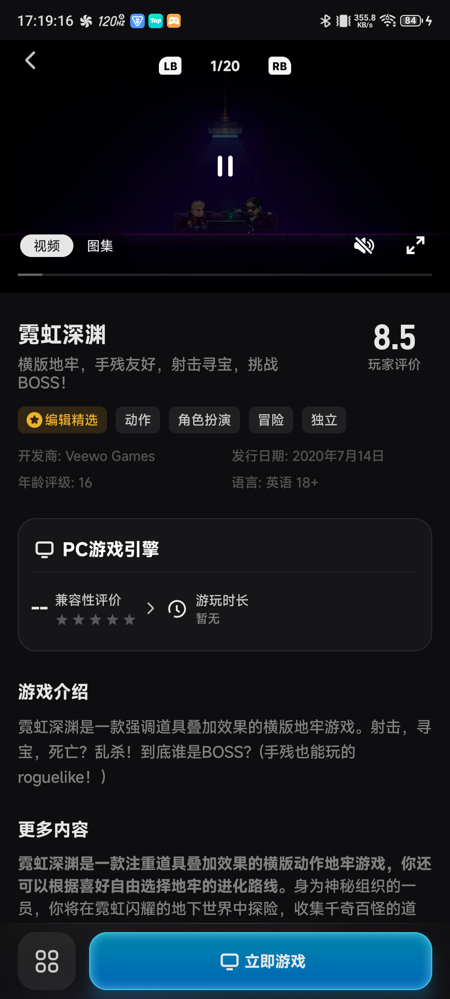 |  | 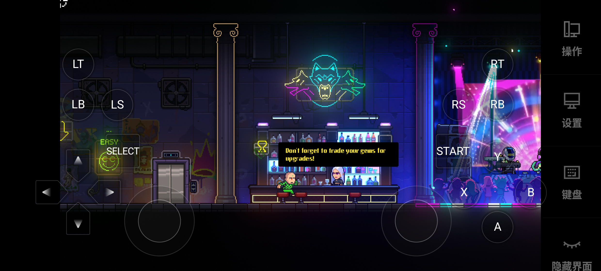 |
| 自动补全中文名、简介、标签、玩家评分；但兼容性仍为 `--`。 | 两次启动约 12—16 秒回到详情页；日志为 `returnCode=139`，用户端无失败原因。 | 安装 Bionic 后约 20 秒进入可玩酒吧场景，二次启动约 10 秒到标题页。 |

> **一句话结论：** GameHub 的“看起来像游戏库”已经领先，但 233 在本轮 Neon Abyss 默认路径上兑现了“能玩”；下一阶段优先级必须从信息包装转向启动确定性。

### 1.3 一页总结（按需求汇总矩阵展示）

| 需求阶段 | 需求主题 | 现状与问题 | 首期建设范围 | 非首期/明确边界 | 用户价值 | 业务价值 |
|---|---|---|---|---|---|---|
| P0 | 游戏可玩标记与快速筛选 | GameHub 元数据完整，但 Neon 的 PC 引擎兼容性显示 `--`；233 信息较少却能启动同一文件。<br><br> | 建立“本机一键可玩 / 需要配置 / 暂不建议本地运行 / 待验证”统一口径；在游戏库、搜索结果、详情页同时展示。 | 不承诺所有游戏都能启动；未验证游戏不得默认标记为可玩；先覆盖真实有数据的游戏×机型组合。 | 用户在点击启动前知道预期，减少试错和错误选择。 | 减少无效启动与负向反馈，提升从浏览、筛选到启动的转化。 |
| P0 | 启动失败自愈与异常恢复 | GameHub Neon 两次以 `returnCode=139` 结束，却被记录为 `normalExit=true`，详情页没有错误原因、重试或恢复入口。<br><br> | 识别异常退出；自动尝试候选配置 A/B/C；展示失败阶段、已尝试方案、重试和替代模式；记录真实失败原因。 | 不在首期做覆盖所有错误码的 AI 诊断；不把失败简单转为付费墙或强制云游戏。 | 不必盲目重复点击，知道下一步怎么恢复。 | 提升 `game_launch_click → game_machine_enter`，减少客服和无效启动成本，为兼容性数据飞轮提供干净样本。 |
| P1 | 导入信息与环境准备透明 | GameHub 导入后信息丰富；233 首次需确认 EXE、安装 Bionic，但成功后会记住选择；GameNative 0.9.0 参数透明但认知负担高。<br><br>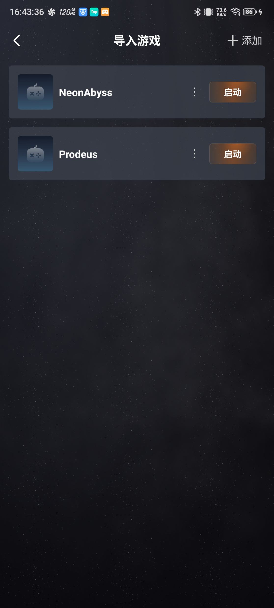 | 保留 GameHub 元数据优势；将 EXE、组件、空间、预计耗时和当前阶段集中说明；成功配置自动记忆。 | 不把 Wine、容器、GPU 等底层参数放入默认流程；高级模式再开放。 | 更少理解文件结构和模拟器术语，首次启动更顺。 | 降低配置页停留和首次流失，提升导入到启动的转化。 |
| P1 | 体验后退出、存档与恢复 | GameHub 有明确退出和未保存提示；233 返回/侧栏语义不清；历史材料还有云存档冲突风险。<br><br>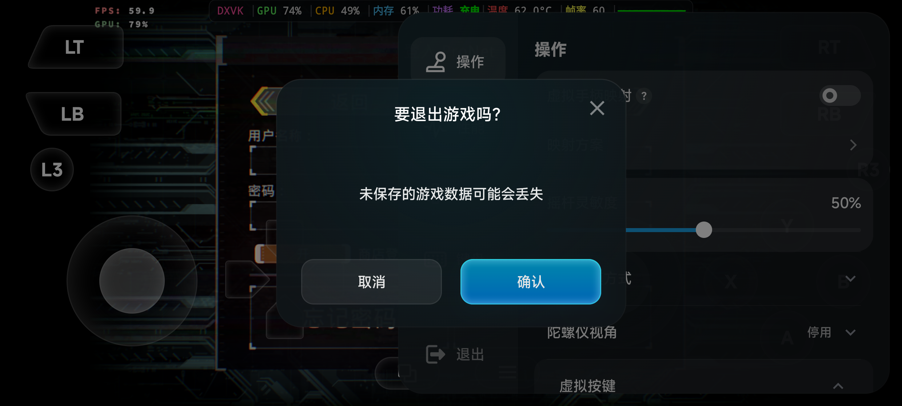 | 统一主动退出、异常退出、系统终止三类状态；补齐重试、本地/云端选择和冲突恢复。 | 不在首期扩展社区、好友、创意工坊等留存功能；先保证游戏资产安全。 | 退出和再次进入可预期，减少存档损失。 | 降低流失和投诉，保护会员、云存档和长期资产价值。 |
| P2 | 数据 × 手柄差异化 | GameHub 已有元数据、兼容性入口和硬件基础，但配置结果没有沉淀为用户资产。 | 记录游戏×机型×引擎×配置×结果；盖世手柄连接后自动加载验证过的映射。 | 不在启动成功率未稳定前投入大规模社区和社交玩法。 | 越用越省心，插上手柄即可继续玩。 | 形成竞品较难复制的数据与硬件协同壁垒。 |

### 1.4 模板定位：标准化程度与适用边界

这份报告**不是公司已经发布的正式统一模板**，而是基于两层结构组合出来的专项模板：

1. **标准化竞品拆解骨架**：策略、功能、体验、增长四维；横向对比矩阵；可借鉴、不可照搬、差异化和行动清单。这部分符合标准竞品分析方法，也已在本报告正文中完整覆盖。
2. **PC 模拟器真机专项层**：统一设备与版本口径、体验前/中/后链路、游戏×机型×引擎×配置结果、截图/日志证据和账号/付款限制。这部分是针对本事项补充的业务模板。
3. **你提供的截图**：属于“需求汇总/方案决策矩阵”，适合放在竞品分析最前面给管理层快速决策；它不能替代正文中的竞品拆解、证据和限制说明。本次已按相同字段补入“一页总结”部分。

后续同类竞品分析可固定使用以下标准目录：**分析目标与用户问题 → 研究范围与版本 → 统一体验路径 → 一页总结矩阵 → 四维拆解 → 横向矩阵 → 可借鉴/不可照搬 → P0/P1/P2 行动 → 指标与验收 → 证据与限制**。

### 1.5 决策建议

GameHub 应继续坚持现有策略文档中的“点开就能玩”，但执行顺序需要更严格：

1. **先保证能玩**：Neon Abyss 的默认配置失败属于 P0 兼容性问题。
2. **再保证失败后能恢复**：返回详情页却无失败态，会驱动用户盲目重试；这与历史人均 `game_launch_click=14.6 次`高度一致。
3. **最后放大信息与商业价值**：兼容性结论可信之后，再承接云游戏、会员、租号、手柄和配置资产的转化；不能让商业化建立在“不知道能不能玩”的前提上。

⚠️ 判断可能存在问题，此处需要深度思考和决策。

如果继续把详情页、社区、音效或商业化入口排在启动成功率之前，会优化用户“失败前看到什么”，却没有解决用户为什么离开。历史漏斗中 `game_launch_click → game_machine_enter` 仅 3.9%，本轮又复现了默认启动静默失败，二者相互印证：**当前最大损失点仍在启动确定性和异常恢复，不在内容包装。**

## 2. 研究目标、用户问题与替代方式

### 2.1 要解决哪个用户的什么问题

目标用户是希望在 Android 设备上运行本地 PC 游戏、但不愿理解 Wine、容器、GPU 驱动和分辨率组合的玩家。其核心任务不是“完成模拟器配置”，而是：

> 选中自己的游戏文件后，快速知道能否运行；能运行就直接进入游戏，不能运行就得到明确原因和下一步方案。

### 2.2 用户现在如何解决

内部历史材料记录的用户原话是：“我同时装 3—4 个模拟器，哪个能启动我想玩的游戏，我就玩哪个。”这说明替代方式不是学习某个平台的复杂配置，而是**换平台反复试**。用户迁移成本低，启动成功就是最强的短期选择信号。

### 2.3 本轮分析目标

- 对齐 GameHub、233 乐园、GameNative 的体验前、体验中、体验后核心链路。
- 找到 GameHub 已领先、仍落后和可形成差异化的能力。
- 把真机现象映射为可执行的 P0/P1/P2 行动，并关联体验与商业化指标。

## 3. 测试范围与口径

### 3.1 统一环境

| 项目 | 口径 |
|---|---|
| 设备 | nubia NX729J（红魔 8S Pro） |
| 系统 | Android 15 |
| 分辨率 | 1116 × 2480 |
| ADB 目标 | `192.168.50.154:41355` |
| 连接方式 | Android 无线调试；全程仅操作该真机 |
| 禁止设备 | `emulator-5554`，未用于任何竞品结论 |
| 目标游戏 | Prodeus、Neon Abyss，本地 EXE 文件由用户指定 |
| 成功标准 | 到达可识别的游戏标题/警告页只是“启动”；到达可接收输入的实际场景才记为“可玩” |

目标文件：

- `Download/QQ/Prodeus/Prodeus/Prodeus.exe`
- `Download/QQ/NeonAbyss/NeonAbyss/NeonAbyss.exe`

### 3.2 版本矩阵

| 产品 | 系统包实际版本 | App/插件展示版本 | 本轮结论适用范围 |
|---|---|---|---|
| GameHub | 6.1.2，versionCode 124 | PC 引擎运行日志显示 `proton11.0-arm64x`、`turnip_v26.1.0_R4` | Prodeus 与 Neon Abyss 完整真机链路 |
| 233 乐园 | 4.86.0.2-4868968，versionCode 4860002 | App 更新页显示 v4.86.92.1；PC 引擎插件 10.2.4-0，27.1 MB | Prodeus 与 Neon Abyss 完整真机链路；必须区分系统版本和展示版本 |
| GameNative | 设备释放后复核为 1.1.1，versionCode 19 | 核心走查时为 0.9.0，versionCode 14 | 搜索、Unknown 条目和手工配置只代表 0.9.0；1.1.1 仅确认已安装，未使用已有 Steam 会话 |

版本只读记录：[package-versions-2026-08-18.txt](./evidence/01-baseline/package-versions-2026-08-18.txt)

### 3.3 限制与不可直接比较项

- 三款产品使用的引擎、默认配置和组件策略不同；本报告比较的是**用户在默认路径下得到的结果**，不是实验室级引擎性能基准。
- Firmware、PC 引擎插件、Bionic 的下载大小和缓存口径不同，不宜只比较单个数字。
- GameHub Prodeus HUD 的约 59.9—60 FPS 是瞬时读数；233 与 GameNative 未获得同口径 FPS，不能据此做性能排名。
- 未执行真实付款、账号授权或使用现存 Steam 在线会话；商业模式和登录后能力只记录可见事实，缺乏证据的判断标为“推断”或“待验证”。
- 两款游戏可以暴露关键链路问题，但不能代表整体游戏兼容率。

## 4. 体验前：入口、导入与信息决策

### 4.1 GameHub

**实测表现**

- 可从游戏库进入本地游戏导入并选择 EXE。
- 导入 Neon Abyss 后自动识别封面并补全中文名“霓虹深渊”。
- 自动补全简介、标签、开发商、发行日期、年龄评级、语言与玩家评价 8.5。
- 游戏库能以正式游戏卡片展示导入结果；Prodeus 同样获得中文名、简介和评分等信息。
- Neon Abyss 的“PC 引擎兼容性评价”为 `--`，信息丰富度和可启动决策之间出现断层。

**判断**

GameHub 已经解决“这是什么游戏”，却没有充分解决“这台手机上是否能玩”。对 PC 模拟器用户，后者优先级更高。元数据应该成为兼容性解释、推荐配置和商业化承接的底座，而不只是内容展示。

**关键证据图**

| 导入时自动识别 | 导入后正式游戏卡片 | 详情中的信息与兼容性断层 |
|---|---|---|
| 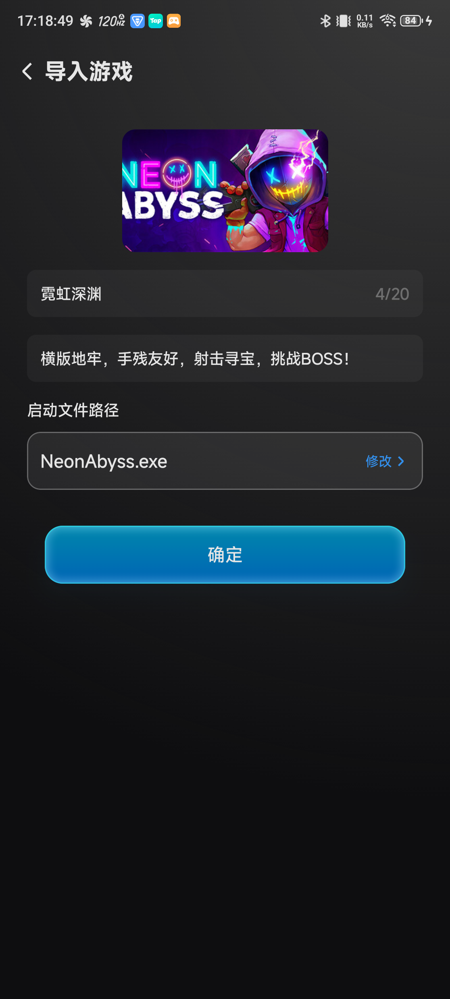 | 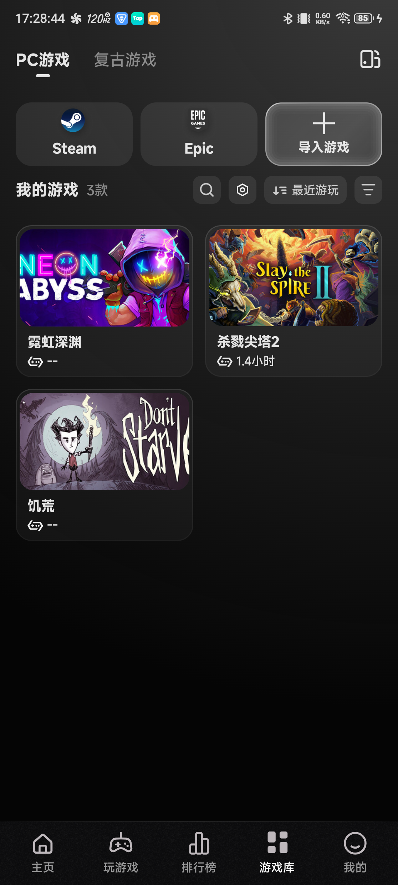 |  |
| 自动带出封面、中文名和 EXE。 | 已导入游戏与其他游戏统一进入游戏库。 | 玩家评分为 8.5，但“PC 游戏引擎兼容性评价”仍为 `--`。 |

### 4.2 233 乐园

**实测表现**

- PC 引擎插件更新后可扫描并导入本地游戏目录。
- 导入列表中的 Neon Abyss 使用通用图标，显示文件夹/文件名，无封面与详细元数据。
- 首次启动约 5 秒出现“选择可执行文件”，系统自动选中 `NeonAbyss.exe`，仍需用户点击“继续”。
- 该选择在二次启动时被记住，不再重复询问。

**判断**

233 的导入信息体验明显弱于 GameHub，但它把选择 EXE 放到首次启动阶段，并在成功后记忆选择，形成“首轮多一步、后续少一步”的路径。GameHub 不应照搬通用图标和弱元数据，但应借鉴“成功配置自动记忆”和组件准备状态的显性反馈。

**关键证据图**

| Neon Abyss 导入列表 | Prodeus 扫描结果 |
|---|---|
|  | 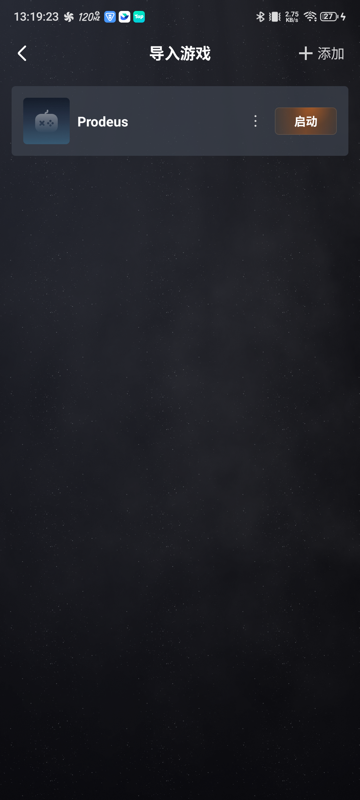 |
| 使用通用图标与文件名，信息密度较低。 | 可扫描到本地游戏目录，但仍是文件导向展示。 |

### 4.3 GameNative（0.9.0 口径）

**实测表现**

- 搜索 Prodeus 和 Neon Abyss 均返回 0 结果。
- 搜索/返回后出现 `Unknown / 最近拷入的文件` 条目。
- 需要手工确认 EXE 路径、容器、Wine、语言、分辨率和音频。
- 默认观察到 Bionic、`proton-9.0-arm64ec`、English、1280 × 720、PulseAudio。

**判断**

0.9.0 更像面向熟练用户的运行容器：配置透明、可控，但用户必须理解技术概念。它不能作为 GameHub 的大众默认路径；其中“高级配置透明可编辑”可被保留在高级模式，而不应暴露给首次启动用户。

**关键证据图**

| 搜索无结果后的 Unknown 条目 | 手工容器配置 |
|---|---|
| 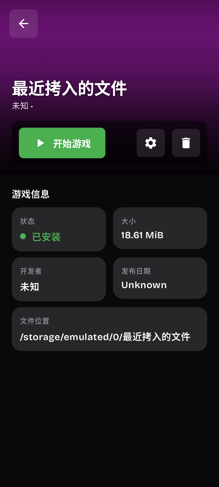 | 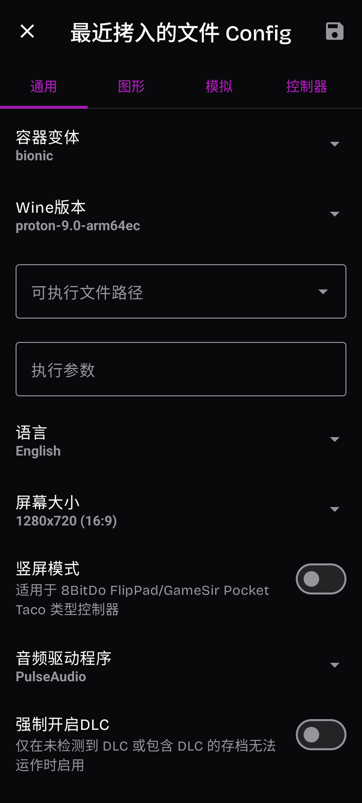 |
| 没有识别为具体游戏，用户需要自行判断文件和启动方式。 | EXE、容器、Wine、语言、分辨率、音频都需要理解和确认。 |

## 5. 体验中：启动、组件、控制与异常

### 5.1 Prodeus 对比

| 维度 | GameHub | 233 乐园 | GameNative |
|---|---|---|---|
| EXE 选择 | 导入时直接选择 `Prodeus.exe` | 首次启动需再次确认 EXE | 0.9.0 需手工配置 Unknown 条目 |
| 首次组件 | 下载 Firmware 411.18 MB | 更新 PC 引擎插件 27.1 MB，并经历组件/环境安装 | 未完成同口径启动 |
| 启动结果 | 成功进入游戏；二次启动约 5 秒到光敏警告页 | 成功进入可交互画面 | 未验证 |
| 性能证据 | HUD 瞬时约 59.9—60 FPS | 未采同口径 FPS | 未采同口径 FPS |
| 结论 | 成功 | 成功 | 不参与排名 |

**关键证据图**

| GameHub Prodeus 运行 | GameHub 二次启动约 5 秒 | 233 Prodeus 运行 |
|---|---|---|
| 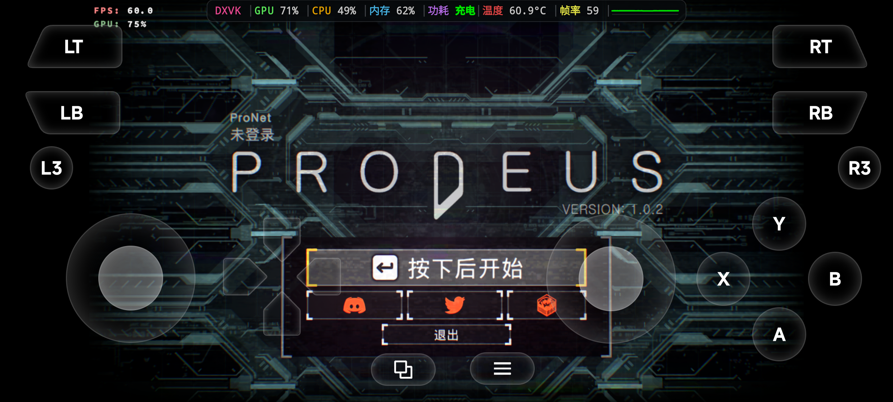 | 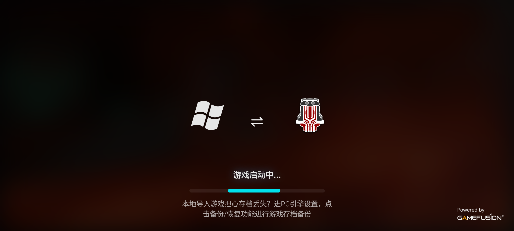 | 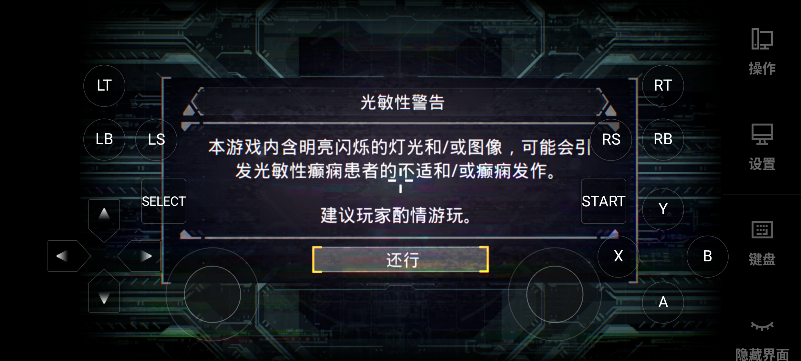 |
| 成功进入游戏，HUD 瞬时约 59.9—60 FPS。 | 已准备环境能复用。 | 同样可进入可交互画面。 |

### 5.2 Neon Abyss 对比

| 维度 | GameHub | 233 乐园 |
|---|---|---|
| 首次启动 | “正在检查环境和固件”→“游戏启动中”→黑屏/媒体加载→约 12—16 秒返回详情页 | 首次约 5 秒出现 EXE 选择；安装 Bionic 后约 10 秒到标题页，约 20 秒进入可玩酒吧场景 |
| 二次启动 | 复现相同失败 | 不再选择 EXE；约 5 秒 `Launching game...`，约 10 秒到标题页 |
| 最终状态 | 两次均未进入游戏，运行时长 0 | 成功进入可玩场景 |
| 用户端异常反馈 | 无明确失败原因、重试入口或恢复建议 | 启动成功，不涉及失败恢复 |
| 后台日志 | `returnCode=139`；随后引擎销毁 | 未采集同口径内部退出码 |

GameHub 本次使用的关键配置：

- Wine：`proton11.0-arm64x`
- GPU：`turnip_v26.1.0_R4`
- 分辨率：1280 × 720
- 启动方式：DirectLaunch
- 本地游戏：`isLocalGame=true`

关键问题不止是崩溃。日志在 `Stopping runtime: returnCode=139` 后仍将流程记录为 `normalExit=true`，并跳过时长记录：

```text
Stopping runtime: returnCode=139
EngineStateChanged.Idle -> send HandleByDestroy normalExit=true
skip user_game_event ... durationSeconds=0
```

这会产生三重后果：

1. 用户看不到异常，不知道是否值得重试。
2. 产品可能低估失败率，把异常退出计入正常退出。
3. 自动配置系统拿不到可靠的失败标签，数据飞轮会被错误样本污染。

**关键证据图：同一游戏的两条结果路径**

| GameHub：检查环境 | GameHub：启动后静默返回 | 233：Bionic 安装完成 | 233：进入可玩场景 |
|---|---|---|---|
| 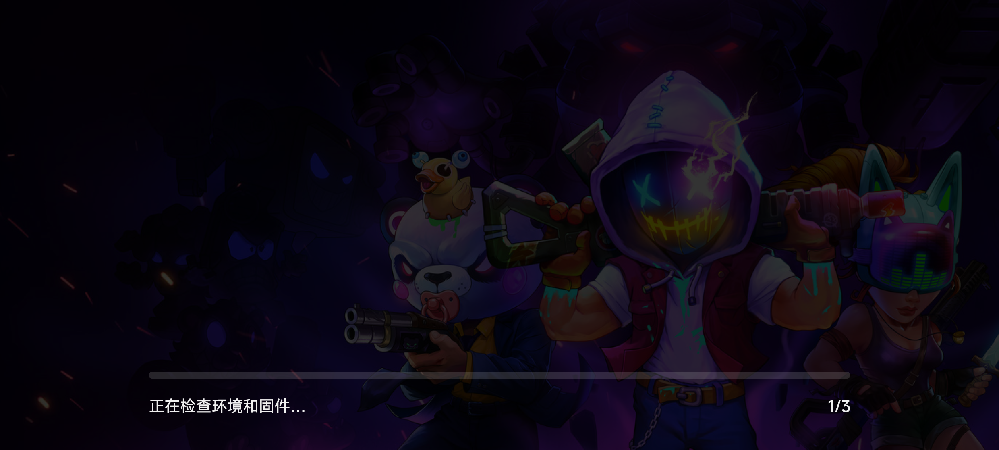 | 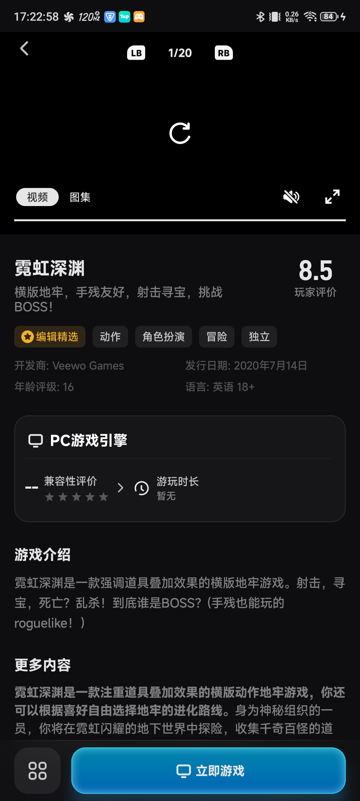 | 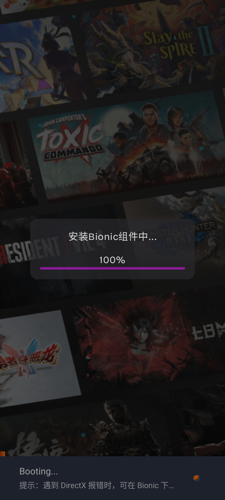 |  |
| 用户只看到环境检查。 | 约 12 秒回到详情，未呈现失败原因。 | 组件准备过程对用户可见。 | 成功进入可接收输入的实际场景。 |

日志原文：[GameHub Neon Abyss `returnCode=139` 完整日志](./evidence/07-logs/gamehub-neon-returncode-139.log)。更多过程图见：[启动证据目录](./evidence/05-launch/)。

### 5.3 为什么不能简单判定“233 引擎更强”

- Prodeus 在 GameHub 与 233 都成功，说明差异是游戏级和配置级的，不是平台级绝对胜负。
- Neon Abyss 的引擎版本、Wine、GPU 驱动与启动参数并不一致；本轮只证明 233 的**当前默认路径**在该组合上成功。
- 样本只有两款游戏，没有覆盖不同图形 API、DRM、启动器、反作弊和存档类型。

可成立的结论是：**在本轮设备和文件条件下，233 对 Neon Abyss 的默认方案更有效；GameHub 的默认方案失败且没有恢复能力。**

## 6. 体验后：退出、恢复、再次启动

### 6.1 GameHub

- Prodeus 游戏内侧栏有明确“退出”入口。
- 退出前提示未保存数据可能丢失，风险表达明确。
- 二次启动能复用已准备环境，约 5 秒进入光敏警告页。
- Neon Abyss 异常退出后返回详情，但没有把“异常”转成可操作状态。

**应保留**：明确退出入口、未保存风险提示、环境复用。  
**应修复**：异常退出识别、错误原因、重试/切换方案、失败上下文保留。

**关键证据图**

| 游戏内侧栏 | 退出风险确认 |
|---|---|
| 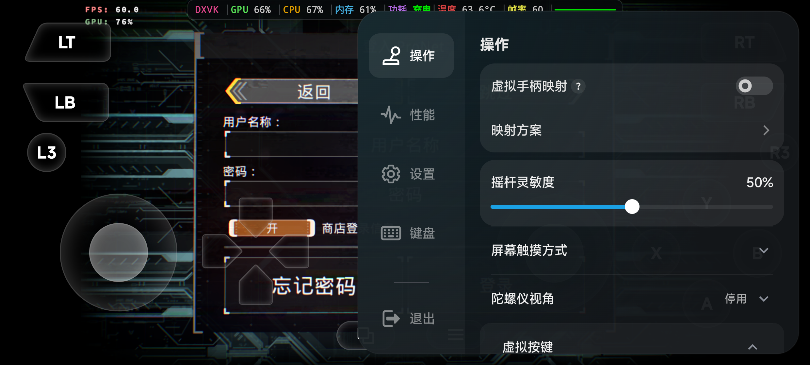 |  |
| 提供明确“退出”入口。 | 清楚提示未保存数据可能丢失。 |

### 6.2 233 乐园

- force-stop 后二次启动不再弹 EXE 选择，首轮决策被记忆。
- Android 返回键主要改变侧栏/遮罩状态，没有提供与 GameHub 同等明确的退出动作和风险确认。

**可借鉴**：成功路径配置记忆。  
**不应照搬**：退出语义不清、返回键反馈不明确。

**关键证据图**

| 233 侧栏 | Android 返回键响应 |
|---|---|
| 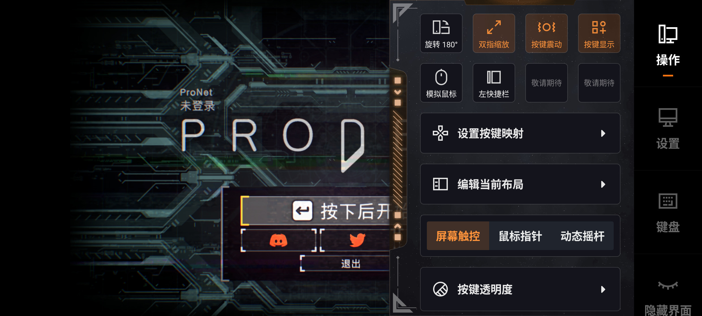 | 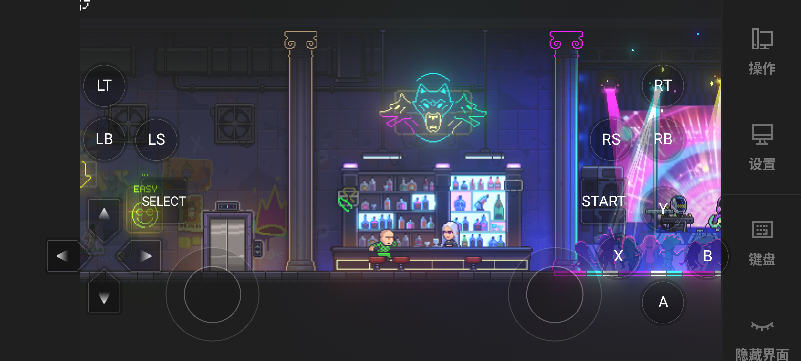 |
| 侧栏存在，但退出与返回的关系不够直观。 | 返回主要改变侧栏/遮罩状态，缺少明确退出语义。 |

### 6.3 GameNative

因新版 1.1.1 的 Steam 会话未获授权使用，未验证登录后启动、存档同步、退出和二次启动。本报告不将这些能力标为已完成或缺失。

## 7. 四维拆解

### 7.1 GameHub

#### 策略层

- **定位**：从游戏发现、导入、配置到运行的一体化 Android PC 游戏平台。
- **核心价值**：降低本地 PC 游戏在手机上运行的技术门槛。
- **现有优势**：元数据、兼容性评价入口、游戏库与硬件能力具备形成数据飞轮的条件。
- **当前断点**：详情页承诺的信息丰富度高于实际启动确定性，信任可能被反噬。

#### 功能层

- L3：本地游戏识别和元数据补全。
- L2：Prodeus 启动、环境复用、游戏内侧栏与退出确认。
- L1：兼容性决策；Neon Abyss 显示 `--`，推荐配置没有转化为成功结果。
- 缺口：失败自愈、可解释错误、配置自动切换、异常退出正确埋点。

#### 体验层

- 亮点：导入后像正式游戏库，不像文件管理器；成功游戏的退出链路清楚。
- 阻塞：失败后静默返回详情，用户不知道发生了什么。
- 本轮评价：信息理解 4/5；导入效率 4/5；启动确定性 2/5；失败恢复 1/5；退出可控性 4/5。

#### 增长层

- 已具备：游戏内容、兼容性评价、配置、存档和手柄可共同形成留存资产。
- 核心风险：启动失败会在转化漏斗最前端截断后续会员、云游戏、租号与硬件价值。
- 差异化机会：把“游戏 × 机型 × 引擎 × 配置 × 结果”数据反哺推荐，形成成功率数据飞轮。

### 7.2 233 乐园

#### 策略层

- **[推断] 定位**：以综合游戏内容平台承接流量，PC 引擎是其中一种游戏供给和启动方式。
- **核心价值**：入口不精致但默认运行链路务实，用户能较快验证“能不能玩”。
- **护城河**：可能来自内容分发与用户规模，而非本地游戏元数据精细度；本轮未验证商业数据。

#### 功能层

- L2：目录扫描、EXE 选择、Bionic 安装、配置记忆、二次启动。
- L1：导入卡片信息、元数据和退出控制。
- 差异点：在 Neon Abyss 上默认路径成功，组件安装过程可见。

#### 体验层

- 亮点：Bionic/Loading 进度明确；首次选择成功后不重复询问；Neon Abyss 能进入可玩场景。
- 槽点：EXE 选择增加首次认知负担；导入条目像文件而不是游戏；返回/退出反馈不够明确。
- 本轮评价：信息理解 2/5；导入效率 3/5；启动确定性 4/5；成功路径反馈 4/5；退出可控性 2/5。

#### 增长层

- **[推断]** PC 引擎可借助 233 原有内容入口降低获客成本。
- 通用图标与弱元数据会降低本地游戏资产感和再次打开意愿。
- 本轮未触发付费墙，不能判断其 PC 引擎商业化转化效率。

### 7.3 GameNative

#### 策略层

- **[推断] 定位**：面向愿意管理 Wine/容器配置、并可能连接 Steam 的高阶用户。
- **核心价值**：提供更透明的底层参数和较高配置自由度。
- **限制**：新版 Steam 能力未获授权验证，不能判断账号生态和库同步效果。

#### 功能层

- 0.9.0 可手工设置 EXE、容器、Wine、语言、分辨率和音频。
- 游戏搜索匹配失败后生成 Unknown 条目，缺少 GameHub 式元数据识别。
- 1.1.1 已安装但未复测，不能把 0.9.0 缺口外推为当前版本缺口。

#### 体验层

- 对熟练用户：参数透明，可控性强。
- 对大众用户：技术概念密集，首次任务成本高。
- 旧版本口径评价：信息理解 2/5；配置可控性 4/5；大众可学习性 1/5；启动与恢复不评分。

#### 增长层

- **[待验证]** Steam 登录与游戏库可能构成账号资产和留存入口。
- 未经授权未使用现有 Steam 会话，也未触发付费，不对转化、存档或跨设备能力下结论。

## 8. 横向对比矩阵

图例：✅ 完整/已验证；⚠️ 部分/有明显缺口；❌ 未观察到；— 未验证或不可比较。

| 核心能力 | GameHub | 233 乐园 | GameNative |
|---|---|---|---|
| 本地 EXE 导入 | ✅ | ✅ | ⚠️ 0.9.0 手工路径 |
| 自动元数据补全 | ✅ 本轮最佳 | ❌ 通用图标/文件名 | ❌ 0.9.0 为 Unknown |
| 兼容性决策信息 | ⚠️ 有入口，但 Neon 为 `--` | ❌ 未见同等信息 | — |
| 默认配置降低认知负担 | ✅ 有推荐配置 | ✅ 默认路径较少配置 | ❌ 0.9.0 需手工参数 |
| Prodeus 可启动 | ✅ | ✅ | — |
| Neon Abyss 可启动 | ❌ 两次 `returnCode=139` | ✅ 进入可玩场景 | — |
| 首次组件准备反馈 | ✅ 有检查/下载 | ✅ 进度更细 | — |
| 成功配置记忆 | ✅ 环境可复用 | ✅ 不再选 EXE | — |
| 失败原因与恢复 | ❌ 静默返回 | — 本轮未触发失败 | — |
| 明确退出入口 | ✅ | ⚠️ 返回/侧栏语义不清 | — |
| 高级配置透明度 | ⚠️ 有设置页 | ⚠️ 有引擎路径 | ✅ 0.9.0 参数最全 |
| 商业化/账号链路 | — 未触发 | — 未触发 | — Steam 会话未授权 |

### 8.1 默认路径结果矩阵

| 游戏 | GameHub | 233 乐园 | 可成立的结论 |
|---|---|---|---|
| Prodeus | 成功 | 成功 | 两家都具备可运行能力，GameHub 的信息和退出链路更完整 |
| Neon Abyss | 失败两次 | 成功进入可玩场景 | 233 的当前默认方案更有效；GameHub 需修默认配置与失败恢复 |

## 9. GameHub 当前问题清单

### P0：直接阻断“点开就能玩”

1. **Neon Abyss 默认配置崩溃**：`returnCode=139`，同设备同文件在 233 可运行。
2. **异常退出被标记为正常退出**：`normalExit=true` 与返回码冲突，会污染真实成功率和推荐数据。
3. **失败后无用户可见状态**：没有原因、重试、切换配置、恢复建议或云游戏替代。
4. **兼容性信息不能支撑决策**：详情展示大量元数据，但 PC 引擎兼容性为 `--`。

### P1：放大认知成本和首次等待

1. Firmware 首次下载 411.18 MB，缺少与“为什么需要、预计多久、是否可后台准备”相匹配的预期管理。
2. 推荐配置虽然存在，但没有展示“该机型/该游戏为何推荐、历史成功率、失败会怎样切换”。
3. 导入、配置、运行状态之间信息没有闭环：游戏识别成功并不等于配置可信。
4. 历史问题中 Steam/Epic/手动导入入口缺少副标题，用户难判断不同入口的前置条件和结果差异。

### P2：长期资产与差异化尚未形成

1. 成功配置、失败配置、机型与引擎结果没有以用户可感知方式沉淀。
2. 手柄、按键映射、兼容性和游戏库尚未形成“连上即匹配”的统一体验。
3. 云存档冲突仍缺少可靠的重试和本地/云端选择，可能破坏最重要的长期游戏资产。

## 10. 可借鉴与不应照搬

### 10.1 可借鉴

| 优先级 | 借鉴点 | 来源 | GameHub 落地方式 |
|---|---|---|---|
| P0 | 首次成功后记忆 EXE/环境 | 233 | 以“成功进入游戏”为配置生效条件，自动保存游戏、机型、引擎与配置组合 |
| P0 | 组件安装与 Loading 进度显性化 | 233 | 把环境检查拆为可理解阶段，显示当前动作、剩余阶段和可恢复方式 |
| P0 | 默认路径优先成功 | 233 Neon 实测 | 对同游戏接入多套候选配置；A 失败自动尝试 B/C，并展示正在切换 |
| P1 | 高级参数透明 | GameNative 0.9.0 | 只放在“高级模式”，默认用户仍使用推荐模式；支持导出诊断信息 |
| P1 | 成功配置复用 | GameHub/233 | 二次启动直接复用已验证配置，配置或引擎升级后才重新验证 |

### 10.2 不应照搬

| 不应照搬 | 来源 | 原因 |
|---|---|---|
| 通用图标与文件名式游戏库 | 233 | 降低资产感、可识别性和后续内容/商业转化，GameHub 已有明显优势 |
| 首次启动重复要求用户理解 EXE | 233 | 普通用户不应理解文件结构；GameHub 应自动识别，低置信度时再确认 |
| 把所有 Wine/容器参数暴露为默认流程 | GameNative 0.9.0 | 把工程复杂度转嫁给用户，与“点开就能玩”相冲突 |
| 返回键只改变遮罩/侧栏、不提供明确退出 | 233 | 游戏场景下退出与返回的后果不同，必须让用户可预期 |
| 只显示内容评分、不显示本机可玩性 | 当前 GameHub/233 均有缺口 | 玩家评分不能替代兼容性结论，可能诱导无效启动 |

## 11. 差异化方案与行动清单

### 11.1 P0：建立“启动确定性闭环”（0—6 周）

| 行动 | 具体要求 | 验收指标 |
|---|---|---|
| 修复 Neon Abyss 默认配置 | 复现 `returnCode=139`，对比 233 可用组合，定位 Wine/GPU/启动参数差异 | NX729J 同文件冷启动、热启动各连续 3 次成功进入可玩场景 |
| 统一退出语义 | `returnCode != 0` 或未达到 game loaded 不得记为 `normalExit=true` | 异常退出、用户主动退出、系统终止三类事件可区分且日志一致 |
| 启动失败自愈链 | 配置 A 失败后自动尝试 B/C；用户可取消；全部失败后给明确建议 | 首次失败后无需回详情盲目重试；记录每套方案结果 |
| 用户可见失败态 | 显示失败阶段、简化原因、已尝试方案、重试/高级诊断/替代模式 | 任一失败均有下一步；不能静默返回 |
| 兼容性状态三档化 | “本机一键可玩 / 需要配置 / 暂不建议本地运行” | 状态由真实机型与配置成功样本生成；无数据时明确写“待验证”而非 `--` |

### 11.2 P1：让导入优势转化为决策和转化（6—12 周）

| 行动 | 具体要求 | 体验/商业价值 |
|---|---|---|
| 推荐配置可解释 | 展示来源：官方验证、同机型成功率、社区方案；允许进入高级模式 | 提升启动信心，减少 166 秒配置页停留 |
| 环境预检与资源计划 | 启动前说明需下载的组件、大小、预计时间、空间和网络条件 | 减少首次等待造成的退出 |
| 成功后再承接商业化 | 游戏至少成功进入一次后，再推荐云存档、会员、手柄专属配置或更高性能方案 | 先建立价值证明，再降低付费反感 |
| 失败时提供合理替代 | 本地多方案失败后，若云游戏有资源，明确说明是否需付费、存档是否互通 | 把失败用户转为可服务用户，而不是立即流失 |
| 统一 Library 入口说明 | Steam/Epic/本地导入显示副标题、前置条件、资产归属和存档差异 | 降低入口选择错误与登录阻断 |

### 11.3 P2：形成竞品难复制的“数据 × 硬件”壁垒（3—6 个月）

| 行动 | 机会来源 | 预期结果 |
|---|---|---|
| 配置结果数据飞轮 | GameHub 已有元数据、评价和推荐入口 | 用户越多，按游戏/机型推荐越准，首次启动成功率越高 |
| 盖世手柄即插即用 | 233/GameNative 无同品牌硬件协同优势 | 连接手柄后自动加载该游戏验证过的映射和性能方案 |
| 配置与存档跨设备资产 | 当前竞品普遍缺乏清晰闭环 | 提高迁移成本与长期留存，但前提是冲突恢复机制可靠 |
| “盖世验证”兼容标签 | 当前 PC 引擎评价存在空值 | 形成可解释、可复测、带版本和机型范围的兼容性心智 |

## 12. 数据指标与验证方案

### 12.1 历史基线

| 指标 | 历史值 | 本轮证据的解释 |
|---|---:|---|
| `game_launch_click → game_start_click` | 6.7% | 大量用户可能在真正启动前流失，需复核事件语义和配置阻塞 |
| `game_launch_click → game_machine_enter` | 3.9% | 与本轮 Neon Abyss 静默失败方向一致 |
| `game_launch_click` 人均次数 | 14.6 次 | 可能包含失败后盲目重试，应通过退出码和阶段事件拆分 |
| 配置页平均停留 | 166 秒 | 推荐配置没有充分降低决策成本 |
| 配置页访问用户 | 555,973 | 配置问题影响面大，P0 收益显著 |
| `game_import_click` 用户 | 53,569 | 导入规模已有基础，应优化导入到成功启动的转化 |
| `pc_engine_click` 用户 | 128,794 | PC 引擎有真实需求，不宜把问题归因于没有用户兴趣 |
| 卸载率 | 74.9% | 启动失败和不确定性可能是主要驱动之一，但需定量归因 |
| D1 / D7 留存 | 约 20.5% / 3.7% | 首次价值兑现和长期资产都不足 |
| 云存档冲突用户 | 11,864 | 体验后恢复问题已有显著用户量 |

### 12.2 推荐北极星与护栏指标

北极星继续使用：**周活跃游戏启动成功用户数（WAU of game_machine_enter）**。

| 类型 | 指标 | 定义/要求 |
|---|---|---|
| 核心 | 首次启动成功率 | 新用户首次点击后进入可玩场景的用户占比 |
| 核心 | 游戏级成功率 | 按游戏、机型、Wine、GPU、配置版本拆分 |
| 效率 | 点击到可玩 P50/P90 | 不以标题页替代可玩场景 |
| 恢复 | 首方案失败后的挽回率 | A 失败后由 B/C 或云模式成功的比例 |
| 质量 | 异常退出正确识别率 | 非 0 返回码、崩溃、用户退出分类准确率 |
| 信任 | 兼容标签兑现率 | 标记“一键可玩”的启动成功率建议 ≥ 95% |
| 商业 | 启动成功后付费转化率 | 与失败后付费曝光分开，避免用强曝光掩盖价值不足 |
| 护栏 | 存档冲突率/数据丢失投诉 | 任何增长策略不得以存档安全为代价 |

### 12.3 最小回归集

后续每个引擎或推荐规则版本至少覆盖：

- 两款本轮游戏：Prodeus、Neon Abyss。
- 冷启动与热启动各 3 次。
- 主动退出、异常退出、系统终止。
- 首次无组件、组件已缓存、空间不足、断网。
- 无手柄、盖世手柄、第三方手柄。
- 成功后存档、冲突、恢复与再次启动。

## 13. 事实、推断与未完成项

### 13.1 已验证事实

- GameHub 与 233 均能在目标真机启动 Prodeus。
- 233 能启动 Neon Abyss 并进入可玩酒吧场景。
- GameHub 两次启动 Neon Abyss 均失败，日志返回码为 139。
- GameHub 对本地游戏的元数据补全明显优于 233 和已测的 GameNative 0.9.0。
- GameHub Prodeus 有明确退出入口和风险确认；233 返回/退出语义较弱。

### 13.2 推断

- 233 可能用综合内容平台为 PC 引擎导流；本轮未验证流量与收入数据。
- GameNative 可能用 Steam 账号和库资产提高留存；新版会话未获授权使用。
- 静默失败可能驱动历史中的高频重复点击，但仍需用户级事件序列验证因果。

### 13.3 未完成与风险

- GameNative 1.1.1 核心链路、Steam 库、登录后启动、存档、退出与商业化未验证；原因是存在真实在线会话，未获授权使用。
- 未执行付款、订阅、租号或账号绑定。
- 未完成大样本兼容率和同口径性能基准；本报告不做全平台引擎性能排名。
- 233 的系统包版本与更新页展示版本不一致，后续回归必须同时记录两种口径。

## 14. 资料与证据索引

### 14.1 本轮真机证据

证据目录：[evidence](./evidence/)

- `01-baseline`：设备、版本、冷启动与更新页。
- `02-entry`：首页、跳过登录与入口。
- `03-import`：文件选择、扫描、导入结果与元数据。
- `04-config`：推荐方案、PC 设置、GameNative 容器配置。
- `05-launch`：组件安装、冷/热启动、标题页与可玩场景。
- `06-exit`：侧栏、返回、退出确认与退出后状态。
- `07-logs`：GameHub Neon Abyss `returnCode=139` 日志。

### 14.2 内部资料

- [核心链路数据分析报告](../../数据分析/核心链路数据分析报告.md)
- [差异化竞争策略与核心优化方案](../../差异化竞争策略与核心优化方案.md)
- [GameHub 6.1.2（124）当前问题阶段汇总](../../../功能验收/ai输出结果/GUANWANGGAID-17_GameHub_6.1.2_124/08-报告/当前问题阶段汇总.md)

## 15. 最终结论

GameHub 不是全面落后：它在本地游戏识别、内容信息、成功游戏的退出与库资产感上已经领先 233；问题是这些优势没有跨过“启动成功”这条生死线。233 本轮最值得学习的不是其页面或内容包装，而是 **Neon Abyss 的默认方案能把用户带进可玩场景，并记住成功选择**。

因此，最优路线不是全面复刻 233，也不是继续扩张页面功能，而是：

> 以真实启动结果修正兼容性数据 → 让推荐配置可解释且可自动切换 → 失败时给恢复与替代方案 → 成功后再用元数据、存档、手柄和商业服务建立长期资产。

这条路线同时保住 GameHub 已有优势、补齐当前致命短板，并把“点开就能玩”从口号变成可度量、可回归、可转化的产品能力。
