# 【Prd】《盖世游戏 Mac》macOS 26 全屏启动台需求 V2.6

## 一、版本信息

| 时间 | 版本 | 变更人 | 主要变更内容 | 备注 |
|---|---|---|---|---|
| 2026.07.20 | V1.0 | 产品 | 创建“游戏优先”的客户端内全屏启动台方案 | 历史版本 |
| 2026.07.22 | V2.0 | 产品 | 根据竞品实机体验，改为<span style="color:#1677ff"><strong>全部应用启动台</strong></span>；新增<span style="color:#1677ff"><strong>横向分页、拖拽排序、文件夹、全局唤起和自定义应用来源</strong></span> | <mark>V2.0 完整替代 V1.0</mark> |
| 2026.07.22 | V2.1 | 产品 | Demo按竞品实机重做；<span style="color:#1677ff"><strong>删除自由拖拽排序和跨页搬动</strong></span>，应用保持名称排序；拖放仅用于创建或移入文件夹 | V2.2前历史版本 |
| 2026.07.22 | V2.2 | 产品 | <mark><span style="color:#1677ff"><strong>删除用户可见扫描过程；新增长按抖动、系统式删除、文件夹名称直接编辑、NSWorkspace原生打开和独立程序坞入口</strong></span></mark> | V2.3前历史版本 |
| 2026.07.22 | V2.3 | 产品 | 文件夹补齐右上角关闭和应用移出按钮；拖放建夹或移入后停留当前页；程序坞引导采用macOS卡片风格 | V2.4前历史版本 |
| 2026.07.22 | V2.4 | 产品 | 建夹固定替换目标槽位，后续应用前移；文件夹封面图标改为等比方形；程序坞引导删除左侧图标和副标题；更多菜单删除程序坞项，设置内改用开关 | V2.5前历史版本 |
| 2026.07.22 | V2.5 | 产品 | <mark><span style="color:#1677ff"><strong>编辑态支持把应用拖到上一页或下一页；人工全局顺序替代持续名称排序；文件夹删除右上角关闭，移出改为左上角“−”；删除后台驻留设置、产品内启动失败页和搜索无结果冗余文案</strong></span></mark> | V2.6前历史版本 |
| 2026.07.22 | V2.6 | 产品 | <mark><span style="color:#1677ff"><strong>长按后同一手势直接拖动；支持拖到空白槽位排序；仅命中另一应用图标中心时建夹；左右边缘停留后自动翻页且不显示提示框；编辑态首次点击更多按钮只退出编辑；标号默认隐藏；删除全部产品内Toast</strong></span></mark> | <mark>当前开发与验收版本，替代V2.5交互口径</mark> |

> V1.0 文档保留在 Git 历史。开发、测试和 Demo 均以本文件为准。

## 二、背景与目标

### 2.1 背景

macOS 26 取消旧版全屏 Launchpad。用户仍可通过 Spotlight、访达和程序坞打开应用，但失去了全屏大图标、横向分页、文件夹整理和触控板唤起等熟悉体验。

竞品实机表现为系统级启动台：进入后直接展示本机全部应用，以桌面壁纸模糊背景承载应用网格，支持搜索、分页、文件夹以及快捷键、F4、触控板和触发角唤起。<mark><span style="color:#1677ff"><strong>用户不会经历扫描页或扫描进度。</strong></span></mark>

V1.0 将启动台设计为“游戏优先”的客户端内容页，与用户期待不符。本次改为面向本机全部应用的 Launchpad 替代入口。

### 2.2 目标

在盖世 Mac 客户端内提供全屏应用启动台，让 macOS 26 用户集中浏览、搜索、归类、编辑并打开本机应用；盖世在前台、后台或最小化时，用户可通过全局入口唤起。<mark><span style="color:#1677ff"><strong>用户也可把同款盖世图标的独立启动台入口添加到程序坞，点击后直接进入全屏启动台。</strong></span></mark>

### 2.3 核心限制

- 启动台主体仍由盖世客户端承载；<mark><span style="color:#1677ff"><strong>仅新增轻量程序坞启动器，不展示普通客户端内容，不形成第二套客户端</strong></span></mark>；
- 盖世客户端彻底退出后，全局入口不可用；
- F4、触控板和触发角受系统权限、设备能力和系统快捷键冲突影响，必须先完成技术预研；
- 本功能不依赖登录和网络，不新增运营后台。
- <mark><span style="color:#1677ff"><strong>删除仅把 `.app` 应用包移到废纸篓，不清理配置、存档、缓存或账号数据。</strong></span></mark>

## 三、故事介绍

### 3.1 用户场景

- 用户在盖世客户端侧边栏点击九宫格图标，进入全屏启动台，左右翻页后点击应用，系统打开应用或激活已有窗口。
- 用户按自定义快捷键、F4，执行触控板手势或触发屏幕角，在当前使用的显示器快速打开启动台；再次触发或按 Esc 后返回原应用。
- 用户将一个应用拖到另一应用或已有文件夹，完成归类；新文件夹直接占据目标应用原槽位，两个应用合并为一项，后续应用前移一格。首次布局按本地化名称生成，用户归类后不再因文件夹名称重新跳位。
- 用户在设置中添加自定义应用目录。目录需要授权时，完成授权后应用加入启动台；目录失效时，其他应用仍可正常使用。
- <mark><span style="color:#1677ff"><strong>用户长按应用进入图标抖动状态；可删除的第三方应用显示“−”，系统应用不显示。运行中应用点击后提示无法移到废纸篓。</strong></span></mark>
- <mark><span style="color:#1677ff"><strong>用户首次进入时看到一次“添加到程序坞”引导；确认后独立图标加入程序坞，后续点击直接打开全屏启动台。</strong></span></mark>

### 3.2 价值分析

- 补足 macOS 26 取消旧版 Launchpad 后的体验缺口。
- 增加盖世 Mac 客户端的高频入口价值和后台留存理由。
- 复用盖世已有应用扫描与启动能力，形成通用本地应用入口。
- 通过入口使用率和重复使用率验证是否具备持续投入价值。

### 3.3 核心体验路径

```text
侧边栏图标或全局入口
→ 全屏启动台
→ 浏览/翻页/搜索/文件夹归类
→ 点击应用
→ 调用 macOS 原生能力启动或激活应用
→ 启动台退到后层并保留会话状态
→ 再次唤起时恢复
```

### 3.4 产品指标

| 指标 | 口径 | 首期目标 |
|---|---|---|
| 启动台渗透率 | 使用启动台的 macOS 26 日活用户 / macOS 26 日活用户 | 上线后建立基线 |
| D7 重复使用率 | 首次使用后 7 日内再次使用的用户 / 首次使用用户 | 上线后建立基线 |
| 周人均唤起次数 | 一周启动台成功打开次数 / 周使用用户 | 上线后建立基线 |
| 应用启动成功率 | 成功启动或激活次数 / 发起次数 | ≥98%，排除应用损坏和系统明确拒绝 |
| 应用发现覆盖率 | 成功展示的可启动应用 / 抽样设备实际可启动应用 | ≥95% |
| 搜索无结果率 | 无结果搜索次数 / 搜索次数 | 用于校验扫描和名称匹配 |
| 程序坞引导添加率 | 点击确认并成功添加人数 / 引导曝光人数 | 上线后建立基线 |
| 程序坞入口打开成功率 | 成功进入全屏启动台次数 / 程序坞图标点击次数 | ≥98% |
| 应用删除成功率 | 成功移到废纸篓次数 / 用户确认删除次数 | 上线后建立基线，并按失败原因拆分 |

### 3.5 路径规划

- <mark><span style="color:#1677ff"><strong>V2.6：全部应用直接展示、初始名称排序、空白槽位人工排序、图标中心归类、无提示框自动跨页、横向分页、文件夹原槽位归类、搜索、长按同手势拖动、移到废纸篓、原生应用启动、设置、应用来源、全局唤起和独立程序坞入口。</strong></span></mark>
- 后续：根据重复使用率和系统技术稳定性，评估云端布局同步。本期不承诺。

## 四、概要设计

### 4.1 模块设计

| 编号 | 模块 | 优先级 |
|---|---|---|
| F001 | 侧边栏图标入口与全屏容器 | P0 |
| F002 | 应用扫描、过滤、去重与缓存 | P0 |
| F003 | 应用网格、横向分页与搜索 | P0 |
| F004 | 文件夹创建、归类与管理 | P0 |
| F005 | 应用启动、激活与返回 | P0 |
| F006 | 快捷键、F4、触控板和触发角 | P0；按设备支持矩阵验收和放量 |
| F007 | 设置与应用来源 | P0 |
| F008 | 多显示器、状态和异常 | P0 |
| F009 | 本地数据与埋点 | P1 |
| F010 | 远程开关、灰度和熔断 | P0 |
| F011 | <mark><span style="color:#1677ff"><strong>长按编辑与移到废纸篓</strong></span></mark> | P0 |
| F012 | <mark><span style="color:#1677ff"><strong>一次性引导与独立程序坞入口</strong></span></mark> | P0；固定方案须通过技术预研 |

### 4.2 详细设计（C端）

功能 Demo：<https://z36358631-ship-it.github.io/-/demos/macos26-gamehub-fullscreen-launcher.html>

本地文件：`demos/macOS26盖世全屏启动台-交互标注版.html`

> 下表图示均为当前 V2.6 Demo 的真实界面截图，使用 `` 格式插入；截图源文件统一保存在 `prd/ai生成/macos26-launchpad-v2.6/`。

| 模块名称 | 图示 | 展示&交互说明 |
|---|---|---|
| F001 侧边栏入口 | 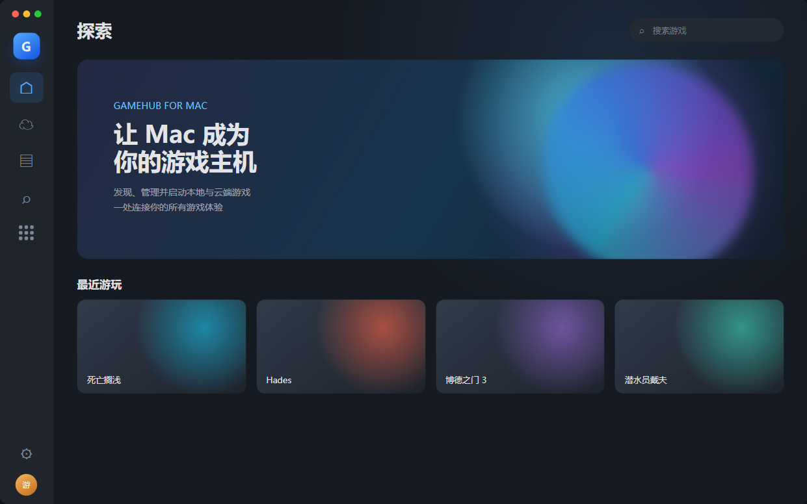 | ① macOS 26及以上在侧边栏显示九宫格图标，低版本隐藏。<br>② 入口仅显示图标，不显示固定名称；悬停提示“启动台”。<br>③ <mark><span style="color:#1677ff"><strong>点击后直接展示当前显示器的全部应用网格，不打开普通内容页，也不经过扫描页。</strong></span></mark><br>④ 退出后恢复进入前的盖世页面和侧边栏选中状态。 |
| F002 应用发现 | 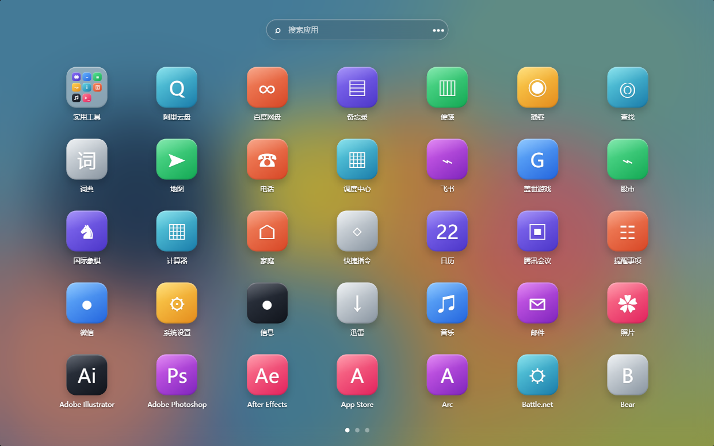 | ① 从 `/Applications`、`/System/Applications`、`/System/Applications/Utilities`、`~/Applications` 发现应用。<br>② 只展示可启动 `.app`，过滤 Helper、Updater、Renderer、Crash Handler、Uninstaller和后台服务。<br>③ Bundle ID相同按标准目录和可启动性去重；同名但Bundle ID不同的应用保留。<br>④ <mark><span style="color:#1677ff"><strong>用户进入后直接看到全部应用；后台发现和增量更新不展示骨架、进度或扫描文案。</strong></span></mark><br>⑤ 监听应用安装、卸载和路径变化；监听缺失时下次进入校正。 |
| F003 网格、分页与搜索 | <br>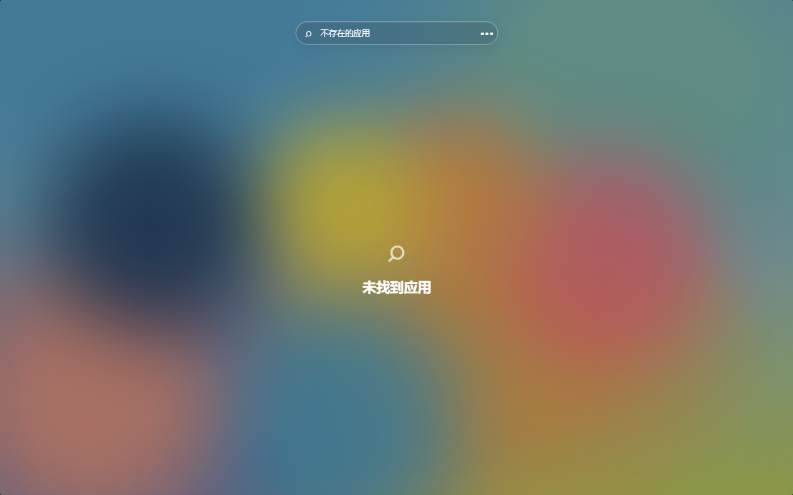 | ① 进入后直接展示全部应用，不显示“游戏/全部应用”页签。<br>② 使用应用原始图标和本地化名称；每页容量根据显示器空间计算。<br>③ 支持鼠标滚轮、触控板横滑、方向键和底部分页圆点切页。<br>④ 底部显示总页数和当前页；退出再进入时恢复上次页码。<br>⑤ 搜索覆盖所有页面和文件夹内应用，按名称包含匹配，不区分大小写和首尾空格。<br>⑥ 搜索结果展开为应用图标；<mark><span style="color:#1677ff"><strong>无结果只显示搜索图标和“未找到应用”，不显示结果数、当前搜索词说明或操作按钮；搜索词保留在输入框。</strong></span></mark><br>⑦ 有搜索词时Esc先清空，无搜索词时Esc退出。 |
| F004 文件夹与跨页整理 | <br>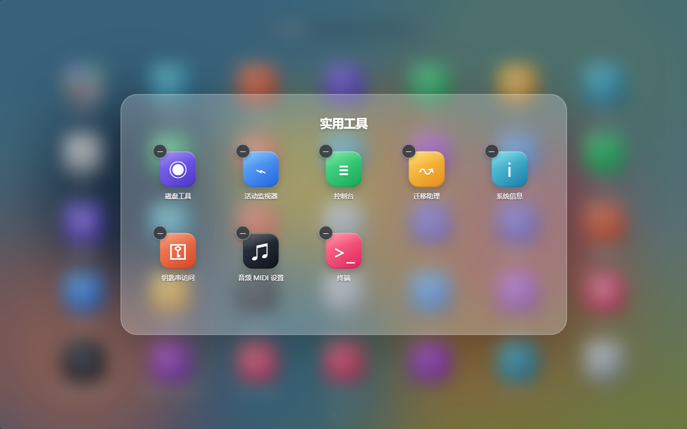 | ① <mark><span style="color:#1677ff"><strong>仅编辑态顶层应用可拖动。非编辑态静止长按650毫秒进入编辑，保持按压并继续移动即可在同一手势开始拖动。</strong></span></mark><br>② <mark><span style="color:#1677ff"><strong>拖到当前页空白槽位、应用间隙或应用卡片非图标中心区域时，按最近网格槽位调整人工全局顺序；落位后其他应用顺延补位，不创建文件夹。</strong></span></mark><br>③ <mark><span style="color:#1677ff"><strong>仅拖到另一应用或已有文件夹的图标中心命中区时执行归类：目标为应用则创建文件夹，目标为文件夹则移入。</strong></span></mark><br>④ 新文件夹直接替换目标应用槽位；拖动源从原槽位移除，两个应用合并为一个文件夹项，目标位置之后的应用依次前移一格。创建或移入后停留当前页，不自动打开文件夹。<br>⑤ <mark><span style="color:#1677ff"><strong>拖动进入左右边缘48px区域并停留500毫秒后，自动翻到相邻页；不显示“上一页/下一页”提示框，不要求在边缘松手。翻页后必须先离开边缘区，才能再次触发。</strong></span></mark><br>⑥ 首次布局按本地化名称升序生成；首次手动排序或归类后保存人工全局顺序，页内排序、跨页排序、创建、移入、移出和改名均不触发顶层名称重排。<br>⑦ `/System/Applications/Utilities`中的应用首次发现后默认归入“实用工具”。<br>⑧ 不显示独立改名按钮；点击文件夹名称直接编辑。名称去除首尾空格后为1—20个字符；Enter或失焦静默保存，Esc取消；空名称保留输入态，不覆盖原名称。<br>⑨ 文件夹封面以3×3展示等比方形应用缩略图，文件夹内应用保持完整图标比例。<br>⑩ 文件夹无右上角关闭按钮；每个应用左上角显示圆形“−”，点击后移出并放在文件夹后一位；点击外部模糊区域或按Esc关闭。文件夹只剩一个应用时自动解散。 |
| F005 启动与激活 | 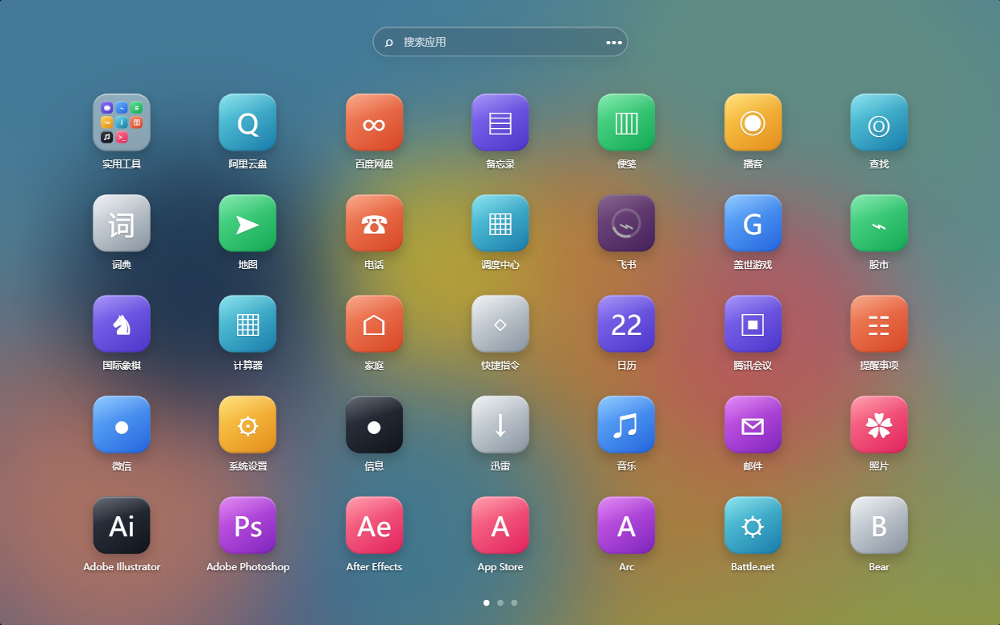 | ① 单击应用即发起启动，同一时间只允许一个请求。<br>② 调用 `NSWorkspace.openApplication` 打开未运行应用，通过 `NSRunningApplication` 激活已运行应用。<br>③ 启动中显示进度并阻止重复点击。<br>④ completion返回成功后目标应用置前，启动台退到后层并保留页码、文件夹状态。<br>⑤ Demo只提示已调用macOS，不在内部展示目标应用页面，也没有返回按钮。<br>⑥ 点击“盖世游戏”图标时激活盖世窗口。<br>⑦ <mark><span style="color:#1677ff"><strong>启动台不提供“启动失败”页面、重试条或失败模拟；系统无法打开应用时由macOS展示原生提示。</strong></span></mark><br>⑧ <mark><span style="color:#1677ff"><strong>`NSWorkspace`返回错误或请求超时后，立即恢复图标、解除单请求锁、保留原页和人工顺序，并上报失败或超时；用户可继续启动其他应用。</strong></span></mark> |
| F006 全局唤起 | 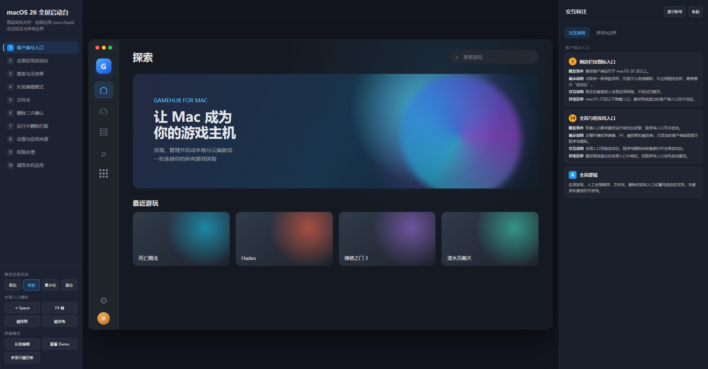 | ① 支持自定义全局快捷键、F4、触控板手势和一个屏幕触发角。<br>② 盖世前台、后台或最小化时均可唤起；盖世彻底退出后不可用。<br>③ 全局入口在鼠标指针所在显示器打开启动台。<br>④ 启动台已打开时再次触发，关闭启动台并恢复唤起前的应用。<br>⑤ 快捷键冲突时不保存；权限不足时仅禁用对应入口，侧边栏和其他入口继续可用。<br>⑥ 当前系统或设备无法捕获F4/手势时显示“不支持”。 |
| F007 设置与来源 | 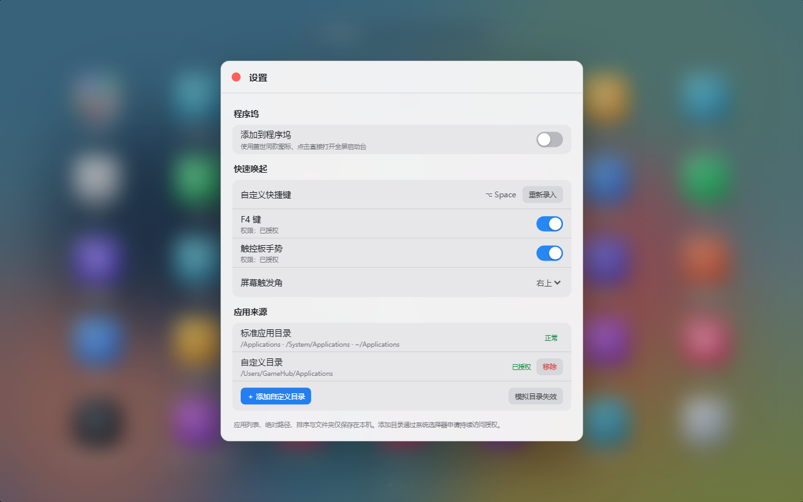 | ① 右上角更多菜单只包含“设置”和“退出”，固定图标列、文案列与快捷键列，“设置/退出”文案左对齐。<br>② <mark><span style="color:#1677ff"><strong>编辑态第一次点击“•••”只退出编辑，不展开菜单；退出后再次点击“•••”才展开菜单，再点击“设置”打开设置页。</strong></span></mark><br>③ 设置页按“程序坞→快速唤起→应用来源”排列；不提供“保持盖世后台驻留”设置。<br>④ “添加到程序坞”使用开关：打开执行添加，关闭执行移除；检测到用户从程序坞手动移除后，开关在1秒内同步为关闭。<br>⑤ 设置同时展示快捷键、F4、触控板、触发角、权限状态和应用来源。<br>⑥ 点击“去授权”打开对应系统设置，回到盖世后刷新状态。<br>⑦ 自定义目录通过系统目录选择器添加；同一路径不可重复添加。标准目录不可删除；自定义目录可移除，移除不卸载应用。<br>⑧ 目录无权限或已失效时提供“重新授权”和“移除”；所有设置变更立即保存并生效。 |
| F008 多显示器与状态 | 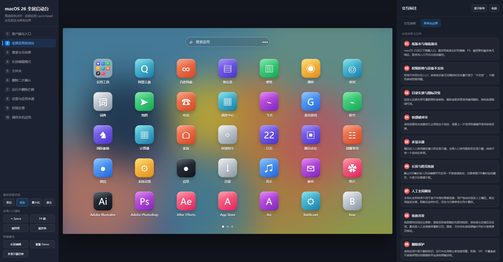 | ① 侧边栏进入时使用盖世窗口所在显示器；全局入口使用鼠标所在显示器。<br>② 同一时间只显示一个启动台；跨显示器触发时迁移现有窗口。<br>③ 显示器断开时迁移到主显示器并重新计算分页。<br>④ <mark><span style="color:#1677ff"><strong>直接展示、后台更新、无应用、搜索无结果、编辑、跨页拖动、删除确认、删除拦截、启动中、目录无权限、入口无权限和设备不支持均有明确状态。</strong></span></mark> |
| F011 长按编辑与删除 | 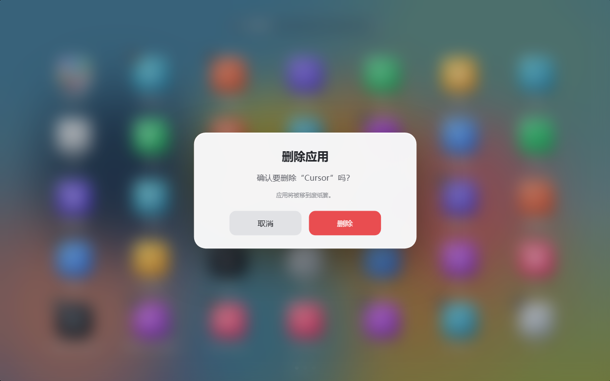<br>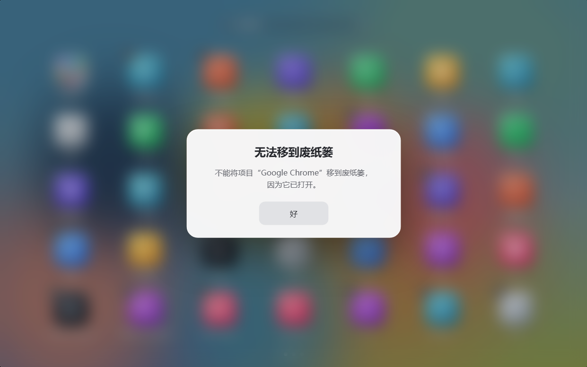 | ① 静止长按650毫秒进入编辑，图标轻微错峰抖动；进入编辑前位移超过6点则取消长按。<mark><span style="color:#1677ff"><strong>进入编辑后不要求松手重按，当前手势继续移动即可拖动原应用。</strong></span></mark><br>② 可删除的第三方应用左上角显示“−”；系统、受保护或无删除权限应用不显示。<br>③ 运行中的第三方应用仍显示“−”，点击时即时检查运行状态。<br>④ 未运行时使用收窄弹窗：主提示为“确认要删除‘XX’吗？”，下方辅助说明为“应用将被移到废纸篓。”；按钮为“取消”“删除”。<br>⑤ 已运行时提示“不能将项目‘XX’移到废纸篓，因为它已打开。”，只有“好”。<br>⑥ 用户确认时再次检查运行状态，并在移动完成前监听对应应用启动；检测到启动则中止，若文件已进入废纸篓则恢复原路径。<br>⑦ 运行态复核通过后移动 `.app` 到废纸篓并刷新分页。<br>⑧ 权限、SIP、只读卷、外置卷或恢复失败时保留图标和编辑模式，通过macOS系统弹窗或现有确认弹窗说明原因；恢复失败上报高优先级错误并触发删除功能熔断。 |
| F012 程序坞入口 | 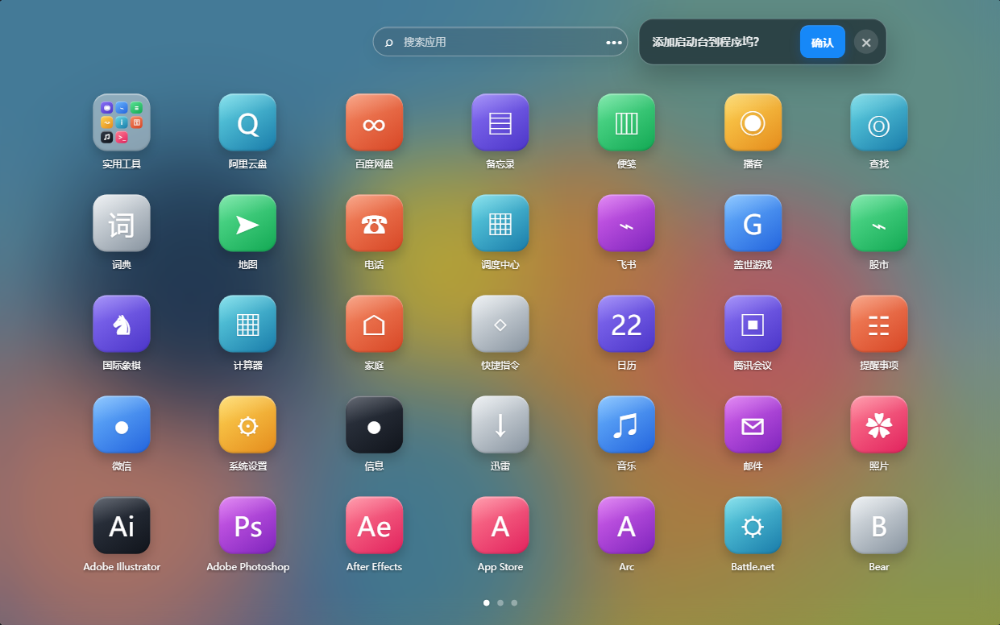 | ① <mark><span style="color:#1677ff"><strong>首次进入且尚未处理时，在搜索栏同行、更多按钮右侧展示一次引导。</strong></span></mark><br>② <mark><span style="color:#1677ff"><strong>引导采用macOS半透明深色卡片，只展示标题“添加启动台到程序坞？”、蓝色“确认”按钮和圆形关闭按钮；不展示左侧图标，不展示副标题。</strong></span></mark><br>③ 在用户处理前保持展示，不因翻页、搜索或文件夹自动消失；<mark><span style="color:#1677ff"><strong>点击关闭后引导直接消失，不显示Toast</strong></span></mark>；确认成功或关闭后不再自动展示，后续仅可在设置页通过开关添加或移除。<br>④ 独立图标点击后直接请求盖世打开全屏启动台；盖世未运行时先拉起盖世，再打开启动台。<br>⑤ 启动器不展示独立窗口，完成请求后退出；添加失败时保留入口并提示原因。<br>⑥ “确认后一键固定”属于技术准入项：排期前必须验证符合平台规则且稳定的实现方式；若只能修改Dock配置或重启Dock，不得上线伪成功，需返回产品重新确认手动保留方案。 |

### 4.3 公共规则

| 编号 | 规则 |
|---|---|
| BR-01 | 本功能仅在macOS 26及以上显示；低版本不展示入口。 |
| BR-02 | 未登录也可使用；网络不可用不影响扫描、文件夹、搜索和启动。 |
| BR-03 | 启动台只展示本机可启动应用，不混入商城、云游戏、租号、网页链接、推荐和广告。 |
| BR-04 | <mark><span style="color:#1677ff"><strong>首次布局按当前客户端语言的本地化名称升序生成，系统“实用工具”文件夹固定在首位；用户首次整理后改为人工全局顺序，页内和跨页槽位均持久化，不因应用或文件夹改名、成员变化重新排序。</strong></span></mark> |
| BR-05 | <mark><span style="color:#1677ff"><strong>新安装应用追加到全局布局末尾；卸载应用删除对应槽位，后续项目自然补位；应用改名只更新名称。</strong></span></mark> |
| BR-06 | 分辨率变化只按新容量重新分页，不改变人工全局顺序和文件夹归属；页数减少时把当前页校正为最后一个有效页。 |
| BR-07 | 人工全局顺序、文件夹、来源和设置仅保存在本机，不同步账号。 |
| BR-08 | 不静默申请或修改系统权限；权限只在用户启用对应功能时申请。 |
| BR-09 | 国内与海外功能逻辑一致；海外包界面跟随现有语言设置，英文产品名为GameHub。 |
| BR-10 | <mark><span style="color:#1677ff"><strong>删除只移动应用包到废纸篓，不删除配置、存档、缓存和账号数据；所有删除入口都必须先判断可删除性并二次确认。</strong></span></mark> |
| BR-11 | <mark><span style="color:#1677ff"><strong>快捷键、F4、触控板和触发角仅在盖世运行或后台驻留时可用；程序坞入口可在盖世退出时冷启动。</strong></span></mark> |
| BR-12 | 程序坞启动器与盖世App使用同款图标；国内名为“盖世启动台”，海外名为“GameHub Launchpad”。 |
| BR-13 | <mark><span style="color:#1677ff"><strong>启动台不使用产品内Toast。成功操作通过图标、顺序、开关、弹层或页面状态变化表达；删除失败使用苹果风弹窗，权限与目录异常使用行内状态，应用打开失败交给macOS系统提示。</strong></span></mark> |

### 4.4 状态与异常

| 场景 | 展示 | 用户操作 |
|---|---|---|
| 首次进入 | <mark><span style="color:#1677ff"><strong>直接展示全部应用，不显示扫描、骨架或进度</strong></span></mark> | 立即浏览、搜索、归类和启动 |
| 后台应用更新 | 保留现有应用，后台更新 | 正常浏览、归类和启动 |
| 无可启动应用 | “未找到可启动应用” | 打开设置检查应用来源 |
| 搜索无结果 | 只显示搜索图标和“未找到应用”；搜索词保留在输入框 | 修改关键词或按Esc清空 |
| 应用启动中 | 当前图标显示进度 | 等待；禁止重复启动 |
| 系统无法打开应用 | 启动台恢复图标并解除单请求锁，不新增失败页或重试条 | 由macOS展示原生提示；用户可启动其他应用 |
| 自定义目录无权限 | 目录标记异常 | 重新授权或移除 |
| 图标读取失败 | 系统通用图标 | 正常启动应用 |
| 快捷键冲突 | 冲突提示 | 重新录入快捷键 |
| F4/触控板未授权 | 对应入口关闭 | 去授权或使用其他入口 |
| 设备不支持 | 显示“不支持” | 使用快捷键或侧边栏 |
| 盖世已彻底退出 | 全局入口无响应 | 重新打开盖世客户端 |
| 编辑模式 | 图标轻微抖动；可删除应用显示“−” | 点击空白或按Esc退出 |
| 跨页拖动 | <mark><span style="color:#1677ff"><strong>不显示上一页/下一页提示框；拖动浮层持续跟手</strong></span></mark> | 进入有效边缘停留500毫秒自动翻页；离开边缘后才可再次触发；Esc取消 |
| 删除确认 | 主提示“确认要删除‘XX’吗？”，辅助说明“应用将被移到废纸篓。” | 取消或删除 |
| 删除运行中应用 | “不能将项目‘XX’移到废纸篓，因为它已打开。” | 点击“好”返回编辑模式 |
| 删除失败 | 保留应用和编辑模式，展示系统原因 | 关闭提示后继续操作 |
| 程序坞首次引导 | 搜索栏同行仅展示标题、蓝色确认和圆形关闭按钮；无图标、无副标题 | 确认添加或关闭引导 |
| 程序坞添加失败 | 保留引导和设置入口，展示失败原因 | 重试或关闭 |

### 4.5 输入与编辑规则

| 输入项 | 规则 |
|---|---|
| 搜索词 | 不限制普通字符和emoji；去除首尾空格后匹配；不保存搜索历史 |
| 文件夹名称 | 1—20个字符；去除首尾空格；超出时禁止继续输入；空值不可保存 |
| 全局快捷键 | 必须包含Command、Option、Control或Shift中的至少一个；系统保留组合和盖世已占用组合不可保存 |
| 自定义目录 | 通过系统目录选择器选择；同一路径不可重复；需要持续访问授权 |
| 程序坞首次引导 | 不接受文本输入；用户确认或关闭后记录本机状态，不再自动出现 |

### 4.6 交互状态优先级

启动台按以下顺序处理 Esc，同一次按键只处理一个层级：

1. <mark><span style="color:#1677ff"><strong>删除确认或删除拦截弹窗已打开：关闭弹窗并返回编辑模式。</strong></span></mark>
2. 设置弹窗、更多菜单或权限说明已打开：关闭最上层弹层。
3. 正在编辑文件夹名称：取消本次编辑并恢复原名称。
4. 正在进行应用拖放：取消本次拖放，不改变人工顺序和文件夹归属。
5. 编辑模式已打开：退出抖动状态，不启动应用。
6. 文件夹已打开：关闭文件夹层，返回原页面。
7. 搜索有内容：清空搜索并恢复原页面与布局。
8. 应用正在启动：本次Esc不处理，等待macOS完成调用。
9. 以上状态均不存在：退出启动台并恢复唤起前的应用。

应用拖放判定：

- <mark><span style="color:#1677ff"><strong>仅编辑态顶层应用可作为拖动源。长按达到650毫秒后，当前按压手势继续移动即可开始拖动。</strong></span></mark>
- <mark><span style="color:#1677ff"><strong>只有指针进入另一顶层应用或已有文件夹的图标中心命中区时，才创建或移入文件夹。</strong></span></mark>
- 创建或移入成功后停留当前页，不自动打开文件夹；用户再次点击文件夹后才打开。
- <mark><span style="color:#1677ff"><strong>指针落在空白槽位、应用间隙或卡片非图标中心区域时，按最近网格槽位调整人工全局顺序；不创建文件夹。</strong></span></mark>
- <mark><span style="color:#1677ff"><strong>指针进入有效左/右边缘并停留500毫秒后自动翻到相邻页，不显示提示框，也不要求松手。翻页后保持拖动，离开边缘后才可再次触发。</strong></span></mark>
- 首页面向左、末页面向右不触发翻页；搜索结果、文件夹层、设置、权限和删除弹窗打开时不接受顶层拖动。
- 窗口外、指针取消、窗口失焦或按Esc时取消，不改变人工全局顺序和文件夹归属。
- 拖放期间冻结当前网格，应用扫描、卸载、分辨率和显示器变化先进入待处理队列。
- 如果拖动源或当前命中目标在队列中被卸载：先取消拖放，不落位，再应用全部待处理变化。
- 如果待处理变化与拖动源和命中目标无关：先按拖动开始时的快照完成落位，再按“新应用追加末尾、卸载项删除”的规则应用队列。
- 拖放结束或取消后应用待处理变化，再按人工全局顺序重分页并校正页码，不按名称重排；“跨页后项目总数不变”仅在待处理队列为空时比较拖动前后。
- 页数减少时，当前页自动收敛到最后一个有效页。
- <mark><span style="color:#1677ff"><strong>按下应用后，指针在650毫秒内移动超过6点则取消长按计时；未超过阈值且达到650毫秒才进入编辑模式。进入后保留当前指针会话，后续位移超过6点立即开始拖动。</strong></span></mark>

### 4.7 应用身份与本地数据校正

应用唯一身份按以下优先级确定：

1. 签名团队标识与Bundle ID组合；
2. Bundle ID；
3. 文件系统稳定标识；
4. 规范化绝对路径哈希。

同一身份存在多个副本时，系统应用目录优先于普通应用目录，普通应用目录优先于用户目录，自定义目录优先级最低；同一目录层级保留版本较新的可启动副本。

- 应用路径变化但身份不变：继承原人工槽位和文件夹归属。
- 应用升级但身份不变：更新名称、图标和路径，不改变人工槽位。
- 无稳定身份且路径变化：旧记录失效，新路径按新应用处理。
- 应用卸载：从当前网格移除；本地失效记录保留7天，用于短期重装时恢复文件夹归属，7天后清理。
- <mark><span style="color:#1677ff"><strong>同一身份存在多个副本时，删除只处理当前展示的最高优先级副本；若还有可启动副本，次级副本继承原槽位重新出现。每个副本必须分别确认，不批量删除。</strong></span></mark>
- 自定义目录授权使用系统持续访问凭证保存；凭证失效时只隔离该来源。

### 4.8 全局入口权限与单实例状态

| 入口 | 目标行为 | 权限与技术验收 | 失败处理 |
|---|---|---|---|
| 自定义快捷键 | 盖世后台时可唤起 | 验证系统保留键、盖世快捷键和第三方冲突 | 冲突不保存，保留原快捷键 |
| F4 | 支持的键盘可唤起 | 技术预研明确键盘型号、系统权限和系统功能冲突 | 未授权显示“去授权”；无法捕获显示“不支持” |
| 触控板 | 支持的触控板手势可唤起 | 技术预研明确设备、手势、权限和误触范围 | 未授权显示“去授权”；设备不支持时不可开启 |
| 触发角 | 指针停留指定角后唤起 | 验证多显示器、系统触发角冲突和误触 | 冲突时提示更换位置或关闭 |
| 程序坞图标 | 点击直接进入全屏启动台 | 验证轻量启动器签名、安装位置、本地IPC和冷启动参数 | 盖世退出时先启动盖世；添加或唤起失败时提示原因 |

启动台只允许一个实例，状态依次为“已关闭→打开中→已打开→跨屏迁移中→关闭中”。

- 500毫秒内重复触发只响应第一次。
- 打开中、关闭中和迁移中收到新触发时不反向执行，动画完成后才接受下一次触发。
- 已打开时收到有效触发，进入关闭流程。
- 记录唤起前的前台应用；退出时优先恢复该应用。原应用已关闭或原显示器已断开时，恢复盖世客户端窗口。

### 4.9 远程开关与灰度

不新增运营后台页面，复用盖世现有远程配置能力。开关至少支持以下维度：

- 国内包/海外包；
- 客户端版本和渠道；
- Intel/Apple Silicon；
- 侧边栏入口、快捷键、F4、触控板、触发角分别开关；
- <mark><span style="color:#1677ff"><strong>程序坞一次性引导、设置入口和冷启动入口分别开关；关闭冷启动入口时不得移除用户已有程序坞图标，仅提示当前版本不可用。</strong></span></mark>
- <mark><span style="color:#1677ff"><strong>编辑模式和删除能力分别设置开关；关闭删除时不显示“−”，文件夹拖放和名称编辑继续可用。</strong></span></mark>
- 灰度用户比例。

关闭侧边栏总开关时，启动台入口和全部全局监听同时关闭；关闭单一入口时不影响其他入口。本地已保存的文件夹不清理，重新开启后恢复。

删除功能按“内部测试 → 5% → 20% → 50% → 全量”独立放量，每阶段至少观察7天。进入下一阶段要求删除系统应用事件为0、自动恢复失败为0、删除失败率≤1%、误删投诉人数/删除成功人数＜0.1%。不满足时关闭删除开关，不影响启动台其他能力。

程序坞入口在20%阶段观察7天：引导添加率≥10%、添加用户D7程序坞入口重复使用率≥20%、入口打开成功率≥98%时继续放量；不满足时关闭引导和设置入口，保留启动台其他入口。

## 五、非功能需求

| 需求类型 | 详细要求 |
|---|---|
| 性能 | <mark><span style="color:#1677ff"><strong>进入后直接可操作P95≤500ms，不出现用户可见扫描页</strong></span></mark>；搜索刷新P95≤100ms；程序坞冷启动到启动台可操作P95≤3s |
| 流畅度 | 200个应用、20页以内切页和文件夹拖放无明显阻塞；正常目标60fps |
| 局部渲染 | <mark><span style="color:#1677ff"><strong>拖动应用时只更新拖动浮层、源应用透明度和命中反馈，壁纸、搜索栏、分页圆点及未受影响应用保持固定；创建/移入文件夹只更新源槽位、目标槽位和必要分页；打开设置、菜单、文件夹或确认弹窗只增删对应浮层。仅主动翻页、搜索结果变化或页容量变化允许重绘应用网格，禁止因此重建整屏。</strong></span></mark> |
| 稳定性 | 连续100次进入/退出无残留全屏窗口；单目录失败不影响其他来源 |
| 兼容性 | macOS 26及以上；Intel和Apple Silicon范围与盖世主版本一致 |
| 权限 | 按需申请辅助功能、输入监控和目录访问；拒绝后保留侧边栏入口 |
| 隐私 | 应用列表、绝对路径和文件夹只保存在本机；不上传原始Bundle ID |
| 可访问性 | 应用、文件夹、搜索、分页和设置均支持键盘焦点；应用名称可被辅助功能读取 |
| 多语言 | 国内包中文固定；海外包跟随现有语言设置；应用名称读取应用自身本地化值 |
| 离线 | 无网络时完整支持扫描、文件夹、搜索、设置和应用启动 |
| 删除安全 | 删除前后各检查一次运行状态；移动失败不移除图标；不修改应用包外的用户数据 |
| 程序坞安全 | 不静默重启Dock，不调整其他程序坞项目，不破坏用户排序；启动器与主包使用同一签名团队 |

## 六、埋点需求

### 6.1 埋点事件表

| 事件ID | 事件名称 | 触发时机 | 关键参数 |
|---|---|---|---|
| `launcher_entry_trigger` | 启动台唤起 | 任一入口触发 | `entry_type`, `app_state`, `permission_state` |
| `launcher_ready` | 启动台可操作 | 应用网格可操作 | `has_cache`, `duration_ms`, `app_count`, `page_count` |
| `launcher_page_change` | 页面切换 | 页码发生变化 | `from_page`, `to_page`, `method` |
| `launcher_search` | 搜索刷新 | 搜索结果变化 | `keyword_length`, `result_count` |
| `launcher_folder_action` | 文件夹操作 | 创建、名称编辑、移入、移出、关闭或解散 | `action`, `app_count` |
| `launcher_layout_change` | 人工顺序变化 | 应用成功跨页移动 | `action`, `from_page`, `to_page`, `source_index`, `target_index` |
| `launcher_app_launch` | 发起应用启动 | 点击应用或按Enter | `bundle_id_hash`, `is_running`, `source` |
| `launcher_app_launch_result` | 应用启动结果 | 成功、失败或超时 | `bundle_id_hash`, `result`, `error_code`, `duration_ms` |
| `launcher_source_change` | 应用来源变化 | 添加、移除或重新授权目录 | `action`, `result` |
| `launcher_permission_action` | 权限操作 | 启用入口或去授权 | `permission_type`, `action`, `result` |
| `launcher_exit` | 退出启动台 | 任一退出方式 | `exit_method`, `session_duration_sec` |
| `launcher_edit_enter` | 进入编辑模式 | 长按达到650毫秒 | `source`, `app_count`, `deletable_count` |
| `launcher_delete_click` | 点击删除标识 | 点击应用左上角“−” | `bundle_id_hash`, `app_running`, `source` |
| `launcher_delete_result` | 删除结果 | 取消、拦截、成功或失败 | `bundle_id_hash`, `result`, `reason`, `app_running` |
| `launcher_dock_guide_action` | 程序坞引导操作 | 引导曝光、确认或关闭 | `action`, `result` |
| `launcher_dock_open_result` | 程序坞入口结果 | 图标点击后成功进入或失败 | `result`, `reason`, `app_state`, `duration_ms` |

### 6.2 埋点参数表

| 参数名 | 类型 | 必填 | 说明 | 枚举/示例 |
|---|---|---|---|---|
| `entry_type` | string | 是 | 唤起入口 | `sidebar`, `shortcut`, `f4`, `trackpad`, `hot_corner`, `dock` |
| `app_state` | string | 是 | 盖世状态 | `foreground`, `background`, `minimized`, `quit` |
| `permission_state` | string | 否 | 对应入口权限 | `granted`, `denied`, `unsupported`, `not_required` |
| `method` | string | 否 | 页面切换方式 | `wheel`, `trackpad`, `keyboard`, `dot`, `edge_drop` |
| `action` | string | 否 | 操作类型 | 按事件定义枚举 |
| `result` | string | 否 | 操作结果 | `success`, `fail`, `timeout`, `cancel` |
| `bundle_id_hash` | string | 否 | 应用标识哈希 | 不上传原始Bundle ID |
| `app_running` | boolean | 否 | 删除或启动时应用是否运行 | `true`, `false` |
| `reason` | string | 否 | 失败或拦截原因 | `running`, `permission`, `sip`, `readonly_volume`, `external_volume`, `restore_failed`, `dock_unsupported`, `ipc`, `launch_timeout`, `unknown` |
| `source` | string | 否 | 操作所在位置 | `top`, `folder`, `search` |

## 七、运营与发布需求

- 不需要运营配置、素材和后台页面。
- 上线前由产品和测试准备不少于30个应用、3页以上、多个文件夹和多显示器验收环境。
- <mark><span style="color:#1677ff"><strong>删除验收机需同时准备系统应用、普通第三方应用、运行中第三方应用、只读卷或模拟权限失败应用；不得在个人生产设备删除真实业务应用。</strong></span></mark>
- <mark><span style="color:#1677ff"><strong>程序坞验收需覆盖首次确认、关闭、设置重新添加、用户手动移除、盖世前台/后台/退出三类状态。</strong></span></mark>
- F4、触控板和触发角技术预研未通过时，不得用无响应入口替代；需在版本评审中明确不支持设备范围。
- 放量顺序：内部测试7天 → 5%灰度7天 → 20%灰度7天 → 50%灰度 → 全量。每阶段由产品、Mac客户端、测试和数据共同确认。
- 进入下一阶段的质量门槛：无P0/P1缺陷；启动台打开成功率≥98%；应用启动成功率≥98%；应用覆盖率≥95%；程序坞入口成功率≥98%；无错误删除或用户数据清理；无持续全屏窗口残留；全局入口误触反馈率＜0.5%。
- 出现全屏窗口残留、频繁误触发或大面积应用遗漏时，通过远程总开关隐藏侧边栏入口并停用全局监听；单一入口异常时只关闭对应入口。

## 八、验收标准

### 8.1 入口与全屏

- macOS 26及以上只显示九宫格图标入口；无固定文字名称，悬停显示“启动台”。
- 点击入口在盖世窗口所在显示器打开全屏启动台。
- <mark><span style="color:#1677ff"><strong>点击侧边栏入口后直接出现全部应用网格，不经过扫描、骨架或进度页。</strong></span></mark>
- 全局入口在盖世前台、后台和最小化时可用，彻底退出后不可用。
- <mark><span style="color:#1677ff"><strong>程序坞图标点击后直接进入全屏启动台；盖世彻底退出时先启动盖世，再进入启动台。</strong></span></mark>
- 启动台已打开时再次触发或按Esc，可退出并恢复唤起前的应用。

### 8.2 应用发现与展示

- 四个标准目录和已授权自定义目录中的可启动应用可被展示。
- Helper等辅助程序不展示；Bundle ID相同应用不重复。
- <mark><span style="color:#1677ff"><strong>首次进入和后台更新均不出现用户可见扫描状态；部分来源失败和图标失败不阻塞网格。</strong></span></mark>
- 应用安装、卸载和路径变化后列表可自动或在下次进入时校正。

### 8.3 分页、搜索与文件夹

- 应用按显示器容量横向分页，页码圆点和当前页一致。
- 滚轮、触控板、键盘和圆点均可切页。
- 搜索覆盖所有页面及文件夹内应用；按Esc后恢复原页和布局；<mark><span style="color:#1677ff"><strong>无结果页只显示搜索图标与“未找到应用”，不显示结果数、当前搜索词说明或操作按钮。</strong></span></mark>
- 首次布局按本地化名称升序生成；用户整理后以人工全局顺序为准。新应用追加末尾，卸载后自然补位，改名不重排。
- <mark><span style="color:#1677ff"><strong>同一长按手势进入编辑并继续拖动后，可落到当前页空白槽位调整顺序；项目总数和文件夹数不变，其他应用按槽位补位。</strong></span></mark>
- <mark><span style="color:#1677ff"><strong>只有命中另一应用或已有文件夹的图标中心时才创建或移入文件夹；卡片名称区、间隙和空白槽位不得误建夹。</strong></span></mark>
- <mark><span style="color:#1677ff"><strong>拖到左右有效边缘停留500毫秒后自动逐页翻页，页面中无上一页/下一页提示框；翻页后拖动浮层仍存在，离开边缘后才可再次翻页。</strong></span></mark>
- 点击文件夹名称直接编辑，保存后仅更新名称；3×3缩略图和文件夹内图标完整可见。
- 文件夹不显示右上角关闭；应用左上角“−”用于移出；外部模糊区域和Esc可关闭。

### 8.4 编辑与删除

- 静止长按应用650毫秒后进入编辑模式，应用轻微抖动；位移超过6点时不进入编辑模式；达到时长后同一手势继续移动即可拖动。
- 仅编辑态顶层应用可拖动；首尾无效方向不触发，搜索、文件夹和弹窗状态不接受顶层拖动。
- <mark><span style="color:#1677ff"><strong>编辑态第一次点击“•••”只退出编辑且菜单不出现；第二次点击后菜单出现。交互前后启动台根页面、壁纸、搜索栏和分页容器节点保持不变。</strong></span></mark>
- <mark><span style="color:#1677ff"><strong>标注编号默认隐藏，“显示标号”按钮可手动开启；启动台DOM与全部操作链路中不存在产品内Toast。</strong></span></mark>
- 普通第三方应用显示“−”；系统、受保护和无删除权限应用不显示。
- 运行中的第三方应用仍显示“−”，点击后展示只有“好”的运行中拦截弹窗。
- 未运行应用点击“−”后展示“取消”“删除”二次确认，文案与F011一致。
- 点击“删除”时再次检查运行状态；检查通过后应用包进入废纸篓，图标移除并重新分页。
- 运行态竞态、权限、SIP、只读卷和外置卷失败时不移除图标，不退出编辑模式，并展示原因。
- 删除后应用配置、存档、缓存和账号数据保持不变。
- 顶层、搜索结果和文件夹内应用均可长按进入编辑；搜索结果删除后为0时展示无结果页，文件夹剩1个应用时自动解散，页数减少时落到最后一个有效页。
- 同一应用多副本场景只删除当前展示副本；次级副本重新出现属于正确结果，必须再次确认才能继续删除。

### 8.5 启动、权限与异常

- 未运行应用通过NSWorkspace被启动，已运行应用被激活，同一时间只有一个启动请求。
- <mark><span style="color:#1677ff"><strong>启动成功后目标应用在macOS中置前；Demo不展示内部目标应用页和返回按钮。</strong></span></mark>
- 启动台不提供启动失败页、失败模拟或重试条；系统无法打开应用时由macOS展示原生提示。
- `NSWorkspace`错误或超时后恢复图标、解除单请求锁、保留原页和人工顺序，并上报失败结果；不因移除失败页而卡在启动中。
- 快捷键冲突不能保存；权限拒绝只影响对应入口。
- F4或触控板在设备不支持时显示“不支持”。
- 自定义目录失效后可重新授权或移除，其他来源继续可用。
- 多显示器插拔和分辨率变化后启动台可恢复，文件夹归属不丢失。
- 搜索、文件夹拖放、文件夹名称编辑、设置和启动中状态下，Esc按4.6规定的优先级执行。
- 应用拖放期间发生应用卸载、扫描更新、分辨率变化或显示器断开时，网格冻结；源或命中目标被卸载时先取消拖放再应用队列，其他变化在落位后应用；最后按人工全局顺序重建分页，且当前页不越界。
- 多入口同时触发、连续触发或跨屏迁移时只存在一个启动台实例，最终状态符合4.8。
- 应用升级、移动、卸载和7天内重装后，文件夹归属按4.7规则继承或清理。

### 8.6 程序坞引导与入口

- 首次进入且尚未处理时，引导显示在搜索栏同行、更多按钮右侧，只含标题“添加启动台到程序坞？”、蓝色“确认”和圆形关闭；不显示图标和副标题。
- 用户处理前保持展示，确认成功或关闭后不再自动出现；关闭后仅在设置页通过“添加到程序坞”开关重新添加。
- 确认成功后设置页开关同步为开启；关闭引导不改变设置页开关当前值。
- 用户从程序坞移除图标后，设置页开关恢复关闭，一次性引导不重复出现。
- 每次打开设置、客户端重新激活或程序坞添加完成后检查一次固定状态，1秒内更新开关；重复打开开关先检查现状，已存在时只同步为开启，不得插入重复图标。
- 添加失败不修改其他程序坞项目和排序，不静默重启Dock；引导或设置入口保留并提示原因。
- 程序坞图标点击后不展示启动器独立窗口；盖世已运行时直接IPC唤起，退出时先冷启动。
- 一键固定没有符合平台规则的稳定实现时，F012验收阻塞；不得把Demo成功状态当作原生能力通过，也不得未确认就改成手动拖入。

### 8.7 灰度与熔断

- 各地区、版本、渠道、芯片和入口开关可独立生效。
- 远程关闭单一入口后停止对应监听，其他入口继续可用。
- 远程关闭总开关后，侧边栏入口和全部全局监听均关闭，本地文件夹和设置数据保留。
- 灰度阶段数据达到质量门槛后才可继续放量。

## 九、原生技术预研

正式排期前必须输出可运行验证结果：

1. F4、触控板和触发角在macOS 26上的捕获方式、权限、误触和设备兼容范围；
2. 盖世前台、后台、最小化和彻底退出四种状态下的入口行为；
3. 自定义目录持续授权和目录移动、删除后的处理；
4. 对应用发现所得精确URL调用 `NSWorkspace.openApplication(at:configuration:completionHandler:)`；仅当completion无错误且返回应用实例有效时记成功并激活，覆盖Gatekeeper拒绝、同Bundle ID多副本和超时；
5. 多显示器全屏窗口迁移与分辨率变化；
6. 200个以上应用的图标缓存、分页和文件夹拖放性能；
7. 应用安装、卸载、重复副本和Bundle ID缺失场景。
8. 长按650毫秒和6点位移阈值在鼠标、触控板下与文件夹拖放的仲裁；
9. `NSRunningApplication` 在点击删除和确认删除两个时点的复核，以及检查后应用启动的竞态；
10. 系统应用、SIP、沙盒、只读卷和外置卷下移动 `.app` 到废纸篓的能力与错误码；
11. 轻量程序坞启动器的安装位置、同团队签名、版本更新、本地IPC、冷启动参数和符合平台规则的固定方式；
12. 用户移除程序坞图标后的状态检测，不得通过重启Dock或覆盖用户配置实现。
13. macOS没有公开稳定的一键固定Dock API时，形成书面技术结论和可选替代方案，返回产品决策后再排期。

## 十、来自功能上线后的更新

上线后记录入口成功率、用户反馈、设备不支持范围和技术降级项。

## 十一、自检记录

- 已补充初始名称排序、人工全局顺序、跨页移动、分页容量变化、空状态、加载状态和搜索无结果。
- 已补充文件夹名称和快捷键输入规则、操作失败和文件夹拖放取消。
- 已补充应用安装/卸载实时更新、重复应用和极端应用数量。
- 已补充辅助功能、输入监控和自定义目录授权的按需申请与拒绝降级。
- 已补充未登录、离线、国内/海外、多语言和隐私差异。
- 已补充多显示器、盖世彻底退出、设备不支持和入口冲突。
- 已补充Esc状态优先级、文件夹拖放、扫描并发冻结和页码校正。
- V2.1曾删除跨页搬动；<mark><span style="color:#1677ff"><strong>V2.5按最新需求恢复编辑态相邻页移动，并补充人工全局顺序和埋点。</strong></span></mark>
- 已补充应用稳定身份、路径移动、卸载重装和本地失效记录清理规则。
- 已补充全局入口权限验收、单实例状态机、触发防抖和焦点恢复。
- 已补充远程分入口开关、灰度步骤、质量门槛和熔断规则。
- <mark><span style="color:#1677ff"><strong>V2.2已删除用户可见扫描过程、无结果清空按钮、文件夹独立改名按钮和Demo内部目标应用页。</strong></span></mark>
- <mark><span style="color:#1677ff"><strong>V2.2已补充长按抖动、删除标识、两类删除弹窗、删除竞态与失败分支、文件夹完整缩略图、NSWorkspace原生打开和程序坞冷启动入口。</strong></span></mark>
- V2.3曾补充文件夹右上角关闭；<mark><span style="color:#1677ff"><strong>V2.5删除右上角关闭，保留外部区域和Esc关闭，移出改为应用左上角“−”。</strong></span></mark>
- V2.4已将文件夹固定在目标槽位并修正等比缩略图；程序坞引导仅保留标题、确认和关闭；更多菜单删除程序坞项。
- <mark><span style="color:#1677ff"><strong>V2.5删除后台驻留设置、产品内启动失败页和无结果冗余文案；菜单对齐并增加编辑态设置拦截。</strong></span></mark>
- 本需求仅C端，不输出B端配置；不涉及运营后台增删查改。

## 十二、模拟评审记录

| 角色 | 结论 | 发现的问题 |
|---|---|---|
| Mac客户端开发 | 已补充硬伤 | 全局入口技术门槛、应用稳定身份、Esc和文件夹拖放状态不完整 |
| 测试工程师 | 已补充硬伤 | 文件夹拖放期间扫描/卸载/显示器变化并发、多个入口重复触发与焦点恢复 |
| 运营/业务方 | 已补充硬伤 | F006放量条件不明确、缺少按入口和版本的远程开关、灰度门槛不可执行 |

已自动补充的硬伤：

- 在4.6补充Esc优先级、文件夹拖放命中和操作期间网格冻结；
- 在4.7补充应用身份、路径移动、卸载重装和失效记录；
- 在4.8补充入口权限验收、单实例状态、防抖和焦点恢复；
- 在4.9和第七章补充远程开关、灰度阶段、质量门槛和熔断。

待后续技术评审确认的建议：

- 符号链接循环、移动磁盘离线和扫描中撤销目录授权的缓存保留时间；
- 国内与海外分别设置D7、D30继续投入门槛；
- 海外埋点隐私声明和全部目标语言的权限引导文案验收。

### 12.1 V2.1 范围收敛复审

| 角色 | 结论 | 本轮发现与处理 |
|---|---|---|
| Mac客户端开发 | ✅ 通过 | 已限制仅顶层应用可作为文件夹拖放源；文件夹、文件夹内应用和搜索结果均不可拖动，避免无效交互与误删。 |
| 测试工程师 | ✅ 通过 | 已补充顶层与文件夹内名称排序、同名稳定主键兜底、空白/边缘落点不改变顺序和文件夹拖放取消规则。 |
| 产品/业务方 | ✅ 通过 | 已统一删除自由排序、页内换位、跨页搬动及对应埋点；Demo、PRD与设计说明口径一致。 |

已自动补充的硬伤：

- `BR-04`明确系统“实用工具”固定首位，其余顶层应用与用户文件夹按当前客户端语言混排，同名按稳定应用主键排序；
- F004明确只有顶层应用可拖，拖放只创建或移入文件夹；
- V2.1曾要求创建、移入、移出和重命名后统一执行名称排序；该规则已被V2.4“目标槽位原位建夹、用户布局持久化”替代。文件夹、文件夹内应用和搜索结果仍不可作为拖动源。
- 静态验收保留拖动源范围与安全移入检查，并在V2.4增加目标槽位、列表收缩及布局不跳位检查。

待研发实现阶段验证的建议：

- 在原生客户端自动化测试中补充真实指针拖放用例，覆盖“合法建文件夹、合法移入、空白/边缘落点不换位、文件夹不可作为拖动源”。

### 12.2 V2.2 编辑、删除与程序坞入口复审

| 角色 | 结论 | 本轮发现与处理 |
|---|---|---|
| Mac客户端开发 | ⚠️ 已补充技术准入门槛 | 一键固定程序坞缺少公开稳定API；已明确技术预研未通过时F012阻塞，不得修改Dock配置、重启Dock或伪报成功。删除运行态检查存在竞态；已补充移动期间监听、恢复原路径和熔断规则。NSWorkspace改为按精确URL调用并以completion结果判定。 |
| 测试工程师 | ✅ 硬伤已补齐 | 已规定程序坞状态检查触发点、1秒刷新和幂等；已明确同一应用多副本只删除当前副本，次级副本可重新出现并需再次确认；补充搜索、文件夹和分页删除后的落点。 |
| 运营/业务方 | ✅ 硬伤已补齐 | 删除确认增加数据保留说明；编辑和删除新增独立开关、7天灰度周期、失败率与投诉率门槛；程序坞入口增加添加率、D7重复使用率和成功率门槛。 |

已自动补充的硬伤：

- F011补充用户数据保留说明、确认前后运行态竞态、移动期间监听、恢复和熔断；
- F012和第九章补充程序坞公开能力限制与排期准入门槛；
- 4.7和8.4补充多副本删除、搜索无结果、文件夹解散和页码校正；
- 4.9和第七章补充删除独立灰度、程序坞业务门槛和远程开关；
- 8.6补充程序坞状态检测时机、幂等和用户手动移除后的刷新规则。

待技术预研确认：

- 是否存在符合平台规则且稳定的一键固定程序坞实现。未通过前，Demo仅表达目标体验，不能作为原生能力验收通过。

### 12.3 V2.3 文件夹与程序坞引导复审

| 角色 | 结论 | 本轮发现与处理 |
|---|---|---|
| Mac客户端开发 | ✅ 硬伤已修复 | 建夹后曾按新文件夹排序位置跳页；已删除页码重定位，保持原页。两应用文件夹移出一个后曾残留旧文件夹层；已改为解散后立即刷新。 |
| 测试工程师 | ✅ 通过 | 静态验收覆盖关闭、移出、当前页、程序坞引导五元素、更多菜单三项和删除文案换行；浏览器验收确认建夹前后页码不变、文件夹不自动打开、移出解散后无残留。 |
| 产品/业务方 | ✅ 通过 | 文件夹移出、右上角关闭、拖放后停留当前页，以及苹果风程序坞引导，已在Demo、PRD和设计说明中统一。 |

### 12.4 V2.4 槽位、缩略图与设置收敛复审

| 角色 | 结论 | 本轮发现与处理 |
|---|---|---|
| Mac客户端开发 | ✅ 通过 | 建夹改为先移除拖动源，再原位替换目标应用，保证文件夹生成在目标槽位且后续项目只前移一格；移入与改名不再触发全局名称重排。 |
| 测试工程师 | ✅ 通过 | 文件夹封面固定3×3网格与14×14等比方形缩略图；新增目标槽位、列表长度减少1、缩略图宽高比、引导无图标/无副标题及更多菜单仅两项检查。 |
| 产品/业务方 | ✅ 通过 | 一次性引导只保留标题、确认、关闭；程序坞常驻管理统一收口到设置开关；后台驻留默认关闭。 |
| 视觉与交互 | ✅ 通过 | 删除确认弹窗由520px收窄至420px；“应用将被移到废纸篓。”下移为辅助说明，并删除额外数据保留文案。 |

### 12.5 V2.5 跨页整理与状态收敛复审

| 角色 | 结论 | 本轮发现与处理 |
|---|---|---|
| 用户视角 | ✅ 硬伤已修复 | 旧口径会在跨页后继续按名称排序，应用可能离开目标页；已改为首次名称排序、之后人工全局顺序，并明确首末页落点和取消规则。 |
| Mac客户端开发 | ✅ 硬伤已修复 | 已补充新安装、卸载、改名、分辨率变化和拖放期间后台更新的顺序规则；跨页只在编辑态、顶层应用、相邻有效页生效。 |
| 测试工程师 | ✅ 硬伤已修复 | 已明确拖动源/目标被卸载时先取消、无关队列变化的处理次序，以及启动错误后解除锁和恢复图标；浏览器行为验收覆盖跨页往返、总数、首末页和禁用状态。 |
| 产品/业务方 | ✅ 通过 | 本轮不新增后台和云端同步，只补足系统启动台式整理能力；删除无价值的后台驻留设置、失败页和冗余反馈。 |

已自动补充的硬伤：

- F004、BR-04—BR-07和8.3统一为人工全局顺序；
- 4.6补充跨页落点、首末页、禁用状态、取消和拖放并发规则；
- 4.7补充改名不重排、次级副本继承槽位；
- F005和8.5补充系统调用错误后的图标恢复、锁释放、原页保留与结果上报；
- 6.1补充人工顺序变化埋点。

### 12.6 V2.6 Pointer拖动与反馈收敛复审

| 角色 | 结论 | 本轮发现与处理 |
|---|---|---|
| Mac客户端开发 | ✅ 硬伤已修复 | HTML5原生拖放无法同时稳定支持长按同手势、空白槽位和局部重绘；已改为Pointer会话、文档顶层跟手浮层和落位时提交，自动翻页不销毁拖动状态。 |
| 测试工程师 | ✅ 硬伤已修复 | 已补齐空白槽位不建夹、图标中心才建夹、边缘停留自动翻页、翻页后浮层保持、离开边缘后解锁、Esc/pointercancel/失焦取消、菜单两次点击和根节点稳定性。 |
| 运营/业务方 | ✅ 通过 | 本轮不新增运营后台、素材或用户提示；标号仅供评审手动开启，正式产品无标号和产品内Toast。 |

已自动补充的硬伤：

- F004、4.6和8.3改为“空白槽位排序、图标中心归类、边缘停留自动翻页”；
- F007明确编辑态第一次点击“•••”只退出编辑，第二次才显示菜单；
- F011明确长按后同一手势继续拖动；
- BR-13明确成功、异常和系统调用的反馈载体，删除全部产品内Toast；
- 浏览器行为验收使用同一Pointer序列覆盖15项断言，全部通过。

### 12.7 V2.6自检记录

- 列表与分页：已明确首次名称排序、人工全局顺序、网格槽位、横向分页、页码恢复、空状态和搜索无结果。
- 输入与编辑：已明确文件夹名称长度、空值处理、Enter/失焦保存和Esc取消。
- 状态与反馈：已明确浏览、编辑、拖动、翻页、文件夹、删除确认、删除拦截、权限、目录异常和系统应用调用。
- 并发与极端数据：已明确拖动期间后台变化排队、源/目标卸载取消、首末页、空槽位、满页、窗口失焦和200个应用性能目标。
- 国内与海外：本功能两端逻辑一致；国内包中文固定，海外包跟随现有语言设置，英文产品名仅使用GameHub。
- 登录与网络：未登录和离线均可使用，不新增账号、实名、云游戏或运营资源位差异。
- 未发现未决事项、占位参数或V2.6正文矛盾。

待用户确认的建议：无。
