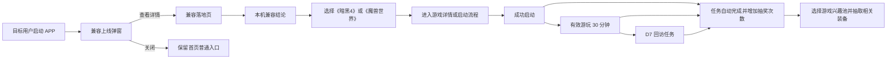

# 《暗黑破坏神 IV》《魔兽世界》兼容上线活动设计

**日期：** 2026-08-17

**状态：** 产品方向已确认，待书面规格审阅

**交付范围：** APP 启动弹窗、兼容落地页信息架构、签到与抽奖活动方案、指标和风控

**默认活动周期：** 14 天，可由运营配置具体起止时间

## 1. 结论

本次采用“兼容发布为主、运营激励为辅”的一体化方案：

1. APP 启动弹窗只负责告知《暗黑破坏神 IV》《魔兽世界》PC 版已经获得盖世游戏兼容支持，并把用户带到统一落地页。
2. 落地页首屏先回答“是不是本地运行、我的设备能不能玩、如何开始”，再承载签到、任务和抽奖。
3. 抽奖资格必须同时包含签到和有效游玩条件，避免活动只提升签到而不提升游戏使用；每人最多 2 次抽奖。
4. 奖池按《暗黑4》《魔兽世界》兴趣分开，奖励聚焦手柄、散热/快充、便携键鼠、扩展坞/支架等真实移动 PC 游戏需求，不投放通用秒玩时长。
5. 最终成效不以弹窗点击、签到或抽奖次数判断，核心看新增 D7 有效玩家和每个新增 D7 有效玩家的增量成本。
6. 同一落地页按账号资格分流：符合新人资格的用户进入独立 7 日移动畅玩挑战，老用户进入本设计的 14 日任务与抽奖；两套任务和奖励默认不叠加。

## 2. 背景与问题

盖世游戏已经兼容《暗黑破坏神 IV》《魔兽世界》，当前需要同时解决三个问题：

- **能力认知：** 新老用户不知道平台已支持这两款游戏。
- **游玩转化：** 用户即使知道，也不确定自己的设备能否运行、需要什么配置和如何开始。
- **持续活跃：** 单次兼容公告容易形成短期曝光，无法保证用户真正启动、持续游玩和再次返回。

现有讨论中的“启动弹窗 + 落地页 + 签到抽奖”方向成立，但若首屏先突出抽奖或通用福利，会产生两个风险：

- 用户误以为抽奖或付费是使用兼容能力的前置条件。
- 用户被活动链路带离“立即开始本地游玩”的核心任务，活动数据好看但兼容能力没有转化为有效玩家。

因此，本方案将信息、游玩和激励按主次组合，不拆成两套孤立页面，也不把抽奖设为进入游戏的前置条件。

## 3. 目标、用户与非目标

### 3.1 业务目标

1. 提升目标用户对两款游戏已兼容的认知。
2. 提升从兼容信息到成功启动、有效游玩的转化。
3. 通过签到、有效游玩和 D7 回访任务提升活动期留存。
4. 用可归因数据判断激励活动是否带来增量，而非自然兼容需求。

### 3.2 目标用户

| 用户分组 | 识别条件 | 触达方式 | 首要诉求 |
|---|---|---|---|
| 暴雪双作意向用户 | 搜索、浏览、反馈、关注或尝试过相关游戏/Battle.net | 启动弹窗 + 首页入口 + 定向消息 | 立刻确认能否玩 |
| 兼容设备用户 | 设备/GPU 已进入验证白名单 | 启动弹窗 + 落地页本机结论 | 直接开始本地游玩 |
| 未验证设备用户 | 设备不在验证白名单 | 普通运营位，不强弹全屏 | 查看已验证机型和限制 |
| 已成功游玩用户 | 已成功启动任一目标游戏 | 活动任务、抽奖和回访提醒 | 获得奖励并持续游玩 |

### 3.3 明确不做

- 不把签到、抽奖或进群作为查看兼容信息、启动游戏的前置条件。
- 不做“兼容预约”或人为等待上线窗口。
- 不宣称所有安卓设备均可稳定运行。
- 不因 Battle.net 可登录就宣称两款游戏在所有机型上均已完整支持。
- 不在本期新增社区发帖、邀请裂变、组队或排行榜任务。
- 不重新建设一套签到系统，复用现有签到状态和记录。
- 不在没有收货信息、库存和履约能力时开放实物奖。

### 3.4 新老用户分流

- 符合 `2026-08-17-diablo-wow-new-user-acquisition-campaign-design.md` 资格的新用户，在同一落地页进入“7 日移动畅玩挑战”，通过有效游玩解锁游戏兴趣奖池抽奖。
- 注册前已有盖世游戏账号和权益记录的老用户，进入本设计的 14 日签到、游玩任务和抽奖。
- 新用户默认不参加本设计任务账本，老用户不显示新人专属资格；两类用户可使用相同兴趣奖品目录，但库存、预算和数据归因分开。
- 兼容信息、实机视频、游戏入口和已知问题共用；用户资格、任务账本、奖励预算和数据归因分开。

## 4. 总体链路



设计原则：用户从落地页到开始游玩只需要一次明确选择；抽奖不阻断启动链路，任务完成后自动记账。

## 5. 启动弹窗设计

### 5.1 触发与频控

- 目标人群首次启动活动版本 APP 时展示。
- 同一账号、同一 `activity_version` 最多展示一次完整弹窗。
- 用户关闭后本活动不再强弹，首页 Banner 和游戏搜索入口继续保留。
- 未登录用户按设备 ID 去重；登录后与账号记录合并，不重复展示。
- 未验证设备用户默认不展示完整弹窗；若运营需要全量曝光，仅展示“查看支持机型”，不写“你的手机可以玩”。
- 活动已结束、页面不可用或客户端无法识别活动版本时不展示。

### 5.2 信息结构

弹窗只包含：

1. 两款游戏的自制实机运行画面或经审核的活动视觉。
2. 标题：“《暗黑破坏神 IV》《魔兽世界》PC 版现已兼容”。
3. 说明：“通过盖世游戏在安卓设备本地运行，非云游戏、非串流”。
4. 主按钮：“查看支持机型并立即体验”。
5. 次级说明：“完成畅玩任务，还可抽手柄、散热或键鼠装备”。
6. 关闭按钮。

弹窗不展示任务列表、奖品轮播、签到按钮和抽奖按钮。

### 5.3 点击与关闭

- 点击主按钮：进入统一落地页，记录来源 `startup_popup`。
- 点击关闭：关闭弹窗，不弹 Toast，不触发二次确认。
- 页面打开失败：返回 APP 当前页面并保留首页活动入口，不循环拉起。

## 6. 落地页信息架构

### 6.1 页面结构

```text
┌─────────────────────────────────────┐
│ 返回  双作兼容上线活动          活动规则 │
├─────────────────────────────────────┤
│ Hero：两款游戏实机画面                  │
│ PC版已兼容｜本地运行｜非云游戏、非串流   │
│ 非云游戏、非串流，可直接查看本机兼容结论   │
├─────────────────────────────────────┤
│ 本机兼容结论                            │
│ 已验证 / 有限支持 / 暂未验证             │
│ 设备、GPU、盖世版本、最近验证时间         │
├─────────────────────────────────────┤
│ 《暗黑破坏神 IV》  《魔兽世界》           │
│ 实测表现、支持范围、已知问题              │
│ [进入游戏详情 / 启动本地游戏]             │
├─────────────────────────────────────┤
│ 实机视频与三步游玩指南                   │
├─────────────────────────────────────┤
│ 我的畅玩活动                            │
│ 抽奖次数、签到里程碑、游玩任务、回访任务   │
│ [去完成任务] [立即抽奖]                  │
├─────────────────────────────────────┤
│ 奖池、中奖记录、活动规则、合规声明         │
└─────────────────────────────────────┘
```

### 6.2 首屏兼容信息

首屏固定展示：

- “本地运行，非云游戏、非串流”。
- 当前设备型号、SoC/GPU、盖世版本。
- 兼容状态：`已验证`、`有限支持`、`暂未验证`。
- 最近验证时间。
- 两款游戏切换入口。

状态文案：

| 状态 | 说明 | 主操作 |
|---|---|---|
| 已验证 | 当前设备和关键环境已通过验证 | 启动本地游戏 / 进入游戏详情 |
| 有限支持 | 可运行，但存在明确限制 | 查看限制后继续 |
| 暂未验证 | 当前设备没有足够验证数据 | 查看支持机型与实测记录 |
| 当前版本不满足 | 设备可支持，但盖世或运行环境需更新 | 更新后体验 |

“已验证”必须来自“游戏 × 设备/GPU × 盖世版本 × 运行环境”的有效记录，不从单次启动或单台测试设备外推。

### 6.3 游戏卡片

每款游戏独立展示：

- 自制实机视频或短动图。
- 支持平台、游戏版本、测试设备和运行环境。
- 实测帧率、画质设置、验证时长。
- 启动步骤。
- 已知问题和处理建议。
- 进入游戏详情或启动入口。

《暗黑破坏神 IV》重点说明 Battle.net 登录、下载、启动和战斗场景表现；《魔兽世界》重点说明更新、鼠标视角、键盘输入、中文输入和长时间运行情况。两款游戏不得因为共用 Battle.net 而共用一条模糊兼容结论。

### 6.4 活动区

活动区位于兼容信息和启动入口之后，包含：

- 活动剩余时间。
- 当前可用抽奖次数。
- 签到、首次成功启动、有效游玩和 D7 回访任务。
- 《暗黑4》《魔兽世界》兴趣奖池选择和预览。
- 抽奖入口和中奖记录。
- 优惠券使用条件、实物库存和合规声明。

用户无抽奖次数时，抽奖按钮显示“完成任务获得次数”，点击后定位到未完成任务，不弹额外说明弹窗。

## 7. 活动方案

### 7.1 活动定位

**活动名称：** 双作兼容上线·畅玩挑战

**传播标题：** 《暗黑破坏神 IV》《魔兽世界》PC 版现已兼容，完成畅玩挑战赢好礼

**活动周期：** 14 天

**核心动作：** 查看本机兼容结论 → 成功启动 → 有效游玩 → D7 再次游玩

**活动主奖励：** 与目标游戏移动游玩相关的外设和低门槛硬件优惠券

**条件奖励：** 仅在地区、授权、采购和发放合法确认后开放的战网或游戏数字权益

“暴雪”不得单独作为活动品牌或专区名称，避免产生官方合作联想；传播中使用完整游戏名称并保留权利声明。

### 7.2 任务与抽奖次数

签到和游玩必须共同作用，每名用户最多获得 2 次抽奖：

| 抽奖资格 | 必须同时完成 | 奖励 |
|---|---|---:|
| 第 1 次：成功开玩 | 累计签到满 3 天 + 首次成功启动任一目标游戏 + 单日有效游玩满 30 分钟 | 1 次兴趣奖池抽奖 |
| 第 2 次：7 日玩家 | 累计签到满 7 天 + D7 再次有效游玩任一目标游戏 | 1 次兴趣奖池抽奖 |

任务规则：

- 活动资格与游戏启动不绑定；未参加活动仍可正常本地游玩。
- 本活动默认面向老用户；符合新人资格的账号进入独立 7 日新人活动，不生成本活动抽奖任务。
- 任务由服务端根据签到、启动和前台有效游玩数据自动判定并记账，不要求用户再次点击“领取”。
- 签到不能单独生成抽奖次数；D7 窗口定义为首次有效游玩后的第 7 个自然日。
- 进入后台、挂机、反复启动但未进入可交互画面不计入有效游玩。
- 同一任务使用唯一业务键记账，重复上报、客户端重试和跨设备登录不得重复增加次数。
- 活动结束后保留 24 小时抽奖宽限期；宽限期不能继续完成任务，只能消耗已有次数。

### 7.3 奖池建议

奖池根据用户抽奖前选择的目标游戏匹配：

| 兴趣池 | 实物大奖 | 中等奖励 | 基础权益 | 条件奖项 |
|---|---|---|---|---|
| 《暗黑4》 | 手机游戏手柄套装 | 散热器、快充配件或移动电源 | 上述硬件低门槛优惠券 | 合规确认后的战网或游戏数字权益 |
| 《魔兽世界》 | 便携键盘、鼠标与 USB-C 扩展坞组合 | 支架、扩展坞或快充配件 | 上述硬件低门槛优惠券 | 合规确认后的魔兽游戏时间或战网数字权益 |

原则：

- 核心兼容配置、按键模板和教程属于默认产品能力，不放进奖池。
- 首期每个兴趣池只配置 1 个实物主 SKU、1 个低门槛优惠券 SKU；每名用户最多 2 次抽奖、最多 1 件实物。
- 优惠券必须真实低门槛，使用后价格不高于同期公开优惠价；若无法提供有价值的券，诚实显示“本次未中奖”。
- 实物奖总库存、概率、预算、地区和履约时间必须锁定，库存耗尽后停止命中，不以无关奖品替换。
- 战网余额、魔兽游戏时间等数字权益只有完成地区、账号、授权、采购和发放审核后才可上线。
- 页面明确活动与暴雪娱乐及相关游戏发行方无官方合作关系。
- 实物中奖后才收集最小必要收货信息；复用现有收货能力。若上线时没有安全的地址收集和履约能力，本期实物奖自动关闭，仅保留真实低门槛的硬件优惠券。
- 地址提交、审核、发货和完成状态可查询；逾期未提交按规则失效，权益不自动补发。

### 7.4 抽奖状态

```text
无次数 → 有次数 → 选择兴趣池 → 请求中 → 已扣次数 → 已中奖/未中奖
                                                ├→ 优惠券已到账/已核销/已过期
                                                └→ 实物待填地址/审核中/已发货/已完成
```

- 抽奖、扣次和生成中奖记录在服务端同一事务中完成。
- 每次请求携带唯一 `draw_request_id`；重复请求返回同一结果。
- 客户端超时后允许查询原请求结果，不再次扣次。
- 优惠券发放失败不回滚中奖结果，由发奖系统重试并显示“发放中”。
- 实物库存扣减与中奖记录必须原子化，避免超发。

## 8. 活动节奏与运营内容

### 8.1 准备期：T-7～T-1

- 锁定两款游戏的验证设备、盖世版本、运行环境和已知问题。
- 完成两条独立实机视频、三步游玩指南和兼容数据审核。
- 配置活动任务、奖池、概率、库存、预算和权益有效期。
- 完成抽奖账本、防刷、埋点、弹窗频控、异常状态和履约演练。
- 对传播文案、游戏画面、商标、免责声明和抽奖规则完成合规审核。

### 8.2 首发期：D1～D3

- D1：APP 启动弹窗、首页 Banner、游戏详情和落地页同步上线。
- D1：官方发布双作兼容实机视频，所有入口统一回到落地页。
- D2～D3：3～5 位 KOC 分别使用不同芯片实测，展示完整启动、运行表现和限制。
- 官方评论区置顶支持机型、下载/详情入口和已知问题。

### 8.3 扩散期：D4～D7

- 发布首批用户成功启动和有效游玩数据。
- 汇总不同芯片的实测表现和常见问题。
- 展示真实获奖记录和实物奖，但不夸大中奖概率。
- 对兼容失败集中问题及时更新落地页，不删除负向记录。

### 8.4 留存期：D8～D14

- 对已首次有效游玩的用户触发 D7 回访提醒。
- 强调签到与 D7 有效游玩的组合条件和剩余抽奖次数。
- 不再对已关闭弹窗用户重复强弹，使用系统消息或活动入口提醒。
- 活动结束前 24 小时提醒剩余次数，结束后进入 24 小时抽奖宽限期。

### 8.5 收尾期：D15 以后

- 关闭任务生成，完成剩余优惠券和实物奖履约。
- 落地页移除倒计时和抽奖入口，保留两款游戏兼容指南作为长期内容页。
- 输出活动复盘：兼容认知、成功启动、有效游玩、D7 回访、奖励成本、防刷和负反馈。

## 9. 数据与最终效果

### 9.1 核心定义

- **成功启动：** 游戏进入可交互画面，不以 Battle.net 登录成功、进程创建或出现启动画面代替。
- **单日有效游玩：** 目标游戏处于前台且可交互，单个自然日累计达到 30 分钟；后台、锁屏和异常挂机时间剔除。
- **新增有效玩家：** 活动期首次达到任一目标游戏单日有效游玩的去重用户。
- **新增 D7 有效玩家：** 活动期首次成为有效玩家，并在第 7 天窗口再次达到有效游玩的去重用户。
- **每新增 D7 有效玩家增量成本：** 活动增量成本 ÷ 相对对照组新增的 D7 有效玩家数。

### 9.2 北极星指标

**主指标：** 新增 D7 有效玩家数。

**效率指标：** 每新增 D7 有效玩家的增量成本。

签到人数、抽奖次数、落地页访问量只作为漏斗诊断指标，不作为活动成功结论。

### 9.3 漏斗指标

| 阶段 | 指标 |
|---|---|
| 触达 | 弹窗曝光人数、点击率、关闭率、首页入口点击率 |
| 认知 | 落地页访问、视频播放、兼容记录查看、支持机型查看 |
| 转化 | 游戏入口点击、下载/导入完成、成功启动率 |
| 有效使用 | 30 分钟有效游玩率、新增有效玩家数 |
| 激励 | 任务完成人数、抽奖用户数、优惠券领取/核销/过期率、实物履约率 |
| 留存 | D7 回访任务完成率、新增 D7 有效玩家数 |
| 成本 | 优惠券实际补贴、实物和履约成本、每新增有效玩家成本、每新增 D7 有效玩家成本 |

### 9.4 增量验证

- 从符合启动弹窗条件的目标用户中保留 10% 为对照组。
- 对照组不展示启动弹窗，但活动资格不被剥夺，仍可从首页或游戏入口进入活动。
- 实验组展示一次启动弹窗；两组其他兼容能力、奖池、任务和页面保持一致。
- 比较两组落地页访问、成功启动、有效游玩和 D7 有效玩家，判断启动弹窗的增量效果。
- 激励效果通过“完成签到但未完成游玩任务”和“完成游玩任务”分群观察，并结合活动前同类用户基线，不把自然高意愿用户全部归因给抽奖。

### 9.5 扩量与止损

满足以下条件后扩大弹窗或实物奖规模：

- 目标机型成功启动率和 30 分钟稳定运行达到正式支持门槛。
- 实验组新增 D7 有效玩家相对对照组存在明确提升。
- 每新增 D7 有效玩家成本不高于该类用户 D30 预计贡献毛利。
- 权益到账、实物履约和用户投诉处于可控范围。

出现以下情况暂停扩量或关闭实物奖：

- 兼容崩溃率、无法启动率或负反馈明显高于上线前验证。
- D7 有效游玩没有可解释的增量。
- 异常任务或疑似刷奖占比超过 10%。
- 实物库存、地址收集、审核或履约出现不可控问题，或优惠券核销率低于 10%。
- 奖励成本超过预算或用户增量价值。

## 10. 埋点与关键字段

| 事件 | 触发 | 关键字段 |
|---|---|---|
| `compat_campaign_popup_show` | 启动弹窗展示 | `activity_id`, `user_segment`, `device_id`, `gpu`, `app_version` |
| `compat_campaign_popup_click` | 点击主按钮 | `activity_id`, `source` |
| `compat_campaign_popup_close` | 关闭弹窗 | `activity_id` |
| `compat_campaign_page_view` | 落地页打开 | `activity_id`, `source`, `device_status` |
| `compat_game_select` | 选择目标游戏 | `game_id`, `device_status` |
| `compat_play_click` | 点击游戏主操作 | `game_id`, `device_status`, `action_type` |
| `compat_launch_result` | 游戏启动结果 | `game_id`, `gpu`, `runtime_version`, `result`, `fail_stage` |
| `compat_effective_play` | 达到有效游玩 | `game_id`, `foreground_minutes` |
| `campaign_task_complete` | 任务完成并记账 | `task_id`, `chance_delta`, `ledger_id` |
| `campaign_draw_result` | 抽奖返回 | `draw_request_id`, `prize_id`, `prize_type` |
| `campaign_reward_fulfill` | 奖励到账或履约状态变化 | `prize_id`, `status`, `fail_reason` |
| `campaign_coupon_redeem` | 优惠券核销 | `coupon_issue_id`, `game_id`, `sku_id`, `subsidy_amount` |

所有事件统一携带 `uid`、`activity_id`、`activity_version`、`country`、`app_version`、`device_model` 和时间戳。活动分析必须区分国内/海外、游戏、设备/GPU 和兼容状态。

## 11. 异常与边界

| 场景 | 处理 |
|---|---|
| 活动未开始 | 落地页展示开始时间和兼容内容，不展示任务与抽奖 |
| 活动已结束 | 保留兼容指南；任务关闭；宽限期内可抽奖，之后入口关闭 |
| 当前设备暂未验证 | 不写“可以玩”，展示支持机型和实测记录 |
| 游戏有限支持 | 主操作前展示明确限制，用户确认阅读后继续 |
| 用户未登录 | 可查看兼容信息；签到、任务和抽奖需登录后记账 |
| 签到服务失败 | 保留页面和游玩入口，签到区原位重试 |
| 抽奖请求超时 | 查询原 `draw_request_id`，不得重新扣次 |
| 优惠券发放失败 | 中奖记录保持有效，显示“发放中”并自动重试 |
| 优惠券核销条件变化 | 已发券继续按发放时规则使用，新发券暂停并重新审核 |
| 实物库存耗尽 | 服务端停止命中对应实物 SKU，不静默替换奖品 |
| 地址未提交 | 仅对实物中奖用户提醒；到期按公示规则失效 |
| 活动页面加载失败 | 返回 APP，保留游戏详情和首页入口，不影响正常游玩 |
| 用户跨设备登录 | 任务与次数按账号合并；设备校验仍用于防刷 |

## 12. 防刷、隐私与合规

### 12.1 防刷

- 签到、成功启动、有效游玩和回访任务由服务端验证，不信任客户端单点上报。
- 账号、设备、IP、启动会话、前后台状态和异常行为共同参与风控。
- 抽奖次数、扣次、中奖和发奖使用服务端账本；所有写操作幂等。
- 同设备批量账号、同账号异常换机、短时间重复启动、模拟前台时长进入审核或不计任务。
- 实物中奖执行人工复核，同一账号最多 1 件。

### 12.2 隐私

- 兼容判断只使用设备型号、SoC/GPU、系统与盖世版本等必要环境信息。
- 收货信息只对实物中奖用户收集，用于本次履约，不在活动前预收。
- 地址、手机号等敏感信息不进入活动分析事件和运营导出明细。

### 12.3 合规文案

页面固定说明：

> 本活动由盖世游戏发起。本产品与暴雪娱乐及相关游戏发行方无关联；游戏名称、商标及版权归各自权利人所有。用户需通过合法渠道获取游戏及账号。兼容结果基于页面所列设备、版本和运行环境，不代表所有设备均可稳定运行。

抽奖规则必须公示活动时间、参与资格、任务口径、奖项、概率或概率区间、库存、权益有效期、实物履约、失效条件、个人信息用途和客服渠道。

## 13. 验收标准

- 目标用户在活动版本首次启动时最多看到一次完整弹窗，关闭后不重复强弹。
- 弹窗和落地页首屏明确“本地运行、非云游戏、非串流”。
- 落地页先展示本机兼容结论和游戏启动入口，再展示任务和抽奖。
- 两款游戏分别展示实测表现、启动步骤和已知问题，不共用模糊结论。
- 已验证、有限支持、暂未验证和版本不满足四种状态均有正确文案与操作。
- 用户不参加活动仍可查看兼容信息并正常本地游玩。
- 每人最多 2 次抽奖，分别由“签到 3 天 + 首次启动 + 30 分钟有效游玩”和“签到 7 天 + D7 有效游玩”解锁。
- 任务自动完成和记账，重复上报不重复增加次数。
- 抽奖请求幂等，超时、重试、发奖失败和库存耗尽不会重复扣次或超发。
- 用户可在抽奖前选择《暗黑4》或《魔兽世界》兴趣池，奖品与该游戏的移动游玩场景匹配。
- 优惠券必须低门槛且价格有真实优势；实物奖只在库存、地址收集和履约能力就绪后启用。
- 成功启动、有效游玩、新增 D7 有效玩家和增量成本可按游戏、设备和用户分组统计。
- 活动结束后抽奖关闭、兼容指南保留，不出现失效入口。

## 14. 上线前运营配置清单

以下属于每次活动上线前必须填写的运营配置，不改变本设计：

- 活动起止时间、24 小时抽奖宽限期的具体时间。
- 两款游戏的验证版本、白名单设备/GPU、运行环境和已知问题。
- 启动弹窗、首页 Banner、落地页和外部传播素材。
- 两个兴趣池的实物 SKU、优惠券 SKU、概率、库存和总预算。
- 优惠券门槛、适用商品、实际价格、地区、有效期和核销接口。
- 实物奖地址截止时间、地区和履约负责人。
- 战网或游戏数字权益的地区、授权、采购和发放合规结论；未通过时不得上线。
- 客服入口、异常处理负责人和兼容问题升级机制。
- 3～5 位 KOC、对应设备和发布时间。
- 10% 对照组配置、数据看板和活动复盘负责人。

## 15. 三视角审查结论

- **用户视角：** 手柄、散热/快充、便携键鼠和扩展坞直接解决移动玩 PC 游戏的问题；抽奖必须位于兼容信息和启动入口之后，核心配置与教程不能锁成奖品。
- **开发视角：** 兴趣选择、任务、抽奖、优惠券、库存和履约必须使用服务端状态机、唯一业务键和幂等处理；未完成合规审核的数字权益不上自动链路。
- **商业视角：** 相关奖池更容易提升目标用户兴趣并争取硬件合作共担；优惠券必须真实有价值，否则宁可明确未中奖，不能用高门槛券伪装福利。
