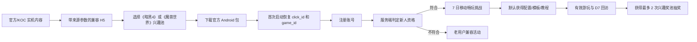

# 《暗黑破坏神 IV》《魔兽世界》兼容能力新用户拉新活动设计

**日期：** 2026-08-17

**状态：** 待书面规格审阅

**参考资料：** `暴雪支持的方案/《盖世游戏》付费档位+新用户活动运营方案.md`

**关联设计：** `docs/superpowers/specs/2026-08-17-diablo-wow-compatibility-launch-campaign-design.md`

> **当前阶段说明：** 本文为前期双作新用户拉新探索稿。本期仅实施《暗黑破坏神 IV》的首发适配落地页与现有运营活动 H5，当前口径以 `2026-08-17-diablo4-h5-landing-and-activity-design.md` 为准。

## 1. 结论

本活动只参考既有新人方案的“注册后 7 天关键期”和站内投放位置，不照搬 27.5 小时秒玩时长奖励。

被《暗黑破坏神 IV》《魔兽世界》兼容内容吸引来的用户，核心兴趣是：在手机上稳定运行 PC 游戏，以及改善操控、散热、续航和桌面外设体验。因此活动采用“默认提供兼容能力 + 按游戏兴趣匹配奖池”的结构：

```text
外部实机内容 / KOC
→ 兼容拉新 H5
→ 下载盖世游戏
→ 首次启动恢复活动来源
→ 注册成为新用户
→ 直接获得兼容配置、按键模板和游玩教程
→ 7 日完成首次有效游玩、签到和 D7 回访
→ 最多获得 2 次游戏兴趣奖池抽奖
```

奖池按用户选择分开：

- **《暗黑4》兴趣池：** 手机手柄、散热/快充配件，以及合规确认后的战网相关数字权益。
- **《魔兽世界》兴趣池：** 便携键鼠、USB-C 扩展坞/支架，以及合规确认后的魔兽游戏时间或战网相关数字权益。

核心兼容配置、按键模板、教程和问题解决能力是注册后的默认产品价值，不锁在抽奖或付费后面。

## 2. 为什么不能照搬通用新人奖励

参考方案以“最高 27.5 小时秒玩时长”降低新用户云游戏体验门槛，但本次传播卖点是两款 PC 游戏在安卓设备本地运行。直接照搬会造成：

- 用户误以为《暗黑4》《魔兽世界》需要消耗云游戏时长。
- 奖励吸引的是通用免费时长用户，而不是目标游戏玩家。
- 高额补贴提高拉新成本，却未必改善目标游戏启动和 D7 留存。
- 秒玩时长与兼容实机内容的价值不一致，活动记忆点被抽奖覆盖。

本活动只继承：

- 注册后连续 7 天的个人养成窗口。
- 无门槛默认能力、阶梯任务、留存激励的结构。
- 首页 Banner、我的页 Banner、推送等既有站内入口。

不继承：

- 27.5 小时秒玩时长。
- 通用新人礼的奖励档位。
- 已划掉的首充和付费任务。
- “全体用户”与“新用户”混用的资格口径。

## 3. 活动定位

### 3.1 名称与传播

**对外名称：** PC 双作移动畅玩挑战

**传播标题：** 安卓设备本地运行《暗黑破坏神 IV》《魔兽世界》PC 版，完成 7 日挑战赢专属装备

**核心说明：**

> 两款游戏通过盖世游戏在安卓设备本地运行，非云游戏、非串流。注册即可获得兼容配置、按键模板和游玩教程；完成有效游玩任务，可抽取与所选游戏匹配的外设装备。

### 3.2 活动周期

- 拉新投放窗口：14 天。
- 新用户注册截止：投放窗口最后一天 23:59:59。
- 个人任务窗口：从注册成功起连续 168 小时。
- 实物兑奖窗口：中奖后 7 天内提交收货信息。
- 观察窗口：最后一名用户任务结束后继续观察 7 天。

投放窗口结束前注册的用户仍拥有完整 168 小时，不因活动全局结束而缩短。

### 3.3 核心目标

1. 把外部实机内容转化为可归因的下载安装和注册。
2. 让新用户注册后 24 小时内完成目标游戏首次有效游玩。
3. 让新用户在第 7 天再次有效游玩。
4. 用增量 D7 有效新玩家和奖励成本判断是否值得扩大 KOC 和奖池。

## 4. 用户资格与分流

### 4.1 新用户资格

同时满足：

- 在拉新投放窗口内首次注册盖世游戏账号。
- 注册前不存在该账号、已验证手机号或合并账号的历史登录和权益记录。
- 未命中批量注册、异常设备、多账号套利等高风险规则。
- 活动来源可归因，或从 APP 内新用户入口主动进入。

设备、IP 和支付历史只作为风控信号，不单独替代账号注册时间。

### 4.2 老用户处理

- 老用户仍可查看兼容信息、支持机型、游玩方法和奖池内容。
- 下载或打开 APP 后识别为老用户，进入兼容上线老用户活动。
- 页面显示“当前账号不符合新人挑战资格”，同时提供老用户活动入口，不弹二次确认。
- 老用户不能通过卸载重装、换设备或重新点击 KOC 链接获得新人资格。

### 4.3 未登录用户

- 可查看实机视频、兼容设备、已知问题、任务和奖池。
- 点击参加挑战时进入注册/登录。
- 注册完成后返回原落地页，恢复渠道、目标游戏和兴趣奖池。

## 5. 拉新链路与归因



### 5.1 渠道参数

外部链接至少携带：

- `campaign_id`
- `channel_id`
- `content_id`
- `koc_id`
- `game_id`
- `click_id`

首期只支持一个官方 Android 包和统一账号体系，不同时接多包、多商店和跨端归因。

### 5.2 归因规则

- H5 点击后 7 天内完成首次安装并注册，记为有效拉新归因。
- 多次点击使用注册前最后一个有效 `click_id`；同一 `click_id` 只能绑定一个新账号。
- Android 使用 Install Referrer 或受控 deferred deep link 恢复来源。
- 来源恢复失败时仍可参加站内新人活动，但不计入对应 KOC/渠道转化。
- 老账号新设备登录、卸载重装和退出后重新注册均不计新增。
- 归因、资格、任务和奖励由服务端判定，客户端只展示结果。

## 6. 外部 H5 与 APP 承接

### 6.1 H5 信息顺序

1. 两款游戏实机运行视频。
2. “PC 版本地运行，非云游戏、非串流”。
3. 支持设备、GPU、盖世版本、实测帧率和已知问题。
4. 注册后默认获得的兼容配置、按键模板和游玩教程。
5. 两个兴趣奖池预览。
6. “下载盖世游戏，查看本机兼容并开始挑战”主按钮。
7. 新人 7 日任务、抽奖条件和奖品规则。
8. 正版游戏、活动主办方、商标和隐私说明。

H5 不使用“免费玩《暗黑4》《魔兽世界》”“暴雪官方福利”等可能产生误解的文案。

### 6.2 APP 首次打开

- 自动回到活动页，不停留在普通首页。
- 保留 H5 选择的目标游戏和兴趣奖池。
- 当前设备已验证：显示“进入游戏详情/开始配置”。
- 当前设备有限支持：先显示限制，再允许继续。
- 当前设备暂未验证：展示已验证设备和实测记录，不承诺可玩。
- 完成注册后立即刷新新人资格，不要求退出重进。

## 7. 默认提供的产品价值

注册并通过新人资格后直接获得，不需要抽奖：

- 当前设备兼容结论。
- 对应游戏已验证运行配置。
- 《暗黑4》手柄按键模板和性能设置建议。
- 《魔兽世界》键鼠、鼠标视角、中文输入和 UI 设置指南。
- Battle.net 安装、登录、更新和常见问题教程。
- 启动失败后的兼容诊断与问题反馈入口。

这些能力决定用户是否能完成核心任务，不得做成概率奖励、付费权益或中奖后解锁内容。

## 8. 新人 7 日挑战

### 8.1 任务结构

每名符合资格的新用户最多获得 2 次抽奖，避免高频低价值抽奖稀释奖品感知。

| 抽奖资格 | 必须同时完成 | 奖励 |
|---|---|---:|
| 第 1 次：成功开玩 | 首次成功启动任一目标游戏 + 单日有效游玩满 30 分钟 | 1 次兴趣奖池抽奖 |
| 第 2 次：7 日玩家 | 累计签到满 3 天 + D7 再次有效游玩任一目标游戏 | 1 次兴趣奖池抽奖 |

任务原则：

- 注册只解锁挑战和默认兼容能力，不直接产生抽奖次数。
- 签到不能单独产生抽奖，必须与 D7 有效游玩共同完成。
- 成功启动必须进入可交互画面；Battle.net 登录、进程启动和出现加载页不算完成。
- 有效游玩只统计前台、可交互、排除挂机和异常崩溃的时间。
- D7 窗口为首次有效游玩后的第 7 个自然日；个人任务窗口结束前均可完成。
- 任务完成后自动增加抽奖次数，不增加“领取次数”步骤。
- 每项抽奖资格使用唯一业务键，重复上报、重试和换机不得重复发放。

### 8.2 兴趣选择

- 用户首次进入时默认选中外部内容对应的 `game_id`。
- 抽奖前可以切换兴趣池；抽奖请求提交后，该次结果永久绑定所选游戏。
- 已产生的中奖记录、优惠券和实物不因后续改选迁移到另一奖池。
- 服务端记录 `campaign_id + uid + draw_index + game_id`，客户端不能修改历史结果。

## 9. 兴趣奖池

### 9.1 《暗黑4》兴趣池

| 奖励层级 | 推荐奖品 | 解决的问题 |
|---|---|---|
| 大奖 | 盖世/小鸡手机游戏手柄套装 | 长时间移动操控 |
| 中等奖 | 手机散热器、快充配件或移动电源 | 发热、续航、边充边玩 |
| 基础权益 | 上述硬件的低门槛专属优惠券 | 降低设备升级成本 |
| 条件奖项 | 战网余额或《暗黑4》相关数字权益 | 仅在地区、授权、采购和发放合法确认后开放 |

### 9.2 《魔兽世界》兴趣池

| 奖励层级 | 推荐奖品 | 解决的问题 |
|---|---|---|
| 大奖 | 便携键盘、鼠标与 USB-C 扩展坞组合 | 键鼠操作和接口不足 |
| 中等奖 | 桌面支架、USB-C 扩展坞、快充配件 | 桌面化和长时间游玩 |
| 基础权益 | 上述硬件的低门槛专属优惠券 | 降低设备升级成本 |
| 条件奖项 | 魔兽游戏时间或战网相关数字权益 | 仅在地区、账号、授权、采购和发放合法确认后开放 |

### 9.3 奖池规则

- 首期每个兴趣池只上 1 个实物主 SKU、1 个优惠券 SKU；数字权益暂不上线或仅人工审核后小流量发放。
- 优惠券必须低门槛、有效价值明确，使用后价格不得高于同期公开优惠价。
- 券面展示适用商品、门槛、地区、有效期、是否可叠加和库存。
- 若无法提供真实有吸引力的低门槛券，诚实显示“本次未中奖”，不得用高门槛券伪装必中奖。
- 每名用户活动期最多 2 次抽奖、最多获得 1 件实物。
- 实物总库存、概率、预算、地区和履约时效上线前锁定，售罄后停止命中。
- 数字权益必须经过地区、账号、版权、渠道授权和合法采购审核；未通过合规闸门不得配置到奖池。
- 活动页面明确与暴雪娱乐及游戏发行方无官方合作关系，不把相关数字权益描述为“官方联动福利”。

### 9.4 MVP 奖池建议

每个兴趣池首期仅配置：

- 1 件预算内的相关实物大奖。
- 一批真实低门槛的对应硬件优惠券。
- 不配置通用秒玩时长。
- 不配置未完成合规审核的战网余额、魔兽游戏时间或其他游戏数字权益。

这样可以先验证“相关奖品是否提高有效游玩和 D7”，而不是先搭建复杂数字权益供应链。

## 10. 抽奖、库存与履约

```text
无次数 → 有次数 → 选择兴趣池 → 请求中 → 已扣次数 → 已中奖/未中奖
                                                ├→ 优惠券已到账/已核销/已过期
                                                └→ 实物待填地址/审核中/已发货/已完成
```

- 抽奖、扣次、库存锁定和中奖记录在服务端同一事务中完成。
- 每次请求使用唯一 `draw_request_id`；重复请求返回同一结果。
- 超时后查询原请求，不再次扣次。
- 优惠券发放使用唯一券码或账号绑定券，重复回调不重复发放。
- 实物中奖后才收集最小必要收货信息；地址、电话不进入渠道/KOC报表。
- 实物库存不足、履约能力未就绪或地址能力不可用时，实物奖整体关闭。
- 优惠券核销率低于止损门槛时暂停发放并重新检查商品、门槛和实际价格。

## 11. 投放节奏

### 11.1 准备期：T-7～T-1

- 锁定两款游戏验证设备、版本、运行环境和已知问题。
- 制作两条独立实机视频和一条双作总视频。
- 为官方、KOC、游戏和渠道生成独立链接、二维码与 `click_id`。
- 验证 H5、下载、Install Referrer、首次启动、注册回跳和任务账本。
- 锁定每池 1 个实物 SKU、优惠券规则、预算和履约负责人。
- 完成数字权益合规判断；未通过则不出现在页面和宣传中。

### 11.2 首发期：D1～D3

- 官方内容首发：“安卓设备本地运行两款 PC 游戏”。
- 3～5 位 KOC 分别使用不同芯片展示完整安装、启动和运行。
- 《暗黑4》内容链接默认选中《暗黑4》兴趣池；《魔兽世界》内容同理。
- 对注册未启动用户强调配置、教程和设备结论，不先用奖品覆盖兼容信息。

### 11.3 转化与留存：个人 D1～D7

- 首次有效游玩满 30 分钟后，提示获得第 1 次抽奖。
- D3 仅发送一次兼容或任务进度提醒，不额外发抽奖次数。
- D7 对已累计签到 3 天的用户提醒完成第二次有效游玩并获得第 2 次抽奖。
- 已完成或关闭提醒的用户不重复触达。

## 12. 核心指标与最终效果

### 12.1 北极星指标

**增量 D7 有效新玩家数。**

定义：在投放期新注册、完成任一目标游戏 30 分钟有效游玩，并在第 7 天再次有效游玩的去重新用户，相对兼容内容无奖励对照组产生的增量。

### 12.2 成本指标

```text
每个增量 D7 有效玩家的奖励成本
=（实物成本 + 优惠券实际补贴 + 履约成本）
÷ 增量 D7 有效新玩家数
```

总 CAC 还需加媒体、KOC、物料和技术活动成本。扩量要求总 CAC 不高于 D30 贡献毛利，并能在 90 天内回收。

### 12.3 漏斗指标

| 阶段 | 指标 |
|---|---|
| 内容 | 曝光、完播、H5 点击、各 KOC/游戏内容转化 |
| H5 | 支持机型查看、兴趣池选择、下载点击 |
| 归因 | `click_id` 恢复率、安装归因成功率、渠道丢失率 |
| 注册 | 安装到注册转化、新人资格通过率 |
| 激活 | 注册后 24 小时成功启动率、30 分钟有效游玩率 |
| 留存 | 累计签到 3 天、D7 有效游玩率、增量 D7 有效玩家 |
| 奖励 | 抽奖完成率、实物成本、优惠券领取/核销/过期率 |
| 成本 | 渠道 CAC、每个增量 D7 奖励成本、总 CAC、D30 毛利/CAC |

### 12.4 止损门槛

- 奖励组 D7 有效游玩率相对对照组没有明确提升。
- 优惠券核销率低于 10%。
- 异常任务、批量注册或疑似刷奖占比超过 10%。
- 每个增量 D7 有效玩家的总 CAC 超过 D30 贡献毛利。
- 实物库存、地址、发货或售后出现不可控问题。
- 兼容失败和暂未验证设备比例过高，内容承诺与实际体验不一致。

触发后依次停止：实物奖扩量 → KOC 扩量 → 新人抽奖；兼容内容、配置、教程和正常游戏入口继续保留。

## 13. MVP 与灰度

### 13.1 首期范围

- 一个官方 Android 包。
- 一个统一账号体系。
- 每个游戏兴趣池 100～200 名符合资格的新用户。
- 每池 1 个实物主 SKU、1 个低门槛优惠券 SKU。
- 每人最多 2 次抽奖。
- 数字权益不在 MVP 自动发放。

### 13.2 对照

- 对照组：兼容 H5、配置、教程和正常游玩，无抽奖。
- 实验组：相同兼容能力，完成首次有效游玩和 D7 任务后分别获得 1 次兴趣奖池抽奖。
- 两组都能完整使用核心兼容能力，差异只有奖励。
- 比较注册、30 分钟有效游玩、D7、奖励成本和优惠券核销。

## 14. 技术状态与埋点

### 14.1 唯一键

- 任务：`campaign_id + uid + task_id`
- 抽奖：`campaign_id + uid + draw_index + game_id`
- 抽奖请求：`draw_request_id`
- 优惠券：`coupon_issue_id`
- 实物库存：`campaign_id + pool_id + sku_id + stock_batch`

### 14.2 关键事件

| 事件 | 触发 | 关键字段 |
|---|---|---|
| `acq_content_click` | 外部内容进入 H5 | `click_id`, `channel_id`, `koc_id`, `content_id`, `game_id` |
| `acq_install_attributed` | 首次启动恢复来源 | `click_id`, `referrer_status` |
| `acq_register_result` | 注册完成 | `click_id`, `is_new_user`, `risk_status` |
| `acq_interest_select` | 选择兴趣池 | `game_id`, `source_game_id` |
| `compat_launch_result` | 目标游戏启动结果 | `game_id`, `gpu`, `runtime_version`, `result`, `fail_stage` |
| `compat_effective_play` | 达到有效游玩 | `game_id`, `foreground_minutes`, `personal_day` |
| `acq_draw_unlock` | 解锁抽奖资格 | `draw_index`, `task_ids` |
| `acq_draw_result` | 抽奖返回 | `draw_request_id`, `game_id`, `sku_id`, `reward_type` |
| `acq_coupon_redeem` | 优惠券核销 | `coupon_issue_id`, `sku_id`, `subsidy_amount` |
| `acq_physical_fulfill` | 实物履约状态变化 | `sku_id`, `status`, `fail_reason` |

## 15. 异常与边界

| 场景 | 处理 |
|---|---|
| 来源恢复失败 | 可参加站内新人活动，不计对应渠道转化 |
| 已有账号重新安装 | 识别为老用户，进入老用户兼容活动 |
| 设备暂未验证 | 提供配置和教程但不承诺可玩；无法完成游玩任务时不扣抽奖权益 |
| 用户只拥有一款游戏 | 任一目标游戏即可完成挑战，不要求同时拥有两款 |
| 游戏启动失败 | 不完成任务，进入兼容诊断和反馈 |
| 切换兴趣池 | 未使用次数可选择新奖池；历史结果不迁移 |
| 实物库存耗尽 | 停止命中该 SKU，不静默替换成无关奖品 |
| 优惠券库存耗尽 | 该券从奖池下线，页面同步更新 |
| 数字权益未通过合规 | 不展示、不宣传、不发放 |
| 抽奖超时 | 查询原 `draw_request_id`，不得重复扣次 |
| 168 小时任务窗口结束 | 不再生成抽奖次数；已有中奖记录继续履约 |

## 16. 隐私与合规

- 实物中奖后才收集最小必要收货信息。
- 地址、电话、设备标识不进入 KOC 和渠道报表。
- 战网余额、魔兽游戏时间和其他游戏数字权益必须经过地区、授权、采购与发放合规审核。
- 不使用“暴雪官方活动、联合适配、官方推荐”等表述。
- 优惠券必须公示门槛、适用商品、地区、有效期和实际价格规则。
- 页面固定说明：

> 本活动由盖世游戏发起，与暴雪娱乐及相关游戏发行方无关联。游戏名称、商标及版权归各自权利人所有。用户需通过合法渠道获取游戏及账号。兼容结果基于页面所列设备、版本和运行环境，不代表所有设备均可稳定运行。

## 17. 验收标准

- 外部 H5 首屏先展示本地兼容证据和开始入口，抽奖为可选激励。
- 新人注册后默认获得配置、按键模板、教程和诊断能力，不依赖抽奖。
- 新老用户由服务端自动分流，重装和换机不能重复获得新人资格。
- 新用户拥有完整 168 小时任务窗口。
- 每名用户最多 2 次抽奖，分别由首次 30 分钟有效游玩和“签到 3 天 + D7 有效游玩”解锁。
- 用户可在抽奖前选择《暗黑4》或《魔兽世界》兴趣池，历史结果不随改选迁移。
- 两个奖池的实物和优惠券分别解决对应游戏的操控、散热、续航或桌面化问题。
- MVP 不投放通用秒玩时长，也不自动发放未通过合规审核的游戏数字权益。
- 优惠券真实低门槛，使用后价格不高于同期公开优惠价。
- 抽奖、库存、券码和履约均由服务端幂等处理。
- 可按游戏、渠道和 KOC 计算增量 D7、奖励成本、总 CAC 和优惠券核销率。
- 达到止损门槛后可独立关闭实物、优惠券或抽奖，不影响兼容能力和正常游玩。

## 18. 三视角审查结论

- **用户视角：** 手柄、散热/快充、键鼠/扩展坞直接解决移动玩 PC 游戏的问题；抽奖必须是可选项，配置和教程不能锁成奖品。
- **开发视角：** 兴趣选择、任务、抽奖、优惠券、库存和履约都要服务端绑定并幂等；首期数字权益不上自动链路。
- **商业视角：** 相关奖池比通用时长更有吸引力，也更容易争取硬件厂商共担；优惠券必须低门槛且真实有价值，否则宁可明确未中奖。
