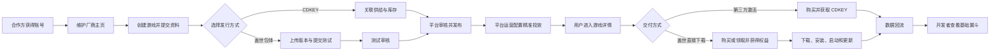

# 正版发行平台一期（2026 年 11 月）产品设计规格

## 1. 文档状态

- 需求编号：`GUANWANGGAID-46`
- 设计状态：已获用户确认，进入书面规格评审
- 设计日期：2026-09-01
- 目标版本：2026 年 11 月一期 MVP
- 文档性质：产品设计与 PRD 地图，不包含程序预研、接口设计和研发排期

## 2. 输入与事实依据

本设计以以下资料为输入：

- `游戏分发平台建设构想.md`：20 个平台模块、四期路线和原一期能力清单。
- `聊聊盖世正版发行平台建设-文字记录-2026-08-31.md`：一期目标、产品形态、人力约束及 11 月节点讨论。
- 现有《CDKEY 售卖需求》及其评审修订设计：用户购买、订单、交付和退款的既有规则。
- WeGame、Steamworks、Epic Games Store、GOG 官方开发者与发行资料：开发者准入、构建发布、权益、退款及数据能力参考。

会议中的直接依据：

- `00:40:28`：一期由开发者相关能力、发行推广能力和 CDKEY 售卖闭环共同组成。
- `00:45:51`：目标是包含包体发行和 CDKEY 分销的混合版本。
- `01:10:53`：一期服务已经谈下来的首批正版产品，基本功能需完备，衍生功能后置。
- `01:25:19`：11 月一期需包含包体发行的基本能力。
- `02:00:16`：开发者传包、测试取包、审核、待上线和正式发布构成明确业务流程。

## 3. 已确认产品决策

### D-001：一期采用混合发行模式

平台同时承载两种交付方式：

1. **CDKEY 分销**：用户在盖世完成购买，由平台交付第三方平台激活码；用户在指定第三方平台激活、下载和游玩。
2. **盖世包体发行**：合作厂商向盖世提交游戏包体，用户获得盖世权益后直接在盖世下载、安装、启动和更新。

两种方式共享厂商、游戏、商品、发行状态和数据对象，但保持不同的用户交付路径。CDKEY 用户侧规则复用既有 PRD，不在本项目重复定义。

### D-002：一期必须包含开发者平台和厂商主页

一期只面向已签约、受邀合作方，不开放公众注册。合作方可维护厂商资料、创建游戏、提交发行资料、查看审核状态、提交包体或关联 CDKEY 供给、提交投放需求并查看自身游戏数据。

厂商主页采用固定模板，只展示厂商资料和已发布游戏；不包含社区、私域运营、测试招募和自定义页面装修。

### D-003：一期必须包含规则式精准化投放

采用方案 A：开发者提交素材、推广目标和目标人群建议；平台运营审核后，使用现有用户数据按规则圈选人群，配置现有资源位、投放时间、频次和优先顺序；开发者只读查看效果数据。

一期不建设广告竞价、预算消耗、开发者自助发布和推荐算法。

### D-004：一期包体发行只覆盖单游戏最小闭环

- 1 个已签约厂商。
- 1 款 Windows 游戏。
- 单一正式发布分支。
- 支持首个正式版本和后续版本更新。
- 支持开发者提交、平台测试审核、发布、用户获取、下载、安装、启动和更新。
- 不做多端、多分支、预载、复杂灰度和开发者开放生态。

## 4. 一期目标与边界

### 4.1 目标用户

| 角色 | 一期需要解决的问题 |
|---|---|
| 已签约游戏厂商 | 能够在一个统一入口提交厂商、游戏、CDKEY 或包体资料，跟踪审核与发布结果，并查看基础发行效果 |
| 平台发行运营 | 能够审核游戏和素材、组织测试、控制发布、配置精准投放并处理下架与异常 |
| 盖世用户 | 能够清楚识别游戏的交付方式，完成购买或领取，并正确进入第三方激活或盖世直接下载流程 |
| 测试人员 | 能够从待测任务中获取指定包体，记录结果并推动版本进入发布或驳回状态 |

### 4.2 一期成功形态

首批合作游戏能够完成以下完整产品流程：

## 5. 产品组成

### 5.1 开发者平台

一期页面与能力：

1. **受邀账号登录**：合作方使用平台创建的账号进入，只能查看本厂商数据。
2. **厂商资料**：维护厂商名称、Logo、简介、官网及联系信息；提交后由平台审核。
3. **游戏列表**：查看游戏、发行方式、资料审核、版本、发布和投放状态。
4. **创建/编辑游戏**：填写基本资料、宣传素材、语言、地区、系统要求、游戏标签和发行方式。
5. **CDKEY 供给状态**：查看已关联的供应方、SKU、激活平台、地区和可售库存状态。
6. **包体版本**：上传版本、填写版本号、更新说明、启动信息并提交测试。
7. **投放需求**：提交投放素材、推广目标、期望人群和期望时间。
8. **发行数据**：查看自身游戏及投放计划的基础漏斗。

一期不支持合作方自行创建成员、配置复杂权限、签署在线合同、设置结算账户或直接发布游戏和投放计划。

### 5.2 厂商主页与游戏详情

**厂商主页固定内容：**

- 厂商 Logo、名称、简介、官网。
- 已在盖世发布的游戏列表。
- 游戏卡片的发行状态和交付方式。

**游戏详情必须展示：**

- 游戏名称、封面、宣传素材、简介、类型和系统要求。
- 发行厂商和厂商主页入口。
- 价格或领取条件。
- 明确的交付方式标签：`第三方平台激活` 或 `盖世直接下载`。
- CDKEY 游戏的激活平台、地区限制和退款边界。
- 包体游戏的支持系统、下载大小和更新要求。

交付方式必须在游戏详情、结算确认、订单和游戏库保持一致；精准投放只能改变曝光对象，不得省略或弱化交付限制。

### 5.3 CDKEY 发行分支

一期新增范围仅覆盖供给侧与平台整体衔接：

- 厂商、游戏、商品 SKU、激活平台、销售地区与供应来源的关联。
- 供应库存状态、可售/停售状态及平台审核状态。
- 开发者查看与自身游戏相关的库存状态和异常提示。
- 平台运营执行关联、停售和异常处理。

用户购买、支付、订单、Key 交付、激活指引和退款继续使用现有 CDKEY PRD。

一期默认沿用现有供应商 API 供货模式；开发者平台不新增批量明文上传 Key。若实际合作方存在直接供 Key 场景，应在《游戏商品与 CDKEY 供给管理 PRD》中作为受控供给类型补充，不改变用户侧流程。

### 5.4 包体、测试审核与版本发布

**开发者侧：**

- 为已审核通过的游戏创建版本。
- 上传 Windows 游戏包体。
- 填写版本号、更新说明、启动文件、启动参数和必要运行说明。
- 提交测试；被驳回后查看原因、修改并重新提交。
- 查看当前线上版本和待处理版本状态。

**测试侧：**

- 查看分配给自己的待测版本。
- 获取包体和测试说明。
- 记录通过或不通过，并填写问题说明。
- 不通过时版本退回开发者；通过时进入待发布。

**平台运营侧：**

- 审核游戏资料与包体版本是否属于已签约项目。
- 将测试通过的版本设为待发布。
- 立即或定时发布、下架游戏、撤回未发布版本。
- 出现重大问题时暂停下载或启动入口，并在开发者平台显示处理状态。

**一期版本约束：**

- 一个游戏同时只有一个正式线上版本。
- 新版本发布后成为用户可获取版本。
- 更新失败时保留用户当前可运行版本和重试入口；一期不提供开发者自助多版本回滚。

### 5.5 用户购买、权益与游戏库

**CDKEY 游戏：**

- 购买成功后订单展示 Key 或取 Key 状态。
- 游戏库展示“第三方平台激活”及激活入口/指引，不展示盖世下载按钮。

**盖世包体游戏：**

- 用户完成购买或零价领取后获得盖世游戏权益。
- 游戏进入游戏库并展示“盖世直接下载”。
- 未获得权益时不可下载或启动。
- 商品下架不删除用户已获得的有效权益；因合同、退款或违规需要撤销时，按明确原因更新权益状态并向用户展示可理解的结果。

游戏库统一展示游戏名称、封面、交付方式、权益状态和下一步操作，禁止让同一游戏同时出现相互冲突的 CDKEY 与包体入口。

### 5.6 下载、安装、启动与更新

一期用户流程：

1. 用户在游戏库点击“下载”。
2. 选择安装位置并开始下载。
3. 支持暂停、继续、取消和失败重试。
4. 下载完成后校验并安装；失败时保留可恢复状态。
5. 安装成功后显示“启动游戏”。
6. 启动前确认用户权益和必要版本状态。
7. 存在必须更新的正式版本时，完成更新后才能启动。
8. 用户可执行修复和卸载。

一期不提供预载、多个下载分支、P2P、复杂增量包选择、离线设备管理和高级 DRM 设置页面。

### 5.7 规则式精准化投放

#### 游戏标签

开发者提交游戏类型、题材、玩法、适配设备、支持系统及系统要求等标签；平台运营审核、修正后生效。未审核标签不能用于正式投放。

#### 用户圈选条件

一期只使用平台已有或本期主流程自然产生的数据：

- 用户所在地区与语言。
- 设备、系统及是否满足游戏运行要求。
- 已获得游戏及其类型。
- 游戏详情浏览、购买/领取、下载和启动行为。
- 平台已有的合法兴趣标签。

一期不新增 Steam 游戏库导入、首次偏好问卷和跨平台数据抓取。

#### 投放计划

开发者提交素材、推广目标、期望人群和时间；平台运营完成：

- 素材与目标页面审核。
- 选择现有资源位。
- 配置人群条件、排除条件、开始/结束时间、展示频次和优先顺序。
- 预估命中人群并检查空人群。
- 启动、暂停、结束计划。

同一资源位存在多个计划时，由平台配置的优先顺序决定；用户不满足游戏系统要求或地区限制时不得被纳入投放。

#### 效果数据

开发者仅查看自身游戏：

- 曝光人数与次数。
- 点击人数与次数。
- 游戏详情访问人数。
- 购买/领取人数。
- 包体游戏下载人数与首次启动人数；CDKEY 游戏显示 Key 成功交付人数，激活数据仅在实际可获取时展示。
- 按日趋势及从曝光到最终可观测行为的漏斗。

一期默认按 `campaign_id + game_id` 归集数据，数据看板采用 T+1 更新；若平台现有数据能力可稳定提供更高时效，可在详细 PRD 中改为更短周期。

## 6. 核心状态

### 6.1 游戏项目状态

`草稿 → 资料审核中 → 已驳回/资料已通过 → 待发布 → 已发布 → 已下架`

- 驳回后保留已有输入和原因，开发者修改后重新提交。
- 已发布游戏修改关键资料时，修改内容重新审核，线上内容在审核通过前保持不变。

### 6.2 包体版本状态

`草稿 → 上传中 → 待提交 → 测试中 → 测试不通过/测试通过 → 待发布 → 已发布 → 已撤回`

- 上传失败可继续或重新上传，不生成可测试版本。
- 测试不通过需记录原因；重新提交后产生新的测试轮次。
- 已发布版本不能直接删除，只能由新版本替代或由平台下架。

### 6.3 投放计划状态

`开发者已提交 → 平台配置中 → 已排期 → 投放中 → 已暂停/已结束/已驳回`

- 素材不合规、目标页面未发布或目标人群为空时不能进入已排期。
- 游戏下架后，关联投放计划自动停止继续曝光。

## 7. 异常与恢复原则

| 场景 | 产品处理 |
|---|---|
| 开发者越权访问其他厂商 | 不展示数据并返回无权限结果，平台保留操作记录 |
| CDKEY 库存不足或供应异常 | 停止新的可售曝光；订单与退款继续按既有 CDKEY PRD处理 |
| 包体上传中断 | 保留版本草稿与已填写信息，允许继续或重新上传 |
| 测试不通过 | 展示问题说明并允许开发者修订后重新提交 |
| 发布失败 | 版本保持待发布，用户继续使用原线上版本；平台可重试 |
| 用户设备不满足要求 | 详情页和投放阶段即提示/排除，禁止到下载后才首次告知 |
| 已支付但权益未生成 | 订单显示处理中并进入平台异常处理，不允许重复扣款 |
| 下载或更新失败 | 保留任务、当前可用版本和重试入口，不产生不可恢复安装状态 |
| 投放目标人群为空 | 禁止启动，提示运营调整圈选条件 |
| 投放素材或落地游戏下架 | 计划停止曝光并显示停止原因 |
| 数据延迟或缺失 | 显示数据更新时间和异常状态，不以 0 替代未知数据 |

## 8. 一期明确不包含

- 开放开发者注册、在线合同、复杂组织与成员权限。
- Mac、Linux、移动端或主机包体同步发行。
- 多游戏并行规模化接入、多正式分支、抢先体验和测试分支自助管理。
- 自动结算、税务、发票、复杂分账和开发者提款。
- 推荐算法、广告竞价、预算计费、开发者自助启动投放。
- Steam 游戏库导入、首次游戏偏好问卷、第三方用户画像抓取。
- 社区、私域运营、测试玩家招募、成就、云存档、Overlay 和创意工坊。
- 高级 DRM、反作弊、强加壳、离线设备管理和盗版监控。
- 预载、P2P、复杂增量更新、智能 CDN 调度和开发者自助版本回滚。

## 9. 一期 PRD 地图

| 顺序 | 产品文档 | 核心边界 | 主要依赖 |
|---|---|---|---|
| 1 | 《正版发行平台一期产品总纲》 | 角色、对象、两种发行方式、全流程、统一状态和文档边界 | 本设计规格 |
| 2 | 《开发者平台、厂商主页与游戏创建 PRD》 | 受邀账号、厂商资料、主页、游戏创建、资料审核和标签 | 总纲 |
| 3 | 《游戏商品与 CDKEY 供给管理 PRD》 | 商品、SKU、供应关联、库存状态及与既有 CDKEY PRD衔接 | 既有 CDKEY PRD、开发者平台 |
| 4 | 《游戏包体、测试审核与版本发布 PRD》 | 上传、版本、测试、驳回、发布、下架和异常恢复 | 开发者平台、总纲 |
| 5 | 《用户购买、权益与游戏库 PRD》 | 交付方式区分、购买/领取、权益和游戏库状态 | 既有 CDKEY PRD、商品、版本发布 |
| 6 | 《游戏下载、安装、启动与更新 PRD》 | 下载任务、安装、启动、修复、卸载和版本更新 | 权益、已发布包体 |
| 7 | 《精准化投放与发行数据看板 PRD》 | 标签、圈选、素材、资源位、频控、投放状态和漏斗 | 游戏资料、商品、权益、下载与启动数据 |

文档按上述顺序建立；后续文档引用前序稳定对象，但不得以远程引用代替本端必要规则。

## 10. 产品验收场景

### 10.1 CDKEY 分支

1. 已签约厂商与 CDKEY 商品、激活平台、地区和供应状态关联成功。
2. 游戏详情明确显示第三方激活信息。
3. 用户完成既有购买与 Key 交付流程，游戏库不出现盖世下载入口。
4. 开发者可查看商品与基础发行数据，但不能查看其他厂商数据。

### 10.2 包体发行分支

1. 开发者创建游戏、提交资料和首个包体版本。
2. 平台完成资料审核、测试驳回、重新提交、测试通过和发布。
3. 用户购买或领取后获得盖世权益，游戏进入游戏库。
4. 用户完成下载、暂停/继续、安装、启动和新版本更新。
5. 游戏下架后停止新用户获取，但按业务规则保留已获得用户的权益表现。

### 10.3 精准投放分支

1. 开发者提交素材、目标与期望人群。
2. 平台审核素材，选择现有资源位和人群规则并排期。
3. 不满足地区或系统要求的用户不进入目标人群。
4. 投放结束后，开发者看到曝光、点击、购买/领取、下载和启动漏斗。
5. 游戏下架、素材失效或人群为空时，计划不能继续投放。

## 11. 快速评审结论与设计修正

- **用户视角风险**：用户可能混淆第三方 CDKEY 与盖世直接下载。已通过四处统一交付方式标签、付款前展示限制及游戏库差异化入口处理。
- **开发视角风险**：开发者平台、包体链路、客户端和精准投放同时新建可能导致 11 月失控。已限制为受邀厂商、单款 Windows 游戏、固定主页模板、单正式版本、既有资源位和规则圈选；不做开放注册、复杂权限、算法和多分支。
- **商业视角风险**：未签署发行权、定价分成和结算责任时，精准投放无法形成可核算结果。已将签约范围、发行地区和商品配置设为游戏发布前置条件，数据回流覆盖获取、下载和启动。

## 12. 详细 PRD 前的待确认项

| 待确认项 | 默认方案 | 影响范围 | 阻塞性 |
|---|---|---|---|
| 首款包体游戏及其付费/免费类型 | 选择已签约、Windows 单机、无复杂反作弊的游戏；商品支持合同约定的购买或零价领取 | 商品、权益、退款与详情文案 | 阻塞包体相关详细 PRD定稿 |
| 当前 CDKEY 实际供给方式 | 默认复用现有供应商 API；开发者平台只做厂商/游戏/SKU关联与状态展示 | CDKEY 供给管理页面 | 不阻塞总纲，阻塞第 3 份 PRD定稿 |
| 可复用的现有资源位 | 默认使用首页及现有游戏推荐位，不新增客户端入口 | 精准投放页面和曝光事件 | 阻塞第 7 份 PRD图示与页面清单 |
| 可直接使用的用户标签 | 默认使用地区、语言、设备/系统及本平台内游戏行为；无数据的标签不出现在圈选器 | 人群圈选与数据口径 | 阻塞第 7 份 PRD字段定稿 |

以上待确认项均已给出默认方案；若业务输入变化，只影响对应模块，不改变一期混合发行与规则式精准投放的总体结构。
