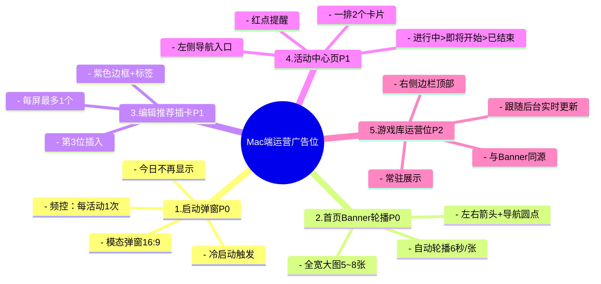
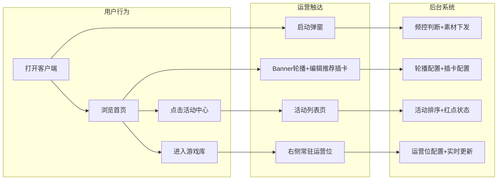
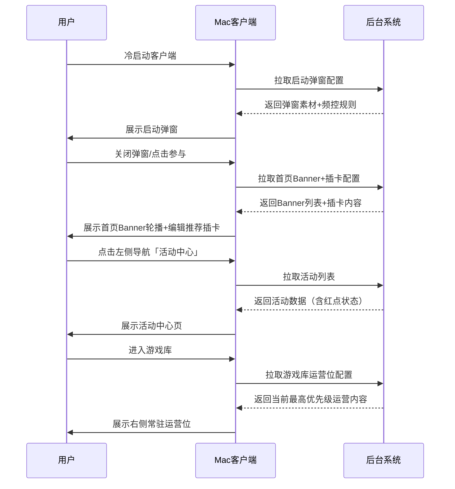

# 【PRD】Mac端运营广告位需求

## 文档信息

| 项目 | 内容 |
|------|------|
| 文档名称 | Mac端运营广告位需求 PRD |
| 文档版本 | V1.0 |
| 文档作者 | 郑群超 |
| 创建日期 | 2026-05-21 |
| 最后更新 | 2026-05-21 |
| 文档状态 | 草稿 |
| 项目优先级 | P0 |

### 更新记录

| 版本 | 日期 | 作者 | 更新内容 |
|------|------|------|----------|
| V1.0 | 2026-05-21 | 郑群超 | 初稿 |

---

## 1. 需求概述

### 1.1 需求背景

当前Mac客户端缺少运营内容推荐能力，用户在客户端内无法有效触达运营活动、热门游戏推荐、资讯公告及新功能推广等信息。需要新增运营广告位体系，建立从冷启动到日常浏览的全链路运营触达能力。

### 1.2 产品目标

1. 建立Mac端完整的运营资源位矩阵，覆盖「被动触达 → 主动浏览 → 场景伴随」全链路
2. 提升运营活动曝光率和用户参与度
3. 为后续精细化运营提供基础设施

### 1.3 产品范围

| 编号 | 功能模块 | 优先级 | 触达方式 |
|------|---------|--------|---------|
| 1 | 启动弹窗 | P0 | 被动触达（冷启动） |
| 2 | 首页Banner轮播 | P0 | 被动曝光（浏览首页） |
| 3 | 编辑推荐运营插卡 | P1 | 自然融入（内容流） |
| 4 | 活动中心页 | P1 | 主动回访（导航入口） |
| 5 | 游戏库常驻运营位 | P2 | 场景伴随（游戏库） |

---

## 2. 功能架构

---

## 3. 功能需求详细说明

### 3.1 启动弹窗

| 维度 | 说明 |
|------|------|
| 触发时机 | 用户冷启动客户端时 |
| 展示形态 | 居中模态弹窗：活动图片（16:9）+ 标题 + 描述文案 + 「立即参与」按钮 |
| 关闭方式 | 弹窗右上角外侧 X 按钮 |
| 频控策略 | 每个活动仅展示1次；支持「今日不再显示」勾选，勾选后当日不再弹出 |
| 点击行为 | 「立即参与」→ 跳转对应活动详情页/落地页 |
| 内容类型 | 重大运营活动、版本更新公告 |

### 3.2 首页Banner轮播

| 维度 | 说明 |
|------|------|
| 位置 | 首页内容区顶部，占据主视觉区域 |
| 展示形态 | 全宽大图轮播，支持配置5~8张 |
| 切换方式 | 自动轮播（6秒/张）+ 左右箭头手动切换 + 底部导航圆点 |
| 内容类型 | 运营活动、热门游戏推荐、平台公告、新功能推广 |
| 点击行为 | 点击整张Banner跳转对应落地页 |
| 后台配置 | 支持配置图片、跳转链接、排序权重、上下架时间 |

### 3.3 编辑推荐运营插卡

| 维度 | 说明 |
|------|------|
| 位置 | 首页「编辑推荐」卡片列表第3位 |
| 展示形态 | 与普通游戏卡片同尺寸，通过紫色边框 + 左上角标签（如「限时活动」）区分 |
| 频控策略 | 每屏最多展示1个运营卡 |
| 点击行为 | 点击整卡跳转，无额外操作按钮 |
| 内容类型 | 限时活动、新用户福利、新功能推广 |

### 3.4 活动中心页

| 维度 | 说明 |
|------|------|
| 入口 | 左侧导航栏新增「活动中心」icon，有未读活动时显示红点 |
| 页面布局 | 一排展示2个活动卡片，左侧图片 + 右侧文案（标签/标题/描述/时间） |
| 内容类型 | 进行中活动、已结束活动、平台公告、新功能上线 |
| 红点规则 | 有新活动上线且用户未查看时显示红点，进入页面后消除 |
| 排序规则 | 进行中 > 即将开始 > 已结束；同状态按上线时间倒序 |

### 3.5 游戏库常驻运营位

| 维度 | 说明 |
|------|------|
| 位置 | 游戏库页面右侧边栏顶部 |
| 展示形态 | 运营图片（横版）+ 标签 + 标题 + 描述，常驻展示 |
| 内容类型 | 与首页Banner同源，展示当前优先级最高的运营内容 |
| 点击行为 | 点击跳转对应活动页 |
| 更新频率 | 跟随后台配置实时更新 |

---

## 4. 触达链路

### 4.1 泳道图

### 4.2 时序图

---

## 5. 后台配置需求

| 配置项 | 说明 |
|--------|------|
| 广告位管理 | 支持按资源位类型配置内容（弹窗/Banner/插卡/活动/游戏库位） |
| 素材上传 | 图片、标题、描述、跳转链接 |
| 时间控制 | 上架时间、下架时间 |
| 频控设置 | 弹窗频率（每日/每活动/仅一次） |
| 排序权重 | Banner轮播顺序、活动列表排序 |

---

## 6. Demo预览

在线预览：https://z36358631-ship-it.github.io/-/demos/Mac端运营广告位demo.html

点击左侧导航可切换「首页」「活动中心」「游戏库」三个页面查看效果。
