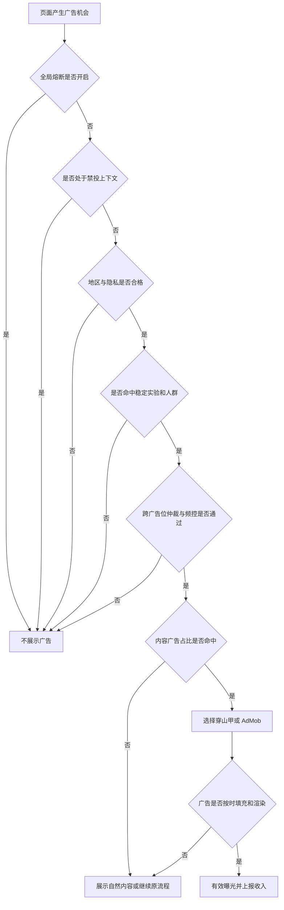
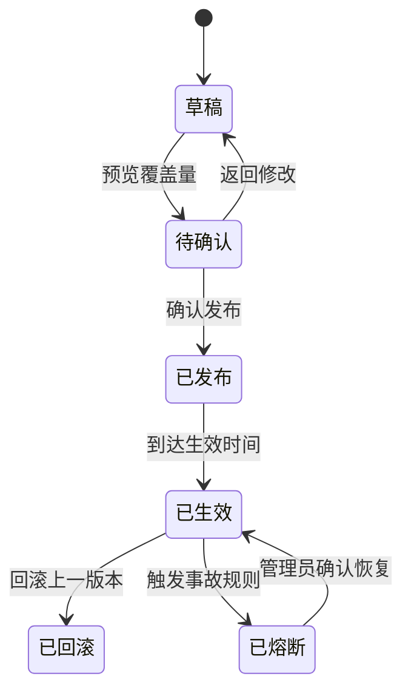
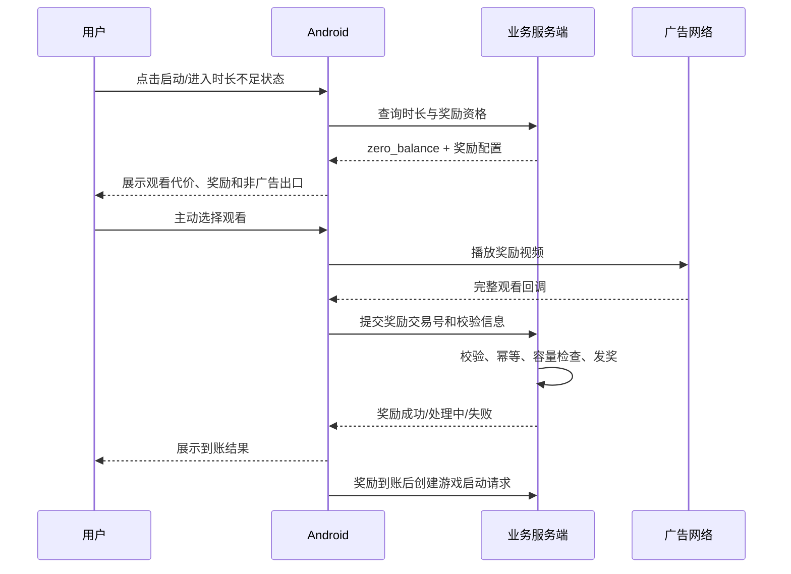
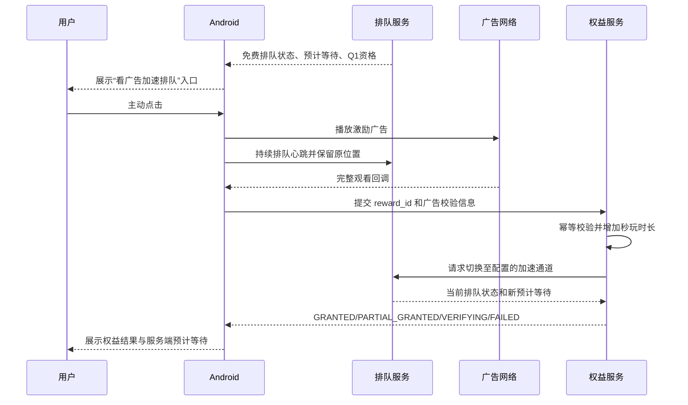

# 【PRD】《盖世游戏》Android 广告接入需求

> 文档版本：V1.1
>
> 创建日期：2026-07-17
>
> 当前状态：评审中
>
> 适用端：Android 客户端、广告服务端、运营后台、数据平台
>
> 本期广告平台：国内穿山甲、海外 AdMob
>
> 上游设计：[盖世游戏 Android 广告接入规划设计](../docs/superpowers/specs/2026-07-17-android-ad-monetization-design.md)

## 1. 文档说明

### 1.1 文档目的

本文定义盖世游戏 Android App 首期广告商业化的产品需求，覆盖广告 SDK 接入、广告位、运营配置、稳定实验、频控、奖励发放、收入归因、禁投保护和熔断。研发和测试应能依据本文完成需求拆分、接口评审、开发和验收。

### 1.2 内容来源标记

- `[已确认]`：用户已明确确认或上游设计已批准的业务结论。
- `[推导]`：为闭环业务流程必须存在的产品规则。
- `[建议方案]`：接口、状态、技术阈值等可在技术评审中调整的实现建议；调整后不得改变已确认业务目标。

### 1.3 功能编号

| 编号 | 功能 | 优先级 | 涉及端 | 本期状态 |
|---|---|---|---|---|
| F001 | 统一广告接入与网络路由 | P0 | Android、服务端 | 本期开发 |
| F002 | 广告策略后台与配置治理 | P0 | 运营后台、服务端 | 本期开发 |
| F003 | 稳定分桶与广告实验 | P0 | Android、服务端、数据平台、运营后台 | 本期开发 |
| F004 | H1 首页原生混投 | P0 | Android、服务端、运营后台 | 本期实验 |
| F005 | P1 玩游戏页赞助卡 | P0 | Android、服务端、运营后台 | 本期实验 |
| F006 | G1 零时长激励广告 | P1 | Android、服务端、运营后台 | 第二阶段实验 |
| F007 | O1 老用户低频开屏 | P2 | Android、服务端、运营后台 | 最后阶段实验 |
| F008 | D1 游戏详情相关赞助 | P2 | Android、服务端、运营后台 | 数据验证后开发 |
| F009 | S1 搜索无结果赞助推荐 | P2 | Android、服务端、运营后台 | 数据验证后开发 |
| F010 | 广告埋点、收益归因与监控 | P0 | Android、服务端、数据平台 | 本期开发 |
| F011 | 全局禁投、频控仲裁与熔断 | P0 | Android、服务端、运营后台 | 本期开发 |
| F012 | Q1 排队加速激励广告 | P1 | Android、服务端、运营后台、数据平台 | 第二阶段实验 |

## 2. 需求背景

### 2.1 现状数据

数据周期：2026-07-10 至 2026-07-16。

| 数据项 | 周数据 | 产品判断 |
|---|---:|---|
| `app_launch` | 646.37 万次、54.33 万用户 | 启动频次高，但未拆冷/热启动，不能直接作为开屏库存 |
| `HomeScreen` | 721.76 万浏览 | 约 103.11 万/日，H1 具备较大验证流量 |
| `banner_exposure` | 708.34 万次 | 现有运营 Banner 曝光，不等于商业广告有效曝光 |
| `banner_click` | 7.49 万次 | 事件比 CTR 约 1.06%，不能视为商业广告 CTR |
| `MainHomeTab` | 246.30 万浏览 | 约 35.19 万/日，P1 具备稳定验证流量 |
| `GameDetailScreen` | 413.61 万浏览 | D1 潜在机会量高，但缺少滚动深度和可见率 |
| `game_play_fail` | 159.58 万次 | 可能存在重复失败上报，仍说明启动链路需优先保护 |
| `game_play_success` | 105.25 万次 | 广告不能引入新的启动干扰 |
| `instant_play_click` | 14.20 万次 | 与详情入口是否重叠需通过新埋点验证 |
| `detail_instant_play_click` | 7.68 万次 | 尚未形成可直接归因的启动漏斗 |
| `cloud_game_enter` | 7.09 万次 | 约 1.01 万/日，可作为 G1 后续转化观察指标 |

`content_item_exposure` 为探索页和游戏库页游戏卡片共用曝光事件，不能直接视为广告库存。现有广告收入字段均为 0，当前只能做情景测算，不能承诺实际收入。

补充历史排队数据：5 月 9 日约 1,390 人发起排队、约 815 人离队，原统计表同时记录约 81.6% 排队离队率。人数与比例的分母口径不完全一致，上线前必须校准；但高等待与高离队方向明确，Q1 应优先验证“降低排队放弃”而不是单独追求广告完成量。

### 2.2 核心问题

1. 平台尚无统一商业广告接入、策略和收益归因能力。
2. 单纯追求曝光会侵入游戏启动、下载、配置等高意图链路，可能用短期广告收入换取留存和信任损失。
3. 后台已有开关和频率配置方向，但“实验用户比例、内容广告占比、用户频控”如果混为一个参数，将无法准确实验和归因。
4. 零时长激励涉及广告收益、包月云容量、奖励成本和业务付费蚕食，必须按单次增量净收益判断。
5. 免费通道长排队存在明显离队风险；如果在排队中被动插入广告会进一步伤害体验，但用户主动以一次激励广告交换“加速通道＋秒玩时长”，可能同时改善进入游戏率和广告收益。

### 2.3 竞品启示

| 平台 | 已观察做法 | 本产品结论 |
|---|---|---|
| TapTap | 首页原生信息流、找游戏和搜索推广 | 参考相关原生广告，不照搬首屏密度 |
| 233 乐园 | 存在激励广告，也有广告过多的负面反馈 | 参考价值交换，不参考高频密度 |
| 小黑盒 | 可确认存在第三方广告，领取链路广告存在负面用户记录 | 下载、领取、配置链路禁投 |
| 好游快爆 | 可确认内容分发和云游戏，具体第三方广告位证据不足 | 不作为具体广告位依据 |

公开资料来源：

- TapTap 商业产品：https://biz.taptap.cn/
- TapTap 推广相关公开说明：https://www.taptap.cn/moment/219477544838104577
- 233 乐园广告体验公开讨论：https://juejin.cn/pin/7589544380518547466
- 游戏平台广告体验公开讨论：https://www.toutiao.com/zixun/7519270095345076265/

以上竞品信息只用于确定候选形式和风险，不作为盖世收入、eCPM 或广告密度基准。

## 3. 产品目标与成功标准

### 3.1 产品目标

1. 建立 Android 统一广告能力，国内使用穿山甲、海外使用 AdMob。
2. 运营能够独立配置广告位、人群、比例、频控和生效时间，无需客户端发版。
3. 使用稳定分桶和长期无新广告组，计算广告带来的增量净收益和用户损伤。
4. 保证游戏启动中、游戏运行中和其他禁投链路的被动、自动和插屏广告曝光为 0；排队阶段仅允许用户主动点击 Q1 后展示一次激励广告。
5. 广告加载、无填充和 SDK 异常不得阻塞页面或游戏流程。

### 3.2 首阶段业务成功标准

- 单个通过实验的原生广告位具备 1 万～5 万元/月的收入情景，最终以真实 `ad_paid` 为准。
- D1、D7 留存和游戏启动成功率均未触发第 14 章止损线。
- 广告收入回调与平台账单偏差不超过 5%。
- 禁投区被动、自动和插屏广告曝光数为 0；Q1 曝光必须 100% 由合格用户主动点击触发。
- 频控违规率不超过 0.1%。

### 3.3 非目标

- 本期不做会员免广告、会员权益或会员定价。
- 本期不接入 iOS 广告。
- 本期不同时接入更多广告聚合 SDK。
- 本期不在游戏启动中、运行中、失败、重连、下载、领取、配置、支付和用户游戏库列表投放被动、自动或插屏广告；免费通道排队中仅保留 Q1 主动激励例外。
- 本期不把预测收入写入财务承诺。

## 4. 用户与角色

### 4.1 App 用户分层

| 用户类型 | 默认定义 | 可展示范围 |
|---|---|---|
| 新用户 | 注册/安装未满 7 天，或成功启动游戏不足 3 次 | 原生广告可实验；不展示 O1 等强打断广告 |
| 老用户 | 注册满 7 天且成功启动游戏不少于 3 次 | 原生广告、G1；满足条件后可进入 O1 实验 |
| 零时长用户 | 服务端判断当前可用云时长为 0 | 启动请求创建前可主动选择 G1 |
| 免费排队用户 | 已进入免费通道，且服务端预计等待时间超过 Q1 阈值 | 排队页可主动选择 Q1；付费快速通道用户不展示 |
| 长期无新广告用户 | 稳定进入长期 Holdout | 不进入本期任何新广告实验 |

### 4.2 后台角色

| 角色 | 权限 |
|---|---|
| 广告运营 | 新建和编辑策略、预览覆盖量、发布常规配置、查看数据 |
| 广告管理员 | 审批高风险配置、恢复已熔断广告位、管理网络路由 |
| 产品/数据 | 创建实验、锁定实验版本、查看分组和指标，不直接修改生产广告素材 |
| 审计/客服 | 只读查看策略版本、发奖交易、异常和用户命中原因 |

## 5. 核心用户场景

### 场景 A：用户浏览玩游戏页

用户进入“玩游戏”页，先看到一个完整自然游戏组。继续浏览后，页面在规定位置展示一张明确标注“广告/赞助”的游戏卡。用户不点击时可继续正常浏览；广告无填充时展示自然内容，不留下空白。

### 场景 B：用户进入首页

用户进入首页，系统先完成禁投、实验、人群和频控判断。命中 H1 时，按运营配置决定该合格内容机会是否使用付费广告。广告不得伪装成编辑推荐；无填充时回退自营内容。

### 场景 C：用户零时长启动云游戏

用户准备启动游戏，服务端在创建启动请求前返回零时长状态。页面明确展示“看约 X 秒广告，获得 Y 分钟”和非广告出口。用户完整观看后，服务端幂等发奖，到账后再创建游戏启动请求。启动请求创建后不再出现广告。

### 场景 D：用户在免费通道长时间排队

用户已进入免费排队，服务端返回预计等待时间超过后台阈值。页面在原“加速排队”区域展示“看广告加速排队”，并明确说明约 15 秒、加速排队、领取 5 分钟和今日剩余次数。用户主动点击并完整观看后，服务端以 `reward_id` 幂等发放 5 分钟，并将用户切入配置的加速通道；客户端只展示服务端返回的新预计等待时间，不承诺固定提升名次。

### 场景 E：用户真正冷启动 App

符合老用户条件的用户主动点击桌面图标冷启动。若命中 O1 实验、频控合格且广告已预加载完成，则展示一次可跳过开屏；否则直接进入首页。后台恢复、Push、Deep Link、崩溃恢复和游戏返回均不触发。

### 场景 F：广告 SDK 或配置异常

广告加载超时、SDK 崩溃风险、配置不可用或地区/隐私状态不明时，系统默认不展示广告并继续原业务流程。运营可熔断单一广告位，不影响游戏启动和其他页面。

## 6. 全局业务流程



资格判断顺序为强制顺序，后置规则不能覆盖前置禁投结论。

## 7. 全局业务规则

### 7.1 三类配置比例

| 参数 | 含义 | 取值 | 约束 |
|---|---|---:|---|
| `experiment_traffic_ratio` | 进入某实验策略的稳定用户比例 | 0%～100% | 按 `user_id` 稳定分配 |
| `content_ad_ratio` | 合格内容机会中使用广告的比例 | 0%～100% | 调整不改变实验用户组 |
| `frequency_cap` | 单用户在指定周期内最多展示次数 | 0～999 | 支持会话、每日、X 天和生命周期 |

三个参数独立保存、独立发布，调整任一参数不得隐式修改另外两个参数。

### 7.2 全局禁投规则

从用户点击“立即游戏/秒玩/启动”并创建启动请求开始，到首个可操作画面出现前，禁止被动广告、自动广告和插屏。固件安装、组件安装、资源检查、排队、调度、客户端启动、连接、加载、失败和重连均属于启动保护链路。

唯一例外：免费通道排队中，服务端预计等待时间超过后台阈值、用户未处于付费快速通道且主动点击 Q1 时，可展示一次激励广告。Q1 不得自动弹出、不得与其他广告串联、不得覆盖排队状态；除该次用户主动触发外，排队阶段广告曝光仍必须为 0。

以下业务上下文同样禁投：

- 游戏运行、虚拟按键和控制器；
- 登录、实名、隐私授权、权限和支付；
- 下载、领取、导入、配置、空间不足和排障；
- 个人游戏库用户资产列表；
- 崩溃恢复、游戏返回、云游返回和外部 App 返回。

### 7.3 广告标识与素材

- 原生广告持续显示“广告”或“赞助”标识。
- 不得使用榜单名次、奖牌、真实玩家评分、编辑精选或用户已拥有等误导语义。
- 禁止赌博、现金贷、色情擦边、仿系统弹窗、虚假关闭和诱导点击素材。
- 默认静音；原生广告不自动全屏，不自动刷新。
- 广告落地页关闭后返回原页面和原滚动位置。

### 7.4 失败回退

- 无填充、加载失败、超时或渲染失败不展示空白骨架。
- H1 回退自营推荐，P1/D1/S1 回退自然列表或不插卡。
- O1 未预加载完成时直接进入首页。
- G1 广告失败不扣领取次数，不创建游戏启动请求。
- Q1 提前关闭、播放失败或校验失败不发权益、不扣次数，并保留原排队位置；校验超时显示“权益确认中”，不得要求重看。

## 8. 功能职责与 IPO 总表

下表是各功能的统一入口、处理、输出、异常和分端职责索引；各功能后续章节定义具体规则和验收标准。

| 功能 | 输入 | 核心处理 | 输出 | 异常/降级 | Android 职责 | 服务端职责 | 运营后台/数据职责 |
|---|---|---|---|---|---|---|---|
| F001 | 广告位、地区、隐私、格式 | 路由网络并统一 SDK 状态 | 统一广告对象和回调 | 不明状态默认无广告 | 适配 SDK、管理生命周期 | 下发路由与映射 | 配置网络、监控可用性 |
| F002 | 运营策略草稿 | 校验、预览、发布、版本化 | 生效策略包 | 校验失败不发布；可回滚 | 拉取并安全缓存 | 校验、存储、分发、审计 | 编辑、确认、发布、回滚 |
| F003 | 用户 ID、实验和版本 | 稳定哈希、互斥与 Holdout | `bucket_id` 和策略资格 | 无稳定 ID 时使用匿名 ID | 携带分组执行页面策略 | 稳定分桶并返回结果 | 创建实验、分析意向样本 |
| F004 | 首页广告机会 | 禁投、人群、频控、占比、请求 | 付费原生卡或自营内容 | 无填充回退自营内容 | 决定位置、渲染和回退 | 返回策略与人群资格 | 配置比例、查看首页损伤 |
| F005 | 玩游戏页首组内容完成 | 资格判断并请求赞助卡 | 列表内赞助卡或自然列表 | 失败时不插卡 | 维护列表位置和滚动状态 | 返回策略与人群资格 | 配置频控、查看自然卡影响 |
| F006 | 零时长和用户主动选择 | 播放、校验、容量判断、幂等发奖 | 奖励到账后继续启动 | 失败不扣次数、不启动 | 展示选择、播放、到账反馈 | 资格、校验、发奖、账本 | 配置奖励并核算成本 |
| F007 | 真正冷启动上下文 | 判断老用户、来源、频控和预加载 | 开屏或直接首页 | 未就绪直接首页 | 识别启动来源并展示 | 返回实验和人群资格 | 配置实验、监控启动损伤 |
| F008 | 详情页进入深度 | 相关性、资格、频控 | 详情后置赞助卡 | 启动后取消未展示广告 | 后置渲染和可视区检测 | 返回相关策略 | 配置品类、分析滚动深度 |
| F009 | 搜索自然结果为 0 | 关键词相关性和广告资格 | 无结果赞助区 | 不相关或无填充则只显示自然引导 | 渲染赞助区 | 返回自然结果数与策略 | 配置品类、分析搜索转化 |
| F010 | 客户端、服务端和 SDK 事件 | 去重、关联、聚合、对账 | 漏斗、收益和实验看板 | 缺字段进入异常监控 | 上报页面和 SDK 事件 | 上报策略、奖励和审计事件 | 建模、看板、对账、告警 |
| F011 | 页面上下文和全部策略 | 按强制优先级仲裁 | 允许/拒绝及原因码 | 服务不可用默认拒绝广告 | 每次请求前执行安全判断 | 下发禁投、频控和熔断状态 | 配置安全规则、恢复熔断 |
| F012 | 免费排队状态和用户主动选择 | 判断阈值、播放、校验、切换加速通道、幂等发时长 | 新预计等待时间和 5 分钟权益 | 失败保留原位置；竞态按完成时状态结算 | 展示入口、维持心跳、播放与结果反馈 | 资格、排队状态、幂等权益和预计时间 | 配置阈值/权益/互斥，分析排队效果 |

## F001 统一广告接入与网络路由

### 8.1 功能概述

Android 通过统一广告接口调用穿山甲和 AdMob，业务页面不直接依赖具体 SDK。国内流量优先穿山甲，海外流量优先 AdMob。

### 8.2 输入、处理、输出与异常

**输入**：`placement_id`、广告格式、地区、隐私状态、策略版本、请求上下文。

**处理**：

1. 校验全局开关和 F011 禁投结果。
2. 根据地区选择广告网络。
3. 将统一请求映射为对应 SDK 请求。
4. 将 SDK 状态统一映射为 request、fill、render、impression、click、close、paid 和 fail。

**输出**：统一广告对象、网络名称、请求 ID、素材类型、曝光和收入回调。

**异常**：地区、隐私或 SDK 状态不明时返回不可请求；SDK 超时或异常时回退原业务内容。

### 8.3 分端需求

**Android**：

- 提供原生、激励视频和开屏三类统一调用能力。
- SDK 初始化不得阻塞首屏主线程。
- 页面销毁、切后台或进入禁投上下文时取消未展示广告。
- 同一请求的回调只消费一次，防止重复曝光和重复关闭。

**服务端**：

- 下发地区到广告网络的路由规则和广告位 ID 映射。
- 支持单网络和单广告位停用。
- 不向客户端下发广告平台密钥等敏感信息。

**运营后台**：配置国内/海外网络、广告位映射、启停和生效版本。

### 8.4 端到端契约

[建议方案] 客户端统一结果状态：`NOT_ELIGIBLE`、`NO_FILL`、`LOADED`、`IMPRESSION`、`CLICKED`、`CLOSED`、`FAILED`。

### 8.5 验收标准

- `AC-F001-01 [Android]`：国内合格请求仅调用穿山甲，海外合格请求仅调用 AdMob，路由准确率 100%。
- `AC-F001-02 [端到端]`：广告无填充或加载失败时，原页面功能不阻塞且不出现空白广告位。
- `AC-F001-03 [Android]`：SDK 初始化后，P95 首屏可交互时间增量不超过 300ms。
- `AC-F001-04 [服务端]`：关闭单一网络后，配置在 P95 60 秒内对在线客户端生效。

## F002 广告策略后台与配置治理

### 8.6 功能概述

运营在后台按广告位配置开关、地区、人群、实验流量、广告内容占比、频控、时间和回退策略，并完成预览、发布、审计和回滚。

### 8.7 配置字段

| 字段 | 类型/范围 | 必填 | 说明 |
|---|---|---|---|
| `placement_id` | 字符串，创建后不可改 | 是 | H1/P1/G1/Q1/O1/D1/S1 |
| `enabled` | 布尔 | 是 | 广告位总开关 |
| `country_group` | CN/OVERSEAS/自定义集合 | 是 | 地区范围 |
| `user_scope` | ALL/NEW/OLD/自定义 | 是 | 用户人群 |
| `min_app_version` | 版本号 | 是 | 低版本不命中 |
| `experiment_id` | 字符串 | 否 | 无实验时为空 |
| `experiment_traffic_ratio` | 0～100，最多两位小数 | 是 | 稳定实验流量 |
| `content_ad_ratio` | 0～100，最多两位小数 | 是 | 合格内容机会的广告占比 |
| `frequency_type` | SESSION/DAY/ROLLING_DAYS/LIFETIME | 是 | 频控类型 |
| `frequency_count` | 0～999 | 是 | 周期内最多次数 |
| `window_days` | 1～365 | 条件必填 | `ROLLING_DAYS` 时必填 |
| `cooldown_minutes` | 0～10080 | 是 | 两次展示最短间隔 |
| `effective_at` | 时间 | 是 | 生效时间 |
| `expire_at` | 时间 | 否 | 为空表示长期有效 |
| `fallback_type` | SELF_CONTENT/NATURAL_CONTENT/SKIP | 是 | 失败回退 |
| `change_reason` | 1～200 字 | 是 | 发布原因 |

Q1 选择后额外展示并保存以下字段；国内、海外 Tab 独立配置：

| 字段 | 类型/范围 | 必填 | 说明 |
|---|---|---|---|
| `queue_wait_threshold_minutes` | 1～240 整数 | 是 | 服务端预计等待时间大于该值才展示入口 |
| `queue_reward_minutes` | 1～60 整数 | 是 | 完整观看后发放的秒玩时长，首发建议 5 分钟 |
| `queue_acceleration_level` | 服务端枚举 | 是 | 切入哪个加速通道，不等价于固定提升名次 |
| `queue_reward_frequency` | DAY/ROLLING_DAYS/LIFETIME | 是 | Q1 独立奖励频控 |
| `queue_reward_count` | 1～99 | 是 | 对应周期内最多成功领取次数 |
| `g1_q1_session_mutex` | 布尔 | 是 | 默认开启，同一游戏意图会话只允许 G1/Q1 成功触发其一 |

### 8.8 发布流程



### 8.9 业务规则

- 运营可配置 0%～100% 广告占比，不在客户端写死。
- `content_ad_ratio` 高于 30%时后台显示风险提示并要求二次确认，但不阻止授权运营发布。
- 每次发布生成不可变 `policy_version`，记录操作者、审批者、旧值、新值、原因和时间。
- 正在进行统计判断的实验修改核心参数后，自动生成新实验版本，旧版本停止继续累计决策样本。
- 已熔断策略只有广告管理员可恢复。
- Q1 等待阈值、赠送时长、加速等级、频控和 G1/Q1 互斥必须作为同一策略版本发布，禁止客户端拼接不同版本字段。

### 8.10 验收标准

- `AC-F002-01 [运营后台]`：实验流量、内容广告占比和频控可分别保存，修改一个字段不改变另外两个字段。
- `AC-F002-02 [运营后台]`：发布前展示预计覆盖用户、曝光变化和高风险提示。
- `AC-F002-03 [服务端]`：每次发布均产生唯一策略版本，历史版本可查询且不可篡改。
- `AC-F002-04 [端到端]`：正常配置发布 P95 5 分钟内生效，紧急熔断 P95 60 秒内生效。
- `AC-F002-05 [权限]`：普通运营无法恢复已熔断策略。
- `AC-F002-06 [运营后台]`：Q1 的等待阈值、赠送时长、加速等级、独立频控和 G1/Q1 互斥均可按国内/海外分别保存与发布。

## F003 稳定分桶与广告实验

### 8.11 功能概述

系统按 `user_id` 稳定分桶，支持 A/A、长期无新广告组、阶段对照组和资源位实验组，避免用户跨天或重启后切组。

### 8.12 业务规则

- 同一 `experiment_id + experiment_version + user_id` 始终得到同一 `bucket_id`。
- 未登录用户使用稳定设备匿名 ID；登录后从下一个实验版本开始使用 `user_id`，不在进行中的实验内强制换组。
- 首轮 H1/P1 分组：长期无新广告 10%、阶段对照 70%、H1 10%、P1 10%。比例由后台可配。
- H1 与 P1 首轮互斥；长期无新广告用户不进入本期其他新广告实验。
- 实验分析采用意向分析，按已分桶用户计算，不只分析成功曝光用户。

### 8.13 A/A 与灰度

- 正式曝光前运行 2～3 天 A/A，所有组均不展示新广告。
- A/A 检查用户量、地区、设备、历史活跃和核心指标均衡。
- 技术灰度按 `1% → 5% → 10%`；每阶段至少覆盖一个业务高峰。
- 达到目标比例后冻结核心参数；H1/P1 至少观察 14 天，判断 D7 时总周期 21 天。

### 8.14 验收标准

- `AC-F003-01 [服务端]`：同一用户连续请求 100 次、跨天和重启后分桶结果一致率 100%。
- `AC-F003-02 [端到端]`：H1 用户不命中 P1，P1 用户不命中 H1，互斥违规率为 0。
- `AC-F003-03 [数据]`：所有合格用户均产生一次 `experiment_assignment`，重复上报可去重。
- `AC-F003-04 [运营后台]`：修改实验核心参数后自动生成新 `experiment_version`。

## F004 H1 首页原生混投

### 8.15 功能概述

首页“今日推荐”区域接入原生付费广告，并与自营内容按后台比例混投。广告不能默认占据第一推荐，也不能伪装成编辑内容。

### 8.16 触发与处理

**输入**：用户进入首页或首页内容重新生成有效机会。

**处理**：依次执行 F011 禁投、F003 分桶、F002 人群与频控、`content_ad_ratio` 抽样，再请求原生广告。

**输出**：展示付费原生卡或自营推荐。

**异常**：无填充、超时、素材被拦截时立即使用自营内容；不延迟首页展示。

### 8.17 展示规则

- 首页存在轮播/多卡时，广告不得成为默认第一张。
- 首页只有唯一首位大卡时，广告位下移到第一组自然内容之后。
- 标题使用“广告”或“赞助推荐”，不使用“今日推荐”“编辑精选”。
- 不自动播放有声视频，不自动刷新。
- 每次首页访问最多形成 1 次有效商业广告曝光机会。

### 8.18 验收标准

- `AC-F004-01 [Android]`：广告不会成为默认第一推荐；唯一首位大卡场景下广告显示在第一组自然内容之后。
- `AC-F004-02 [Android]`：广告标识在整个可见期间持续显示。
- `AC-F004-03 [端到端]`：无填充时自营内容正常展示，首页布局不留空。
- `AC-F004-04 [数据]`：曝光只在满足 SDK 有效曝光条件后上报，不在请求或卡片创建时上报。

## F005 P1 玩游戏页赞助卡

### 8.19 功能概述

在“玩游戏”页第一组完整自然内容之后插入一张赞助游戏卡，不侵入用户资产和游戏操作区域。

### 8.20 展示规则

- 先展示 4～6 个自然游戏或一个完整自然内容组。
- 不进入“最近常玩”“我的游戏库”或榜单名次中。
- 卡片可沿用自然游戏卡尺寸，但使用可识别的广告标识、边框或背景。
- 不遮挡秒玩、启动、下载或列表滚动。
- 单次访问最多 1 张，不自动刷新。
- 广告被关闭或失败后，后续自然卡片顺序保持不变。

### 8.21 验收标准

- `AC-F005-01 [Android]`：广告前至少存在一个完整自然内容组，且不占列表第一张。
- `AC-F005-02 [Android]`：广告不携带自然榜单名次、奖牌或虚假评分。
- `AC-F005-03 [端到端]`：同一次页面访问最多产生 1 次 P1 有效曝光。
- `AC-F005-04 [数据]`：自然游戏卡点击和广告点击使用不同事件，不复用 `content_item_exposure` 判断广告库存。

## F006 G1 零时长激励广告

### 8.22 功能概述

零时长用户在游戏启动请求创建前，可主动观看奖励视频换取额外云时长。奖励由服务端校验并幂等发放。

### 8.23 主流程



### 8.24 奖励规则

- 首次奖励默认建议 5 分钟，生命周期最多 1 次；运营可配。
- 日常奖励默认建议 3 分钟，每日最多 1 次；运营可配。
- CTA 明确展示预计视频时长、奖励分钟和当日剩余次数。
- 必须同时提供返回、等待额度恢复或其他现有非广告出口。
- 广告失败或用户未完整观看不发奖、不扣领取次数。
- 完整观看后回调延迟时显示“奖励确认中”，支持查询和补发。
- 奖励成功后才创建游戏启动请求；启动流程中不再出现广告。

### 8.25 容量和单位经济

| 实时集群利用率 | 服务端策略 |
|---:|---|
| `<75%` | 正常开放首次和日常奖励 |
| `75%～85%` | 按后台策略降低分钟、限制时段或减少次数 |
| `>85%` | 返回容量限制，不展示奖励入口 |

完全分摊成本按约 0.80 元/小时测算：3 分钟约 0.04 元，5 分钟约 0.0667 元。日常奖励放量条件为“每次完整观看实际收入不低于单次奖励完全成本的 1.3 倍”。

### 8.26 状态与异常

| 状态 | 客户端表现 | 服务端处理 |
|---|---|---|
| `AVAILABLE` | 展示奖励入口 | 返回分钟、次数和交易参数 |
| `CAPACITY_BLOCKED` | 不展示入口 | 不创建交易 |
| `PLAYING` | 播放广告 | 等待广告校验 |
| `VERIFYING` | 展示“奖励确认中” | 幂等校验，允许查询 |
| `GRANTED` | 展示到账并继续启动 | 增加时长并记录账本 |
| `FAILED` | 提示稍后重试，不扣次数 | 记录失败原因 |
| `ALREADY_GRANTED` | 按已到账展示 | 返回原交易结果 |

### 8.27 验收标准

- `AC-F006-01 [端到端]`：奖励成功后 P95 3 秒内在时长账户可见。
- `AC-F006-02 [服务端]`：同一奖励交易号重复提交 10 次只发放一次奖励。
- `AC-F006-03 [端到端]`：广告失败、未完成或校验失败不扣用户领取次数。
- `AC-F006-04 [端到端]`：奖励漏发率不超过 0.2%，可确认重复发奖数为 0。
- `AC-F006-05 [Android]`：游戏启动请求创建后，G1 及其他广告均不再展示。

## F007 O1 老用户低频开屏

### 8.28 功能概述

仅对符合条件的老用户，在真正冷启动且广告已预加载完成时实验低频开屏。

### 8.29 真正冷启动定义

App 进程已结束，用户主动点击桌面图标启动。以下全部排除：后台恢复、Push、Deep Link、外部分享、支付/登录回跳、游戏/云游返回、崩溃恢复、更新后首次启动和长期沉默后的首次回流。

### 8.30 规则

- 默认合格人群为注册满 7 天且成功启动游戏不少于 3 次。
- 新用户不进入 O1。
- 广告未预加载完成时直接进入首页，不等待补加载。
- 同一会话展示 O1 后，不再展示其他非自愿全屏广告。
- 首轮实验支持“生命周期 1 次”和“每 7 天 1 次”两组，比例均由后台配置。

### 8.31 验收标准

- `AC-F007-01 [Android]`：热启动、Push、Deep Link、崩溃恢复和游戏返回触发 O1 的次数为 0。
- `AC-F007-02 [Android]`：广告未就绪时立即进入首页，不新增广告等待页。
- `AC-F007-03 [端到端]`：新用户和长期无新广告用户 O1 曝光为 0。
- `AC-F007-04 [数据]`：每次 O1 机会均记录 `launch_type` 和排除原因。

## F008 D1 游戏详情相关赞助

### 8.32 功能概述

在游戏详情页核心启动按钮、兼容性、配置建议和主要介绍之后，展示相关游戏或相关外设赞助卡。本功能在滚动深度数据验证机会量后开放。

### 8.33 规则

- 广告不得出现在启动按钮之前或配置排障信息中。
- 只有广告卡进入有效可视区域后才上报曝光。
- 仅接受与当前游戏、游戏品类、手柄或数码设备高相关素材。
- 每次详情访问最多 1 张；游戏启动请求创建后立即取消未展示广告。

### 8.34 验收标准

- `AC-F008-01 [Android]`：广告位位于核心启动和兼容信息之后。
- `AC-F008-02 [Android]`：用户点击启动后，未展示广告立即取消且启动流程不受影响。
- `AC-F008-03 [数据]`：请求、进入可视区和有效曝光分别上报。

## F009 S1 搜索无结果赞助推荐

### 8.35 功能概述

搜索无自然结果时，可展示与关键词相关的赞助推荐，为用户提供替代选择。存在自然结果时，广告不得抢占第一条自然结果。

### 8.36 规则

- 只有服务端返回自然结果为 0 时才展示无结果赞助区。
- 广告必须与搜索词或识别出的游戏品类相关。
- 广告与“换个关键词试试”等自然引导同时存在，不成为唯一出口。
- 同一次搜索请求最多 1 张赞助卡。

### 8.37 验收标准

- `AC-F009-01 [端到端]`：存在至少 1 条自然结果时不展示 S1 无结果赞助区。
- `AC-F009-02 [Android]`：赞助区明确标注，不伪装成自然搜索结果。
- `AC-F009-03 [数据]`：记录搜索词脱敏标识、自然结果数、广告相关性分类和后续点击。

## F010 广告埋点、收益归因与监控

### 8.38 通用事件漏斗

| 事件 | 触发时机 | 主要用途 |
|---|---|---|
| `experiment_assignment` | 用户首次确定实验组 | 分桶基数和意向分析 |
| `ad_eligible` | 通过人群规则并形成广告机会 | 真实可售库存分母 |
| `ad_request` | 调用广告 SDK | 请求率 |
| `ad_fill` | SDK 返回可用广告 | 填充率 |
| `ad_fail` | 请求/加载/渲染失败 | 失败诊断 |
| `ad_render` | 广告完成页面渲染 | 渲染成功率 |
| `ad_impression` | SDK 确认有效曝光 | 收入和频控 |
| `ad_click` | 用户点击广告 | CTR 与落地页质量 |
| `ad_close` | 用户关闭广告/落地页 | 体验分析 |
| `ad_paid` | SDK 返回付费收入 | 真实收入归因 |
| `ad_policy_block` | 被禁投、人群、实验或熔断拦截 | 策略诊断 |
| `ad_frequency_block` | 被频控拦截 | 频控影响 |

### 8.39 通用字段

| 字段 | 类型 | 必填 | 说明 |
|---|---|---|---|
| `user_id` | string | 是 | 未登录使用匿名稳定 ID |
| `session_id` | string | 是 | App 会话 |
| `placement_id` | string | 是 | 广告位 |
| `experiment_id` | string | 否 | 实验编号 |
| `experiment_version` | string | 否 | 实验版本 |
| `bucket_id` | string | 否 | 实验组 |
| `policy_version` | string | 是 | 策略版本 |
| `network` | PANGLE/ADMOB | 条件必填 | 请求广告后必填 |
| `country_group` | CN/OVERSEAS | 是 | 地区组 |
| `ad_format` | NATIVE/REWARDED/APP_OPEN | 是 | 广告形式 |
| `content_position` | string | 否 | 页面位置 |
| `request_id` | string | 条件必填 | SDK 请求后必填 |
| `launch_type` | string | O1 必填 | 冷/热及来源 |
| `revenue_micros` | long | `ad_paid` 必填 | 微单位收入 |
| `currency` | string | `ad_paid` 必填 | ISO 货币代码 |
| `error_code` | string | 失败必填 | 统一错误码 |

### 8.40 激励广告专项事件

G1：

`cloud_zero_balance_launch`、`reward_offer_exposure`、`reward_offer_click`、`reward_video_start`、`reward_video_complete`、`reward_grant_request`、`reward_grant_success`、`reward_grant_fail`、`reward_launch_continue`、`reward_cloud_minutes_used`。

专项字段包括奖励交易号、奖励分钟、到账耗时、实际使用分钟、实时集群利用率和后续业务转化。

Q1：

| 事件 | 触发时机 | 关键字段 | 分析目的 |
|---|---|---|---|
| `queue_reward_eligible` | 服务端返回 Q1 合格 | `queue_id`, `estimated_wait_before`, `threshold_minutes`, `channel_before` | 入口机会量 |
| `queue_reward_offer_exposure` | Q1 入口有效可见 | `remaining_count`, `reward_minutes`, `acceleration_level` | 入口曝光 |
| `queue_reward_offer_click` | 用户主动点击 Q1 | `queue_rank_snapshot`, `estimated_wait_before` | 点击率 |
| `queue_reward_video_complete` | 广告平台确认完整观看 | `reward_id`, `ad_duration_sec` | 完成率 |
| `queue_reward_verifying` | 服务端校验未即时完成 | `reward_id`, `verify_latency_ms` | 延迟与补偿 |
| `queue_reward_grant_result` | 服务端返回权益结算 | `reward_id`, `result`, `minutes_granted`, `acceleration_granted` | 双权益成功率与竞态 |
| `queue_wait_estimate_update` | 权益结算后返回新预计等待 | `estimated_wait_before`, `estimated_wait_after`, `channel_after` | 加速效果 |
| `queue_exit` | 用户退出排队 | `q1_state`, `waited_seconds`, `exit_reason` | 排队损伤 |
| `queue_game_enter` | 排队后进入游戏 | `q1_state`, `total_wait_seconds` | 进入游戏率 |

Q1 所有事件必须携带 `game_intent_session_id`、`queue_id`、`reward_id`（生成后必填）、`experiment_id`、`bucket_id`、`policy_version` 和地区；排队名次仅作快照诊断，不作为对用户的权益承诺。

### 8.41 看板

- 实时技术看板：请求、填充、失败、渲染、Crash、ANR、熔断状态。
- 日级商业看板：曝光、eCPM、广告收入、增量净收益、单用户展示数。
- 实验看板：分组用户、D1/D7、自然内容点击、游戏启动、云游进入、退出和投诉。
- 对账看板：`ad_paid` 汇总与广告平台账单差异。

### 8.42 验收标准

- `AC-F010-01 [数据]`：从 `ad_eligible` 到 `ad_paid` 可通过 `request_id` 和策略版本串联。
- `AC-F010-02 [数据]`：事件必填字段完整率不低于 99%。
- `AC-F010-03 [数据]`：收入回调与广告平台日账单偏差不超过 5%。
- `AC-F010-04 [数据]`：现有 `banner_exposure/banner_click` 与新商业广告事件互不替代。

## F011 全局禁投、频控仲裁与熔断

### 8.43 功能概述

在所有广告位请求前统一执行禁投、全局频控、跨广告位仲裁和事故熔断。F011 的拒绝结果优先级高于运营广告比例。

### 8.44 判定优先级

```text
全局熔断
> 禁投上下文
> 隐私与地区限制
> 长期无新广告组
> 实验与人群
> 跨广告位仲裁
> 用户频控
> 内容广告占比
> 广告网络请求
```

### 8.45 频控能力

- 每会话 N 次；
- 每日 N 次；
- X 天 N 次；
- 生命周期 N 次；
- 两次展示最短间隔；
- 跨广告位共享次数或冷却；
- O1 展示后本会话不再展示其他非自愿全屏广告。

展示频控按有效 `ad_impression` 计数；请求失败和无填充不扣次数。G1/Q1 主动奖励次数按服务端成功发放结果独立统计，提前关闭、播放失败、校验失败和 `VERIFYING` 均不扣奖励次数。G1/Q1 还受同一游戏意图会话互斥规则约束。

### 8.46 熔断

- 支持全局、广告位、广告网络、地区和 App 版本五级熔断。
- 紧急熔断不依赖重新发版，P95 60 秒内生效。
- 熔断后已有页面上的未展示广告立即取消；已打开的广告按 SDK 安全关闭规则处理。
- 恢复必须由广告管理员确认并记录原因。

### 8.47 验收标准

- `AC-F011-01 [端到端]`：禁投上下文中被动、自动和插屏广告有效曝光数为 0；排队阶段仅允许合格用户主动点击 Q1 后产生一次激励广告曝光。
- `AC-F011-02 [服务端]`：频控按用户、广告位和周期准确累计，边界时间测试误差为 0。
- `AC-F011-03 [端到端]`：请求失败、无填充不消耗用户频控次数。
- `AC-F011-04 [端到端]`：紧急熔断 P95 60 秒内阻断新广告请求。
- `AC-F011-05 [权限]`：普通运营无法绕过禁投规则或恢复熔断。

## F012 Q1 排队加速激励广告

### 8.48 功能概述

Q1 面向免费通道长排队用户。入口只在服务端预计等待时间超过后台阈值时展示，且必须由用户主动点击。用户完整观看并通过服务端校验后，同时获得“进入配置的加速通道”和“增加秒玩时长”两项权益；首发演示值为 5 分钟，实际值由运营后台配置。

### 8.49 触发条件

以下条件必须同时成立：

1. Q1 在当前地区、App 版本和用户人群中已启用；
2. 用户处于免费通道 `QUEUING` 状态，未进入付费快速通道；
3. 服务端返回的 `estimated_wait_minutes` 大于 `queue_wait_threshold_minutes`；
4. 当前游戏意图会话未成功使用 G1 或 Q1；
5. Q1 独立奖励频控仍有剩余次数；
6. 激励广告可播放，且广告网络、隐私和熔断状态合格。

任一条件不成立时不展示入口。Q1 不自动弹窗、不自动播放，不因预计等待时间更新而抢占用户当前操作。

### 8.50 展示与交互

- 入口位于原排队页“加速排队”区域，不新增全屏前置弹窗。
- 主文案为“看广告加速排队”；说明文案展示“约 15 秒｜加速排队并领取 5 分钟｜今日剩 1 次”，具体秒数、分钟数和次数使用服务端配置。
- 页面持续显示当前通道、服务端预计等待时间和退出排队入口。
- 用户点击后才播放激励广告。广告播放期间客户端持续维持排队心跳，服务端保留原排队位置。
- 完整观看且服务端校验成功后，客户端展示增加的分钟数和服务端返回的新预计等待时间；不得展示“固定前进 N 名”等无法保证的承诺。

### 8.51 主流程



### 8.52 权益、互斥与竞态规则

| 场景 | 加速权益 | 秒玩时长 | 次数处理 | 客户端结果 |
|---|---|---|---|---|
| 完整观看，仍在免费排队 | 发放，切入配置的加速通道 | 发放 | 扣 1 次成功领取次数 | 展示新预计等待和增加分钟 |
| 广告期间已经排到 | 不再需要 | 发放 | 扣 1 次 | 直接进入游戏，展示时长到账轻提示 |
| 用户退出排队，但广告已完整观看 | 不发放 | 发放 | 扣 1 次 | 提示时长已到账，不重新入队 |
| 提前关闭或播放失败 | 不发放 | 不发放 | 不扣次数 | 回到原排队页和原位置 |
| 服务端校验失败 | 不发放 | 不发放 | 不扣次数 | 提示失败，可在资格仍有效时重试 |
| 校验超时 | 待确认 | 待确认 | 暂不扣次数 | 显示“权益确认中”，自动查询，不要求重看 |
| 同一 `reward_id` 重复回调 | 返回首次结算结果 | 不重复发放 | 不重复扣次 | 展示已有结果 |

G1 与 Q1 按 `game_intent_session_id` 互斥：同一会话任一广告已成功发放权益后，另一入口立即隐藏；仅播放失败、提前关闭或校验失败且未发权益时，不占用互斥资格。

### 8.53 状态与异常

| 状态 | 客户端表现 | 服务端处理 |
|---|---|---|
| `INELIGIBLE` | 不展示 Q1 | 返回明确排除原因 |
| `AVAILABLE` | 展示入口和权益说明 | 返回阈值、分钟、次数、加速等级 |
| `PLAYING` | 播放广告，排队页不可重复触发 | 维持排队会话，不改变原位置 |
| `VERIFYING` | 显示“权益确认中” | 幂等校验，支持状态查询 |
| `GRANTED` | 展示双权益结果 | 发时长并切换加速通道 |
| `PARTIAL_GRANTED` | 展示时长到账；直接进游戏或保持已退出状态 | 仅发时长，记录未发加速原因 |
| `FAILED` | 回到原排队页，不扣次数 | 记录失败原因，不发权益 |
| `ALREADY_GRANTED` | 展示首次结算结果 | 返回原 `reward_id` 结果 |

广告播放期间发生断网时，客户端不得自行退出排队；按现有排队心跳容错策略处理。客户端恢复后先查询 `reward_id` 状态，再决定是否允许再次触发。

### 8.54 验收标准

- `AC-F012-01 [Android]`：Q1 仅在免费通道排队且服务端预计等待时间大于后台阈值时展示，付费快速通道曝光为 0。
- `AC-F012-02 [Android]`：未点击 Q1 时，排队阶段被动广告、自动广告和插屏曝光为 0。
- `AC-F012-03 [端到端]`：广告播放期间排队心跳持续，播放失败或提前关闭后用户原排队位置不变且不扣次数。
- `AC-F012-04 [服务端]`：同一 `reward_id` 重复提交 10 次，秒玩时长最多发放一次，加速通道最多切换一次。
- `AC-F012-05 [端到端]`：完整观看且仍在排队时，同时返回时长到账结果与服务端新预计等待时间。
- `AC-F012-06 [竞态]`：广告期间已排到时直接进入游戏且只发时长；用户已退出排队时只发时长且不重新入队。
- `AC-F012-07 [端到端]`：校验超时显示“权益确认中”并自动查询，整个流程不出现要求用户重看广告的入口。
- `AC-F012-08 [互斥]`：同一 `game_intent_session_id` 中 G1/Q1 成功发放权益的总次数不超过 1。
- `AC-F012-09 [文案]`：客户端不展示固定提升名次承诺，预计等待时间与服务端最新返回值一致。

## 9. 端到端接口契约

以下接口为建议方案，具体路径可在技术评审中调整；字段语义和业务结果必须保持一致。

### 9.1 广告策略包

`GET /ad-config/v1/bundle`

请求：App 版本、Android 版本、渠道、地区、匿名/登录用户标识、当前策略版本。

响应：策略版本、广告位配置、实验信息、频控规则、路由、素材限制、熔断状态和过期时间。

缓存规则：客户端保留最近一版有效安全配置；无有效配置时默认不展示广告。普通配置缓存最长 5 分钟，紧急熔断缓存最长 60 秒。

### 9.2 G1 资格查询

`POST /reward-ad/v1/eligibility`

响应状态：`AVAILABLE`、`NOT_ZERO_BALANCE`、`FREQUENCY_BLOCKED`、`CAPACITY_BLOCKED`、`EXPERIMENT_EXCLUDED`、`DISABLED`。

### 9.3 G1 奖励申领

`POST /reward-ad/v1/claim`

幂等键：广告平台交易号＋用户 ID＋奖励策略版本。响应状态：`GRANTED`、`VERIFYING`、`ALREADY_GRANTED`、`VERIFY_FAILED`、`EXPIRED`。

### 9.3.1 Q1 资格查询

`POST /queue-reward-ad/v1/eligibility`

请求必填：`queue_id`、`game_intent_session_id`、用户标识、地区、App 版本和当前策略版本。

响应必填：`status`、`estimated_wait_minutes`、`queue_wait_threshold_minutes`、`reward_minutes`、`acceleration_level`、`remaining_count`、`policy_version`。状态包括 `AVAILABLE`、`WAIT_BELOW_THRESHOLD`、`NOT_IN_FREE_QUEUE`、`PAID_FAST_CHANNEL`、`SESSION_MUTEX_BLOCKED`、`FREQUENCY_BLOCKED`、`AD_UNAVAILABLE`、`DISABLED`。

### 9.3.2 Q1 权益结算与查询

`POST /queue-reward-ad/v1/claim`

请求必填：`reward_id`、`queue_id`、`game_intent_session_id`、广告平台交易号、完整观看校验信息和 `policy_version`。`reward_id` 为业务幂等键，服务端不得以客户端重复请求次数重复发放权益。

响应状态：`GRANTED`、`PARTIAL_GRANTED`、`VERIFYING`、`ALREADY_GRANTED`、`VERIFY_FAILED`、`EXPIRED`。响应同时返回 `minutes_granted`、`acceleration_granted`、`queue_state`、`estimated_wait_minutes` 和 `channel_after`；用户已排到或已退出时，`acceleration_granted=false` 并返回对应原因。

`GET /queue-reward-ad/v1/claims/{reward_id}` 用于 `VERIFYING`、断网恢复和客户端重启后的状态查询；查询接口只返回首次结算结果，不触发二次发放。

### 9.4 错误码与客户端展示

| 错误码 | 客户端行为 | 是否重试 |
|---|---|---|
| `AD_DISABLED` | 不展示，继续原流程 | 否 |
| `AD_FORBIDDEN_CONTEXT` | 不展示并记录事故日志 | 否 |
| `AD_NOT_ELIGIBLE` | 不展示 | 否 |
| `AD_FREQUENCY_BLOCKED` | 不展示 | 周期后重试 |
| `AD_PRIVACY_BLOCKED` | 不请求 SDK | 用户授权变化后重新判断 |
| `AD_NO_FILL` | 回退自然内容 | 下次机会可重试 |
| `AD_LOAD_TIMEOUT` | 回退自然内容 | 下次机会可重试 |
| `AD_CIRCUIT_OPEN` | 不展示 | 熔断恢复后重试 |
| `REWARD_CAPACITY_BLOCKED` | 隐藏奖励入口 | 容量恢复后重试 |
| `REWARD_VERIFYING` | 展示“奖励确认中” | 自动查询，用户无需重看广告 |
| `REWARD_ALREADY_GRANTED` | 展示已到账结果 | 否 |
| `REWARD_VERIFY_FAILED` | 提示稍后重试，不扣次数 | 是 |
| `QUEUE_WAIT_BELOW_THRESHOLD` | 不展示 Q1，继续原排队 | 服务端等待时间变化后重新判断 |
| `QUEUE_PAID_CHANNEL` | 不展示 Q1 | 否 |
| `QUEUE_SESSION_MUTEX_BLOCKED` | 隐藏 Q1，展示已获得的 G1/Q1 结果 | 否 |
| `QUEUE_REWARD_VERIFYING` | 展示“权益确认中” | 自动查询，禁止重看 |
| `QUEUE_ALREADY_MATCHED` | 直接进入游戏，只发秒玩时长 | 否 |
| `QUEUE_ALREADY_EXITED` | 不重新入队，只发秒玩时长 | 否 |

## 10. 实验方案

### 10.1 H1/P1 首轮

| 组别 | 初始建议比例 | 广告策略 |
|---|---:|---|
| 长期无新广告组 | 10% | 不进入本期新广告实验 |
| 阶段对照组 | 70% | 不展示 H1/P1 |
| H1 组 | 10% | 仅受 H1 策略影响 |
| P1 组 | 10% | 仅受 P1 策略影响 |

比例均由运营后台可配。正式实验前运行 2～3 天 A/A；正式曝光由 1%逐步放至 5%、10%。达到目标比例后冻结实验核心配置，至少观察 14 天；判断 D7 时总周期为 21 天。

### 10.2 G1

| 组别 | 初始建议比例 | 策略 |
|---|---:|---|
| 对照 | 50% | 现有零时长流程 |
| 首次奖励 | 25% | 仅生命周期首次奖励 |
| 首次＋日常 | 25% | 首次奖励加日常奖励 |

实验 21～28 天，按零时长合格独立用户计算样本。

### 10.2.1 Q1

| 组别 | Demo 初始比例 | 策略 |
|---|---:|---|
| 对照组 | 50% | 保持现有免费排队，不展示 Q1 |
| 仅加时长组 | 25% | 完整观看后只发秒玩时长，不切换加速通道 |
| 加速＋时长组 | 25% | 完整观看后同时切换加速通道并发秒玩时长 |

比例由运营后台按国内/海外独立配置，Demo 数值仅用于演示。实验按进入免费排队且预计等待超过阈值的独立用户做意向分析，观察入口曝光、完整观看、双权益成功、排队退出、进入游戏以及非广告用户等待时间。Q1 与 G1 同一游戏意图会话互斥。

### 10.3 O1

| 组别 | 初始建议比例 | 策略 |
|---|---:|---|
| 对照 | 90% | 无开屏 |
| 生命周期一次 | 5% | 永久最多一次 |
| 周期低频 | 5% | 每 7 天最多一次 |

O1 仅在 H1/P1/G1 稳定后开始，观察 21～28 天。

## 11. 指标体系与 ROI

### 11.1 广告指标

- 合格机会数、请求率、填充率、渲染成功率、有效曝光率；
- 单用户日展示、单会话展示；
- eCPM、广告实际结算收入、广告收入/合格用户；
- 广告点击后 2～3 秒快速返回率；
- 收入回调与平台账单差异。

### 11.2 用户损伤指标

- D1、D7 留存；
- 首页/玩游戏页退出率、自然内容点击率、详情进入率；
- 游戏启动点击率、启动成功率、云游进入率；
- Crash-free users、ANR、首屏可交互时间；
- 卸载、广告投诉、素材举报和负反馈。

### 11.3 G1 指标

- 零时长合格用户数、奖励入口选择率、视频完成率；
- 奖励到账成功率、P95 到账耗时；
- 奖励后游戏启动率、实际游戏分钟；
- 单次完整观看收入、单次奖励成本、增量净收益；
- 业务付费蚕食和高峰容量影响。

### 11.3.1 Q1 指标

- 合格排队用户、入口曝光率、入口点击率和视频完成率；
- 秒玩时长发放成功率、加速通道切换成功率、双权益成功率和 P95 确认耗时；
- 加速前后服务端预计等待时间、实际总等待时间、排队退出率和进入游戏率；
- 广告期间已排到、已退出和校验超时的竞态占比；
- 未观看 Q1 用户的等待时间中位数与 P90，防止加速策略伤害普通排队用户；
- 单次完整观看收入、奖励时长成本、付费快速通道蚕食和增量净收益。

### 11.4 ROI 口径

```text
增量净收益
= 实验组广告实际结算收入 - 对照组广告收入
- 被替换自营推荐价值
- 奖励云时长成本
- 加速通道对普通排队用户造成的等待外部性
- 对业务付费的蚕食
- 留存损失对应 LTV
- 接入与维护成本分摊
```

## 12. 收益情景

采用原生广告 eCPM 5/10/15 元、填充率 80%、渲染率 95%做敏感性分析：

| 资源位 | 月收入情景 | 置信度 |
|---|---:|---|
| H1 | 约 1.2 万～4.5 万元 | 中低 |
| P1 | 约 0.8 万～4.5 万元 | 中低 |
| G1 | 需零时长人数、完成率和真实收入回调 | 低 |
| Q1 | 需校准长排队合格人数、完成率、进入游戏增量和普通用户等待外部性 | 低 |
| D1 | 粗估 1 万～8 万元 | 低 |
| O1 | 全量 7 天 1 次约 1 万～3.5 万元 | 低 |

各资源位用户重叠并受全局频控影响，不能直接相加。多个位置验证后的阶段情景为 4 万～10 万元/月；10 万～20 万元需要更高 eCPM、更多密度或 O1 贡献，不作为首期承诺。

## 13. 非功能需求

### 13.1 性能与稳定性

- SDK 初始化不得同步阻塞 Android 主线程。
- H1/P1 接入后 P95 首屏可交互时间增量不超过 300ms。
- 广告加载不延迟自然内容；无填充直接回退。
- 普通策略 P95 5 分钟内生效，紧急熔断 P95 60 秒内生效。
- G1 奖励成功后 P95 3 秒内到账。
- Q1 完整观看后 P95 3 秒内返回 `GRANTED`、`PARTIAL_GRANTED` 或 `VERIFYING`；广告播放期间排队心跳成功率不得低于对照流程。

### 13.2 安全与风控

- 服务端校验 G1 奖励，不信任客户端单方完成回调。
- 服务端校验 Q1 完整观看、排队状态和 `reward_id`，秒玩时长与加速通道切换均不得信任客户端单方声明。
- 奖励接口必须鉴权、幂等、防重放和限流。
- 广告平台密钥不通过策略接口下发客户端。
- 运营配置、恢复熔断和奖励补发均保留审计记录。
- 敏感用户标识按现有隐私规范传输和存储。

### 13.3 隐私与合规

- 用户未完成适用地区要求的广告隐私授权时不初始化个性化广告请求。
- 地区或隐私状态不明时默认不请求广告。
- 接入 SDK 前完成隐私清单、数据收集项、第三方共享说明和应用商店披露更新。
- 未成年人策略使用更严格的人群和素材限制；具体规则以法务和渠道审核结果为上线前置条件。

### 13.4 兼容与降级

- 低于后台配置最低版本的客户端不命中新广告策略。
- SDK 不支持的 Android 版本或设备直接降级为无广告。
- 配置拉取失败使用最近有效安全配置；没有安全配置时默认无广告。
- 任一广告网络不可用时不自动跨地区切换到未经配置的网络。

## 14. 止损与事故规则

### 14.1 统计止损

- D1 留存绝对下降不低于 0.5 个百分点，或相对下降不低于 3%；
- D7 留存绝对下降不低于 0.3 个百分点，或相对下降不低于 2%；
- 游戏启动成功率绝对下降不低于 1 个百分点，或相对下降不低于 3%；
- 自然内容点击相对下降 2%预警、下降 5%停止；
- O1 冷启动 10 秒内退出率增加不低于 1 个百分点；
- P95 首屏可交互时间增加超过 300ms。

业务止损在预设检查点且满足统计条件后执行，避免频繁查看造成错误结论。

### 14.2 立即熔断

以下情况无需等待统计显著：

- 广告出现在任一禁投流程；
- Crash-free users 下降不低于 0.2 个百分点或 ANR 增加不低于 0.1 个百分点；
- G1 奖励漏发率超过 0.2%；
- Q1 秒玩时长漏发率超过 0.2%，或出现可确认的重复发放/重复加速；
- Q1 使未观看广告用户的排队等待时间中位数或 P90 相对对照上升达到 5%；
- 出现可确认的重复发奖；
- 频控违规率超过 0.1%；
- 收入回调与广告平台账单偏差超过 5%；
- 出现赌博、现金贷、色情擦边、仿系统弹窗、虚假关闭或诱导点击素材。

## 15. 上线计划与依赖

### 15.1 上线顺序

```text
F001 统一接入 + F002 后台 + F003 分桶 + F010 数据 + F011 安全能力
→ 2～3 天 A/A
→ F004 H1 与 F005 P1 互斥小流量实验
→ 放大增量净收益更优的原生广告位
→ F006 G1 零时长激励与 F012 Q1 排队加速激励（同会话互斥）
→ F008 D1 与 F009 S1
→ F007 O1 老用户低频开屏
```

### 15.2 外部依赖

- 穿山甲和 AdMob 账号、应用、广告位和结算配置审核通过；
- Android SDK 隐私与应用商店合规审核完成；
- 数据平台支持用户级实验和广告收入回调；
- 云服务提供实时集群利用率和奖励时长账本；
- 排队服务提供服务端预计等待时间、免费/付费通道状态、加速等级、心跳和并发状态查询；
- 客服具备奖励查询和补发审计入口。

## 16. 风险与应对

| 风险 | 概率 | 影响 | 应对 |
|---|---|---|---|
| 真实 eCPM/填充低于测算 | 中 | 中 | 小流量获取真实数据，不提前承诺收入 |
| H1 损伤推荐可信度 | 中 | 高 | 不占默认第一推荐；与 P1 互斥比较 |
| 广告 SDK 增加崩溃和首屏耗时 | 中 | 高 | 统一适配、性能监控、版本熔断 |
| G1 奖励成本或高峰容量失控 | 中 | 高 | 实时容量门槛、完全成本毛利线、每日次数 |
| Q1 加速挤压普通排队用户 | 中 | 高 | 实验分组、限制加速通道容量、监控非广告用户等待时间并独立熔断 |
| Q1 广告播放与排到/退出发生竞态 | 中 | 高 | 服务端按结算时排队状态发放，`reward_id` 幂等，只在仍排队时发加速 |
| 运营频繁改配置破坏实验 | 中 | 中 | 实验版本冻结；变更自动生成新版本 |
| 素材违规或误导 | 中 | 高 | 行业黑名单、标识规范、素材举报和立即熔断 |
| 冷/热启动判定错误 | 中 | 高 | O1 最后上线，按来源埋点逐类验收 |

## 17. 总体验收清单

1. 运营可分别配置实验流量、内容广告占比和用户频控，三者互不联动。
2. 同一用户在同一实验版本中稳定分桶，重启、跨天和配置刷新不换组。
3. H1、P1 首轮用户组互斥，长期无新广告用户不命中新广告。
4. 国内合格流量使用穿山甲，海外合格流量使用 AdMob。
5. 广告无填充、超时和失败不阻塞页面或游戏流程。
6. H1/P1/D1/S1 均明确标注广告，不伪装为自然排名或用户资产。
7. G1 发奖幂等、可补偿，启动请求创建后不再出现广告。
8. Q1 只允许免费通道长排队用户主动触发；播放期间保留排队，完整观看后按结算时状态幂等发放双权益或仅发时长。
9. G1 与 Q1 同一游戏意图会话互斥，成功发放后另一入口立即隐藏。
10. O1 仅在合格老用户真正冷启动且广告已就绪时展示。
11. 所有广告展示和收入可关联到广告位、用户、请求、实验组和策略版本。
12. 后台支持广告位、网络、地区和版本一键熔断，并可审计、可回滚。
13. 游戏启动中、运行中、失败、重连及其他保护流程的被动、自动和插屏广告曝光为 0；排队阶段仅允许用户主动触发一次 Q1。
14. 收入、留存、自然内容、游戏启动、排队等待、Crash 和 ANR 均有实验对照数据。

## 18. 变更记录

| 版本 | 日期 | 变更内容 |
|---|---|---|
| V1.0 | 2026-07-17 | 根据已确认广告规划生成单文档完整 PRD；明确比例由运营后台控制，拆分实验流量、广告占比和频控 |
| V1.1 | 2026-07-17 | 新增 F012 Q1 排队加速激励广告；明确“加速通道＋秒玩时长”双权益、G1/Q1 互斥、排队竞态、幂等、后台配置、实验与公平性指标 |
