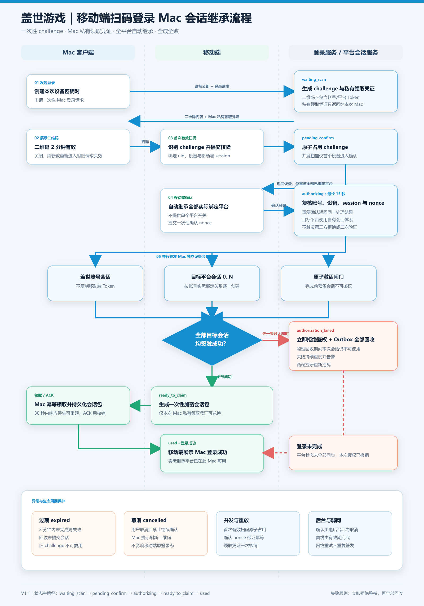
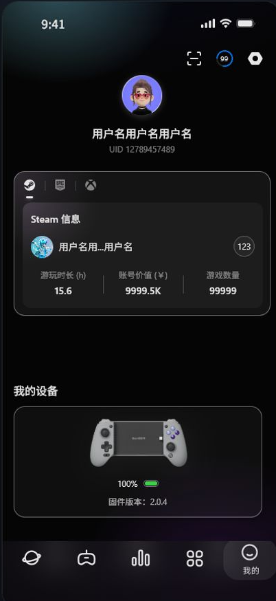

# 【Prd】《盖世游戏》移动端扫码登录Mac端需求

## 一、版本信息

|时间|版本|变更人|主要变更内容|备注|
|---|---|---|---|---|
|2026\.07\.25|V1\.0|陈晓力|移动端扫码登录 Mac 端||
|2026\.08\.05|V1\.1|郑群超 / Codex|补充 Mac 独立设备会话、Steam/Epic 自动继承、安全交换协议、状态机、异常与验收|GUANWANGGAID-1|

## 二、背景与目标

背景：盖世游戏移动端已支持用户登录，并可绑定 Steam、Epic 账号。Mac 端需要提供一种更轻的登录方式，让用户在 Mac 端看到二维码后，使用移动端扫码完成 Mac 端登录。

目标：建立“Mac 端展示二维码 → 移动端扫码 → 移动端确认 → Mac 端登录”的扫码登录闭环。移动端确认环节展示设备及账号信息，登录成功后 Mac 端使用同一盖世账号，并继承该账号的 Steam/Epic 移动端本地绑定关系。

本期范围为移动端扫码登录 Mac 端。

核心规则：

- 扫一扫入口仅对移动端盖世账号登录用户可见。

- 扫码登录的是盖世账号。首次有效扫码成功后，登录请求绑定扫码时的盖世账号、移动端设备和登录 session，仅该账号和设备可以提交确认。

- 二维码自生成起有效期为 2 分钟，待扫描和待确认阶段共用同一有效期。用户取消确认、Mac 登录页关闭或重载、移动端扫码/确认页面退至后台时，当前请求和二维码失效。

- 二维码识别有效后进入移动端确认环节。确认时需复核移动端登录态、扫码账号、移动端设备、登录 session、二维码状态和 Mac 登录请求。

- 扫码确认页根据当前盖世账号的移动端本地绑定关系展示 Steam/Epic 账号；已绑定平台进入可用态，无绑定关系时确认内容由设备信息和授权操作组成。

## 三、故事介绍

### 3\.1 用户场景

- 已登录移动端用户：用户打开 Mac 端登录页，在同一页面看到左侧扫码登录和右侧账号密码登录；打开移动端“我的”页，点击右上角扫码按钮；移动端识别二维码并确认本次登录，Mac 端完成登录。

- 已绑定 Steam/Epic 用户：用户识别二维码后，在移动端确认页核对设备名称、登录位置及平台账号；平台卡片第一行展示平台昵称，第二行展示“Steam 已登录”或“Epic 已登录”，右侧展示“可用”。

- 未绑定 Steam/Epic 用户：用户识别二维码后，在移动端确认页核对设备名称和登录位置并完成授权，Mac 端登录同一盖世账号。

- 二维码过期用户：用户未在有效期内扫码，Mac 端展示二维码已过期，用户点击二维码区域或“刷新二维码”按钮生成新二维码后重新扫码。

- 取消确认用户：用户点击“取消授权”后，移动端返回“我的”页；当前请求和二维码立即失效，Mac 端提示“本次登录已取消，请刷新二维码”。

- 多手机扫码用户：第一个通过校验的扫码账号和设备进入确认流程，其他手机扫描同一二维码时收到“二维码已被扫描”提示。

### 3\.2 价值分析

- 降低 Mac 端登录成本：用户不需要在 Mac 端输入账号密码。

- 保持账号关系一致：移动端和 Mac 端使用同一盖世账号，Steam/Epic 绑定关系跟随盖世账号展示。

- 减少重复绑定：盖世账号已存在 Steam/Epic 移动端本地绑定关系时，扫码登录 Mac 端后不需要手动去绑定。

- 降低理解成本：登录链路由扫码、确认和登录结果三个核心环节组成。

### 3\.3 核心体验路径

1. Mac 端进入登录页，登录卡片左侧展示一次性二维码、扫码状态和安全说明，右侧展示账号密码登录。

2. 系统根据移动端盖世账号登录态控制扫一扫入口可见性，登录完成后入口自动展示。

3. 已登录用户打开移动端“我的”页，右上角依次看到扫一扫、下载、设置三个按钮，扫一扫位于下载按钮左侧。

4. 用户点击扫一扫。相机权限已授权时直接进入扫码页；权限申请由系统界面承载，用户拒绝后返回“我的”页。

5. 移动端识别 Mac 端二维码并提交校验请求；进入摄像头扫码页及识别阶段时，Mac 端二维码与等待扫码文案保持不变。

6. 服务端校验二维码状态、有效期和 Mac 登录请求。首次有效扫码通过后，二维码进入待确认状态，并绑定扫码时的 uid、移动端设备和登录 session。

7. 后续其他手机扫描同一二维码时，移动端显示 Toast“二维码已被扫描”并停留在扫码页。

8. 移动端进入“扫码确认”，弹窗展示“正在登录 Mac 端”、设备名称、按 IP 粗定位至市级的登录位置及已绑定账号；Mac 端二维码遮罩展示“请尽快在手机上确认”。

9. 用户点击“取消授权”后，待确认请求结束，当前二维码立即失效，移动端返回“我的”页，Mac 端展示“本次登录已取消，请刷新二维码”。

10. 用户点击“确认登录”后，服务端复核二维码状态、扫码账号、移动端设备、登录 session 和 Mac 登录请求。账号或登录态变化时，移动端提示“登录状态已变化，请重新扫码”。

11. Mac 登录成功时读取当前盖世账号的 Steam/Epic 绑定关系，并展示包含盖世账号昵称的成功弹窗。

12. 用户关闭登录成功弹窗后，Mac 端保持当前登录状态。

### 3\.4 产品指标

1. Mac 端扫码登录入口点击率。

2. 二维码展示到移动端扫码成功转化率。

3. 移动端扫码到 Mac 端登录成功转化率。

4. 移动端确认页 Steam/Epic 关系展示成功率。

5. 二维码过期、确认取消、多手机扫码冲突、登录态变化和分阶段网络异常占比。

### 3\.5 本期范围

- 支持移动端扫码登录 Mac 端。

- 移动端“我的”页右上角展示扫一扫按钮，仅登录后可见，位置在下载按钮左侧。

- 移动端扫码后直接进入扫码页，系统相机权限由系统弹窗处理。

- Mac 端登录页同屏展示扫码登录和账号密码登录，扫码区域支持等待扫码、摄像头扫码、扫码确认、登录成功、二维码过期、登录已取消。

- 移动端扫码确认页展示设备名称、按 IP 粗定位至市级的登录位置；当前盖世账号存在 Steam/Epic 移动端本地绑定关系时展示“已绑定账号”分区；Mac 端登录成功弹窗展示盖世账号昵称。

## 四、概要设计

### 4\.1 模块设计

- Mac 端登录页：左侧展示二维码及扫码状态，右侧展示账号密码登录；二维码过期后支持点击二维码区域或“刷新二维码”按钮生成新二维码。

- 移动端扫码入口：仅登录后在“我的”页右上角展示扫一扫按钮，位置在下载按钮左侧。

- 移动端扫码页：打开摄像头扫描 Mac 端二维码。

- 移动端扫码确认：识别有效二维码后展示确认弹窗，呈现设备名称、市级登录位置及已绑定账号，由用户主动确认或取消授权。

- Mac 端登录结果：移动端确认后进入登录态，并展示盖世账号昵称。

- 异常处理：覆盖二维码过期/失效、确认取消、多手机竞争、移动端登录态变化和各阶段网络异常。

#### 业务流程图

### 4\.2 详细设计（C端）

功能 demo：

[扫码登录Mac端交互标注版demo\.html](图片和附件/扫码登录Mac端交互标注版demo.html)

#### 4\.2\.1 扫码登录全链路页面流程

|模块名称|图示|展示\&交互说明|
|---|---|---|
|Mac端登录页 | |**1\. 页面布局：** 登录卡片**左侧为扫码登录，右侧为账号密码登录**，两种登录方式在同一页面并列呈现。 **2\. 扫码区组成：** 扫码区由一次性二维码、扫码状态和安全说明组成。 **3\. 二维码有效态：** 二维码保持可扫描状态。 **4\. 二维码过期态：** 页面标题与状态行展示\*\*“二维码已过期”**，二维码遮罩中央展示单行**“点击刷新”**，二维码下方展示**“刷新二维码”\*\*按钮。 **5\. 刷新操作：** 点击二维码区域或“刷新二维码”按钮生成新二维码。 **6\. 安全说明：** **“二维码仅用于本次登录，使用后立即失效”位于状态行下方。** **7\. App下载入口： 二维码下方展示蓝色文字链接“下载盖世游戏APP”**，点击后跳转至盖世游戏官网首页。 |
|移动端我的页扫码入口| |**1\. 展示条件：** 扫一扫入口仅对**已登录盖世账号**的用户可见。 **2\. 入口位置：** “我的”页右上角依次展示扫一扫、下载、设置三个按钮，**扫一扫位于下载按钮左侧**。 **3\. 已授权状态：** 相机权限已授权时，点击扫一扫直接进入扫码页。 **4\. 首次拒绝授权：** 首次未授权时触发系统相机权限弹窗；用户拒绝后返回“我的”页并显示 Toast **“摄像头权限未获取，请重新授权”**。 |
|移动端扫码权限引导弹窗 ||**1\. 触发条件：** 用户选择不再询问相机权限后，再次点击扫一扫时展示权限引导弹窗。 **2\. 弹窗操作：** 主按钮为\*\*“去设置”**，次按钮为**“取消”\*\*。 **3\. 授权结果：** 用户从系统设置完成授权后，再次点击扫一扫进入扫码页。|
|移动端扫码页||**1\. 页面组成：** 页面由扫码取景区域和返回入口组成。 **2\. 二维码识别：** 用户对准 Mac 端二维码后，系统识别二维码。 **3\. Mac端联动：** 移动端进入摄像头扫码页及识别阶段时，Mac 端保持左侧扫码、右侧账号密码登录的同屏布局，扫码区继续显示\*\*“等待手机扫一扫”\*\*。 **4\. 首次有效扫码：** 第一个有效扫码账号和设备进入确认环节。 **5\. 多设备扫码：** 其他手机扫描同一二维码时显示 Toast **“二维码已被扫描”**，并停留在扫码页。 **6\. 无效或过期：** 无效二维码显示 Toast **“二维码无效”**；过期二维码显示 Toast **“二维码已过期”**。 **7\. 网络异常：** 扫码校验网络异常时显示 Toast **“网络异常，请重试”**，移动端停留扫码页。|
|移动端扫码确认||**1\. 确认弹窗：** 二维码校验通过后，移动端展示\*\*“登录至MacOS设备”**弹窗，明确本次操作正在登录 Mac 端。** **2\. 设备信息： 弹窗展示设备名称和按 IP 粗定位至市级的登录位置；登录时间在能力支持时展示。** **3\. 已绑定账号： 当前盖世账号已绑定平台时，“已绑定账号”分区展示服务端平台昵称、**“Steam 已登录”**或**“Epic 已登录”**状态及**“可用”**标签。** **4\. 安全提示： 授权操作上方展示**“若非本人操作，请点击取消授权”\*\*。 **5\. 取消授权：** 点击“取消授权”后，移动端返回“我的”页，当前二维码立即失效。 **6\. 确认校验：** 点击“确认登录”时复核当前登录态、uid、移动端设备、session 和请求状态。 **7\. 登录态异常：** 登录态或账号变化时显示 Toast **“登录状态已变化，请重新扫码”**。 **8\. 请求失效：** 请求过期、已使用或失效时显示 Toast **“登录请求已失效，请重新扫码”**。 **9\. 网络异常：** 确认提交网络异常时显示 Toast **“网络异常，请重试”**，移动端停留确认弹窗。|
|Mac端等待确认| |**1\. 二维码遮罩：** 二维码容器覆盖完整的**黑色半透明遮罩**。 **2\. 等待文案：** 遮罩内部展示\*\*“二维码已识别”**和**“请尽快在手机上确认”**。** **3\. 有效期： 待确认阶段继续受二维码生成起**2 分钟有效期**限制。** **4\. 超时状态： 超过有效期后展示**“二维码已失效/点击刷新”\*\*。 **5\. 登录生效：** Mac 登录态在收到被绑定账号和设备的有效确认后生效。|
|Mac端登录已取消||**1\. 取消结果：** 移动端取消确认后，Mac 端展示\*\*“本次登录已取消，请刷新二维码”\*\*，当前二维码不可继续扫码或确认。 **2\. 重新登录：** 点击二维码区域或“刷新二维码”按钮生成新二维码。 |
|移动端登录结果| |**1\. 提示形式：** 登录成功后，移动端返回“我的”页并显示 Toast **“Mac端登录成功”**。 **2\. 展示时长：** Toast 展示 **2 秒**后自动消失。 **3\. 状态结果：** Toast 消失后，移动端保持当前盖世账号登录状态。 |
|Mac端登录成功| |**1\. 提示形式：** Mac 端完成登录后显示 Toast **“登录成功”**。 **2\. 展示时长：** Toast 展示 **2 秒**后自动消失。 **3\. 状态结果：** 停留在登录前页面，Toast 消失后，**Mac 端保持登录状态**。 |

### 4\.3 详细设计（服务侧/配置）

|模块名称|展示\&交互说明|
|---|---|
|二维码生成|\- Mac 端进入登录页后生成一次性二维码。 \- 二维码绑定 Mac 设备、当前登录请求和自生成起 2 分钟有效期。 \- Mac 登录页关闭、刷新、重启或重新进入登录页时，旧二维码及其待确认请求失效。|
|扫码登录校验|\- 扫码时校验 Mac 设备签名、请求来源、二维码状态、有效期和异常校验次数。 \- 首次有效扫码通过后，二维码进入待确认状态，并绑定扫码时的 uid、移动端设备和登录 session。 \- 同一二维码只允许第一个有效扫码者进入确认流程；其他移动端收到“二维码已被扫描”。 \- 异常扫描或校验次数受限，具体阈值由研发确定。|
|登录确认|\- 待确认请求展示 Mac 设备名称、按登录 IP 粗定位至市级的位置及能力支持时的登录时间。 \- 待确认阶段继续使用二维码自生成起 2 分钟有效期，不展示倒计时数字。 \- 确认时复核二维码状态、Mac 登录请求、扫码账号、移动端设备、登录 session 和当前移动端登录态。 \- 取消确认、账号变化、登录态失效、移动端扫码或确认页面退至后台均使当前请求失效。|
|Steam/Epic绑定关系读取|\- Mac 登录成功时读取当前盖世账号的Steam/Epic 绑定关系。 \- 移动端确认页及 Mac 登录结果仅展示服务端已保存且可确认的平台关系。 \- 移动端本地记录、Steam/Epic 客户端登录态和第三方会话不参与 Mac 端登录。|
|登录结果同步|\- Mac 端接收或拉取确认结果后完成登录。 \- 结果同步失败时展示“同步中/重试中”，网络恢复后继续拉取服务端结果。 \- 服务端明确返回过期或失效时进入二维码失效刷新态。|
|登录记录|\- 记录二维码状态变化、扫码时间、首次扫码账号与设备、确认结果、登录结果、网络异常阶段和失败原因。 \- 登录记录用于定位过期、取消、多手机竞争、登录态变化及结果同步问题。|

#### 4\.3\.1 二维码状态机（V1\.0 历史规则）

本节保留 V1\.0 历史规则；V1\.1 开发与测试统一执行 4\.4\.3，不再使用 `confirmed`。历史主路径为：`waiting_scan → pending_confirm → confirmed → used`。取消确认进入 `cancelled`；超过 2 分钟进入 `expired`；页面生命周期中断、账号或登录态变化、安全校验失败进入 `invalid`。网络异常在有效期内不直接改变二维码状态。

|状态|移动端扫码返回|移动端确认返回|Mac端展示|允许刷新二维码|允许继续确认|
|---|---|---|---|---|---|
|待扫描 `waiting_scan`|首次有效扫码通过并进入待确认|无有效待确认请求|等待手机扫一扫|否；页面刷新会使旧二维码失效并生成新二维码|否|
|待确认 `pending_confirm`|被绑定的首次扫码设备保持确认流程；其他手机显示“二维码已被扫描”|仅绑定的 uid、移动端设备和 session 校验通过后可确认|二维码遮罩展示“二维码已识别”“请尽快在手机上确认”|否；重新进入登录页会使当前请求失效|是，仅限首次扫码账号和设备|
|已确认 `confirmed`|二维码无效|重复确认不产生新的登录授权|登录结果同步中|否|否|
|已取消 `cancelled`|二维码无效|显示“登录请求已失效，请重新扫码”|本次登录已取消，请刷新二维码|是|否|
|已过期 `expired`|显示“二维码已过期”|显示“登录请求已失效，请重新扫码”|二维码已失效，点击二维码区域或刷新按钮生成新二维码|是|否|
|已使用 `used`|二维码无效|登录请求已使用，不产生新的登录授权|当前账号登录成功|否|否|
|已失效 `invalid`|显示“二维码无效”|显示“登录请求已失效，请重新扫码”|二维码已失效，请刷新|是|否|

#### 4\.3\.2 边界条件\-内容侧

|场景|处理方式|
|---|---|
|二维码有效期|二维码自生成起有效期为 2 分钟，待扫描和待确认共用同一有效期；Mac 端展示“请尽快在手机上确认”|
|待确认超时|超过有效期后，Mac 端展示“二维码已过期/点击刷新”；移动端确认弹窗停留时，点击“确认登录”后 Toast“登录请求已失效，请重新扫码”|
|用户取消确认|待确认请求进入 `cancelled`，当前二维码立即失效；Mac 端展示“本次登录已取消，请刷新二维码”，移动端返回“我的”页|
|多手机同时扫描|首次通过校验的扫码账号、移动端设备和登录 session 获得确认资格；其他手机显示 Toast“二维码已被扫描”并停留扫码页|
|确认账号或登录态变化|当前 uid 与扫码时 uid 不一致，或登录态、移动端设备、登录 session 任一校验失败时，请求进入 `invalid`，移动端显示 Toast“登录状态已变化，请重新扫码”|
|扫码校验网络异常|移动端显示 Toast“网络异常，请重试”并停留扫码页；Mac 端保持等待扫码，二维码在原有效期内继续有效|
|确认提交网络异常|移动端显示 Toast“网络异常，请重试”并停留确认弹窗；Mac 端保持等待确认，请求在二维码有效期内继续有效|
|服务端返回过期或失效|移动端显示 Toast“登录请求已失效，请重新扫码”；Mac 端展示二维码失效刷新态|
|Mac 登录页生命周期结束|Mac 登录页关闭、刷新、应用重启或重新进入登录页后，旧二维码及其待确认请求进入 `invalid`，页面生成新二维码|
|移动端页面进入后台 |扫码页或确认弹窗退至后台时，本次登录请求进入 `invalid`；返回前台后需要重新扫码|
|移动端进程异常结束 |服务端待确认请求失效；Mac 端回到“请刷新二维码”；移动端恢复后不继续原确认流程，返回“我的”页|
|异常扫描频率|同一二维码限制异常扫描和校验次数，达到阈值后请求进入 `invalid`；具体阈值由研发确定|

#### 4\.3\.3 边界条件\-用户侧

|场景|处理方式|
|---|---|
|移动端未登录|扫一扫入口不可见，登录后展示|
|首次拒绝相机权限|系统权限弹窗关闭后不进入扫码页，移动端返回“我的”页并显示 Toast“摄像头权限未获取，请重新授权”|
|相机权限不再询问 |移动端展示toast“请到系统设置中允许盖世游戏获取摄像头权限”；系统设置授权后，再次点击扫一扫进入扫码页|
|扫码后退出登录|当前请求进入 `invalid`；确认操作显示 Toast“登录状态已变化，请重新扫码”|
|用户取消扫码|移动端返回“我的”页；Mac 端在二维码有效期内保持等待手机扫一扫|
|用户取消登录确认|移动端返回“我的”页；当前二维码和待确认请求立即失效；Mac 端展示“本次登录已取消，请刷新二维码”|
|Mac 未登录|确认通过后登录扫码账号|
|用户关闭登录成功弹窗|点击弹窗右上角关闭按钮或弹窗外空白区域均可关闭；仅收起弹窗，Mac 端保持已登录状态|
|多台 Mac 同时展示二维码|每个二维码独立生成，互不影响|

### 4\.4 V1\.1 增补与勘误（优先执行）

本节为 V1\.1 规则。与 V1\.0 正文冲突时，以本节为准。

#### 4\.4\.1 范围与核心规则

|类型|V1\.1 规则|
|---|---|
|登录结果|移动端确认后，服务端为 Mac <strong style="color:#3370FF">重新签发独立、设备绑定的盖世账号会话</strong>，不复制移动端 Token。|
|平台继承|服务端读取当前盖世账号下全部已绑定且可用的平台，<strong style="color:#3370FF">自动继承全部 Steam/Epic 平台</strong>，不提供单个平台开关。|
|平台会话|Steam/Epic 使用盖世自有平台会话体系，为 Mac 重新签发设备绑定的平台会话，<strong style="color:#3370FF">不会触发第三方拒绝或二次验证</strong>。|
|成功条件|盖世账号会话和全部目标平台会话均签发成功，Mac 才进入登录成功态；任一失败时执行<strong style="color:#3370FF">全部回收</strong>，不保留部分登录结果。|
|真值源|平台绑定及可用状态以服务端账号关系为准；移动端本地记录和 Steam/Epic 客户端本地登录态不作为授权依据。|
|适用端与地区|涉及移动端、Mac 端与服务端；国内包和海外包均支持。海外产品名使用 GameHub，平台集合按账号实际绑定关系返回。|
|不做事项|不增加平台勾选、单个平台开关、第三方授权页、短信验证、生物识别或新的账号绑定流程。|

#### 4\.4\.2 安全交换协议

1. Mac 打开登录页时生成本次设备密钥对，并向服务端申请一次性 challenge。

2. 服务端返回二维码内容和仅供该 Mac 使用的私有领取凭证。二维码只包含 challenge 标识、签名、有效期和协议版本，不包含账号 Token、平台 Token 或领取凭证。

3. 移动端扫码后，服务端校验 challenge 签名、状态、有效期、Mac 请求和扫描频率。首次有效扫码以原子操作将状态从 `waiting_scan` 变更为 `pending_confirm`，并绑定扫码账号、移动端设备和移动端登录 session。

4. 移动端确认时提交一次性确认 nonce。服务端复核账号、设备、session、challenge 状态和前台确认凭据；相同请求重复提交返回同一处理结果，不重复签发会话。

5. 校验通过后进入 `authorizing`。服务端并行创建 Mac 盖世账号会话和全部目标平台的 Mac 独立会话，最长等待 15 秒。新会话先处于不可鉴权的预备态，并绑定本次授权标识。

6. 全部预备会话创建成功后，服务端原子激活全部会话并生成只能由该 Mac 私有领取凭证兑换的加密会话包，状态进入 `ready_to_claim`。同一 Mac 在 30 秒领取期内重复领取时，服务端幂等返回同一加密会话包；Mac 持久化成功并回传 ACK 后，状态进入 `used`，领取凭证核销。

7. 任一预备会话创建失败、授权超时或原子激活失败时，服务端在同一事务内将本次授权标识加入鉴权拒绝集，再通过事务 Outbox 回收本次全部预备会话，状态进入 `authorization_failed`。物理回收可重试，但拒绝集立即生效，因此补偿期间任何本次会话都不可使用。

8. 重复扫码、重复确认、重复领取和重复 ACK 分别使用 challenge、确认 nonce、领取凭证和会话包摘要做幂等与防重放校验；`used`、已取消、已过期或已失效的请求不得再次授权。

9. challenge 的 2 分钟有效期只约束 `waiting_scan` 和 `pending_confirm`。服务端在处理确认时先校验到期时间，再以原子比较交换进入 `authorizing`；成功进入后获得独立 15 秒授权窗口，不再被二维码到期事件打断。取消、退后台尽力取消和 Mac 页面关闭仅在服务端仍处于 `pending_confirm` 时生效；与确认并发时，以服务端首次原子状态变更为准。

#### 4\.4\.3 V1\.1 状态流转

主路径：`waiting_scan → pending_confirm → authorizing → ready_to_claim → used`。

|当前状态|触发事件|条件|下一状态|客户端反馈|失败处理|
|---|---|---|---|---|---|
|`waiting_scan`|首次有效扫码|challenge 有效且未被占用|`pending_confirm`|移动端进入确认页；Mac 显示等待手机确认|原子抢占失败的其他设备提示“二维码已被扫描”|
|`pending_confirm`|用户确认登录|账号、设备、session、确认 nonce 和前台状态均有效|`authorizing`|移动端显示“正在登录 Mac 端”；Mac 显示“正在同步账号”|校验失败进入 `invalid`；取消进入 `cancelled`|
|`authorizing`|全部预备会话创建成功|盖世账号及全部目标平台预备会话齐备|`ready_to_claim`|移动端继续等待；Mac 可使用私有凭证领取|原子激活失败、任一创建失败或超过 15 秒进入 `authorization_failed`|
|`ready_to_claim`|Mac 领取并 ACK|同一设备凭证有效，且会话包已持久化|`used`|移动端与 Mac 显示成功|响应丢失时同一 Mac 在 30 秒内幂等领取同一会话包；超时未 ACK 则拒绝鉴权并回收|
|`used`|重复扫码、确认、领取或 ACK|领取凭证已核销|`used`|已登录 Mac 保持登录；其他请求返回已使用|不重复签发或返回会话包|
|`waiting_scan` / `pending_confirm`|超过 challenge 有效期|自生成起超过 2 分钟且尚未原子进入 `authorizing`|`expired`|提示二维码过期并重新扫码|禁止继续确认|
|`pending_confirm`|用户取消|首次有效确认设备主动取消|`cancelled`|移动端返回“我的”；Mac 提示刷新二维码|禁止继续确认|
|`pending_confirm`|账号、设备、session 或安全校验变化|任一复核失败|`invalid`|移动端提示“登录状态已变化，请重新扫码”|禁止继续确认|
|`authorizing`|部分创建失败或授权超时|任一目标会话不可用|`authorization_failed`|提示“平台登录状态未能全部同步，本次授权已撤销，请重新扫码”|鉴权拒绝集立即生效，Outbox 补偿回收全部本次会话|

#### 4\.4\.4 C 端状态与反馈

|模块名称|图示|展示\&交互说明|
|---|---|---|
|移动端扫码确认|沿用图 4\.2\.1 中移动端确认页|“已绑定账号”展示服务端返回的全部目标平台；分区下方增加<strong style="color:#3370FF">“确认后将在此 Mac 自动登录以上全部平台”</strong>。不展示勾选框或开关。|
|授权中||点击“确认登录”后按钮进入不可重复点击状态，页面显示“正在登录 Mac 端”；Mac 端显示“正在同步账号”，最长等待 15 秒。平台数量和名称按该账号实际绑定关系动态展示。|
|待领取||全部会话原子激活后进入 <strong style="color:#3370FF">`ready_to_claim`</strong>。移动端继续显示“正在登录 Mac 端”；Mac 使用私有领取凭证获取同一加密会话包，持久化并 ACK 前不展示登录成功。领取响应丢失时，30 秒内幂等返回同一会话包。|
|登录成功|以更新后的 Demo 为准|移动端显示“Mac 端登录成功”，并列出实际继承成功的平台；Mac 成功弹窗展示盖世账号昵称和实际继承平台。账号没有绑定平台时只展示盖世账号登录成功。|
|授权失败||移动端和 Mac 端均显示“登录未完成”；正文提示“平台登录状态未能全部同步，本次授权已撤销，请重新扫码”。点击“重新扫码”生成新 challenge。|

#### 4\.4\.5 权限、后台与弱网

|场景|处理方式|
|---|---|
|首次申请相机权限|系统授权成功后进入扫码页；拒绝后返回“我的”并提示“摄像头权限未获取，请重新授权”。|
|不再询问相机权限|再次点击扫一扫时展示权限引导弹窗；“去设置”打开系统设置，“取消”返回“我的”。|
|扫码页退至后台|停止相机和本地识别；未完成有效扫码时不改变服务端状态，返回前台后重新进入扫码页。|
|确认页退至后台|客户端发送尽力而为的取消请求并清除本地确认凭据；仅当服务端仍为 `pending_confirm` 时取消成功。若确认已原子进入 `authorizing`，授权继续执行，返回前台后查询结果，不创建新授权。|
|确认提交弱网|确认请求可安全重试；服务端以确认 nonce 幂等处理。进入 `authorizing` 后客户端持续查询同一请求，不创建新授权。|
|Mac 结果同步弱网|Mac 使用私有领取凭证查询同一结果；领取响应丢失时，在 30 秒领取期内幂等返回同一加密会话包。Mac 持久化后 ACK，服务端才核销凭证并进入 `used`。|
|Outbox 补偿暂时失败|鉴权拒绝集已在失败事务中立即生效，本次会话始终不可使用；服务端持续重试物理回收并告警。|

#### 4\.4\.6 系统集成与责任边界

|系统|方向|数据/接口|触发方式|失败降级|责任方|
|---|---|---|---|---|---|
|Mac 客户端 → 登录服务|申请 challenge、查询结果、领取会话包|进入扫码登录页、结果轮询|过期或失败后重新生成二维码|Mac / 登录服务|
|移动端 → 登录服务|扫码占用、确认 nonce、取消请求|扫码、确认、取消、生命周期变化|提示重新扫码，不缓存会话包|移动端 / 登录服务|
|登录服务 → 账号服务|盖世账号会话签发|进入 `authorizing`|失败则整单失败并补偿|登录服务 / 账号服务|
|登录服务 → 平台会话服务|读取全部绑定平台、签发 Mac 平台会话|进入 `authorizing`|任一平台失败则整单失败并全部回收|登录服务 / 平台会话服务|
|登录服务 → Outbox/回收任务|记录并执行补偿|签发失败、超时、领取前失效|持续重试并告警|登录服务|

## 五、非功能需求

|需求类型|详细要求|
|---|---|
|性能|<del>二维码生成接口响应小于 500ms；扫码识别成功后 Mac 端 3 秒内完成登录状态刷新</del> <strong style="color:#3370FF">V1\.1：</strong>二维码生成接口响应小于 500ms；扫码或确认后的客户端状态刷新 P95 不超过 3 秒；`authorizing` 最终结果不超过 15 秒。|
|兼容性|Mac 端支持 macOS 12 及以上；移动端支持当前线上主版本及后续版本|
|安全|二维码绑定 Mac 设备、当前登录请求和有效期；登录确认校验 Mac 设备签名、请求来源、二维码状态、扫码账号、移动端设备和登录 session；同一二维码仅允许首次有效扫码账号和设备确认；异常扫描与校验次数受限，阈值由研发确定|
|容错|扫码校验、确认提交和 Mac 结果同步分别处理网络异常；有效期内网络异常不直接终止请求；服务端明确返回过期或失效时，移动端提示重新扫码，Mac 端进入失效刷新态|
|隐私|平台账号展示字段限定为平台昵称；登录位置仅按 IP 粗定位至市级；第三方账号ID、令牌和密码属于敏感凭证保护范围|
|多语言|国内包展示中文；海外包 GameHub 按现有多语言规则处理|
|原子性|V1\.1：全部目标会话先以不可鉴权预备态创建，全部成功后原子激活；任一失败时鉴权拒绝集立即生效并全部回收，Mac 不保留部分登录态|
|幂等与防重放|V1\.1：扫码占用、确认、会话签发和领取分别使用一次性标识；重复请求不重复签发，已核销凭证不能再次使用|
|授权时延|V1\.1：进入 `authorizing` 后 15 秒内返回成功或失败结果；超过 15 秒按失败处理并触发补偿回收|
|发布保护|V1\.1：支持服务端功能开关、按账号灰度、指标告警和一键回退至账号密码登录|

## 六、埋点需求

### 6\.1 埋点事件表

|事件ID|事件名称|触发时机|关键参数|
|---|---|---|---|
|`mac_qr_login_page_view`|Mac扫码登录页曝光|Mac 端进入扫码登录页|`device_id`, `app_version`|
|`mac_qr_code_show`|二维码展示|二维码生成成功|`qr_id`, `expire_seconds`|
|`mobile_scan_button_click`|移动端扫码按钮点击|用户点击“我的”页右上角扫码按钮|`uid`, `app_version`|
|`mobile_camera_permission_result`|相机权限结果|系统返回相机权限结果或用户完成设置引导|`uid`, `permission_result`|
|`mobile_qr_scan_success`|首次有效扫码成功|二维码由待扫描进入待确认|`qr_id`, `uid`, `mobile_device_id`, `qr_state`|
|`mobile_qr_scan_conflict`|二维码扫码冲突|非首次扫码设备扫描待确认二维码|`qr_id`, `uid`, `conflict_reason`|
|`mobile_qr_login_confirm`|移动端确认登录|用户点击“确认登录”|`qr_id`, `uid`, `mobile_device_id`, `session_valid`, `qr_state`|
|`mobile_qr_login_cancel`|移动端取消确认|用户点击“取消授权”|`qr_id`, `uid`, `device_id`|
|`mobile_qr_confirm_rejected`|确认校验未通过|确认时账号、登录态、设备、session 或二维码状态不满足要求|`qr_id`, `uid`, `fail_reason`, `qr_state`|
|`mac_qr_login_success`|Mac扫码登录成功|Mac 端完成登录|`qr_id`, `uid`, `has_steam_bind`, `has_epic_bind`|
|`mac_qr_login_fail`|Mac扫码登录失败|二维码过期、无效、网络失败等|`qr_id`, `fail_reason`|
|`mac_qr_result_retry`|Mac登录结果重试|Mac 接收或拉取结果失败后重试|`qr_id`, `network_stage`, `retry_count`|
|`qr_login_state_change`|二维码状态变化|二维码状态发生流转|`qr_id`, `from_state`, `to_state`, `state_reason`|
|`mobile_confirm_platform_status_show`|平台绑定状态展示|移动端扫码确认页展示 Steam/Epic 状态|`uid`, `platform`, `bind_status`|
|`mac_qr_authorizing_start`|Mac会话授权开始|请求进入 `authorizing`|`qr_id`, `uid`, `platform_count`|
|`mac_qr_authorizing_result`|Mac会话授权结果|全部成功或任一失败|`qr_id`, `result`, `fail_stage`, `elapsed_ms`|
|`mac_qr_session_compensation`|会话补偿回收|授权失败后执行回收|`qr_id`, `compensation_result`, `retry_count`|
|`mac_qr_session_claim`|Mac领取会话包|Mac 使用私有领取凭证领取或重试|`qr_id`, `claim_result`, `retry_count`|
|`mac_qr_session_ack`|Mac确认会话包持久化|Mac 成功保存会话包后回传 ACK|`qr_id`, `ack_result`|

### 6\.2 埋点参数表

|参数名|类型|必填|说明|枚举/示例|
|---|---|---|---|---|
|`qr_id`|string|是|二维码唯一标识|QR\_202607150001|
|`uid`|string|否|盖世账号 UID|100001|
|`device_id`|string|否|Mac 端设备标识|MAC\_001|
|`device_name`|string|否|Mac 端设备名称|MacBook Air|
|`login_city`|string|否|登录 IP 对应的市级位置|广东省广州市|
|`device_type`|string|否|设备类型|mac/mobile|
|`mobile_device_id`|string|否|移动端设备标识|MOBILE\_001|
|`qr_state`|string|否|V1\.1 请求当前状态|waiting\_scan/pending\_confirm/authorizing/ready\_to\_claim/used/cancelled/expired/invalid/authorization\_failed|
|`from_state`|string|否|二维码流转前状态|waiting\_scan|
|`to_state`|string|否|二维码流转后状态|pending\_confirm|
|`state_reason`|string|否|状态流转原因|first\_scan/user\_cancel/timeout/lifecycle\_end|
|`fail_reason`|string|否|失败原因|expired/invalid/account\_changed/session\_invalid/network\_error|
|`conflict_reason`|string|否|扫码冲突原因|already\_scanned|
|`network_stage`|string|否|网络异常阶段|scan\_validate/confirm\_submit/mac\_result\_sync|
|`retry_count`|integer|否|当前阶段重试次数|1|
|`session_valid`|boolean|否|确认时移动端登录 session 是否有效|true|
|`permission_result`|string|否|相机权限结果|granted/denied/permanently\_denied|
|`current_uid`|string|否|Mac 当前登录账号 UID|100001|
|`target_uid`|string|否|扫码目标账号 UID|100002|
|`platform`|string|否|第三方平台|steam/epic|
|`bind_status`|string|否|绑定状态|bound/unbound|
|`has_steam_bind`|boolean|否|是否有 Steam 绑定|true/false|
|`has_epic_bind`|boolean|否|是否有 Epic 绑定|true/false|
|`platform_count`|integer|否|本次自动继承的平台数量|2|
|`result`|string|否|授权结果|success/failed|
|`fail_stage`|string|否|授权失败阶段|account_session/platform_session/claim/timeout|
|`elapsed_ms`|integer|否|授权阶段耗时，单位毫秒|2380|
|`compensation_result`|string|否|补偿回收结果|success/retrying/failed|
|`claim_result`|string|否|Mac 领取结果|success/expired/replayed/rejected|
|`ack_result`|string|否|Mac 持久化 ACK 结果|success/duplicate/rejected|

## 七、运营与发布需求

|优先级|准备事项|负责人角色|完成条件|最晚时间|
|---|---|---|---|---|
|P0|扫码登录功能开关|服务端研发|可关闭二维码入口并保留账号密码登录|灰度前|
|P0|授权失败与补偿告警|服务端研发 / 运维|`authorization_failed`、补偿重试和领取失败达到阈值时触发告警|灰度前|
|P0|灰度名单与比例|产品 / 运营|国内包与海外包分别按内部账号、5%、20%、50%、100% 放量；每阶段观察至少 24 小时|上线前|
|P0|回滚预案|客户端 / 服务端|普通回滚停止生成新 challenge，存量请求按状态结束；安全紧急回滚立即失效全部未完成请求、停止领取并拒绝本次会话鉴权；账号密码登录保持可用|上线前|
|P1|客服说明|客服 / 运营|包含二维码过期、权限拒绝、平台同步失败和重新扫码指引|首次外部灰度前|

灰度指标按国内包、海外包分别统计，以最近 24 小时且至少 1,000 次有效确认请求为窗口；不足 1,000 次时继续观察，不据此扩大灰度。扫码登录成功率分母为有效确认请求数，分子为进入 `used` 的请求数；授权失败率分母相同，分子为 `authorization_failed` 请求数；补偿失败率分母为触发补偿的请求数，分子为超过 5 分钟仍未完成物理回收的请求数。

灰度阶段出现以下任一情况时停止放量：扫码登录成功率低于 95%、授权失败率超过 1%、补偿失败率超过 0\.1%。发现会话串号、未授权登录、重复领取返回明文会话包或鉴权拒绝集未生效时执行<strong style="color:#3370FF">安全紧急回滚</strong>：立即关闭新 challenge、将 `waiting_scan`、`pending_confirm`、`authorizing`、`ready_to_claim` 全部置为 `invalid`，停止领取并将相关授权标识加入鉴权拒绝集，再触发会话回收。普通性能或转化问题采用普通回滚，允许 `authorizing` 与 `ready_to_claim` 按既定窗口完成。

## 八、来自功能上线后的更新

上线后按日期记录规则变化、灰度数据、事故和回滚结果，不改写历史记录。

## 九、验收与待确认项

### 9\.1 验收标准

|功能|前置条件|操作|预期结果|优先级|
|---|---|---|---|---|
|Mac 独立会话|移动端已登录，Mac 未登录|扫码并确认|Mac 获得独立、设备绑定的盖世账号会话；服务端与客户端均无法读取移动端 Token|P0|
|自动继承全部平台|账号已绑定 Steam 和 Epic|扫码并确认|确认页展示 Steam、Epic；无开关；成功后 Mac 两个平台均可用|P0|
|单平台继承|账号只绑定 Steam|扫码并确认|确认页和成功页只展示 Steam；只创建盖世账号与 Steam Mac 会话|P0|
|无绑定平台|账号未绑定 Steam/Epic|扫码并确认|只签发盖世账号会话并成功登录，不展示空平台区|P0|
|全成全败|模拟 Epic 预备会话创建失败|确认登录|Mac 不进入登录态；本次授权标识立即禁止鉴权；盖世和 Steam 预备会话全部回收；客户端提示重新扫码|P0|
|授权超时|会话签发超过 15 秒|确认登录|进入 `authorization_failed`，触发补偿回收，不保留部分会话|P0|
|重复确认|连续提交同一确认 nonce|重复点击或重放请求|返回同一处理结果，仅生成一组 Mac 会话|P0|
|领取响应丢失|服务端已返回会话包但响应在网络中丢失|同一 Mac 在 30 秒内使用原领取凭证重试|幂等返回同一加密会话包；Mac 持久化并 ACK 后进入 `used`|P0|
|重复领取|`used` 后使用已核销领取凭证再次领取|重放领取请求|请求被拒绝，不返回会话包，不影响已登录 Mac|P0|
|补偿持续失败|模拟 Outbox 物理回收超过 5 分钟|使用本次任一会话调用鉴权|鉴权拒绝集拦截，任一会话均不可使用；服务端持续重试并告警|P0|
|多手机并发|两台手机同时扫描同一二维码|同时扫码|仅第一个原子占用成功；另一台提示“二维码已被扫描”|P0|
|取消确认|处于 `pending_confirm`|点击“取消授权”|移动端返回“我的”；Mac 提示刷新；旧 challenge 不能继续确认|P0|
|确认页退后台|处于 `pending_confirm`|切至后台后返回|本地确认凭据清除；取消请求先到则进入 `cancelled`，确认原子变更先到则继续授权并查询同一结果|P0|
|到期竞态|二维码生成后第 119 秒点击确认|同时触发到期检查与确认提交|服务端先校验到期再原子变更；成功进入 `authorizing` 后拥有独立 15 秒窗口，二维码到期不再打断|P0|
|取消竞态|确认请求与取消/退后台请求并发|同时提交|以服务端首次原子状态变更为准；结果唯一且可查询，不出现部分会话|P0|
|弱网幂等|确认请求响应丢失|客户端重试|服务端不重复签发；客户端最终得到同一成功或失败结果|P0|
|二维码过期|生成后超过 2 分钟|扫码或确认|移动端提示过期/失效；Mac 可生成新二维码；旧 challenge 不可复用|P0|
|首次拒绝相机权限|相机权限未授权|点击扫一扫并拒绝|返回“我的”，提示重新授权；再次点击按系统权限状态处理|P1|
|永久拒绝相机权限|系统不再询问|再次点击扫一扫|展示权限引导弹窗；取消返回，去设置打开系统设置|P1|
|普通回滚|扫码登录开关开启且无安全事故|关闭普通功能开关|不再生成新二维码；`authorizing` 和 `ready_to_claim` 按既定窗口结束；账号密码登录不受影响|P0|
|安全紧急回滚|发现串号、未授权登录或鉴权拒绝失效|触发安全回滚|全部未完成请求立即 `invalid`；停止领取；授权标识加入拒绝集并回收会话；账号密码登录不受影响|P0|
|国内与海外|分别使用国内包、海外包|完成扫码登录|两端规则一致；海外产品名为 GameHub；平台集合按服务端绑定关系展示|P1|

### 9\.2 待确认项

#### 必须确认（阻塞开发）

无。平台继承范围、会话签发方式、成功条件、授权时限和异常反馈已确认。

#### 建议确认（影响完整度）

- [假设] 指标目标先采用“扫码登录成功率不低于 95%、授权失败率低于 1%”。默认按此口径配置灰度告警；影响上线判断，引用第七章。

- [假设] 授权失败提示统一为“平台登录状态未能全部同步，本次授权已撤销，请重新扫码”。默认使用该文案；影响客户端文案验收，引用 4\.4\.4。

#### 可后续补充

- [假设] 异常扫描次数阈值由安全团队在上线前配置，不写入客户端。默认由服务端动态调整；影响风控配置，不影响客户端开发，引用 4\.3 和 4\.4\.2。

### 9\.3 自检记录

- 已补齐登录态差异、状态枚举、合法流转、操作反馈、重复提交、弱网、并发、相机权限、敏感数据、国内与海外、埋点、灰度、回滚和验收。
- 已将平台真值源统一为服务端账号关系，将 Mac 登录凭证统一为独立设备会话。
- 已明确退后台采用客户端尽力取消与服务端有效期兜底，不承诺离线时立即失效。
- 本 PRD 当前引用 12 张本地页面图和 1 张本地流程图；尚未发布为固定 Git SHA 的公开 HTTPS 地址，因此当前版本为本地评审稿，不能声明可直接导入飞书。

### 9\.4 模拟评审结果

|角色|结论|发现的问题|
|---|---|---|
|前端开发|✓ 已修复|主状态缺少 `ready_to_claim`，领取响应丢失会形成死状态；Demo 固定展示 Steam/Epic，与实际绑定关系不一致。已补到 4\.4\.2、4\.4\.3、4\.4\.4、4\.4\.5，并同步 Demo。|
|测试工程师|✓ 已修复|Outbox 物理回收期间会话可能短暂可用；二维码 2 分钟有效期与 15 秒授权窗口存在竞态；3 秒刷新目标与 15 秒授权时延冲突。已补到 4\.4\.2、4\.4\.3、第五章和 9\.1。|
|运营/业务方|✓ 已修复|安全紧急回滚可能放行存量授权；灰度指标缺少统计窗口、分母和最小样本。已补到第七章和 9\.1。|

**已自动补充的硬伤：** 增加 `ready_to_claim` 与 ACK 核销；增加不可鉴权预备态、鉴权拒绝集和 Outbox 补偿；明确到期、确认、取消与退后台并发顺序；拆分 3 秒状态刷新和 15 秒授权窗口；将平台集合改为服务端实际绑定关系；补充安全紧急回滚和灰度口径。

**待用户确认的建议：** 无。模拟评审发现的问题均属于硬伤，已按已确认方案补齐。

