# 【Prd】《盖世游戏 APP》游戏租号需求

## 一、版本信息

| 时间 | 版本 | 变更人 | 主要变更内容 | 备注 |
|---|---|---|---|---|
| 2026.08.03 | V1.0 | 郑群超 | 将 Mac 端已确认的租号、会员、订单、Steam 登录、临期、到期和售后能力落到盖世游戏 APP，覆盖竖屏与横屏完整链路 | 评审稿；业务基线为 Mac 租号 PRD V4.0，APP 采用独立方向布局 |
| 2026.08.03 | V1.1 | 郑群超 | 横屏继承 Mac 已确认任务页骨架，竖屏复用同一组件、内容顺序和业务状态；补充核心页/任务页导航边界、来源返回、任务栈、推荐游戏一致性、售后资格及临期占位规则 | Demo、标注版和16张横竖屏截图已同步；自动验证271项通过 |
| 2026.08.04 | V1.2 | 郑群超 | 全量重构 APP 横竖屏链路；补齐社区、排行榜、个人中心、搜索、订单详情、支付成功和会员生效页面；横屏核心页恢复 APP 左侧导航，订单列表与详情拆为独立页面；15分钟提醒改为跨阈值触发一次 | 普通版、标注版和36张横竖屏截图已同步；自动验证284项通过 |
| 2026.08.10 | V1.3 | 郑群超 | <strong>按 V6.1.1 全量返工18个页面/关键状态；统一订单中心；拆分支付、分配、租期和退款状态；补充租购价格、异常恢复、非功能、埋点与可执行验收</strong> | V6.1.1 普通 Demo、标注版和36张新截图已完成本地验收；固定 SHA 公网发布与 HTTP 校验待发布授权 |
| 2026.08.10 | V1.4 | 郑群超 | <strong>收敛首页与搜索为统一租号展示模型；搜索取消卡内按钮与剩余时长；详情、确认订单和订单中心对齐 CDKEY 信息骨架、状态色与按钮层级，但仅保留租号业务语义</strong> | <strong>本期 Demo 只演示租号状态；CDKEY 业务继续在其独立需求完成。发现页金额一位小数，订单结算保持原始金额和两位小数；普通 Demo、标注版和36张截图已完成本地验收</strong> |
| 2026.08.10 | V1.5 | 郑群超 | <strong>详情“租号开玩”一次进入确认订单；SKU 全部集中在确认订单，并按稳定售卖模式区分热门时租与非热门权益；搜索补齐真实 Tab；竖屏 Steam 二维码前置；售后收敛为四类；会员首屏强化权益、8款游戏与永久推荐；首页 Banner 显示具体游戏可租号价</strong> | <strong>保留月度¥129、年度¥499、永久¥399，永久价格与推荐策略按业务确认不调整；普通 Demo、标注版、PRD和36张截图继续同源</strong> |
| 2026.08.10 | V1.6 | 郑群超 | <strong>重排探索页租号卡信息：Banner 左上只保留“今日推荐”和日期，左下展示游戏名、评分与类型，右下展示“¥1.9首租 / 99+ 在租”；小游戏卡将原 CDKEY 价格与标签替换为“¥9.9租号 / 在租99+”</strong> | <strong>Banner 首租价与普通版、按小时、2小时的首租资格报价同源；搜索结果继续沿用“已租号 / 可畅玩 / 租号价”规则，不随首页卡改动</strong> |
| 2026.08.11 | V1.7 | 郑群超 | <strong>按最终评审统一详情 F 操作区、热门/非热门确认订单、2—23小时、五项租号权益、个人中心同行会员状态、会员原四项权益介绍、折叠订单搜索及列表/详情唯一动作映射；平台与游戏版本改为独立字段</strong> | <strong>个人云存档同步保留为四项会员权益之一，并补齐会员游戏卡云存档标识、免费获取互斥样例及首租资格失效回退验收；本期仍只演示租号状态</strong> |
| 2026.08.11 | V1.8 | 郑群超 | <strong>订单标题与 Tab 紧凑相接、搜索收起为透明放大镜；详情底栏改为“••• / 图标+秒玩 / 动态交易按钮 / 租号主按钮”；Steam 与独立登录信息补充 Rockstar Games 等具体平台凭据并扩大可用宽度；确认订单首期仅标准版；会员套餐改为周卡、月卡、季卡</strong> | <strong>周卡¥39、月卡¥129、季卡¥299及季卡推荐仅为 Demo 暂用展示，周卡/季卡正式价格与推荐档待运营确认；普通 Demo、标注版、PRD 和横竖屏验收继续同源</strong> |
| 2026.08.11 | V1.9 | 郑群超 | <strong>确认订单删除协议、退款规则、支付有效期、二维码、租赁信息与当前报价；商品名和灰色标准版分层；支付方式同行双按钮；底部统一为“需支付 / 立即购买”。详情轻操作改为上图标下文字，横屏按游戏名、简介、标签、按钮排列</strong> | <strong>订单搜索展开不再挤压Tab；一键上号固定成功并返回Steam游戏库；退款进度改为可见的状态弹层；Steam登录前不再显示令牌占位提示</strong> |
| 2026.08.11 | V2.0 | 郑群超 | <strong>确认订单移除五项通用权益区，改为随当前 SKU 展示首次体验、单游戏永久或时租权益说明；“租号介绍”按作用、使用方法、注意事项三组常见问题一问一答</strong> | <strong>首次体验固定2小时并从支付成功计时，整个游戏平台终身一次；会员中心显示当前套餐与有效期；复用 Mac 运营后台7个模块，前6页增加 APP（安卓端）/Mac Tab且默认APP，操作记录不增加端别Tab</strong> |

> 当前普通 Demo：**[盖世游戏 APP 租号功能 Demo](../../demos/APP租号功能/盖世游戏APP租号功能demo.html)**
>
> 当前交互标注版：**[盖世游戏 APP 租号功能标注版](../../demos/APP租号功能/盖世游戏APP租号功能-标注版.html)**
>
> V2.0 业务基线为《盖世游戏 Mac 游戏租号需求》已确认履约规则、《盖世游戏 APP 租号 V6.1.1 全量页面返工设计（含统一订单中心）》及 2026.08.11 最终评审。APP 核心页先还原 V6.1.1，再接入租号；详情、确认订单和订单中心可复用 CDKEY 的信息骨架、状态色与按钮层级，但不得引入卡密、激活、发货或 CDKEY 订单流程。若历史版本与 V2.0 冲突，以 V2.0 为准。

## 二、背景与目标

### 2.1 需求背景

用户没有目标游戏权益时，当前只能购买游戏、导入已有游戏，或离开盖世游戏寻找第三方租号服务。第三方方案需要切换平台、手动处理账号密码与 Steam Guard，订单、到期和售后状态也与盖世游戏割裂。

本期在不影响“已有游戏优先启动或下载”的前提下，补充低门槛租用、单游戏永久畅玩和会员游戏库，并形成“发现—选权益—支付—分配账号—登录—游玩—到期—售后”闭环。

已确认条件：

1. APP 核心页沿用 V6.1.1 原结构，不新增全局导航，不重排与租号无关的模块。
2. 横竖屏共用游戏、权益、价格、订单、登录、租期和售后状态；旋转只重排，不重新创单、扣款、取号或获取 Guard。
3. 用户已有权益优先于价格；租号与 CDKEY 不是同类 SKU，禁止跨类型取绝对最低价。
4. 个人中心只保留一个“订单中心”；本期订单中心 Demo 只演示租号订单和租号状态。
5. 共用后台、账号池、支付、退款和结算能力沿用 Mac 端；APP 不新建专属租号后台。
6. <strong>每款游戏使用稳定售卖模式：热门游戏仅时租；非热门游戏仅首次体验、单游戏永久和会员入口，不按实时热度自动变化。</strong>

需求证据：

- 用户提供的个人中心与订单中心截图确认了统一入口及订单卡外壳。
- V6.1.1 使用说明手册确认了 APP 核心页结构。
- Mac 租号方案已确认租期、会员、取号、Steam 登录、临期、退款和换号规则。
- [高风险假设] APP 租号暂无正式业务基线，入口点击和购买转化目标需在灰度首周建立。

### 2.2 目标与成功指标

| 目标类型 | 目标 | 指标口径 | 基线 | 目标值 | 观察周期 |
|---|---|---|---|---|---|
| 用户转化 | 跑通 APP 租号购买闭环 | 租号支付成功用户数 / 租号详情用户数，按入口、方向、地区、游戏和 SKU 拆分 | 无 APP 基线 | 灰度首周建立基线；首月按游戏复盘 | 首周、首月 |
| 价格质量 | 减少低价误导 | 价格曝光后因权益或价格不符退出人数 / 价格曝光人数 | 无基线 | 首周建立基线，持续下降 | 首周、首月 |
| 履约质量 | 支付后获得可用账号 | 分配成功订单数 / 已支付且需分配订单数 | 沿用 Mac 联调基线 | ≥99%；失败订单100%进入退款或人工兜底 | 日、周 |
| 启动质量 | 用户成功开始目标游戏 | 启动成功订单数 / 已分配账号订单数 | 待联调 | ≥95%，一键与手动登录分别统计 | 日、周 |
| 订单可找回 | 用户可从统一订单中心继续任务 | 订单中心内成功继续支付、登录游戏、继续畅玩或查看售后的订单数 / 发起对应操作订单数 | 无 APP 基线 | ≥98% | 日、周 |
| 售后质量 | 问题可追踪并闭环 | 有结果售后单数 / 已创建售后单数 | 沿用 Mac 运营基线 | ≥95%；退款、换号和驳回均有结果 | 周、月 |

### 2.3 范围与不做事项

| 类型 | 内容 |
|---|---|
| 本期范围 | APP 首页、玩游戏、社区、排行榜、游戏库、个人中心、搜索、游戏详情、确认订单、会员中心、会员游戏库、订单中心、订单详情、Steam 登录与登录信息、15分钟提醒、售后退款换号、游戏订单支付结果、会员支付结果；共用后台与服务端接入；横竖屏完整链路 |
| 不做事项 | 不新增 APP 全局导航；不新做 APP 专属后台；不支持用户出租账号；不新增营销活动或支付渠道；会员套餐仅上周卡、月卡、季卡，不增加永久会员；不增加订单类型筛选或订单类型标签；不常驻展示敏感凭据 |
| CDKEY 边界 | <strong>CDKEY 购买、激活、发货、退款和订单状态细节不在本期范围</strong>；仅定义租号与 CDKEY 共存时的价格边界，以及未来共用订单中心入口和卡片外壳 |
| 硬性约束 | 已拥有、已导入或已安装游戏优先；支付、分配、租期、退款状态独立；已支付订单按快照履约；未命中地区或灰度不得产生新交易；已支付权益继续履约；任务页返回不得形成详情与结算、订单与售后的回环 |
| 国内/海外 | **国内包：盖世游戏，沿用手机号/微信/QQ/Apple 登录、现有实名认证与国内支付规则，保留国内云游戏原路径。海外包：GameHub，沿用邮箱/Google/Apple 登录，不展示实名认证和云游戏入口，支持中文、英语、日语、俄语、巴西葡萄牙语。Steam 登录是租号履约步骤，不替代 APP 账号登录。** |

## 三、故事介绍

### 3.1 用户与运营场景

1. <strong>普通租号：符合首租资格的用户在首页 Banner 看到“¥1.9首租 / 99+ 在租”，首页小游戏卡看到“¥9.9租号 / 在租99+”，搜索游戏卡则按用户当前状态显示“已租号 / 可畅玩 / ¥X.X · 租号”之一；点击整卡进入详情，再点击“租号开玩”一次进入确认订单并选择 SKU。</strong>
2. <strong>状态收敛：同一游戏有有效租赁时显示“已租号”；没有有效租赁但已可直接游玩时显示“可畅玩”；首页与搜索不展示剩余时长、订单进度或“首次体验/会员畅玩”等权益来源。</strong> 首次资格、会员或永久权益仍在详情按实时资格处理。
3. 长期权益：用户可购买单游戏永久畅玩；会员中心首期只提供周卡、月卡、季卡，不提供永久会员。单游戏永久属于单款游戏权益，不得与会员套餐混淆。
4. 订单找回：用户从个人中心进入统一订单中心，在“全部订单 / 待支付 / 可使用”中查看租号订单，并在当前 Tab 内搜索游戏名称或订单编号。
5. 登录与游玩：账号分配后优先一键上号；失败时进入 Steam 手动登录并按需查看账号、密码和 Guard。部分游戏还需按具体配置继续使用 Rockstar Games 等第三方平台账号、密码和短时验证码。
6. 临期与售后：剩余时间首次跨入15分钟内时提醒一次；到期后结束租赁会话。用户可在订单详情提交四类问题售后和同版本换号；取号失败继续由系统自动退款。
7. 运营与客服：运营使用共用后台配置商品、会员库、套餐、地区和灰度；客服按订单、使用单和售后单定位问题，不读取明文凭据。

### 3.2 价值分析

- 用户价值：降低开始游玩的购买门槛和跨平台操作成本。
- 平台价值：新增租号、单游戏永久和会员收入，复用已有账号池与交易能力。
- 转化价值：租购价格分开表达，减少无效点击、价差退出和退款投诉。
- 运营价值：统一订单入口，减少入口维护、客服解释和用户找单成本。
- 风险：库存健康、凭据安全、Steam 条款、退款时效和海外地区规则必须在灰度前确认。

### 3.3 核心体验路径

1. 租号：入口 → 详情权益判断 → 点击租号开玩 → 确认订单选择 SKU → 支付 → 分配账号 → 一键上号或手动登录 → 游玩 → 临期 → 到期或售后。
2. 会员：详情、个人中心或会员游戏库 → 会员中心 → 选择套餐 → 支付 → 权益生效 → 会员游戏库 → 会员畅玩。
3. 订单：个人中心 → 订单中心 → 当前 Tab 筛选或搜索 → 订单卡 → 订单详情 → 继续支付、登录游戏、继续畅玩或售后。
4. 恢复：支付、分配、登录或售后中断 → 保留订单号和非敏感状态 → 网络恢复 → 查询服务端真值 → 恢复原任务。

### 3.4 产品指标预测

| 指标 | 预期方向 | 主要原因 | 风险 |
|---|---|---|---|
| 租号详情进入率 | 上升 | 现有入口增加明确租号价格或状态 | 入口过强会干扰已有游戏路径 |
| 详情到支付转化率 | 上升 | 默认低承诺租期、价格快照、库存预校验 | 游戏价格和库存差异较大 |
| 价格曝光到支付成功率 | 上升 | 租购不跨类型取最低价 | 双价格表达占用更多信息空间 |
| 订单继续任务成功率 | 上升 | 统一入口和状态动作 | 状态聚合错误会把订单放入错误 Tab |
| 退款与客诉率 | 下降 | 支付、分配、租期和退款状态拆分 | 供应商失败或退款超时会反向放大投诉 |

### 3.5 路径规划

- V1.3：完成 PRD、18个页面/关键状态、统一订单中心和全链路规则。
- <strong>V1.4：统一首页与搜索展示模型；详情和确认订单复用 CDKEY 视觉骨架；订单中心只演示租号状态并统一状态色与按钮层级。</strong>
- <strong>V1.5：详情直达确认订单；热门与非热门 SKU 按稳定售卖模式分流；补齐搜索 Tab、Steam 二维码顺序、四类售后、会员永久推荐和首页 Banner 具体租号价。</strong>
- <strong>V1.6：首页 Banner 与小游戏卡按评审结构重排；Banner 首租展示与普通版、按小时、2小时的首租资格报价同源，搜索状态模型保持不变。</strong>
- <strong>V1.7：详情采用 F 操作区；热门确认订单支持版本与2—23小时时租，非热门只保留三种权益；会员中心恢复原四项权益介绍，个人云存档同步是其中一项；订单中心使用折叠搜索与统一动作映射。</strong>
- <strong>V1.8：详情 F 操作区收敛为四槽；订单中心标题与 Tab 紧凑且搜索为透明 icon；确认订单首期仅标准版；会员改为周卡/月卡/季卡；Steam 与独立登录信息支持具体第三方平台凭据并扩大宽度。</strong>
- <strong>V2.0：确认订单使用当前 SKU 权益说明和常见问题式租号介绍；首次体验从支付成功计时且全平台终身一次；会员展示有效期；运营后台前6页按 APP（安卓端）/Mac 隔离并默认 APP，操作记录统一审计。</strong>
- Demo 返工：按 V6.1.1 还原核心页，完成普通版、标注版及36张截图。
- 灰度：按地区、渠道和用户稳定分桶，先内部白名单，再逐步放量。
- 上线后：按30、60、90天复盘转化、履约、订单找回和售后指标。

## 四、概要设计

### 4.1 模块设计

| 模块 | 目标用户 | 核心能力 | 依赖 | 优先级 |
|---|---|---|---|---|
| 租号发现 | 无目标游戏权益用户 | 在现有入口展示租号价格或权益状态 | 权益、价格、地区、灰度 | P0 |
| 权益与价格 | 租用、购买或会员用户 | 统一权益优先级；租购价格分开 | 商品、资格、库存、价格版本 | P0 |
| 游戏订单 | 租号用户 | 创单、支付、价格快照、分配账号 | 支付、账号池、供应商 | P0 |
| 会员 | 多游戏用户 | 周卡、月卡、季卡与会员游戏库 | 会员、支付、权益 | P0 |
| 统一订单中心 | 所有交易用户 | 一个入口、三个 Tab、当前 Tab 搜索 | 订单聚合、搜索 | P0 |
| 订单详情 | 已创单用户 | 精确状态、继续任务、售后入口 | 订单、使用单、退款 | P0 |
| 登录与凭据 | 已分配账号用户 | 一键上号、手动登录、Guard、按游戏配置的第三方平台凭据 | Steam、Rockstar Games 等具体平台、短时授权 | P0 |
| 临期与到期 | 租用中用户 | 15分钟单次提醒、T0回收 | 服务端时间、会话 | P0 |
| 售后与退款 | 履约异常用户 | 四类问题、同版本换号、系统自动退款结果 | 客服、退款、账号池 | P0 |
| 横竖屏与恢复 | 所有用户 | 同状态重排、任务恢复 | APP 导航、服务端真值 | P0 |

### 4.2 详细设计（C端）

> 下表共18个页面/关键状态。每行包含竖屏与横屏目标文件名，共36张。<strong>本地截图已重建并通过尺寸、格式与原尺寸人工检查</strong>；正式导入飞书前仍需获得发布授权，上传到同一固定提交 SHA 的公开 HTTPS 地址并逐张验证 HTTP 200 与 `image/png`。

| 模块名称 | 图示 | 展示&交互说明 |
|---|---|---|
| 1. 首页与租号发现 | 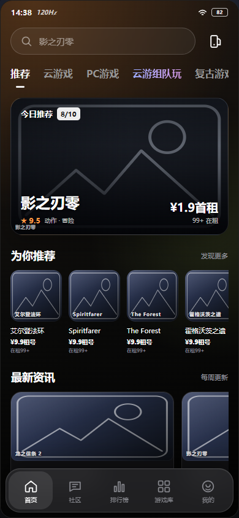 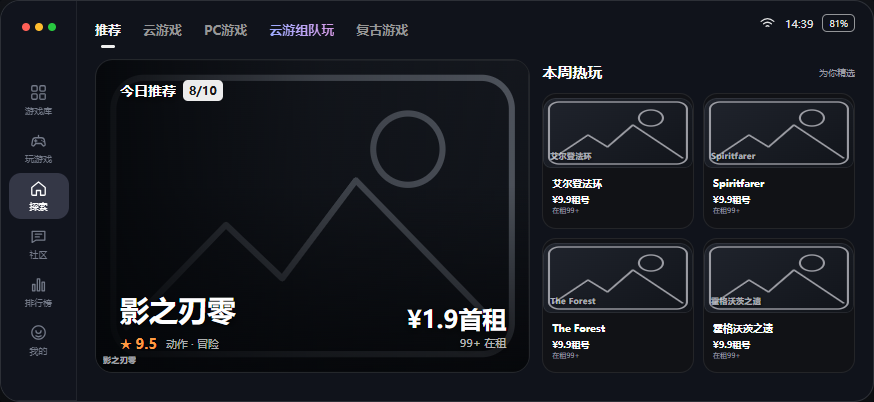 | **入口：**还原 V6.1.1 首页导航、推荐位和游戏卡，不新增导航；点击整卡进入同一游戏详情。 **Banner 布局：**<strong>左上只显示“今日推荐”和日期；左下第一行显示游戏名，第二行显示评分与类型；右下第一行显示“¥1.9首租”，第二行显示“99+ 在租”</strong>。首租价格字号与游戏名一致，颜色沿用评分强调色。 **Banner 价格：**“¥1.9首租”读取当前用户、地区、Steam 平台、标准版、按小时、2小时、库存和首租资格共同命中的资格报价；它不是第四个租期选项。<strong>资格失效或该报价不可售时，文案同步改为“¥X.X租号”，并展示当前合资格的最低时租价，不得继续使用“首租”。</strong> **小游戏卡：**将原 CDKEY 价格和标签替换为“¥9.9租号 / 在租99+”，不增加卡内按钮。 **状态：**有效租赁显示“已租号”；可直接游玩显示“可畅玩”；其余才显示一位小数租号价；价格和状态读取同一商品服务。 **异常：**价格、库存、资格或在租人数缓存不可判定时隐藏对应增量信息，不猜价、不写死生产人数。 |
| 2. 玩游戏 | 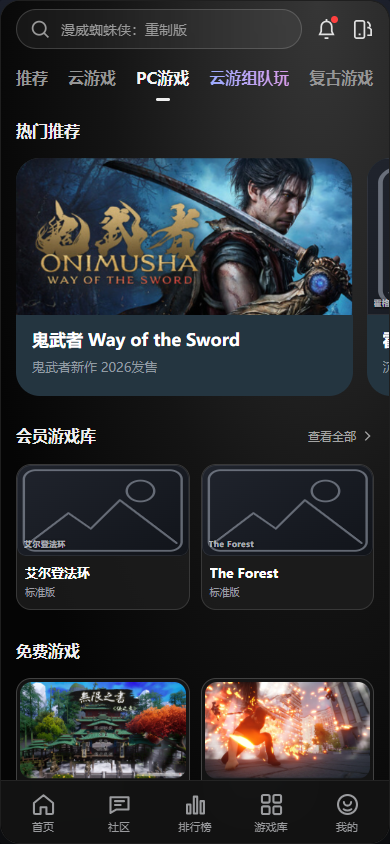 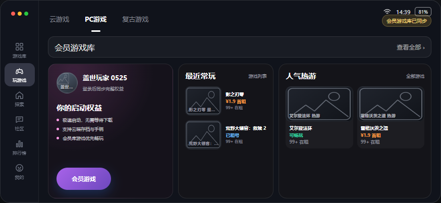 | **入口：**沿用云游戏、PC游戏、复古游戏等原结构。 **展示：**租号只作为 PC 游戏权益和启动方式增量；已拥有、已导入或已安装游戏走原启动、下载路径。 **国内/海外：** **国内包保留原云游戏入口；海外包不显示云游戏入口。** **异常：**无可售租号 SKU 时不新增租号状态。 **验收：**点击租号游戏进入统一详情，不在列表创单。 |
| 3. 社区 | 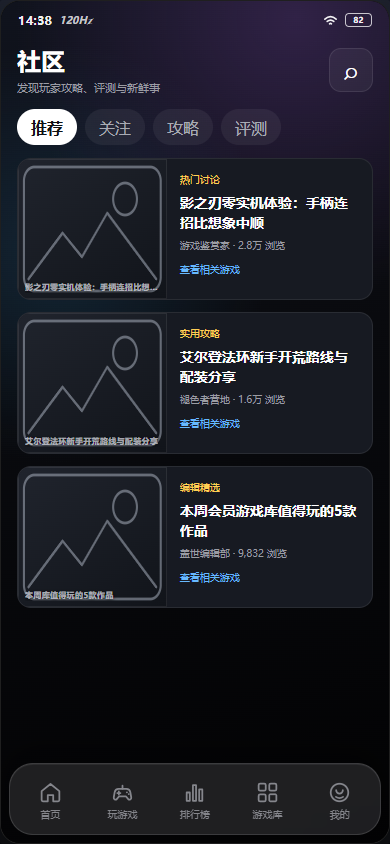 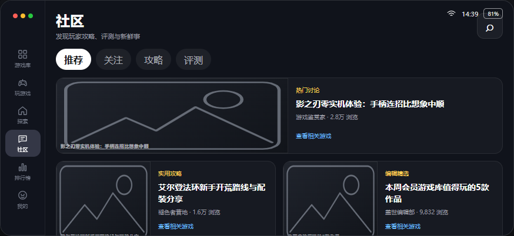 | **入口：**完整保留现有社区结构。 **展示：**不新增租号交易卡、价格或订单入口。 **交互：**文章中的“查看相关游戏”进入统一游戏详情，再按权益规则决定主操作。 **异常：**关联游戏失效时沿用社区原失效处理。 **验收：**社区信息架构与原页面一致。 |
| 4. 排行榜 | 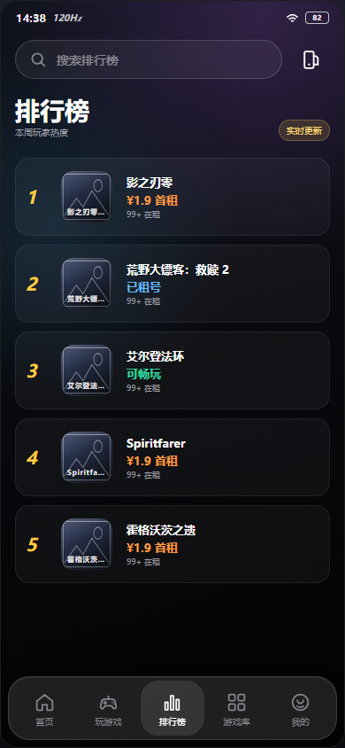 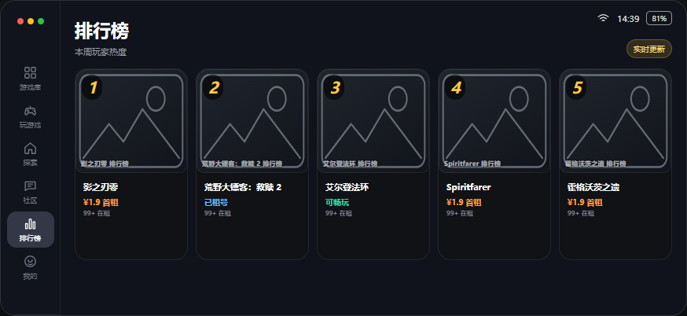 | **入口：**还原原榜单、分类和游戏卡。 **展示：**排行榜不直接展示支付按钮，不直接创单。 **交互：**点击游戏进入详情，按已有权益、租号、单游戏永久和会员顺序判断。 **异常：**榜单游戏下架时沿用原不可用处理。 **验收：**榜单排序不因租号能力改变。 |
| 5. 游戏库 | 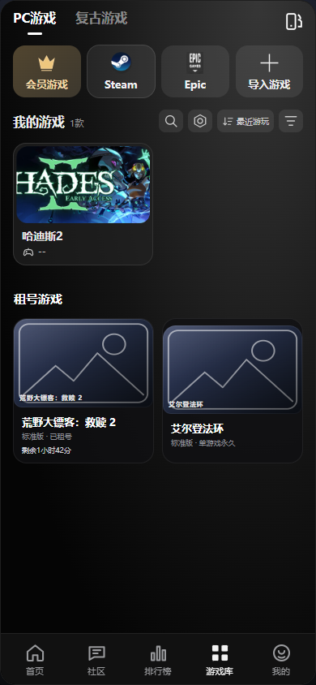 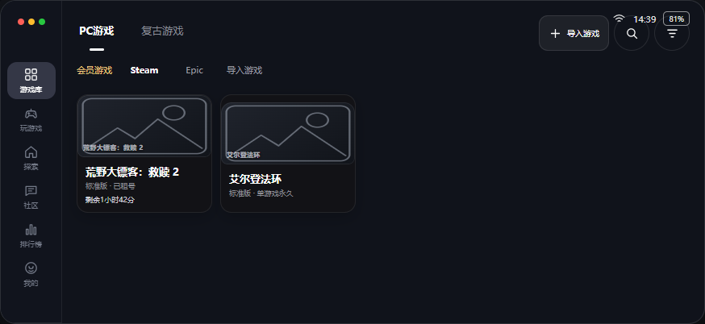 | **入口：**保留 PC、Steam、Epic、复古 Tab、筛选、搜索和导入入口。 **展示：**自有、已导入或本地游戏优先；租号不替换原卡片状态。 **交互：**无权益用户从游戏卡进入详情后查看可租权益。 **异常：**本地与账号权益冲突时以可验证的有效权益为准；不可判定时不展示新购买。 **验收：**导入和启动路径无回归。 |
| 6. 个人中心 | 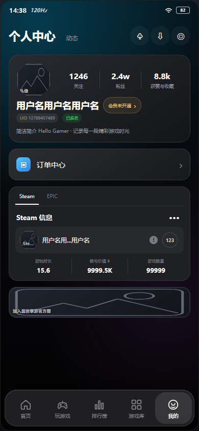 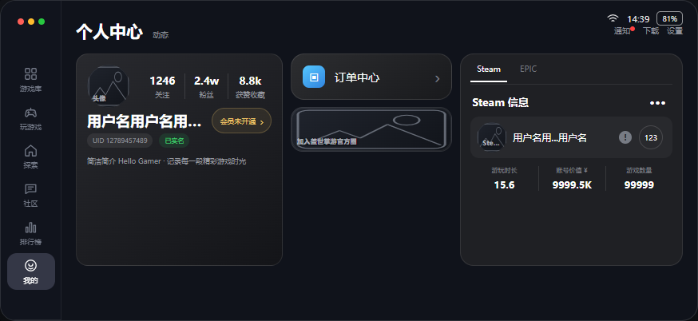 | **入口：**按用户截图还原个人信息、Steam 信息和服务卡。 **展示：**<strong>用户名与“会员未开通/有效会员状态 ›”同一行；下一行只保留 UID 与已实名</strong>。删除重复会员大卡，只保留一个“订单中心”入口。 **交互：**同行会员状态进入会员中心；订单中心进入统一订单列表。 **异常：**未登录点击交易入口，完成 APP 登录后返回原入口。 **验收：**横竖屏结构一致，个人中心不直接创单。 |
| 7. 搜索默认页与搜索结果 | 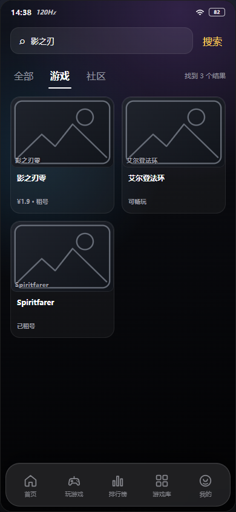 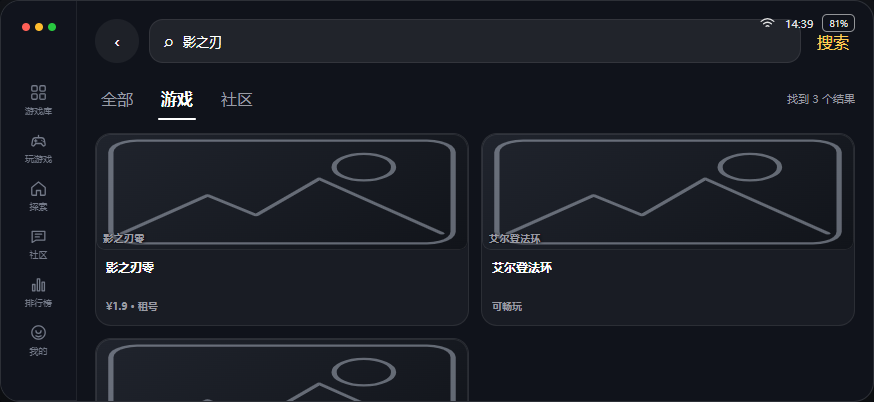 | **Tab：**全部、游戏、社区使用普通文字与下划线选中态，不使用胶囊滑块；切换保留关键词，结果数使用实际渲染数量。 **排序：**沿用原搜索排序；租号能力不改变权重。 **游戏卡：**每张最多显示“已租号 / 可畅玩 / ¥X.X · 租号 / 无新增信息”之一；金额一位小数，不显示剩余租期、订单进度、权益来源或类型标签。 **交互：**卡内没有独立按钮，整卡进入详情；返回恢复关键词、Tab和滚动位置。 **状态：**搜索中、无结果、请求失败分别展示加载、空态和重试。 |
| 8. 游戏详情 | 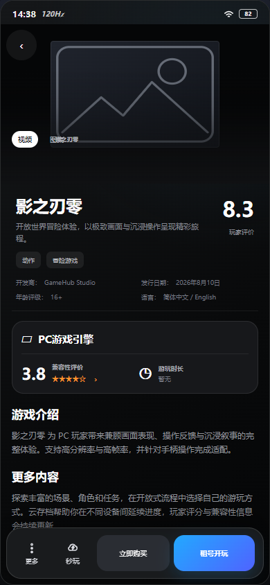 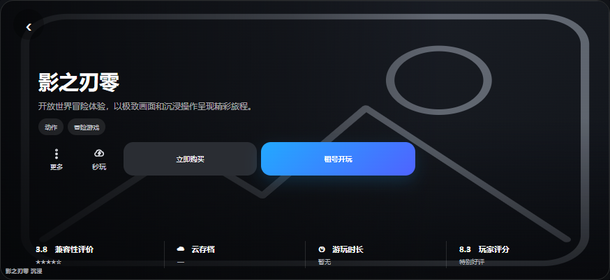 | **页面：**保留 V6.1.1 媒体、游戏信息、PC 引擎和原操作区；复用 CDKEY 的信息层级、状态色和按钮风格，但只承载租号业务。 **F 操作区：**<strong>固定从左到右为“竖向三点+更多 / 秒玩图标+秒玩 / 左侧动态交易按钮 / 右侧租号主按钮”。更多与秒玩均为上图标下文字、透明无背景的轻操作；付费游戏按可售结果展示“立即购买 + 租号开玩”；免费游戏只显示“获取游戏”并隐藏租号；有效租赁显示“登录游戏”；已有权益不重复售卖。</strong> **交互：**“租号开玩”一次进入确认订单；详情不展示或选择版本、租期与 SKU。 **横屏顺序：**游戏名 → 简介 → 标签 → 操作按钮，四组内容不得重叠。 **判断：**地区与灰度 → 已拥有/导入/安装 → 有效租赁 → 单游戏永久 → 有效会员且命中会员库 → 免费获取/购买/租号可售结果。 **异常：**租号商品暂不可售时不显示“租号开玩”；所有商业操作都不可用时显示“暂不可用”；不得出现卡密、激活或发货语义。 |
| 9. 确认订单 | 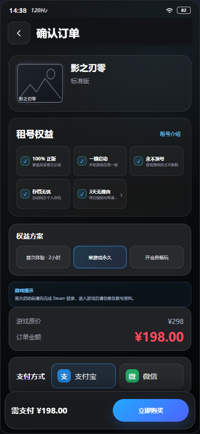 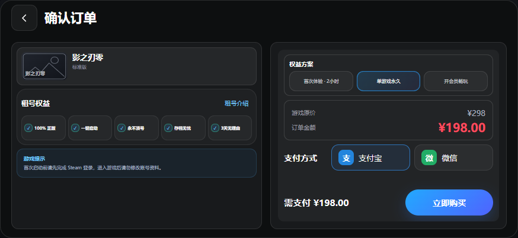 | **页面：**独立任务页；复用 CDKEY 的状态色和蓝色主按钮，只承载租号业务。 **商品卡：**<strong>首期只有标准版；卡片只保留游戏名称与下方灰色副标题“标准版”，不显示热门/非热门、仅时租、订单号或版本选择。</strong>订单快照仍保存 `editionId=standard`、平台和标准版信息。 **当前权益说明：**<strong>不展示五项通用权益区；随当前选择显示一组 SKU 权益说明。首次体验显示固定2小时、从支付成功计时、整个游戏平台终身一次；单游戏永久显示仅限当前游戏标准版且长期有效；时租显示当前租期、限租期内使用、到期自动失效。</strong> **租号介绍：**右上角只显示“租号介绍”。点击后展示“常见问题”，按以下内容逐项一问一答： Q：租号有什么作用？A：无需先购买游戏，即可在所选租期内使用平台提供的目标游戏账号；租号获得的是限时游玩资格，不代表购买游戏或账号所有权。 Q：如何使用租号？A：选择租号套餐或权益方案并完成支付。在有效期内点击开始畅玩，系统自动准备账号；准备完成后可一键上号，或按页面提供的登录信息进入游戏。 Q：使用时要注意什么？A：仅可游玩本次购买的目标游戏，请勿修改账号资料；租期到期后使用权失效。首次体验固定2小时，从支付成功开始计时，每位用户在整个游戏平台终身仅可使用1次。 关闭介绍后保留套餐、金额和支付方式。 **热门游戏：**“租赁套餐”同行展示按小时、日租、周租。按小时默认2小时，可输入2—23整数，并提供6、12、23小时快捷选择；不显示“当前报价”。 **非热门游戏：**“权益方案”标题与 SKU 分行，展示符合资格的首次体验·2小时、单游戏永久和开会员。开会员进入会员中心，清除当前待支付游戏草稿，不生成游戏订单。 **支付：**只保留微信、支付宝；在套餐与支付方式之间展示游戏原价和订单金额。订单金额随套餐变化，底部“需支付”与订单金额、支付请求金额一致。 **底部：**左侧唯一金额为“需支付 ¥X.XX”，右侧待支付主按钮为“立即购买”。 **横屏：**左侧展示商品与当前 SKU 权益说明；右侧展示套餐、金额、支付方式和支付操作。 **删除项：**不显示五项通用权益区、协议、退款规则正文、支付有效期、支付二维码、“租赁信息”汇总或小时区当前报价。 **异常：**小时数为空、非整数或超出2—23时不创单并提示修正；无可售项时禁用支付；首次资格失效时移除首次体验并重建草稿；价格变化要求重新确认；正常可售时不得出现“订单创建失败”。 **禁止：**不得出现 CDKEY、卡密、激活、发货或收货账号语义。 |
| 10. 会员中心 | 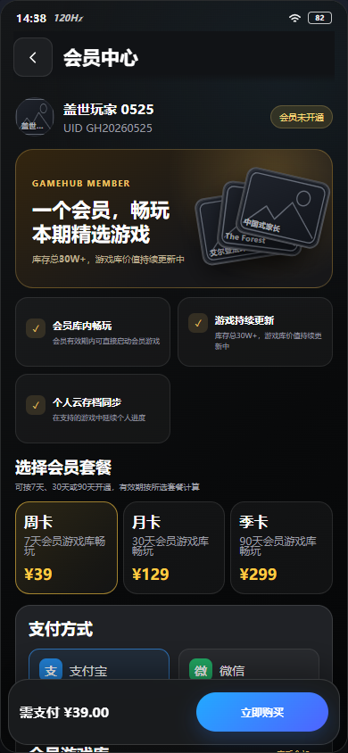  | **入口：**游戏确认订单“开会员”、个人中心会员状态和会员游戏库。 **首次说明：**当前会话首次进入展示“关于会员”四点说明；关闭后本次会话不重复展示，不包含远程协助条款。 **页面顺序：**<strong>会员价值主视觉 → 原四项权益介绍 → 周卡/月卡/季卡套餐 → 会员游戏库 → 常见问题。</strong> **原四项权益：**会员库内畅玩、游戏持续更新、PC引擎与手柄适配、个人云存档同步；存档云同步只是其中一项，不得把会员价值收窄为单一云存档服务。 **游戏标识：**仅支持的游戏在封面下方信息区显示“支持云存档”，不叠加在封面。竖屏展示8款；横屏首屏预览前4款，点击“查看全部”进入完整游戏库。 **套餐：**首期只有周卡、月卡、季卡，不展示永久会员。Demo 暂用周卡¥39、月卡¥129、季卡¥299并默认推荐季卡；正式价格及推荐档读取服务端价格版本。 **支付：**切换套餐后，左侧“需支付 ¥X.XX”与右侧“立即购买”同步更新；横屏首屏可完成套餐、支付方式与支付操作，不展示二维码。 **生效：**支付成功后显示当前套餐和“有效期至 YYYY.MM.DD”；未到期续费从当前到期时间顺延，已到期从本次支付成功时间重算，重复回调不重复延长。 **边界：**不增加虚构划线原价、折扣倒计时、第四档套餐或新页面；权益发放未知时保留订单号并查询，不提前显示已生效。 |
| 11. 会员游戏库 | 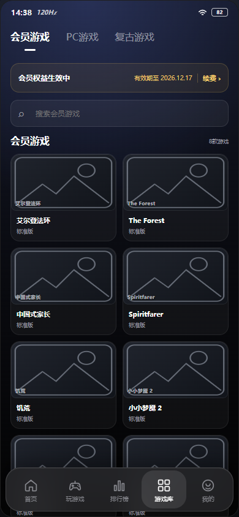 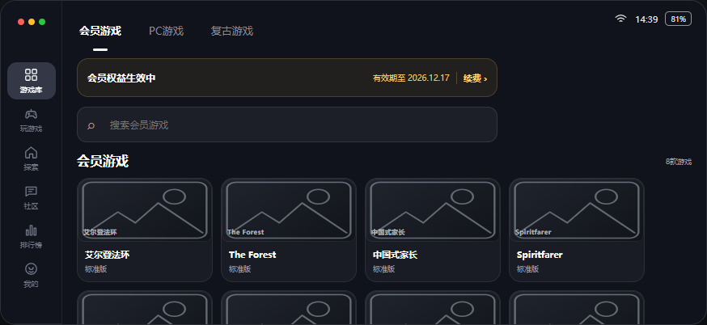 | **展示：**显示本期会员可畅玩游戏、会员状态、云存档支持标识和 FAQ；横竖屏读取同一数据。 **排序与加载：**沿用 APP 游戏列表排序和加载；返回恢复位置。 **交互：**点击游戏进入统一详情；有效会员且游戏仍在库时允许取号。 **云存档：**只有 `cloudSaveSupported=true` 的游戏展示“支持云存档”；无标识不代表不能会员畅玩，只表示本期不承诺跨设备存档同步。 **空态：**无可用游戏时显示“暂无可畅玩游戏”；请求失败可重试。 **下架：**进行中使用按快照继续，新取号按最新会员库状态拦截。 |
| 12. 订单中心 | 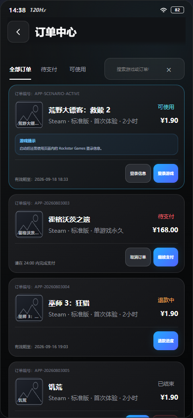 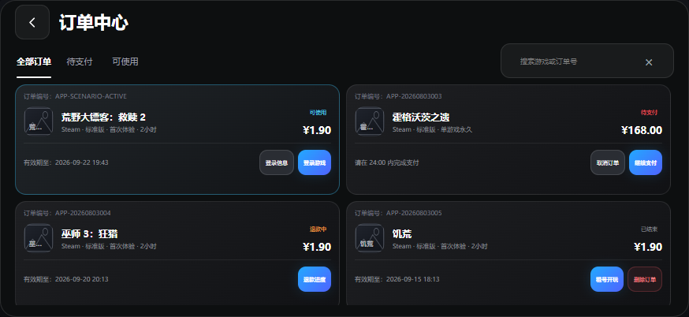 | **顶部：**<strong>页面标题与 Tab 紧凑相接；仅“全部订单 / 待支付 / 可使用”三个普通文字下划线 Tab。搜索收起时只显示“可使用”右侧的透明放大镜 icon并保留至少44×44点击范围；展开只能占用Tab行右侧预留区域，三个Tab文字始终单行、位置不变，不得换行、挤压或被覆盖。</strong> **归属：**全部订单含待支付、分配中、租赁中、退款中、已退款、已结束六种展示状态；待支付只含有效期内未支付订单；可使用只含已分配、租期有效、无退款且允许登录游戏的订单。 **卡片：**不增加订单类型标签，本期 Demo 只展示租号订单和租号状态；显示订单号、精确状态、游戏、历史实付、租期或剩余时间和状态动作。 **动作：**列表与详情读取同一状态动作源，但按页面过滤；租赁中列表只显示“登录信息 / 登录游戏”，不显示“申请售后”，订单详情保留“申请售后 / 登录信息 / 登录游戏”。 **搜索：**只搜索当前 Tab 的游戏名称和订单编号；切换 Tab 保留关键词并重新查询；关闭搜索清空关键词并恢复放大镜。 |
| 13. 订单详情 | 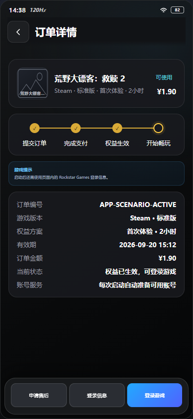 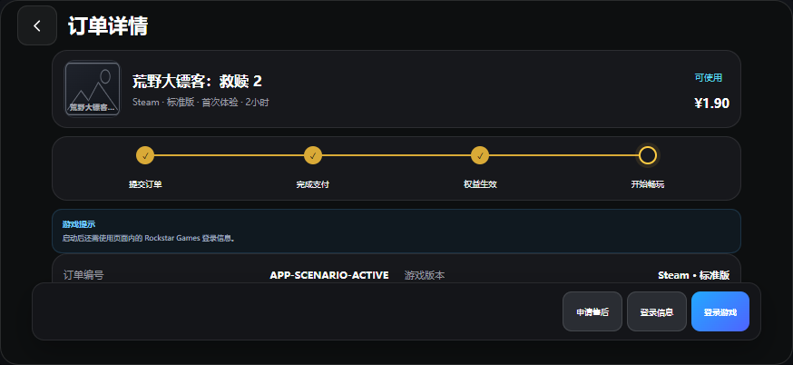 | **入口：**点击订单卡进入独立详情，横竖屏均不与列表同屏。 **内容：**游戏、版本、套餐、租期、订单号、金额、支付、账号分配、租期、退款进度和订单快照。 **固定操作：**操作区固定在页面底部，并与列表共用动作源：待支付“取消订单 / 继续支付”；分配中“刷新状态”；租赁中“申请售后 / 登录信息 / 登录游戏”；退款中“退款进度”；已退款“退款进度 / 删除订单”；已退款与已结束若用户已有目标游戏直接权益则增加“可畅玩”，否则增加“租号开玩”。 **退款进度：**<strong>点击必须打开可见进度弹层，展示退款处理中或已完成、退款金额、原路退回说明和阶段进度；列表与详情复用同一弹层，支持关闭。</strong> **安全：**列表和普通详情不返回明文凭据；登录信息经短时授权单独读取。 **返回：**恢复订单中心原 Tab、搜索词、搜索展开状态和滚动位置。 |
| 14. Steam 登录与登录信息 | 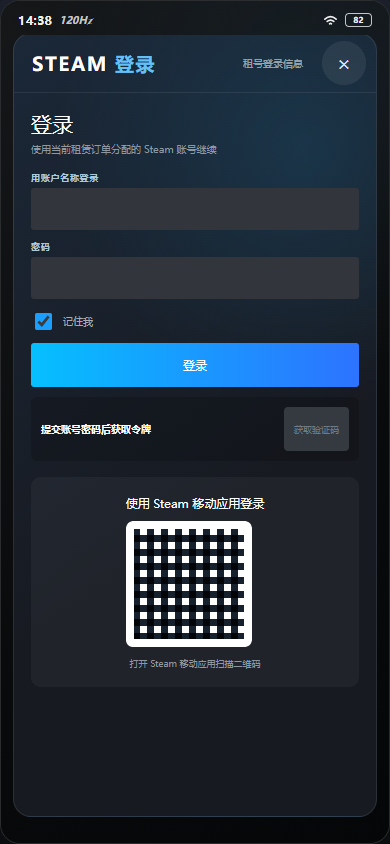 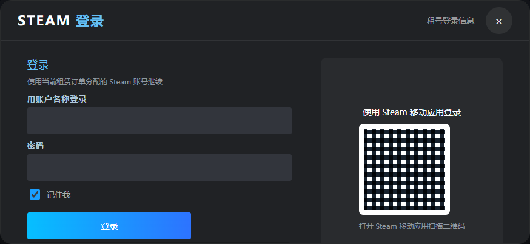 | **入口：**账号分配成功后展示“一键上号 / 手动登录”。 **一键上号：**<strong>本期Demo固定走成功路径；点击后关闭登录方式弹层，展示登录成功反馈并返回Steam游戏库，不展示失败或重试态。</strong>手动登录是用户主动选择的独立备用路径。 **布局：**竖屏顺序为二维码与扫码说明 → 账号密码表单；横屏保持账号密码在左、二维码在右。Steam 页内嵌租号登录信息使用整个面板宽度；横版令牌和第三方验证码左对齐占半栏。 **Steam Guard：**<strong>登录前不显示令牌提示、空容器或禁用验证码按钮；提交账号密码后，仅在服务端返回需要 Guard 时显示令牌验证区。</strong> **第三方平台：**部分游戏继续显示具体平台名，如Rockstar Games；账号和密码默认脱敏，验证码按需获取并包含倒计时、限频和过期态。 **安全：**关闭信息层、退后台、到期、退款、换号或使用单失效时清理敏感展示；账号、密码与验证码不得进入持久化、公开snapshot、日志或埋点。 |
| 15. 到期前15分钟提醒 | 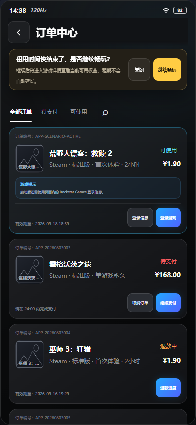 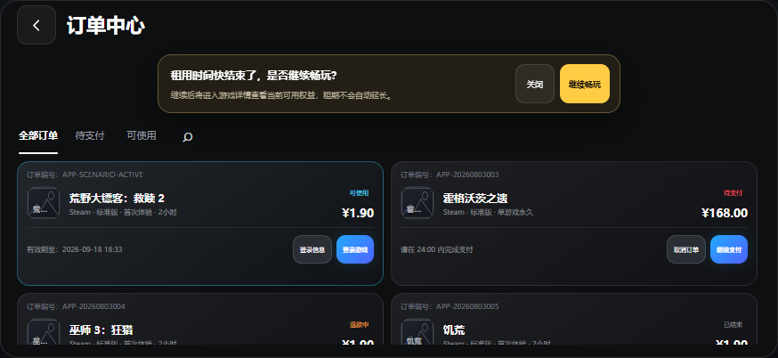 | **触发：**当前使用单未提醒，且剩余时间首次从大于15分钟跨入小于等于15分钟且大于0时触发一次；16分钟直接跳到14分钟仍触发。 **展示：**游戏内外均显示，不遮挡标题、表单或主操作。 **操作：**关闭后本使用单不再提醒；“继续畅玩”进入当前游戏实时权益详情，原租期不自动延长。 **去重：**旋转、前后台切换、重进页面不重复；5分钟、1分钟不新增提醒。 |
| 16. 售后与换号 | 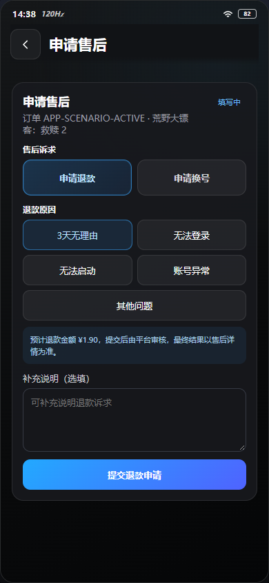 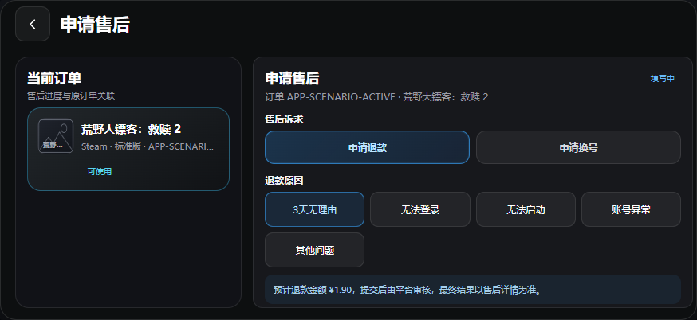 | **入口：**订单详情“申请售后”。 **类型：**<strong>固定为启动失败、Steam 登录失败、账号异常或频繁掉线、其他问题四项。</strong>问题描述1—300字，不允许纯空格；提交时校验并定位首个错误。 **3天无理由：**只保留为确认订单与订单详情的权益说明，不作为用户可选售后问题类型。 **系统自动退款：**取号失败继续进入退款中、已退款等订单状态，不受售后类型调整影响。 **换号：**只换同游戏同版本；无库存保留原绑定；成功后撤销旧凭据并绑定新使用单。 **恢复：**草稿随旋转和退后台保留；重复提交返回原售后单。 |
| 17. 游戏订单支付成功 | 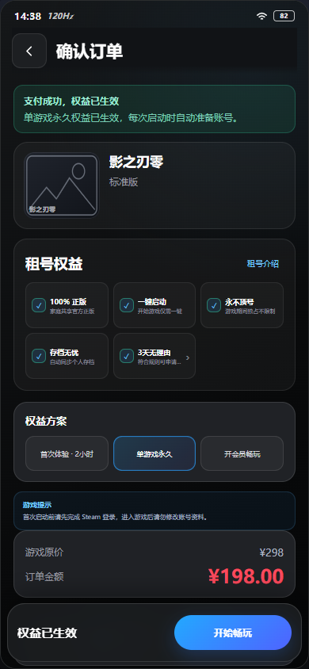 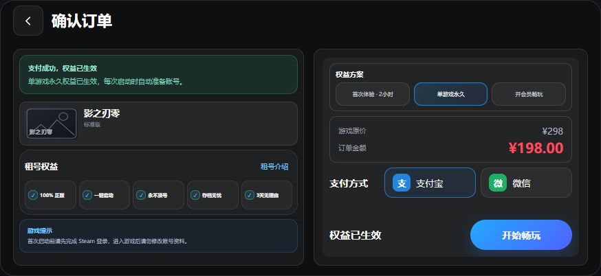 | **权益方案：**<strong>首次体验或单游戏永久支付成功后直接显示“权益已生效”，不展示账号分配状态；首次体验从服务端支付成功时间开始计时并立即消耗平台级首次资格。</strong>点击开始畅玩时，后台按当前有效权益幂等准备或复用账号，用户无感。 **时租：**支付成功后进入账号分配；成功后显示“一键上号”，失败进入退款中。 **恢复：**退出或断网后按订单号查询；重复支付回调、查询或启动不重复发放权益、延长有效期或占用账号。 |
| 18. 会员支付成功 | 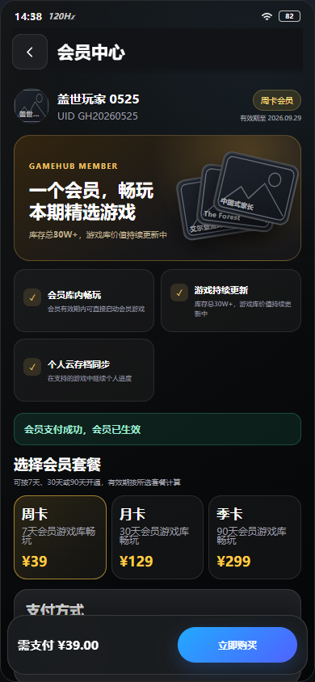 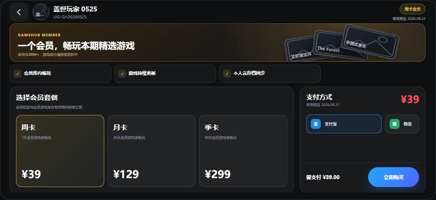 | **展示：**订单号、支付结果、生效套餐、有效期和会员游戏库入口。 **成功：**权益发放成功后显示“会员已生效”，同步更新个人中心和会员游戏库权限。 **未知：**支付成功但权益未知时显示“权益确认中”，保留订单号并查询。 **失败：**权益发放失败进入支付补偿，不复用游戏订单分配状态。 |

### 4.3 详细设计（B端与服务端接入）

> 本期复用 Mac 共用后台，不新建 APP 专属页面。下表只说明 APP 新接入与必须保持的服务端规则。

| 模块名称 | 图示 | 展示&交互说明 |
|---|---|---|
| 1. 外放与灰度 | — | 复用功能启停、地区、渠道和用户比例；增加 APP 客户端维度。稳定分桶以用户为主键；未登录或地区不可判定时不产生新交易。缩量不影响已支付权益。 |
| 2. 商品、版本与 SKU | — | 复用游戏、Steam AppID、版本、租期、原价、实付价、价格版本、上下架和库存。<strong>`platform` 与 `editionId` 分离；首期客户端只接受 `editionId=standard`，商品名标“标准版”，不展示版本切换。SKU 必须同时匹配地区、平台、标准版、库存和资格。热门游戏配置按小时、日租、周租商品，非热门游戏只配置首次体验、单游戏永久与会员入口。每款游戏使用稳定售卖模式，不得按实时热度自动切换。</strong> |
| 3. 权益与价格 | — | 服务端按游戏、用户、地区、平台、版本、库存和资格返回统一权益快照及分类型价格。<strong>首页 Banner 的“¥1.9首租”是标准版、按小时、2小时组合的资格报价，不是独立 SKU 或第四个租期选项；按小时支持2—23整数小时，价格服务按标准版、小时数和资格实时报价。</strong>搜索结果优先级固定为有效租赁“已租号” → 已可直接游玩“可畅玩” → 符合条件的最低租号价 → 无新增信息。最低租号价按原始金额比较，客户端在首页与搜索格式化为一位小数；租号、CDKEY、单游戏永久、会员分别计算，不跨类型取最低价。 |
| 4. 订单与快照 | — | 游戏订单锁定用户、地区、游戏、版本、SKU、租期、原价、实付价、币种、价格版本、会员库状态和首次资格30分钟。后台调价、下架或缩量不得改写已支付快照。 |
| 5. 支付与分配 | — | 支付回调、创单、取消、查询和账号分配按订单号幂等。时租订单支付成功后进入账号分配，分配失败进入退款，不得伪装为支付失败；首次体验与单游戏永久支付成功后权益直接生效，不展示账号分配，启动时后台幂等准备或复用账号。 |
| 6. 使用单与凭据 | — | 一键和手动登录共用同一使用单。Steam 账号/密码/令牌及 Rockstar Games 等具体第三方平台账号/密码/验证码只经有效使用单短时授权返回；第三方配置按游戏显隐，验证码包含服务端过期时间与刷新限频。所有敏感值均不进入普通订单接口、公开 snapshot、本地持久化、日志、埋点、导出或客服普通详情。 |
| 7. 到期与回收 | — | 服务端结束时间为唯一基准并返回服务器时间。APP 按使用单记录15分钟提醒。T0 撤销会话、清理凭据、释放账号并结束使用单；回收失败账号进入异常池。 |
| 8. 售后与退款 | — | 用户问题类型固定四项并支持同版本换号；3天无理由只作为订单权益说明。取号失败自动退款继续按订单状态机处理。售后请求按订单与问题幂等；退款、换号、结束后撤销旧凭据。 |
| 9. 订单聚合 | — | 统一订单中心按 Tab 口径返回租号订单，支持当前 Tab 内的服务端搜索、排序和分页。<strong>本期 Demo 不新增订单类型筛选或标签，只返回租号 fixture；CDKEY 状态由其独立需求负责。</strong> |
| 10. 操作记录与统计 | — | 商品、价格、库存、订单、退款、外放和灰度操作保留操作记录；统计增加 APP、方向、入口、地区、渠道、游戏、SKU、登录方式和异常码。 |
| 11. 租号商品管理 | — | <strong>页面内提供 APP（安卓端）/Mac Tab，进入页面默认 APP；APP 只显示标准版商品，配置时租或权益方案、价格、库存和上下架状态；Mac 保留原商品与版本数据。</strong>切换端别只刷新当前页数据，并清除当前页另一端的勾选、未提交表单和分页。 |
| 12. 会员游戏库管理 | — | 页面内提供 APP（安卓端）/Mac Tab，进入默认 APP；分别配置游戏、版本、可用库存、云存档支持和上下架状态。读写、批量操作和导出必须携带当前端别，不得混用两端数据。 |
| 13. 会员套餐管理 | — | 页面内提供 APP（安卓端）/Mac Tab，进入默认 APP。APP 只配置周卡、月卡、季卡，不出现永久会员；Mac 保留月度、年度、永久会员等原套餐。价格、有效期、推荐状态和上下架按端独立保存。 |
| 14. 账号资源管理 | — | 页面内提供 APP（安卓端）/Mac Tab，进入默认 APP；展示游戏、平台、脱敏账号、资源状态、当前订单和健康状态。APP 与 Mac 账号池、筛选、批量操作和导出隔离；后台不得显示密码、令牌或验证码明文。 |
| 15. 订单与售后 | — | 页面内提供 APP（安卓端）/Mac Tab，进入默认 APP；APP 订单显示 APP 版本、Android 版本、机型、CPU、GPU、运行内存和售后状态；Mac 保留原 Mac 设备字段。订单、退款、换号和导出均按当前端别执行。 |
| 16. 效果统计 | — | 页面内提供 APP（安卓端）/Mac Tab，进入默认 APP；分别展示租号曝光、点击租号、提交订单、支付成功、一键上号成功漏斗，以及支付、库存、上号成功率和退款指标。切换端别不合并分子分母。 |
| 17. 操作记录 | — | <strong>不增加 APP/Mac Tab；统一展示两端关键写操作，每条记录必须显示 clientType、操作人、模块、动作、对象、时间、结果和变更快照。</strong>筛选和浏览不写日志；导出保留 clientType。 |

#### 4.3.1 后台角色权限

| 角色 | 功能权限 | 数据范围 | 禁止操作 |
|---|---|---|---|
| 商品运营 | 查询、配置、上下架、导出商品与会员配置 | 按授权客户端和地区 | 查看账号凭据、处理退款 |
| 账号运营 | 查询、隔离、恢复账号资源 | 按授权客户端账号池 | 查看明文密码、修改订单金额 |
| 客服 | 查询订单、处理售后、查看退款进度 | 按授权订单范围 | 修改商品和会员价格、导出凭据 |
| 数据运营 | 查看并导出效果统计 | 脱敏聚合数据 | 修改商品、账号、订单和套餐 |
| 审计管理员 | 查询与导出操作记录 | APP 与 Mac 统一审计记录 | 修改或删除操作记录 |

#### 4.3.1 边界条件-内容侧

| 场景 | 触发条件 | 处理方式 | 提示文案 |
|---|---|---|---|
| 商品下架 | C端仍有缓存 | 拒绝新创单并刷新详情；已支付订单按快照履约 | 当前版本暂不可租用 |
| 价格变化 | 用户进入确认订单或锁价失效 | 返回最新价格并要求重新确认，不静默加价 | 价格已更新，请重新确认 |
| 无健康库存 | 下单前库存为0 | 套餐不可选；不允许支付 | 暂无可用账号 |
| 支付后分配失败 | 付款后库存或供应商失败 | 进入退款中；不下发凭据 | 账号分配失败，退款处理中 |
| 售卖模式改为非热门权益 | 已存在普通时租配置 | 只影响新交易；停止展示普通时租，开放符合资格的首次体验、单游戏永久与会员入口 | 畅玩方式已更新 |
| 售卖模式改为热门时租 | 已存在权益配置 | 只影响新交易；停止展示首次体验、单游戏永久与会员入口，开放有效时租 SKU | 租期已更新 |
| 地区或灰度关闭 | 用户未命中 | 隐藏新入口并拒绝新交易；已支付权益继续 | 当前地区暂不可用 |
| 多语言缺失 | 海外包无目标语言文案 | 使用英语兜底并上报告警，不展示空文案 | — |

#### 4.3.2 边界条件-用户侧

| 场景 | 触发条件 | 处理方式 | 提示文案 |
|---|---|---|---|
| 未登录 | 点击购买、订单或登录信息 | 完成 APP 登录后返回原页面和操作 | 请先登录 |
| 已拥有或已导入游戏 | 权益校验命中 | 优先启动或下载，隐藏会阻断原路径的价格 | — |
| 首次资格已使用 | 全平台资格已核销 | 隐藏首次价，显示普通租号或其他权益 | — |
| 已有有效租赁 | 进入同游戏详情 | F 操作区保留“查看更多 / 秒玩”，主操作改为“登录游戏”；不再展示购买或租号入口 | — |
| 会员到期 | 启动会员库游戏 | 不新取号；进入会员中心或当前可售权益 | 会员已到期 |
| 支付超时 | 超过订单有效期 | 关闭订单并从待支付移除 | 订单已超时 |
| 到期后启动 | 无新有效权益 | 拦截启动、撤销凭据并进入实时权益详情 | 租用已结束 |
| 无权限订单深链 | 订单不存在或不属于当前用户 | 不返回订单与凭据；回到订单中心兜底 | 订单不存在或无法查看 |
| 网络中断 | 支付、分配、登录或售后中断 | 保留订单号和非敏感状态；恢复后查询服务端真值 | 网络异常，请重试 |

### 4.4 状态流转

#### 4.4.1 独立状态

| 状态域 | 状态枚举 | 进入条件 | 退出条件 | 失败处理 |
|---|---|---|---|---|
| 支付状态 | 待支付、支付中、已支付、已关闭 | 创单、发起支付、支付成功或超时取消 | 时租支付成功后进入分配；权益方案支付成功后直接生效；关闭后终止履约 | 未知结果按订单号查询，不重复扣款 |
| 分配状态 | 未分配、分配中、已分配、分配失败 | 时租支付成功后开始分配；权益方案在启动时后台准备账号 | 时租成功后创建使用单；失败后进入退款；权益方案准备过程用户无感 | 时租不下发无效凭据；权益方案不展示“账号分配中” |
| 租期状态 | 未开始、租用中、已结束 | 使用单创建、开始计时、到期或提前终止 | 到期后撤销会话并释放账号 | 回收失败隔离账号，用户侧仍结束 |
| 退款状态 | 无退款、申请中、退款中、已退款、退款失败 | 分配失败或售后通过 | 原路退款成功或失败 | 失败进入人工兜底并保留进度 |

#### 4.4.2 订单展示状态与 Tab

订单展示状态按“已退款 > 退款中 > 待支付 > 分配中 > 租赁中 > 已结束”计算；未支付关闭订单显示为“已结束”，但订单快照仍保留支付关闭原因。不能用一个状态覆盖四个状态域。

| 展示状态 | 支付 | 分配 | 租期 | 退款 | 所属 Tab | 主要操作 |
|---|---|---|---|---|---|---|
| 待支付 | 待支付或支付中 | 未分配 | 未开始 | 无退款 | 全部、待支付 | 取消、继续支付 |
| 已结束（未支付关闭） | 已关闭 | 未分配 | 未开始 | 无退款 | 全部 | 有直接权益显示可畅玩，否则显示租号开玩；可删除订单 |
| 分配中 | 已支付 | 分配中 | 未开始 | 无退款 | 全部 | 查看详情、刷新状态 |
| 租用中 | 已支付 | 已分配 | 租用中 | 无退款 | 全部、可使用 | 列表：登录信息、登录游戏；详情：申请售后、登录信息、登录游戏 |
| 退款中 | 已支付或已关闭 | 任意 | 未开始或已结束 | 申请中或退款中 | 全部 | 查看退款进度 |
| 已退款 | 已支付或已关闭 | 任意 | 未开始或已结束 | 已退款 | 全部 | 退款进度；有直接权益显示可畅玩，否则显示租号开玩；可删除订单 |
| 已结束（租期结束） | 已支付 | 已分配 | 已结束 | 无退款 | 全部 | 有直接权益显示可畅玩，否则显示租号开玩；可删除订单 |

#### 4.4.3 关键状态动作

| 当前状态 | 触发事件 | 条件 | 下一状态 | 失败处理 |
|---|---|---|---|---|
| 未创单 | 用户确认套餐 | 商品、价格、资格、库存有效 | 待支付 | 保持详情并显示具体原因 |
| 待支付 | 支付成功 | 订单在有效期内且回调幂等 | 分配中 | 未知结果查询原订单 |
| 分配中 | 分配成功 | 同游戏同版本健康账号 | 租用中 | 分配失败进入退款中 |
| 租用中 | 首次跨入剩余15分钟内 | 当前使用单未提醒 | 租用中/已提醒 | 不影响游戏，不重复提醒 |
| 租用中 | 到期 T0 | 无新有效权益 | 已结束 | 回收失败隔离账号 |
| 任意履约状态 | 售后通过 | 满足退款或换号规则 | 退款中或新使用单 | 返回原售后单或明确失败 |
| 退款中 | 原路退款成功 | 支付渠道返回成功 | 已退款 | 失败进入人工兜底 |

### 4.5 关键业务对象

| 业务对象 | 关键内容 | 规则 |
|---|---|---|
| 游戏订单 | 订单号、用户、地区、渠道、游戏、版本、SKU、租期、币种、原价、实付价、价格版本、四个状态域、创建与更新时间 | 全局唯一；创单与支付幂等；历史快照不可改写 |
| 使用单 | 使用单号、订单号、账号引用、开始时间、结束时间、提醒记录、登录方式、会话状态 | 同一有效订单同一时刻最多一个；不保存可导出的明文凭据 |
| 会员订单 | 会员订单号、套餐、实付、币种、权益起止、支付和发放状态 | 与游戏订单独立编号、支付和快照 |
| 售后单 | 售后单号、订单号、问题类型、描述、资格、审核、退款或换号结果 | 重复提交返回原售后单；不包含明文凭据 |
| 权益结果 | 已拥有、已导入、已安装、有效租赁、单游戏永久、有效会员、无权益 | 决定入口与主操作；已有权益优先于价格 |
| 订单查询上下文 | 当前 Tab、搜索词、分页位置、滚动位置 | 进入详情和横竖屏切换后保留；搜索只作用当前 Tab |

### 4.6 系统集成与降级

| 系统 | 方向 | 数据/接口 | 触发方式 | 失败降级 | 责任方 |
|---|---|---|---|---|---|
| 用户权益 | 双向 | 拥有、导入、安装、租赁、永久、会员、首次资格 | 入口、详情、创单、启动前 | 不展示新交易，不影响已支付快照 | APP、服务端 |
| 商品与价格 | 服务端→APP | 版本、SKU、分类型价格、价格版本、会员库状态 | 曝光、详情、确认订单 | 过期快照要求刷新 | 服务端、运营 |
| 账号库存 | 双向 | 健康库存、锁定、分配、换号、释放 | 创单、支付后、售后、到期 | 支付后失败进入退款 | 账号池、服务端 |
| 支付 | 双向 | 游戏订单、会员订单、支付结果、退款 | 支付、退款 | 未知结果查询原订单 | 支付、服务端 |
| 订单中心 | 双向 | Tab、搜索、排序、分页、展示状态 | 进入、切 Tab、搜索、刷新 | 保留当前内容并重试 | 订单、APP |
| Steam 与会话 | 双向 | 一键上号、手动登录、Guard、启动、撤销 | 分配后、登录、到期 | 切手动或阻断租赁会话 | 客户端、服务端 |
| 售后与退款 | 双向 | 资格、审核、换号、退款阶段 | 订单详情、运营处理 | 保留售后单并幂等查询 | 客服、服务端 |
| 灰度与地区 | 服务端→APP | 包体、地区、渠道、用户分桶 | 冷启动、进入详情、创单 | 未命中隐藏新交易，已支付继续 | 产品、运营、服务端 |

## 五、非功能需求

| 需求类型 | 详细要求 | 验收方式 |
|---|---|---|
| 性能 | 租号权益不得阻塞核心页首屏；详情权益 P95≤800ms；订单列表、当前 Tab 搜索和订单状态查询 P95≤1s；方向切换首个稳定帧≤500ms | 弱网、冷启动、长列表、连续搜索和旋转压测 |
| 列表与加载 | [待确认] 订单中心默认每次加载20条并滚动加载；保留已加载内容；无更多数据时结束加载；初始空态、搜索空态、加载中和加载失败分开 | 0、1、20、21及多页订单用例 |
| 兼容性 | 支持 V6.1.1 当前 Android、iOS 和掌机模式基线；横竖屏共享状态，不使用根容器整体缩放 | 支持设备矩阵逐页检查18个页面 |
| 安全与隐私 | 账号、密码、Guard、短时授权不得进入本地持久化、普通接口、日志、埋点、Crash、截图、导出或客服普通详情；按最小权限访问 | 抓包、日志、缓存、埋点和后台权限审计 |
| 合规 | Steam 条款、账号使用、退款、虚拟服务、国内实名与海外地区规则完成专项评审；未通过只允许内部白名单 | 法务、安全、支付评审记录 |
| 容错与降级 | 创单、支付、分配、售后按订单或使用单幂等；网络恢复查询服务端真值；价格变化重新确认；回收失败账号隔离；功能关闭不影响已支付权益 | 故障注入、重复点击、断网恢复、回放测试 |
| 数据生命周期 | 订单、支付、权益、退款和售后按公司财务与合规周期保存；凭据短时授权到期即失效；历史订单快照不被商品配置覆盖 | 数据库、缓存和清理任务检查 |
| 金额与时间 | <strong>首页与搜索租号价固定显示一位小数；详情和订单结算使用原始金额并保留2位小数</strong>；海外税费按地区规则；订单时间显示用户本地时区，服务端以统一时间保存；剩余租期以服务端结束时间计算，超过24小时显示“X天X小时” | 多币种、多时区、跨天、24小时边界和锁价测试 |
| 国际化 | **国内包默认中文且不可切换；海外包支持中文、英语、日语、俄语、巴西葡萄牙语。英文产品名仅用 GameHub。** 文案支持长度自适应，状态不能只靠颜色表达 | 五语伪本地化、截断、状态可读性检查 |
| 灰度与回滚 | 支持 APP、地区、渠道和用户比例灰度；未命中不产生新曝光和新交易；回滚后已支付订单、会员和租用中使用单继续履约 | 20%、50%、100%及紧急关闭演练 |

## 六、埋点需求

### 6.1 埋点事件表

| 事件ID | 事件名称 | 触发时机 | 关键参数 | 指标用途 |
|---|---|---|---|---|
| rental_entry_expose | 租号入口曝光 | 租号价格或状态首次进入可视区 | game_id, entry_source, orientation, entitlement_state, price_mode | 曝光覆盖与价格质量 |
| rental_entry_click | 租号入口点击 | 点击租号价格、状态或主操作 | game_id, entry_source, orientation, entitlement_state | 入口点击率 |
| rental_detail_view | 租号详情展示 | 权益区完成渲染 | game_id, entitlement_state, member_library_hit, trial_eligible, inventory_state | 详情进入与权益分流 |
| rental_sku_select | 租号套餐选择 | 选择版本、租期或长期权益 | game_id, sku_type, duration, price, currency, price_version | SKU偏好 |
| rental_checkout_view | 确认订单展示 | 订单快照创建成功 | order_id, sku_type, amount, currency, orientation | 详情到创单 |
| rental_pay_click | 发起支付 | 点击确认支付 | order_id, amount, currency, payment_method | 支付发起率 |
| rental_pay_result | 支付结果 | 支付确认成功、失败或未知 | order_id, result, error_code | 支付成功率 |
| rental_allocation_result | 分配结果 | 账号分配成功或失败 | order_id, result, latency, error_code | 履约成功率 |
| rental_login_action | 登录操作 | 一键、手动、重试或获取Guard | order_id, usage_id, login_method, action | 登录路径 |
| rental_start_result | 启动结果 | 目标游戏启动成功或失败 | order_id, usage_id, login_method, result, error_code | 启动成功率 |
| order_center_view | 订单中心展示 | 页面首屏完成 | order_tab, order_count, orientation | 订单回访 |
| order_tab_switch | 订单Tab切换 | 点击全部、待支付或可使用 | from_tab, order_tab, has_keyword | Tab使用 |
| order_search | 当前Tab搜索 | 搜索请求完成 | order_tab, keyword_type, result_count, result | 搜索成功率 |
| order_card_click | 订单卡点击 | 进入订单详情 | order_id, order_tab, display_status | 订单找回 |
| order_action_click | 订单动作点击 | 继续支付、登录游戏、登录信息、继续畅玩、售后等 | order_id, display_status, action | 任务恢复率 |
| rental_expiry_reminder | 15分钟提醒 | 展示、关闭或继续畅玩 | usage_id, action, remaining_seconds, context | 去重与继续转化 |
| rental_after_sale_submit | 售后提交 | 提交成功或失败 | order_id, issue_type, eligibility, result | 售后分布 |
| rental_refund_update | 退款进度 | 退款阶段变化 | order_id, refund_stage, result, error_code | 退款时效 |
| rental_exception | 租号异常 | 价格、库存、支付、分配、登录、回收或搜索异常 | screen, order_id, usage_id, error_code, recover_action | 异常与恢复 |

### 6.2 埋点参数表

| 参数名 | 类型 | 必填 | 说明 | 枚举/示例 |
|---|---|---|---|---|
| game_id | string | 是 | 游戏标识 | 271590 |
| order_id | string | 订单后是 | 订单标识，不包含凭据 | APP-20260810001 |
| usage_id | string | 取号后是 | 使用单标识 | USE-APP-001 |
| entry_source | enum | 入口是 | 入口 | home, play, search, library, detail, profile, orders |
| orientation | enum | 是 | 页面方向 | portrait, landscape |
| entitlement_state | enum | 详情是 | 当前权益 | owned, imported, installed, active_rental, game_permanent, active_member, none |
| price_mode | enum | 价格曝光是 | 价格表达 | rental, purchase, rental_purchase, trial, selectable |
| sku_type | enum | 选购后是 | SKU类型 | hourly, daily, weekly, trial, game_permanent, member_weekly, member_monthly, member_quarterly |
| duration | integer | 租期是 | 租期分钟数；长期权益为0 | 120 |
| price | decimal | 价格是 | 展示或实付金额 | 12.00 |
| currency | string | 金额是 | ISO币种 | CNY, USD |
| price_version | string | 创单是 | 价格版本 | PV-20260810-01 |
| order_tab | enum | 订单中心是 | 当前Tab | all, unpaid, usable |
| display_status | enum | 订单是 | 订单展示状态 | unpaid, closed, allocating, active, refunding, refunded, ended |
| keyword_type | enum | 搜索是 | 关键词类型，不上报原文 | game_name, order_no |
| result | enum | 结果事件是 | 操作结果 | success, fail, unknown |
| error_code | string | 异常时是 | 可识别错误码 | ALLOCATION_NO_STOCK |

> 数据安全：禁止在事件名、参数、日志、Crash、Toast、订单导出或分析宽表中上报 Steam 或 Rockstar Games 等第三方平台账号、密码、令牌、验证码、短时授权及其可逆变形。订单搜索不上传埋点原始关键词或完整订单号。

## 七、运营需求

| 优先级 | 准备事项 | 负责人角色 | 完成条件 | 最晚时间 |
|---|---|---|---|---|
| P0 | 确认首发地区、渠道、游戏、版本、SKU、价格和库存 | 产品、运营、商务 | 每个上架 SKU 有有效价格和健康库存 | 内部灰度前 |
| P0 | 配置 APP 外放与稳定分桶 | 产品、运营、服务端 | 20%、50%、100%及紧急关闭演练通过 | 内部灰度前 |
| P0 | 完成游戏、会员、退款和供应商对账 | 财务、服务端、运营 | 游戏订单与会员订单独立；自动退款可追踪 | 内部灰度前 |
| P0 | 完成凭据、Steam 条款、退款与国内海外合规评审 | 法务、安全、支付 | 评审通过；未通过仅内部白名单 | 内部灰度前 |
| P0 | 准备支付、分配、登录、到期、退款、换号 SOP | 客服、运营 | 客服可按订单和使用单定位，不读取明文凭据 | 内部灰度前 |
| P0 | 生成普通 Demo、标注版与36张截图 | 产品、设计、前端 | 18个页面横竖屏可操作并逐页对比 | PRD终审前 |
| P0 | 回填固定 SHA 图片并远程验证 | 产品 | 36个URL均HTTP 200且Content-Type为image/png | 飞书导入前 |
| P1 | 准备会员游戏库、首次租、永久权益和手动登录 FAQ | 内容、客服、运营 | 国内中文及海外五语审核完成 | 50%放量前 |
| P1 | 建立灰度日报 | 数据、运营、产品 | 可按入口、方向、地区、渠道、游戏、SKU下钻 | 灰度期每日 |

## 八、来自功能上线后的更新

当前为上线前 V2.0，暂无上线后规则更新。上线后调整售卖模式、SKU、会员价格、地区、订单 Tab、搜索、临期、退款、凭据或后台端别策略时，必须追加版本记录，不得覆盖历史订单口径。

## 九、验收与待确认项

### 9.1 验收标准

| 功能 | 前置条件 | 操作 | 预期结果 | 优先级 |
|---|---|---|---|---|
| 1. 首页 | Banner 绑定符合首租资格的时租游戏，并配置小游戏卡租号价与在租人数 | 查看 Banner 与游戏卡、切换首租资格、旋转并进入详情 | <strong>Banner 左上为“今日推荐+日期”，左下为“游戏名+评分/类型”，右下为“¥1.9首租 / 99+ 在租”；小游戏卡为“¥9.9租号 / 在租99+”；无圆环和旧 CDKEY 标签；首租价与标准版、按小时、2小时的资格报价同源；资格失效后改为“¥X.X租号”，不得继续显示“首租”</strong> | P0 |
| 2. 玩游戏 | 分别使用国内包、海外包 | 查看PC游戏和云游戏区域 | 租号不替换已有游戏；国内保留云游戏，海外不展示 | P0 |
| 3. 社区 | 文章关联有效游戏 | 点击查看相关游戏 | 社区无交易卡；进入统一详情后判断权益 | P0 |
| 4. 排行榜 | 榜单含可租游戏 | 点击游戏 | 不在榜单创单；进入详情后展示当前权益 | P0 |
| 5. 游戏库 | 用户已拥有、导入或安装游戏 | 查看并启动游戏 | 原启动、下载和导入路径优先，无租号覆盖 | P0 |
| 6. 个人中心 | 用户已登录 | 查看用户名、会员状态并点击订单中心 | 用户名与“会员未开通/已开通 ›”同行，下一行只有UID与已实名；无重复会员大卡；只有一个“订单中心”并进入统一列表 | P0 |
| 7. 搜索 | 搜索命中游戏与社区，以及有效租赁、可直接游玩和可售租号游戏 | 切换全部、游戏、社区；点击游戏整卡并返回 | <strong>三个 Tab 真实筛选并保留关键词；游戏卡每张只有一条结果，无按钮、剩余时长、订单进度或权益来源</strong> | P0 |
| 8. 游戏详情 | 分别构造付费可买可租、免费获取、有效租赁和已有权益游戏 | 查看 F 操作区并点击“租号开玩” | 更多与秒玩为透明无背景的上图标下文字；付费可买可租时显示“立即购买 / 租号开玩”；免费获取隐藏租号；横屏严格按游戏名→简介→标签→按钮且无重叠 | P0 |
| 9. 确认订单 | 分别进入热门时租与非热门权益游戏 | 切换套餐与小时数、支付方式，打开租号介绍，旋转、退后台、恢复网络 | 商品名称与灰色“标准版”副标题分层；无版本按钮和五项通用权益区；当前 SKU 权益说明随选择变化；租号介绍按作用、使用方法、注意事项三组问题一问一答；订单金额、需支付和支付请求一致；无二维码、协议、支付有效期、租赁信息与当前报价 | P0 |
| 10. 会员中心 | 未开通且默认季卡，再完成支付和续费 | 查看首次说明、切换套餐、浏览游戏库与常见问题并支付 | 首次说明本会话只出现一次且无远程协助；页面按“会员价值 → 原四项权益 → 周卡/月卡/季卡 → 会员游戏库 → 常见问题”展示；底部为需支付与立即购买；开通后显示套餐和有效期；未到期续费顺延，重复回调不重复延长 | P0 |
| 11. 会员游戏库 | 有效会员与无效会员各一组，并分别配置支持/不支持云存档游戏 | 浏览并点击游戏 | 只有有效会员且游戏在库时允许新取号；仅 `cloudSaveSupported=true` 显示“支持云存档”，不支持游戏不误展示；空态和错误态可用 | P0 |
| 12. 订单中心顶部 | 存在多状态租号订单 | 进入订单中心并点击放大镜 | 顶部只有全部订单、待支付、可使用三个普通下划线 Tab；搜索展开前后三个Tab位置不变、文字不换行，搜索框位于可使用右侧 | P0 |
| 12. 订单Tab归属 | 构造待支付、关闭、分配、租用、退款、结束订单 | 切换三个Tab | 订单归属符合4.4.2；分配中不进入可使用 | P0 |
| 12. 订单搜索 | 各Tab含多页订单 | 搜索游戏名和订单号、切Tab、清空 | 只搜索当前Tab全量数据；关键词保留；清空恢复当前Tab | P0 |
| 12. 订单卡片 | 查看各租号状态 | 对比卡片信息与动作 | <strong>无订单类型标签，只展示租号状态；状态色和主次按钮层级统一</strong>；金额、租期和动作准确；无明文凭据 | P0 |
| 13. 订单详情 | 从各状态订单进入详情 | 点击退款中与已退款订单的“退款进度”，并操作其他状态按钮 | 退款进度打开可关闭弹层，状态、金额、原路退回说明和阶段准确；其他详情动作固定底部并与列表共用唯一映射 | P0 |
| 14. Steam登录 | 有效使用单；目标游戏配置 Rockstar Games | 点击一键上号；另行选择手动登录，先检查初始态，再提交账号密码并验证Guard及第三方验证码 | 一键上号关闭弹层、提示成功并返回Steam游戏库；不存在失败/重试态；手动登录初始态无令牌提示或禁用验证码按钮，提交后仅按需显示Guard；双平台凭据布局、安全清理保持可用 | P0 |
| 15. 15分钟提醒 | 剩余时间从16分钟跳至14分钟 | 旋转、退后台、关闭、重进 | 本使用单只提醒一次；5分钟和1分钟不新增提醒 | P0 |
| 16. 售后 | 租赁中订单存在履约问题 | 查看类型、输入描述、提交、重复提交、申请换号 | 只有启动失败、Steam登录失败、账号异常/频繁掉线、其他问题四项；无3天无理由类型；重复提交幂等；仅同版本换号 | P0 |
| 17. 游戏支付结果 | 分别支付权益方案与时租订单 | 观察结果页、点击开始畅玩并退出重进 | 权益方案支付成功直接生效且不显示账号分配；启动时后台幂等准备账号；时租继续按账号分配结果进入可用或退款；重复回调不重复发放 | P0 |
| 18. 会员支付结果 | 支付成功且权益成功或未知 | 观察结果页 | 成功后同步会员状态；未知时显示确认中，不提前生效 | P0 |
| 价格规则 | 同游戏存在首租资格报价、普通时租 SKU、其他交易价格及不同资格 | 查看首页、搜索、详情与确认订单 | Banner 符合资格时显示标准版、按小时、2小时组合的“¥1.9首租”，该报价不是独立 SKU；资格失效后改为“¥X.X租号”并回退普通时租价；搜索只比较符合条件的租号 SKU 原始金额并显示一位小数；其他类型不参与；结算使用标准版、所选套餐和小时数报价并保留两位小数 | P0 |
| 状态拆分 | 支付成功、分配失败、退款失败 | 查看列表和详情 | 支付、分配、租期、退款各自保留真值；展示状态按优先级计算 | P0 |
| 到期T0 | 租期到期且无新权益 | 继续运行或重启游戏 | 立即从可使用移除；会话撤销、凭据清理、账号释放；订单已结束 | P0 |
| 网络与幂等 | 支付、分配、登录、搜索、售后阶段断网 | 恢复网络并重复操作 | 查询原订单或使用单，不重复支付、取号、退款或创建售后单 | P0 |
| 横竖屏连续性 | 位于18个页面任一任务状态 | 旋转设备 | 同一业务状态重排；页面、来源、订单、倒计时、输入和草稿不丢失 | P0 |
| 国内海外 | 使用国内、Global、GooglePlay包 | 检查登录、语言、云游戏、实名、币种 | 差异符合附录A；英文产品名只显示GameHub | P0 |
| 图片与飞书 | 36张截图完成并推送 | 回填并请求全部URL | 36个固定SHA HTTPS地址均HTTP 200且Content-Type为image/png | P0 |
| 运营后台页面 | 已接入 Mac 后台7个模块 | 逐页进入前6个模块并切换 APP/Mac，再进入操作记录 | 前6页各有两个端别 Tab且默认 APP；数据、筛选、选择、编辑、批量操作和导出按端隔离；操作记录无端别 Tab且每条显示 clientType | P0 |

### 9.2 待确认项

#### 必须确认（阻塞开发或上线）

1. [待确认] 订单中心分页默认每次20条；游戏名模糊匹配，订单号支持完整或前缀匹配。默认建议按此实现。未确认影响订单接口、前端搜索和测试；对应4.2第12项、第五章。
2. [待确认] 支付成功但分配失败后的自动退款发起时限和退款失败人工升级时限。默认建议5分钟内发起，失败立即进入人工队列。未确认影响退款状态、客服SOP和验收；对应4.3第5、8项和4.4。
3. [待确认] 国内租号支付是否复用现有实名认证门槛。默认建议国内沿用现有交易规则，海外不展示实名。未确认影响登录后支付链路和合规；对应2.3、附录A。
4. [待确认] Steam、Rockstar Games 等具体平台的账号共享条款、账号来源、短时凭据展示、退款资格与首发地区专项结论。默认建议未通过平台/地区只开放内部白名单。未确认阻塞外部灰度；对应4.2第14项、第五、七章。
5. [待确认] V6.1.1 普通 Demo、标注版、36张截图和固定提交 SHA。默认建议同一批截图使用同一40位提交 SHA。未回填阻塞 PRD 飞书终审；对应4.2和9.1。
6. [待确认] 周卡、季卡正式价格及默认推荐档。Demo 暂用周卡¥39、月卡¥129、季卡¥299并推荐季卡；默认建议上线价格全部从服务端价格版本读取，不展示未确认划线原价。未确认阻塞正式支付配置，不阻塞交互 Demo 评审；对应4.2第10项和6.2。

#### 建议确认（影响完整度）

1. [待确认] APP 租号首月转化目标。默认建议灰度首周建立分游戏基线，第二周再定目标，不用入口CTR替代支付成功率。影响上线复盘；对应2.2、3.4。
2. [待确认] 海外首发地区、币种、税费和退款文案。默认建议按支付服务返回本币和税费，不由客户端换算。影响海外测试和内容；对应第五章、附录A。
3. [待确认] 会员订单是否在后续统一订单中心展示。默认建议本期 Demo 不展示，后续按订单平台统一规则接入。影响后续范围，不影响本期租号订单验收；对应2.3、4.2第10、12项。

#### 可后续补充

1. 会员游戏库首批完整清单、上下架预告周期和五语 FAQ 正文，可在内容配置完成后追加。
2. 上线30、60、90天复盘结果与规则变更，追加到第八章。

## 附录 A、国内与海外差异

| 差异项 | 国内包 | 海外包 |
|---|---|---|
| 产品名 | **盖世游戏** | **GameHub** |
| APP登录 | **手机号、微信、QQ、Apple** | **邮箱、Google、Apple** |
| Steam登录 | 租号履约步骤，与APP登录分开 | 租号履约步骤，与APP登录分开 |
| 云游戏 | **沿用原云游戏入口和能力** | **不展示云游戏入口** |
| 实名认证 | **[待确认] 默认沿用现有交易实名规则** | **不展示实名认证** |
| 语言 | **默认中文，不支持切换** | **跟随系统或切换中文、英语、日语、俄语、巴西葡萄牙语** |
| 渠道 | official及国内渠道包，按渠道裁切 | Global、GooglePlay |
| 金额 | 人民币及国内价格版本 | 当地币种、税费和地区价格版本 |
| 灰度 | 按国内包、渠道、地区和用户分桶 | 按海外包、渠道、地区和用户分桶 |
| 运营资源 | 沿用国内运营资源显隐 | 不新增国内运营活动资源 |

## 附录 B、自检与模拟评审

### B.1 PRD自检

| 检查项 | 结果 | 说明 |
|---|---|---|
| 标准结构 | 通过 | 按合并模板输出九章，并补充状态、业务对象、系统集成和国内海外差异 |
| 18个页面/状态 | 通过 | 4.2含18行，每行有入口、展示、状态、异常或验收说明 |
| 横竖屏同状态 | 通过 | 旋转只重排；订单、输入、倒计时、Guard和草稿均保留 |
| 权益与价格 | 通过 | 发现页统一为已租号/可畅玩/一位小数租号价/无新增信息；最低价只比较合资格租号 SKU 原始金额；结算保留两位小数 |
| 详情与两类 SKU | 通过 | 详情轻操作为上图标下文字且透明无背景；确认订单标准版副标题、三套餐、2—23小时、双支付方式与底部唯一金额完整，冗余协议/二维码/汇总已移除 |
| 会员套餐与价值 | 通过 | 会员价值主视觉、原四项权益介绍、周卡/月卡/季卡、会员游戏库与常见问题顺序明确；个人云存档同步为四项权益之一；不展示永久会员；Demo 暂用价格与季卡推荐已标待运营确认 |
| 订单中心 | 通过 | 仅全部订单、待支付、可使用；搜索展开后Tab不位移不换行；退款进度有可见反馈；无类型筛选和标签；只演示租号状态 |
| 列表与搜索 | 通过 | 排序、分页、加载、初始空态、搜索空态、失败重试、返回位置均已定义 |
| 状态与异常 | 通过 | 支付、分配、租期、退款独立；覆盖非法小时不创单、退款中禁止删除、弱网、重复操作、价格变化、库存、回收与深链 |
| 输入与文本 | 通过 | 售后长度、纯空格、提交校验、多语言和长文案自适应已定义 |
| 售后边界 | 通过 | 售后固定四项；3天无理由仅作订单权益说明；取号失败自动退款继续走订单状态机 |
| 时间与金额 | 通过 | 服务端租期基准、本地时区、币种、发现页1位小数、结算2位小数、超过24小时格式和海外税费已定义 |
| 登录与隐私 | 通过 | 国内海外APP登录差异明确；Steam登录前不显示令牌占位提示，提交后仅按需显示Guard；Steam 与 Rockstar Games 等具体平台凭据的顺序、宽度、脱敏、短时验证码、清理和禁止上报已定义 |
| 非功能与灰度 | 通过 | 性能、兼容、安全、合规、容错、数据周期、国际化和回滚已定义 |
| 埋点 | 通过 | 覆盖入口、转化、支付、分配、登录、订单中心、提醒、售后和异常 |
| CDKEY边界 | 通过 | 详情、确认订单和订单中心只复用 CDKEY 信息骨架、状态色与按钮层级；本期 Demo 不写卡密、激活、发货或 CDKEY 订单状态 |
| 飞书图片 | **本地通过，发布待授权** | 36/36 新图已生成并完成尺寸、格式与原尺寸人工检查；固定 SHA 公开 HTTPS 地址及 HTTP、Content-Type 验证待发布授权 |
| Demo地址 | **本地通过，发布待授权** | V6.1.1 普通 Demo 与标注版已生成并通过全量自动验证；当前文档引用本地文件，公网地址待发布授权 |
| 动态权益与租号介绍 | 通过 | 已移除五项通用权益区；首次体验、单游戏永久和时租使用同源权益说明；租号介绍按三组常见问题一问一答 |
| 双端运营后台 | 通过 | 7个模块已接入标注版；前6页默认 APP 且可切 Mac，操作记录统一展示 clientType；13个后台状态通过自动与截图检查 |

### B.2 模拟评审结果

| 角色 | 结论 | 发现的问题 | 处理 |
|---|---|---|---|
| 前端开发 | 通过 | 首期仅标准版仍需保存稳定订单快照；Steam 内嵌登录信息和独立横屏弹窗不能继续使用二维码窄列 | 确认订单移除版本 DOM 与非标准版切换，订单固定保存 `editionId=standard`；Steam 信息改为完整内容宽度，独立横屏弹窗扩为宽版并双列排布 |
| 测试工程师 | 通过 | 第三方验证码可能泄露到 snapshot 或在关闭/后台后残留；旧验证仍依赖三版本、永久会员和旧窄浮层 | 增加第三方平台名、遮罩、验证码倒计时/限频/过期/清理/快照脱敏，以及标准版、周月季卡、宽版弹窗和横竖屏连续性断言；全量自动验证通过 |
| 运营/业务方 | 通过 | 首租资格失效文案、终态动作表和四项租号承诺边界存在歧义 | 已锁定失效后改为“¥X.X租号”，统一终态动作映射，并说明正版、一键启动、独占与存档适用边界 |

已自动补充的硬伤：

- 在4.4增加支付、分配、租期、退款独立状态和订单展示映射。
- 在4.2第12项增加当前Tab服务端搜索、排序、分页、空态和恢复。
- 在4.2第1、7项和9.1增加统一发现展示模型、搜索整卡交互和一位小数验收。
- 在4.2第8、9、12项增加 CDKEY 视觉复用边界、租号字段和本期只演示租号状态的验收。
- 在第五章和9.1增加凭据安全、网络幂等、方向连续与地区差异验收。
- 在4.2第1、9、12、13项和4.4补充首租失效文案、2—23小时拒绝规则、退款中删除保护及列表/详情唯一动作映射。
- 在自动验证中补充版本、套餐、小时、3天无理由弹窗、全状态动作、删除竞态和标注版缩放重渲染行为断言。
- 在4.2第8、9、10、12、14项补充详情四槽动作、标准版单版本、周/月/季会员、紧凑订单搜索与多平台凭据规则，并在自动验证中加入对应运行时断言。
- 增加横版布局边界返修：订单卡按真实内容高度排版，所有状态按钮必须完整位于卡片边框内；会员中心预览与完整游戏库的“支持云存档”统一放在封面下方信息区，不得叠加封面；Steam 令牌和第三方验证码保持左侧半栏，并以运行时矩形和宽度比断言验收。
- 移除 Steam 手动登录初始态底部的令牌占位提示与禁用验证码按钮；仅在提交账号密码且服务端要求 Guard 后显示令牌验证区。
- 在4.2第9、10、17项清理旧五项权益与统一“账号分配中”口径，补充动态 SKU 权益说明、三组常见问题、会员有效期、续费顺延及权益方案启动时无感准备账号。
- 在4.3补充7个运营后台模块、6页 APP（安卓端）/Mac 页内 Tab、默认 APP、数据隔离、统一操作记录和角色权限；在9.1增加13个后台状态验收。

待发布项：

- V6.1.1 普通 Demo 与交互标注版的公开地址。
- 36 张截图的固定 SHA 公开 HTTPS 地址。
- 36 张图片的 HTTP 200 与 Content-Type 验证结果。
