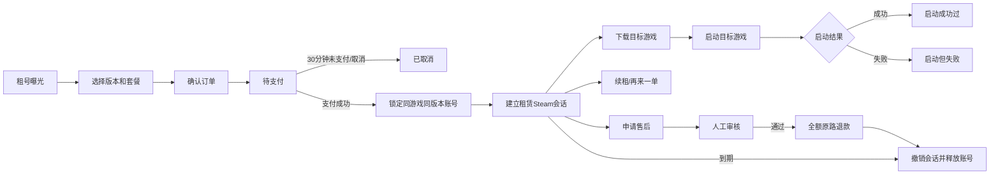

# 【Prd】《盖世游戏 Mac》游戏租号需求

## 一、版本信息

| 时间 | 版本 | 变更人 | 主要变更内容 | 备注 |
|---|---|---|---|---|
| 2025.01.05 | V1.0 | 卢浩 | 创建游戏租号原始需求 | 历史需求文件随交付目录提供 |
| 2026.07.14 | V2.0 | 郑群超 | 根据最新可操作 Demo 重构 C 端、B 端、订单售后、退款权益和统计需求 | 评审稿 |
| 2026.07.14 | V2.1 | 郑群超 | 补充埋点参数、运营准备、责任方、上线门槛及文档附录 | 评审稿 |
| 2026.07.15 | V2.2 | 郑群超 | 将退款权益调整为3天无理由，增加高频退款风控、设备环境和订单游戏时长 | 评审稿 |
| 2026.07.17 | V2.3 | 郑群超 | 补齐临期提醒、续租、到期强退、过期安装包启动拦截、价格展示、独立操作记录页及统计页调整 | 评审稿 |

> 交互基准：[Mac 端租号功能标注版 Demo](https://z36358631-ship-it.github.io/-/Mac%E7%AB%AFdemo/mac%E7%AB%AF%E7%A7%9F%E5%8F%B7%E5%8A%9F%E8%83%BD/Mac%E7%AB%AF%E7%A7%9F%E5%8F%B7%E5%8A%9F%E8%83%BD-%E6%A0%87%E6%B3%A8%E7%89%88.html)，线上提交 `2bf55ea4745247f029ae7d322360ce4623a85da6`。
> 开发附录随交付目录提供：`功能拆分版/01-功能索引.md`、`功能拆分版/02-客户端导航.md`、`功能拆分版/03-服务端导航.md`。

---

## 二、背景与目标

### 2.1 需求背景

盖世游戏需要在 Mac 客户端内建立 Steam 游戏租号能力。用户无需购买完整游戏本体，即可按时、按日或按周获得指定游戏的限时使用权；平台通过第三方账号资源完成取号、登录、下载、启动和到期回收。

当前方案需要解决四类问题：

1. **用户体验门槛**：高价单机游戏对尝鲜用户成本较高，且传统租号存在找商品、取账号、输入凭据和处理验证码等复杂步骤。
2. **交易闭环缺失**：租号需要独立处理套餐计价、待支付倒计时、资源锁定、续租、取消、退款和订单状态。
3. **履约与安全风险**：租赁账号必须限制在订单目标游戏内使用，不能向用户暴露 Steam 明文账号密码，并需在到期、退款或换号后回收授权。
4. **运营管理缺失**：运营需要统一管理商品、套餐、账号库存、订单售后和效果数据，并能追踪每笔订单是否成功启动游戏、关键后台操作由谁执行及执行结果。

竞品普遍采用 2 小时起租、日租和周租组合，通过一键上号降低使用门槛。盖世游戏本期采用相同的主流套餐结构，并通过 Mac 客户端内的游戏发现、游戏库、订单中心和3天无理由退款形成闭环。

### 2.2 产品目标

1. 用户可在盖世游戏内完成“发现可租游戏 → 选择套餐 → 支付 → 下载/启动 → 订单管理 → 售后”的完整流程。
2. 支付成功后由系统锁定同游戏、同版本的可租 Steam 账号，用户不接触明文凭据。
3. 租赁会话只允许操作订单目标游戏，非目标游戏的获取、下载和启动均被拦截并引导单独租用。
4. 运营可配置商品、版本、价格、活动和库存，客服可结合用户描述与启动结果处理售后。
5. 通过订单量、金额、库存使用率、账号复用率、用户复租率和游戏启动成功率评估业务效果。

### 2.3 核心挑战

1. Steam 登录授权、AppID 识别、非目标游戏拦截及到期 token 清理的技术稳定性。
2. 支付成功与账号资源锁定之间的一致性，以及资源不足时的自动退款。
3. 多套餐定价的单位价格递减、首单优惠资格和价格版本控制。
4. 游戏时长准确累计、售后证据留存和3天无理由退款资格的准确判定。
5. 第三方账号资源同步、健康检测、并发占用、换号与释放的准确性。

### 2.4 本期范围

- Steam 游戏租号曝光、筛选、搜索和选购。
- 时租、日租、周租套餐；永久套餐仅预埋配置，默认不展示。
- 首单 5 折、确认订单、支付宝/微信支付和 30 分钟待支付。
- Steam 一键上号、目标游戏下载/启动和非目标游戏拦截。
- 游戏库、租赁 Steam 账号状态和安装状态管理。
- 租号中心、订单详情、续租、再来一单、取消、删除和售后退款。
- 基于服务端 `expire_at` 的 15 分钟、5 分钟临期提醒，原订单续租、到期 T0 强退、会话撤销、账号释放和过期安装包启动拦截。
- 支付后72小时、目标游戏累计时长30分钟内的3天无理由退款，以及履约问题售后。
- 高频退款用户识别、购买前风险确认和后台滚动周期/退款笔数配置。
- B 端商品、账号库存、订单售后、效果统计、权限和独立操作记录页。

### 2.5 本期不包含

- 用户自主出租账号的双边交易平台。
- Epic Games、GOG 的实际租号履约，仅保留平台登录占位。
- 永久套餐前台正式售卖。
- 租号会员、全平台游戏畅玩会员和用户侧出租收益体系。
- 在客户端、B 端、日志、埋点或导出中展示 Steam 明文凭据。
- Demo 中“模拟支付完成”等演示控制项。

---

## 三、故事介绍

### 3.1 用户与运营场景

**场景一：新用户低成本体验游戏**

小明在探索内容中看到《黑神话：悟空》显示“¥3 租号”和“386 在租”。他进入游戏信息后点击“租号开玩”，选择标准版和 2 小时时租。确认订单展示游戏原价、首单 5 折、租号金额和3天无理由退款权益。小明使用支付宝完成支付后返回游戏信息，原“获取游戏”动作变为“下载 783M”。游戏下载完成后，他点击“启动游戏”，系统通过租赁 Steam 会话进入目标游戏并记录“启动成功过”和订单游戏时长。

**场景二：租赁账号尝试操作非目标游戏**

小明租用了《黑神话：悟空》，随后在游戏库中点击另一款游戏。即使当前租赁 Steam 账号拥有该游戏，客户端仍阻止获取、下载或启动，并提示“当前游戏未租用，是否进行租用”。小明选择“去租号”后进入该游戏的确认订单，原租赁订单不受影响。

**场景三：用户申请售后**

用户支付后多次尝试启动，但 Steam 登录失败。订单启动结果变为“启动但失败”。用户在订单详情点击“申请售后”，选择“Steam 登录失败”，填写“反复提示登录超时，重试三次仍无法进入”并提交。退款详情显示申请中、人工审核、原路退款和完成四个阶段。审核通过后，租号费用全额原路退回，租赁会话失效，账号资源被释放。

**场景四：运营配置商品与库存**

商品运营新建租号商品，绑定 Steam 游戏，配置标准版、豪华版的时租、日租和周租价格，并开启首单 5 折。资源运营同步第三方账号，完成健康检测后将账号加入可租池。商品发布前，系统校验长套餐单位价格不得高于短套餐，并确认至少存在一个可租账号。

**场景五：客服处理售后**

客服进入“售后申请处理”，查看用户选择的问题类型、原始问题描述、订单启动结果和账号检测结果。客服确认该订单从未成功启动且存在登录失败记录后，批准全额原路退款。系统撤销租赁会话并释放账号；如果释放失败，订单仍保持已退款，账号转入异常库存等待人工处理。

### 3.2 价值分析

- **用户价值**：用更低成本体验目标游戏，减少账号、密码和验证码操作，遇到无法启动时有明确售后保障。
- **平台价值**：新增租号交易收入，提升高价游戏的体验转化，并通过游戏库和订单中心增加用户回访。
- **运营价值**：商品、库存、订单、售后和统计在同一套业务体系中管理，降低跨平台处理成本。
- **资源价值**：通过库存使用率和账号复用率提高第三方账号资源的利用效率。
- **服务价值**：以启动结果和行为记录辅助售后判断，减少仅依赖用户口述产生的争议。

### 3.3 核心体验路径

**租号主链路：** 发现可租游戏 → 查看游戏信息 → 选择版本和套餐 → 确认订单 → 30 分钟内支付 → 锁定账号 → 建立租赁 Steam 会话 → 下载/启动目标游戏 → 到期完成或申请售后。

**订单管理链路：** 租号中心 → 查看订单状态 → 继续支付/一键上号/续租/再来一单/申请售后 → 查看订单或退款进度。

**临期与到期链路：** 以服务端 `expire_at` 为唯一时钟 → 到期前 15 分钟、5 分钟各提醒一次 → 用户续租则延长原订单 → 未续租则在 T0 结束游戏、撤销会话并释放账号 → 本地安装包再次启动时校验并引导重新租用。

**后台履约链路：** 配置商品与套餐 → 同步并检测账号 → 商品上架 → 支付后锁定资源 → 监控启动结果 → 处理售后 → 退款并释放资源 → 查看效果统计与只读操作记录。

### 3.4 产品指标

上线后按以下指标建立基线并持续观察：

1. 租号曝光到详情点击率。
2. 详情点击到提交订单转化率。
3. 提交订单到支付成功率。
4. 支付成功到一键上号成功率。
5. 游戏启动成功率。
6. 账号使用率、账号复用率和用户复租率。
7. 售后率、退款率、平均审核时长和平均退款时长。

### 3.5 路径规划

- **V2.0（本期）**：跑通按游戏租赁、支付、资源锁定、一键上号、目标游戏限制、订单售后、3天无理由退款和 B 端管理闭环。
- **后续扩展**：根据业务数据评估永久套餐、租号会员、更多游戏平台和用户自主出租能力，不在本期提前上线。

---

## 四、概要设计

### 4.1 模块设计

| 端别 | 业务模块 | 功能说明 | 优先级 |
|---|---|---|---|
| C 端 | 租号发现与曝光 | 在探索、找游戏、搜索等入口展示可租状态、最低金额和在租数 | P0 |
| C 端 | 套餐选择与计价 | 选择游戏版本、时租/日租/周租和时租时长 | P0 |
| C 端 | 确认订单与支付 | 展示优惠、退款权益、订单金额并完成支付；命中退款风控时先二次确认 | P0 |
| C 端 | Steam 会话与游戏权益判断 | 根据个人/租赁会话、是否拥有游戏和是否订单目标决定操作 | P0 |
| C 端 | 下载、启动与目标游戏限制 | 下载或启动目标游戏，拦截非目标游戏 | P0 |
| C 端 | 游戏库与平台账号状态 | 管理已安装/未安装游戏和 Steam 会话展示 | P0 |
| C 端 | 用户订单管理 | 查看订单、继续支付、续租、再来一单、取消和删除 | P0 |
| C 端 | 临期提醒与到期处理 | 15/5 分钟提醒、原订单续租、T0 强退、过期安装包拦截和重新租用 | P0 |
| C 端 | 售后退款 | 提交售后问题并查看退款进度 | P0 |
| C 端 | 3天无理由退款 | 展示72小时、目标游戏累计30分钟和高频退款限制规则 | P0 |
| B 端 | 租号商品与套餐管理 | 管理游戏、版本、价格、活动、曝光和上下架 | P0 |
| B 端 | Steam 账号资源与库存管理 | 管理账号同步、健康、占用、释放、换号和上下架 | P0 |
| B 端 | 订单履约管理 | 查询订单、查看启动结果、设备环境、订单游戏时长、换号、补偿和结束订单 | P0 |
| B 端 | 售后与退款处理 | 审核用户问题，执行退款和资源回收 | P0 |
| B 端 | 租号效果统计 | 展示订单、金额、库存、复用、复租和启动数据 | P1 |
| B 端 | 权限与操作审计 | 控制高风险操作，并在独立操作记录页查询不可改删的完整记录 | P0 |
| B 端 | 退款风控设置 | 配置滚动统计天数和无理由退款笔数阈值，保存规则版本 | P0 |

**全局业务流程：**

### 4.2 详细设计（C端）

> 本节按用户侧业务功能拆分。探索、找游戏、搜索、游戏信息、游戏库和订单中心仅作为功能入口，不作为拆分边界。

#### 4.2.1 租号发现与曝光

**功能截图（完整界面）：**

*图 4.2.1-1：探索内容中的租号金额、在租热度和编辑推荐。*

*图 4.2.1-2：找游戏中的排序、可租号筛选和游戏列表。*

*图 4.2.1-3：搜索结果中的租号金额和在租人数。*

| 功能项 | 展示与交互说明 |
|---|---|
| 触发范围 | 已上架且存在有效套餐、可租账号的游戏，可在探索内容、编辑推荐、找游戏列表和搜索结果中展示租号信息 |
| 租号信息 | 展示“¥X 租号”，金额取当前可售版本的最低首档金额；不得展示“/2小时起” |
| 在租热度 | 租号金额后展示灰色“XX 在租”；有效租赁订单数超过 999 时显示“999+ 在租” |
| 不可租游戏 | 保留普通游戏内容，不展示租号金额、在租数或“暂未开放租号”等说明 |
| 内容入口 | 探索头图动作使用“每日推荐”；内容区标题为“编辑推荐”；探索首屏不展示返回按钮 |
| 筛选排序 | 找游戏支持按名称、发布时间、评分双向排序，并支持“可租号”筛选 |
| 搜索 | 搜索框提示为“搜索游戏名称或类型”；租号摘要失败时保留基础搜索结果并隐藏租号扩展信息 |
| 点击行为 | 点击游戏卡片或搜索结果进入对应游戏信息，不设置独立固定“查看详情”按钮；进入后按下表实时判断 Steam 会话、游戏权益、订单目标和安装状态 |

**游戏详情入口状态矩阵：**

| 当前 Steam 会话 | 当前游戏状态 | 游戏操作展示 | 租号入口展示 | 点击后的交互结果 |
|---|---|---|---|---|
| 租赁 Steam 账号 | 当前游戏是有效订单目标，租赁账号已拥有，未下载 | “秒玩” + “下载 XXM” | 隐藏“租号开玩” | 点击“下载 XXM”直接创建下载任务，不再询问租号；下载完成后刷新为“启动游戏” |
| 租赁 Steam 账号 | 当前游戏是有效订单目标，租赁账号已拥有，已下载 | “秒玩” + “启动游戏” | 隐藏“租号开玩” | 点击“启动游戏”校验订单、账号和 AppID 后直接启动，并记录启动结果 |
| 租赁 Steam 账号 | 当前游戏不是订单目标，但租赁账号已拥有 | “秒玩” + “下载 XXM”或“启动游戏” | 隐藏“租号开玩” | 点击下载或启动时拦截，弹出“当前游戏未租用，是否进行租用”；“去租号”进入当前游戏确认订单 |
| 租赁 Steam 账号 | 当前游戏不是订单目标，租赁账号未拥有 | “秒玩” + “获取游戏” | 展示“租号开玩” | 点击“获取游戏”不进入 Steam 商店，弹出“当前游戏未租用，是否进行租用”；点击“租号开玩”直接进入当前游戏确认订单 |
| 个人 Steam 账号 | 个人账号已拥有当前游戏，未下载 | “秒玩” + “下载 XXM” | 隐藏“租号开玩” | 点击下载直接创建个人 Steam 游戏下载任务 |
| 个人 Steam 账号 | 个人账号已拥有当前游戏，已下载 | “秒玩” + “启动游戏” | 隐藏“租号开玩” | 点击启动直接使用个人 Steam 会话启动游戏 |
| 个人 Steam 账号 | 个人账号未拥有当前游戏 | “秒玩” + “获取游戏” | 展示“租号开玩” | 点击“获取游戏”直接打开 Steam 商品信息，不弹租号弹窗；点击“租号开玩”进入当前游戏确认订单 |

> 判定顺序：先判断当前是否为租赁 Steam 会话，再判断当前游戏是否为有效订单目标和账号是否拥有，最后判断本地是否已下载。按钮点击时必须重新校验，不能只使用进入页面时的缓存结果。租赁目标游戏出现账号无权益属于履约异常，不得引导用户重复下单，应进入换号或售后处理。

**拦截弹窗游戏卡片：** “当前游戏未租用”、过期本地包启动拦截和 T0 到期退出结果三类弹窗均展示当前游戏封面、游戏名及红色 `¥X 租号`；不展示 `Steam · 启动游戏/下载/获取游戏`、版本或订单状态等第二行副文案。`¥X` 为当前可售版本中的最低小时套餐参考价，最终应付金额以确认订单页实时计算为准。

**业务规则：**

1. “在租”表示当前有效租赁中的订单数，不等同于账号库存数。
2. 待支付、已取消、已完成和已退款订单不计入在租数。
3. 列表租价可短时缓存，但进入选购和提交订单时必须重新校验价格和库存。

#### 4.2.2 套餐选择与计价

**功能截图（完整界面）：**

套餐选择、小时步进、快捷时长和金额联动见图 4.2.3-1；套餐与确认订单共用同一完整界面，不重复引用截图。

| 功能项 | 展示与交互说明 |
|---|---|
| 游戏版本 | 展示后台配置的标准版、增强版、豪华版等版本；默认选中第一个可售版本 |
| 时租 | 范围 2-24 小时，默认 2 小时；支持手动输入、加减和 6/12 小时快捷值 |
| 日租 | 固定 1 天，不提供天数输入 |
| 周租 | 固定 7 天，不提供周数输入 |
| 永久套餐 | 仅保留配置能力，默认关闭；开启后按 10 年折算日均价，但不代表单次无限占用 |
| 单价展示 | 时租展示“¥X/小时起”；日租、周租展示“¥X/天”，均保留 1 位小数 |
| 价格递减 | 租期越长单位价格越低；周租日均价不得高于日租日均价，日租小时折算价不得高于短时租平均价 |
| 24 小时处理 | 时租输入 24 小时时自动采用更优惠的日租价格，并向用户展示按日租计价 |
| 价格联动 | 切换版本、套餐或小时数后立即刷新单位价格、标准租号价、优惠和订单金额 |
| 游戏原价 | 右侧价格区在“订单金额”上方展示“游戏原价 ¥198”；“游戏原价”与“订单金额”标题均为白色，`¥198` 使用普通灰色、不划线并与实付价按右边缘对齐。左侧游戏卡片只保留封面和游戏名。游戏原价不参与租号计费，也不得作为订单金额的划线价 |

**异常处理：**

- 小时数只接受 2-24 的整数，越界时修正并提示。
- 版本或套餐不可售时禁用该组合，不沿用上一组合价格。
- 提交时价格版本已变化，展示新价格并要求用户再次确认。
- 提交时无库存，阻止支付并提示稍后重试，不展示“暂无库存”占位文案干扰日常浏览。

#### 4.2.3 确认订单与支付

**功能截图（完整界面）：**

*图 4.2.3-1：确认订单右侧价格区的“游戏原价”和“订单金额”使用白色标题，灰色游戏原价金额与红色实付价按右边缘上下对齐；首单 5 折使用绿色底白字标签，实付价右侧只展示灰色划线金额，不展示“标准租价”或计价说明副文案。右下角“模拟支付完成”为 Demo 验证入口，不进入正式产品。*

*图 4.2.3-2：命中后台退款风控后，付款前提示本单不享受3天无理由退款；履约售后继续保留。*

| 功能项 | 展示与交互说明 |
|---|---|
| 标题与商品 | 标题为“确认订单”；展示游戏封面、游戏名称、版本、套餐和租期 |
| 活动 | 符合资格时在“订单金额”文字旁展示绿色底、白色文字的“首单 5 折”标签，不在游戏封面或游戏原价附近展示；标准租号价、优惠金额和应付金额分开计算 |
| 权益文案 | 依次展示“100% 正版/家庭共享 官方正版”“一键启动/开始游戏 仅需一键”“永不顶号/游戏期间独占不限制”“存档无忧/自动同步个人存档”“3天无理由/游戏时长30分钟内，3天内无理由退款” |
| 订单金额 | 首单的红色放大实付价在左，标准租价在其右侧只显示灰色删除线金额 `¥3.4`，不展示“标准租价”文案；价格区不展示“2小时 · 已按当前最优单价计算”等副文案。游戏原价不进入该折扣层级。非首单、续租和重新租用均不展示首单标签或划线租价，只展示红色正常应付金额 |
| 支付方式 | 支持支付宝、微信支付，用户选择后提交订单并拉起对应渠道 |
| 高频退款确认 | 用户在后台配置的滚动周期内完成无理由退款笔数达到阈值时，支付前先提示“近期退款数量较多，再次购买将无法享受3天无理由退款，请确认后购买” |
| 风控弹窗操作 | “暂不购买”关闭弹窗并停留当前页；“确认并继续”进入原购买确认，本单保存不享受无理由退款的资格快照，但保留履约售后 |
| 待支付时限 | 订单创建后保留 30 分钟；倒计时使用服务端时间，回到前台后重新校准 |
| 支付反馈 | 支付状态明确成功后才进入资源锁定；支付状态不确定时查询原订单，不重复创建 |
| 支付后动作 | 账号锁定成功后返回对应游戏信息；目标游戏未下载时展示“下载 XXM”，已下载时展示“启动游戏” |
| Demo 控件 | “模拟支付完成”仅用于 Demo 验证，不进入正式产品 |

**计价与交易规则：**

1. 最终金额必须由服务端返回，客户端不得根据展示价自行计算。
2. 创单保存游戏原价、标准租号价、优惠金额、应付金额、价格版本、无理由退款资格、风控规则版本、滚动周期、阈值、近期退款笔数和用户确认时间。
3. 相同提交幂等键重复请求返回同一订单；支付回调重复触发只入账一次。
4. 30 分钟未支付或用户主动取消后，订单变为已取消，原支付凭证失效。
5. 支付成功但无法锁定账号时自动重试；仍无法履约则全额原路退款并提示用户。
6. 首单优惠仅用于新租订单；续租延长原订单、到期后的重新租用以及普通非首单均按标准租赁价结算。

#### 4.2.4 Steam 会话与游戏权益判断

**功能截图（完整界面）：**

*图 4.2.4：根据 Steam 会话、游戏拥有状态和租赁目标展示获取、下载、启动或租号动作。*

| 当前会话 | 游戏权益 | 是否订单目标 | 主动作 | 租号动作 |
|---|---|---|---|---|
| 租赁 Steam 账号 | 已拥有 | 是 | 未下载显示“下载 XXM”，已下载显示“启动游戏” | 隐藏 |
| 租赁 Steam 账号 | 已拥有 | 否 | 点击下载/启动时拦截 | 由拦截弹窗进入租号 |
| 租赁 Steam 账号 | 未拥有 | 否 | 点击获取游戏时拦截 | 展示“租号开玩”；获取拦截弹窗也可进入租号 |
| 个人 Steam 账号 | 已拥有 | 不适用 | 未下载显示下载，已下载显示启动 | 隐藏 |
| 个人 Steam 账号 | 未拥有 | 不适用 | 显示“获取游戏”，点击进入 Steam 商品信息 | 同时显示“租号开玩” |

**交互规则：**

1. “秒玩”作为已有能力保留，不参与 Steam 游戏权益判断。
2. 操作按钮保持同一行，顺序为“秒玩、获取/下载/启动、租号开玩”。
3. 租赁会话的用户不得查看账号密码、邮箱、验证码、授权 token 或完整供应方标识。
4. 订单到期、退款、换号或强制结束后，旧租赁会话立即失效并清理本地 token，不影响个人 Steam 账号。
5. 游戏信息只保留开发商、发行日期和支持平台；评分仅以数字展示在“玩家评价”右侧，不单独显示“评分 XX”。

#### 4.2.5 一键上号、下载启动与非目标游戏限制

**功能截图（完整界面）：**

*图 4.2.5-1：租赁账号对非目标游戏执行获取、下载或启动时的租用询问。*

| 功能项 | 展示与交互说明 |
|---|---|
| 一键上号 | 用户支付成功或在有效订单中点击“一键上号”后，系统校验订单、设备、账号和有效期，并建立租赁 Steam 会话 |
| 下载 | 目标游戏未安装时显示资源大小，如“下载 783M”；下载行为不改变订单启动结果 |
| 启动 | 下载完成后显示“启动游戏”；确认目标游戏进程进入并达到最小存活条件后，记录启动成功 |
| 非目标拦截 | 租赁账号对非订单目标游戏执行获取、下载或启动时全部拦截，与该账号是否拥有游戏无关 |
| 拦截弹窗 | 标题为“当前游戏未租用”，询问“是否进行租用”；操作为“暂不租用”和“去租号” |
| 去租号 | 进入当前游戏确认订单，默认选中时租 2 小时；原租赁订单和原租赁时长保持不变 |
| 防重复 | 上号、下载和启动处理中禁用重复触发；失败后按原会话或订单状态重试 |

**本地游戏启动决策表：**

| 判定场景 | 决策优先级 | 处理结果 |
|---|---:|---|
| 当前为个人 Steam 账号且个人账号拥有目标游戏 | 1 | 按个人游戏正常启动，不触发租号校验或过期拦截 |
| 存在游戏、版本匹配且 `expire_at > server_time` 的有效租赁 | 2 | 建立或复用有效租赁会话并启动目标游戏 |
| 租赁已过期且本地仍有安装包 | 3 | 拦截启动，提示“该游戏租期已结束，重新租用后可继续游戏”；弹窗展示游戏封面、游戏名和当前最低时租价，操作为“取消、重新租用” |
| 无网络或服务端状态校验失败 | 4 | 不放行租赁游戏，提示“租赁状态验证失败，请检查网络后重试” |

判定必须先识别个人拥有权益，避免历史租赁订单误伤个人游戏；租赁有效性只认服务端 `expire_at`。重新租用成功后，同游戏同版本且本地包可用时复用安装包并直接上号启动，版本不一致时才更新或下载。租期结束不删除本地安装包、游戏设置或个人存档。

*图 4.2.5-2：租赁已过期且本地包仍存在时阻断启动，展示统一游戏卡片并提供取消和重新租用。*

**启动结果：**

| 状态 | 判定规则 |
|---|---|
| 未启动 | 订单未产生目标游戏启动尝试；仅下载完成仍属于未启动 |
| 启动但失败 | 已发生启动尝试，但从未成功进入目标游戏 |
| 启动成功过 | 订单生命周期内至少成功启动一次；后续启动失败不回退 |

#### 4.2.6 游戏库与平台账号状态

**功能截图（完整界面）：**

*图 4.2.6：已安装/未安装游戏分组、筛选搜索和 Steam 租赁账号信息。*

| 功能项 | 展示与交互说明 |
|---|---|
| 导航位置 | 侧边栏顺序为探索、云游戏、数据、找游戏、游戏库、订单中心 |
| 游戏卡片 | 使用 16:9 横图，只显示游戏名称，不显示安装状态副标题或其他说明 |
| 安装分组 | 按已安装、未安装分组展示，组标题显示对应数量 |
| 筛选搜索 | 支持全部/已安装/未安装筛选、名称或评分排序，以及游戏名称或类型搜索 |
| 游戏操作 | 点击整张游戏卡片进入对应游戏信息，再根据会话和权益决定获取、下载、启动或租号 |
| Steam 状态 | Steam 平台信息固定在右侧并展示在线状态；租赁账号头像显示带边框“租”，昵称为“盖世租号账号” |
| 账号信息 | 租赁账号可展示账号年限、游戏数量和游戏时长，不展示好友列表 |
| 个人账号 | 个人 Steam 会话显示“个人 Steam 账号”，切换会话后立即刷新展示和操作权限 |
| 其他平台 | Epic Games 和 GOG 仅展示登录入口，本期不提供租号履约 |
| 添加与同步 | 添加游戏前弹窗说明将扫描当前 Steam 游戏库；同步成功轻提示，失败保留上次结果并支持重试 |

#### 4.2.7 用户订单管理

**功能截图（完整界面）：**

*图 4.2.7-1：订单中心的状态筛选、卡片信息和状态对应操作。*

*图 4.2.7-2：订单详情顶部状态、操作、订单号和横向订单进度。*

| 功能项 | 展示与交互说明 |
|---|---|
| 订单入口 | 侧边栏提供订单中心入口；租号中心只保留“全部、租赁中、待支付”三个 Tab |
| 卡片跳转 | 点击整张订单卡片进入订单详情，不设置固定“查看详情”按钮；卡片内操作按钮不触发卡片跳转 |
| 卡片信息 | 展示游戏、版本、有效期和订单状态；租赁中展示灰色剩余时长；待支付在有效期下展示“请在 XX:XX 分钟内支付” |
| 状态与金额 | 订单状态固定在卡片右上角，订单金额显示在状态下方 |
| 操作顺序 | 操作按钮靠右排列，一键上号放在最右侧；上号、再来一单和删除不使用图标 |
| 订单详情 | 顶部首先展示订单状态和可执行操作；展示订单号并提供复制按钮；点击游戏封面区域进入对应游戏信息 |
| 订单进度 | 横向展示订单创建 → 订单支付 → 订单到期 → 完成；不展示“履约记录”或“履约与上号”Tab |
| 续租 | 仅有效租赁订单可续租；续租前重新校验价格、账号健康和资源冲突 |
| 再来一单 | 回传上一次游戏、版本和套餐作为预填值，创建全新订单；按钮文案为“再来一单” |
| 取消订单 | 仅待支付订单可取消；弹窗展示游戏信息并二次确认 |
| 删除订单 | 仅终态订单支持用户侧删除；采用软删除，不删除交易、退款和审计记录 |

**租期时钟与临期提醒：**

1. 服务端 `expire_at` 是订单有效性的唯一时钟；客户端只使用响应中的 `server_time` 与 `expire_at` 计算剩余时长，本机时间、休眠和前后台切换不得延长租期。
2. 当前有效租赁订单首次进入剩余 15 分钟、5 分钟阈值时，在屏幕顶部居中各展示一次提醒；游戏内和游戏外使用同一规则，不暂停游戏，不设置 1 分钟档位。
3. 客户端从休眠或最小化恢复时重新拉取 `server_time`。若同时错过两个阈值且订单仍有效，只补发与当前剩余时间最接近的一档，不连续补发历史提醒。
4. 提醒支持“知道了/暂不续租”和“立即续租”；关闭不改变订单状态，立即续租进入原订单续租页。

*图 4.2.7-3：有效订单首次进入剩余 15 分钟档位时，在顶部居中提醒一次。*

*图 4.2.7-4：有效订单首次进入剩余 5 分钟档位时再次提醒，并明确到期即结束游戏；不设置 1 分钟提醒。*

**续租与重新租用：**

1. 有效订单续租生成独立续租支付单，但支付成功后只更新原服务订单；新 `expire_at = 原 expire_at + 所选续租时长`，不从点击或支付时间起算，原账号、游戏、版本和当前会话保持不变。
2. 续租提交时原子校验原账号 `available_until` 及后续预约。部分冲突只返回最大可续时长；完全冲突禁止支付，原订单仍按原 `expire_at` 结束，第一期不在游戏中途自动换号。
3. 到期前续租仍未支付成功时，续租单关闭。关闭后收到迟到支付回调，不得延长订单或重新占用账号，按幂等规则原路退款并记录异常。
4. 已完成订单点击“续租”或过期拦截中的“重新租用”均创建新服务订单并重新分配账号；同游戏同版本的本地安装包可复用并直接启动。

*图 4.2.7-5：续租展示原到期时间、所选时长、顺延后的新到期时间和账号最大可用时间，按标准租赁价结算。*

**到期 T0 处理：**

到达 `expire_at` 且续租未成功时，服务端立即将订单置为已完成并撤销租赁权限；客户端结束目标游戏、清理租赁 Steam 会话和本地租赁凭证，服务端释放账号。任一步骤失败需重试、告警并在后台展示具体结果，不得延后订单终止。游戏安装包、本地设置和个人存档继续保留。到期退出结果弹窗展示对应游戏的封面、游戏名和当前最低时租价，不展示平台、操作、版本或订单状态副文案。

*图 4.2.7-6：到达 `expire_at` 后立即结束目标游戏，结果弹窗展示统一游戏卡片，用户可重新租用或返回首页。*

**订单状态与主要操作：**

| 订单状态 | 主要操作 |
|---|---|
| 待支付 | 继续支付、取消订单 |
| 租赁中 | 续租、申请售后、一键上号 |
| 已完成 | 再来一单、删除订单 |
| 已取消 | 删除订单 |
| 售后处理中/退款中 | 查看退款详情 |
| 已退款 | 查看退款进度、再来一单、删除订单 |

#### 4.2.8 售后申请与退款进度

**功能截图（完整界面）：**

*图 4.2.8-1：售后问题类型、游戏摘要和问题描述输入。*

*图 4.2.8-2：申请中状态下的退款详情和横向处理进度。*

| 功能项 | 展示与交互说明 |
|---|---|
| 申请入口 | 订单详情中的按钮文案为“申请售后”；仅在服务端返回允许申请时展示 |
| 申请形式 | 使用弹窗；弹窗展示游戏封面、版本、金额和订单期间目标游戏累计时长 |
| 问题类型 | 平铺展示“3天无理由、启动失败、Steam 登录失败、账号异常/频繁掉线、其他问题”，字号与普通表单标签一致 |
| 无理由资格 | 仅支付成功后72小时内、目标游戏累计成功运行时长不超过30分钟且下单时未被风控取消资格时可选 |
| 不可用原因 | 超时显示“已超过支付后3天”；超时长显示“游戏时长已超过30分钟”；命中风控显示“本单购买时已取消无理由退款权益” |
| 履约售后 | 无理由退款不可用时，启动失败、登录失败、账号异常和其他问题仍可选择并提交 |
| 问题描述 | 必填，占位文案为“请输入你遇到的问题”；空描述不能提交 |
| 提交结果 | 提交成功后进入退款详情，初始状态为“申请中” |
| 退款详情 | 沿用订单详情的视觉结构，顶部展示状态和对应操作 |
| 退款进度 | 横向展示申请中 → 人工审核 → 原路退款 → 完成 |
| 处理时效 | 申请中展示“预计 7 个工作日内处理”，不展示“预计 30 分钟” |
| 访问限制 | 未创建售后单的订单不能进入退款详情，应返回普通订单详情 |

**提交规则：**

1. 售后单保存问题类型、用户原始描述、订单、账号、启动结果、累计游戏时长、无理由资格结果、规则版本和诊断摘要。
2. 重复提交使用同一幂等键时返回原售后单，不创建多笔申请。
3. 退款金额和账号资源释放结果分别记录，避免资源异常覆盖用户退款结果。

#### 4.2.9 3天无理由退款

**功能截图（完整界面）：**

*图 4.2.9：3天无理由退款的72小时、累计游戏时长30分钟和履约售后规则。*

| 功能项 | 展示与交互说明 |
|---|---|
| 权益名称 | 3天无理由 |
| 副标题 | 游戏时长30分钟内，3天内无理由退款 |
| 入口形式 | 确认订单权益区展示名称、副标题和向右箭头；点击箭头查看规则说明 |
| 时间范围 | 自订单支付成功时间起72小时内可申请；超过72小时不再享受无理由退款 |
| 游戏时长 | 仅统计订单目标游戏累计成功运行时长；不超过30分钟可申请，下载、登录失败和启动失败不计入 |
| 高频退款限制 | 下单时命中后台滚动周期/退款笔数阈值并确认继续购买后，本单不享受无理由退款 |
| 退款结果 | 审核通过后退还订单可退租号费用，并按原支付渠道原路退回 |
| 售后衔接 | 无理由权益不可用不影响Steam登录失败、游戏启动失败和账号异常等履约售后 |

**资格规则：**

1. 同时满足支付后不超过72小时、目标游戏累计运行时长不超过30分钟和订单资格快照可用，才能选择“3天无理由”。
2. 后台规则变更只影响后续新订单，不回溯修改历史订单资格。
3. 同一订单的游戏时长按会话和时间段去重，切换设备不清零。
4. 无理由退款完成后才计入用户滚动周期退款笔数；履约问题退款、拒绝或失败不计入。

### 4.3 详细设计（B端）

> 本节按运营侧业务能力拆分。列表、抽屉和弹窗是功能的交互承载方式，不作为独立功能边界。

#### 4.3.1 租号商品与套餐管理

**功能截图（完整界面）：**

*图 4.3.1：商品摘要、筛选、批量处理、版本套餐价格和快捷操作。*

| 功能项 | 展示与交互说明 |
|---|---|
| 业务摘要 | 展示在线商品、已下架商品、版本配置数、可租库存和已占用库存 |
| 商品查询 | 支持按平台、状态、商品名称和游戏名称筛选；列表展示曝光位、最低价格、总库存、已占用、状态和快捷操作 |
| 新建商品 | 点击“新建商品”打开表单，绑定盖世游戏与 Steam 平台，填写版本、套餐和活动；确认提交后才新增，初始状态为下架 |
| 版本管理 | 一个商品可配置多个版本；每个版本包含时租、日租和周租，支持新增、编辑和复制版本 |
| 套餐管理 | 时租最小 2 小时、最大 24 小时；日租固定 1 天；周租固定 7 天；永久套餐为隐藏开关，默认关闭 |
| 价格校验 | 金额必须大于 0；发布前校验套餐完整性及长租单位价格递减；不满足时禁止发布 |
| 活动与退款权益 | 支持首单 5 折开关、适用商品/版本、活动时间和3天无理由退款标记 |
| 复制商品 | 副本生成新商品 ID，保留来源关联并默认下架；不复制库存、账号绑定、订单和统计数据 |
| 批量处理 | 支持批量改价、上架、下架；操作前展示影响范围并二次确认，完成后逐项展示成功或失败原因 |
| 库存同步 | 支持手动触发同步并展示最后成功时间、最新库存水位和失败原因 |
| 上下架 | 下架只阻止新曝光和新订单，不终止已支付订单；永久开关开启时必须单独二次确认 |

**服务端规则：**

1. 商品数据包含游戏、平台、版本、套餐、永久配置、曝光位、活动和退款权益配置。
2. 价格以整数分保存，并返回格式化金额、单位价格和价格版本。
3. 发布商品或改价后发送变更事件，使租号曝光和选购缓存失效。
4. 批量操作使用唯一 `batchId`，每项独立幂等；部分失败不回滚已成功项目。
5. 所有写操作记录操作人、原因、前后值、结果和请求 ID。

#### 4.3.2 Steam 账号资源与库存管理

**功能截图（完整界面）：**

*图 4.3.2：库存摘要、账号状态、占用订单、健康检测和上下架操作。*

| 功能项 | 展示与交互说明 |
|---|---|
| 库存摘要 | 展示现有库存、可租、已占用、异常和已下架数量 |
| 资源查询 | 支持按状态、游戏、版本、脱敏账号标识和供应方 ID 筛选 |
| 列表字段 | 展示脱敏账号标识、供应方 ID、游戏/版本、状态、占用订单、累计租次和最近检测时间 |
| 新建库存 | 打开表单填写游戏、版本、第三方资源 ID 和脱敏标识；表单确认后才新增，重复资源 ID 被拦截 |
| 第三方同步 | 拉取第三方账号资源并更新本地映射；展示同步进度、成功数量、失败数量和逐项原因 |
| 健康检测 | 支持单个检测和批量检测；检测失败的空闲账号立即移出可租池，占用账号同步标记售后风险 |
| 账号占用 | 支付后只允许将可租账号锁定给一个有效订单；列表展示关联订单 |
| 账号释放 | 订单到期、退款或结束后释放账号；强制释放需要展示订单影响并二次确认 |
| 账号下架 | 空闲账号可直接下架；占用账号需选择“订单结束后下架”或“立即换号并下架” |
| 换号 | 先锁定同游戏、同版本的新账号，再更新订单、撤销旧会话并释放或下架旧账号 |
| 批量操作 | 未选择资源时按钮禁用；批量检测、下架均需确认并展示逐项结果，可只重试失败项 |
| 凭据安全 | 页面、接口、日志和导出均不得展示、复制或导出明文账号、密码、邮箱、验证码和 token |

**账号状态：**

| 状态 | 进入条件 | 可执行操作 |
|---|---|---|
| 可租 | 新建/同步且健康检测通过 | 占用、检测、下架 |
| 已占用 | 被有效订单锁定 | 检测、换号、释放、订单结束后下架 |
| 异常 | 检测失败、使用中异常或释放失败 | 复检、修复、下架 |
| 待下架 | 占用期间选择订单结束后下架 | 查看订单、取消待下架 |
| 已下架 | 人工下架或待下架订单结束 | 检测、重新上架 |

#### 4.3.3 订单履约管理

**功能截图（完整界面）：**

*图 4.3.3：订单摘要、组合筛选、启动结果、账号占用和履约操作。*

| 功能项 | 展示与交互说明 |
|---|---|
| 业务摘要 | 展示订单总量、订单金额、租赁中、售后处理中和游戏启动成功率 |
| 功能分组 | 只保留“全部”和“售后申请处理”两个 Tab；“售后申请处理”包含已创建售后单的订单 |
| 查询筛选 | 支持订单号、游戏、用户关键词、支付方式、版本和订单状态组合筛选 |
| 列表字段 | 订单/用户/设备摘要、商品/版本/套餐、实付/支付方式、订单状态、启动结果/订单游戏时长、账号资源、售后风险和处理操作 |
| 启动结果 | 每笔订单必须展示“未启动、启动但失败、启动成功过”之一，文字与颜色共同表达状态 |
| 用户设备摘要 | 列表副行展示机型、Mac客户端版本和macOS版本；缺失字段显示 `--` |
| 订单游戏时长 | 只累计订单目标游戏成功运行时长；不足1分钟显示“<1分钟”，无有效运行记录显示“未启动” |
| 订单详情 | 详情抽屉展示订单、支付、账号、有效期、退款操作号、启动结果、问题类型、用户描述和无理由退款资格 |
| 运行环境 | 详情展示客户端版本、macOS版本、机型、CPU、GPU、运行内存、累计游戏时长和设备快照时间 |
| 换号 | 仅租赁中且存在可替换库存时允许；确认后完成新账号锁定、订单换绑和旧会话撤销 |
| 补偿 | 根据权限和规则为订单补偿租期或金额，提交前展示补偿内容和影响并确认 |
| 结束订单 | 强制结束前展示用户、账号和退款影响；完成后撤销会话并释放账号 |
| 导出 | 遵守当前筛选，包含订单、启动结果和售后字段；账号标识脱敏 |

**履约规则：**

1. 订单列表使用聚合读模型，避免逐行调用订单、支付、资源和售后服务。
2. 操作请求生成唯一 `operationId`；超时后按操作号查询结果，不盲目重复提交。
3. 换号失败且未锁定新资源时，原订单与原账号绑定保持不变。
4. 每次处理完成后刷新订单摘要、账号占用和售后状态。
5. 用户每次成功上号后更新最近设备快照；切换设备不清零订单游戏时长，不采集硬件序列号或完整设备指纹。
6. 游戏时长通过目标进程心跳累计，进程退出、订单到期、退款、会话撤销或心跳超时后停止；重复与乱序心跳需去重。

#### 4.3.4 售后申请与退款处理

**功能截图（完整界面）：**

*图 4.3.4：售后申请列表、用户问题描述、启动结果和订单售后详情。*

| 功能项 | 展示与交互说明 |
|---|---|
| 售后信息 | 售后列表同时展示用户选择的问题类型和用户提交的原始描述，不以单一风险标签代替 |
| 历史描述 | 历史订单无描述时展示“用户未补充问题描述”，不得留空造成误判 |
| 审核证据 | 展示订单状态、支付金额、账号状态、登录记录、启动结果、启动阶段、失败码、累计游戏时长和用户运行环境 |
| 无理由资格 | 展示订单资格快照、支付后经过时间、目标游戏累计时长、规则版本、滚动周期、阈值和限制原因，审核不得绕过快照 |
| 处理流程 | 收到申请 → 行为审核 → 渠道退款 → 失效会话 → 解绑释放 |
| 审核操作 | 支持通过、拒绝、换号、补偿和结束订单；操作前展示影响并要求填写处理原因 |
| 退款金额 | 无理由或履约售后审核通过时，退还订单实际支付的可退租号费用，且不超过可退余额 |
| 退款方式 | 全额原路退回，不发放优惠券；重复审核或回调只产生一笔渠道退款 |
| 会话与资源 | 退款成功后撤销全部关联租赁会话并解绑账号；释放失败时退款结果不回滚，账号转异常库存 |
| 处理记录 | 保存售后单、证据摘要、审核人、审核原因、退款操作号、渠道结果和资源释放结果 |

**售后状态：**

| 状态 | 说明 | B 端主要操作 |
|---|---|---|
| 申请中 | 用户已提交，等待或正在审核 | 审核通过、审核拒绝、换号、补偿 |
| 原路退款中 | 审核通过，等待渠道退款 | 查询退款、处理异常 |
| 已退款 | 渠道退款成功 | 查看、处理资源释放异常 |
| 已拒绝 | 审核不通过 | 查看审核依据 |
| 资源释放异常 | 用户退款已成功，但账号未正常回收 | 重试释放、人工下架 |

#### 4.3.5 租号效果统计

**功能截图（完整界面）：**

*图 4.3.5：交易、库存、使用率、复用率、复租率、趋势和转化漏斗；页面保留导出与 KPI 涨跌，不提供周期对比按钮。*

| 功能项 | 展示与交互说明 |
|---|---|
| 时间范围 | 支持今日、近 7 天、近 30 天，统一使用 `Asia/Shanghai` 时区 |
| 筛选维度 | 支持游戏、版本、平台筛选；KPI、趋势、漏斗和明细使用同一筛选范围 |
| 交易指标 | 支付订单量、支付金额、退款金额、付费用户数和客单价 |
| 库存指标 | 现有库存、可租、已占用、异常和已下架 |
| 效率指标 | 账号使用率、账号复用率和用户复租率 |
| 质量指标 | 游戏启动成功率、售后率和退款率 |
| 趋势分析 | 展示订单量、支付金额和账号使用率趋势；无数据时不连接虚假曲线 |
| 转化漏斗 | 租号曝光 → 点击租号 → 提交订单 → 支付成功 → 一键上号成功 |
| 启动下钻 | 启动成功率可下钻到未启动、启动失败、启动成功过三类订单 |
| 游戏明细 | 展示各游戏的订单、金额、库存、占用、使用率、复用率、启动成功率和退款率 |
| 导出 | 导出当前筛选结果，并记录时区、指标口径版本和数据更新时间 |
| 页面操作 | 右上角不提供周期对比开关，仅保留导出；KPI 卡片已有的涨跌百分比继续按既有口径展示 |

**指标口径：**

| 指标 | 计算口径 |
|---|---|
| 支付订单量 | 周期内首次支付成功的租号订单去重数 |
| 支付金额 | 周期内支付成功金额；退款金额单独展示 |
| 付费用户数 | 周期内至少存在一笔支付成功订单的去重用户数 |
| 客单价 | 支付金额 ÷ 付费用户数 |
| 账号使用率 | 周期内实际占用账号时 ÷ 可出租账号时 |
| 账号复用率 | 被租至少 2 次账号数 ÷ 被租至少 1 次账号数 |
| 用户复租率 | 至少 2 笔已支付订单用户数 ÷ 租号付费用户数 |
| 游戏启动成功率 | 启动成功过订单数 ÷ 已发生启动尝试订单数；未启动订单不进入分母 |
| 售后率 | 创建售后单的已支付订单数 ÷ 已支付订单数 |
| 退款率 | 完成退款订单数 ÷ 已支付订单数 |

所有比例指标分母为 0 时返回空值，B 端显示 `--`。

#### 4.3.6 权限、批量操作与操作审计

**功能截图（完整界面）：**

*图 4.3.6-1：租号运营中心独立操作记录页的组合筛选、列表，以及已打开的只读详情；详情展示 Before/After、Request ID、错误和批处理结果。*

*图 4.3.6-2：后台配置规则开关、滚动统计天数和无理由退款笔数阈值。*

| 功能项 | 规则 |
|---|---|
| 角色权限 | 商品运营、资源运营、客服、财务和业务负责人按职责分配菜单、数据和操作权限 |
| 高风险操作 | 批量改价、上下架、强制释放、换号、补偿、结束订单、审核退款和完成退款必须二次确认 |
| 退款风控设置 | 系统设置支持启停规则，并配置滚动统计天数和已完成无理由退款笔数阈值；默认Demo为30天/3笔 |
| 规则生效 | 保存前二次确认并生成规则版本；只影响后续新订单，不回溯修改历史订单资格 |
| 统计范围 | 只统计退款原因为3天无理由且渠道退款成功的订单；履约退款、拒绝、失败和处理中不计入 |
| 操作原因 | 高风险操作必须填写或选择原因，原因与操作结果一起保存 |
| 数据脱敏 | Steam 凭据、支付敏感信息和用户隐私按最小权限展示；导出继续脱敏 |
| 批量结果 | 每项独立返回成功或失败，不使用单一成功提示掩盖部分失败 |
| 审计字段 | 记录操作人、角色、对象、操作前状态、操作后状态、原因、请求 ID、操作号、时间和结果 |
| 审计查询 | 独立“操作记录”页面支持组合筛选、分页、详情和按当前筛选导出；运营人员不可编辑或删除记录 |

**独立操作记录页：**

1. 覆盖租号商品、账号资源、订单与售后、效果统计、系统设置五个模块，记录成功、失败、敏感详情查看和导出动作；普通页面浏览、Tab 切换、搜索、筛选、重置和翻页不写操作日志。
2. 每条记录保存服务端操作时间、操作人姓名及账号 ID、模块、动作编码及名称、对象类型及 ID、摘要、修改前/后、执行结果、错误码与原因、请求 ID；批量操作还保存总数、成功数、失败数及失败对象。
3. 支持开始日期、结束日期、操作人、模块、动作、结果、对象 ID、关键词八项组合筛选；任一筛选变化后回到第 1 页，支持每页条数和前后翻页。
4. 详情只读展示 Before、After、Request ID、失败原因和批处理失败对象；日志默认保留 180 天，不允许运营编辑或删除。
5. 导出按当前筛选生成唯一 `export_task_id`，需要独立权限；导出动作以 `rental_audit_log_export` 再写一条系统模块日志。
6. 密码、邮箱、验证码、授权 token、支付密钥和完整设备指纹不得进入日志正文、详情或导出；敏感业务字段按权限脱敏。

### 4.4 服务端公共规则与状态

#### 4.4.1 可租判定

游戏同时满足以下条件时，才向 C 端返回可租状态：

1. 租号商品已上架。
2. 至少一个版本存在有效时租价格。
3. 至少一个映射到该游戏、该版本的账号处于可租状态。
4. 当前活动、退款权益或平台配置不存在阻断性错误。

商品下架或库存暂时归零只影响新曝光和新订单，不影响已支付订单继续履约。

#### 4.4.2 订单状态

| 状态 | 进入条件 | 退出条件 |
|---|---|---|
| 待支付 | 创单成功，尚未支付 | 支付成功、用户取消或 30 分钟超时 |
| 资源分配中 | 支付成功，正在锁定账号 | 锁定成功进入租赁中；失败进入退款处理 |
| 租赁中 | 支付成功且账号锁定完成 | 到期、售后退款或强制结束 |
| 已完成 | 租期正常结束且资源释放完成 | 终态 |
| 已取消 | 用户取消或 30 分钟未支付 | 终态 |
| 售后处理中 | 已创建售后单 | 审核拒绝、退款中或售后关闭 |
| 退款中 | 审核通过且已发起渠道退款 | 退款成功或退款异常 |
| 已退款 | 渠道退款成功 | 终态；资源释放异常单独处理 |

#### 4.4.3 幂等与一致性

1. 创单、售后申请、启动事件、支付回调、退款、换号、释放和批量操作均必须具备幂等标识。
2. 支付、账号锁定和退款使用状态机与补偿任务保持最终一致，不通过客户端状态直接改写交易结果。
3. 同一账号只能绑定一个有效租赁订单；并发占用通过条件更新保证最多一个请求成功。
4. 启动事件按事件 ID 去重，乱序事件不得把“启动成功过”回退为失败或未启动。
5. 退款成功、资源释放失败时，用户订单仍为已退款，账号转入异常处理，不回滚退款。
6. 游戏时长心跳按会话、进程和时间段去重；重复或乱序上报不能重复累计。
7. 同一无理由退款订单只在渠道退款成功后计入一次用户近期退款笔数。

#### 4.4.4 关键返回字段

服务端至少应按功能返回以下业务字段，具体接口路径由技术评审冻结：

| 业务对象 | 关键字段 |
|---|---|
| 租号摘要 | 游戏 ID、是否可租、最低金额、当前在租数、更新时间 |
| 商品套餐 | 商品、版本、套餐、时长范围、金额、单位价、价格版本、活动和永久开关 |
| 订单 | 订单 ID、状态、游戏原价、标准租赁价、优惠、应付金额、支付失效时间、`server_time`、`expire_at`、提醒档位展示时间、续租状态、允许操作、无理由退款资格、限制原因、规则版本、累计游戏时长 |
| Steam 会话 | 会话类型、在线状态、显示昵称、目标 AppID、会话有效期，不返回凭据 |
| 启动结果 | 订单 ID、会话 ID、AppID、启动阶段、结果、失败码、事件时间 |
| 设备快照 | 客户端版本、macOS版本、机型、CPU、GPU、运行内存和快照时间，不返回硬件序列号 |
| 售后 | 售后 ID、问题类型、用户描述、状态、启动结果、累计游戏时长、无理由资格和预计处理文案 |
| 退款风控 | 规则开关、滚动天数、退款笔数阈值、规则版本和用户近期无理由退款笔数 |
| 统计 | 时间范围、筛选条件、指标值、分子分母、口径版本和更新时间 |
| 操作记录 | 日志 ID、服务端操作时间、操作人快照、模块、动作、对象、Before/After、结果、错误、批处理结果、Request ID、保留截止时间 |

#### 4.4.5 到期与续租一致性

1. `expire_at` 是租赁权限、续租提交、启动校验和到期任务共同使用的唯一有效期字段；所有响应同时返回 `server_time` 供客户端展示倒计时。
2. 续租提交冻结原 `expire_at`、原账号、套餐、续租时长和续租后到期时间；支付回调只在原订单仍有效、账号绑定未变化且后续时段可用时提交更新。
3. 到期任务与续租支付通过状态条件或等价原子控制竞争：成功续租先更新 `expire_at`；到期先发生则关闭待支付续租单、撤销会话并释放账号。
4. 迟到支付回调按续租交易 ID 幂等返回退款结果，不重新激活订单；重复到期任务不得重复强退或重复释放账号。
5. 到期执行结果分别保存 `exit_result`、`session_revoke_result`、`account_release_result` 和失败原因，供 F008 工作台展示与补偿。

### 4.5 边界条件与异常处理

| 场景 | 系统处理 | 用户/B 端反馈 |
|---|---|---|
| 租号摘要请求失败 | 保留普通游戏信息，隐藏租号金额和在租数 | 不阻断浏览 |
| 商品下架 | 阻止新下单，已支付订单继续履约 | C 端刷新后隐藏租号入口 |
| 价格已变化 | 不使用旧展示价创单 | 展示新金额并要求重新确认 |
| 创建订单时无库存 | 不创建可支付订单或立即关闭无效订单 | 提示暂时无法租用，支持稍后重试 |
| 支付结果未知 | 查询原订单及渠道交易 | 不重复创单或重复扣款 |
| 支付成功但锁定失败 | 自动重试，仍失败则全额原路退款 | 显示无法履约及退款结果 |
| 待支付倒计时结束 | 自动取消并失效支付凭证 | 订单刷新为已取消 |
| Steam 登录超时 | 保留会话 ID 查询或重试 | 展示失败原因和重试入口 |
| 非目标游戏操作 | 阻止获取、下载和启动 | 弹出“当前游戏未租用”询问 |
| 休眠恢复错过临期档位 | 使用最新 `server_time` 重算，只补当前最近的一档 | 顶部居中展示一次，不连续补历史档位 |
| 续租账号后续时段冲突 | 返回最大可续时长或完全冲突，不中途自动换号 | 用户缩短时长或等待原订单到期后重新租用 |
| 到期前续租未支付 | 在 T0 关闭续租单并正常结束原订单 | 原订单不延长；迟到回调原路退款 |
| 租赁会话到期 | T0 结束目标游戏、撤销授权、清理本地 token 并释放账号 | 展示重新租用入口；本地包、设置和存档保留 |
| 过期本地包启动 | 校验得到 `expired_rental` 后阻止创建游戏进程 | 提示租期已结束，可取消或重新租用 |
| 租赁状态校验失败 | 失败关闭，不使用本地缓存放行租赁游戏 | 提示检查网络后重试 |
| 游戏启动失败 | 保存阶段和失败码，更新启动结果 | 订单展示“启动但失败”，可申请售后 |
| 账号检测异常 | 空闲账号移出可租池；占用账号标记风险 | B 端支持换号或售后处置 |
| 换号时无替代库存 | 不改变原订单和账号绑定 | 明确提示无可替换库存 |
| 第三方同步返回异常空集 | 保留上一份正常库存快照 | B 端显示同步失败，不清空库存 |
| 售后重复提交 | 返回原售后单 | 不创建重复申请 |
| 渠道退款重复回调 | 按渠道交易号幂等 | 只记录一笔退款 |
| 退款成功但资源释放失败 | 保持已退款，账号转异常 | 用户退款成功；B 端生成待处理异常 |
| 退款风控查询超时 | 不进入支付，不默认授予无理由退款资格 | 提示“退款权益确认失败，请稍后重试” |
| 命中退款风控 | 用户确认继续后保存本单无理由退款资格为不可用 | 付款前明确提示，履约售后仍可申请 |
| 无理由退款超过72小时 | 禁止选择3天无理由 | 展示“已超过支付后3天” |
| 订单游戏时长超过30分钟 | 禁止选择3天无理由 | 展示“游戏时长已超过30分钟” |
| 设备环境未上报 | 不阻断履约，字段保存为空 | B 端显示 `--` 并统计缺失率 |
| 指标分母为 0 | 返回空值 | B 端显示 `--` |

### 4.6 非功能需求

| 需求类型 | 详细要求 |
|---|---|
| 性能 | 租号列表批量摘要接口 P95 不高于 500ms；确认订单计价和创单接口 P95 不高于 1s；B 端常规筛选查询 P95 不高于 2s |
| 稳定性 | 支付回调、启动事件、退款和资源释放支持重复请求；第三方 Steam/资源服务异常不得造成重复扣款或正常库存被清空 |
| 一致性 | 订单、支付、资源占用和退款状态允许短时最终一致，但必须提供补偿任务和异常告警 |
| 安全 | Steam 凭据密文与业务数据分离存储；页面、接口、日志、埋点和导出均不包含明文凭据或授权 token |
| 权限 | 高风险 B 端操作按角色授权，所有人工处置可追溯；普通运营不得越权查看支付和账号敏感信息 |
| 兼容性 | 支持本期盖世游戏 Mac 客户端目标系统版本；页面在约定窗口尺寸下无文字遮挡、按钮溢出和交互区域重叠 |
| 可观测性 | 监控创单、支付、资源锁定、Steam 登录、游戏启动、退款、资源释放、第三方同步和统计任务的成功率、耗时与积压 |
| 数据 | 所有时间使用带时区时间戳；统计默认 `Asia/Shanghai`；交易金额使用整数分保存 |
| 隐私 | 用户问题描述、支付信息和账号标识按数据等级保存与脱敏，导出记录操作人和用途 |
| 设备数据 | 只采集售后诊断所需的客户端版本、系统版本、机型和硬件摘要，不采集硬件序列号或完整设备指纹 |

---

## 五、交付设计（数据分析、埋点与验收）

### 5.1 核心业务指标

| 指标分类 | 指标 |
|---|---|
| 转化 | 租号曝光 UV、租号点击 UV、提交订单数、支付成功订单数、一键上号成功订单数 |
| 交易 | 支付订单量、支付金额、退款金额、付费用户数、客单价 |
| 库存 | 现有库存、可租、已占用、异常、已下架、账号使用率、账号复用率 |
| 用户 | 用户复租率、订单续租率、再来一单转化率 |
| 履约 | Steam 登录成功率、游戏启动成功率、启动三态分布、非目标游戏拦截次数 |
| 售后 | 售后率、退款率、问题类型分布、平均审核时长、平均退款时长、资源释放失败数 |
| 退款权益 | 3天无理由说明查看、资格可用订单量、风控命中量、风险确认继续率、无理由申请量和退款成功率 |
| 设备数据 | 设备快照上报率、客户端/macOS版本分布、机型分布、设备字段缺失率和订单游戏时长分布 |

### 5.2 埋点事件表

| 事件 ID | 事件名称 | 触发时机 | 关键参数 |
|---|---|---|---|
| `rental_exposure` | 租号曝光 | 租号金额进入可见区域 | `game_id`, `scene`, `position`, `min_price`, `renting_count` |
| `rental_entry_click` | 租号入口点击 | 点击可租游戏或租号动作 | `game_id`, `scene`, `position` |
| `rental_filter_change` | 租号筛选变化 | 修改排序或可租筛选 | `sort`, `direction`, `rentable_only` |
| `rental_detail_view` | 租号选购曝光 | 进入支持租号的游戏信息 | `game_id`, `session_type`, `owned`, `rentable` |
| `rental_version_select` | 版本选择 | 切换游戏版本 | `game_id`, `sku_id` |
| `rental_package_select` | 套餐选择 | 切换时租、日租或周租 | `sku_id`, `package_code`, `hours` |
| `rental_order_submit` | 提交订单 | 点击确认订单 | `sku_id`, `package_code`, `list_amount`, `pay_amount`, `promotion_code` |
| `rental_payment_result` | 支付结果 | 渠道结果明确 | `order_id`, `channel`, `result`, `amount` |
| `rental_login_result` | 一键上号结果 | Steam 会话建立成功或失败 | `order_id`, `session_id`, `result`, `error_code` |
| `rental_download_start` | 目标游戏下载 | 开始下载目标游戏 | `order_id`, `game_id`, `app_id`, `download_size` |
| `rental_launch_result` | 游戏启动结果 | 启动成功或失败 | `order_id`, `session_id`, `app_id`, `stage`, `result`, `error_code` |
| `rental_non_target_block` | 非目标游戏拦截 | 获取、下载或启动被阻止 | `order_id`, `target_app_id`, `blocked_app_id`, `action` |
| `rental_order_action_click` | 订单操作 | 点击支付、续租、上号、取消、删除或再来一单 | `order_id`, `order_status`, `action` |
| `rental_after_sales_submit` | 提交售后 | 售后申请成功 | `order_id`, `reason_code`, `launch_result` |
| `no_reason_refund_detail_view` | 查看3天无理由说明 | 打开退款权益说明弹窗 | `game_id`, `sku_id`, `rule_version` |
| `refund_risk_check_result` | 退款风控判定 | 支付前完成高频退款判定 | `risk_window_days`, `risk_refund_threshold`, `recent_no_reason_refund_count`, `risk_hit`, `rule_version` |
| `refund_risk_confirm` | 风险提示操作 | 用户在高频退款提示中取消或确认继续 | `game_id`, `sku_id`, `action`, `rule_version` |
| `no_reason_refund_eligibility` | 无理由退款资格判定 | 打开售后弹窗并完成资格计算 | `order_id`, `eligible`, `denied_reason`, `game_play_minutes`, `hours_since_payment`, `rule_version` |
| `rental_device_snapshot` | 订单设备快照 | 一键上号成功后保存最近设备环境 | `order_id`, `session_id`, `client_version`, `os_version`, `device_model`, `cpu_model`, `gpu_model`, `memory_gb` |
| `rental_game_playtime` | 订单游戏时长 | 目标游戏进程退出、订单结束或心跳结算 | `order_id`, `session_id`, `app_id`, `game_play_seconds` |
| `rental_expiry_reminder_show` | 临期提醒展示 | 15 分钟或 5 分钟提醒实际成功展示时 | `order_id`, `reminder_stage`, `remaining_seconds`, `scene` |
| `rental_expiry_reminder_action` | 临期提醒操作 | 用户关闭提醒或点击立即续租时 | `order_id`, `reminder_stage`, `action` |
| `rental_renewal_submit` | 提交续租 | 冻结续租交易快照并成功提交支付时 | `order_id`, `renewal_order_id`, `package_code`, `new_expire_at` |
| `rental_renewal_result` | 续租结果 | 续租成功、失败或因原订单到期而关闭时 | `order_id`, `renewal_order_id`, `result`, `reason` |
| `rental_expiry_force_exit` | 到期结束执行 | 到达 `expire_at` 并执行目标游戏结束、会话撤销和账号释放后 | `order_id`, `exit_result`, `session_revoke_result`, `account_release_result` |
| `rental_expired_launch_block` | 过期包启动拦截 | 本地安装包启动前校验得到租赁已过期并阻断时 | `order_id`, `game_id`, `block_reason` |
| `rental_rerent_result` | 重新租用结果 | 从过期拦截进入重新租用并完成新订单履约判断时 | `source_order_id`, `new_order_id`, `result` |
| `rental_audit_log_export` | 操作记录导出 | 按当前筛选成功创建唯一导出任务并写入审计日志时 | `operator_id`, `filter_summary`, `export_task_id` |

### 5.3 埋点参数表

| 参数名 | 类型 | 必填 | 说明 | 枚举/示例 |
|---|---|---|---|---|
| `game_id` | string | 是 | 盖世游戏侧的游戏唯一标识 | `elden-ring` |
| `scene` | string | 是 | 产生曝光或点击的业务入口 | `explore`（探索）、`editor_recommendation`（编辑推荐）、`catalog`（找游戏）、`search`（搜索）、`detail`（详情）、`library`（游戏库） |
| `position` | int | 是 | 内容在当前列表或推荐位中的位置，从 1 开始 | `1`、`6` |
| `min_price` | decimal | 是 | 事件发生时当前可售版本的最低首档租号金额，单位为元，保留 2 位小数 | `3.90` |
| `renting_count` | int | 是 | 事件发生时该游戏有效租赁中的订单数；上报真实值，不截断为前端展示的 `999+` | `36`、`1268` |
| `sort` | string | 是 | 找游戏当前排序字段 | `name`、`release_date`、`rating` |
| `direction` | string | 是 | 当前排序方向 | `asc`、`desc` |
| `rentable_only` | boolean | 是 | 是否只查看当前可租号游戏 | `true`、`false` |
| `session_type` | string | 是 | 当前 Steam 会话类型 | `rental`（租赁账号）、`personal`（个人账号） |
| `owned` | boolean | 是 | 当前 Steam 会话是否拥有目标游戏 | `true`、`false` |
| `rentable` | boolean | 是 | 当前游戏是否已上架有效套餐且存在可租库存 | `true`、`false` |
| `sku_id` | string | 是 | 租号商品版本的唯一标识 | `SKU-ELDEN-STANDARD` |
| `package_code` | string | 是 | 当前选择或提交的租期套餐 | `hour`、`day`、`week`；`permanent` 为预埋值 |
| `hours` | int | 条件必填 | 时租选择的小时数；`package_code=hour` 时必填，日租和周租不传 | `2`、`6`、`12`、`24` |
| `list_amount` | decimal | 是 | 优惠前标准租号金额，单位为元，保留 2 位小数 | `30.00` |
| `pay_amount` | decimal | 是 | 订单提交时用户应付金额，单位为元，保留 2 位小数 | `15.00` |
| `promotion_code` | string | 否 | 本单命中的优惠活动编码；无优惠时不传 | `first_order_50` |
| `order_id` | string | 是 | 租号订单唯一标识 | `GS20260713001` |
| `channel` | string | 是 | 实际支付渠道 | `alipay`、`wechat` |
| `result` | string | 是 | 当前事件的执行结果；按事件类型取对应枚举 | 支付：`success`、`failed`、`pending`；登录/启动：`succeeded`、`failed` |
| `amount` | decimal | 是 | 支付渠道确认的实际支付金额，单位为元，保留 2 位小数 | `15.00` |
| `session_id` | string | 条件必填 | 本次租赁 Steam 会话标识；会话创建成功后必填，失败且未生成会话时不传 | `RS-20260713-0001` |
| `error_code` | string | 条件必填 | 登录、启动或支付失败的标准错误码；`result=failed` 时必填 | `STEAM_LOGIN_TIMEOUT`、`FIRST_FRAME_TIMEOUT` |
| `app_id` | string | 是 | 当前下载或启动游戏的 Steam AppID | `1245620` |
| `download_size` | int | 是 | 下载任务创建时的资源大小，单位为字节 | `821035008` |
| `stage` | string | 是 | 游戏启动结果所在阶段 | `steam_login`、`process_start`、`first_frame`、`running_5s` |
| `target_app_id` | string | 是 | 当前有效租号订单对应的目标游戏 Steam AppID | `1091500` |
| `blocked_app_id` | string | 是 | 被非目标游戏限制拦截的 Steam AppID | `1245620` |
| `action` | string | 是 | 当前被拦截或点击的操作；按事件类型取对应枚举 | 非目标拦截：`acquire`、`download`、`launch`；订单操作：`pay`、`renew`、`login`、`cancel`、`delete`、`reorder`、`after_sales`、`refund_progress`；风险提示：`cancel_purchase`、`confirm_continue` |
| `order_status` | string | 是 | 点击订单操作时的订单状态 | `pending`、`renting`、`ended`、`cancelled`、`after_sales`、`refunding`、`refunded` |
| `reason_code` | string | 是 | 用户提交的售后问题类型编码 | `no_reason`、`startup_failed`、`login_failed`、`account_conflict`、`other` |
| `launch_result` | string | 是 | 提交售后时该订单截至当前的游戏启动结果 | `not_started`、`failed`、`succeeded` |
| `rule_version` | string | 是 | 下单或资格判断使用的无理由退款风控规则版本 | `NRR-20260715-01` |
| `risk_window_days` | int | 是 | 高频退款统计滚动周期，单位为天 | `30` |
| `risk_refund_threshold` | int | 是 | 滚动周期内完成多少笔无理由退款后命中限制 | `3` |
| `recent_no_reason_refund_count` | int | 是 | 判定时用户在滚动周期内已完成的无理由退款笔数 | `3` |
| `risk_hit` | boolean | 是 | 本次支付前判定是否命中高频退款规则 | `true`、`false` |
| `eligible` | boolean | 是 | 当前订单是否可选择3天无理由退款 | `true`、`false` |
| `denied_reason` | string | 条件必填 | 无理由退款不可用原因；`eligible=false` 时必填 | `frequent_refund`、`over_72_hours`、`over_30_minutes`、`missing_payment_time` |
| `game_play_minutes` | int | 是 | 资格判定时订单目标游戏累计成功运行分钟数 | `18`、`31` |
| `hours_since_payment` | decimal | 是 | 资格判定时距离支付成功的小时数，保留2位小数 | `47.50` |
| `client_version` | string | 是 | 最近一次成功上号时的Mac客户端版本 | `6.0.6 (26071501)` |
| `os_version` | string | 是 | 最近一次成功上号时的macOS系统版本 | `macOS 15.5` |
| `device_model` | string | 否 | Mac机型名称或型号标识；客户端无法获取时不传 | `MacBook Pro 14-inch (M3 Pro)` |
| `cpu_model` | string | 否 | CPU型号 | `Apple M3 Pro` |
| `gpu_model` | string | 否 | GPU型号 | `Apple M3 Pro 18-Core GPU` |
| `memory_gb` | int | 否 | 运行内存容量，单位GB | `18` |
| `game_play_seconds` | int | 是 | 本次结算后的订单目标游戏累计成功运行秒数 | `1080` |
| `reminder_stage` | int | 是 | 临期提醒档位 | `15`、`5` |
| `remaining_seconds` | int | 是 | 提醒实际展示时服务端口径剩余秒数 | `900`、`300` |
| `renewal_order_id` | string | 是 | 独立续租支付单 ID | `RN202607170001` |
| `new_expire_at` | datetime | 是 | 按原 `expire_at` 顺延计算的新到期时间 | `2026-07-18T20:00:00+08:00` |
| `exit_result` | string | 是 | 到期目标游戏结束结果 | `game_exited`、`game_not_running`、`failed` |
| `session_revoke_result` | string | 是 | 到期租赁会话撤销结果 | `revoked`、`failed` |
| `account_release_result` | string | 是 | 到期账号资源释放结果 | `released`、`failed` |
| `block_reason` | string | 是 | 过期本地包启动阻断原因 | `expired_rental` |
| `source_order_id` | string | 是 | 触发重新租用的历史订单 ID | `GS20260713001` |
| `new_order_id` | string | 是 | 重新租用创建的新订单 ID | `GS20260717009` |
| `operator_id` | string | 是 | 创建导出任务的后台操作人账号 ID | `OP-1001` |
| `filter_summary` | object | 是 | 导出时生效的非空筛选条件；全部范围写 `scope=all` | `{"module":"order"}` |
| `export_task_id` | string | 是 | 每次导出唯一任务 ID | `AUDIT-EXPORT-20260717153000-0001` |

### 5.4 核心验收标准

| 编号 | 功能点 | 验收标准 |
|---|---|---|
| AC-01 | 租号发现与曝光 | 可租游戏只展示“金额 + 租号 + XX 在租”；1000 及以上显示“999+ 在租”；不可租游戏不展示租号说明 |
| AC-02 | 套餐选择与计价 | 时租默认 2 小时，可输入、加减及选择 6/12 小时；24 小时采用日租价格；长租单位价不高于短租 |
| AC-03 | 确认订单与支付 | 待支付订单 30 分钟后自动取消；重复创单和支付回调不会生成重复订单或重复入账 |
| AC-04 | 游戏权益判断 | 五种 Steam 会话/权益组合均按 4.2.4 矩阵展示正确操作 |
| AC-05 | 非目标游戏限制 | 租赁账号对非目标游戏的获取、下载、启动三个入口均被拦截 |
| AC-06 | 启动结果 | 仅下载仍为未启动；启动失败变为启动但失败；任一次成功后永久为启动成功过 |
| AC-07 | 游戏库 | 卡片均为 16:9 横图且只显示游戏名称；租赁会话显示“租”和“盖世租号账号”，不显示好友列表 |
| AC-08 | 用户订单 | 订单中心仅有全部、租赁中、待支付三个 Tab；详情展示状态操作、订单号复制和四步横向进度 |
| AC-09 | 售后申请 | 五类问题平铺；描述为空不能提交；后台完整展示问题类型、原始描述、资格和游戏时长 |
| AC-10 | 3天无理由 | 仅支付后72小时内、目标游戏累计时长不超过30分钟且订单资格可用时可选；履约售后不受限制 |
| AC-11 | 商品管理 | 新建、复制、批量改价和上下架必须确认后生效；价格倒挂配置不能发布 |
| AC-12 | 账号库存 | 同一账号并发占用最多一个成功；无替代库存时换号不改变原绑定；全链路不出现明文凭据 |
| AC-13 | 订单售后后台 | 仅保留全部和售后申请处理两个 Tab；列表和详情的启动结果、问题类型、描述、设备环境和游戏时长一致 |
| AC-14 | 退款与释放 | 同一售后只产生一笔渠道退款；退款成功但释放失败时订单保持已退款、账号转异常 |
| AC-15 | 效果统计 | 启动成功率排除未启动订单；分母为 0 显示 `--`；订单量和金额与交易对账一致 |
| AC-16 | 退款风控 | 后台可配置开关、滚动天数和退款笔数；命中用户付款前确认，订单保存不可回溯的资格快照 |
| AC-17 | 设备与时长 | 后台展示客户端/macOS版本、机型、CPU、GPU、运行内存和订单游戏时长；缺失显示 `--`，切换设备时长不清零 |

**V2.3 生命周期、价格与操作审计验收：**

| 编号 | 功能点 | 可测试验收标准 |
|---|---|---|
| AC-18 | 临期提醒档位 | 同一有效订单在剩余 15 分钟、5 分钟首次命中时顶部居中最多各展示一次，且不设置 1 分钟档位 |
| AC-19 | 恢复补发 | 游戏内外、最小化和休眠恢复均按 `server_time` 重算；同时错过两档时只补当前最近的一档 |
| AC-20 | 原订单续租 | 续租成功后原订单 `expire_at` 精确增加所选时长，订单 ID、账号 ID、游戏和版本均不变化，当前游戏不退出 |
| AC-21 | 续租冲突 | 账号部分冲突只允许最大可续时长，完全冲突不能支付且不改变原订单和账号绑定 |
| AC-22 | 跨到期支付 | 到期前未支付的续租单在 T0 关闭；迟到回调不延长订单、不占用账号，只幂等触发原路退款 |
| AC-23 | T0 结束 | `server_time >= expire_at` 且未续租成功时立即完成订单、结束目标游戏、撤销会话并释放账号，重复任务不产生重复副作用 |
| AC-24 | 过期本地包 | 到期后安装包、设置和存档仍存在；租赁方式启动时被阻断，并展示取消与重新租用 |
| AC-25 | 个人拥有优先 | 个人 Steam 账号拥有目标游戏时可正常启动，不受历史租赁过期记录影响 |
| AC-26 | 同版本重新租用 | 从过期拦截重新租用成功且游戏版本一致时复用本地包并直接启动；版本不同才要求更新或下载 |
| AC-27 | 首单价格 | “游戏原价”和“订单金额”标题均为白色，原价金额使用普通灰色、不划线且与实付价按右边缘对齐，左侧卡片不展示原价；首单标签为绿色底白字并紧跟订单金额，红色放大实付价在左，其右侧只显示灰色划线金额，不显示“标准租价”或计价说明副文案，金额精度正确 |
| AC-28 | 非首单价格 | 普通非首单、续租和重新租用均不显示首单标签或划线租赁价，按标准租赁价结算 |
| AC-29 | 审计范围与不可变 | 五个后台模块的成功、失败、敏感查看和导出均生成服务端日志；浏览、Tab、搜索、筛选和翻页不生成；记录保留 180 天且不可改删 |
| AC-30 | 审计查询与导出 | 八项筛选可组合，`pageSize=1` 可前后翻页，重置恢复第 1 页；详情含 Before/After、Request ID、错误和失败对象；当前筛选导出 ID 唯一，批量结果完整且敏感字段已脱敏 |
| AC-31 | 统计页操作 | 效果统计页无周期对比按钮和对应状态，导出按钮、KPI 卡片已有涨跌百分比均保留 |
| AC-32 | 拦截弹窗游戏卡片 | 未租用拦截、过期安装包启动拦截和到期退出结果均展示对应游戏的封面、名称及当前最低时租价 `¥X 租号`；三类卡片均无平台、操作、版本或订单状态副文案 |

### 5.5 上线监控与告警

1. 创单成功率、支付成功率和支付后账号锁定成功率低于日常基线时告警。
2. 出现支付成功但无可履约资源、重复退款、到期未释放或凭据泄露日志时立即告警。
3. Steam 登录和游戏启动按阶段监控失败率，支持按游戏、版本、客户端版本和账号供应方下钻。
4. 监控库存同步延迟、账号健康失败率、低库存、换号失败和资源释放失败。
5. 监控售后待处理量、描述缺失率、无理由资格判定失败率、退款风控命中率、审核超时和退款状态滞留。
6. 监控设备快照上报率、关键字段缺失率、游戏时长心跳延迟、重复率和异常跳变。
7. 统计任务监控事件延迟、重复率、丢失率、指标异常波动和导出积压。

---

## 六、运营需求

> 本章事项为上线前运营准备。标记为“待确认”的事项未完成前不得按正式规模开放租号业务。

### 6.1 套餐、定价与活动

| 运营事项 | 运营要求 | 交付物 | 责任方 | 当前状态 / 上线门槛 |
|---|---|---|---|---|
| 套餐结构 | 确认时租 2-24 小时、日租 1 天、周租 7 天；永久套餐仅预埋并默认关闭 | 套餐配置表 | 产品、运营 | 待确认；三档套餐均可在后台独立启停后通过 |
| 定价方案 | 按游戏和版本给出时租 2 小时基准价、日租价和周租价；保证租期越长单位价格越低，24 小时采用更优日租价 | 游戏版本价格表、毛利测算表 | 运营、商务、财务 | 待确认；不得出现价格倒挂或负毛利后上线 |
| 首单 5 折 | 确认活动适用用户、游戏、版本、优惠上限、起止时间、承担方及退款后的资格返还规则 | 活动规则、活动编码、预算上限 | 运营、财务 | 待确认；预算、资格和退款规则评审通过后开启 |
| 首发游戏池 | 确认首批上线游戏、版本、展示名称、Steam AppID、封面、原价和最低可售库存 | 首发游戏清单 | 运营、内容、商务 | 待确认；商品信息与账号池逐项匹配后上架 |
| 低库存策略 | 按游戏和版本配置低库存阈值、补充库存责任人和告警群 | 库存阈值表、飞书告警配置 | 运营、供应方 | 待确认；告警验证成功后上线 |

### 6.2 账号资源、采购与供应方

| 运营事项 | 运营要求 | 交付物 | 责任方 | 当前状态 / 上线门槛 |
|---|---|---|---|---|
| 共享游账号池 | 联系共享游确认可提供的游戏、版本、账号数量、同步方式、健康检测、换号、回收及故障响应 SLA | 资源清单、接口/交付方案、SLA | 商务、运营、共享游 | 待确认；联调及故障演练通过后接入正式库存 |
| Steam 账号采购 | 明确账号来源、采购主体、游戏购买方式、账号归属、区域、支付方式和持续补货渠道 | 采购方案、账号来源记录 | 商务、采购、运营 | 待确认；来源合规且可追溯后入池 |
| 采购预算 | 按首发游戏、版本、账号数、游戏单价和预估复用次数测算一期采购成本、退款成本及备用金 | 一期采购预算、单账号回本测算 | 运营、财务、采购 | 待确认；预算审批通过后采购 |
| 账号初始化 | 统一完成 Steam 账号设置、目标游戏购买、设备授权、地区与语言设置、安全邮箱、令牌托管和凭据入库 | 账号初始化 SOP、验收记录 | 运营、供应方、技术 | 待确认；禁止通过表格或聊天工具传递明文凭据 |
| 初始库存 | 按预估订单量和并发峰值准备首批库存及备用库存，明确可租、异常、下架的流转标准 | 初始库存表、备用库存比例 | 运营、供应方 | 待确认；每个上线 SKU 至少存在可租库存 |
| 资源质量 | 上线前抽检登录成功率、目标游戏权益、下载/启动结果、顶号风险和释放结果 | 账号质检报告 | 测试、运营、供应方 | 待确认；不达标账号不得进入可租池 |

### 6.3 退款权益、合规与财务

| 运营事项 | 运营要求 | 交付物 | 责任方 | 当前状态 / 上线门槛 |
|---|---|---|---|---|
| 3天无理由规则 | 确认支付后72小时、目标游戏累计30分钟、可退款金额、资格快照和履约售后保留规则 | 正式退款规则、客服口径 | 产品、运营、客服、法务 | 待确认；前后台和用户协议口径一致后发布 |
| 高频退款风控 | 确认默认滚动天数、退款笔数阈值、只统计已完成无理由退款及命中用户提示文案 | 风控配置表、规则版本、提示文案 | 产品、运营、风控、法务 | 待确认；取消无理由权益的告知与留痕通过评审后启用 |
| 业务合规 | 核查租号业务、Steam 平台条款、账号来源、实名与防沉迷、未成年人、用户协议和隐私规则 | 合规评审结论、风险处置要求 | 法务、产品、商务 | 待确认；存在阻断风险时不得上线 |
| 交易与对账 | 明确支付渠道、首单优惠承担方、供应方结算、无理由退款成本、退款资金流、对账周期和差错处理 | 结算规则、日对账模板、差错 SOP | 财务、商务、服务端 | 待确认；支付、退款和结算链路对账一致后上线 |
| 凭据与数据安全 | 明确 Steam 凭据托管权限、日志脱敏、导出审批、数据保存期限和安全事件上报机制 | 权限矩阵、数据安全 SOP | 安全、技术、运营 | 待确认；全链路无明文凭据后上线 |

### 6.4 客服、内容与上线运营

| 运营事项 | 运营要求 | 交付物 | 责任方 | 当前状态 / 上线门槛 |
|---|---|---|---|---|
| 售后 SOP | 针对启动失败、Steam 登录失败、账号异常/频繁掉线和其他问题，定义证据查看、审核、拒绝、退款、换号及升级人工规则 | 客服 SOP、审核话术、升级路径 | 客服、运营、产品 | 待确认；客服演练通过后上线 |
| 用户帮助内容 | 准备租号说明、套餐说明、一键上号、非目标游戏限制、3天无理由、退款风控提示和常见问题 | 帮助中心内容、客服快捷回复 | 运营、客服、内容 | 待确认；与产品最终口径一致后发布 |
| 灰度方案 | 确认首批用户范围、游戏范围、客户端版本、放量节奏、暂停条件和回滚方式 | 灰度计划、回滚预案 | 运营、产品、技术 | 待确认；具备后台快速下架和停止创单能力后灰度 |
| 值班与告警 | 为支付、库存、登录、启动、售后和退款告警配置接收群、责任人、响应时限和升级路径 | 值班表、告警路由表 | 运营、技术、客服 | 待确认；告警演练成功后上线 |
| 日报与复盘 | 灰度期每日跟踪曝光、点击、支付、启动、退款、库存和客诉，并记录异常订单与规则调整 | 灰度日报、问题清单、复盘结论 | 运营、数据、产品 | 上线后执行；重大异常立即暂停放量 |

### 6.5 上线前运营检查清单

| 检查项 | 通过标准 | 状态 |
|---|---|---|
| 套餐与定价 | 三档套餐、首单 5 折、价格递减和毛利测算完成评审 | 待确认 |
| 资源与采购 | 共享游支持范围、Steam 账号采购方案、一期预算和初始库存完成审批 | 待确认 |
| 账号质量 | 首发 SKU 的登录、权益、下载、启动、换号和释放抽检通过 | 待确认 |
| 退款权益与合规 | 3天无理由、退款风控、租号业务合规及用户文案审核通过 | 待确认 |
| 支付与财务 | 支付、无理由退款、履约退款、优惠和供应方结算完成全链路对账 | 待确认 |
| 客服与帮助 | 售后 SOP、审核话术、帮助内容和人工升级路径准备完成 | 待确认 |
| 灰度与告警 | 灰度范围、停止条件、回滚预案、值班和告警演练通过 | 待确认 |

---

## 七、评审项

### 7.1 本次评审需确认

1. **客户端/技术**：Steam 会话识别、游戏拥有状态、AppID 白名单、非目标游戏拦截和启动成功判定是否可实现。
2. **服务端**：支付、资源锁定、换号、退款和释放的状态机及补偿方案是否满足一致性要求。
3. **运营**：时租、日租、周租结构、首单 5 折和长租价格递减规则是否便于配置。
4. **客服**：四类售后问题、用户描述、启动结果和诊断信息是否足够支持审核。
5. **法务/商务**：租号业务、实名与防沉迷要求，以及3天无理由、高频退款限制和履约售后的对外规则。
6. **财务**：首单优惠承担方、无理由退款成本、履约退款口径和供应方结算周期。
7. **数据**：账号使用率、账号复用率、用户复租率和游戏启动成功率的统计口径；续租支付按独立订单还是交易次数统计。

---

## 八、来自功能上线后的更新

### 8.1 上线后记录

功能上线后的数据表现、异常案例、规则调整和版本变更统一追加在本节，并同步更新版本信息。历史订单继续按创单时保存的价格、活动和无理由退款资格快照处理。

---

## 附录 A、飞书文档导入说明

1. 在 Markdown 编辑器中打开本文件并复制全文，粘贴到飞书文档；文中的功能截图均已使用标准 Markdown 图片语法和 HTTPS 在线地址。
2. 等待飞书完成在线图片抓取后再关闭页面；不要在抓取期间删除图片节点或重复粘贴。
3. 如需将在线图片替换为飞书原图，先通过图片地址打开原图并保存 PNG，再在飞书中选中对应图片，使用“替换图片”上传原文件。
4. 不要把本地文件路径粘贴进飞书，这类地址只能由当前电脑访问。
5. 当前在线图片地址绑定固定 Git 提交版本，不会随 Demo 后续修改自动变化；截图更新后需重新发布并替换对应链接。
