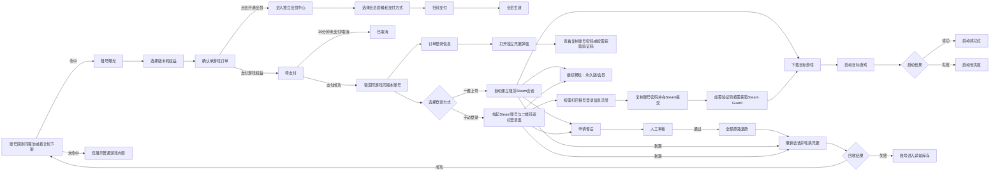

# 【Prd】《盖世游戏 Mac》游戏租号需求

## 一、版本信息

| 时间 | 版本 | 变更人 | 主要变更内容 | 备注 |
|---|---|---|---|---|
| 2025.01.05 | V1.0 | 卢浩 | 创建游戏租号原始需求 | 历史需求文件随交付目录提供 |
| 2026.07.14 | V2.0 | 郑群超 | 根据最新可操作 Demo 重构 C 端、B 端、订单售后、退款权益和统计需求 | 评审稿 |
| 2026.07.14 | V2.1 | 郑群超 | 补充埋点参数、运营准备、责任方、上线门槛及文档附录 | 评审稿 |
| 2026.07.15 | V2.2 | 郑群超 | 将退款权益调整为3天无理由，增加高频退款风控、设备环境和订单游戏时长 | 评审稿 |
| 2026.07.17 | V2.3 | 郑群超 | 补齐临期提醒、续租、到期强退、过期安装包启动拦截、价格展示、独立操作记录页及统计页调整 | 评审稿 |
| 2026.07.29 | V2.4 | 郑群超 | 回退价格分档方案，按最终确认口径统一为一次性首次体验、单款永久版和月度会员畅玩会员游戏库 | 评审稿 |
| 2026.07.29 | V2.5 | 郑群超 | 取号后同时提供一键上号与手动登录，补充账号密码查看/复制、Steam 令牌验证码、短时授权、凭据回收及失败隔离规则 | 评审稿 |
| 2026.07.29 | V2.6 | 郑群超 | 增加整个租号功能的外放地区、20%/50%/100%及自定义灰度配置，补充稳定分桶、新交易拦截和已支付权益继续履约规则 | 评审稿 |
| 2026.07.30 | V2.7 | 郑群超 | 按 /to-prd 规范补齐租号功能外放的前后台图示、字段定义、未登录与地区边界、并发保存、多语言、自检及模拟评审 | C 端 + B 端；中国大陆、美国、其他海外 |
| 2026.07.30 | V2.8 | 郑群超 | 修正 /to-prd 输出结构，C 端与 B 端各使用一张大表汇总；27张图统一使用固定 Git 提交并完成远程校验 | 飞书导入修正版 |
| 2026.07.30 | V2.9 | 郑群超 | 恢复修改前已验证可导入的图片地址与表格语法；每个图示单元格最多2张图，图片较多的模块拆成同一大表内的连续行 | 飞书图片兼容修正 |
| 2026.07.30 | V3.0 | 郑群超 | 新增供应商2小时采购价与首次体验展示价换算规则，补充价格精度、价格版本、订单锁价、异常处理、成本权限和埋点限制；27张图重新统一为已验证的固定 Git 提交 | 首次体验动态定价；飞书图片复核 |
| 2026.07.30 | V3.1 | 郑群超 | 将会员购买从单游戏订单彻底拆出，新增独立会员中心、个人中心会员状态、会员游戏库管理、会员套餐管理；固定三档试运营 SKU，并补充续费、升级永久、套餐版本与购买快照规则 | 会员体系独立 Tab 修正版 |
| 2026.07.30 | V3.2 | 郑群超 | 修正确认订单内会员入口：页面新增“游戏权益 / 开通会员”双 Tab，点击会员卡片原地切换并完成三档套餐选择与支付；会员订单与单游戏订单仍独立结算 | 确认订单会员 Tab 修正 |
| 2026.07.30 | V3.3 | 郑群超 | 移除确认订单会员购买 Tab；点击“开通会员”进入独立会员中心，会员中心常驻展示三档套餐、支付宝、微信支付和二维码；同步个人中心弹窗与 Steam 登录信息弹窗规则 | 独立会员购买页修正 |
| 2026.07.30 | V3.4 | 郑群超 | 会员中心、套餐卡片和支付确认不再展示购买方式及续费方式提示文案，保留套餐有效期、同套餐续费顺延和升级永久规则 | 会员页文案精简 |
| 2026.07.31 | V3.5 | 郑群超 | 统一会员中心按月度、年度、永久排序，整卡切换套餐；月卡与年卡支持跨套餐续费并从当前到期时间顺延；补充左上用户信息、会员常见问题、确认订单双权益等宽，以及游戏库 Steam 账号密码和授权令牌登录入口 | 会员与 Steam 登录流程最终修正 |
| 2026.07.31 | V3.6 | 郑群超 | 首次体验使用后列表统一显示“可租号”；单永久版卡保持半行左对齐；永久版按对应 Steam 版本常规原价1.5–5折配置；手动登录改为 Steam 登录窗与盖世置顶登录助手联动，并移除前端30秒限频提示 | 永久价与 Steam 手动登录联动修正 |
| 2026.07.31 | V3.7 | 郑群超 | 手动登录助手改为低侵入两阶段浮动助手：Steam 登录页保持主界面，第一阶段只显示账号密码；用户在 Steam 提交后才按需获取验证码；验证码阶段不再同时展示账号密码 | Steam 手动登录顺序与侵入性修正 |
| 2026.07.31 | V3.8 | 郑群超 | Steam 登录界面按参考图还原账号登录与二维码登录双栏结构，并将常驻助手改为顶栏轻入口与可反复打开的凭据浮层；账号密码保持可复制，验证码由用户按需获取并在同一浮层展示 | Steam 登录还原与凭据交互简化 |
| 2026.07.31 | V3.9 | 郑群超 | 拆分订单“登录信息”与 Steam 手动登录职责：订单“登录信息”恢复独立凭据弹窗；“登录游戏 → 手动登录”和游戏库“登录 Steam”仍打开 Steam 双栏登录窗；两条路径共用同一使用单、账号和有效验证码，不重复取号 | 登录信息入口职责修正 |

> 交互基准：[Mac 端租号功能标注版 Demo](https://z36358631-ship-it.github.io/-/Mac%E7%AB%AFdemo/mac%E7%AB%AF%E7%A7%9F%E5%8F%B7%E5%8A%9F%E8%83%BD/Mac%E7%AB%AF%E7%A7%9F%E5%8F%B7%E5%8A%9F%E8%83%BD-%E6%A0%87%E6%B3%A8%E7%89%88.html)，线上提交 `0685229706285ab1fac260e9a8722d87c3ce2390`。
> `功能拆分版/` 为 V2.3 及以前的历史归档，不再作为 V3.9 开发与测试依据；权益、会员、首次体验定价、永久版定价、订单独立登录信息、Steam 手动登录和租号功能地区/灰度外放口径以本主 PRD 和最新标注版 Demo 为准。

---

## 二、背景与目标

### 2.1 需求背景

盖世游戏需要在 Mac 客户端内建立 Steam 游戏租号能力。每位用户仅可购买一次游戏时租作为首次体验；体验资格使用后，不再提供时租或续时。后续用户可购买当前单款游戏的永久版，或从确认订单点击“开通会员”进入独立会员中心，按月度、年度、永久顺序选择会员套餐，畅玩会员游戏库内全部游戏；平台通过第三方账号资源完成取号、登录、下载、启动和权益回收。

当前方案需要解决四类问题：

1. **用户体验门槛**：高价单机游戏对尝鲜用户成本较高，且传统租号存在找商品、取账号、输入凭据和处理验证码等复杂步骤。
2. **交易闭环缺失**：租号需要独立处理首次体验资格、永久版购买、会员权益、待支付倒计时、资源锁定、取消、退款和订单状态。
3. **履约与安全风险**：租赁账号必须限制在订单目标游戏内使用；有效使用单可通过订单独立凭据弹窗查看登录信息，也可在 Steam 双栏登录窗内打开凭据浮层。两条路径共用同一账号、有效验证码和短时授权，不因查看、关闭或切换入口判定登录成功，并需在到期、退款、换号或结束使用后撤销会话、轮换密码或执行等效凭据失效，回收失败的账号不得再次分配。
4. **运营管理缺失**：运营需要统一管理商品权益、账号库存、订单售后和效果数据，并能追踪每笔订单是否成功启动游戏、关键后台操作由谁执行及执行结果。

盖世游戏本期以一次性时租降低首次体验门槛，以单款永久版承接单游戏长期需求，以月度、年度、永久三档会员承接多游戏需求，并通过 Mac 客户端内独立会员中心、会员游戏库、个人中心会员状态、游戏发现、游戏库、订单中心和3天无理由退款形成闭环。所有会员套餐仅覆盖后台配置的会员游戏库，不代表全部 Steam 游戏。

### 2.2 产品目标

1. 用户可在盖世游戏内完成“发现可租游戏 → 选择权益 → 支付 → 下载/启动 → 订单管理 → 售后”的完整流程。
2. 支付成功后由系统锁定同游戏、同版本的可租 Steam 账号；用户可选择一键上号或手动登录，两种方式共用同一账号且不重复取号。
3. 租赁会话只允许操作订单目标游戏，非目标游戏的获取、下载和启动均被拦截并引导单独租用。
4. 运营可配置商品、版本、价格、活动和库存，客服可结合用户描述与启动结果处理售后。
5. 运营可按整个租号功能配置可外放地区和灰度比例，未命中用户不产生租号曝光、新下单或新取号。
6. 通过订单量、金额、库存使用率、账号复用率、首次体验转永久版率、首次体验转会员率、会员套餐结构和游戏启动成功率评估业务效果。

### 2.3 核心挑战

1. Steam 登录授权、AppID 识别、非目标游戏拦截及到期 token 清理的技术稳定性。
2. 支付成功与账号资源锁定之间的一致性，以及资源不足时的自动退款。
3. 首次体验资格全平台只核销一次，以及永久版、会员游戏库和会员有效期的准确判定。
4. 游戏时长准确累计、售后证据留存和3天无理由退款资格的准确判定。
5. 第三方账号资源同步、健康检测、并发占用、换号与释放的准确性。

### 2.4 本期范围

- Steam 游戏租号曝光、筛选、搜索和选购。
- 每位用户仅一次的时租首次体验；体验支付成功后不再展示时租入口，也不支持续时。
- 单款游戏永久版、只结算当前游戏的确认订单、独立会员中心、支付宝/微信支付、支付二维码和 30 分钟待支付。
- 独立会员中心固定按月度会员原价¥169/试运营价¥129、年度会员原价¥699/试运营价¥499、永久会员原价¥799/试运营价¥399顺序展示。
- 会员畅玩后台配置的会员游戏库；C 端只在独立会员中心完成购买、续费和升级，确认订单与个人中心只提供会员中心入口。
- 历史日租订单按原套餐文案、金额、到期时间和价格快照继续履约及售后。
- Steam 一键上号与手动登录；订单“登录信息”打开独立凭据弹窗且不拉起、不聚焦 Steam；“登录游戏 → 手动登录”和游戏库“登录 Steam”打开 Steam 双栏登录窗；两类界面共用账号密码、按需获取的令牌验证码和短时授权。
- 游戏库、租赁 Steam 账号状态和安装状态管理。
- 租号中心、订单详情、继续畅玩、取消、删除和售后退款。
- 基于服务端 `expire_at` 的 15 分钟、5 分钟临期提醒，到期 T0 强退、会话撤销、账号释放和过期安装包启动拦截；提醒中的“继续畅玩”只提供单游戏永久版和会员中心入口，不延长首次体验。
- 支付后72小时、目标游戏累计时长30分钟内的3天无理由退款，以及履约问题售后。
- 高频退款用户识别、购买前风险确认和后台滚动周期/退款笔数配置。
- 整个租号功能的启停、可外放地区和20%/50%/100%或1–100%自定义灰度配置；同一用户稳定分桶，缩量不影响已支付权益和进行中的使用单。
- B 端商品、账号库存、订单售后、效果统计、权限和独立操作记录页。

### 2.5 本期不包含

- 用户自主出租账号的双边交易平台。
- Epic Games、GOG 的实际租号履约，仅保留平台登录占位。
- 覆盖全部 Steam 游戏的全平台畅玩权益和用户侧出租收益体系。
- 在订单详情以外的普通客户端页面、B 端、日志、埋点或导出中展示 Steam 明文凭据。
- Demo 中“模拟支付完成”等演示控制项。

---

## 三、故事介绍

### 3.1 用户与运营场景

**场景一：新用户低成本体验游戏**

小明在探索内容中看到《黑神话：悟空》显示“¥1.99 首次体验”和“386 在租”。他进入游戏信息后点击“租号开玩”，选择标准版和首次体验。确认订单只展示当前游戏的版本、权益、游戏原价、订单金额和支付方式；点击“开通会员”进入独立会员中心，可看到三档套餐、支付宝、微信支付和二维码。小明使用支付宝完成首次体验支付后返回游戏信息，原“获取游戏”动作变为“下载 783M”。游戏下载完成后，他点击“启动游戏”，系统通过租赁 Steam 会话进入目标游戏并记录“启动成功”和订单游戏时长。首次体验支付成功后，该资格在全平台核销，探索、找游戏和搜索列表统一显示“可租号”，不提前展示永久版金额；进入详情或确认订单后再按所选版本展示永久价。

**场景二：租赁账号尝试操作非目标游戏**

小明租用了《黑神话：悟空》，随后在游戏库中点击另一款游戏。即使当前租赁 Steam 账号拥有该游戏，客户端仍阻止获取、下载或启动，并提示“当前游戏未租用，是否进行租用”。小明选择“去租号”后进入该游戏的确认订单，原租赁订单不受影响。

**场景三：用户申请售后**

用户支付后多次尝试启动，但 Steam 登录失败。订单启动结果变为“启动但失败”。用户在订单详情点击“申请售后”，选择“Steam 登录失败”，填写“反复提示登录超时，重试三次仍无法进入”并提交。退款详情显示申请中、人工审核、原路退款和完成四个阶段。审核通过后，租号费用全额原路退回，租赁会话失效，账号资源被释放。

**场景四：运营配置商品与库存**

商品运营新建租号商品，绑定 Steam 游戏，录入或同步各版本的供应商2小时采购价，系统自动计算首次体验展示价；运营同时录入对应 Steam 版本常规原价，并在1.5–5折范围内配置永久版折扣，系统生成永久版售价和价格版本。会员游戏库由独立“会员游戏库管理”维护，商品管理只读展示加入状态并提供跳转，不能双写。资源运营同步第三方账号库存，完成健康检测后将账号加入可用池。商品发布前，系统校验两类价格有效、会员游戏库状态明确，并确认至少存在一个可用账号。

业务负责人在租号运营中心配置整个租号功能的启用状态、可外放地区和灰度比例。地区支持中国大陆、美国、其他海外多选；灰度支持20%、50%、100%快捷值和1–100%自定义整数。配置缩量、移除地区或关闭功能后，未命中用户不再看到租号入口，但已支付永久版、有效会员和进行中的使用单继续履约。

**场景五：客服处理售后**

客服进入“售后申请处理”，查看用户选择的问题类型、原始问题描述、订单启动结果和账号检测结果。客服确认该订单从未成功启动且存在登录失败记录后，批准全额原路退款。系统撤销租赁会话、轮换凭据并释放账号；任一步回收失败时，订单仍保持已退款，账号转入异常库存等待人工处理。

### 3.2 价值分析

- **用户价值**：默认一键上号减少账号、密码和验证码操作；一键失败或不兼容时可切换手动登录完成履约，并保留明确售后保障。
- **平台价值**：新增租号交易收入，提升高价游戏的体验转化，并通过游戏库和订单中心增加用户回访。
- **运营价值**：商品、库存、订单、售后和统计在同一套业务体系中管理，降低跨平台处理成本。
- **资源价值**：通过库存使用率和账号复用率提高第三方账号资源的利用效率。
- **服务价值**：以启动结果和行为记录辅助售后判断，减少仅依赖用户口述产生的争议。

### 3.3 核心体验路径

**租号主链路：** 发现可租游戏 → 查看游戏信息 → 选择版本和权益 → 确认订单 → 30 分钟内支付 → 锁定账号 → 选择一键上号或手动登录 → 建立租赁 Steam 会话 → 下载/启动目标游戏 → 到期完成或申请售后。

**订单管理链路：** 租号中心 → 查看订单状态 → 点击“登录信息” → 打开独立凭据弹窗 → 查看或复制账号、密码，按需获取/复制/刷新 Steam Guard 验证码 → 关闭弹窗；全程不拉起、不聚焦 Steam，也不判定登录成功。

**订单登录游戏链路：** 租号中心 → 订单详情 → 点击“登录游戏” → 选择登录方式 → 选择“手动登录” → 拉起或聚焦 Steam 账号登录与二维码登录双栏窗口 → 打开顶栏“租号登录信息”浮层 → 复制凭据并在 Steam 提交。

**临期与到期链路：** 以服务端 `expire_at` 为唯一时钟 → 到期前 15 分钟、5 分钟各提醒一次 → 点击“继续畅玩”可进入确认订单购买永久版，或进入独立会员中心选择套餐 → 到期仍未获得新权益则在 T0 结束游戏、清除敏感展示、撤销会话、轮换凭据并释放账号 → 本地安装包再次启动时校验并继续引导购买永久版或会员。

**会员链路：** 侧边栏进入独立“会员中心” → 查看月度/年度/永久三档 SKU 与会员游戏库 → 点击整张套餐卡选择 → 月卡或年卡开通/跨套餐续费，或升级永久 → 个人中心展示会员状态 → 从会员游戏库进入游戏详情并使用会员权益。

**游戏库 Steam 登录链路：** 有效使用单 → 进入游戏库 → 点击 Steam 账号卡内“登录 Steam” → 拉起或聚焦 Steam 账号登录与二维码登录双栏窗口 → 点击顶栏“租号登录信息” → 在凭据浮层查看或复制账号、密码 → 在 Steam 提交账号密码 → 如 Steam 要求验证，则在同一浮层按需获取并复制 Steam Guard 验证码 → 通过 Steam 会话或后续下载、启动校验确认结果；与订单独立凭据弹窗读取同一使用单、账号和未过期验证码，全程不重复取号。

**后台履约链路：** 配置商品权益 → 同步并检测双登录与凭据回收能力 → 商品上架 → 支付后锁定资源 → 监控登录与启动结果 → 处理售后 → 撤销会话、轮换凭据并释放资源 → 查看效果统计与只读操作记录。

### 3.4 产品指标

上线后按以下指标建立基线并持续观察：

1. 租号曝光到详情点击率。
2. 详情点击到提交订单转化率。
3. 提交订单到支付成功率。
4. 支付成功到登录方式选择率、游戏库 Steam 登录窗拉起率、租号登录信息浮层打开率，以及一键上号/手动登录成功率。
5. 一键上号失败转手动登录率、凭据浮层到授权码获取率、令牌验证码获取成功率和游戏启动成功率。
6. 账号使用率、账号复用率、凭据回收失败率、首次体验转永久版率、首次体验转会员率、各会员 SKU 购买占比、续费率和升级永久率。
7. 售后率、退款率、平均审核时长和平均退款时长。
8. 按地区和灰度版本统计租号发布资格命中率、未命中原因、新交易拦截量及已支付权益保护量。

### 3.5 路径规划

- **V3.9（本期）**：跑通一次性首次体验、供应商采购价动态换算首次体验展示价、Steam版本原价1.5–5折永久版、只结算当前游戏的确认订单、独立会员购买页、三档会员套餐、个人中心会员状态、会员游戏库、支付、资源锁定、一键上号与手动登录、订单独立凭据弹窗、Steam 双栏登录窗、顶栏租号登录信息入口、两界面共用凭据状态与验证码、凭据回收、目标游戏限制、地区与灰度外放、订单售后、3天无理由退款和 B 端管理闭环。
- **后续扩展**：根据业务数据评估新增会员周期、更多游戏平台和用户自主出租能力，不在本期提前上线。

---

## 四、概要设计

### 4.1 模块设计

| 端别 | 业务模块 | 功能说明 | 优先级 |
|---|---|---|---|
| C 端 | 租号发现与曝光 | 有首次资格时展示最低首次体验金额；资格使用后统一展示“可租号”；同时展示在租数 | P0 |
| C 端 | 权益选择与计价 | 确认订单不显示会员购买 Tab；有首次资格时选择按供应商2小时采购价动态计算的首次体验或永久版，无资格时仅显示半行左对齐的永久版；永久价为所选 Steam 版本常规原价的1.5–5折；点击“开通会员”进入独立会员中心 | P0 |
| C 端 | 会员中心 | 独立会员中心按月度、年度、永久顺序展示三档 SKU、支付宝、微信支付、二维码、左上用户信息、会员游戏库和常见问题 | P0 |
| C 端 | 个人中心会员状态 | 只展示当前套餐、有效期与会员权益，购买、续费和升级统一跳会员中心 | P0 |
| C 端 | 确认订单与支付 | 只展示并支付当前游戏的首次体验或永久版；会员购买在独立会员中心完成；命中单游戏退款风控时先二次确认 | P0 |
| C 端 | Steam 会话与游戏权益判断 | 根据个人/租赁会话、是否拥有游戏和是否订单目标决定操作 | P0 |
| C 端 | 登录、下载、启动与目标游戏限制 | “登录游戏”先选择一键上号或手动登录；选择手动登录后打开 Steam 双栏登录窗，并可反复打开顶栏凭据浮层；验证码仅按需获取；下载或启动目标游戏，拦截非目标游戏 | P0 |
| C 端 | 游戏库与平台账号状态 | 管理已安装/未安装游戏和 Steam 会话展示；有效使用单可从 Steam 账号卡拉起或聚焦 Steam 登录窗，并通过顶栏“租号登录信息”打开覆盖二维码区的凭据浮层，不遮挡账号密码输入区 | P0 |
| C 端 | 用户订单管理 | 查看订单、登录游戏；有效使用单的“登录信息”打开独立凭据弹窗，不拉起或聚焦 Steam；支持继续支付、继续畅玩、取消和删除 | P0 |
| C 端 | 临期提醒与到期处理 | 15/5 分钟提醒、永久版或会员转化、T0 强退和过期安装包拦截 | P0 |
| C 端 | 售后退款 | 提交售后问题并查看退款进度 | P0 |
| C 端 | 3天无理由退款 | 展示72小时、目标游戏累计30分钟和高频退款限制规则 | P0 |
| B 端 | 租号商品与权益管理 | 管理游戏、版本、供应商2小时采购价、首次体验展示价、Steam版本常规原价、1.5–5折永久版折扣及两类价格版本、曝光和上下架；会员库状态只读并跳独立管理 Tab | P0 |
| B 端 | 会员游戏库管理 | 独立 Tab 管理会员可畅玩的游戏版本、可用库存、启停、移出与配置版本 | P0 |
| B 端 | 会员套餐管理 | 独立 Tab 管理固定三档 SKU 的名称、原价、试运营价、权益文案、排序、上下线、配置版本与回滚 | P0 |
| B 端 | Steam 账号资源与库存管理 | 管理双登录、令牌、会话撤销、凭据轮换、账号同步、占用、换号和上下架 | P0 |
| B 端 | 订单履约管理 | 查询订单、查看启动结果、设备环境、订单游戏时长、换号、补偿和结束订单 | P0 |
| B 端 | 售后与退款处理 | 审核用户问题，执行退款和资源回收 | P0 |
| B 端 | 租号效果统计 | 展示订单、金额、库存、复用、权益转化和启动数据 | P1 |
| B 端 | 权限与操作审计 | 控制高风险操作，并在独立操作记录页查询不可改删的完整记录 | P0 |
| B 端 | 退款风控设置 | 配置滚动统计天数和无理由退款笔数阈值，保存规则版本 | P0 |
| B 端 | 租号外放设置 | 按整个租号功能配置启停、可外放地区和灰度比例，保存配置版本和操作记录 | P0 |

**全局业务流程：**

```mermaid
flowchart LR
    R{地区与稳定灰度判定} -->|命中| A[租号曝光]
    R -->|未命中| Z[仅展示普通游戏内容]
    A --> B[选择版本和权益]
    B --> C[确认单游戏订单]
    C -->|点击开通会员| C1[进入独立会员中心]
    C1 --> C2[选择会员套餐和支付方式]
    C2 --> C3[扫码支付]
    C3 --> C4[会员生效]
    C -->|支付游戏权益| D[待支付]
    D -->|30分钟未支付/取消| X[已取消]
    D -->|支付成功| E[锁定同游戏同版本账号]
    E --> F{选择登录方式}
    F -->|一键上号| G1[自动建立租赁Steam会话]
    F -->|手动登录| G2[拉起Steam账号与二维码双栏登录窗]
    G2 --> G21[按需打开租号登录信息浮层]
    G21 --> G22[复制账号密码并在Steam提交]
    G22 --> G23[如需验证则按需获取Steam Guard]
    E --> GI[订单登录信息]
    GI --> GI1[打开独立凭据弹窗]
    GI1 --> GI2[查看复制账号密码或按需获取验证码]
    G1 --> G[下载目标游戏]
    G23 --> G
    G --> H[启动目标游戏]
    H --> I{启动结果}
    I -->|成功| J[启动成功过]
    I -->|失败| K[启动但失败]
    G1 --> L[继续畅玩：永久版/会员]
    G2 --> L
    G1 --> M[申请售后]
    G2 --> M
    M --> N[人工审核]
    N -->|通过| O[全额原路退款]
    O --> P[撤销会话并轮换凭据]
    G1 -->|到期| P
    G2 -->|到期| P
    P --> Q{回收结果}
    Q -->|成功| R[账号回到可租池或按计划下架]
    Q -->|失败| S[账号进入异常库存]
```

### 4.2 详细设计（C端）

功能 Demo：[Mac 端租号功能标注版](https://z36358631-ship-it.github.io/-/Mac%E7%AB%AFdemo/mac%E7%AB%AF%E7%A7%9F%E5%8F%B7%E5%8A%9F%E8%83%BD/Mac%E7%AB%AF%E7%A7%9F%E5%8F%B7%E5%8A%9F%E8%83%BD-%E6%A0%87%E6%B3%A8%E7%89%88.html)

|模块名称|图示|展示与交互说明|
|---|---|---|
|租号发现与曝光（探索与找游戏）| |① 探索、找游戏和游戏详情先校验功能开关、登录态、服务端账号地区和稳定灰度；商品上架且有有效权益与可租库存后才展示租号信息。 ② 有首次资格显示最低首次体验价；资格已使用且没有永久版或会员权益时统一显示“可租号”，不显示永久版金额；会员有效且游戏在会员库时显示“会员畅玩”；已购永久版按已有权益展示；在租数超过999显示“999+ 在租”。 ③ 列表沿用原页面分页、加载、空状态和滚动位置；租号资格或摘要失败时只隐藏租号扩展信息，不清空普通游戏结果。|
|租号发现与曝光（首次体验已使用）||① 首次体验资格核销后，探索、找游戏和搜索在下一次资格刷新时统一把租号价格替换为“可租号”。 ② 点击“可租号”仍进入游戏详情；详情与确认订单按用户选择的 Steam 游戏版本展示永久版实际价格。 ③ 资格刷新失败时沿用最近一次服务端资格结果，不在客户端自行推断或显示旧永久价。|
|租号发现与曝光（搜索与未命中）| |① 搜索结果沿用同一发布资格判定。未登录、地区未知、地区不匹配、灰度未命中或配置异常时按普通游戏展示，不出现租号金额、在租数、“可租号”筛选、租号入口或新会员入口。历史链接直达交易页时先登录并重新判定，不自动提交原操作。 ② 已支付永久版用户保留订单中心和游戏库中的对应游戏入口；有效会员保留会员中心和会员游戏库入口；进行中的使用单保留订单、登录、启动、售后和退款入口。以上履约入口不恢复普通租号曝光、新订单或新会员购买入口。 ③ 中国大陆归入“中国大陆”，美国归入“美国”，中国港澳台及其余国家和地区归入“其他海外”；地区无法判定时不放行。用户提示覆盖中文、英语、日语、俄语和巴西葡萄牙语。|
|权益选择与计价|—|① 确认订单不显示会员购买 Tab，只结算当前游戏；用户有全平台唯一首次体验资格时展示“首次体验、永久版”，资格已使用时只展示“永久版”；点击“开通会员”进入独立会员中心。 ② 首次体验固定为2小时，展示价由服务端根据当前版本的供应商2小时采购价计算：采购价小于或等于¥1.99时展示¥1.99；采购价高于¥1.99时，展示价=采购价×1.2，四舍五入保留2位小数。示例：¥0.20→¥1.99、¥1.50→¥1.99、¥1.99→¥1.99、¥2.00→¥2.40、¥4.00→¥4.80。 ③ 永久版以当前所选 Steam 游戏版本的常规原价为基准，售价比例必须在15%–50%之间；标准版、增强版、豪华版分别保存原价、折扣比例、实付价、地区、币种、价格版本和更新时间，不能共用标准版原价。 ④ 首次体验支付成功后全平台核销，不支持续时或再次购买；永久版对应当前游戏和版本，不代表长期独占账号；会员仅覆盖后台会员游戏库。 ⑤ 切换版本或权益后重新获取服务端最终金额；客户端不自行计算。国内与海外共用交互，币种和货币符号以服务端返回为准。非人民币订单由支付系统按当前地区币种价格表返回结算金额和价格版本，客户端不做汇率换算。 ⑥ 确认订单“游戏原价”展示当前所选 Steam 版本的常规原价；“订单金额”展示当前权益实付金额。供应商采购价、计算过程和内部成本不向用户展示。|
|独立会员中心与三档 SKU| |① 确认订单“开通会员”、侧边栏会员入口、个人中心和到期提示均进入同一独立会员中心；确认订单不承载会员套餐切换或支付。 ② 页面左上展示用户头像、昵称、UID和未开通/有效/已到期/永久有效状态，右上不重复展示会员状态卡。 ③ 套餐固定按月度会员（原价¥169、试运营价¥129、30天）、年度会员（原价¥699、试运营价¥499、365天）、永久会员（原价¥799、试运营价¥399、永久有效）顺序展示；三档均展示“试运营优惠”。会员中心、套餐卡片和支付确认不展示购买方式及续费方式提示文案。 ④ 点击整张套餐卡切换选中套餐，不在卡内设置选择按钮；支付区同步更新套餐名称、应付金额和按钮文案。支付宝、微信支付和二维码常驻展示，切换支付方式后更新二维码及扫码提示。 ⑤ 未开通用户默认选中月度套餐；有效月卡或年卡可继续购买月卡或年卡，统一从当前到期时间顺延所购套餐周期；已到期从支付成功时间重新计算。月卡或年卡可升级永久会员，升级立即生效，剩余时长不折现、不退款；永久会员不可重复购买。 ⑥ 会员订单与单游戏订单使用独立商品、订单号、金额和权益发放；进入会员中心不取消或改写当前单游戏待支付订单。 ⑦ 套餐、金额或二维码加载失败时不创建会员订单，支付区展示失败原因与重试入口；二维码过期后刷新原会员订单，不重复创单。 ⑧ 会员仅覆盖会员游戏库，不代表全部 Steam 游戏；会员游戏库列表底部展示5条常见问题，标题层级与“会员游戏库”一致，内容说明游戏范围、退款、客服协助、游戏库更新和共享账号限制。|
|个人中心会员状态||① 点击侧边栏头像，在头像附近弹出个人中心浮层，不进入独立页面；再次点击头像、点击浮层外或页面跳转时关闭。 ② 浮层展示未开通、有效、已到期、永久有效四类会员状态，以及当前套餐和到期时间。 ③ 未开通展示“去开通”；月度/年度有效展示“续费”；已到期展示“重新开通”；永久会员展示“查看权益”。 ④ 点击会员卡统一进入会员中心；个人中心不直接创建会员订单，也不维护第二套套餐价格和权益文案。|
|确认订单与支付| |① 页面不显示“游戏权益 / 开通会员”双 Tab；从游戏详情、继续支付或继续畅玩进入时，只展示当前游戏、版本、首次体验或永久版、退款权益、游戏原价、订单金额和支付方式。有首次体验资格时，“首次体验、永久版”两张权益卡等宽占满整行。 ② “开通会员”只作为会员中心入口；点击后进入独立会员中心，不把会员套餐或会员金额加入当前游戏订单。 ③ 会员订单与单游戏订单独立。存在单游戏待支付订单时仍可进入会员中心，原订单继续按30分钟倒计时保留；会员支付不自动取消、支付或改写原订单。 ④ 游戏权益创单前实时复验发布资格、当前价格版本、首次资格和库存；创单成功后锁定订单金额、Steam原价快照、永久版折扣比例及价格版本30分钟。提交支付时复验订单、发布资格、首次资格和库存，不因供应商价格、Steam原价或后台折扣在锁价期内变化而修改本单金额。订单创建后30分钟未支付自动取消。发布资格失效的待支付订单不能继续支付或锁定账号。 ⑤ 命中高频退款规则时，付款前提示本单不享受3天无理由；取消后停留当前页，确认后保存资格快照并继续支付，履约售后不受影响。 ⑥ 支付结果未知时查询原订单，不重复创单或扣款。只要渠道支付已成功，无论账号仍在资源分配中、已生成使用单或正在运行，均按已支付权益保护：发布配置缩量、移除地区或关闭功能不得中断资源分配；资源最终不足时按履约失败自动退款，首次体验资格按支付成功规则核销，不因外放配置变化单独返还。 ⑦ “模拟支付完成”仅为 Demo 验证入口，不进入正式产品。|
|确认订单（仅永久版）||① 首次体验资格已使用时，只显示一张永久版权益卡；卡片占获取方式区域左半行，右侧留空，与双权益场景的单卡宽度一致。 ② 页面不显示“首次体验资格已使用”“不再展示时租入口”或其他隐藏入口说明。 ③ 游戏原价展示所选 Steam 版本常规原价，订单金额展示该版本1.5–5折后的实付价；切换版本后两者同时刷新。|
|Steam 会话与游戏权益||① 租赁账号只允许获取、下载和启动当前使用单目标游戏；非目标游戏统一拦截。个人 Steam 账号已拥有游戏时按个人权益正常获取、下载和启动，不受历史租赁记录影响。 ② 主动作按会话、游戏是否拥有、是否订单目标和安装状态展示“获取游戏、下载、启动游戏、租号开玩”。 ③ 租赁会话到期、退款、换号或结束后立即失效并清除敏感展示；个人 Steam 会话不受影响。|
|登录方式、下载启动与非目标游戏限制| |① 支付或会员取号成功后点击“登录游戏”并选择“一键上号、手动登录”；两种方式共用同一使用单和账号，切换方式不重复取号。一键失败时保留原绑定并提供重试和手动登录。 ② “登录游戏 → 登录方式 → 手动登录”拉起或聚焦 Steam 账号登录与二维码登录双栏窗口；默认不展示大型助手，仅在窗口顶栏关闭按钮左侧提供弱化的“租号登录信息”入口。订单“登录信息”不进入本路径。 ③ 点击 Steam 顶栏入口后，凭据浮层向左下展开并覆盖二维码区，不遮挡账号、密码输入区。浮层同层展示账号、默认遮罩的密码及各自复制操作；用户需要验证时再点击“获取 Steam Guard”，成功后在原浮层显示5位验证码、倒计时、复制和刷新。 ④ 关闭浮层只隐藏敏感内容，不关闭 Steam 窗口、不清空 Steam 表单、不重复取号；再次打开后账号、密码恢复默认遮罩，有效验证码继续显示同一码和剩余时间。查看、复制账号密码不占用验证码请求限频。 ⑤ 点击 Steam 登录或验证码确认不直接判定成功，最终登录结果由 Steam 会话或后续下载、启动校验确认。每次敏感操作由服务端复验使用单、设备、账号绑定与有效期，并执行防重放和短时授权。复制账号或密码后60秒、客户端退后台、关闭浮层、订单到期、退款、换号或结束使用时检查系统剪贴板；仅当剪贴板内容仍等于本次复制值时清空，用户已复制其他内容时不得误清。 ⑥ 租赁账号对非目标游戏执行获取、下载或启动时弹出“当前游戏未租用”，展示游戏和当前可购买权益；“去租号”进入当前游戏确认订单，原订单不受影响。启动结果为“未启动、启动但失败、启动成功过”，成功过后不因后续失败回退。|
|过期本地安装包启动拦截||① 首次体验过期且本地安装包仍存在时阻止租赁方式启动，提供“取消、继续畅玩”。 ② 点击“继续畅玩”可购买当前游戏永久版或进入会员中心；不延长或再次购买首次体验。 ③ 个人账号拥有游戏时优先按个人权益启动；无网络或服务端状态校验失败时不放行租赁游戏。|
|游戏库与平台账号状态| |① 游戏按已安装、未安装分组，支持名称或类型搜索及现有排序；点击卡片进入游戏详情，再按会话和权益决定动作。 ② 租赁账号展示“租”和“盖世租号账号”，不展示好友列表；个人会话显示“个人 Steam 账号”。切换会话后立即刷新操作权限。 ③ 存在有效使用单时，Steam 账号卡展示“登录 Steam”；点击后直接拉起或聚焦 Steam 账号登录与二维码登录双栏窗口，不打开订单独立凭据弹窗。窗口按约定 Steam 客户端中文登录界面高保真还原；外层游戏库背景暗化并虚化。 ④ “租号登录信息”位于 Steam 顶栏关闭按钮左侧；凭据浮层锚定入口向左下展开并覆盖二维码区，不新增第三栏、不改变左侧表单。浮层账号、密码和验证码入口同层存在，验证码只在用户点击后请求；该入口与订单独立凭据弹窗共用当前绑定账号和未过期验证码，不重新取号。 ⑤ 客户端不修改或注入 Steam 原生界面，不执行坐标点击，不强依赖辅助功能权限；正式客户端以跟随 Steam 窗口的盖世置顶浮层实现。无法可靠聚焦时显示“Steam 已打开，请进入登录页”。MVP 不自动识别 Steam Guard 页面，以用户显式获取验证码为准。 ⑥ Steam 登录成功后自动刷新为在线账号卡；登录失败保留当前绑定，用户可反复打开凭据浮层继续操作。关闭浮层只清除当前敏感视图，关闭 Steam、到期、退款、换号、结束使用或客户端退后台时使敏感授权失效。发布资格未命中但存在已购永久版或进行中使用单时，保留对应游戏入口和履约登录能力。|
|用户订单与详情| |① 订单中心保留“全部、租赁中、待支付”三个 Tab；卡片展示游戏、版本、状态、有效期、金额和订单号，点击进入详情。 ② 待支付可继续支付或取消；有效使用单可点击“登录游戏”进入“一键上号 / 手动登录”选择，也可点击“登录信息”打开独立凭据弹窗；两入口职责隔离。有效使用单也可继续畅玩或申请售后；终态按规则删除。 ③ 已支付永久版、有效会员和进行中使用单即使外放资格失效，订单中心仍可达。|
|用户订单登录信息||① 仅有效使用单展示“登录信息”；点击后打开独立凭据弹窗，不拉起、不聚焦 Steam。 ② 弹窗展示 Steam 账号、密码和 Guard 验证码。账号默认部分遮罩，密码默认完全遮罩，均支持查看、隐藏和重复复制；Guard 按需获取，支持复制、刷新并按服务端失效时间倒计时。 ③ 弹窗只保留右上角 X；点击 X、弹窗外或按 Esc 关闭。关闭或客户端退后台时恢复账号、密码遮罩并清除敏感视图；再次打开时可继续使用未过期的同一验证码和剩余时间。 ④ 查看、复制或关闭弹窗不判定登录成功。用户可复制后在 Steam 客户端或其他支持 Steam 登录的界面使用；复制不扩大权益，租赁账号仍只允许使用订单目标游戏。 ⑤ 该弹窗与 Steam 双栏内凭据浮层共用同一使用单、账号、有效验证码和短时授权，不重复取号。|
|临期提醒| |① 服务端 expire_at 为唯一时钟。剩余15分钟、5分钟首次命中时顶部居中各提醒一次；游戏内外共用，不设置1分钟档位。 ② 休眠或回前台后重算，只补最接近当前的一档。 ③ 点击“继续畅玩”进入当前游戏永久版或会员中心，不延长或再次购买首次体验。|
|继续畅玩与到期| |① T0前新权益生效时原子接管当前账号；否则T0立即结束目标游戏、撤销会话、轮换凭据并释放账号。 ② 有效会员可从会员权益页切换会员游戏，先回收旧账号再分配新账号。 ③ 安装包、设置和个人存档继续保留；到期结果展示游戏和当前可获得权益。|
|售后申请与退款进度| |① 订单详情按服务端权限展示“申请售后”；问题类型为“3天无理由、启动失败、Steam登录失败、账号异常/频繁掉线、其他问题”，问题描述必填。 ② 提交保存问题类型、原始描述、订单、账号、启动结果、游戏时长、资格结果、规则版本和诊断摘要；重复提交返回原售后单。 ③ 退款进度为申请中、人工审核、原路退款、完成；预计7个工作日内处理。退款成功后撤销会话、轮换凭据并释放账号；资源回收失败不回滚退款，账号转异常。|
|3天无理由退款||① 支付成功后72小时内、订单目标游戏累计成功运行时长不超过30分钟且订单资格快照有效时可申请；下载、登录失败和启动失败不计游戏时长。 ② 命中高频退款限制并确认购买后，本单不享受无理由退款；Steam登录失败、启动失败和账号异常等履约售后继续保留。 ③ 审核通过后退还订单可退租号费用并按原渠道退回；规则变更不回溯历史订单。|

### 4.3 详细设计（B端）

|模块名称|图示|展示与交互说明|
|---|---|---|
|租号商品与权益管理||① 展示商品、版本、首次体验时长、供应商2小时采购价、系统计算的首次体验展示价、首次体验价格版本、Steam版本常规原价、永久版折扣比例、永久版实付价、永久版价格版本和更新时间，以及会员游戏库状态、库存、曝光位和上下架状态。 ② 支持按平台、状态、商品名、游戏名组合查询；支持新建、编辑、复制、批量调整永久版折扣、批量上下架和库存同步。首次体验展示价为只读值；永久版按当前版本 Steam 常规原价和15%–50%折扣比例生成，批量调整超出边界时按15%或50%截断并逐项返回结果。 ③ 供应商2小时采购价仅接受¥0.20–¥4.00，展示价按“采购价≤¥1.99取¥1.99，采购价>¥1.99取采购价×1.2”计算并保留2位小数；采购价缺失、超范围或展示价计算失败时，当前版本的首次体验不可发布。Steam版本常规原价必须大于0，永久版折扣必须在15%–50%，任一缺失或越界时永久版不可发布。商品发布前校验有效权益、会员库状态及可租库存。下架只阻止新曝光和新订单，不终止已支付订单。 ④ 用户首次资格、永久权益和会员权益由服务端判定，后台不能绕过。供应商采购价仅商品运营、财务和获授权的业务负责人可见；普通客服、资源运营和 C 端不可见。采购价、Steam原价、折扣比例、最终售价的录入、同步、重算和生效均记录操作人或同步来源、前后值、价格版本、结果和请求ID。|
|会员游戏库管理|—|① 作为独立 Tab，按游戏版本展示游戏名称、Steam AppID、版本、启停状态、配置版本、可用库存、加入时间、更新人和更新时间。 ② 支持游戏名称/ID、Steam AppID、版本、状态组合筛选，以及新增会员游戏、单个/批量启停和移出；新增或移出前二次确认。 ③ 游戏加入会员库后只对后续会员新取号生效；移出后阻止后续会员新取号，进行中的有效会员使用单继续履约。 ④ 商品管理中的“会员游戏库”状态为只读，点击“前往会员库管理”跳转本 Tab 并带入游戏筛选，不允许两处维护。|
|会员套餐管理|—|① 作为独立 Tab，固定按月度、年度、永久顺序展示三条 SKU；SKU 类型和有效期创建后不可修改。 ② 可维护套餐名称、权益文案、原价、试运营价、试运营标签、排序和上下线状态；原价与试运营价必须大于0，排序必须为正整数。 ③ 每次保存生成新的套餐配置版本，记录操作人、时间和 Before/After；支持查看版本历史和回滚，回滚同样生成新版本。 ④ 已支付会员订单保存套餐 ID、套餐版本、名称、价格、权益文案、有效期和优惠标签快照；后续改价、下线或回滚不得改写历史订单。 ⑤ 套餐配置与供应商采购价完全隔离；供应商采购价异常只关闭对应版本的首次体验，不影响永久版与三档会员套餐。|
|租号功能外放设置||① 配置对象为整个租号功能，不写入单个商品；商品管理顶部和系统设置进入同一份配置。 ② 字段：功能状态（启用/关闭）；可外放地区（中国大陆、美国、其他海外，多选且至少1项）；灰度比例（20%、50%、100%或自定义）；自定义只接受1–100整数；命中示例和配置版本只读。 ③ 保存时先校验，再展示影响范围并二次确认；提交期间按钮禁用。请求携带配置版本和幂等标识；并发旧版本保存被拒绝并提示刷新，失败或超时继续使用上一有效配置。 ④ 稳定桶固定使用 FNV-1a 32位：UTF-8字符串“用户ID:rental_feature:灰度轮次”，初始值2166136261，每字符异或后乘16777619，转无符号整数后对100取模；桶值小于比例命中。比例扩量不更换灰度轮次。固定样本：U-000032=0、U-000053=19、U-000115=20、U-000006=49、U-000049=50、U-000149=99。 ⑤ 地区读取平台账号地区服务；登录、客户端回前台、进入交易页和提交支付/新取号前刷新。账号地区变更在下一次成功刷新后生效；地区未知时不放行，客户端不得覆盖。 ⑥ 业务负责人审批灰度方案；当班租号运营执行日常放量、缩量和回滚；系统管理员仅在紧急故障时按已审批预案代执行；技术负责监控与故障处理。业务负责人和系统管理员有修改权限，其他角色只读或无入口。 ⑦ 默认停止条件：15分钟窗口内新交易失败率≥5%且请求数≥50；或出现未命中仍曝光/创单、已支付权益被拦截、稳定桶不一致任一事件。命中后5分钟内停止扩量，10分钟内回滚上一有效配置；关键错误连续30分钟为0且交易、登录、启动成功率恢复至近7日同时间基线±5个百分点内，业务负责人确认后恢复放量。|
|Steam账号资源与库存管理||① 展示脱敏账号标识、供应方ID、游戏/版本、状态、双登录/令牌/会话撤销/凭据轮换能力、最近回收结果、占用使用单和累计租次；不展示明文凭据。 ② 支持游戏、版本、状态、脱敏账号和供应方筛选，以及新建、第三方同步、单个/批量检测、下架、换号和释放。 ③ 仅登录、手动登录、令牌、会话撤销、凭据轮换和游戏授权均通过且最近回收正常的账号进入可租池；同一账号最多绑定一个有效使用单。 ④ 到期、退款、换号、结束或强制释放时先撤销会话并轮换凭据，成功后回到可租或下架；任一步失败转异常库存并禁止再次分配。|
|订单履约管理||① 只保留“全部、售后申请处理”两个 Tab；支持订单号、游戏、用户、支付方式、版本、状态和时间组合筛选。 ② 列表与详情展示订单、用户、设备、商品/版本、权益类型、金额、状态、启动结果、游戏时长、账号资源、首次资格、永久权益、会员状态、发布资格快照和售后风险。 ③ 启动结果固定为未启动、启动但失败、启动成功过；游戏时长只累计订单目标进程并去重，切换设备不清零。 ④ 支持换号、补偿和结束订单；每次操作使用唯一操作号，超时查询原结果，不盲目重试。支付成功但仍在资源分配中的订单同样受履约保护；外放配置变化不终止分配，最终无资源则走自动退款和异常告警。|
|售后申请与退款处理||① 展示用户问题类型和原始描述，以及订单、支付、账号、登录、启动、游戏时长、运行环境、无理由资格和规则版本。 ② 支持审核通过、拒绝、换号、补偿和结束订单；操作前展示影响并填写原因。 ③ 审核通过后全额原路退款；重复审核或回调只产生一笔退款。退款成功后撤销会话、轮换凭据和释放账号；回收失败时订单保持已退款，账号转异常。|
|租号效果统计||① 支持今日、近7天、近30天及游戏、版本、平台筛选；指标、趋势、漏斗和明细使用同一范围，时区为 Asia/Shanghai。 ② 展示支付订单量、金额、退款金额、付费用户、客单价、库存、账号使用率、复用率、首次体验转永久版率、首次体验转会员率、启动成功率、售后率和退款率。 ③ 启动成功率分母只含发生启动尝试的订单；比例分母为0显示“--”。不提供环比对比按钮，保留现有指标涨跌。 ④ 按地区、灰度比例和配置版本统计发布资格请求、命中率、未命中原因、新交易拦截、已支付权益保护和配置异常；支持按当前筛选导出。|
|权限、操作审计与系统设置| |① 商品运营、资源运营、客服、财务、业务负责人和系统管理员按职责分配菜单、数据和操作权限；批量改价、上下架、强制释放、换号、补偿、结束、审核退款、完成退款及外放配置变更需二次确认。 ② 操作记录覆盖商品、账号、订单与售后、统计、系统设置；记录服务端时间、操作人、模块、动作、对象、Before/After、原因、请求ID、结果、错误和批量结果，保留180天且不可改删。 ③ 支持时间、操作人、模块、动作、结果、对象ID和关键词组合筛选、分页、只读详情和当前筛选导出；密码、邮箱、验证码、token、支付密钥和完整设备指纹不进入日志或导出。 ④ 退款风控支持开关、滚动天数和无理由退款笔数阈值；规则保存生成版本，只影响后续新订单。|

**B端列表通用规则：** 多个筛选条件按“且”组合；查询和排序变化回到第1页；重置清空条件并刷新；默认按创建或操作时间倒序；默认每页20条，可切换20、50、100条并展示总数；首次和切页展示加载状态；失败保留条件并可重试；初始无数据和筛选无结果使用不同提示；从详情返回时保留筛选、页码和滚动位置。

### 4.4 服务端公共规则与状态

#### 4.4.1 可租判定

游戏同时满足以下条件时，才向 C 端返回可租状态：

1. 整个租号功能处于启用状态。
2. 用户地区在后台可外放地区内。用户地区由服务端统一判定，客户端不得传入或覆盖判定结果。
3. 用户命中当前灰度比例。
4. 租号商品已上架。
5. 至少一个版本存在有效首次体验价、永久版价格，或已加入会员游戏库。
6. 至少一个映射到该游戏、该版本的账号处于可租状态，且同时支持一键上号、手动登录、令牌验证码、会话撤销和凭据轮换。
7. 当前活动、退款权益或平台配置不存在阻断性错误。

**稳定灰度规则：**

1. 服务端按“用户 ID + 租号功能标识 + 灰度轮次”计算哈希并对100取模，得到0–99的稳定桶值；桶值小于灰度比例时命中。
2. 同一灰度轮次内，用户跨设备、跨会话使用相同桶值；20%扩大至50%或100%时只增加用户，不重新打散原20%用户。
3. 20%、50%、100%和自定义比例共用同一判定；自定义比例只接受1–100整数。
4. 功能关闭、地区不匹配、灰度未命中或配置无效时，隐藏租号信息、“可租号”筛选和新交易入口，并在创单、支付和新取号前再次拦截。
5. 已支付永久版、所有有效会员和进行中的使用单继续履约；后续缩量、移除地区或关闭功能不影响登录、启动、切换会员游戏、售后、退款和正常到期回收。任一会员 SKU 只要会员中心返回有效且游戏命中会员游戏库，即属于履约保护对象，不依赖购买时的租号发布资格快照。
6. 待支付订单不属于已支付权益。支付前发布资格已失效时停止支付，不再锁定账号。
7. 没有盖世用户 ID 时不计算稳定桶；曝光按未命中处理，交易页先完成登录再重新判定。地区无法判定时按未命中处理，不使用客户端 IP 或客户端上传地区兜底放行。
8. 同一灰度轮次只调整比例，不更换分桶种子；配置版本可随每次保存更新，但不能改变已有用户桶值。需要更换灰度轮次时作为后续独立变更评审，本期后台不提供入口。

商品下架、库存暂时归零或全局发布配置缩量只影响新曝光、新下单和无既有权益的新取号，不影响上述已支付权益继续履约。

#### 4.4.2 权益判定、资格核销与订单锁价

1. 首次体验资格按盖世游戏用户 ID 全平台共用，状态为“未使用、待支付占用、已使用”。同一用户最多存在一个占用资格的待支付订单。
2. 创建首次体验订单时原子占用资格并设置与待支付订单一致的 30 分钟有效期；取消或支付超时释放占用，支付成功原子转为“已使用”。多个端并发支付时仅一个订单可成功核销。
3. 首次体验退款默认不返还资格；如后续调整返还规则，必须通过服务端规则版本统一处理，客户端不得自行恢复。
4. 永久版按“用户 ID + 游戏 ID + 版本”保存长期权益。重复购买相同权益时阻止创单并返回“已拥有永久版”；不同版本是否共享权益以商品配置为准。
5. 会员中心返回套餐 ID、套餐版本、会员状态、有效期和支付结果；租号服务只在“会员有效 + 当前版本加入会员游戏库”时允许会员取号。永久会员有效期为空且状态为永久有效。
6. 月度与年度会员支持跨套餐续费：有效期内购买月卡或年卡时，均从当前到期时间顺延所购套餐的30天或365天；已到期则从支付成功时间重新计算。月度或年度升级永久会员立即生效，剩余时长不折现、不退款；永久会员不能重复购买。
7. 每笔会员购买保存套餐 ID、套餐版本、套餐名称、原价、试运营价、权益文案、有效期和购买结果快照，后台后续改价、上下线或回滚不得改写历史订单。
8. 首次体验定价以供应商返回或后台录入的人民币2小时采购价为基准。采购价小于或等于¥1.99时，首次体验人民币展示价为¥1.99；采购价高于¥1.99时，展示价为采购价×1.2，使用十进制定点计算并四舍五入保留2位小数。等于¥1.99时不乘系数。非人民币订单先得到人民币基准价，再由支付系统按当前有效币种价格表生成结算金额和价格版本，客户端不得自行换算。
9. 采购价当前有效范围为¥0.20–¥4.00。每次有效采购价变化均重新计算展示价并生成新价格版本；同步失败不得用空值覆盖上一有效版本，无有效价格版本时关闭该版本的首次体验新曝光和新创单，但永久版和会员套餐不受影响。
10. 永久版按“游戏 ID + Steam 版本 + 地区 + 币种”保存 Steam 常规原价快照和15%–50%售价比例，计算结果按支付币种最小单位取整并生成独立永久价版本。原价、比例、地区、币种或最终售价缺失时，该版本永久版不可创建新订单。
11. 首次体验和永久版进入确认订单时获取服务端最终金额，点击创单时再次校验对应价格版本；金额变化时返回新金额并要求用户确认，客户端不得自行按采购价、Steam原价或折扣比例计算。
12. 创单成功后锁定权益类型、体验时长、应付金额、币种、价格版本、首次体验资格快照、租号发布资格快照和锁价时间；供应商采购价、Steam常规原价或永久版折扣变化只影响新曝光和新创单，不能改写30分钟锁价期内的待支付订单、已支付订单或历史订单。
13. C 端接口、客户端日志、客户端埋点、一般服务日志和普通导出均不得包含供应商采购价、供应商结算价或内部成本。获授权的 B 端商品管理、财务对账和受控操作审计可查看采购价，查看与导出行为必须留痕。

#### 4.4.3 订单状态

| 状态 | 进入条件 | 退出条件 |
|---|---|---|
| 待支付 | 创单成功，尚未支付 | 支付成功、用户取消或 30 分钟超时 |
| 资源分配中 | 支付成功，正在锁定账号 | 锁定成功进入租赁中；失败进入退款处理 |
| 租赁中 | 支付成功且账号锁定完成 | 到期、售后退款或强制结束 |
| 已完成 | 租期正常结束；会话撤销、凭据回收和资源释放结果已落库 | 终态；账号回收异常单独处理 |
| 已取消 | 用户取消或 30 分钟未支付 | 终态 |
| 售后处理中 | 已创建售后单 | 审核拒绝、退款中或售后关闭 |
| 退款中 | 审核通过且已发起渠道退款 | 退款成功或退款异常 |
| 已退款 | 渠道退款成功 | 终态；资源释放异常单独处理 |

#### 4.4.4 幂等与一致性

1. 创单、售后申请、启动事件、支付回调、退款、换号、释放和批量操作均必须具备幂等标识。
2. 支付、账号锁定和退款使用状态机与补偿任务保持最终一致，不通过客户端状态直接改写交易结果。
3. 同一账号只能绑定一个有效租赁订单；并发占用通过条件更新保证最多一个请求成功。
4. 启动事件按事件 ID 去重，乱序事件不得把“启动成功过”回退为失败或未启动。
5. 退款成功但会话撤销、凭据轮换或资源释放失败时，用户订单仍为已退款，账号转入异常处理，不回滚退款。
6. 游戏时长心跳按会话、进程和时间段去重；重复或乱序上报不能重复累计。
7. 同一无理由退款订单只在渠道退款成功后计入一次用户近期退款笔数。
8. 首次体验资格核销、永久权益发放和会员使用单切换必须使用原子状态条件；重复回调不得重复发放权益或占用多个会员账号。
9. 租号外放设置保存使用配置版本和请求幂等标识；重复保存不得生成相互冲突的版本，保存失败时继续使用上一有效配置。

#### 4.4.5 关键返回字段

服务端至少应按功能返回以下业务字段，具体接口路径由技术评审冻结：

| 业务对象 | 关键字段 |
|---|---|
| 租号发布资格 | 功能状态、可外放地区、用户地区、灰度比例、稳定桶值、灰度轮次、配置版本、是否命中、未命中原因和已支付权益保护结果 |
| 租号摘要 | 游戏 ID、是否可租、首次体验资格、最低首次体验展示价及价格版本、资格使用后的列表文案类型 `rentable`、会员游戏库命中结果、会员状态、当前在租数和更新时间；列表摘要不返回或展示永久版金额，供应商采购价不返回 C 端 |
| 商品权益 | 商品、版本、首次体验时长、首次体验展示价及价格版本、Steam版本常规原价、永久版折扣比例、永久版实付价、永久版价格版本、地区、币种和更新时间，会员游戏库状态和权益可售状态；供应商采购价仅内部授权接口返回 |
| 首次体验资格 | 用户 ID、资格状态、占用订单、占用失效时间、核销订单、核销时间和规则版本 |
| 永久权益 | 权益 ID、用户 ID、游戏 ID、版本、来源订单、生效时间和状态 |
| 会员 | 套餐 ID、套餐版本、套餐名称快照、会员状态、会员有效期、会员中心订单号、会员游戏库命中结果、当前会员使用单和当前占用游戏；永久会员有效期为空；租号发布资格只控制新租号曝光和新会员购买入口，不作为有效会员继续履约的判断字段 |
| 订单 | 订单 ID、状态、权益类型、体验时长、Steam版本常规原价快照、永久版折扣比例快照、应付金额、币种、价格版本、首次体验资格快照、租号发布资格快照、锁价时间、支付失效时间、`server_time`、`expire_at`、提醒档位展示时间、允许操作、`credential_access_allowed`、无理由退款资格、限制原因、规则版本和累计游戏时长 |
| 账号资源 | 脱敏账号标识、游戏/版本、占用状态、绑定使用单、双登录/令牌/会话撤销/凭据轮换能力、最近凭据回收状态和时间；普通接口不返回明文凭据 |
| Steam 会话 | 会话类型、在线状态、显示昵称、目标 AppID、会话有效期，不返回凭据 |
| 登录信息短时授权 | 授权 ID、使用单 ID、展示场景（订单独立弹窗/Steam 浮层）、授权动作、授权到期时间、账号绑定版本、限频状态、Steam 拉起/聚焦结果和降级原因；两种场景共用同一有效授权、账号状态和未过期验证码；账号、密码和验证码只由对应敏感接口按需返回，不进入普通订单响应 |
| 启动结果 | 订单 ID、会话 ID、AppID、启动阶段、结果、失败码、事件时间 |
| 设备快照 | 客户端版本、macOS版本、机型、CPU、GPU、运行内存和快照时间，不返回硬件序列号 |
| 售后 | 售后 ID、问题类型、用户描述、状态、启动结果、累计游戏时长、无理由资格和预计处理文案 |
| 退款风控 | 规则开关、滚动天数、退款笔数阈值、规则版本和用户近期无理由退款笔数 |
| 统计 | 时间范围、筛选条件、指标值、分子分母、口径版本和更新时间 |
| 操作记录 | 日志 ID、服务端操作时间、操作人快照、模块、动作、对象、Before/After、结果、错误、批处理结果、Request ID、保留截止时间 |

#### 4.4.6 首次体验到期与权益切换一致性

1. `expire_at` 是首次体验订单的唯一到期时间；所有响应同时返回 `server_time`，客户端据此展示 15 分钟和 5 分钟提醒。
2. 首次体验不能延长原订单。用户点击“继续畅玩”后，可购买当前游戏永久版或前往会员中心按月度、年度、永久顺序选择套餐。
3. 用户在 T0 前获得当前游戏永久权益，或会员已生效且当前游戏命中会员游戏库时，服务端原子创建新使用记录并接管当前账号占用；游戏进程无需因首次体验到期而退出。
4. T0 到达且没有新权益接管时，立即结束目标游戏、撤销会话、轮换凭据并释放账号；重复到期任务不得重复强退、重复轮换或重复释放。
5. 任一有效会员同一时间只能占用一个游戏账号。切换会员游戏时先结束当前会员使用单、撤销旧会话并完成凭据回收，再创建新使用单；旧账号未回收成功时不得继续占用第二个账号。
6. 会员到期后禁止新启动；正在使用会员账号的会话到期时按 T0 规则结束，并引导用户前往会员中心续费。
7. 到期执行结果分别保存 `exit_result`、`session_revoke_result`、`credential_recovery_result`、`account_release_result` 和失败原因，供订单履约工作台展示与补偿。

#### 4.4.7 登录信息短时授权与凭据回收

1. 所有库存来源必须完整支持一键上号、手动登录、Steam Guard 验证码、会话撤销和密码轮换或等效凭据失效；任一能力缺失时账号不得进入可租池。
2. 订单“登录信息”、订单“登录游戏”和游戏库“登录 Steam”均只读取当前使用单已绑定账号，不因入口变化或用户切换一键上号、手动登录再次取号。“登录信息”打开独立凭据弹窗；“登录游戏 → 手动登录”和游戏库“登录 Steam”拉起或聚焦 Steam 账号登录与二维码登录双栏窗口。
3. 订单独立凭据弹窗不拉起、不聚焦 Steam，展示默认部分遮罩的账号、默认完全遮罩的密码及“获取 Steam Guard”；验证码仅在用户显式点击后请求，成功后追加显示验证码、服务端剩余时间、复制和刷新。弹窗只保留右上角 X，点击 X、弹窗外或按 Esc 关闭。
4. Steam 双栏默认只在顶栏关闭按钮左侧展示“租号登录信息”轻入口；点击后凭据浮层覆盖二维码区，不挤压、不重排、不遮挡左侧 Steam 输入区。关闭浮层只隐藏敏感视图并恢复遮罩，不关闭 Steam、不清空 Steam 输入值、勾选状态或当前页面；Esc 优先关闭凭据浮层。
5. 查看账号、查看密码、复制账号、复制密码、请求/复制/刷新验证码均通过专用敏感接口处理；每次请求重新校验当前用户、使用单状态、`expire_at`、设备/客户端会话、账号占用和绑定版本。
6. 敏感接口授权最长 5 分钟且不得超过使用单有效期，绑定用户、使用单、设备/客户端会话和允许动作；响应设置禁止缓存，不写磁盘，不进入通用网络日志、崩溃日志或分析 SDK。
7. 订单独立弹窗中的账号默认部分遮罩、密码默认完全遮罩；Steam 浮层可显示当前账号供就地复制，密码仍默认完全遮罩。专用接口按动作返回最小必要字段。Steam Guard 验证码按需生成或拉取，按实际5位字母数字格式返回并附服务端失效时间。订单独立弹窗与 Steam 浮层共用同一凭据状态；从任一界面获取的未过期验证码在另一界面沿用同一码和剩余时间，不再次请求。
8. 查看和复制账号密码与验证码请求采用独立限频策略；反复查看、复制不得消耗验证码请求次数。验证码请求和刷新按用户、使用单、设备及动作维度实施可配置限频、防重放和幂等；超过阈值不返回新码，客户端仅短暂禁用对应按钮并按服务端重试时间静默恢复，不展示“操作过于频繁，请30秒后重试”或倒计时提示。
9. 账号或密码复制成功后，客户端只在内存记录本次复制值并启动60秒清理计时；退后台、关闭独立凭据弹窗或 Steam 凭据浮层、到期、退款、换号、结束使用或计时结束时恢复遮罩、清除敏感视图并读取系统剪贴板，仅当当前内容仍与本次复制值一致时清空。用户已写入其他内容时不得覆盖或清空。清理动作不写入日志明文。
10. 到期、退款、换号、结束使用或强制释放进入统一回收任务：先使短时授权失效并撤销租赁会话，再轮换密码或执行等效凭据失效，最后更新账号状态。
11. 回收全部成功后，账号根据运营状态进入可租或已下架；任一步失败时状态变为异常，记录失败阶段和错误码并告警，不得再次分配。
12. 回收任务使用唯一操作号保证幂等；重复回调不得重复轮换造成账号不可用，也不得把失败账号错误恢复为可租。
13. 用户敏感操作只记录事件类型、使用单、展示场景、动作、结果和错误码；账号、密码、验证码、授权 token、邮箱和完整供应方标识不得进入日志、埋点、导出或后台普通详情。查看、复制、关闭任一凭据界面均不改变 Steam 登录结果；登录成功只由 Steam 会话或后续下载、启动校验确认。

### 4.5 边界条件与异常处理

| 场景 | 系统处理 | 用户/B 端反馈 |
|---|---|---|
| 功能关闭、地区不匹配或灰度未命中 | 不返回租号可售摘要，不允许新创单、待支付订单付款或无既有权益的新取号 | C 端按普通游戏展示；直接访问交易页时提示“租号服务暂未对你开放” |
| 外放地区为空 | 阻止保存，旧配置继续生效 | B 端提示“请至少选择一个外放地区” |
| 自定义灰度为空、非整数或超出1–100 | 阻止保存，旧配置继续生效 | B 端提示“灰度比例请输入1–100的整数” |
| 未登录或地区无法判定 | 不计算稳定桶、不放行新交易；登录或地区恢复后重新判定。 | 普通浏览静默隐藏；直达交易页提示先登录或“租号服务暂未对你开放”。 |
| 多人并发修改外放配置 | 按配置版本校验，只接受首个基于最新版本的保存请求；后到请求不得覆盖。 | 提示“配置已更新，请刷新后重试”，刷新后展示最新有效配置。 |
| 保存超时或重复提交 | 按请求幂等标识查询原保存结果；结果未知时不生成新版本，旧配置继续生效。 | 提示保存结果查询中；确认失败后允许重试并保留当前输入。 |
| 租号发布配置获取失败 | 客户端可保留最近一次成功配置用于页面降级；创单、支付和新取号失败关闭，不使用客户端缓存放行 | 隐藏新交易入口或提示稍后重试，已有权益继续进入履约接口 |
| 灰度缩量、移除地区或关闭功能 | 新曝光、新下单和无既有权益的新取号按新配置停止 | 已支付永久版、有效会员和进行中的使用单继续登录、启动、切换游戏、售后和退款 |
| 用户跨设备或重复登录 | 同一灰度轮次按用户 ID 返回相同稳定桶值 | 不因设备或会话变化反复出现、消失 |
| 租号摘要请求失败 | 保留普通游戏信息，隐藏租号金额和在租数 | 不阻断浏览 |
| 商品下架 | 阻止新下单，已支付订单继续履约 | C 端刷新后隐藏租号入口 |
| 供应商采购价在创单前变化 | 重新计算首次体验展示价并生成价格版本，不使用旧曝光价格创单 | 展示新金额并要求重新确认 |
| 供应商采购价在创单后变化 | 待支付订单在30分钟内沿用创单时的金额和价格版本；超时后取消，新订单使用新价格 | 锁价期内订单金额不变 |
| 采购价缺失、低于¥0.20或高于¥4.00 | 不生成有效首次体验价格版本，关闭该版本首次体验新曝光和新创单并告警；永久版和三档会员套餐继续按各自规则提供 | C 端不展示首次体验；B 端标记“采购价异常” |
| 供应商价格同步失败 | 不覆盖上一有效价格版本；无有效版本时首次体验不可售，已有待支付和已支付订单按价格快照处理 | B 端显示失败原因和最后成功时间，支持重试并触发告警 |
| Steam版本原价缺失或永久版折扣超出15%–50% | 不生成有效永久价版本，关闭该版本永久版新创单并告警；首次体验和会员仍按各自规则提供 | C 端不展示该版本永久版；B 端标记“永久价配置异常”并指出原价或折扣问题 |
| Steam原价或永久版折扣在创单后变化 | 待支付订单在30分钟内沿用原价快照、折扣比例、实付金额和价格版本；超时后取消，新订单使用新版本 | 锁价期内游戏原价和订单金额均不变 |
| 首次体验资格被其他端占用 | 不重复创建待支付体验订单，返回原占用订单及剩余支付时间 | 用户可继续原订单或取消后重试 |
| 首次体验资格在提交时已核销 | 阻止创单并刷新权益 | 只展示当前游戏永久版和会员中心入口 |
| 首次体验支付回调并发 | 仅首个满足资格状态的回调成功核销并发放权益，其余订单自动关闭或退款 | 不产生两笔有效首次体验 |
| 重复购买相同永久版 | 不创建新订单 | 提示“已拥有该游戏永久版”，可直接启动 |
| 会员未生效或已到期 | 不创建会员使用单、不分配账号 | 引导前往会员中心开通、续费或升级 |
| 月度/年度跨套餐续费 | 不换算、不折抵当前剩余时长；以当前到期时间为基准顺延所购月卡30天或年卡365天 | 支付成功后更新套餐类型和新到期时间；失败或结果未知时保留原套餐及原到期时间并查询原订单 |
| 永久会员重复购买 | 不创建会员订单、不重复发放权益 | 提示“已开通永久会员”，可进入会员游戏库 |
| 游戏未加入会员游戏库 | 会员不能按会员权益取号 | 展示当前游戏永久版；仍有首次体验资格时同时展示首次体验 |
| 游戏从会员游戏库移出 | 阻止后续会员新取号；不强制结束已建立的有效使用单 | B 端展示移出时间和受影响的进行中使用单 |
| 会员切换游戏 | 原子结束旧会员使用单并完成会话撤销与凭据回收后，再分配新账号 | 回收失败时保持旧游戏状态并提示稍后重试，不占用第二个账号 |
| 历史日租订单 | 按原套餐、金额、价格版本和到期时间继续履约 | 订单详情保留“日租”；继续畅玩只提供永久版和会员中心 |
| 价格接口失败 | 不允许客户端本地推导或提交订单 | 提示“价格获取失败，请重试” |
| 创建订单时无库存 | 不创建可支付订单或立即关闭无效订单 | 提示暂时无法租用，支持稍后重试 |
| 支付结果未知 | 查询原订单及渠道交易 | 不重复创单或重复扣款 |
| 支付成功但锁定失败 | 自动重试，仍失败则全额原路退款 | 显示无法履约及退款结果 |
| 支付成功、账号仍在分配时外放配置变化 | 继续原资源分配和补偿流程，不因功能关闭、地区移除或灰度缩量取消；最终无资源时自动退款。首次体验资格按支付成功规则核销。 | 订单保持“资源分配中”；成功后进入租赁中，失败后展示退款结果。 |
| 待支付倒计时结束 | 自动取消并失效支付凭证 | 订单刷新为已取消 |
| Steam 登录超时 | 保留会话 ID 查询或重试 | 展示失败原因和重试入口 |
| 一键上号失败 | 保持原使用单和账号绑定，不重复取号 | 登录方式弹窗展示重试一键上号或改用手动登录 |
| Steam 登录窗无法自动聚焦 | 保留已拉起的 Steam 进程及当前使用单绑定，不注入界面、不执行坐标点击、不申请强制辅助权限 | 提示“Steam 已打开，请进入登录页”；用户回到 Steam 后仍可从顶栏打开租号登录信息浮层 |
| 游戏库点击“登录 Steam”但无有效使用单 | 不请求账号、密码或授权码，不重新取号 | 入口置灰并提示“当前没有可登录的有效使用单” |
| 订单独立登录信息加载失败 | 不拉起、不聚焦 Steam，不展示空账号、空密码或旧缓存；独立弹窗保留错误状态和重新加载入口 | 提示“登录信息加载失败，请重试”；重试继续校验原使用单，不重复取号 |
| 登录信息授权失效 | 不返回账号、密码或验证码，同时关闭订单独立弹窗和 Steam 浮层并清除客户端敏感视图 | 提示“登录信息已失效，请重新取号”或返回订单详情刷新状态 |
| 使用单有效但账号绑定已变化 | 拒绝旧绑定版本的敏感请求，关闭两个界面的旧凭据状态 | 提示登录信息已更新，重新打开当前订单登录信息 |
| 验证码请求超过限频 | 返回 `CREDENTIAL_RATE_LIMITED`，不返回新验证码，保留防重放与审计；账号密码查看和复制不共用该次数 | “获取 Steam Guard”或“刷新”短暂不可用并按服务端重试时间静默恢复；账号密码仍可继续查看、复制，不展示“操作过于频繁，请30秒后重试”或倒计时提示 |
| 用户按需请求验证码 | 服务端重新校验使用单和账号绑定后返回当前有效验证码及失效时间；订单独立弹窗和 Steam 浮层复用未过期验证码，重复打开或切换界面不重新生成 | 在当前凭据界面追加验证码、剩余时间、复制和刷新；账号密码仍保留 |
| Steam Guard 验证码获取失败 | 不影响账号、密码查看和复制；仅验证码区域记录失败并保留重试入口 | 提示验证码获取失败，可点击重试；不关闭当前凭据界面 |
| Steam Guard 验证码到期 | 两个凭据界面同步清除旧码；重新请求时生成或拉取当前有效码 | 显示“验证码已失效，请重新获取” |
| 客户端退后台 | 关闭订单独立凭据弹窗；Steam 场景只关闭凭据浮层、不关闭 Steam；两类场景均恢复遮罩、清除敏感视图并执行剪贴板条件清理 | 回前台后需重新打开入口并复验短时授权；有效验证码沿用服务端剩余时间 |
| 查看、复制或关闭登录信息 | 只更新凭据界面和安全状态，不写入 Steam 登录成功 | 不展示登录成功反馈；成功状态等待 Steam 会话、下载或启动校验 |
| 非目标游戏操作 | 阻止获取、下载和启动 | 弹出“当前游戏未租用”询问 |
| 休眠恢复错过临期档位 | 使用最新 `server_time` 重算，只补当前最近的一档 | 顶部居中展示一次，不连续补历史档位 |
| 到期前永久版或会员支付未完成 | T0 不等待支付，正常结束首次体验订单并执行会话、凭据与账号回收 | 支付完成后按新权益重新分配账号和启动 |
| 首次体验会话到期 | 无永久版或有效会员接管时，T0 结束目标游戏、撤销授权、清除敏感视图、轮换凭据并释放账号 | 展示永久版和会员中心入口；本地包、设置和存档保留 |
| 订单到期、退款、换号或结束 | 立即关闭订单独立凭据弹窗与 Steam 内浮层，使共用短时授权失效并清除账号、密码和验证码状态 | 再次操作时按最新使用单和账号绑定重新校验；已失效订单不再返回凭据 |
| 过期本地包启动 | 校验得到 `expired_trial` 后阻止创建游戏进程 | 提示首次体验已结束，可购买永久版或进入会员中心 |
| 租赁状态校验失败 | 失败关闭，不使用本地缓存放行租赁游戏 | 提示检查网络后重试 |
| 游戏启动失败 | 保存阶段和失败码，更新启动结果 | 订单展示“启动但失败”，可申请售后 |
| 账号检测异常 | 空闲账号移出可租池；占用账号标记风险 | B 端支持换号或售后处置 |
| 换号时无替代库存 | 不改变原订单和账号绑定 | 明确提示无可替换库存 |
| 第三方同步返回异常空集 | 保留上一份正常库存快照 | B 端显示同步失败，不清空库存 |
| 售后重复提交 | 返回原售后单 | 不创建重复申请 |
| 渠道退款重复回调 | 按渠道交易号幂等 | 只记录一笔退款 |
| 退款成功但凭据或资源回收失败 | 保持已退款，账号转异常且禁止分配 | 用户退款成功；B 端展示失败阶段并生成待处理异常 |
| 退款风控查询超时 | 不进入支付，不默认授予无理由退款资格 | 提示“退款权益确认失败，请稍后重试” |
| 命中退款风控 | 用户确认继续后保存本单无理由退款资格为不可用 | 付款前明确提示，履约售后仍可申请 |
| 无理由退款超过72小时 | 禁止选择3天无理由 | 展示“已超过支付后3天” |
| 订单游戏时长超过30分钟 | 禁止选择3天无理由 | 展示“游戏时长已超过30分钟” |
| 设备环境未上报 | 不阻断履约，字段保存为空 | B 端显示 `--` 并统计缺失率 |
| 指标分母为 0 | 返回空值 | B 端显示 `--` |

### 4.6 非功能需求

| 需求类型 | 详细要求 |
|---|---|
| 性能 | 租号列表批量摘要接口 P95 不高于 500ms；确认订单计价和创单接口 P95 不高于 1s；B 端常规筛选查询 P95 不高于 2s |
| 稳定性 | 支付回调、首次体验资格核销、永久权益发放、会员使用单切换、启动事件、退款和资源释放支持重复请求；第三方 Steam/资源服务异常不得造成重复扣款、重复发放权益或正常库存被清空 |
| 一致性 | 订单、支付、首次体验资格、永久权益、会员状态、会员套餐购买快照、资源占用和退款状态允许短时最终一致，但必须提供补偿任务和异常告警；订单的 Steam版本原价、永久版折扣、实付金额和价格版本快照创建后不得被后续配置改写 |
| 安全 | Steam 凭据密文与业务数据分离存储；仅有效使用单的 C 端专用短时授权接口可按需返回完成当前登录或复制任务所需的账号、密码或验证码，其他页面、接口、日志、埋点和普通导出均不得包含明文凭据或授权 token。订单独立凭据弹窗与 Steam 内凭据浮层共用同一凭据状态和最长5分钟且不超过订单有效期的短时授权；订单弹窗不拉起、不聚焦 Steam，Steam 浮层不修改或注入 Steam 原生界面。两界面账号密码默认遮罩，验证码仅按需获取；关闭、外点、Esc、退后台、到期、退款、换号或结束时按场景关闭敏感视图、恢复遮罩并执行剪贴板条件清理。查看、复制、关闭不判定登录成功。服务端限频、防重放、审计继续生效；账号、密码、验证码不得进入 Toast、日志、埋点、导出或截图。供应商采购价不进入 C 端、客户端日志或客户端埋点，仅在 B 端授权页面、财务对账和受控审计中按权限使用。 |
| 权限 | 高风险 B 端操作按角色授权，所有人工处置可追溯；普通运营不得越权查看支付、账号敏感信息或供应商成本。采购价查看、修改、同步和导出分别授权并记录操作日志。 |
| 兼容性 | 支持本期盖世游戏 Mac 客户端目标系统版本；页面在约定窗口尺寸下无文字遮挡、按钮溢出和交互区域重叠 |
| 多语言 | Mac C 端新增提示覆盖中文、英语、日语、俄语和巴西葡萄牙语；海外统一使用产品名 GameHub，不使用 GaishiGame。B 端运营配置保持中文。 |
| 可观测性 | 监控创单、支付、首次体验资格冲突、永久权益发放、会员状态校验、会员账号切换、资源锁定、登录方式选择、敏感授权、Steam 登录、验证码、游戏启动、退款、会话撤销、凭据轮换、资源释放、第三方同步和统计任务的成功率、耗时与积压 |
| 发布配置 | 租号发布资格由服务端返回；保存成功后60秒内刷新曝光侧配置，创单、支付和新取号实时读取当前有效配置；配置服务异常时新交易失败关闭，已支付权益按快照继续履约 |
| 数据 | 所有时间使用带时区时间戳；统计默认 `Asia/Shanghai`；交易金额使用币种最小单位整数保存；永久版另存 Steam版本原价、15%–50%折扣比例、地区、币种和永久价版本；首次体验、单游戏永久版和会员使用统一权益枚举，会员另存套餐 ID 与套餐版本 |
| 隐私 | 用户问题描述、支付信息和账号标识按数据等级保存与脱敏，导出记录操作人和用途 |
| 设备数据 | 只采集售后诊断所需的客户端版本、系统版本、机型和硬件摘要，不采集硬件序列号或完整设备指纹 |

---

## 五、交付设计（数据分析、埋点与验收）

### 5.1 核心业务指标

| 指标分类 | 指标 |
|---|---|
| 发布范围 | 按用户地区、灰度比例和配置版本统计发布资格请求数、命中率、未命中原因、新交易拦截量和已支付权益保护量 |
| 转化 | 租号曝光 UV、租号点击 UV、提交订单数、支付成功订单数、登录方式选择数、一键上号成功订单数、手动登录完成订单数 |
| 交易 | 按首次体验、单游戏永久版、永久会员、年度会员、月度会员统计支付订单量、支付金额、退款金额、付费用户数和客单价 |
| 库存 | 现有库存、可租、已占用、异常、已下架、账号使用率、账号复用率 |
| 权益 | 首次体验资格未使用/占用/已使用用户数、首次体验转永久版率、首次体验转会员率、三档会员 SKU 购买占比、月度/年度续费率、升级永久率和会员游戏库命中率 |
| 用户 | 首次体验支付用户数、单游戏永久版购买用户数、会员开通用户数、会员续费用户数、升级永久用户数和继续畅玩转化率 |
| 履约 | 按一键上号/手动登录拆分的 Steam 登录成功率、手动登录使用率、一键失败转手动登录率、令牌获取成功率、游戏启动成功率、启动三态分布、非目标游戏拦截次数 |
| 会员使用 | 会员游戏启动数、会员有效但未命中游戏库次数、会员游戏切换成功率、会员账号释放失败数 |
| 售后 | 售后率、退款率、问题类型分布、平均审核时长、平均退款时长、会话撤销失败数、凭据回收失败数、资源释放失败数 |
| 退款权益 | 3天无理由说明查看、资格可用订单量、风控命中量、风险确认继续率、无理由申请量和退款成功率 |
| 设备数据 | 设备快照上报率、客户端/macOS版本分布、机型分布、设备字段缺失率和订单游戏时长分布 |

### 5.2 埋点事件表

| 事件 ID | 事件名称 | 触发时机 | 关键参数 |
|---|---|---|---|
| `rental_release_eligibility_result` | 租号发布资格结果 | 租号摘要请求、进入交易页、提交支付或会员新取号前完成功能状态、地区和稳定灰度判定 | `scene`, `release_enabled`, `release_region_scope`, `user_region`, `rollout_percent`, `rollout_bucket`, `rollout_version`, `release_eligible`, `release_denied_reason`, `fulfillment_protected`, `benefit_type` |
| `rental_exposure` | 租号权益曝光 | 首次体验价、“可租号”或会员畅玩进入可见区域 | `game_id`, `scene`, `position`, `benefit_type`, `display_copy_type`, `display_amount`, `price_version`, `trial_eligible`, `member_library_hit`, `membership_status`, `renting_count` |
| `rental_entry_click` | 租号入口点击 | 点击可租游戏或租号动作 | `game_id`, `scene`, `position` |
| `rental_filter_change` | 租号筛选变化 | 修改排序或可租筛选 | `sort`, `direction`, `rentable_only` |
| `rental_detail_view` | 租号选购曝光 | 进入支持租号的游戏信息 | `game_id`, `session_type`, `owned`, `rentable`, `trial_eligible`, `member_library_hit`, `membership_status` |
| `rental_version_select` | 版本选择 | 切换游戏版本 | `game_id`, `sku_id` |
| `rental_benefit_select` | 权益选择 | 切换首次体验或永久版 | `sku_id`, `benefit_type`, `trial_hours`, `display_amount`, `price_version`, `currency`, `steam_original_price`, `permanent_discount_rate` |
| `rental_member_entry_click` | 会员入口点击 | 点击确认订单“开通会员”、侧边栏会员中心、个人中心会员卡或到期提示中的会员入口 | `game_id`, `scene`, `member_library_hit`, `membership_status`, `membership_plan_id`, `membership_plan_version`, `result`, `error_code` |
| `membership_plan_exposure` | 会员套餐曝光 | 独立会员中心的套餐卡和支付区进入可见区域 | `membership_plan_id`, `membership_plan_version`, `membership_status`, `display_amount`, `currency`, `scene` |
| `membership_plan_purchase_result` | 会员购买结果 | 会员开通、月卡/年卡续费、跨套餐续费或升级永久结果明确 | `membership_plan_id`, `previous_membership_plan_id`, `membership_plan_version`, `membership_purchase_action`, `membership_status`, `previous_expire_at`, `membership_expire_at`, `amount`, `currency`, `result`, `error_code` |
| `rental_order_submit` | 提交订单 | 点击确认首次体验或永久版订单 | `sku_id`, `benefit_type`, `trial_hours`, `display_amount`, `pay_amount`, `trial_eligible`, `price_version`, `currency`, `steam_original_price`, `permanent_discount_rate` |
| `rental_payment_result` | 支付结果 | 首次体验或永久版支付渠道结果明确 | `order_id`, `benefit_type`, `channel`, `result`, `amount`, `price_version`, `currency` |
| `rental_trial_qualification_result` | 首次体验资格结果 | 占用、释放或核销首次体验资格后由服务端记录 | `order_id`, `trial_eligible`, `qualification_action`, `result`, `error_code` |
| `rental_permanent_entitlement_result` | 永久权益结果 | 永久版支付后发放权益或重复购买校验完成 | `order_id`, `game_id`, `sku_id`, `result`, `error_code` |
| `rental_membership_check_result` | 会员权益校验 | 会员游戏启动前完成会员状态和游戏库命中校验 | `game_id`, `sku_id`, `membership_plan_id`, `membership_plan_version`, `membership_status`, `membership_expire_at`, `member_library_hit`, `result` |
| `rental_member_game_switch` | 会员游戏切换 | 结束原会员使用单并尝试切换到新游戏 | `member_usage_order_id`, `source_game_id`, `target_game_id`, `account_release_result`, `result`, `error_code` |
| `rental_login_method_select` | 登录方式选择 | 用户在订单“登录游戏”的登录方式弹窗选择一键上号或手动登录；订单“登录信息”和游戏库“登录 Steam”不记录本事件 | `order_id`, `scene`, `login_method`, `result`, `error_code`, `steam_window_result`, `fallback_reason` |
| `rental_steam_window_result` | Steam 登录窗拉起结果 | 订单选择手动登录或游戏库点击“登录 Steam”后，Steam 拉起或聚焦结果明确 | `order_id`, `scene=steam`, `launch_result`, `focus_result`, `fallback_reason` |
| `rental_credential_view` | 登录信息查看 | 订单点击“登录信息”时记录 `scene=order`、`action=order_entry`；Steam 顶栏入口、浮层打开/关闭或查看账号密码时记录 `scene=steam` | `order_id`, `scene`, `action`, `credential_action`, `credential_panel_state`, `result`, `error_code` |
| `rental_credential_copy` | 登录信息复制 | 在订单独立弹窗或 Steam 浮层复制账号、密码或验证码后记录结果 | `order_id`, `scene`, `credential_action`, `result`, `error_code` |
| `rental_credential_guard` | 令牌验证码结果 | 用户在订单独立弹窗或 Steam 浮层首次请求、复制或刷新 Steam Guard 验证码 | `order_id`, `scene`, `guard_action`, `credential_panel_state`, `code_reused`, `result`, `error_code` |
| `rental_login_result` | Steam 登录结果 | 一键上号结果明确，或手动登录由 Steam 会话、下载或启动校验确认 | `order_id`, `session_id`, `login_method`, `result_source`, `result`, `error_code` |
| `rental_download_start` | 目标游戏下载 | 开始下载目标游戏 | `order_id`, `game_id`, `app_id`, `download_size` |
| `rental_launch_result` | 游戏启动结果 | 启动成功或失败 | `order_id`, `session_id`, `app_id`, `stage`, `result`, `error_code` |
| `rental_non_target_block` | 非目标游戏拦截 | 获取、下载或启动被阻止 | `order_id`, `target_app_id`, `blocked_app_id`, `action` |
| `rental_order_action_click` | 订单操作 | 点击支付、继续畅玩、上号、取消、删除或查看退款进度 | `order_id`, `order_status`, `action`, `benefit_type` |
| `rental_after_sales_submit` | 提交售后 | 售后申请成功 | `order_id`, `reason_code`, `launch_result` |
| `no_reason_refund_detail_view` | 查看3天无理由说明 | 打开退款权益说明弹窗 | `game_id`, `sku_id`, `rule_version` |
| `refund_risk_check_result` | 退款风控判定 | 支付前完成高频退款判定 | `risk_window_days`, `risk_refund_threshold`, `recent_no_reason_refund_count`, `risk_hit`, `rule_version` |
| `refund_risk_confirm` | 风险提示操作 | 用户在高频退款提示中取消或确认继续 | `game_id`, `sku_id`, `action`, `rule_version` |
| `no_reason_refund_eligibility` | 无理由退款资格判定 | 打开售后弹窗并完成资格计算 | `order_id`, `eligible`, `denied_reason`, `game_play_minutes`, `hours_since_payment`, `rule_version` |
| `rental_device_snapshot` | 订单设备快照 | 一键上号成功后保存最近设备环境 | `order_id`, `session_id`, `client_version`, `os_version`, `device_model`, `cpu_model`, `gpu_model`, `memory_gb` |
| `rental_game_playtime` | 订单游戏时长 | 目标游戏进程退出、订单结束或心跳结算 | `order_id`, `session_id`, `app_id`, `game_play_seconds` |
| `rental_expiry_reminder_show` | 临期提醒展示 | 15 分钟或 5 分钟提醒实际成功展示时 | `order_id`, `reminder_stage`, `remaining_seconds`, `scene` |
| `rental_expiry_reminder_action` | 临期提醒操作 | 用户关闭提醒或点击继续畅玩时 | `order_id`, `reminder_stage`, `action` |
| `rental_continue_result` | 继续畅玩结果 | 用户购买永久版或开通会员后，系统尝试接管当前首次体验会话 | `source_order_id`, `benefit_type`, `new_order_id`, `member_usage_order_id`, `result`, `error_code` |
| `rental_expiry_force_exit` | 到期结束执行 | 到达 `expire_at` 并执行目标游戏结束、会话撤销和账号释放后 | `order_id`, `exit_result`, `session_revoke_result`, `account_release_result` |
| `rental_credential_recovery_result` | 凭据回收结果 | 到期、退款、换号、结束或强制释放完成会话撤销、凭据轮换和账号释放后由服务端记录 | `order_id`, `recovery_reason`, `session_revoke_result`, `credential_recovery_result`, `account_release_result`, `result`, `error_code` |
| `rental_expired_launch_block` | 过期包启动拦截 | 本地安装包启动前校验得到租赁已过期并阻断时 | `order_id`, `game_id`, `block_reason` |
| `rental_audit_log_export` | 操作记录导出 | 按当前筛选成功创建唯一导出任务并写入审计日志时 | `operator_id`, `filter_summary`, `export_task_id` |

### 5.3 埋点参数表

> 客户端只上报用户可见的权益、金额、会员状态和操作结果；首次体验价格相关事件只上报 `display_amount` 和 `price_version`，不得上报供应商采购价、计算前成本或供应商结算价。永久版可上报用户可见的 Steam版本原价、折扣比例、实付金额和价格版本。Steam 凭据不得进入客户端埋点。

| 参数名 | 类型 | 必填 | 说明 | 枚举/示例 |
|---|---|---|---|---|
| `game_id` | string | 是 | 盖世游戏侧游戏唯一标识 | `elden-ring` |
| `sku_id` | string | 条件必填 | 游戏版本唯一标识 | `SKU-ELDEN-STANDARD` |
| `scene` | string | 是 | 曝光、点击、发布资格校验或凭据展示场景；凭据事件统一使用 `order` 或 `steam` | `explore`、`catalog`、`search`、`detail`、`library`、`checkout`、`membership_center`、`profile_popup`、`order`、`steam`、`payment_submit`、`member_game_start` |
| `release_enabled` | boolean | 条件必填 | 整个租号功能是否启用 | `true`、`false` |
| `release_region_scope` | string[] | 条件必填 | 后台配置的可外放地区集合 | `["CN","US","OVERSEAS"]` |
| `user_region` | string | 条件必填 | 服务端判定的用户地区分类 | `CN`、`US`、`OVERSEAS` |
| `rollout_percent` | int | 条件必填 | 当前租号功能灰度比例 | `20`、`50`、`100`、`37` |
| `rollout_bucket` | int | 条件必填 | 当前灰度轮次下用户的稳定桶值，范围0–99 | `18` |
| `rollout_version` | string | 条件必填 | 租号功能发布配置版本 | `RR-20260729-01` |
| `release_eligible` | boolean | 条件必填 | 用户是否命中功能状态、地区和灰度判定 | `true`、`false` |
| `release_denied_reason` | string | 条件必填 | 未命中或无法判定原因；命中时为空 | `feature_disabled`、`unauthenticated`、`region_unknown`、`region_not_allowed`、`rollout_miss`、`invalid_rollout`、`config_unavailable` |
| `fulfillment_protected` | boolean | 条件必填 | 当前发布资格未命中时，是否因已支付权益继续履约 | `true`、`false` |
| `position` | int | 条件必填 | 当前列表位置，从 1 开始 | `1` |
| `renting_count` | int | 条件必填 | 当前有效使用单数量；上报真实值，不截断为 `999+` | `36`、`1268` |
| `sort` | string | 条件必填 | 找游戏排序字段 | `name`、`release_date`、`rating` |
| `direction` | string | 条件必填 | 排序方向 | `asc`、`desc` |
| `rentable_only` | boolean | 条件必填 | 是否只查看当前可租号游戏 | `true`、`false` |
| `benefit_type` | string | 是 | 当前展示、选择或使用的权益类型 | `trial`、`permanent`、`membership`；历史会员使用单兼容 `monthly_member` |
| `trial_eligible` | boolean | 是 | 用户是否仍有首次体验资格 | `true`、`false` |
| `trial_hours` | int | 条件必填 | 首次体验固定时长；`benefit_type=trial` 时必填 | `2` |
| `membership_plan_id` | string | 条件必填 | 当前会员套餐 ID | `lifetime`、`annual`、`monthly` |
| `membership_plan_version` | string | 条件必填 | 购买或校验时使用的会员套餐配置版本 | `MP-20260730-01` |
| `membership_purchase_action` | string | 条件必填 | 会员购买动作 | `activate`、`renew_same_plan`、`upgrade_lifetime` |
| `membership_status` | string | 条件必填 | 会员状态 | `inactive`、`active`、`expired`、`lifetime` |
| `membership_expire_at` | datetime | 条件必填 | 月度/年度会员已开通或已到期时必填；永久会员为空 | `2026-08-29T15:30:00+08:00` |
| `member_library_hit` | boolean | 是 | 当前游戏版本是否在会员游戏库 | `true`、`false` |
| `member_usage_order_id` | string | 条件必填 | 会员游戏使用单 ID | `MU202607290001` |
| `source_game_id` | string | 条件必填 | 会员切换前占用的游戏 ID | `elden-ring` |
| `target_game_id` | string | 条件必填 | 会员切换目标游戏 ID | `cyber` |
| `display_amount` | decimal | 条件必填 | 页面展示金额，单位为元 | `9.00` |
| `display_copy_type` | string | 条件必填 | 列表租号文案类型；首次资格已使用时上报 `rentable` | `trial_price`、`rentable`、`member_play`、`owned_permanent` |
| `pay_amount` | decimal | 条件必填 | 订单应付金额，单位为元 | `9.00` |
| `amount` | decimal | 条件必填 | 支付渠道确认的实付金额，单位为元 | `9.00` |
| `price_version` | string | 条件必填 | 首次体验或永久版使用的价格版本 | `PRICE-20260729-001` |
| `currency` | string | 条件必填 | 页面展示及订单结算币种 | `CNY`、`USD` |
| `steam_original_price` | decimal | 条件必填 | 当前 Steam 游戏版本对用户展示的常规原价 | `198.00` |
| `permanent_discount_rate` | decimal | 条件必填 | 永久版售价占 Steam 版本常规原价比例，范围0.15–0.50 | `0.30` |
| `qualification_action` | string | 条件必填 | 首次体验资格变更动作 | `reserve`、`release`、`consume` |
| `order_id` | string | 条件必填 | 租号订单唯一标识 | `GS20260713001` |
| `login_method` | string | 条件必填 | 用户选择或实际使用的登录方式 | `one_click`、`manual` |
| `credential_action` | string | 条件必填 | 登录信息敏感操作类型，只记录动作不记录敏感值 | `dialog_open`、`dialog_close`、`popover_open`、`popover_close`、`view_account`、`view_password`、`copy_account`、`copy_password`、`copy_guard_code` |
| `guard_action` | string | 条件必填 | Steam Guard 验证码操作 | `request`、`refresh` |
| `credential_panel_state` | string | 条件必填 | 订单独立弹窗或 Steam 浮层的凭据展示状态，不代表 Steam 登录成功状态 | `closed`、`open_credentials`、`open_with_guard` |
| `code_reused` | boolean | 条件必填 | 本次展示是否沿用未过期的已有验证码 | `true`、`false` |
| `result_source` | string | 条件必填 | 手动登录最终结果来源，不以按钮点击作为成功依据 | `steam_session`、`download_check`、`launch_check` |
| `steam_window_result` | string | 条件必填 | Steam 原生登录窗拉起及聚焦结果 | `launched_and_focused`、`launched_not_focused`、`already_open_focused`、`failed` |
| `fallback_reason` | string | 条件必填 | Steam 窗口未聚焦或拉起失败时的降级原因；成功时为空 | `focus_unavailable`、`steam_not_installed`、`process_launch_failed` |
| `recovery_reason` | string | 条件必填 | 触发会话与凭据回收的原因 | `expired`、`refund`、`replace_account`、`usage_end`、`admin_force_release` |
| `new_order_id` | string | 条件必填 | 继续畅玩后创建的新订单 ID | `GS20260729009` |
| `source_order_id` | string | 条件必填 | 触发继续畅玩的首次体验订单 ID | `GS20260713001` |
| `channel` | string | 条件必填 | 实际支付渠道 | `alipay`、`wechat` |
| `result` | string | 是 | 当前事件结果 | `success`、`failed`、`pending`、`blocked` |
| `error_code` | string | 条件必填 | 执行失败的标准错误码 | `TRIAL_ALREADY_USED`、`MEMBERSHIP_EXPIRED`、`RENTAL_RELEASE_INELIGIBLE`、`RENTAL_RELEASE_CONFIG_UNAVAILABLE`、`CREDENTIAL_RATE_LIMITED`、`CREDENTIAL_RECOVERY_FAILED` |
| `session_id` | string | 条件必填 | 租赁 Steam 会话标识 | `RS-20260713-0001` |
| `session_type` | string | 条件必填 | 当前 Steam 会话类型 | `rental`、`personal` |
| `owned` | boolean | 条件必填 | 当前 Steam 会话是否拥有目标游戏 | `true`、`false` |
| `rentable` | boolean | 条件必填 | 当前游戏是否有有效权益配置和可租库存 | `true`、`false` |
| `app_id` | string | 条件必填 | Steam AppID | `1245620` |
| `download_size` | int | 条件必填 | 下载任务资源大小，单位为字节 | `821035008` |
| `stage` | string | 条件必填 | 游戏启动阶段 | `steam_login`、`process_start`、`first_frame`、`running_5s` |
| `target_app_id` | string | 条件必填 | 当前有效订单目标 AppID | `1091500` |
| `blocked_app_id` | string | 条件必填 | 被限制的 AppID | `1245620` |
| `action` | string | 条件必填 | 当前非敏感业务操作；订单独立凭据入口固定为 `order_entry`，Steam 顶栏入口与浮层动作由 `credential_action` 记录并使用 `scene=steam` | `pay`、`continue`、`login`、`login_info`、`order_entry`、`acquire`、`download`、`launch`、`cancel`、`delete`、`after_sales`、`refund_progress`、`dismiss` |
| `order_status` | string | 条件必填 | 点击订单操作时的状态 | `pending`、`renting`、`ended`、`cancelled`、`after_sales`、`refunding`、`refunded` |
| `reason_code` | string | 条件必填 | 售后问题类型编码 | `no_reason`、`startup_failed`、`login_failed`、`account_conflict`、`other` |
| `launch_result` | string | 条件必填 | 当前订单启动结果 | `not_started`、`failed`、`succeeded` |
| `rule_version` | string | 条件必填 | 无理由退款规则版本 | `NRR-20260715-01` |
| `risk_window_days` | int | 条件必填 | 高频退款统计周期，单位为天 | `30` |
| `risk_refund_threshold` | int | 条件必填 | 无理由退款笔数阈值 | `3` |
| `recent_no_reason_refund_count` | int | 条件必填 | 判定时近期已完成无理由退款笔数 | `3` |
| `risk_hit` | boolean | 条件必填 | 是否命中高频退款限制 | `true`、`false` |
| `eligible` | boolean | 条件必填 | 当前订单是否可选择3天无理由退款 | `true`、`false` |
| `denied_reason` | string | 条件必填 | 资格不可用原因 | `frequent_refund`、`over_72_hours`、`over_30_minutes`、`missing_payment_time` |
| `game_play_minutes` | int | 条件必填 | 目标游戏累计运行分钟数 | `18` |
| `hours_since_payment` | decimal | 条件必填 | 距订单支付成功的小时数 | `36.5` |
| `client_version` | string | 条件必填 | 最近一次成功上号的 Mac 客户端版本 | `6.0.6 (26071501)` |
| `os_version` | string | 条件必填 | macOS 版本 | `macOS 15.5` |
| `device_model` | string | 否 | Mac 机型 | `MacBook Pro 14-inch (M3 Pro)` |
| `cpu_model` | string | 否 | CPU 型号 | `Apple M3 Pro` |
| `gpu_model` | string | 否 | GPU 型号 | `Apple M3 Pro 18-Core GPU` |
| `memory_gb` | int | 否 | 运行内存，单位 GB | `18` |
| `game_play_seconds` | int | 条件必填 | 目标游戏累计运行秒数 | `1080` |
| `reminder_stage` | int | 条件必填 | 临期提醒档位 | `15`、`5` |
| `remaining_seconds` | int | 条件必填 | 提醒展示时剩余秒数 | `900`、`300` |
| `exit_result` | string | 条件必填 | 到期目标游戏结束结果 | `game_exited`、`game_not_running`、`failed` |
| `session_revoke_result` | string | 条件必填 | 租赁会话撤销结果 | `revoked`、`failed` |
| `credential_recovery_result` | string | 条件必填 | 密码轮换或等效凭据失效结果 | `recovered`、`failed` |
| `account_release_result` | string | 条件必填 | 账号资源释放结果 | `released`、`failed` |
| `block_reason` | string | 条件必填 | 本地包启动阻断原因 | `expired_trial`、`membership_expired` |
| `operator_id` | string | 条件必填 | 后台操作人账号 ID | `OP-1001` |
| `filter_summary` | object | 条件必填 | 导出时生效的筛选条件 | `{"module":"order"}` |
| `export_task_id` | string | 条件必填 | 每次导出唯一任务 ID | `AUDIT-EXPORT-20260717153000-0001` |

### 5.4 核心验收标准

| 编号 | 功能点 | 验收标准 |
|---|---|---|
| AC-01 | 租号发现与曝光 | 有首次资格时展示最低首次体验价；资格已使用且无永久版/会员权益时统一展示“可租号”，不显示永久价；会员有效且游戏命中会员游戏库时展示“会员畅玩”；1000 及以上显示“999+ 在租” |
| AC-02 | 权益选择与计价 | 确认订单无会员购买 Tab；有首次体验资格时只展示“首次体验、永久版”两张等宽卡；资格已使用时只展示左半行永久版卡，右侧留空且不显示资格使用提示；点击“开通会员”进入独立会员中心 |
| AC-03 | 确认订单与支付 | 确认订单只创建当前游戏订单；会员中心只创建会员订单。存在待支付游戏订单时仍可进入会员中心，两个订单互不取消、支付或改写；重复创单和支付回调不会生成重复订单或重复入账 |
| AC-04 | 游戏权益判断 | 五种 Steam 会话/权益组合均按 4.2 大表“Steam 会话与游戏权益”行展示正确操作 |
| AC-05 | 非目标游戏限制 | 租赁账号对非目标游戏的获取、下载、启动三个入口均被拦截 |
| AC-06 | 启动结果 | 仅下载仍为未启动；启动失败变为启动但失败；任一次成功后永久为启动成功过 |
| AC-07 | 游戏库 | 卡片均为 16:9 横图且只显示游戏名称；租赁会话显示“租”和“盖世租号账号”，不显示好友列表 |
| AC-08 | 用户订单 | 订单中心仅有全部、租赁中、待支付三个 Tab；详情展示状态操作、订单号复制和四步横向进度；有效使用单的“登录游戏”进入登录方式选择，“登录信息”只打开独立凭据弹窗 |
| AC-09 | 售后申请 | 五类问题平铺；描述为空不能提交；后台完整展示问题类型、原始描述、资格和游戏时长 |
| AC-10 | 3天无理由 | 仅支付后72小时内、目标游戏累计时长不超过30分钟且订单资格可用时可选；履约售后不受限制 |
| AC-11 | 商品管理 | 新建、复制、批量调整永久版折扣、会员游戏库加入/移出和上下架必须确认后生效；首次体验价、体验时长、Steam版本原价、15%–50%折扣比例或永久版价格无效时不能发布 |
| AC-12 | 账号库存 | 同一账号并发占用最多一个成功；仅五项履约能力完整且最近回收正常的账号可进入可租池；B 端、日志、埋点和导出不出现明文凭据 |
| AC-13 | 订单售后后台 | 仅保留全部和售后申请处理两个 Tab；列表和详情的启动结果、问题类型、描述、设备环境和游戏时长一致 |
| AC-14 | 退款与释放 | 同一售后只产生一笔渠道退款；退款成功但会话撤销、凭据轮换或释放失败时订单保持已退款、账号转异常 |
| AC-15 | 效果统计 | 启动成功率排除未启动订单；分母为 0 显示 `--`；订单量和金额与交易对账一致 |
| AC-16 | 退款风控 | 后台可配置开关、滚动天数和退款笔数；命中用户付款前确认，订单保存不可回溯的资格快照 |
| AC-17 | 设备与时长 | 后台展示客户端/macOS版本、机型、CPU、GPU、运行内存和订单游戏时长；缺失显示 `--`，切换设备时长不清零 |
| AC-18 | 临期提醒档位 | 同一有效订单在剩余 15 分钟、5 分钟首次命中时顶部居中最多各展示一次，且不设置 1 分钟档位 |
| AC-19 | 恢复补发 | 游戏内外、最小化和休眠恢复均按 `server_time` 重算；同时错过两档时只补当前最近的一档 |
| AC-20 | 继续畅玩 | 首次体验不能延长；点击“继续畅玩”只提供当前游戏永久版和会员中心入口，不出现续时或再次购买首次体验 |
| AC-21 | 首次资格原子核销 | 多端并发创建和支付首次体验时最多一笔订单成功核销；取消或超时释放占用，支付成功后全平台不再展示首次体验 |
| AC-22 | 权益接管 | T0 前获得当前游戏永久权益，或会员生效且游戏命中会员库时，新使用记录原子接管当前账号，游戏无需退出 |
| AC-23 | T0 结束 | `server_time >= expire_at` 且无新权益接管时立即完成首次体验订单、结束目标游戏、撤销会话、轮换凭据并释放账号，重复任务不产生重复副作用 |
| AC-24 | 过期本地包 | 到期后安装包、设置和存档仍存在；租赁方式启动时被阻断，并展示永久版和会员中心入口 |
| AC-25 | 个人拥有优先 | 个人 Steam 账号拥有目标游戏时可正常启动，不受历史租赁过期记录影响 |
| AC-26 | 同版本继续使用 | 获得新权益且游戏版本一致时复用本地包；版本不同才要求更新或下载 |
| AC-27 | 价格展示 | “游戏原价”和“订单金额”标题为白色；游戏原价金额为普通灰色、不划线并与红色订单金额右对齐；不显示额外折扣标签、划线价或计价说明副文案 |
| AC-28 | 会员范围 | 月度、年度、永久会员均仅对后台标记为会员游戏库的版本生效；未命中时不能按会员权益取号，页面继续展示首次体验或永久版 |
| AC-29 | 审计范围与不可变 | 五个后台模块的成功、失败、敏感查看和导出均生成服务端日志；浏览、Tab、搜索、筛选和翻页不生成；记录保留 180 天且不可改删 |
| AC-30 | 审计查询与导出 | 八项筛选可组合，`pageSize=1` 可前后翻页，重置恢复第 1 页；详情含 Before/After、Request ID、错误和失败对象；当前筛选导出 ID 唯一，批量结果完整且敏感字段已脱敏 |
| AC-31 | 统计页操作 | 效果统计页无周期对比按钮和对应状态，导出按钮、KPI 卡片已有涨跌百分比均保留 |
| AC-32 | 拦截弹窗游戏卡片 | 未租用拦截、过期安装包启动拦截和到期退出结果均展示对应游戏封面、名称及当前可购买权益；三类卡片无平台、操作、版本或订单状态副文案 |
| AC-33 | 永久权益 | 相同用户、游戏和版本只发放一份永久权益；重复购买被阻止，永久版不代表长期独占账号 |
| AC-34 | 会员价格与支付 | 独立会员中心展示三档商品、优惠、有效期、应付金额、支付宝、微信支付和二维码；选择套餐或支付方式后支付区同步更新，会员金额不计入单游戏订单 |
| AC-35 | 会员单账号占用 | 同一会员同一时间最多存在一个有效会员使用单和一个占用账号 |
| AC-36 | 会员切换游戏 | 切换时先结束原使用单并完成会话撤销与凭据回收，再分配新账号；旧账号回收失败时不能占用第二个账号 |
| AC-37 | 会员到期 | 会员到期后不能新启动；正在使用的会员会话按 T0 结束并完成会话撤销、凭据轮换和账号释放，页面引导续费 |
| AC-38 | 会员游戏移出 | 游戏移出会员库后阻止后续会员新取号，进行中的有效使用单不被立即强退 |
| AC-39 | 历史日租兼容 | 历史日租订单按原文案、金额、价格版本和到期时间履约及售后；客户端和后台不能创建新的日租订单 |
| AC-40 | 权益数据 | 曝光、选购、支付、继续畅玩、到期和会员切换事件均可按 `trial`、`permanent`、`monthly_member` 统计，并包含首次资格、会员状态和会员游戏库命中结果 |
| AC-41 | 双登录方式 | 支付或会员取号成功后展示一键上号和手动登录；两种方式使用同一使用单和账号，来回切换不重复取号；一键失败可直接改用手动登录 |
| AC-42 | 登录信息安全 | 有效使用单可按需查看/复制账号密码及5位令牌验证码；验证码按服务端失效时间倒计时、每次敏感操作重新校验，失效状态不能获取。订单独立弹窗的账号默认部分遮罩、密码默认完全遮罩；Steam 浮层可显示当前账号，密码默认完全遮罩。两界面同层提供账号、密码和验证码入口，共用同一凭据状态、短时授权和未过期验证码；关闭、外点、Esc、退后台、到期、退款、换号或结束时按场景关闭敏感视图并恢复默认展示。复制值在60秒或前述安全节点执行条件清除。查看、复制、关闭均不判定 Steam 登录成功；敏感值不得进入 Toast、日志、埋点、导出或截图。 |
| AC-43 | 凭据回收隔离 | 到期、退款、换号、结束和强制释放均执行短时授权失效、会话撤销和凭据轮换；回收失败账号进入异常库存且不可再次分配，敏感值不进入日志、埋点、导出和后台普通详情 |
| AC-44 | 租号功能地区与灰度外放 | 后台可按整个租号功能配置启停、中国大陆/美国/其他海外多选、20%/50%/100%及1–100%自定义灰度；同一灰度轮次用户跨设备桶值一致，扩量不重排；未命中用户不产生租号曝光、新下单或无既有权益的新取号，待支付订单不能继续支付；已支付永久版、有效会员和进行中的使用单继续履约；配置非法或保存失败时旧配置保持有效并写入操作结果。支付成功但仍在资源分配中的订单继续履约或按资源不足自动退款；未登录和地区无法判定均按未命中处理；并发保存只接受基于最新配置版本的请求；用户提示覆盖中文、英语、日语、俄语和巴西葡萄牙语。 |
| AC-45 | 首次体验动态定价 | 供应商2小时采购价为¥0.20、¥1.50、¥1.99、¥2.00、¥4.00时，首次体验展示价依次为¥1.99、¥1.99、¥1.99、¥2.40、¥4.80；展示价固定2位小数。采购价变化只影响新曝光和新创单，30分钟锁价期内的待支付订单及已支付订单金额不变；客户端、客户端埋点和普通日志不出现采购价。 |
| AC-46 | 独立会员中心与三档 SKU | 确认订单只有“开通会员”跳转入口，不显示会员购买 Tab；独立会员中心按月度¥129/原价¥169、年度¥499/原价¥699、永久¥399/原价¥799顺序展示，以及支付宝、微信支付和二维码；三档均有“试运营优惠”，点击整张卡切换套餐，会员套餐不计入单游戏订单金额；左上展示用户头像、昵称、UID和会员状态，右上不重复展示状态卡；会员游戏库底部展示5条常见问题。 |
| AC-47 | 会员续费与升级 | 月卡、年卡可购买任一月卡或年卡续费，并从当前到期时间顺延所购套餐周期；已到期从支付成功时间重新计算；升级永久立即生效且不折现、不退款；永久会员不能重复购买。 |
| AC-48 | 会员后台双 Tab | 后台独立提供会员游戏库管理和会员套餐管理；商品管理会员库状态只读并跳转；套餐保存和回滚均生成新版本，历史会员订单保持购买快照不被改写。 |
| AC-49 | 个人中心会员状态 | 点击侧边栏头像后在头像附近弹出个人中心浮层，正确展示未开通、月度/年度有效、已到期和永久有效状态；去开通、续费、重新开通和查看权益均进入会员中心，浮层不直接创单。 |
| AC-50 | 游戏库 Steam 登录与凭据浮层 | 有效使用单的 Steam 账号卡展示“登录 Steam”；点击后只拉起或聚焦 Steam 账号登录与二维码登录双栏窗口，不打开订单独立凭据弹窗。默认仅在关闭按钮左侧显示“租号登录信息”；点击后凭据浮层覆盖二维码区且不遮挡左侧表单，同层提供账号、密码、验证码获取及复制。关闭只隐藏浮层，不关闭 Steam、不清空输入或重复取号；登录成功由 Steam 会话或下游校验确认。 |
| AC-51 | 永久版1.5–5折 | 每个游戏版本的永久价均为对应 Steam 版本常规原价的15%–50%；标准、增强、豪华版分别保存原价和折扣。创单后30分钟锁定原价快照、折扣比例、实付金额和价格版本，后台调价不改写待支付或已支付订单。 |
| AC-52 | 订单独立登录信息入口 | 仅有效使用单展示“登录信息”；点击后只打开独立凭据弹窗，不出现 Steam 双栏、二维码或登录结果按钮，不拉起或聚焦 Steam。账号密码默认遮罩且可反复查看、隐藏、复制；Guard 可按需获取、复制、刷新和倒计时。弹窗仅右上角 X，X、外点、Esc 和退后台按规则清除敏感视图；与 Steam 浮层共用同一使用单、账号和有效验证码，不重复取号。 |

### 5.5 上线监控与告警

1. 创单成功率、支付成功率和支付后账号锁定成功率低于日常基线时告警。
2. 出现支付成功但无可履约资源、重复退款、到期未回收、会话撤销失败、凭据轮换失败或凭据泄露日志时立即告警。
3. Steam 登录按一键上号/手动登录拆分监控，令牌验证码和游戏启动按阶段监控失败率，支持按游戏、版本、客户端版本和账号供应方下钻。
4. 监控库存同步延迟、账号履约能力失败率、低库存、换号失败、凭据回收失败和资源释放失败。
5. 监控售后待处理量、描述缺失率、无理由资格判定失败率、退款风控命中率、审核超时和退款状态滞留。
6. 监控设备快照上报率、关键字段缺失率、游戏时长心跳延迟、重复率和异常跳变。
7. 统计任务监控事件延迟、重复率、丢失率、指标异常波动和导出积压。
8. 监控首次体验资格重复占用、重复核销、支付成功但资格未核销，以及资格已使用仍曝光首次体验的异常。同步监控采购价缺失或超范围、价格同步失败、展示价计算不一致、价格版本异常和锁价订单被改写。
9. 监控永久版重复发放、会员状态错误命中、非会员游戏误放行、同一会员多账号占用、切换游戏未释放旧账号和会员到期未结束会话。
10. 监控租号发布配置获取失败、地区判定异常、稳定桶不一致、未命中仍曝光或创单、待支付资格失效后仍付款，以及缩量误伤已支付权益。

---

## 六、运营需求

> 本章事项为上线前运营准备。标记为“待确认”的事项未完成前不得按正式规模开放租号业务。

### 6.1 权益、定价与会员游戏库

| 运营事项 | 运营要求 | 交付物 | 责任方 | 当前状态 / 上线门槛 |
|---|---|---|---|---|
| 权益结构 | 新用户仅可购买一次首次体验；后续提供单款永久版，以及独立会员中心的三档会员套餐。确认订单只结算当前游戏，“开通会员”只跳会员中心；历史日租仅继续履约及售后 | 权益配置表、首次体验资格规则、会员套餐表、历史订单兼容清单 | 产品、运营 | 首次体验、单游戏永久版、三档会员和历史兼容用例通过后上线 |
| 首次体验 | 固定2小时；按游戏版本维护供应商2小时采购价，系统自动生成首次体验展示价。采购价≤¥1.99时展示¥1.99，采购价>¥1.99时按采购价×1.2并四舍五入保留2位小数。资格按用户全平台共用，支付成功后核销且默认不返还 | 供应商采购价清单、价格版本记录、首次体验展示价表、资格核销规则 | 产品、运营、服务端 | 价格边界、同步异常、锁价、多端并发、取消、超时、支付和退款用例通过后上线 |
| 永久版 | 按游戏版本维护 Steam 常规原价，并在原价15%–50%范围配置永久版折扣；同一权益不可重复购买，且不代表长期独占账号 | Steam版本原价表、永久版折扣与价格版本表、权益发放规则 | 产品、运营、财务 | 原价与折扣边界、版本切换、30分钟锁价、重复购买拦截、权益发放和启动用例通过后上线 |
| 三档会员套餐 | 会员中心固定按月度、年度、永久顺序维护套餐；后台“会员套餐管理”维护价格、权益文案、排序、上下线与版本，“会员游戏库管理”维护可畅玩游戏；商品管理只读 | 会员套餐配置、版本记录、会员游戏库清单、跳转参数 | 会员运营、租号运营、服务端 | 开通、月卡/年卡跨套餐续费、升级永久、永久重复购买拦截、购买快照、游戏库命中、到期和切换游戏用例通过后上线 |
| 首发游戏池 | 确认首批上线游戏、版本、展示名称、Steam AppID、封面、原价和最低可售库存 | 首发游戏清单 | 运营、内容、商务 | 待确认；商品信息与账号池逐项匹配后上架 |
| 低库存策略 | 按游戏和版本配置低库存阈值、补充库存责任人和告警群 | 库存阈值表、飞书告警配置 | 运营、供应方 | 待确认；告警验证成功后上线 |

### 6.2 账号资源、采购与供应方

| 运营事项 | 运营要求 | 交付物 | 责任方 | 当前状态 / 上线门槛 |
|---|---|---|---|---|
| 共享游账号池 | 联系共享游确认可提供的游戏、版本、账号数量、同步方式、一键上号、手动登录、令牌、会话撤销、凭据轮换、换号及故障响应 SLA | 资源清单、接口/交付方案、SLA | 商务、运营、共享游 | 待确认；五项履约能力联调及回收故障演练通过后接入正式库存 |
| 供应方结算 | 确认各游戏的供给方式、结算口径、对账周期、异常退款和欠费停供规则；供应商2小时采购价参与首次体验展示价计算，其他结算数据仅供内部使用，不进入 C 端 | 采购价同步口径、价格版本记录、结算规则、对账模板、异常处理 SOP | 商务、运营、财务、共享游 | 采购价、展示价、订单快照与供应方对账一致，订单、取号和退款记录可完整对账后上线 |
| Steam 账号采购 | 明确账号来源、采购主体、游戏购买方式、账号归属、区域、支付方式和持续补货渠道 | 采购方案、账号来源记录 | 商务、采购、运营 | 待确认；来源合规且可追溯后入池 |
| 采购预算 | 按首发游戏、版本、账号数、游戏单价和预估复用次数测算一期采购成本、退款成本及备用金 | 一期采购预算、单账号回本测算 | 运营、财务、采购 | 待确认；预算审批通过后采购 |
| 账号初始化 | 统一完成 Steam 账号设置、目标游戏购买、设备授权、地区与语言设置、安全邮箱、令牌托管、凭据入库和密码轮换能力验证 | 账号初始化 SOP、验收记录 | 运营、供应方、技术 | 待确认；禁止通过表格或聊天工具传递明文凭据 |
| 初始库存 | 按预估订单量和并发峰值准备首批库存及备用库存，明确可租、异常、下架的流转标准 | 初始库存表、备用库存比例 | 运营、供应方 | 待确认；每个上线 SKU 至少存在可租库存 |
| 资源质量 | 上线前抽检一键/手动登录、令牌获取、目标游戏权益、下载/启动、顶号风险、会话撤销、凭据轮换和释放结果 | 账号质检报告 | 测试、运营、供应方 | 待确认；任一履约能力不达标的账号不得进入可租池 |

### 6.3 退款权益、合规与财务

| 运营事项 | 运营要求 | 交付物 | 责任方 | 当前状态 / 上线门槛 |
|---|---|---|---|---|
| 3天无理由规则 | 确认支付后72小时、目标游戏累计30分钟、可退款金额、资格快照和履约售后保留规则 | 正式退款规则、客服口径 | 产品、运营、客服、法务 | 待确认；前后台和用户协议口径一致后发布 |
| 高频退款风控 | 确认默认滚动天数、退款笔数阈值、只统计已完成无理由退款及命中用户提示文案 | 风控配置表、规则版本、提示文案 | 产品、运营、风控、法务 | 待确认；取消无理由权益的告知与留痕通过评审后启用 |
| 业务合规 | 核查租号业务、Steam 平台条款、账号来源、实名与防沉迷、未成年人、用户协议和隐私规则 | 合规评审结论、风险处置要求 | 法务、产品、商务 | 待确认；存在阻断风险时不得上线 |
| 交易与对账 | 明确首次体验、永久版和会员中心订单的支付归属、退款资金流、供应方结算、对账周期和差错处理 | 结算规则、日对账模板、会员订单核对表、差错 SOP | 财务、商务、会员中心、服务端 | 待确认；支付、权益发放、退款、会员状态和供应方结算一致后上线 |
| 凭据与数据安全 | 明确 C 端专用短时授权、Steam 凭据托管权限、敏感接口限频与防重放、日志脱敏、导出审批、回收失败隔离和安全事件上报机制 | 权限矩阵、数据安全与凭据回收 SOP | 安全、技术、运营 | 待确认；除有效使用单专用敏感接口外无明文凭据，回收故障演练通过后上线 |

### 6.4 客服、内容与上线运营

| 运营事项 | 运营要求 | 交付物 | 责任方 | 当前状态 / 上线门槛 |
|---|---|---|---|---|
| 售后 SOP | 针对启动失败、Steam 登录失败、账号异常/频繁掉线和其他问题，定义证据查看、审核、拒绝、退款、换号及升级人工规则 | 客服 SOP、审核话术、升级路径 | 客服、运营、产品 | 待确认；客服演练通过后上线 |
| 用户帮助内容 | 准备首次体验、单游戏永久版、三档会员套餐、会员游戏库、一键上号、手动登录、令牌验证码、非目标游戏限制、3天无理由、退款风控提示和常见问题 | 帮助中心内容、客服快捷回复 | 运营、客服、内容 | 待确认；与产品最终口径一致后发布 |
| 灰度方案 | 配置整个租号功能的首批外放地区、20%/50%/100%或自定义放量节奏、暂停条件和回滚方式；首期游戏范围仍由商品上架控制 | 灰度计划、地区清单、回滚预案 | 运营、产品、技术 | 待确认；先验证稳定分桶和已支付权益保护，再逐步扩量 |
| 值班与告警 | 为支付、库存、登录、启动、售后和退款告警配置接收群、责任人、响应时限和升级路径 | 值班表、告警路由表 | 运营、技术、客服 | 待确认；告警演练成功后上线 |
| 日报与复盘 | 灰度期每日跟踪曝光、点击、支付、启动、退款、库存和客诉，并记录异常订单与规则调整 | 灰度日报、问题清单、复盘结论 | 运营、数据、产品 | 上线后执行；重大异常立即暂停放量 |

### 6.5 上线前运营检查清单

| 检查项 | 通过标准 | 状态 |
|---|---|---|
| 权益与定价 | 一次性首次体验、单款永久版、三档会员 SKU、独立会员中心支付区、后台会员双 Tab、会员游戏库和历史日租兼容完成评审 | 待确认 |
| 资源与采购 | 共享游支持范围、供应方结算、Steam 账号采购方案、一期预算和初始库存完成审批 | 待确认 |
| 账号质量 | 首发 SKU 的一键/手动登录、令牌、权益、下载、启动、换号、会话撤销、凭据轮换和释放抽检通过 | 待确认 |
| 退款权益与合规 | 3天无理由、退款风控、租号业务、向用户提供登录凭据及用户文案审核通过 | 待确认 |
| 支付与财务 | 首次体验、永久版、会员中心支付、权益发放、无理由退款、履约退款和供应方结算完成全链路对账 | 待确认 |
| 客服与帮助 | 售后 SOP、审核话术、帮助内容和人工升级路径准备完成 | 待确认 |
| 灰度与告警 | 整个租号功能的外放地区、20%/50%/100%或自定义比例、停止条件、回滚预案、已支付权益保护、值班和告警演练通过 | 待确认 |

---

## 七、评审项

### 7.1 本次评审需确认

1. **客户端/技术**：Steam 会话识别、双登录选择、手动登录敏感展示、游戏拥有状态、AppID 白名单、非目标游戏拦截和启动成功判定是否可实现。
2. **服务端**：支付、资源锁定、敏感短时授权、令牌验证码、会话撤销、凭据轮换、换号、退款和释放的状态机及补偿方案是否满足一致性要求。
3. **运营**：一次性首次体验、单款永久版和会员游戏库是否便于配置，会员中心与租号后台的职责是否清晰。
4. **客服**：四类售后问题、用户描述、启动结果和诊断信息是否足够支持审核。
5. **法务/商务**：租号业务、Steam 平台条款、账号来源、向用户提供账号密码与令牌的风险、实名与防沉迷要求，以及3天无理由、高频退款限制和履约售后的对外规则。
6. **财务**：首次体验、永久版和会员中心订单的收入归属、无理由退款成本、履约退款口径和供应方结算周期。
7. **数据**：发布资格命中率、未命中原因、账号使用率、账号复用率、登录方式选择、手动登录转化、令牌获取、凭据回收失败、首次体验转永久版率、首次体验转会员率、会员 SKU 购买占比、续费率、升级永久率、会员游戏库命中率和游戏启动成功率的统计口径。

---

## 八、来自功能上线后的更新

### 8.1 上线后记录

功能上线后的数据表现、异常案例、规则调整和版本变更统一追加在本节，并同步更新版本信息。历史订单继续按创单时保存的权益类型、体验时长、实付金额、价格版本、首次体验资格和无理由退款资格快照处理；历史日租订单不受新权益结构调整影响。

---

## 附录 A、飞书文档导入说明

1. 在 Markdown 编辑器中打开本文件并复制全文，粘贴到飞书文档；全部功能截图均使用标准 Markdown 图片语法并保留在 C 端或 B 端大表的“图示”单元格内，同一单元格多图使用 ` ` 分隔。
2. 等待飞书完成在线图片抓取后再关闭页面；不要在抓取期间删除图片节点或重复粘贴。图片直链已绑定固定 Git 提交版本，不会随 Demo 后续修改自动变化。
3. 如果飞书提示“无法导入该图片”，说明飞书未成功下载并转存外链，不代表 Markdown 语法错误。打开图片直链保存 PNG 原图，或从本项目的 `图片和附件/PRD截图/` 目录取得对应文件。
4. 在飞书中删除失败的图片占位块，把 PNG 原图拖入同一位置或使用“插入图片”上传；保留原图号、图注和“界面文字与布局”说明。
5. 不要把本地地址、Base64、临时签名链接或需要登录的图片地址粘贴进飞书。截图更新后需重新发布图片，并同步替换 Markdown 中的固定版本链接。

---

## 附录 B、/to-prd 自检记录

### B.1 范围确认

- 端侧：Mac C 端 + 租号运营后台 B 端。
- 地区：中国大陆、美国、其他海外；中国港澳台归入其他海外。
- 本轮对象：整个租号功能，不写入单个租号商品。

### B.2 自查清单命中结果

| 检查类型 | 结论 | 正文位置 |
|---|---|---|
| 列表、筛选与加载 | 已覆盖租号发现、商品、库存、订单、售后、统计和操作记录的筛选、排序、分页、空态、加载失败及重试规则 | 4.2大表“租号发现与曝光、游戏库与平台账号状态、用户订单、临期提醒与到期”行；4.3大表全部模块；4.5 |
| 输入与表单 | 已补充地区至少一项、自定义灰度1–100整数、输入时校验、提交复验、并发版本冲突和重复保存处理 | 4.3大表“租号功能外放设置”行；4.5 |
| 状态与操作反馈 | 已覆盖订单、售后、账号、会员、首次体验、外放配置的状态流转、成功反馈、失败反馈、危险操作确认和幂等 | 4.2、4.3大表；4.4 |
| 时间、数值与金额 | 已覆盖服务端时间、临期提醒、货币、价格快照、比例范围、统计时区和分母为0；已补充供应商2小时采购价边界、1.2系数、等于¥1.99、四舍五入2位、Steam版本原价、永久版15%–50%折扣及30分钟订单锁价规则 | 4.2大表“权益选择与计价、确认订单与支付、用户订单、临期提醒与到期”行；4.3大表“租号商品与权益管理、租号效果统计”行；4.4、4.6 |
| 后台权限与审计 | 已补充外放配置的可修改角色、只读角色、配置版本、Before/After、请求ID和不可覆盖规则 | 4.3大表“租号功能外放设置、权限、操作审计与系统设置”行 |
| 登录态与用户身份 | 已补充未登录不计算稳定桶、登录后重新判定、会员中心左上用户身份和会员状态；订单独立凭据弹窗与 Steam 浮层只绑定当前有效使用单、同一账号和有效验证码；地区结果只认服务端 | 4.2大表“租号发现与曝光、独立会员中心、游戏库与平台账号状态、用户订单登录信息”行；4.4.1、4.4.7、4.5 |
| 异常与边界 | 已补充订单独立凭据加载失败、验证码失败/过期、绑定变化、授权失效、退后台、到期/退款/换号/结束清理，以及配置获取失败、地区未知、并发修改、保存超时、重复提交、灰度缩量和已支付权益保护 | 4.2、4.3大表；4.4、4.5 |
| 发布与灰度 | 已覆盖功能开关、地区多选、20%/50%/100%和自定义灰度、稳定分桶、放量、缩量、回滚及监控 | 4.3大表“租号功能外放设置”行；4.4.1、5.1、5.2、6.4 |
| 国内与海外差异 | 已区分中国大陆、美国、其他海外；C 端提示支持中文、英语、日语、俄语、巴西葡萄牙语，海外产品名使用 GameHub | 4.2大表“租号发现与曝光”行；4.3大表“租号功能外放设置”行；4.6 |
| 隐私与安全 | 已覆盖 Steam 凭据、设备信息、支付信息和埋点脱敏；订单独立凭据弹窗的账号、密码默认遮罩；Steam 浮层可显示当前账号，密码默认遮罩。两界面共用凭据状态与短时授权，验证码按需获取；关闭、外点、Esc、退后台或订单失效时按场景恢复默认展示并清除敏感视图，查看/复制与验证码请求限频分离，执行防重放、剪贴板条件清除和凭据回收；查看/复制/关闭不判定登录成功，敏感值不进入 Toast、日志、埋点、导出或截图；外放地区及稳定桶不含明文账号凭据；供应商采购价仅 B 端授权页面、财务对账和受控审计可见，不进入 C 端或客户端埋点 | 4.2大表“登录方式、游戏库与平台账号状态、用户订单登录信息”行；4.3大表“租号商品与权益管理、Steam账号资源与库存管理”行；4.4.2、4.4.7、4.6、5.2–5.3 |
| 图示 | 35张图全部位于4.2或4.3大表的“图示”列，35/35统一使用固定提交 `0685229706285ab1fac260e9a8722d87c3ce2390`，无本地、相对、`@master` 或 `@main` 地址；35/35远程返回 HTTP 200 且均为 `image/png`。 | 4.2、4.3 |

### B.3 不适用项

- 本轮不新增用户文字、图片或文件上传，不涉及敏感词、图片审核、上传格式和上传大小。
- 本轮不新增分享、站内消息或系统推送。
- 本轮外放设置为单份全局配置，不是后台数据列表，不涉及列表分页、排序和批量编辑。

### B.4 模拟评审结果

| 角色 | 结论 | 发现的问题 |
|---|---|---|
| 前端开发 | ✓ 通过 | 已明确订单“登录信息”路由到独立凭据弹窗，“登录游戏 → 手动登录”和游戏库“登录 Steam”路由到 Steam 双栏；两种凭据界面按场景局部刷新，共用使用单、账号、有效验证码和短时授权，不重写 Steam 整窗、不重复取号。 |
| 测试工程师 | ✓ 通过 | 已覆盖订单凭据入口与 Steam 手动登录入口隔离、独立弹窗不拉起/聚焦 Steam、Steam 输入状态保留、账号密码反复查看/复制、验证码按需获取/失败/过期/复用/倒计时、绑定变化、授权失效、退后台和订单失效清理；Demo 自动化96/96通过，截图9/9通过。 |
| 运营/业务方 | ✓ 通过 | 已明确永久版绑定 Steam 版本常规原价和1.5–5折范围，列表不提前展示永久价，并保留价格版本、操作审计和客服说明。 |

**已自动补充的硬伤：** 外放缩量不影响已支付和进行中权益；支付成功待分配订单继续履约；复制账号或密码后的剪贴板条件清除；固定稳定分桶规则与测试样本；地区来源与刷新时机；灰度审批、执行、停止、回滚和恢复规则；采购价等于¥1.99时的规则、金额精度、价格版本、订单锁价、同步失败和成本数据权限；Steam版本原价与永久版15%–50%边界、单永久版半行布局、资格核销后的“可租号”列表、订单独立登录信息入口、订单与 Steam 入口隔离、两界面共用凭据状态与短时授权、加载/验证码/绑定/授权/退后台异常、同一码和剩余时间复用、查看复制与验证码限频分离、查看/复制/关闭不直接判定登录成功且不得重复取号。

**待用户确认的建议：** 无。
