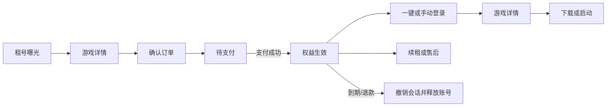

# 【Prd】《盖世游戏 Mac》游戏租号需求

## 一、版本信息

| 时间 | 版本 | 变更人 | 主要变更内容 | 备注 |
|---|---|---|---|---|
| 2025.01.05 | V1.0 | 卢浩 | 创建游戏租号原始需求 | 历史版本 |
| 2026.07.14 | V2.0 | 郑群超 | 重构 C 端、B 端、订单售后和统计需求 | 评审稿 |
| 2026.07.14 | V2.1 | 郑群超 | 补充埋点、运营准备和上线门槛 | 评审稿 |
| 2026.07.15 | V2.2 | 郑群超 | 增加3天无理由、退款风控、设备环境和游戏时长 | 评审稿 |
| 2026.07.17 | V2.3 | 郑群超 | 增加临期提醒、续租、到期回收和操作记录 | 评审稿 |
| 2026.08.12 | V4.2 | 郑群超 | <mark>按 /to-prd 标准格式精简正文，保留 C/B 端大表格、服务端规则、埋点、验收和自检</mark> | 当前评审稿 |
| 2026.08.12 | V4.3 | 郑群超 | <mark>售后详情改为三阶段进度弹窗，处理中支持撤销售后；补充跨端统一口径</mark> | 当前评审稿 |

> 交互基准：[Mac 端租号功能标注版 Demo](https://z36358631-ship-it.github.io/-/Mac%E7%AB%AFdemo/mac%E7%AB%AF%E7%A7%9F%E5%8F%B7%E5%8A%9F%E8%83%BD/Mac%E7%AB%AF%E7%A7%9F%E5%8F%B7%E5%8A%9F%E8%83%BD-%E6%A0%87%E6%B3%A8%E7%89%88.html)。本文只保留当前规则，历史年度/永久会员、多版本新购、账号分配中、5分钟提醒等方案不再执行。

> **跨端功能一致性：**除布局、Steam 登录承载方式和支付展示差异外，APP 与 Mac 共用同一业务规则；会员套餐为周卡、月卡、季卡，租期采用15分钟单次提醒，双端均提供租号介绍与一致的订单、售后状态动作。

---

## 二、背景与目标

### 2.1 需求背景

高价单机游戏的购买门槛较高，传统租号又需要用户自行处理账号、密码和验证码。盖世游戏需要在 Mac 内完成选购、支付、登录、启动、到期和售后闭环，同时控制账号越权、资源并发和凭据泄露风险。

### 2.2 产品目标

1. 用户在盖世游戏内完成“发现 → 选权益 → 支付 → 登录 → 下载/启动 → 续租、到期或售后”。
2. 支付成功后即可使用，不向客户端展示账号或资源分配过程。
3. 订单清楚展示版本、租期、有效期、金额和当前可执行操作。
4. 后台统一管理商品、会员游戏库、账号库存、订单、售后和统计，并区分 APP 与 Mac 配置。

### 2.3 核心挑战

1. 支付、权益生效和账号资源的一致性。
2. Steam 及第三方登录信息的短时授权与回收。
3. 首次体验、时租、永久和会员权益的互斥与优先级。
4. 到期强退、续租、退款和资源释放的并发处理。
5. 历史订单按快照履约，不受后续调价或下架影响。

### 2.4 本期范围

- 租号曝光、搜索、游戏详情和确认订单。
- 热门游戏时租；非热门游戏首次体验、单游戏永久和会员。
- 会员中心、会员游戏库、订单中心、订单详情和退款进度。
- Steam 一键上号、手动登录、第三方登录信息和目标游戏限制。
- 15分钟临期提醒、续租、到期回收、售后申请与撤销。
- 商品、会员、账号、订单、售后、统计、灰度和操作记录后台。

### 2.5 本期不包含

- 用户自主出租账号。
- 新支付渠道和永久会员。
- 标准版以外的新订单版本选择。
- 客户端“账号分配中”“资源分配中”等内部状态。
- CDKEY 卡密、激活和发货流程。

---

## 三、故事介绍

### 3.1 用户与运营场景

1. **热门游戏时租**：用户选择2—23小时、日租或周租，支付后登录并进入游戏详情，自行下载和启动。
2. **非热门游戏**：新用户可选首次体验2小时、单游戏永久或开会员；首次体验使用后默认单游戏永久。
3. **账号无感分配**：用户每次启动时由系统自动准备可用账号，不看到中间分配状态。
4. **售后处理**：用户提交问题后返回订单详情；点击“售后详情”弹出三阶段售后进度，处理中可撤销，退款完成后立即回收会话和凭据。
5. **运营配置**：运营分别维护 APP、Mac 商品和会员配置，历史订单继续按支付时快照履约。

### 3.2 价值分析

- 用户用更低成本体验游戏，减少登录操作，遇到问题有明确售后入口。
- 平台新增租号、单游戏永久和会员收入，并提升账号库存利用率。
- 运营可在同一后台管理商品、资源、订单、退款和业务效果。

### 3.3 核心体验路径

**主链路：** 发现可租游戏 → 游戏详情 → 租号开玩 → 确认订单 → 支付 → 登录 → 游戏详情 → 下载/启动。

**订单链路：** 订单中心 → 订单详情 → 登录游戏、续租、查看登录信息或申请售后。

**到期链路：** 剩余15分钟提醒 → 续租则顺延 → 未续租则到期结束、撤销会话、轮换凭据并释放账号。

### 3.4 产品指标

1. 租号曝光到详情点击率。
2. 详情到支付成功转化率。
3. 支付成功到登录、启动成功率。
4. 会员开通率、续费率和会员游戏启动率。
5. 账号使用率、复用率、售后率和退款率。

### 3.5 路径规划

- **本期**：完成标准版租号、单游戏永久、会员、登录、订单、售后和后台闭环。
- **后续**：根据数据评估更多游戏平台、游戏版本和用户出租能力，不在本期预先上线。

---

## 四、概要设计

### 4.1 模块设计

| 端别 | 业务模块 | 本期能力 | 优先级 |
|---|---|---|---|
| C 端 | 发现与选购 | 租号状态、价格、权益方案、确认订单 | P0 |
| C 端 | 会员 | 套餐、支付、有效期、会员游戏库 | P0 |
| C 端 | 登录与启动 | 一键/手动登录、登录信息、目标游戏限制 | P0 |
| C 端 | 订单与售后 | 订单列表/详情、续租、售后、退款进度 | P0 |
| B 端 | 商品与会员 | 售卖模式、价格、会员套餐和游戏库 | P0 |
| B 端 | 账号与订单 | 库存、占用、履约、售后和退款 | P0 |
| B 端 | 统计与审计 | 漏斗、库存、退款、灰度和操作记录 | P1 |

```mermaid
flowchart LR
    A[租号曝光] --> B[游戏详情]
    B --> C[确认订单]
    C --> D[待支付]
    D -->|支付成功| E[权益生效]
    E --> F[一键或手动登录]
    F --> G[游戏详情]
    G --> H[下载或启动]
    E --> I[续租或售后]
    E -->|到期/退款| J[撤销会话并释放账号]
```

### 4.2 详细设计（C端）

功能 Demo：[Mac 端租号功能标注版](https://z36358631-ship-it.github.io/-/Mac%E7%AB%AFdemo/mac%E7%AB%AF%E7%A7%9F%E5%8F%B7%E5%8A%9F%E8%83%BD/Mac%E7%AB%AF%E7%A7%9F%E5%8F%B7%E5%8A%9F%E8%83%BD-%E6%A0%87%E6%B3%A8%E7%89%88.html)

|模块名称|图示|展示与交互说明|
|---|---|---|
|租号发现与曝光|  |① 商品上架、权益有效且租号服务可用时展示租号信息；否则只保留原游戏内容。 ② 展示优先级：`已租号 > 可畅玩 > ¥X.X租号`。多个可购方案显示最低有效价；不展示剩余时长和权益来源。 ③ 发现和搜索金额保留1位小数；资格或价格未知时不猜价。Mac 卡片和搜索沿用原布局，搜索条目无按钮，点击整条进详情。 ④ 搜索支持游戏名模糊匹配、清空和无结果；租号摘要失败不清空普通游戏结果。|
|游戏详情与操作互斥||① 更多和秒玩保持独立；交易操作按状态展示。可买可租时显示“立即购买、租号开玩”；免费获取时只显示“获取游戏”；已有权益时不重复售卖。 ② 点击“租号开玩”直接进确认订单，详情不选权益或租期。 ③ 页面可用缓存展示，点击操作时重新校验权益、订单、账号和目标游戏；校验失败保留详情并给出可执行提示。|
|权益选择与计价|—|① 游戏由后台固定为热门或非热门。热门只售按小时、日租、周租；小时支持2—23小时，默认2小时，并提供6、12、23小时快捷项。 ② 非热门只售“首次体验·2小时、单游戏永久、开会员畅玩”；首次体验为全平台终身1次，支付成功即核销和计时。 ③ 首次体验使用后隐藏，默认单游戏永久，永久和会员等宽；体验期间仍可购买永久或会员。 ④ 首期只售标准版，商品名写“游戏名 - 标准版”，无版本选择器；历史版本订单按快照履约。 ⑤ 切换权益或租期后由服务端重新计价，返回前禁用提交；价格变化时确认新价格后才能下单。|
|确认订单与支付| |① 商品区展示封面和“游戏名 - 标准版”；权益方案、租期和快捷项统一在本页。 ② 首屏展示100%正版、一键启动、永不顶号、存档无忧、3天无理由；“租号权益”和“租号介绍”同一行，点击说明作用、用法和注意事项。 ③ 套餐后依次展示游戏原价、订单金额和支付方式；底部为“需支付 ¥X.XX / 立即购买”，订单金额与需支付同源。 ④ Mac 支持支付宝、微信支付、二维码；不展示协议、租赁信息和当前报价。横屏左侧商品与权益，右侧套餐、金额、支付和主操作，支付须在首屏。 ⑤ 创单前复验资格、SKU、价格版本、库存和地区。待支付锁价30分钟；结果未知查询原订单，不重复创单、扣款或核销资格。|
|个人中心与会员中心| |① 个人中心在用户名同行显示“未开通”或会员有效期和进入箭头。 ② 每个客户端会话首次进入会员中心弹出“关于会员”：30W+正版库存、开通后不退款、工作时间远程协助、共享 Steam 正版账号且一号一游戏；同一会话不重复。 ③ 页面顺序为会员价值、会员权益、套餐、支付方式、会员游戏库、常见问题。权益只保留会员库畅玩、游戏更新、个人云存档同步。 ④ 套餐为周卡、月卡、季卡，默认周卡，无推荐角标。已开通展示有效期；续费从当前到期时间顺延，已过期从支付成功重新计时。|
|会员游戏库||① 会员中心预览4款并提供“查看更多”；横屏不为凑满整行拉伸卡片。 ② 卡片只显示游戏名和灰色“标准版”，不显示“支持云存档”。 ③ 完整库支持名称模糊搜索、清空、失败重试和“未找到相关会员游戏”空状态，不展示常见问题。 ④ 游戏暂不可用时保留会员有效期并提示稍后重试，不自动退款或延长会员。|
|登录方式、凭据与启动|  |① 支持一键上号和手动登录；Demo 一键只演示成功，不显示分配中。两种方式成功后均进对应游戏详情，用户自行下载、启动；查看凭据不算登录成功。 ② Steam 竖向窗口二维码在账号密码上方，横向为双栏；移除底部令牌提示。部分游戏按配置增加 Rockstar Games 等第三方账号、密码和验证码。 ③ 订单“登录信息”打开独立弹窗，Steam 顶栏入口打开凭据浮层；两者共用当前绑定账号和未过期验证码，不重复取号。 ④ 每次查看、复制或取验证码前重新校验用户、设备、订单、游戏和有效期；短时授权最长5分钟且不超过订单有效期。 ⑤ 复制后60秒条件清理；退后台、到期、退款、换号或结束时立即清理并撤销授权。敏感值不得进入 Toast、日志、埋点、导出或截图。 ⑥ 租赁账号操作非目标游戏时拦截，可返回目标游戏、切换个人账号或去租号，原订单不受影响。|
|游戏库与平台账号状态||① 游戏库展示当前权益、安装状态和操作，不展示账号分配中。 ② 租赁账号标识为“租/盖世租号账号”，个人会话显示个人 Steam 账号；切换后刷新权限。 ③ 有效使用单显示有效期；超过24小时显示“X天X小时”。到期保留安装包、设置和个人存档。 ④ 每次启动由服务端无感准备账号；无资源时，时租/体验进入退款，永久/会员保留权益并提示稍后重试。|
|用户订单与详情|  |① 订单中心为“全部订单、待支付、可使用”，默认按创建时间倒序；搜索当前 Tab 内的游戏名或订单号，返回保留 Tab、关键词和位置。 ② 列表右上显示状态，下面显示金额；游戏名下为“标准版 · 租期”，下一行显示有效期；待支付改为支付截止，历史订单保留有效期快照。 ③ 详情展示订单号、状态、版本、租期、有效期/支付截止、金额和支付方式，操作固定底部；列表不显示申请售后。 ④ 待支付可取消/继续支付；租赁中可登录、查看登录信息、续租、申请售后/售后详情；退款订单可看退款进度；终态有权益则可畅玩，否则租号开玩。 ⑤ 首次体验不可续租；未到期时租可续租，支付成功在原有效期上顺延，结果未知查询原续租单。|
|临期提醒、续租与到期|  |① 服务端有效期为唯一时钟；每个使用单仅在剩余15分钟首次命中时提醒1次，不设5分钟和1分钟。 ② 休眠或断网恢复后重算；错过15分钟但仍有效可补发1次，已到期直接结束。 ③ 续租成功顺延原有效期；未续租则到期结束游戏、撤销会话、轮换凭据并释放账号。 ④ 到期后再次启动先查新权益；有权益正常启动，无权益进入租号确认订单，不恢复旧订单。|
|售后申请与退款进度|  |① 申请售后只在租赁中订单详情展示；问题类型为启动失败、Steam登录失败、账号异常/频繁掉线、其他问题，描述必填。 ② 提交成功后关闭申请页、返回订单详情、提示“售后申请已提交”，入口变“售后详情”；不自动进退款进度。失败时保留输入，结果未知查询原申请。 ③ 点击“售后详情”原地弹出“售后进度”，展示“售后申请已提交 / 平台处理中 / 处理完成”三阶段；处理中可“撤销售后”，处理完成后只保留关闭。撤销成功关闭弹窗、返回详情、提示已撤销并恢复申请入口。提交和撤销均幂等。 ④ 退款进度为提交申请、人工审核、原路退款、完成；退款成功后回收会话、凭据和账号，回收失败不回滚退款。|
|3天无理由退款||① 3天无理由是订单权益，不是套餐或售后问题类型。当前口径为支付后72小时内且目标游戏成功运行不超过30分钟。 ② 资格在支付时保存快照，规则修改不追溯历史订单。 ③ 点击租号前检查高频退款；命中后确认继续则本单无理由资格不可用，但履约售后保留。查询失败时阻止创单，不默认授予或取消资格。|

### 4.3 详细设计（B端）

|模块名称|图示|展示与交互说明|
|---|---|---|
|租号商品与权益管理||① 管理游戏、标准版、热门/非热门模式、权益方案、价格版本、地区、端别、库存摘要和上下架。 ② 热门只允许2—23小时、日租、周租；非热门只允许首次体验、单游戏永久和会员入口。首次体验固定为全平台终身1次。 ③ 支持游戏名、状态查询，新建、复制、改价和上下架；改价、模式切换和下架只影响新订单，高风险操作二次确认并记日志。|
|会员游戏库管理|—|① 独立管理会员可玩游戏，展示游戏、标准版、状态、配置版本、库存、加入时间、更新人和时间。 ② 支持游戏名/ID、Steam AppID和状态查询，以及加入、启停、移出；加入校验唯一性和库存。 ③ 停用或移出只阻止后续新取号，进行中的使用单继续履约。|
|会员套餐管理|—|① 套餐固定为周卡、月卡、季卡，展示名称、价格、权益文案、排序、状态和版本。 ② 默认周卡不属于后台推荐标签；不提供年度和永久会员。 ③ 保存生成新配置版本；已支付订单保存套餐快照，后续改价或下线不改历史订单。|
|租号功能外放设置||① 配置功能启停、地区、灰度比例和端别；失败或超时继续使用上一有效版本。 ② 用户登录、回前台、进入交易页和支付前刷新资格；地区未知或未命中时不展示新交易入口，已有权益继续履约。 ③ 保存前校验并二次确认，并发旧版本拒绝；记录操作人、前后值、版本、结果和请求号。|
|Steam 账号资源与库存||① 展示脱敏账号、平台、目标游戏、可租/占用/异常/离线、使用单和最近检测。 ② 支持查询、同步、健康检查、下架、换号和回收；同一账号最多绑定一个有效使用单。 ③ 无替代库存时保留原绑定；第三方同步异常空集时保留上次正常快照。凭据密文保存且不进列表、日志或导出。|
|订单履约管理||① 支持订单号、用户、游戏、状态、时间和端别组合查询，默认创建时间倒序。 ② 列表与详情展示支付、权益、标准版、租期、有效期、启动、设备、售后和回收结果。内部准备或回收状态不得映射为客户端分配中。 ③ 换号、补偿、结束订单需权限、二次确认和原因；超时查询原结果。导出使用脱敏数据并记录任务。|
|售后申请与退款处理||① 展示问题类型、原始描述、提交/撤销时间、启动结果、游戏时长、诊断、资格和状态。 ② 支持审核、拒绝和退款；进入退款中后不可撤销，同一售后只产生一笔渠道退款。 ③ 退款成功后回收会话、凭据和账号；失败时订单仍为已退款，账号转异常并生成待处理项。|
|租号效果统计||① 展示曝光、详情、创单、支付、登录、启动、续租、会员、售后和退款漏斗，以及库存、使用率和复用率。 ② 支持时间、游戏、权益、地区和端别筛选；指标与交易对账同口径。 ③ 分母为0显示“--”；数据延迟展示最近更新时间，不用0代替未知值。|
|权限、操作审计与风控| |① 商品、价格、库存、退款、换号、补偿、灰度和导出按角色授权。批量操作逐项返回结果，不回滚已成功项。 ② 操作记录保存操作人、端别、对象、前后值、原因、时间、请求号、结果和失败码，不可改删。 ③ 风控支持开关、滚动天数、退款笔数阈值和规则版本；修改只影响新订单。|

**B端通用规则：** 除操作记录外，每个业务页增加“APP / Mac”Tab，默认 APP，两端配置独立；操作记录以端别筛选。多个条件按“且”查询；查询、排序和端别变化回第1页；重置清空条件；失败保留条件并可重试；从详情返回时保留筛选、页码和滚动位置。

### 4.4 服务端公共规则与状态

#### 4.4.1 可租判定

1. 新订单可租需同时满足：功能开放、地区可用、商品上架、权益方案有效、价格有效、用户资格通过且资源可履约。
2. 发现页可短时缓存摘要；进入确认订单、创单、支付和启动时必须重新校验。
3. 已支付永久或会员权益不因商品下架失效；目标游戏暂时无资源时保留权益并告警。

#### 4.4.2 权益判定、资格核销与订单锁价

1. 权益判定顺序为：有效租赁 → 单游戏永久 → 有效会员且游戏在会员库 → 无权益。客户端只展示服务端判定结果。
2. 首次体验资格按盖世游戏账号全平台唯一；支付成功时核销，重复支付回调不得重复核销。
3. 待支付订单锁定SKU、租期、游戏原价、订单金额、币种、价格版本和资格快照30分钟。
4. 锁价期内后台调价不改原订单；资格失效、商品下架或地区关闭时禁止继续支付，并关闭原订单。
5. 单游戏永久和会员支付成功后立即生效；已有首次体验订单不延长、不重置，也不阻止新权益生效。

#### 4.4.3 订单状态

| 客户端状态 | 允许流转 | 可执行操作 |
|---|---|---|
| 待支付 | 租赁中、已结束 | 取消、继续支付 |
| 租赁中 | 退款中、已结束 | 登录、续租、售后 |
| 退款中 | 已退款 | 查看进度 |
| 已退款 | 终态 | 查看进度、重新租用 |
| 已结束 | 终态 | 重新租用 |

售后状态：`未申请 → 已提交/审核中 → 已撤销 | 已拒绝 | 退款中 → 已退款`。非法流转拒绝并告警。

#### 4.4.4 幂等与一致性

1. 创单、支付回调、首次体验资格消耗、会员续费、时租续租、售后提交/撤销、退款、换号和释放均使用业务幂等键。
2. 超时或结果未知时先查询原请求，仅在确认未受理后重试。
3. 支付成功、权益生效和首次体验资格消耗在同一业务事务内完成。
4. 退款成功但回收失败不回滚退款；通过异常库存和补偿任务继续处理。

#### 4.4.5 关键返回字段

| 业务对象 | 客户端所需信息 |
|---|---|
| 租号摘要 | 展示状态、最低金额、在租数、是否可进入确认订单 |
| 计价结果 | 游戏、标准版、权益方案、租期、原价、订单金额、币种、价格版本、失效时间 |
| 订单 | 订单号、状态、版本、租期、支付截止、有效期、金额、支付方式、允许操作 |
| 会员 | 开通状态、套餐、开始时间、有效期、允许续费状态 |
| 售后 | 问题类型、描述、提交时间、状态、是否可撤销、退款进度 |

敏感凭据通过独立短时授权接口返回，不进入订单和通用详情响应。

#### 4.4.6 首次体验到期与权益切换一致性

1. 服务端时间为租期唯一口径；客户端本地倒计时只用于展示。
2. 首次体验到期前购买单游戏永久或会员，新权益支付成功后立即接管后续使用；首次体验订单仍按原有效期结束。
3. 首次体验到期且无新权益时，结束目标游戏并执行资源回收；再次启动按当前权益重新判断。
4. 时租续租成功后原订单有效期精确增加所选时长，订单、账号、游戏和版本不变。
5. 原订单已到期、已退款或资源存在不可续冲突时阻止续租，不改变原绑定。
6. 到期回收不删除安装包、设置和个人存档。

#### 4.4.7 登录信息短时授权与凭据回收

1. “登录游戏”负责执行一键或手动登录；订单“登录信息”只展示凭据，两者共用当前使用单，但查看凭据不判定登录成功。
2. 每次打开、查看、复制或获取验证码前校验用户、设备、订单归属、状态、有效期、目标游戏和账号绑定。
3. 授权绑定当前用户、设备、订单、游戏和会话，最长5分钟且不超过订单有效期；接口按操作返回最少字段。
4. 账号和密码默认遮罩；验证码按第三方生命周期返回并限频。弱网、超时和错误提示不得回显敏感值。
5. 复制敏感值60秒后仅在剪贴板仍等于该值时清除；用户已复制其他内容时不得覆盖。
6. 退后台、退出账号、到期、退款、换号或结束租期时，客户端清理敏感视图，服务端撤销授权。
7. 资源回收顺序为撤销会话、轮换凭据、释放账号；任一步失败时账号转异常库存并告警，旧授权不得继续使用。

### 4.5 边界条件与异常处理

| 场景 | 处理 | 用户结果 |
|---|---|---|
| 价格变化 | 阻止旧价支付并重新计价 | 价格已更新 |
| 待支付超时 | 关闭订单并释放锁定资源 | 订单已取消 |
| 支付结果未知 | 查询原订单 | 正在确认支付结果 |
| 时租支付成功但无资源 | 进入退款处理 | 可查看退款进度 |
| 永久/会员启动无资源 | 保留权益并告警 | 当前资源繁忙，请稍后重试 |
| 登录授权失效 | 关闭敏感内容 | 登录信息授权已失效 |
| 非目标游戏 | 阻止获取、下载和启动 | 返回目标游戏、切换账号或去租号 |
| 售后重复提交/撤销 | 返回原结果 | 不创建重复申请 |
| 退款成功但释放失败 | 保持已退款，账号转异常 | 退款结果不受影响 |
| 会员库搜索无结果 | 保留关键词 | 未找到相关会员游戏 |

### 4.6 非功能需求

| 类型 | 要求 |
|---|---|
| 性能 | 租号摘要 P95≤500ms；计价和创单 P95≤1s；后台常规查询 P95≤2s |
| 稳定性 | 支付、续租、售后、退款和释放支持重复请求与补偿 |
| 安全 | 凭据加密保存；页面、日志、埋点和导出无明文凭据 |
| 权限 | 高风险操作按角色授权并完整审计 |
| 时间金额 | 时间使用带时区时间戳；金额按最小货币单位计算 |
| 兼容性 | 目标 Mac 窗口尺寸下无文字遮挡、按钮溢出和操作重叠 |

---

## 五、交付设计（数据分析、埋点与验收）

### 5.1 核心业务指标

| 分类 | 指标 |
|---|---|
| 转化 | 曝光、详情、创单、支付、登录、启动转化率 |
| 交易 | 支付订单量、金额、客单价、续租率、会员开通与续费率 |
| 库存 | 可租、占用、异常、使用率、复用率 |
| 售后 | 售后率、退款率、撤销率、审核与退款时长 |
| 质量 | 登录成功率、启动成功率、凭据回收失败数 |

### 5.2 埋点事件表

| 事件 ID | 触发时机 | 关键参数 |
|---|---|---|
| `rental_offer_exposure` | 租号状态进入可见区 | `game_id`, `scene`, `display_state`, `amount` |
| `rental_checkout_view` | 进入确认订单 | `sale_mode`, `sku_id`, `rent_duration` |
| `rental_order_create_result` | 创单返回结果 | `order_id`, `result`, `error_code` |
| `rental_payment_result` | 支付返回结果 | `order_id`, `amount`, `result` |
| `rental_login_result` | 一键或手动登录返回结果 | `login_type`, `result`, `error_code` |
| `rental_launch_result` | 目标游戏启动返回结果 | `order_id`, `game_id`, `result` |
| `rental_renewal_result` | 续租返回结果 | `order_id`, `renewal_order_id`, `result` |
| `rental_after_sales_submit` | 售后提交返回结果 | `order_id`, `reason_code`, `result` |
| `rental_after_sales_withdraw` | 售后撤销返回结果 | `order_id`, `result` |
| `rental_refund_result` | 退款和回收返回结果 | `refund_result`, `recycle_result` |
| `membership_plan_purchase_result` | 会员开通或续费返回结果 | `plan`, `new_expire_at`, `result` |
| `member_library_search` | 搜索或清空会员游戏库 | `keyword_length`, `result_count` |

### 5.3 埋点参数表

| 参数 | 类型 | 说明 |
|---|---|---|
| `sale_mode` | string | 热门时租或非热门权益方案 |
| `display_state` | string | 已租号、可畅玩、租号价格 |
| `rent_duration` | int | 租期秒数 |
| `amount` | int | 最小货币单位金额 |
| `result` | string | 成功、失败、结果未知 |
| `error_code` | string | 服务端错误码，仅用于排查 |

凭据、授权令牌、验证码和售后描述全文不得上报。

### 5.4 核心验收标准

| 编号 | 验收标准 |
|---|---|
| AC-01 | 热门只售时租；非热门只售首次体验、单游戏永久、会员。 |
| AC-02 | 首次体验2小时、全平台终身1次，从支付成功计时。 |
| AC-03 | 首期新订单只售标准版，列表和详情均显示版本。 |
| AC-04 | 方案、租期、订单金额和需支付同步；展示1位小数，结算2位。 |
| AC-05 | 确认订单首屏显示五项权益，租号介绍和3天无理由说明可打开。 |
| AC-06 | 会员默认周卡、无推荐标签，开通后显示有效期并可续费顺延。 |
| AC-07 | 订单列表和详情显示版本、租期、有效期/支付截止和金额。 |
| AC-08 | 一键和手动登录成功进入游戏详情，客户端无分配中状态。 |
| AC-09 | 登录信息遵守短时授权、最少返回、限频、清理和日志禁入。 |
| AC-10 | 售后提交后切换为售后详情；处理中可撤销并恢复申请入口。 |
| AC-10A | 点击“售后详情”弹出三阶段售后进度；处理中显示“撤销售后”，完成后不可撤销。 |
| AC-11 | 临期只提醒15分钟1次；到期、退款和结束均回收会话与凭据。 |
| AC-12 | 创单、支付、续租、售后、退款和释放重复请求结果唯一。 |
| AC-13 | 后台业务页支持 APP/Mac Tab 且默认 APP，两端配置互不覆盖。 |

### 5.5 上线监控与告警

1. 监控创单、支付、登录、启动、续租、退款和资源释放成功率及耗时。
2. 监控可租库存、异常账号、资源不足订单和回收失败积压。
3. 监控首次体验资格重复消耗、重复扣款、重复退款和订单状态非法流转。
4. 监控售后待处理量、审核超时、退款状态滞留和风控查询失败率。

---

## 六、运营需求

### 6.1 权益、定价与会员游戏库

| 事项 | 当前规则/待确认 |
|---|---|
| 热门游戏 | 固定清单；只售时租 |
| 非热门游戏 | 首次体验2小时、单游戏永久、会员 |
| 会员套餐 | 周卡、月卡、季卡；正式价格待确认 |
| 展示金额 | 发现1位小数，结算2位 |

### 6.2 账号资源、采购与供应方

1. 上线前完成首发游戏账号采购、权益校验、登录、下载、启动、换号和回收抽检。
2. 明确供应方结算、异常账号替换、库存同步频率和紧急下架机制。
3. 账号来源与 Steam 平台条款通过商务、法务评审后才能正式放量。

### 6.3 退款权益、合规与财务

1. 确认3天无理由的72小时、30分钟游戏时长和不可退款场景。
2. 确认高频退款默认阈值、提示文案和规则留痕。
3. 完成支付、退款、优惠、供应方结算和差错处理全链路对账。
4. 明确国内、海外支付渠道、币种、税费和合规范围。

### 6.4 客服、内容与上线运营

1. 准备四类售后问题的审核、拒绝、退款、换号和人工升级 SOP。
2. 统一租号说明、会员说明、3天无理由、风险拦截和常见问题口径。
3. 配置支付、库存、登录、启动、售后、退款和回收告警责任人。

### 6.5 上线前运营检查清单

| 检查项 | 通过标准 |
|---|---|
| 商品与价格 | 首发游戏、权益方案、价格和上下架已复核 |
| 会员 | 套餐价格、会员游戏库和说明已复核 |
| 账号资源 | 首发库存及登录、启动、换号、回收抽检通过 |
| 售后与合规 | 3天无理由、风控和客服 SOP 通过评审 |
| 支付与财务 | 支付、退款和结算对账一致 |
| 灰度与告警 | 放量、暂停、回滚和值班演练通过 |

---

## 七、评审项

### 7.1 本次评审需确认

1. **运营/财务**：周卡、月卡、季卡及单游戏永久正式价格。
2. **运营/资源**：首批热门游戏、会员游戏库和账号库存。
3. **法务/客服**：3天无理由、高频退款、虚拟会员不退款和远程协助口径。
4. **客户端/服务端**：登录成功跳转、无感取号、目标游戏拦截、到期回收和补偿方案。
5. **海外业务**：支付渠道、币种、税费及地区开放范围。

---

## 八、来自功能上线后的更新

### 8.1 上线后记录

上线后的数据表现、异常案例和规则调整统一追加在本节。历史订单继续按创单和支付时保存的价格、资格、版本及规则快照处理。

---

## 附录 A、飞书文档导入说明

1. 本文为标准 Markdown，可直接导入飞书。
2. 图示均使用固定 Git 提交 SHA 的公开 HTTPS 地址，不引用本地路径或浮动分支。
3. 图示仅作交互位置参考，最终业务规则以 V4.2 正文和当前 Demo 为准。

## 附录 B、/to-prd 自检记录

### B.1 范围确认

- 端别：C端+B端。
- 地区：国内、海外共用租号服务端规则；支付渠道、币种、税费和合规范围按地区配置。

### B.2 自查清单命中结果

已覆盖列表排序、分页与返回保留、搜索范围、空状态、加载失败、输入校验、状态流转、操作反馈、时间格式、金额精度、后台权限、登录态、敏感数据、弱网、并发、埋点和灰度。

### B.3 不适用项

- 本期无用户图片或文件上传，不适用上传格式、大小、审核和预览规则。
- 本期无内容发布和分享，不适用敏感词、内容审核和分享渠道规则。
- Mac 端不涉及 APP 国内/海外登录方式、云游戏和实名认证差异。

### B.4 模拟评审结果

|角色|结论|结果|
|---|---|---|
|前端开发|通过|C端入口、状态、操作、跳转和异常已集中在4.2大表格。|
|测试工程师|通过|状态、幂等、授权、到期、售后撤销和回收失败均有验收口径。|
|运营/业务方|待确认|正式价格、首批游戏、退款规则、风控阈值和海外支付需上线前确认。|
