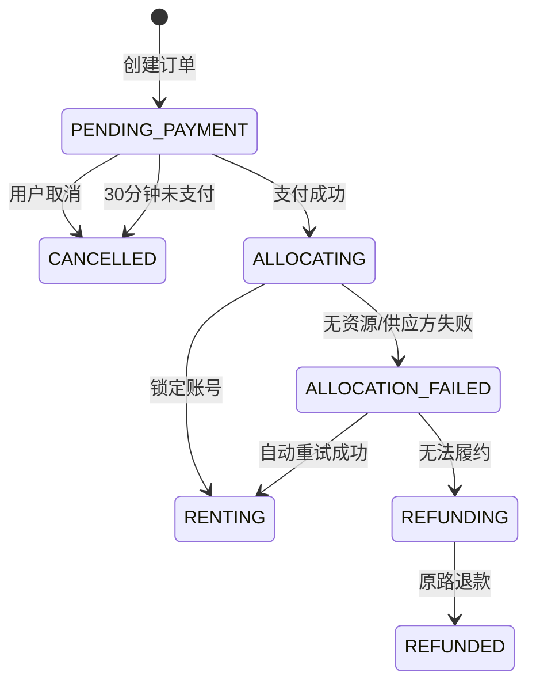

# F003 下单支付与资源锁定

> 状态：评审稿 | 优先级：P0 | 业务域：交易
> 内容来源：最新 Demo“确认订单”、支付确认和支付后回跳（提交 `35c72ea5`）

## 1. 功能概述与用户价值

将用户选择的游戏、版本和套餐转换为 30 分钟有效的待支付订单。支付成功后锁定同游戏同版本账号，返回游戏详情并允许下载目标游戏。

## 2. 范围、前置条件与依赖

- 范围：服务端计价、首单优惠、创单、支付、超时取消、资源锁定和支付后回跳。
- 依赖：[F002](F002-游戏详情与版本租期.md)、[F007](F007-账号资源管理.md)、[F011](F011-3天无理由退款与风控.md)、支付宝、微信支付。

## 3. 状态流转



## 4. 通用业务规则

1. `[已确认]` 页面标题为“确认订单”。
2. `[已确认]` 支持支付宝和微信支付。
3. `[已确认]` 待支付时限为 30 分钟，列表在有效期下方显示“请在 XX:XX 分钟内支付”。
4. `[已确认]` “游戏原价”和“订单金额”标题均为白色，游戏原价金额使用普通灰色、不划线且与实付价按右边缘对齐；首单 5 折标签使用绿色底白字并紧跟“订单金额”，红色放大实付价在左，其右侧只展示灰色划线金额，不展示“标准租价”或计价说明副文案；最终金额由服务端返回。
5. `[已确认]` 支付成功后返回游戏详情，目标游戏未下载时按钮变为“下载 XXM”。
6. `[已确认]` 支付成功的新订单启动结果为“未启动”。
7. `[已确认]` “模拟支付完成”只属于 Demo，不进入正式产品容器或正式需求。
8. `[推导]` 首单资格以用户历史已支付租号订单为准；取消和退款是否恢复资格由活动配置决定。
9. `[建议方案]` 支付成功但资源锁定失败时自动重试；仍失败则原路退款并告警。
10. `[已确认]` 普通非首单、续租和到期后的重新租用均不展示首单标签或划线租赁价，按标准租赁价结算。

## 5. 客户端需求

1. 展示游戏、版本、套餐、小时数、游戏原价、标准租价、优惠、应付金额、支付方式和服务协议；左侧游戏卡片仅展示封面和游戏名，价格信息集中在右侧；四类订单状态不得混用价格层级。
2. 进入支付后按服务端时间显示倒计时；回到前台时重新校准。
3. 防重复提交；网络超时用同一幂等键查询/重试。
4. `PRICE_CHANGED` 时展示新金额并要求用户重新确认。
5. 支付状态不确定时查询订单，不创建第二笔订单。
6. 支付并锁定成功后更新 Steam 会话为租赁会话，回到对应游戏详情。

## 6. 服务端需求

1. 创单校验用户、商品、版本、套餐、小时数、价格版本、活动资格和库存。
2. 保存原价、标准租号价、优惠金额、应付金额、无理由退款资格快照、风控规则版本和计价版本。
3. 创单幂等键为 `userId + idempotencyKey`；支付回调按渠道交易号幂等。
4. 待支付任务在 30 分钟后关闭订单并失效支付凭证。
5. 资源占用使用条件更新，确保一个账号只绑定一个有效订单。
6. 支付、资源锁定和退款通过状态机与补偿任务保持最终一致。
7. 服务端明确返回 `isFirstOrder`、`rentalListPrice`、`discountAmount` 和 `payAmount`；只有首单新租订单允许 `discountAmount > 0`，续租和重新租用不核销首单优惠。

## 7. 端到端契约

`[建议方案]`

```http
POST /rental/orders
Idempotency-Key: 1c4100d8
```

```json
{
  "skuId":"er-standard",
  "packageCode":"hour",
  "hours":2,
  "priceVersion":"pv-20260714-01",
  "promotionCode":"FIRST_ORDER_HALF"
}
```

```json
{
  "orderId":"GS20260714001",
  "status":"PENDING_PAYMENT",
  "originalGamePrice":298,
  "rentalListPrice":6,
  "discountAmount":3,
  "payAmount":3,
  "paymentExpiresAt":"2026-07-14T19:00:00+08:00",
  "launchResult":"NOT_STARTED"
}
```

## 8. 埋点、日志与监控

- `rental_order_submit`、`rental_payment_method_select`、`rental_payment_result`、`rental_payment_timeout`。
- 监控创单成功率、支付成功率、首单优惠核销异常、支付后锁定成功率、支付成功无资源订单和超时任务积压。

## 9. 验收标准

- `AC-F003-01 [端到端]` 待支付订单在 30 分钟后自动取消，不能继续支付。
- `AC-F003-02 [服务端]` 相同幂等键重复创单返回同一订单。
- `AC-F003-03 [服务端]` 支付回调重复 10 次只入账和锁定一次。
- `AC-F003-04 [端到端]` 支付成功后回到游戏详情并显示下载或启动动作。
- `AC-F003-05 [服务端]` 新订单启动结果为 `NOT_STARTED`。
- `AC-F003-06 [端到端]` 首单 5 折只对符合资格的用户生效，金额快照可追溯。
- `AC-F003-07 [客户端]` 正式构建中不出现“模拟支付完成”。
- `AC-F003-08 [客户端]` 两个价格标题均为白色，游戏原价金额为普通灰色且与实付价按右边缘对齐，左侧卡片不展示原价；首单标签为绿色底白字并紧跟订单金额，红色实付价在左，其右侧只显示灰色划线金额，无“标准租价”或计价说明副文案。
- `AC-F003-09 [端到端]` 普通非首单、续租和重新租用不显示首单标签或划线租赁价，服务端应付金额等于标准租赁价。

## 10. 未决项与变更记录

- 运营需冻结首单资格恢复规则和活动预算。
- `2026-07-14`：补充 30 分钟待支付、支付后回详情、首单 5 折和启动初始状态。
- `2026-07-17`：明确首单、普通非首单、续租和重新租用四种价格展示与结算口径。
