# 【PRD】盖世游戏Mac端\-iOS应用与IPA资源库

## 一、版本信息

|时间|版本|变更人|主要变更内容|备注|
|---|---|---|---|---|
|2026\.07\.21|V1\.0|郑群超|创建文档||
|2026\.07\.23|V1\.1|郑群超|根据需求评审结论，调整游客及启动页入口、本地 IPA 单文件导入、来源二级选择、单槽位下载和键盘映射授权 //2026.7.23修改|2026.7.23修改|

## 二、背景与目标

**背景：**盖世游戏 Mac 端需要承接 Apple Silicon Mac 上的 iOS App 管理和 IPA 使用场景。PC 游戏与 iOS App 的导入、设置、来源和安装流程差异较大，合并在游戏库内会增加页面层级并混用状态。PlayCover 3\.1\.0 已形成相对稳定的 App 库和 IPA 资源库交互，可作为功能基准。

**目标：**在侧边栏“游戏库”下方新增独立“手游库”，用“已安装 / IPA 资源”区分本机管理与远程资源；同时在 IPA 安装前识别 ACE 风险特征，让用户在明确知情后决定是否继续。

## 三、故事介绍

### 3\.1 用户与运营场景

- **本地 App 管理用户**：用户进入“手游库→已安装”，搜索或刷新 App；右键打开设置、定位本地文件、清理单项数据或卸载。

- <strong>本地 IPA 用户</strong>：用户点击常驻“导入 IPA”，通过 macOS 文件选择器选择 1 个 IPA；打开后客户端直接解析、检测并导入，不再进入二级全选弹窗 //2026.7.23修改

- <strong>远程资源用户</strong>：用户进入“IPA 资源”，添加并验证来源 URL，在二级资源列表逐项选择或全选；资源加入列表后仍需逐个点击下载，同一时间只下载 1 个 //2026.7.23修改

- <strong>游客用户</strong>：用户不登录账号也可从侧边栏进入手游库，使用已安装 App 管理、本地 IPA 导入和 IPA 来源能力 //2026.7.23修改

- **高风险 IPA 用户**：包体命中 `tersafe.framework` 时，用户在安装前看到 ACE 账号风控与封号风险，可取消安装，或明确确认后继续。

- <strong>进阶设置用户</strong>：用户打开单个 App 设置，通过单一总开关启用当前 App 的键盘映射；首次开启且未获 macOS 输入权限时，再按需进入系统授权 //2026.7.23修改

### 3\.2 价值分析

- **提升使用效率**：将资源发现、本地导入、安装和 App 管理集中到一个入口。

- **提升留存**：用户导入的 App 和设置持续保存在盖世客户端，形成长期使用习惯。

- **降低支持成本**：状态、失败原因和恢复动作明确，减少“无法导入”“无法安装”类问题定位成本。

- **形成差异能力**：在 PlayCover 基础能力上增加来源验证、二级选择、哈希确认和失败保旧版机制。

### 3\.3 核心体验路径

- 入口切换：侧边栏“手游库”→默认进入“已安装”→切换“已安装 / IPA 资源”；登录用户和游客均可进入，启动页设置也可选择“手游库” //2026.7.23修改

- 本地导入：手游库→已安装→导入 IPA→macOS 文件选择器单选 1 个 IPA→解析及 ACE 特征检测→未命中直接导入，命中则经风险确认后导入 //2026.7.23修改

- 来源导入：手游库→IPA 资源→添加来源→输入 URL→实时验证→二级列表逐项选择/全选→确认加入资源列表→用户逐个点击下载 //2026.7.23修改

- 下载与安装：IPA 资源→下载→校验→ACE 特征检测→未命中直接安装，命中则经用户确认后安装→“已安装”出现应用。

- App 管理：已安装→右键 App→设置、显示应用数据、在访达中查看、清理单项数据或卸载。

### 

## 四、概要设计

### 4\.1 模块设计

|模块|功能|
|---|---|
|F001 手游库信息架构|侧边栏在“游戏库”下方新增“手游库”，登录用户与游客均显示；页面默认进入“已安装”，启动页设置新增“手游库”选项 //2026.7.23修改|
|F002 已安装|管理唯一 App 库路径中的本地 App，支持搜索、刷新、网格/列表、导入 IPA 和右键操作|
|F003 App 设置|提供键盘映射、图像设置、绕过、杂项和详细信息五页设置；键盘映射只作用于当前 App，首次开启时按需申请输入权限 //2026.7.23修改|
|F004 本地 IPA 导入|拉起 macOS 文件选择器，本期仅支持单选 1 个 IPA；选中后直接解析、检测并导入，不显示二级勾选弹窗 //2026.7.23修改|
|F005 IPA 来源树|展示全部启用来源与独立来源节点，支持添加、刷新、停用、排序和删除|
|F006 IPA 资源|支持搜索、排序、网格/列表、应用信息和完整任务状态|
|F007 任务中心|负责下载、排队、暂停、继续、校验、安装、更新、取消和重试；沿用单下载槽位机制且状态变化不改变资源排序位置 //2026.7.23修改|
|F008 卸载与清理|分别处理应用数据、偏好设置、PlayChain 和 App 本体|
|F009 ACE 风险检测|解析 IPA 包内路径，命中 `tersafe.framework` 时标记 ACE 风险，安装前强提醒并按 IPA SHA\-256 留存用户确认|

### 4\.2 详细设计（C端）

功能 Demo：[盖世游戏 Mac 端手游库标注版](https://z36358631-ship-it.github.io/-/Mac%E7%AB%AFdemo/mac%E7%AB%AF%E7%A7%9F%E5%8F%B7%E5%8A%9F%E8%83%BD/%E7%9B%96%E4%B8%96%E6%B8%B8%E6%88%8FMac%E7%AB%AF-iOS%E5%BA%94%E7%94%A8%E4%B8%8EIPA%E8%B5%84%E6%BA%90%E5%BA%93demo-%E6%A0%87%E6%B3%A8%E7%89%88.html)

|模块名称|图示|展示\&交互说明|
|---|---|---|
|手游库独立入口|  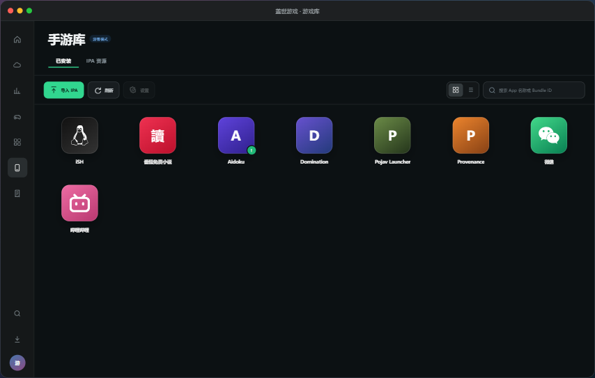  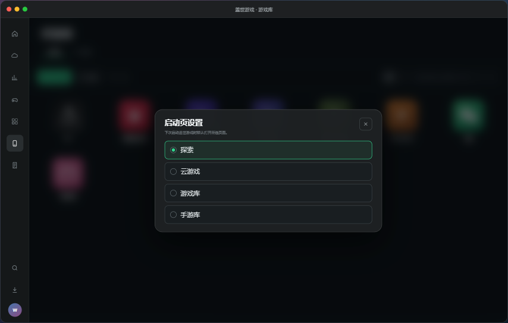|① 侧边栏顺序为“游戏库 / 手游库 / 订单中心”，手游库位于游戏库下方。 ② 登录用户与游客均显示并可使用手游库。 ③ 点击“手游库”后只高亮手游库，页面标题固定为“手游库”。 ④ 页面业务 Tab 为“已安装 / IPA 资源”，每次进入默认展示“已安装”。 ⑤ 启动页设置新增“手游库”，选中后下次启动默认进入手游库。 ⑥ 切换入口不取消正在进行的解析、下载、校验或安装任务 //2026.7.23修改|
|手游库·已安装|  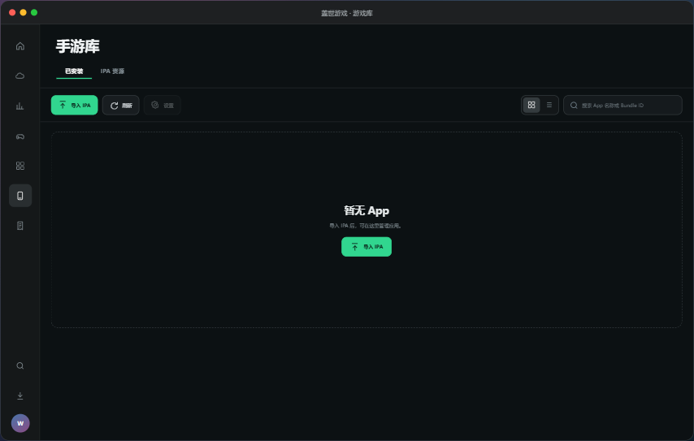|① 手游库下显示“已安装 / IPA 资源”业务 Tab。 ② 已安装页工具栏依次显示“导入 IPA”“刷新”“设置”、网格/列表切换和最右侧搜索。 ③ “导入 IPA”在空库和非空库中均常驻；初始空状态同时显示“导入 IPA”。 ④ 搜索按 App 名称或 Bundle ID 模糊匹配；搜索无结果只提示调整关键词。 ⑤ 网格仅显示图标、App 名称和必要状态，不显示版本号或总数说明。 ⑥ 列表显示名称、Bundle ID、版本、最近使用时间和状态。|
|App 右键菜单|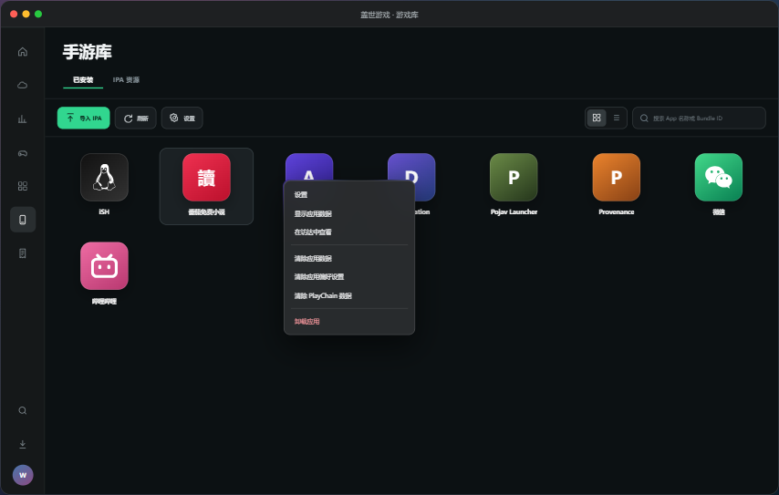|① 顺序固定为设置、显示应用数据、在访达中查看、分隔线、清除应用数据、清除应用偏好设置、清除 PlayChain 数据、分隔线、卸载应用。 ② 不显示键盘映射导入或导出。 ③ 设置与工具栏设置打开同一窗口。 ④ 清理与卸载分别二次确认，一次确认不得授权其他危险操作。|
|App 设置|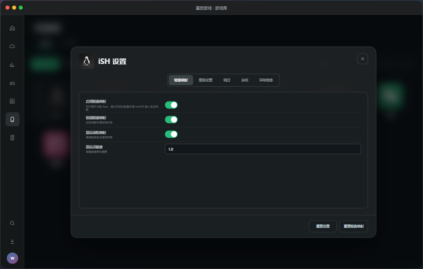  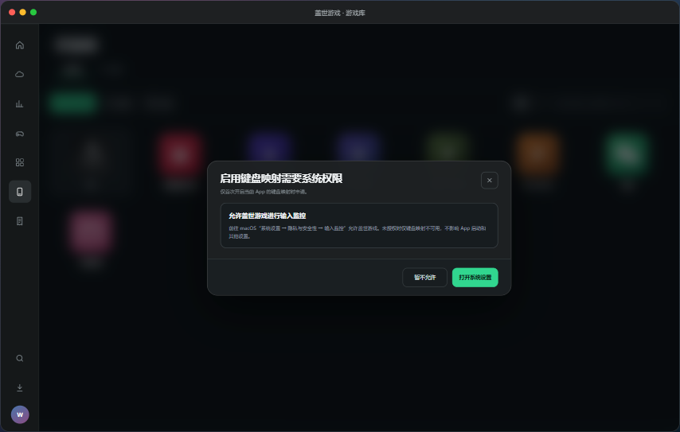|① 标题为“\{App 名称\} 设置”，设置只作用于当前 App。 ② 键盘映射仅保留一个“启用键盘映射”总开关，关闭后依赖项不可操作。 ③ 首次从关闭切换为开启且未获 macOS 输入监控权限时，再弹出授权引导；不提前申请。 ④ 未授权只影响键盘映射，不影响 App 启动和其他设置。 ⑤ 底部“重置设置”和“重置键盘映射”右对齐，关闭入口只保留右上角“X” //2026.7.23修改|
|本地 IPA 导入|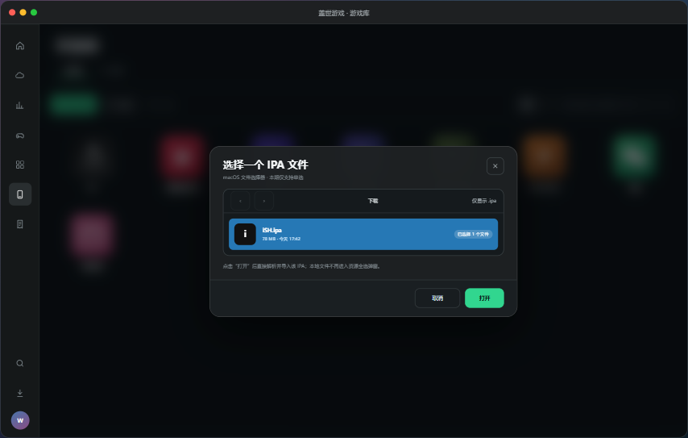|① 点击“导入 IPA”拉起 macOS 文件选择器，只显示 <code>.ipa</code>，本期仅支持选择 1 个文件。 ② 用户点击“打开”后直接解析、执行基础校验与 ACE 特征检测，不再进入二级全选弹窗。 ③ 未命中风险且校验通过时直接导入到“已安装”；命中 ACE 时先风险确认。 ④ 非 IPA、损坏、重复或不兼容时显示明确原因，不创建导入结果。 ⑤ 取消文件选择不提示错误、不创建任务 //2026.7.23修改|
|ACE 风险检测与强提醒|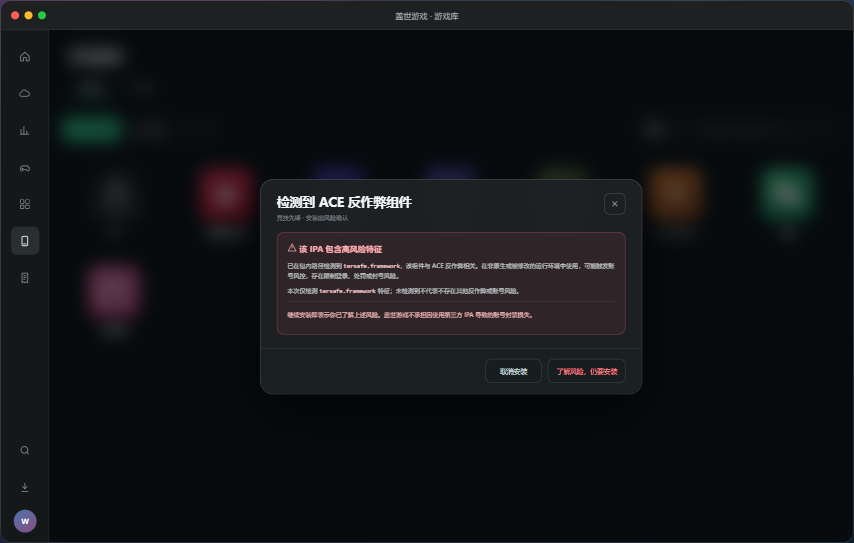|① 本地 IPA 选中并解析后立即检测；远程 IPA 在下载及基础校验完成后、安装前检测。 ② 包内相对路径按正则 <code>/(^&#124;\/)tersafe\.framework(\/&#124;$)/i</code> 匹配完整目录名。 ③ 命中后提示该 IPA 包含 ACE 反作弊相关高风险特征，可能触发账号限制、处罚或封号风险，并说明盖世游戏不承担使用第三方 IPA 导致的账号封禁损失。 ④ 用户可取消；明确点击“了解风险，仍要安装”后才继续。 ⑤ 按 IPA SHA\-256 留存本机确认，同一包不重复提示，哈希变化后重新提示；未命中不得表述为安全 //2026.7.23修改|
|IPA 来源树|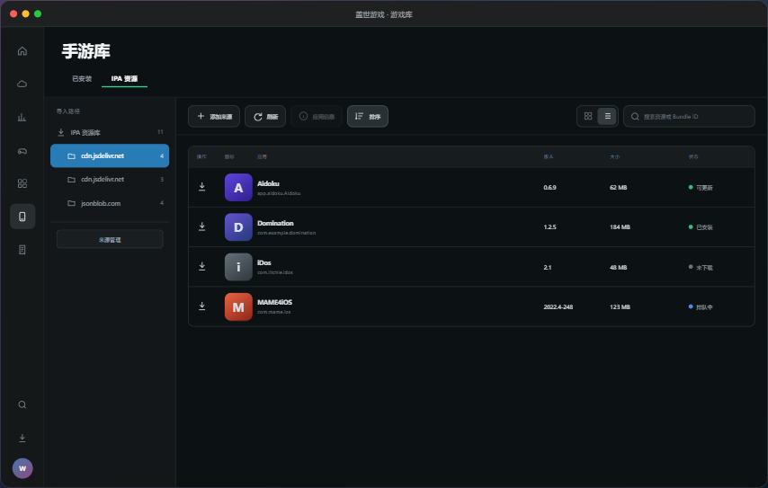  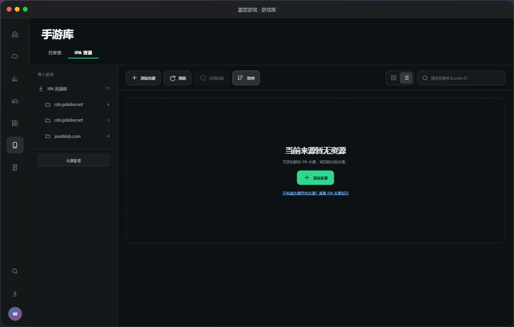|① 左侧显示“IPA 资源库”根节点和各来源子节点。 ② 根节点聚合全部启用来源，按 Bundle ID 去重。 ③ 单个来源节点只显示当前来源资源；同名来源仍独立。 ④ 根节点刷新全部启用来源，子节点只刷新当前来源。 ⑤ 刷新失败保留上次成功缓存，不中断下载或安装任务。 ⑥ 当前来源被删除或失效时自动回到根节点。 ⑦ 全库或当前来源初始为空时显示“添加来源”；搜索无结果不显示该按钮。|
|添加来源|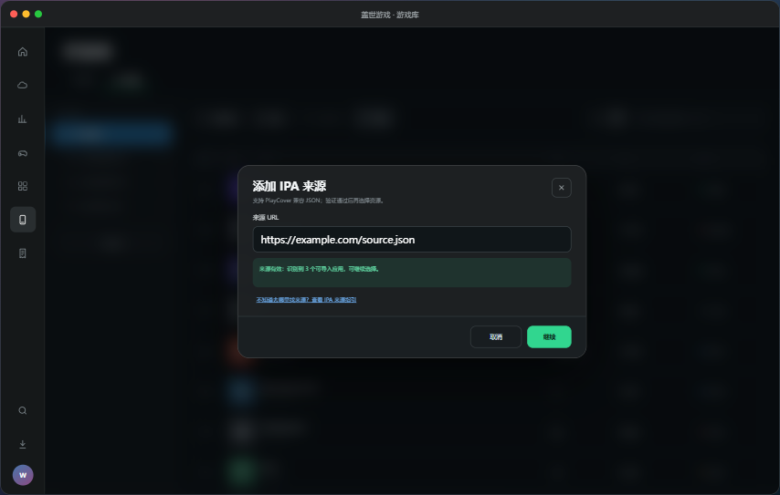  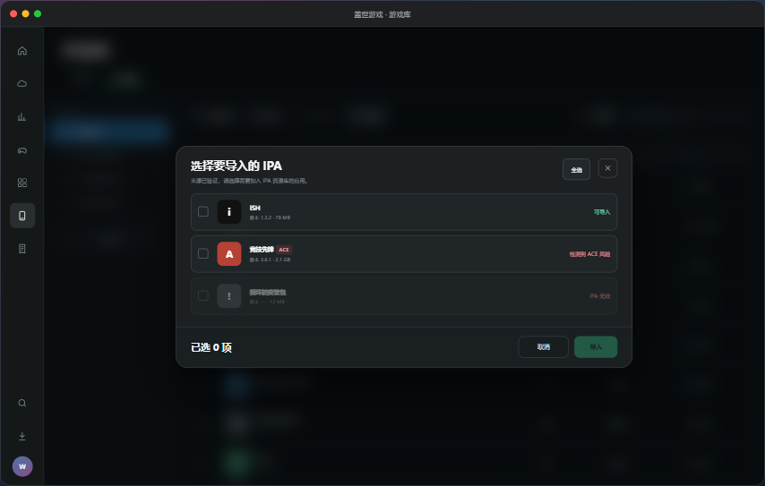|① 只接受公开 HTTPS JSON 地址，不接受账号、令牌或登录态。 ② 地址、JSON 或目标资源无效时提示“链接无效，JSON 无效或未找到！”。 ③ 页面提供“IPA 来源指引”，说明如何获取兼容来源，但本期不内置或推荐第三方资源地址。 ④ 验证成功后进入资源二级选择，支持逐项选择、全选和取消全选。 ⑤ 确认后保存来源并将所选项目加入 IPA 资源列表，但不自动下载、不批量下载，用户需逐个点击下载 //2026.7.23修改|
|来源管理|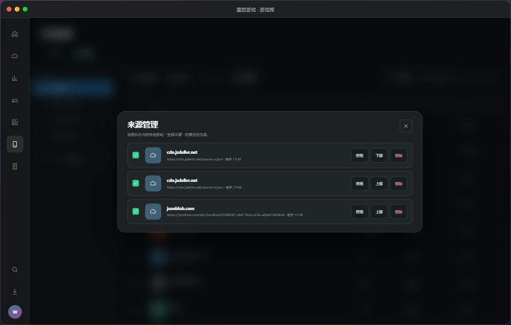|① 每个来源支持启用/停用、上移/下移、删除和查看地址。 ② 选中来源节点后，通过页面工具栏“刷新”更新当前来源。 ③ 展示最近成功缓存时间和当前状态。 ④ 停用来源不删除本地已安装 App。 ⑤ 删除来源需确认；删除后不可再从该来源刷新。 ⑥ 关闭入口只保留右上角“X”，不显示底部“完成”。|
|IPA 资源列表与网格||① 工具栏显示添加来源、刷新、应用信息、字母排序、网格/列表切换和最右侧搜索。 ② 网格显示图标、名称、版本、状态、唯一主操作和必要进度。 ③ 列表显示操作、图标、名称、Bundle ID、版本、大小和状态。 ④ 搜索按名称或 Bundle ID 模糊匹配；搜索与来源筛选取交集。 ⑤ 切换视图保留搜索、来源、排序、滚动位置和任务状态。 ⑥ 初始无资源显示“添加来源”；搜索无结果只提示调整关键词，不显示“添加来源”；加载失败显示重试。|
|应用信息|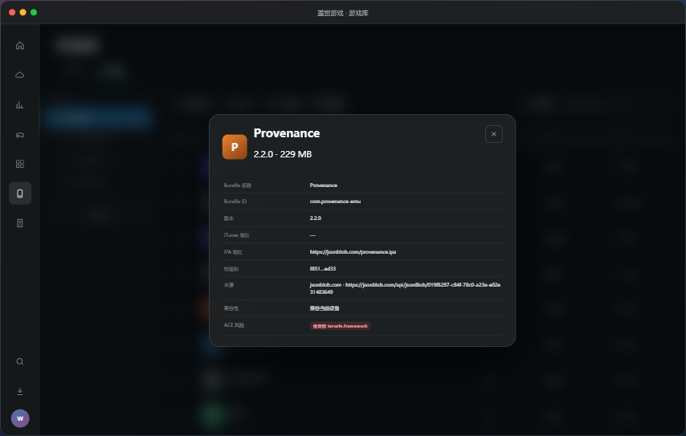|① IPA 右键只显示“应用信息”，与工具栏信息按钮打开同一窗口。 ② 展示 Bundle 名称、Bundle ID、版本、iTunes 地址、IPA 地址、校验和、来源、大小、兼容性和风险。 ③ 图标加载失败只显示占位图，不把 IPA 标记为无效。 ④ 关闭入口只保留右上角“X”，不显示底部“完成”。|
|下载、校验、安装和更新|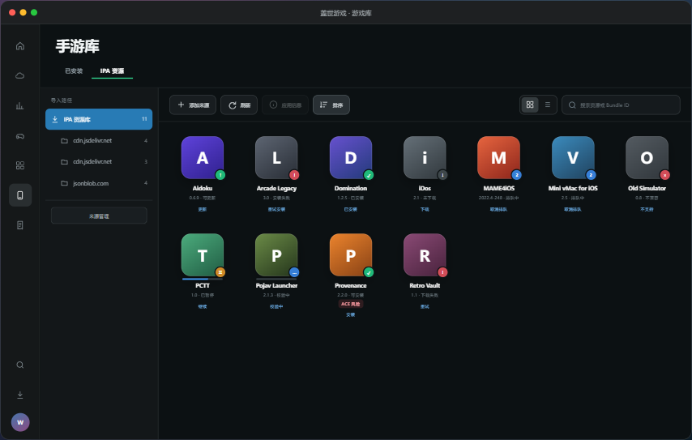|① 每个资源只显示一个主操作，资源加入列表后不自动下载。 ② 沿用现有单槽位机制，同一时间仅 1 个任务处于下载或校验占用状态，其他下载请求进入排队。 ③ 暂停当前任务后下一排队任务可获得槽位；继续时槽位被占用则重新排队。 ④ 下载、排队、暂停、校验、失败等状态只在原卡片或原列表行更新，不置顶、不移动、不按状态重排。 ⑤ 切换 Tab、来源、搜索、排序或视图不终止任务；新版失败时保留旧版 App 和用户数据 //2026.7.23修改|
|卸载与清理|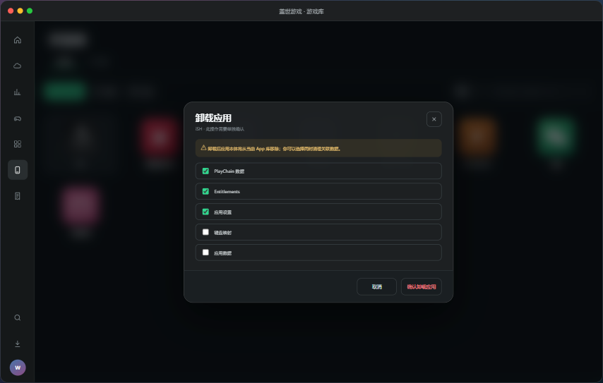|① 显示应用数据和在访达中查看为只读操作，不弹危险确认。 ② 清除应用数据、偏好设置和 PlayChain 分别处理并分别确认。 ③ 卸载确认展示 App 名称和不可逆提示。 ④ 可选择同时清理 PlayChain、Entitlements、设置、键盘映射和应用数据；前三项默认勾选，后两项默认不勾选。 ⑤ 卸载失败保留 App 项并显示原因。|

#### 4\.2\.1 目标选择与工具栏规则

- 每次从侧边栏或启动页进入手游库时默认展示“已安装”；登录用户与游客规则一致，不恢复上次停留的“IPA 资源”Tab //2026.7.23修改

- 已安装和 IPA 资源主页面均只支持单选；批量选择仅存在于来源 URL 验证成功后的资源二级选择，本地 IPA 导入不提供多选或全选 //2026.7.23修改

- 游客模式下仍显示手游库入口并开放已安装、IPA 资源、本地导入与来源管理；涉及账号同步的能力不在本期范围 //2026.7.23修改

- 启动页设置的可选项新增“手游库”；选择后下次启动默认进入手游库“已安装”Tab //2026.7.23修改

- 未选中项目时，“设置”或“应用信息”置灰；只在恰好选中一个有效项目时启用。

- 单击项目后将其设为当前选中项；单击空白、切换业务 Tab 或目标被删除后清除选中。

- 右键项目时先将被右键项目设为当前选中项，再打开该项目的右键菜单；菜单操作不得作用于此前选中的其他项目。

- 刷新后目标仍存在则保持选中，目标不存在则清除选中并关闭相关详情或设置窗口。

- 执行下载、安装、清理或卸载时，按钮提交后立即进入不可重复操作状态，直到返回结果。

- “已安装”搜索仅查询本机已完成安装的 App；未下载、排队、下载中、暂停、校验中或可安装的来源资源不进入“已安装”搜索结果 //2026.7.23修改

#### 4\.2\.2 App 设置字段规则

|设置页|字段|控件与默认值|取值与联动|生效规则|
|---|---|---|---|---|
|键盘映射|启用键盘映射|当前 App 的唯一总开关 //2026.7.23修改|关闭后智能映射、滚轮映射和灵敏度不可操作；不提供独立“暂停”按钮 //2026.7.23修改|下次聚焦 App 窗口生效|
|键盘映射|智能键盘映射|开关，默认开|依赖“启用键盘映射”|下次聚焦 App 窗口生效|
|键盘映射|鼠标滚轮映射|开关，默认开|依赖“启用键盘映射”|下次聚焦 App 窗口生效|
|键盘映射|鼠标灵敏度|数值，默认 1\.0|0\.1\-5\.0，步长 0\.1；依赖“启用键盘映射”|输入合法后保存，下次聚焦生效|
|图像设置|iOS 机型|单选，默认 iPad Pro M1|选择当前支持的机型；列表为空时保留默认项|重启当前 App 生效|
|图像设置|分辨率|单选，默认自动|自动或产品支持的固定分辨率|重启当前 App 生效|
|图像设置|检测到的分辨率|只读|读取当前显示器结果；无法识别时显示“未检测到”|即时展示|
|图像设置|分辨率缩放|数值，默认 2\.0|0\.5\-4\.0，步长 0\.1|重启当前 App 生效|
|图像设置|修复窗口化显示问题|开关，默认关|独立设置|重启当前 App 生效|
|图像设置|禁用显示器息屏|开关，默认关|独立设置|下次启动 App 生效|
|图像设置|允许旋转|开关，默认开|独立设置|即时生效|
|绕过|启用 PlayChain|开关，默认开|独立设置|重启当前 App 生效|
|绕过|绕过越狱检测|开关，默认开|独立设置|重启当前 App 生效|
|绕过|禁用应用内省库|开关，默认关|独立设置|重启当前 App 生效|
|绕过|iOS 框架注入|单选，默认自动|自动、关闭、兼容模式|重启当前 App 生效|
|杂项|Discord Rich Presence|开关，默认关|独立设置|下次启动 App 生效|
|杂项|Metal HUD|开关，默认关|独立设置|重启当前 App 生效|
|杂项|LLDB 调试|开关，默认关|仅调试环境可启用；非调试环境置灰|重启当前 App 生效|
|杂项|注入 PlayTools|开关，默认开|独立设置|重启当前 App 生效|
|杂项|root 工作目录|开关，默认关|独立设置|重启当前 App 生效|
|杂项|应用程序类型|单选，默认自动识别|自动识别、游戏、应用；只作为当前 App 元数据|下次启动 App 生效|
|详细信息|Bundle 名称、Bundle ID、版本、最低系统版本、应用路径和显示名称别名|只读|字段缺失显示“\-”|即时展示|

- 每个合法字段变更后立即保存；需要重启的字段显示“重启 App 后生效”。

- 用户点击右上角“X”时，已保存值保留；当前非法输入恢复为上次合法值后关闭，不弹重复确认。

- “重置设置”恢复除键盘映射外的当前 App 默认值；“重置键盘映射”只恢复键盘映射页默认值；两项操作分别二次确认。

- 键盘映射配置只作用于当前 App，不作为全局设置；首次开启且系统尚未授权输入监控时，才展示 macOS 权限引导，用户拒绝后总开关保持关闭 //2026.7.23修改

#### 4\.2\.3 状态与操作

|当前状态|触发|下一状态|页面主操作|其他入口|失败回退|
|---|---|---|---|---|---|
|未下载|点击下载|下载槽位空闲则下载中；槽位被占用则排队中 //2026.7.23修改|下载|无|创建任务失败后保持未下载并提示原因|
|排队中|获得下载槽位|下载中|取消排队|下载管理可取消|取消后回到未下载|
|下载中|点击暂停|已暂停|暂停|下载管理可取消；取消后删除未完成文件并回到未下载|网络或存储失败进入下载失败|
|已暂停|点击继续|排队中或下载中|继续|下载管理可取消|继续失败保持已暂停并提示原因|
|下载中|进度达到 100%|校验中|无|禁止重复提交|文件写入失败进入下载失败|
|校验中|哈希和包体元数据一致|可安装|无|禁止重复提交|哈希、Bundle ID 或包结构不一致进入校验失败|
|可安装|点击安装|安装中|安装|可删除已下载文件并回到未下载|任务创建失败保持可安装|
|安装中|安装完成|已安装同版本|无|禁止重复提交|进入安装失败并保留已校验包体|
|已安装同版本|点击打开|已安装同版本|打开|可进入“已安装”管理|启动失败显示原因，不改变安装状态|
|本地版本更高|查看资源|本地版本更高|保留本地版|可查看版本差异|不得自动降级|
|可更新|点击更新|下载槽位空闲则下载中；被占用则排队中 //2026.7.23修改|更新|下载管理可取消|下载、校验或安装失败均保留旧版和用户数据|
|下载失败|点击重试|下载槽位空闲则下载中；被占用则排队中 //2026.7.23修改|重试|可删除任务并回到未下载|再次失败保持下载失败并更新原因|
|校验失败|点击删除并重下|下载槽位空闲则下载中；被占用则排队中 //2026.7.23修改|删除并重下|可只删除失败文件并回到未下载|重下失败进入下载失败|
|安装失败|点击重试安装|安装中|重试安装|可删除已下载文件并回到未下载|再次失败保持安装失败并更新原因|
|不兼容|点击查看原因|不兼容|查看原因|无|不得创建下载或安装任务|

“缺少来源哈希”是资源风险标记，不是独立任务状态，可与未下载、排队中、下载中和可安装同时存在。资源仍可下载；用户从“可安装”点击安装时先弹风险确认，确认后进入安装中，取消后保持可安装。

- 本地 App 安装状态、IPA 任务状态和任务意图需分别维护。更新任务进入排队、下载、校验或安装时，旧版 App 仍保持已安装并可启动；任务失败或取消后，资源恢复为可更新，旧版和用户数据不变。

- 来源缺少哈希时跳过哈希比对，但仍校验包结构、Bundle ID、版本和 Build；其余校验通过后进入“可安装”，同时保留“缺少哈希”风险标记。

- 下载与其后续校验共用一个任务槽位；同一时间只处理 1 个，其他任务保持排队。任务状态变化仅更新原资源项，不修改资源数组顺序或当前排序结果 //2026.7.23修改

#### 4\.2\.4 排序、加载与空状态

- “已安装”本期不提供排序控件，默认按最近使用时间倒序；最近使用时间在 App 成功进入前台时更新，时间相同按名称升序，再按 Bundle ID 升序。

- IPA 资源提供一个字母排序按钮，首次点击切换为名称 A\-Z，再次点击切换为名称 Z\-A；名称相同时按版本从高到低，再按来源优先级从高到低。按钮需显示当前方向。

- IPA 切换排序后列表回到顶部；返回页面时恢复上次搜索、来源、排序方向、视图和滚动位置。

- 未下载、排队、下载、暂停、校验和失败等状态变化不参与排序权重，资源始终保留在当前名称/来源排序位置，不因状态置顶或移动 //2026.7.23修改

- 首次扫描且没有缓存时显示页面加载状态；超过 15 秒后显示页面级“加载失败，请重试”。手动刷新或已有缓存时，失败只显示非阻断提示和缓存时间，原列表继续显示并可操作。

- 列表不使用传统分页，滚动加载并保留已加载内容；达到 1,000 项时使用虚拟列表。

- “已安装”初始空状态显示“暂无 App”和“导入 IPA”按钮；点击后进入本地 IPA 导入流程。

- IPA 全库初始空状态显示“暂无 IPA 资源”和“添加来源”按钮；当前来源为空时显示“当前来源暂无资源”和“添加来源”按钮。

- 两个 Tab 的搜索无结果状态只提示调整关键词，内容区不显示“导入 IPA”或“添加来源”按钮；顶部工具栏的常驻按钮不受搜索结果影响。

- 没有可展示缓存时，页面状态优先级为：首次加载失败 \> 搜索无结果 \> 当前来源为空 \> 全库为空。已有缓存的刷新失败不替换内容区。

#### 4\.2\.5 输入与文件校验

|场景|规则|失败处理|
|---|---|---|
|搜索|App 名称或 Bundle ID 模糊匹配；去除首尾空格；最多 100 个字符|超过限制不再输入；无结果显示搜索空状态|
|来源 URL|只允许 HTTPS；输入后延迟校验；不允许账号、Cookie、Token；只接受与当前输入一致的最新校验结果，旧请求返回不得覆盖新结果|提示“链接无效，JSON 无效或未找到！”；继续按钮置灰|
|本地文件|仅 <code>.ipa</code>；本期单次只允许选择 1 个；单文件大小上限由客户端能力配置 //2026.7.23修改|非 IPA 在文件选择器中不可选；损坏、重复或不兼容时直接显示原因并停止导入，不进入二级选择 //2026.7.23修改|
|App 库路径|仅一个本地文件夹；必须具备读写权限|无权限时提示重新选择，不改变原路径|
|设置数值|按每项允许范围校验，不允许非法字符|原字段就地提示，不保存非法值|

ACE 特征检测规则：

- 解压 IPA 并遍历包内相对路径，按正则 `/(^|\/)tersafe\.framework(\/|$)/i` 不区分大小写匹配完整目录名。

- 本地 IPA 在单文件解析完成后检测；远程 IPA 在下载与包体基础校验完成后、安装任务创建前检测 //2026.7.23修改

- 用户确认记录至少包含 IPA SHA\-256、Bundle ID、版本、确认时间和文案版本，仅保存在当前 Mac。

- 检测结果只可表述为“检测到 ACE 风险特征”，不得表述为“必然封号”、“已完整检测反作弊”或“未命中即安全”。

#### 4\.2\.6 边界条件\-内容侧

|场景|处理方式|
|---|---|
|来源 URL 无效、JSON 无效或未找到资源|显示统一错误文案，继续按钮置灰|
|来源刷新失败|保留上次成功缓存并允许继续浏览和操作；页面顶部显示失败原因和缓存时间；没有缓存时才显示页面级失败状态|
|同名或同域名来源|使用稳定来源 ID 区分，来源树分别显示|
|图标加载失败|使用占位图；包体状态不变|
|IPA 包内 Bundle ID 与来源元数据不一致|校验失败，不允许安装|
|IPA 包内路径命中 `tersafe.framework`|标记“ACE 风险特征”；安装前强提醒，用户取消则保持当前状态，明确确认后才继续|
|未命中 `tersafe.framework`|继续既有校验流程；不显示“安全”或“无封号风险”|
|命中过但 IPA SHA\-256 已有用户确认记录|同一包不重复提示；任何哈希变化均视为新包并重新提示|
|已安装 App 含 ACE 风险但无确认记录|首次启动前补强提醒；取消则不启动 App|
|来源没有哈希|允许下载；跳过哈希比对，但继续校验包结构、Bundle ID、版本和 Build；校验通过后保留风险标记，安装前单独确认|
|新版安装失败|保留旧版 App 和用户数据|
|资源数量为 0、1 或 1,000 以上|分别显示空状态、单项布局或虚拟列表，不出现布局断裂|

#### 4\.2\.7 边界条件\-用户侧

|场景|处理方式|
|---|---|
|用户取消文件选择|返回原页面，不提示错误，不创建任务|
|来源二级选择未勾选候选项|导入按钮置灰；本地 IPA 单文件导入无此状态 //2026.7.23修改|
|重复点击导入、下载或安装|首次提交后按钮进入不可重复操作状态|
|切换 Tab、来源、搜索、排序或视图|任务继续，页面状态保留|
|删除当前来源|删除成功后回到“IPA 资源库”根节点|
|停用当前来源|停用成功后回到“IPA 资源库”根节点；不删除缓存和本地 App|
|当前来源刷新失败|保留当前节点并展示上次成功缓存；仅在来源被删除或停用时回到根节点|
|重启客户端|优先恢复上次有效来源节点和展开状态；节点不存在或已停用时回到根节点|
|App 库授权失效|提示重新选择路径；原列表只读展示，不清除数据|
|用户在 ACE 风险弹窗点击取消或“X”|本地单文件导入返回“已安装”页且不导入；远程安装返回“可安装”状态；首次启动则不启动 App //2026.7.23修改|
|App 正在运行时清理或卸载|不执行操作，提示用户退出 App 后重试，不强制结束 App|
|单项清理成功|保留当前 App 选中状态，刷新对应设置或数据状态并显示成功提示；偏好设置或 PlayChain 清理后按默认值展示|
|清理或卸载中途失败|卸载按“预检查→可选清理→删除 App 本体”执行；任一可选清理失败时停止删除 App 本体，保留 App 项，标出已完成和未完成项，重试时只处理未完成项；App 本体删除失败时同样保留 App 项；App 本体删除成功后从“已安装”移除|
|用户关闭纯查看弹窗|通过右上角“X”关闭；应用信息和来源管理不显示重复的完成/关闭按钮|
|用户关闭设置弹窗|通过右上角“X”关闭；已保存值保留，非法未保存输入恢复为上次合法值|
|用户操作确认类弹窗|保留取消与确认、导入、提交等底部业务按钮|

#### 4\.2\.8 国内与海外差异

|项目|国内包|海外包|
|---|---|---|
|用户自添加来源|允许添加公开 HTTPS 来源；受国内独立域名封禁表限制|允许添加公开 HTTPS 来源；受海外独立域名封禁表和地域版权限制|
|网络可达性 |来源验证按国内网络环境执行，不保证海外来源可达|来源验证按目标地区网络环境执行，不保证国内来源可达|
|合规文案 |展示国内版来源与版权提示|按目标地区展示隐私、版权和第三方来源提示|
|ACE 风险与免责文案 |由国内法务与安全确认用语、责任边界和确认留痕周期|由目标地区法务与安全分别确认，不直接复用国内免责文案|
|数据上报|不上传完整来源 URL、完整本地路径和文件名；数据保存在国内对应区域|不上传完整来源 URL、完整本地路径和文件名；遥测按海外包数据区域和隐私政策处理|

本期手游库不依赖登录，游客与登录用户均可使用；不涉及云游戏、实名认证、运营活动资源位和客户端内推荐来源。国内与海外功能相同，但域名封禁、网络可达性、合规文案和遥测区域必须独立配置 //2026.7.23修改

## 五、非功能需求

|需求类型|详细要求|
|---|---|
|性能|页面可交互时间不超过 2 秒；来源校验反馈不超过 5 秒；列表达到 1,000 项时仍可滚动与搜索；任务状态更新不得引起卡片高度变化|
|兼容性|支持产品确定的 Apple Silicon Mac 和 macOS 最低版本；文件选择使用 macOS 原生能力；Intel Mac 不满足安装条件时显示不兼容原因|
|安全|限制来源响应体大小、重定向次数、超时和并发；校验 HTTPS、Bundle ID、版本、Build 和哈希；扫描包内 `tersafe.framework` 路径并按 SHA\-256 留存确认；日志不得记录账号 Cookie、令牌或完整隐私路径|
|隐私|App 库路径和来源配置仅保存在当前 Mac，不随账号同步；首次选择路径时说明用途|
|容错|来源失败保留缓存；下载支持暂停与继续；安装失败保留已校验包体；更新失败保留旧版；清理和卸载失败不得显示成功|
|可访问性|所有按钮具备可用、不可用、选中、焦点和键盘操作状态；图标按钮提供可识别名称|
|一致性|纯查看和设置类弹窗只保留右上角“X”；确认、提交和导入类弹窗保留底部业务按钮|

## 六、埋点需求

### 6\.1 埋点事件表

|事件ID|事件名称|触发时机|关键参数|
|---|---|---|---|
|`mobile_library_entry_click`|手游库入口点击|从侧边栏或启动页进入“手游库” //2026.7.23修改|<code>entry</code>、<code>package_region</code>、<code>user_state</code> //2026.7.23修改|
|`ios_library_tab_view`|手游库业务 Tab 曝光|进入已安装或 IPA 资源|`tab`,`entry`|
|`ios_library_refresh`|刷新结果|本地扫描或来源刷新结束|`tab`,`source_id`,`result`,`cache_used`,`duration_ms`|
|`ios_app_context_action`|App 右键操作|点击右键菜单项|`bundle_id`,`action`,`confirm_result`|
|`ios_app_settings_change`|App 设置变更|设置项保存成功或失败|`bundle_id`,`settings_tab`,`setting_key`,`result`|
|`ios_local_ipa_parse`|本地 IPA 解析|单个文件解析完成 //2026.7.23修改|<code>file_count</code> 固定为 1，并记录 <code>valid_count</code>、<code>invalid_count</code>、<code>duration_ms</code> //2026.7.23修改|
|`ios_local_ipa_import`|本地 IPA 导入|单文件直接导入返回结果 //2026.7.23修改|<code>result</code>、<code>error_code</code>、<code>ace_detected</code> //2026.7.23修改|
|`ios_source_validate`|来源验证|来源 URL 验证完成|`source_domain_hash`,`reachability`,`result`,`error_code`,`duration_ms`|
|`ios_source_select_confirm`|来源资源确认|用户确认来源候选资源|`candidate_count`,`selected_count`|
|`ios_resource_view_switch`|资源视图切换|网格与列表切换|`view_mode`,`source_id`|
|`ios_resource_task_action`|任务操作|下载、暂停、继续、安装、更新、取消或重试|`resource_id`,`from_status`,`action`,`result`|
|`ios_resource_install_result`|安装结果|安装结束|`resource_id`,`version`,`result`,`error_code`|
|`ios_app_first_launch_result`|安装后首次启动结果|新安装 App 首次启动成功或失败|`bundle_id`,`install_version`,`result`,`error_code`,`duration_ms`|
|`ios_app_uninstall_result`|卸载结果|卸载结束|`bundle_id`,`cleanup_options`,`result`,`error_code`|
|`ios_ace_feature_detected`|ACE 风险特征检测结果|本地解析或远程下载后完成特征检测|`resource_id`,`detect_stage`,`feature`,`result`,`scan_duration_ms`|
|`ios_ace_warning_action`|ACE 风险弹窗操作|用户关闭、取消或确认继续|`resource_id`,`trigger_scene`,`action`,`copy_version`|

### 6\.2 埋点参数表

|参数名|类型|必填|说明|枚举/示例|
|---|---|---|---|---|
|`entry`|string|是|进入来源 //2026.7.23修改|<code>sidebar</code>、<code>startup_page</code> //2026.7.23修改|
|`user_state`|string|是|进入手游库时的用户状态 //2026.7.23修改|<code>logged_in</code>、<code>guest</code> //2026.7.23修改|
|`package_region`|string|是|包体区域|`cn`、`global`|
|`tab`|string|是|当前业务 Tab|`installed`、`resources`|
|`source_id`|string|否|来源唯一标识|UUID|
|`source_domain_hash`|string|否|来源域名不可逆哈希，不上报完整域名、账号和参数|`sha256:...`|
|`reachability`|string|否|来源网络可达结果|`reachable`、`timeout`、`dns_fail`、`blocked`|
|`bundle_id`|string|否|App 唯一标识|`app.aidoku.Aidoku`|
|`resource_id`|string|否|来源、Bundle ID、版本和 Build 组合标识|`source:bundle:version:build`|
|`view_mode`|string|否|视图类型|`grid`、`list`|
|`from_status`|string|否|操作前状态|`not_downloaded`、`downloading`、`ready`|
|`action`|string|否|用户操作|`download`、`pause`、`resume`、`install`、`retry`|
|`result`|string|是|结果|`success`、`fail`、`cancel`|
|`error_code`|string|否|失败原因编码|`invalid_json`、`hash_mismatch`|
|`duration_ms`|number|否|操作耗时，单位毫秒|`1520`|

### 七、来自功能上线后的更新

上线后更新。
