# 【Prd】《盖世游戏》广告接入需求

## 一、版本信息

|时间|版本|变更人|主要变更内容|备注|
|---|---|---|---|---|
|2026\.7\.27|V1\.0|郑群超|创建||
|2026\.8\.4|V1\.1|郑群超|根据需求评审收敛本期范围：首期仅上线2—3 个低干扰广告位，移除本期抽奖激励和 APP 开屏运营资源位；调整搜索、信息流、激励广告、SDK 分工、A/B 实验、数据统计、合规、配置降级和排期规则|评审修订版；技术风险与待确认项见第九章|
|2026\.8\.5|V1\.2|郑群超|恢复首批 C1、G1、Q1、S1、S2、S3、M1、T1；新增 APP 开屏页运营资源位 O1；后台合并为“广告投放配置、实验与效果”2 页；国内与海外均支持 A/B 实验；补充付费与云游效果指标，删除投放对象配置|R1 抽奖活动仍不在本期|

## 二、背景与目标

**背景：**现有周数据中，`app_launch` 约 646.37 万次、54.33 万用户，可作为广告实验的活跃用户基础；搜索、社区浏览和用户主动领取云游戏权益具备低干扰广告验证场景。启动流程新增 APP 开屏页运营资源位，用于自有内容运营，不调用广告 SDK。

**目标：**本期仅在 Android 接入广告。国内激励广告使用穿山甲，国内原生/信息流广告使用腾讯广告，海外原生/信息流广告使用 Google AdMob；首批开放 8 个广告位并保留运营后台独立开关与频控，通过国内、海外 A/B 实验验证留存、付费和云游影响。

**核心挑战：**

- 原生广告需要以新增插入方式融入游戏卡片和社区信息流，不替换自然内容，并显示 `Ad`。

- 激励广告必须以 SDK 完整播放/奖励成功回调为准，再由服务端幂等发放云游戏时长或排队加速；抽奖次数激励不在本期范围。

- 国内与海外的广告网络、资源位、实验和效果数据必须隔离；海外支持 A/B 实验，但云游相关指标显示“不适用”。

- 无填充、加载失败或策略异常不能阻塞用户原流程。

## 三、故事介绍

### 3\.1 用户与运营场景

- 内容浏览用户：用户在搜索结果、搜索默认页或社区浏览内容，看到与原页面结构一致的广告卡；广告显示 `Ad`。用户点击后打开广告 SDK 落地页，关闭后回到原页面和原滚动位置。

- 云游戏用户：国内用户签到、零时长启动或免费排队时，主动观看广告换取双倍签到时长、额外云游戏时长或排队加速。未完整观看不发奖励。

- 活动用户：抽奖转盘看广告本期不开发，保留为后续候选场景。

- 运营人员：运营在后台切换国内或海外，配置广告位 ID、显隐、位置、数量和频率；国内与海外均可新建全局或单功能 A/B 实验，并查看留存、付费和云游效果。曝光、点击、CPM、CTR 和广告收入直接在第三方广告平台查看。

- 内容运营人员：在“首页卡片管理 → 运营资源位置配置”新增 APP 开屏页资源位置，配置横竖屏素材、地区、渠道、版本、生效时间、频率和跳转目标。

### 3\.2 价值分析

- 变现：把搜索、社区和用户主动选择的激励场景转为可结算广告收入。

- 留存：激励场景由用户主动选择，减少强制打断。

- 效率：运营无需发版即可调整开关、人群、比例和频率。

- 风险控制：本期只用次日留存、7 日留存和整体付费率判断广告影响；留存明显下降时可在后台一键关闭全部广告。

- 启动体验：启动页不调用广告 SDK；Logo 动画后可展示一次 APP 开屏页自有运营资源，加载失败直接进入首页。

### 3\.3 核心体验路径

- 原生广告：进入页面 → 命中地区、人群、实验和频控 → 广告填充 → 展示 `Ad` 原生卡 → 点击落地页 → 关闭并返回原位置。

- 激励广告：进入合格场景 → 用户点击广告入口 → 完整观看 → 服务端校验 → 发放权益 → 页面刷新到账结果。

- APP 开屏：盖世游戏 Logo → APP 开屏页运营资源 → 竖屏首页或横屏游戏库；无有效资源或加载失败时跳过运营资源。

- 运营配置：切换国内/海外 → 新增或编辑投放 → 保存草稿 → 发布 → 客户端拉取新策略。

- A/B 实验：选择国内或海外 → 选择全局广告或单个功能 → 配置版本、流量、分组和周期 → 匿名安装 ID 稳定分桶 → 汇总留存、付费和云游指标 → 继续放量、暂停或结束实验。

### 3\.4 产品指标预测

以下为验收目标，不是收入承诺：

1. 国内、海外实验分组公参覆盖率不低于 99%，同一安装实例在实验版本内不换组。

2. 广告无填充或加载失败时，空白广告占位为 0。

3. 激励广告校验成功后的权益发放成功率不低于 99\.8%，重复发放为 0。

4. 配置拉取失败时广告展示数为 0；自然内容和原业务流程不受影响。

5. 有广告组未出现不可接受的留存、付费或云游指标下降，才允许继续放量；广告收入以第三方平台数据单独核对。

6. O1 无有效资源或素材失败时跳过成功率 100%，不得阻塞启动或展示空白页。

### 3\.5 路径规划

- V1.2（本期）：完成 APP 开屏页运营资源位、8 个广告位、配置拉取与失败全关、奖励校验与幂等、国内/海外 A/B 实验和效果统计；各广告位是否实际放量由运营后台开关、频控和实验决定。

- 后续：根据第三方平台广告收入、国内/海外实验和用户反馈调整放量；R1 抽奖次数激励另行评估。

## 四、概要设计

### 4\.1 模块设计

|模块|说明|
|---|---|
|广告接入|国内激励广告使用穿山甲，国内原生/信息流广告使用腾讯广告，海外原生/信息流广告使用 Google AdMob；APP 开屏页为自有运营资源，不调用广告 SDK。|
|广告策略|客户端启动时拉取并本地保存广告位显隐、位置、数量、频率和投放规则；拉取失败时本次启动全部广告关闭。|
|用户端广告资源位|首批交付 C1、G1、Q1、S1、S2、S3、M1、T1 共 8 个广告位；R1 抽奖激励不在本期。|
|APP 开屏页运营资源位|复用首页卡片管理能力，新增 APP 开屏页资源位置；按地区分别配置横竖屏素材和跳转，不计入广告曝光。|
|权益服务|按广告 SDK 的奖励成功回调校验并幂等发放时长或排队加速；服务端保存每日资格和发奖结果，不保存视频播放过程。|
|广告投放配置|运营手动填写第三方平台申请的广告位 ID，并管理显隐、位置、数量、频率和生效状态；不开发第三方平台自动同步接口。|
|A/B 测试配置|国内与海外均支持全局或单功能“有广告/无广告”实验；同地区同功能只允许一个待开始或进行中的实验，全局与单功能互斥。|
|效果统计|汇总实验用户数、次日留存、7 日留存、付费人数、付费总额、付费订单数、整体付费率、云游用户数和人均云游时长；海外云游指标显示“不适用”。|

“首页卡片管理 → 运营资源位置配置”新增 APP 开屏页资源位置，其余运营资源能力复用原逻辑。

技术边界：客户端直接通过广告 SDK 请求和渲染内容；自有服务端不代理广告素材、不对接第三方广告内容同步接口，只下发显隐/位置/数量/频率等配置。激励权益由既有权益服务单独完成回调校验、每日资格和幂等发放。

### 4\.2 详细设计（C端）

功能demo:[盖世游戏 Android 广告接入 · 交互标注版](https://z36358631-ship-it.github.io/-/demos/Android%E5%B9%BF%E5%91%8A%E6%8E%A5%E5%85%A5-%E4%BA%A4%E4%BA%92%E6%A0%87%E6%B3%A8%E7%89%88.html)

Demo 已按 V1.2 收敛为本期范围：O1、C1、G1、Q1、S1、S2、S3、M1、T1；R1 抽奖激励不展示、不开发。

|模块名称|图示|展示与交互说明|
|---|---|---|
|O1 APP 开屏页运营资源位||① **触发条件**：用户冷启动盖世游戏，命中“首页卡片管理 → 运营资源位置配置 → APP 开屏页”中当前地区、渠道、版本、时间和频控均有效的资源。 ② **展示说明**：启动顺序为“盖世游戏 Logo → APP 开屏页运营资源 → 竖屏首页或横屏游戏库”。资源页显示运营素材、跳过倒计时和“查看详情”；该位置不调用广告 SDK，不计入广告曝光。 ③ **交互说明**：等待 3 秒自动进入目标首页；点击“跳过”直接进入；点击“查看详情”进入配置的游戏详情、专题、活动页或外部链接，返回后继续进入原定首页。 ④ **异常处理**：无有效资源、配置失败或素材加载失败时，Logo 后直接进入首页；仅配置单方向素材时，另一方向不拉伸复用，直接跳过资源页。 ⑤ **验收条件**：国内、海外配置隔离；同地区多条资源按状态、时间和排序命中；同一用户按频控规则展示。|
|S1 搜索结果原生广告|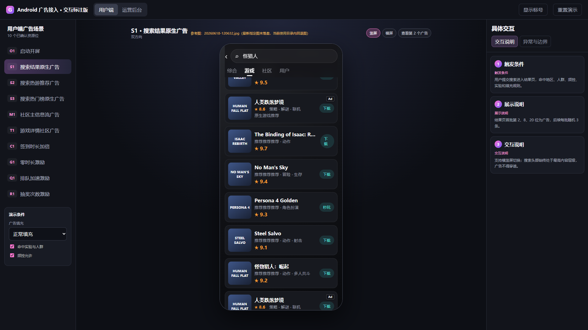|① **触发条件**：用户提交关键词并进入游戏搜索结果；自然结果可正常展示；命中地区、当前地区实验、频控和投放规则。 ② **展示说明**：沿用现有搜索结果宫格样式，广告以新增条目插入，不替换自然结果；保留“秒玩”，仅设置一处“下载”按钮并显示 `Ad`。每批 20 个视觉条目，插入位置数组和数量由后台下发；默认策略可沿用首批第 2、8、20 位、后续批次随机 3 位，同批不相邻，运营可随时调整。UI 只定义统一容器，游戏图、名称、描述和广告素材由 SDK 填充。 ③ **交互说明**：点击广告的“下载”或可点击区域 → 由 SDK 直接发起下载，不进入盖世游戏详情页；“秒玩”沿用现有秒玩链路。该链路须以腾讯广告/Google AdMob 实际支持能力为准，未验证通过前不得上线。 ④ **状态恢复**：保留关键词、已加载批次、后台下发位置和滚动位置；关闭系统下载或返回 App 后不重新排列本次列表。 ⑤ **异常处理**：无配置、无填充或素材不完整时由自然结果补位；下载失败按 SDK 结果提示，不展示空卡，不伪装成盖世游戏详情页。 |
|S2 搜索热游推荐广告|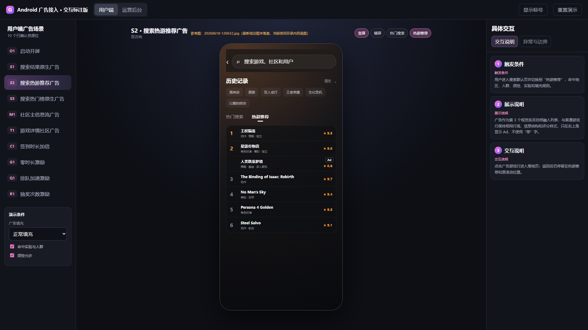  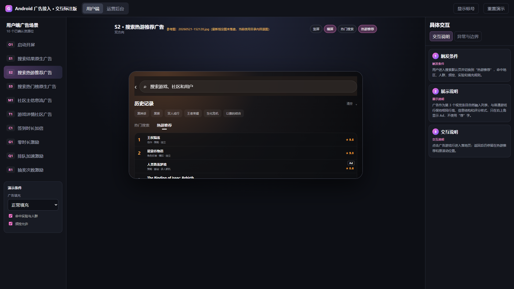|① **触发条件**：用户进入搜索默认页；页面先展示热游推荐，再展示热门搜索；命中地区、当前地区实验、频控和投放规则。 ② **展示说明**：广告与自然游戏使用同一信息结构，显示游戏图、名称、类型、评分和 `Ad`，不显示“荐”，不占自然排名。插入位置数组和数量由后台下发；默认最多 1 条。UI 只定义容器，广告内容由 SDK 拉取。 ③ **交互说明**：点击广告 → 由 SDK 打开平台落地页、系统应用商店或第三方应用；关闭后返回热游推荐原位置。国内和海外关闭控件均使用广告平台自带控件，不自定义叉号或负反馈菜单。 ④ **状态恢复**：保留广告位置和滚动位置，不重新请求或移动本次广告。 ⑤ **异常处理**：无配置、无填充或素材不完整时由自然游戏补位，不保留空行或空卡。 |
|S3 搜索热门榜原生广告 |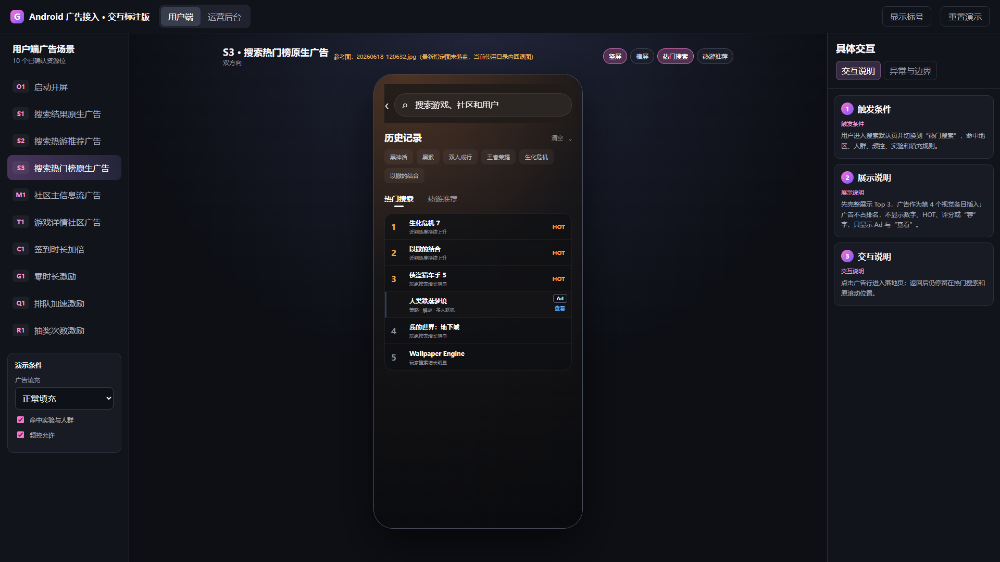  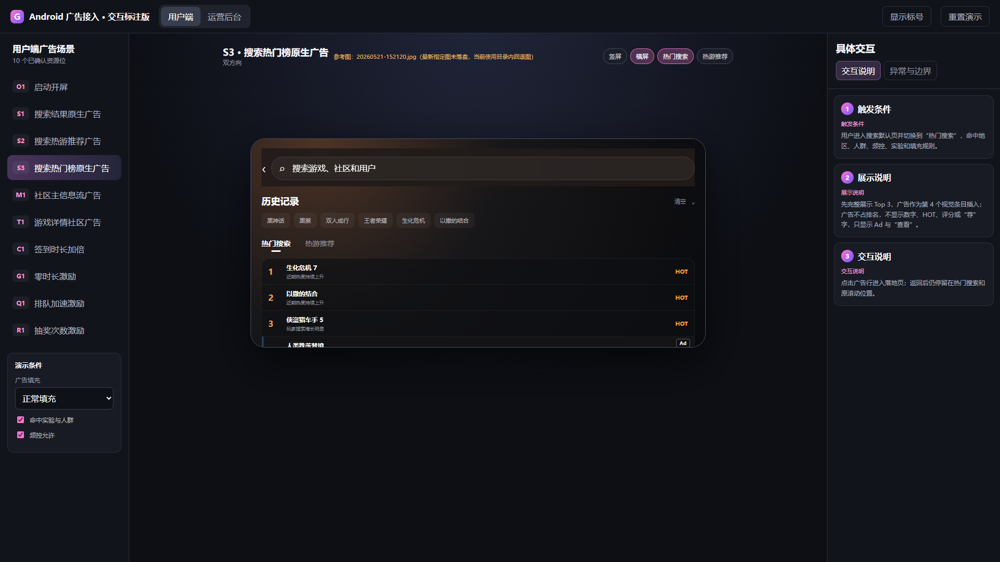 广告落地页参考：  |① **触发条件**：用户在搜索默认页看到热游推荐后继续浏览热门搜索；命中地区、当前地区实验、频控和投放规则。 ② **展示说明**：热门搜索每页 10 条，所有自然条目和广告条目统一展示游戏 Icon；固定头部 Banner 本期暂缓。广告以新增条目插入，不占自然排名，不显示数字、`HOT`、评分或“荐”，只显示游戏信息和 `Ad`。插入位置数组和数量由后台下发，必须避开 Top 3，并优先位于首次进入页面的核心可视内容之后；UI 只定义统一列表容器，内容由 SDK 拉取。 ③ **交互说明**：点击广告 → 由 SDK 打开平台落地页、系统应用商店或第三方应用；关闭后回到热门搜索原位置。关闭控件使用广告平台自带控件。 ④ **状态恢复**：保留已加载页、广告位置和滚动位置，不重新请求或移动本次广告。 ⑤ **异常处理**：无配置、无填充或素材不完整时由自然热门搜索条目补位，不保留空位。 |
|M1 社区主信息流广告 |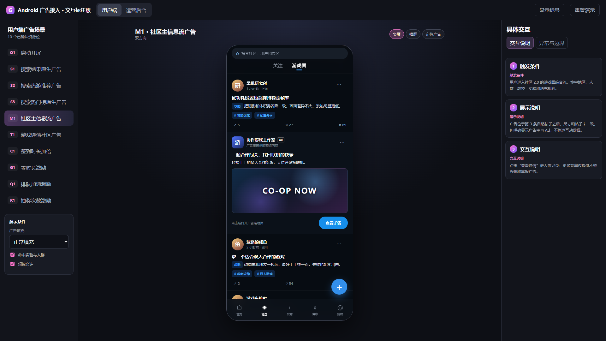  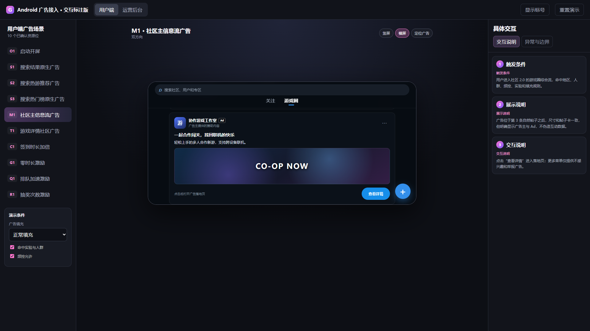|① **触发条件**：用户进入社区 2.0“游戏圈”综合信息流，且已有自然帖子可展示；关注流不展示。 ② **展示说明**：广告以新增卡片插入，不替换自然帖子；卡片与帖子同宽，显示广告主和 `Ad`，不显示虚假点赞、评论、转发或官方身份。后台配置每页插入位置数组和数量；默认仅首屏请求一次，后续可配置为每页固定位置重复插入。UI 只定义容器，内容由 SDK 拉取。 ③ **交互说明**：点击广告打开 SDK 落地页；关闭或外跳返回后保留社区 Tab、已加载帖子和滚动位置。国内与海外均使用平台自带关闭/负反馈控件，不自定义更多菜单；平台返回“不感兴趣”时，按平台结果隐藏当前广告。 ④ **内容策略**：运营在第三方平台优先投放游戏类广告；无游戏类素材时允许平台返回其他合规品类。 ⑤ **异常处理**：无配置、无填充或素材不完整时自然帖子连续展示，不保留广告空位；落地页无法打开时停留原页面。 |
|T1 游戏详情社区广告 |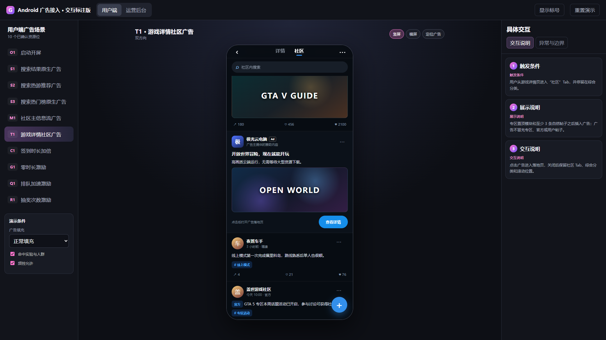  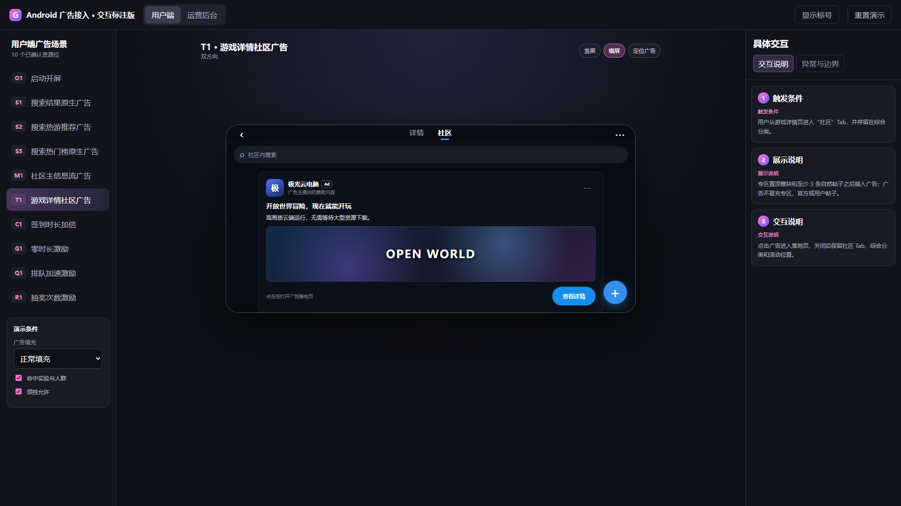|① **触发条件**：用户进入游戏详情页“社区-综合”，专区置顶模块和自然帖子可正常展示；官方、求助、攻略分类不展示。 ② **展示说明**：广告以新增卡片插入，不替换自然帖子；不得冒充专区、官方或用户帖子，不显示虚假互动数据。后台配置每页插入位置数组和数量；默认仅首屏请求一次，后续可配置为每页固定位置重复插入。 ③ **交互说明**：点击广告打开 SDK 落地页；关闭或外跳返回后保留游戏详情页、社区 Tab、综合分类、已加载帖子和滚动位置。关闭/负反馈控件使用平台原生控件，不自定义更多菜单。 ④ **内容策略**：优先返回游戏类广告，无游戏类素材时兜底其他合规品类。 ⑤ **异常处理**：无配置、无填充或素材不完整时自然帖子连续展示；落地页无法打开时停留原页面。 |
|C1 签到时长加倍 |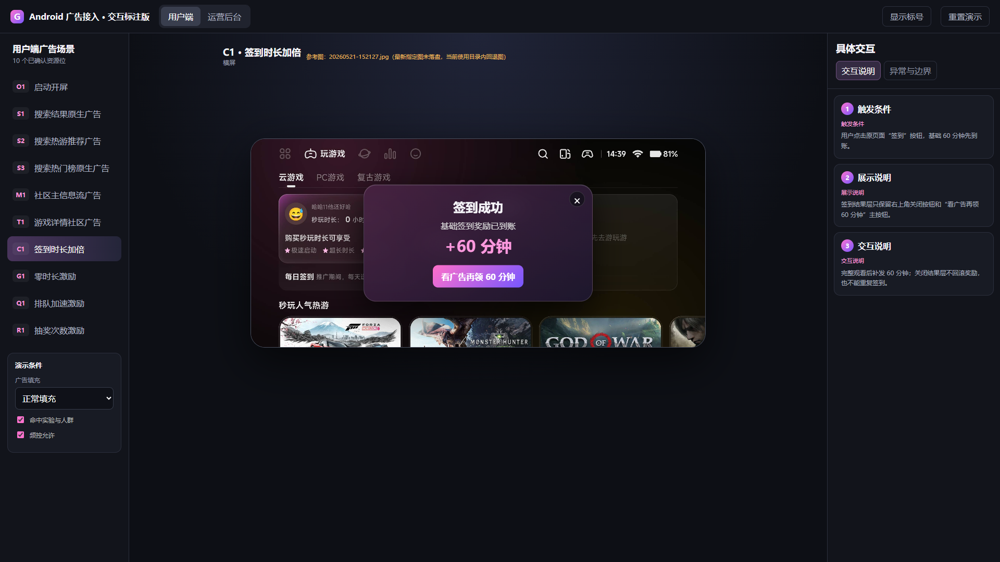|① **触发条件**：仅国内。用户完成当日首次签到、基础奖励到账后，且 C1 当日领取资格可用；C1 每日最多领取 1 次，与 Q1 互不冲突。 ② **展示说明**：签到结果弹窗显示“签到成功”、基础奖励、右上角关闭按钮和“看广告再领 X 分钟”，不显示“完成”按钮；X 由后台奖励字典配置。点击广告入口后由 SDK 覆盖完整 App 页面播放激励视频。 ③ **交互说明**：仅 SDK 返回完整播放/奖励成功回调且服务端校验成功后，自动关闭签到结果弹窗、实时更新累计云游戏时长并 Toast“奖励已发放”，不新增成功弹窗。用户主动关闭签到结果弹窗后，客户端记录当日关闭状态，当日不再弹出且不再提供 C1 唤起入口。 ④ **异常处理**：提前关闭、无填充、播放未完成或校验未通过时，返回后保持签到结果弹窗打开，保留基础奖励，Toast“播放未完成，奖励未发放”；不补发广告奖励、不消耗 C1 当日领取资格。来源页已销毁时返回签到默认页，不自动重播。 ⑤ **状态与幂等**：客户端本地仅保存签到弹窗当日关闭状态；服务端保存每日领取资格和发奖结果。同一奖励只发一次；横竖屏切换保持同一广告请求，不重复曝光、计费或发奖。 |
|G1 零时长激励广告|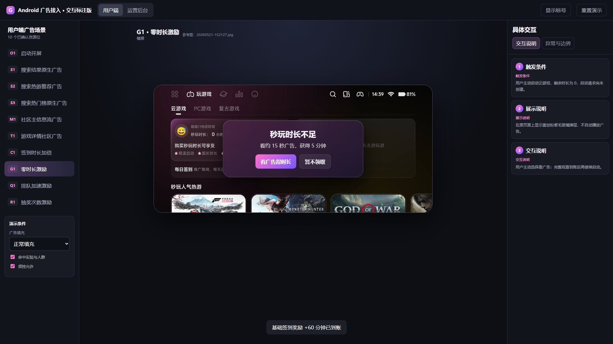 激励广告参考：  |① **触发条件**：**仅国内**。用户主动启动云游戏，服务端判断可用时长为 0，启动请求尚未创建，广告奖励资格可用；与 Q1 互斥。剩余 1—14 分钟时可复用同一提示组件。 ② **展示说明**：复用盖世游戏原有深灰色“提示”弹窗，不新增广告样式弹窗。正文说明当前时长不足和进度风险，并提示“完整观看约 15 秒广告，可获得 X 分钟云游戏时长”；底部显示“看广告得 X 分钟”和“前往充值”，右上角 `×` 为暂不处理。 ③ **交互说明**：点击广告按钮后先关闭提示弹窗，再由 SDK 覆盖完整 App 页面播放激励视频；点击 CTA 可打开 SDK 全屏落地页、系统应用商店或第三方应用。仅 SDK 完整观看回调和服务端校验均成功后发放 X 分钟，Toast“奖励已发放”，继续创建云游戏启动请求，不展示成功或“完成”弹窗。零时长时点击 `×` 返回原玩游戏页且不创建启动请求；低时长时点击 `×` 关闭提示并继续当前游戏。 ④ **异常处理**：提前关闭、无填充、播放未完成或校验未通过时，关闭广告层并恢复原“提示”弹窗，Toast“播放未完成，奖励未发放”；不发奖励、不扣领取资格、不创建启动请求。来源页已销毁时返回玩游戏默认页，不自动重播。 ⑤ **幂等与横竖屏**：重复回调不重复发奖或重复显示 Toast；横竖屏切换保持同一广告请求，不重复曝光、计费或发奖。 |
|Q1 排队加速激励|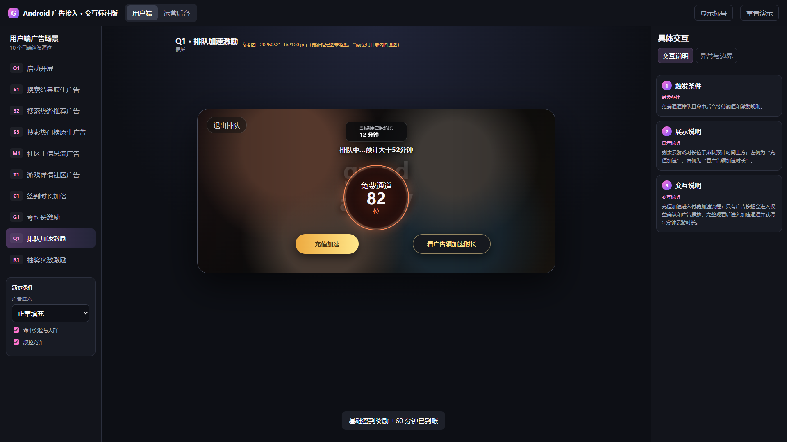|① **触发条件**：仅国内。用户处于免费通道排队中，预计等待超过后台阈值，Q1 当日领取资格可用；Q1 每日最多领取 1 次，与 C1 互不冲突；G1 与 Q1 在同一次游戏启动意图中仍互斥。 ② **展示说明**：排队页展示用户全部剩余云游戏时长，位于排队信息上方；排队位数只显示 100 以内；操作区提供“充值加速”和“看广告领加速时长”。X 分钟及加速权益由后台奖励字典配置。 ③ **交互说明**：仅 SDK 返回完整播放/奖励成功回调且服务端校验成功后发放权益并 Toast“奖励已发放”；剩余时长在服务端返回成功结果后立即刷新，不等待订单轮询。仍在免费排队时发放加速和 X 分钟并刷新预计等待；广告期间已排到或用户已退出排队时只发 X 分钟，不重新入队。 ④ **异常处理**：提前关闭、无填充、播放未完成或校验未通过时返回原排队页并保留排队位置，Toast“播放未完成，奖励未发放”；不发权益、不消耗 Q1 当日领取资格。校验超时时显示“权益确认中”，最多执行 3 次服务端校验；最终仍无结果时保留资格并进入人工/平台数据核对。 ⑤ **排队与幂等**：广告播放期间维持排队心跳；服务端保存每日资格和发奖结果，重复提交返回首次结果；客户端仅保存当前页面和播放 UI 状态。 |

原生/信息流广告通用素材规则：第三方平台约提供 5—6 套素材尺寸，客户端优先选择与当前容器比例一致的素材并按内容区宽度等比缩放，不横向或纵向拉伸。评审中的“300×200、2:1”口径互相冲突；300×200 实际为 3:2，最终默认尺寸须以 SDK 调研结果和 UI 容器比例为准，见第九章待确认项。

广告内容和关闭/负反馈控件由 SDK 提供；盖世游戏 UI 仅输出容器及自然内容融合样式。国内关闭个性化推荐后，广告请求数量和频率不变，由广告 SDK 降低匹配度。

#### Q1 竞态规则：

|场景|加速权益|时长权益|次数|用户结果|
|---|---|---|---|---|
|完整观看且仍在免费排队|发放|发放|扣 1 次|显示到账和新预计等待|
|广告期间已经排到|不再发放|发放|扣 1 次|继续进入游戏，时长入账|
|用户退出排队但已完整观看|不发放|发放|扣 1 次|保持退出，不重新入队|
|提前关闭或播放失败|不发放|不发放|不扣|回到原排队页和原位置|
|校验超时|待确认|待确认|暂不扣 |显示“权益确认中”，自动查询，不要求重看|
|重复提交同一奖励|返回首次结果|不重复发放|不重复扣|展示已有结果|

通用规则：

1. 广告显示前依次判断：全局开关 → 禁投场景 → 国内/海外 → App 版本 → 当前地区命中的全局或单功能实验分组 → 资源位显隐 → 频控 → 广告请求。

2. 原生/信息流广告按有效曝光计入频控；请求失败、无填充不计次。

3. 激励广告按成功发放权益计次；提前关闭、失败或无填充不计次。

4. 频率支持 1 天 N 次、X 天 N 次、生命周期 N 次、永久 1 次和最短间隔。

5. S2、S3 共用搜索默认页总频控；任一达到共享上限后，两者均不再请求。

6. G1、Q1 在同一次游戏启动意图中互斥；任一成功发放后，另一入口隐藏。

7. 原生广告无填充时由自然内容补位，不保留空白。

8. 除 S1 待验证的直接下载链路外，广告点击后的真实落地页由 SDK 决定，不拼装盖世游戏详情页。

9. 点击前保存页面、Tab、关键词、已加载内容和滚动位置；关闭落地页后恢复。

10. C1、Q1 各自每日最多领取 1 次，彼此不互斥；奖励分钟数和加速权益统一读取后台奖励字典。

11. 激励发奖以 SDK 完整播放/奖励成功回调为准，不以客户端观看 5 秒作为发奖条件。服务端收到回调后最多校验 3 次，同一奖励标识只结算一次。

12. 客户端本地只保存弹窗关闭、当前播放页面等 UI 状态；每日领取资格、奖励发放结果和幂等记录由服务端保存。

国内与海外差异：

- **国内包：激励广告使用穿山甲，原生/信息流广告使用腾讯广告；海外包：原生/信息流广告使用 Google AdMob。不同地区不自动切换广告网络。**

- **国内首批广告位为 S1、S2、S3、M1、T1、C1、G1、Q1；R1 不在本期。**

- **海外首批广告位为 S1、S2、S3、M1、T1；C1、G1、Q1 因海外无云游戏而不展示；海外支持 A/B 实验。**

- **云游戏仅国内提供，因此 C1、G1、Q1 仅国内展示。**

本期分阶段范围：

|阶段|资源位|名称|形式|地区|
|---|---|---|---|---|
|首批上线|O1|APP 开屏页运营资源位|自有运营资源|国内、海外|
|首批上线|C1|签到时长加倍|激励视频|仅国内|
|首批上线|G1|零时长激励|激励视频|仅国内|
|首批上线|Q1|排队加速激励|激励视频|仅国内|
|首批上线|S1|搜索结果原生广告|原生广告|国内、海外|
|首批上线|S2|搜索热游推荐广告|原生广告|国内、海外|
|首批上线|S3|搜索热门榜原生广告|原生广告|国内、海外|
|首批上线|M1|社区主信息流广告|信息流广告|国内、海外|
|首批上线|T1|游戏详情社区广告|信息流广告|国内、海外|

本期明确排除：R1 抽奖次数激励。所有首批广告位均完成开发能力，实际曝光由运营后台开关、频控和 A/B 实验控制。

### 4\.3 详细设计（B端）

广告商业化后台固定 2 个页面：广告投放配置、实验与效果；“实验与效果”内含“A/B 测试配置、效果统计”两个 Tab。

国内与海外在页面内通过 Tab 切换，投放配置、实验和效果数据互不覆盖；国内与海外均提供 A/B 新建入口。

|模块名称|图示|展示\&交互说明|
|---|---|---|
|广告投放配置 | |① **筛选区**：配置名称/广告位 ID 使用输入+模糊搜索；广告形式、广告网络、状态、上线阶段使用下拉+单选；多个条件为“且”。查询和重置后回到第 1 页。 ② **投放对象**：固定为当前地区全部合格用户，不提供运营配置项；按地区切换国内或海外配置。 ③ **列表**：展示配置名称、广告位、上线阶段、平台、广告网络/形式、广告位 ID、插入位置数组、单页数量、频控、状态、更新时间和操作；默认按更新时间倒序，时间相同按配置 ID 倒序；每页 20 条，显示总条数和总页数。 ④ **配置字段**：配置名称、广告位、广告网络、第三方广告位 ID、显隐、插入位置数组、单页数量、频控类型、次数、周期、最短间隔、开始时间和结束时间。广告位创建后不可改；广告位 ID 由运营在广告平台申请后手动填写。 ⑤ **操作与异常**：支持新增、查看、编辑、复制、保存草稿、发布、暂停、删除和“一键关闭全部广告”。删除为软删除；运行中配置先暂停再删除；并发编辑要求重新载入；配置拉取失败时客户端本次启动全部广告关闭。|
|A/B 测试配置 | |① **范围**：国内、海外分别配置“有广告/无广告”实验，可选择全局广告或单个广告功能。 ② **目标对象**：运行支持版本的当前地区 Android 用户，包含登录用户和游客；按匿名安装 ID 哈希稳定分桶，不采集 IMEI。 ③ **实验字段**：实验名称、地区、实验功能、目标版本、实验总流量、有广告组比例、无广告组比例、开始时间、结束时间和状态；比例合计必须为 100%。 ④ **列表与操作**：展示实验名称、功能、地区、APP 版本、流量、分组比例、周期、状态和更新时间；支持新建、查看、编辑、复制、启动、暂停、继续、结束和删除；历史实验永久保留。 ⑤ **唯一性与异常**：同地区同功能同时只能存在一个“待开始”或“进行中”实验；全局实验与任一单功能实验互斥。比例不为 100%、时间错误或存在冲突时禁止保存/启动，并提示冲突实验 ID。|
|效果统计| |① **范围**：国内、海外分别展示 A/B 实验结果；曝光、点击、CPM、CTR、广告收入和填充率仍在第三方广告平台查看。 ② **筛选区**：统计周期支持今日、昨日、近 7 天、近 30 天和自定义日期；实验分组、A/B 实验和实验状态使用下拉+单选；多个条件为“且”。 ③ **指标**：展示实验用户数、次日留存、7 日留存、付费人数、付费总额、付费订单数、整体付费率、云游用户数和人均云游时长；每项右侧“？”说明定义。海外云游指标显示“不适用”。 ④ **列表**：按有广告组、无广告组和组间差值展示样本量、次日留存、7 日留存和整体付费率。 ⑤ **异常处理**：样本未成熟时显示“数据未成熟”；缺数显示“—”；统计任务失败时保留最近一次成功结果并标记更新时间，不以 0 或第三方估算值补齐。|

A/B 实验指标口径：

|指标|计算公式|观察窗口|
|---|---|---|
|次日留存率|分桶后第 1 个自然日再次启动 App 的去重用户数 ÷ 当日首次进入该实验组的去重用户数 × 100%|按首次分桶日形成日 cohort，次日数据完整后计算|
|7 日留存率|分桶后第 7 个自然日再次启动 App 的去重用户数 ÷ 当日首次进入该实验组的去重用户数 × 100%|按首次分桶日形成日 cohort，第 7 日数据完整后计算|
|整体付费率|实验周期内发生至少 1 次有效支付的去重用户数 ÷ 实验周期内进入该实验组的去重用户数 × 100%|实验开始至结束；退款成功订单不计有效支付|
|付费人数|统计周期内至少完成一笔有效支付的去重用户数|支付成功计入；退款按现有财务口径更正|
|付费总额|统计周期内有效支付订单实付金额合计|按币种分别统计，不跨币种直接相加|
|付费订单数|统计周期内有效支付成功订单数量|同一用户多笔订单分别计数|
|云游用户数|统计周期内至少成功进入一次云游戏的去重用户数|仅国内；海外显示“不适用”|
|人均云游时长|云游总时长 ÷ 云游用户数|仅计算玩过云游的用户；单位为分钟；海外显示“不适用”|

组间差值统一按“有广告组指标－无广告组指标”计算；结果同时显示绝对百分点差和相对变化率。目标人群只以首次稳定分桶为准，不按实际广告曝光筛选，避免样本偏差。

投放配置状态：

|状态|允许操作|禁止操作|
|---|---|---|
|草稿|查看、编辑、复制、发布、删除|暂停|
|已发布|查看、复制、暂停|直接编辑、删除|
|已暂停|查看、编辑、复制、重新发布、删除|无|
|已结束|查看、复制|编辑、发布、暂停、删除|

实验状态：

|状态|允许操作|禁止操作|
|---|---|---|
|草稿|查看、编辑、复制、启动、删除|暂停、结束|
|运行中|查看、复制、暂停、结束|编辑、删除|
|已暂停|查看、复制、继续、结束|直接编辑、删除|
|已结束|查看、复制|编辑、启动、暂停、删除|

#### 4\.3\.1 边界条件\-内容侧

|场景|处理方式|
|---|---|
|原生素材与游戏内容无关|在第三方平台优先选择游戏类广告；游戏类无填充时允许其他合规品类兜底，运营可配置行业黑名单和屏蔽词|
|素材含赌博、现金贷、色情擦边或仿系统弹窗|立即暂停对应网络或资源位，保留素材和请求记录|
|标题或图片加载失败|隐藏广告并由自然内容补位，不显示残缺卡片|
|标题过长|按对应自然卡片行数截断，不允许广告单独扩高|
|素材使用虚假评分、排名或推荐标识|客户端不渲染排名或推荐字段，保留 `Ad`|
|社区广告伪造点赞、评论或官方身份|不渲染虚假互动数字；广告主名称和 `Ad` 始终可见|
|落地页无法打开|停留原页面并记录失败，不自动重复打开|

#### 4\.3\.2 边界条件\-用户侧

|场景|处理方式|
|---|---|
|弱网或断网|自然内容照常展示；广告超时后取消；激励广告失败不扣次数|
|快速重复点击广告按钮|首次点击后按钮进入处理中；同一操作只创建一次请求|
|用户关闭落地页|恢复原页面、Tab、已加载内容和滚动位置|
|用户切换横竖屏|重新计算布局，不重复计算同一次曝光|
|未登录用户|原生/信息流广告按配置展示，游客参与当前地区命中的全局或单功能 A/B 分桶；C1、G1、Q1 必须登录|
|登录过期|保存奖励校验结果；重新登录后查询原奖励，不要求重看|
|达到频控|不请求广告；原生内容连续展示；C1、Q1 每日成功领取 1 次后当日入口隐藏|
|广告播放中 App 进入后台|按 SDK 规则暂停或关闭；回前台后先查询奖励状态|
|同一奖励回调重复到达|返回首次结算结果，不重复发放|
|G1 与 Q1 同时合格|成功发放在先的场景占用资格，另一入口立即隐藏|
|配置拉取失败或超时|本次启动所有广告关闭，不使用旧缓存继续投放；自然内容和原业务流程照常|
|关闭国内个性化推荐|广告数量和频率不变，SDK 改为非个性化/低匹配广告；客户端不自行减少广告请求|

## 五、非功能需求

|需求类型|详细要求|
|---|---|
|性能|广告 SDK 不同步阻塞主线程；自然内容先展示；P95 首屏可交互时间增量不超过 300ms；激励奖励 P95 3 秒内返回“已发放”或“确认中”|
|稳定性|广告异常不影响页面和游戏启动；Q1 广告播放期间持续维持排队心跳|
|兼容性|仅 Android；最低系统版本跟随当前正式包；横竖屏按资源位要求验收；SDK 不支持的设备降级为无广告|
|安全|奖励接口需鉴权、幂等、防重放和限流；广告平台密钥不下发客户端；后台发布、暂停、删除和补发留审计日志|
|隐私|上线前在隐私政策、第三方 SDK 清单和应用商店披露中增加穿山甲、腾讯广告、Google AdMob 的信息收集范围、用途、处理方式和官网链接；完成对应渠道备案后才可开启广告。国内关闭个性化推荐后按 SDK 非个性化规则请求，广告总量不因该开关减少。|
|容错|配置在客户端本地保存并于启动时重新拉取；拉取失败、超时或签名校验失败时，本次启动所有广告全关。网络异常时不跨地区或跨广告网络回退。|
|监控|自有系统监控配置拉取、全局开关、Crash、ANR、实验分组、付费与云游效果和激励发奖；广告曝光、点击、填充、CPM、CTR 和广告收入使用第三方平台后台。|
|海外回调|海外上线前验证 Google AdMob 回调与国内服务端的连通性；若平台无法直接回调，运营从平台后台导出曝光、点击和收入数据进行核对，不据此向客户端补发云游戏权益。|

止损与熔断：

- 后台提供全局“一键关闭全部广告”，全局关闭优先于地区和资源位配置；关闭后客户端下次拉取立即生效，紧急情况支持推送配置刷新。

- 次日留存绝对下降达到 0.5 个百分点，或相对下降达到 3%，暂停实验并一键关闭全部广告。

- 7 日留存绝对下降达到 0.3 个百分点，或相对下降达到 2%，暂停实验并一键关闭全部广告。

- 整体付费率出现显著负向变化时暂停实验，由产品、运营复核付费口径和广告收益后决定是否继续。

- 出现重复发奖、违规素材或大面积 Crash/ANR 时立即一键关闭全部广告；不等待实验周期结束。

## 六、埋点需求

### 6\.1 本期数据改造

本期不新增第三方广告曝光、点击、填充、CPM、CTR、收入或落地页统计接口；这些数据以穿山甲、腾讯广告和 Google AdMob 后台为准。留存、付费和云游复用现有 App 启动、支付/充值、云游进入与时长结算事件，并追加实验标识。APP 开屏页运营资源复用现有运营资源曝光、点击事件。

|复用事件|现有触发时机|本次改造|用途|
|---|---|---|---|
|App 启动事件|沿用现有触发时机|追加 `ad_experiment_id`、`ad_experiment_version`、`ad_experiment_group`|计算次日留存率和 7 日留存率|
|支付/充值成功事件|沿用现有成功口径|追加 `ad_experiment_id`、`ad_experiment_version`、`ad_experiment_group`|计算付费人数、付费总额、付费订单数和整体付费率|
|云游成功进入事件|沿用现有成功进入口径|追加 `ad_experiment_id`、`ad_experiment_version`、`ad_experiment_group`|计算云游用户数|
|云游时长结算事件|沿用现有有效时长口径|追加实验标识；复用结算时长|计算人均云游时长|
|运营资源曝光/点击事件|APP 开屏页资源实际展示或点击查看详情|资源位置增加 `APP_OPENING` 枚举|统计 O1 自有资源曝光和点击，不计入广告曝光|

> 激励广告的奖励校验、每日资格和幂等结算属于业务交易日志，不作为本期效果统计埋点；服务端必须保留 `reward_id`、场景、用户、领取日期、奖励值和结算结果，供发奖、防重和申诉核对。

### 6\.2 公共参数

|参数名|类型|必填|说明|枚举/示例|
|---|---|---|---|---|
|`ad_experiment_id`|string|进入实验时必填|当前地区的全局或单功能广告实验 ID；未进入实验时为空|`AD_GLOBAL_202608`|
|`ad_experiment_version`|string|进入实验时必填|实验版本；比例、周期或目标版本变化时生成新版本|`V1`|
|`ad_experiment_group`|string|进入实验时必填|稳定分桶结果|`AD` / `NO_AD`|

数据口径：

- 实验分析按首次分配组执行，不因用户是否实际看到广告而换组或剔除。

- 游客和登录用户统一使用同一安装实例的匿名安装 ID 分桶；登录前后分组不变，不使用 IMEI。

- 退款成功订单不计整体付费率的有效支付；退款状态未最终确认前沿用现有支付统计口径，并在最终状态到达后更正。

## 七、运营需求

1. **P0：广告平台准备**

    - 服务端和客户端先完成穿山甲、腾讯广告、Google AdMob 的能力调研，明确支持的广告形式、素材尺寸、关闭控件、S1 直接下载、奖励回调、服务端校验、海外连通性和可导出字段；调研结论评审通过后再拆开发任务。

    - 完成国内穿山甲激励广告、腾讯原生/信息流广告和海外 Google AdMob 原生/信息流广告的应用与广告位申请；运营将广告位 ID 手动填写到 App 后台。

    - 配置广告类目白名单、黑名单和屏蔽词。

    - 确认违规素材、投诉和平台对账负责人。

2. **P0：投放规则准备**

    - 首批完成 C1、G1、Q1、S1、S2、S3、M1、T1 八个广告位；运营按地区、广告位开关和频控决定实际放量，不要求同步全开。

    - 在奖励字典中配置 C1、G1、Q1 的奖励分钟数和 Q1 加速权益；C1、Q1 各每日 1 次、互不冲突，G1 与 Q1 在同一次启动意图中互斥。

    - 显隐、位置数组、数量、频率和时间范围由后台下发，不写死在客户端；配置拉取失败时全部广告关闭。

3. **P0：实验与止损**

    - 国内与海外可分别创建全局或单功能实验，默认 50% 有广告组、50% 无广告组，包含登录用户和游客；同地区同功能仅允许一个待开始或进行中的实验。

    - 实验评估留存、付费人数、付费金额、付费订单、整体付费率和云游使用；广告曝光、点击、CPM、CTR 和广告收入在第三方平台后台查看。

    - 留存触发止损或出现重复发奖、违规素材、大面积 Crash/ANR 时，立即使用“一键关闭全部广告”。

4. **P0：合规准备**

    - 更新隐私政策、第三方 SDK 清单、应用商店披露和未成年人策略，逐一写明穿山甲、腾讯广告、Google AdMob 的收集范围与用途，完成备案后再上线对应渠道。

    - 国内与海外分别检查 `Ad` 标识、平台原生关闭控件和个性化广告授权；国内关闭个性化推荐后广告量不变。

5. **P1：日常运营**

    - 每日在第三方平台查看请求、填充、曝光、点击、收入和违规素材，在自有后台查看配置状态、Crash/ANR 和发奖异常。

    - 每周查看有广告组与无广告组的次日留存、7 日留存和整体付费率。

    - 每月完成广告平台账单对账和激励权益成本核算。

建议上线顺序：

1. 完成 SDK 能力调研、隐私合规、配置拉取、奖励校验、公共实验参数和后台两页，不开放用户流量。

2. 验证匿名安装 ID 稳定分桶、配置失败全关、一键关闭、奖励幂等、平台数据导出和海外回调连通性。

3. 交付 O1 运营资源位和 C1、G1、Q1、S1、S2、S3、M1、T1 八个广告位，运营先按小流量开启并观察。

4. 国内、海外分别新建实验；同一功能只保留一个待开始或进行中的实验。

5. 按周复核留存、付费和云游指标，结合第三方平台广告收入调整广告位开关和频控。

6. R1 抽奖激励不在本期；出现止损条件时暂停对应实验并一键关闭广告。

## 八、修改记录与上线后更新

### 8\.1 V1\.1 评审修改记录

|序号|评审结论|修改位置|处理结果|
|---|---|---|---|
|1|搜索默认页先热游推荐，再热门搜索；固定 Banner 暂缓|4.2 S2、S3|已调整顺序；热门搜索统一 Icon，每页 10 条，位置和数量后台下发|
|2|原生/信息流广告新增插入、平台原生关闭控件、游戏类优先|4.2 M1、T1；4.3 投放配置|已改为位置数组配置，不替换自然内容，不自定义关闭菜单|
|3|广告位 ID 运营申请并手动回填|4.1、4.3、七|已明确不开发第三方平台自动同步接口|
|4|签到、排队激励各每日一次且互不冲突|4.2 C1、Q1、通用规则|已补充失败弹窗、成功 Toast、时长实时刷新、关闭后当日不再唤起和奖励字典|
|5|全局有广告/无广告 A/B，默认 50%:50%|3.3、4.3、六|已收敛为国内 Android 全局实验，游客纳入，海外不做|
|6|只保留次日留存、7 日留存和整体付费率|3.4、4.3、五、六、七|已删除自建广告经营数据需求，补充三项指标公式|
|7|本期裁剪抽奖激励和 APP 开屏运营资源位|二、三、4.1、4.2、范围表、六、七|已从本期开发、埋点和上线顺序中移除|
|8|初期仅上线 2—3 个低干扰广告位|3.5、4.2 范围表、七|首批确定为 C1、Q1、M1，其他场景后续评估|
|9|配置启动拉取、失败全关；SDK 分工调整|4.1、4.3、五、七|国内激励穿山甲、原生/信息流腾讯、海外 AdMob；失败不使用旧缓存投放|
|10|隐私、海外回调和技术调研前置|五、七、九|已补三家 SDK 合规、海外数据导出兜底和开发拆分前置条件|

### 8\.2 V1\.2 范围与后台修改记录

|序号|修改结论|修改位置|处理结果|
|---|---|---|---|
|1|恢复首批广告位范围|二、三、4.1、4.2、七、九|C1、G1、Q1、S1、S2、S3、M1、T1 均进入首批；仅 R1 排除|
|2|启动页不接广告 SDK，新增自有运营资源|2、3.1、3.3、4.1、4.2 O1、六|新增 APP 开屏页资源位置，复用首页卡片管理，支持横竖屏和国内/海外配置|
|3|后台由 3 页合并为 2 页|4.3|保留广告投放配置；A/B 测试配置与效果统计合并到“实验与效果”页内两个 Tab|
|4|删除投放对象配置|4.3 广告投放配置|固定投放当前地区全部合格用户，筛选、列表、编辑表单均不提供对象范围字段|
|5|国内、海外均支持 A/B|3.3、4.1、4.2 差异、4.3、六、七、九|支持全局或单功能实验；同地区同功能唯一，全局与单功能互斥|
|6|补充效果指标和定义|4.1、4.3、六、七、九|新增付费人数 65、付费总额、付费订单数、云游用户数、人均云游时长；每项提供“？”定义，海外云游显示“不适用”|

### 8\.3 上线后更新

上线后记录。

## 九、验收与待确认项

### 9\.1 验收标准

|序号|验收项|通过标准|
|---|---|---|
|1|本期范围|O1、C1、G1、Q1、S1、S2、S3、M1、T1 均有可操作入口和后台配置；R1 无入口、无配置、无请求|
|2|SDK 分工|国内激励只请求穿山甲，国内原生/信息流只请求腾讯广告，海外原生/信息流只请求 Google AdMob；不跨网络回退|
|3|配置降级|启动拉取失败、超时或验签失败时，本次启动全部广告关闭，原页面、签到和排队流程可正常使用|
|4|搜索默认页|先展示热游推荐，再展示热门搜索；热门搜索每页 10 条且统一 Icon；广告位置和数量按后台配置生效，无填充不留空位|
|5|信息流融合|M1/T1 以新增卡片插入，不减少自然帖子；位置数组和分页规则正确；关闭/负反馈使用平台原生控件|
|6|签到激励|C1 每日成功领取最多 1 次；失败后签到弹窗保持打开且不发奖；成功后弹窗关闭、时长实时刷新并 Toast“奖励已发放”；主动关闭后当日不再出现入口|
|7|排队激励|Q1 每日成功领取最多 1 次，与 C1 互不冲突；展示全部剩余时长；成功后立即刷新；重复回调不重复发奖|
|8|A/B 实验|国内、海外登录用户和游客均按匿名安装 ID 稳定分桶；可创建全局或单功能实验；同地区同功能唯一，全局与单功能互斥；登录、重启和横竖屏切换不换组|
|9|效果统计|9 项指标均展示定义；付费人数示例为 65；海外云游用户数和人均云游时长显示“不适用”；分组表和组间差值正确，广告经营数据不重复建设|
|10|APP 开屏页资源|Logo 后按配置展示 O1；跳过、自动进入和查看详情路径可用；无资源或素材失败直接进入首页；横竖屏素材不拉伸混用|
|11|合规与止损|三家 SDK 隐私说明和渠道备案完成；关闭个性化推荐后广告量不变；后台一键关闭全部广告可用并留操作日志|

### 9\.2 必须确认

> ⚠️ 判断可能存在问题，此处需要深度思考和决策。

|待确认项|当前问题|默认建议|不确认的影响|
|---|---|---|---|
|激励回调条件|评审写“播放超过 5 秒触发回调”，但激励奖励通常要求 SDK 完整播放/奖励成功回调；按 5 秒直接发奖存在刷奖励风险|以 SDK 奖励成功回调为唯一发奖前提；5 秒回调只可作为播放过程状态，不发权益|影响 SDK 接入、服务端校验、测试用例和成本安全；开发拆分前必须确认|
|素材比例|评审同时写“300×200”和“2:1”，两者不一致；300×200 实际为 3:2|以 SDK 实际尺寸清单和 UI 容器比例选材，等比缩放；不写死错误比例|影响 UI 容器、素材验收和横竖屏适配；联调前必须确认|
|S1 直接下载与秒玩|评审要求广告卡保留秒玩且点击直接下载，但第三方 SDK 可能强制使用平台落地页或应用商店|先验证腾讯广告和 AdMob 是否支持；支持则按 S1 执行，不支持则 S1 不进入当前版本，不自行绕过平台链路|影响 S1 是否可开发和合规上线；开发前必须确认|
|服务端状态边界|评审提出“播放状态仅本地保存”，但每日一次、跨端一致性、反作弊和幂等发奖不能只依赖本地状态|本地只存 UI 状态；服务端保存每日资格和奖励结算，且最多校验 3 次|影响权益安全、用户申诉和测试；开发拆分前必须确认|
|分桶标识|评审指定 IMEI，但 Android 新版本获取受限且存在隐私合规风险|使用 App 生成的匿名安装 ID，游客和登录用户统一按安装实例分桶，不采集 IMEI|影响隐私合规、游客分桶和实验稳定性；技术与法务评审前必须确认|

### 9\.3 自检记录

- 已检查列表排序、分页、空状态、筛选条件、状态流转、并发编辑、配置失败、弱网、横竖屏、登录/游客、国内/海外、隐私、灰度和止损。

- 已将 O1 与 8 个首批广告位融入原 C/B 端表格；R1 继续从本期链路中排除。

- 已将修改内容标黄，新增/修改关键词使用蓝色加粗；新增 O1 并替换后台 3 张图示，均位于模块表“图示”列。

### 9\.4 模拟评审结果

|角色|结论|发现的问题|
|---|---|---|
|前端开发|⚠️|S1 直接下载/秒玩和第三方平台素材比例须先完成 SDK 能力验证，已列入 9.2|
|测试工程师|⚠️|激励回调条件、最多 3 次校验和本地/服务端状态边界须在接口评审时锁定，已列入 9.2|
|运营/业务方|✓|广告位 ID 手工回填、首批资源位、平台数据查看位置、合规和全量关闭路径已明确|

**已自动补充的硬伤：** 补充全局实验公式、游客稳定分桶、配置失败全关、平台原生关闭控件、三家 SDK 合规、海外回调兜底、每日资格和奖励幂等边界。

**待确认建议：** 按 9.2 五项在开发拆分或对应场景开发前确认；未确认项不得用默认假设直接上线。
