# 【PRD】发行平台游戏创建\&发行申请与审核需求

## 修订记录

|修订日期|修订内容|版本|修订人|
|---|---|---|---|
|2026/9/7|创建文档|V1\.0|郑群超|
|2026/9/9|1、补充游戏删除场景范围 2、补充分区定价功能 3、移除发行范围中国大陆区域与后台切换发行范围中国大陆 4、补充个人发布者提交发布拦截|V1\.1|郑群超|
|2026\.9\.18|1、补充独立系统和开发者平台 2、补充审核结果通知模板|V1\.2|郑群超|
|2026\.9\.22|1、版本发布改为选择构建管理中的已有 Build，并联动回显商品、SKU 与 DLC 商品 2、补充支持的控制器与 Windows 系统要求 3、补充穷举态、缺省态及对应跳转入口，更新开发者端 Demo|V1\.3|郑群超|

**备注：** 搜2026.9.22修改。

## 一、文档概述

**账户体系：独立账号 \+ 授权登录打通**

- 两边账号体系完全分离；通过**授权登录**打通（类似微信 / Steam 登录，新增 "盖世" 登录方式），用户同意后两边数据可打通，未来可用同一数据库做统一调度（Tips / 红点 / 通知等）。

**运营后台分工：**

- 发行平台新后台：负责发行业务**全链路**（开发者入驻 → 上架 → 公告配置 → 对账 → 支付），以及客诉、订单管理、审核等功能。//2026\.9\.18修改

### 1\.1 背景概述

- **背景：** 提供开发者完成企业认证后，从创建游戏到版本发布技资质管理的能力。

- **目标****：** 开发者可自行提交游戏审核，平台可对开发者提交的游戏、包体及相关资质认证进行审核。

### 1\.2 需求边界

|边界类型|范围说明|
|---|---|
|产品边界|涉及开发者端游戏管理、添加游戏、版本发布、发布记录、资质认证；涉及运营端游戏发布审核、资质认证审核、包体测试和审核记录。|
|业务边界|覆盖游戏创建、资料准备、PC 整包／增量包、商品与 SKU、发行设置、资质、提审、测试和审核结果。|
|运营边界|测试人员提交包体测试结论；发行运营处理发布审核；资质审核员处理游戏资质。|
|人力边界|产品和设计维护页面口径；前后端实现提审与状态回写；测试人员执行包体测试；运营和资质审核员给出结论；法务确认国内发行材料。|

### 1\.3 术语定义

|术语／缩写|定义与判断口径|
|---|---|
|Game ID／APPID|创建游戏后生成的唯一游戏标识和接入标识。|
|当前修订|一次发布提审冻结的只读内容，包含资料、包体、SKU、发行设置和资质引用。|
|必测包体|当前修订新增或替换，且被本次发布引用的包体。|
|解析通过|文件结构、完整性和启动项校验通过，不代表游戏可运行。|
|包体测试结论|测试人员对当前修订全部必测包给出的整次结论。|
|审核状态|草稿、审核中、需补资料、未通过、已撤销、已通过。|
|发行状态|未上线、已上线、已下架；与审核状态分开。|

## 二、产品说明

### 2\.1 产品／方案简介

|项目|说明|
|---|---|
|产品／方案定位|将游戏创建、版本准备、资质和发布审核合为一条开发者发行链路，并以包体测试作为审核门禁。|
|目标用户|游戏开发者、平台测试人员、发行运营、资质审核员。|
|核心目标|开发者可完成发布；未测试或测试失败的包体不能通过发布审核；全过程可追溯。|
|使用场景|首次创建游戏、版本更新、资质提审、补传包体、发布提审和审核回溯。|
|功能概述|开发者提交不可变版本快照；测试人员完成包体测试；运营核对资料、SKU、发行设置和资质后通过或退回。|

### 2\.2 产品流程

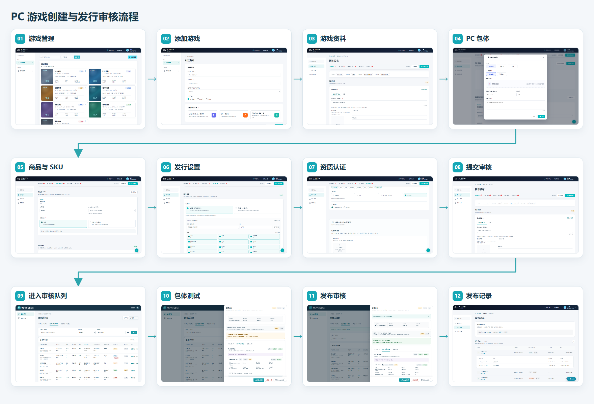

## 三、功能需求

### 3\.1 C 端功能需求

**Demo 详细设计：**[**开发者平台demo\(前端\)**](https://htmlpreview.github.io/?https://cdn.jsdelivr.net/gh/z36358631-ship-it/-@491a6cf9b7a2afc02840b0f3ac37687b1663f9de/demos/%E5%BC%80%E5%8F%91%E8%80%85%E5%90%8E%E5%8F%B0%E4%B8%80%E6%9C%9F/%E5%BC%80%E5%8F%91%E8%80%85%E5%B9%B3%E5%8F%B0demo.html#/P01-01)**    **[**开发者平台后台demo\(后端\)**](https://htmlpreview.github.io/?https://cdn.jsdelivr.net/gh/z36358631-ship-it/-@fd22f2504037ef72ffac7d790b1c8aeff7e54ba4/demos/%E5%BC%80%E5%8F%91%E8%80%85%E5%90%8E%E5%8F%B0%E4%B8%80%E6%9C%9F/%E5%8F%91%E8%A1%8C%E5%B9%B3%E5%8F%B0%E8%BF%90%E8%90%A5%E5%90%8E%E5%8F%B0demo.html#/P01-08)

#### 3\.1\.1 游戏管理

|要素|内容说明|
|---|---|
|功能简介|查看和进入当前主体的游戏。|
|场景描述|已通过企业认证的开发者继续管理游戏或添加新游戏。|
|输入／前置条件|已登录且企业认证有效。|
|需求描述 |**图示（1张）：** 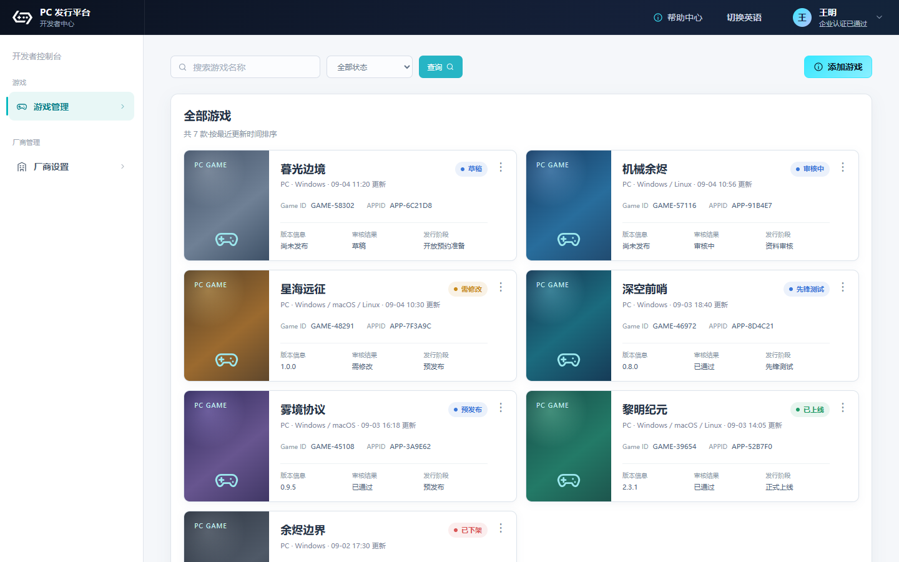 **展示说明：** 1\. 页面顶部只显示“游戏管理”和“添加游戏”；游戏卡片两列排列，单个游戏占半行。 2\. 卡片展示游戏名、Game ID、平台、审核状态、发行状态和更新时间；正常状态不显示企业认证提示。 3\. 企业认证被禁用时，列表上方显示一行异常提示，并引导邮件联系 dev@xiaoji\.com。 **交互说明：** 1\. 点击卡片任意非操作区进入游戏详情；不设置“详情”按钮。 2\. “···”提供删除；只有无审核、订单和发行记录的草稿游戏可删，确认删除前须二次确认。 3\. 点击“添加游戏”进入创建页；列表加载失败时保留页面框架并提供重试。|
|输出／后置条件|进入所选游戏的版本发布页，或进入添加游戏页。|
|补充说明|删除仅在无审核、订单和发行记录的草稿，否则删除按钮置灰处理//2026\.9\.8修改|

#### 3\.1\.2 添加游戏

|要素|内容说明|
|---|---|
|功能简介|创建游戏后台项目。|
|场景描述|开发者首次在平台发行一款游戏。|
|输入／前置条件|企业认证有效且有创建权限。|
|需求描述|**图示（1张）：** 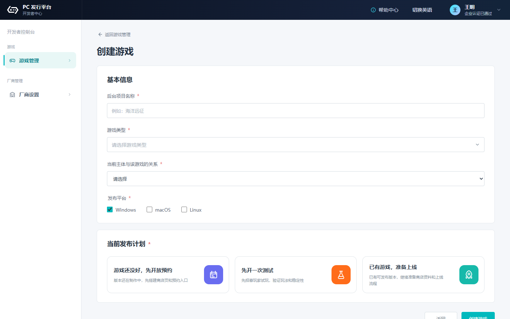 **展示说明：** 1\. 字段为后台项目名称（英文）、游戏类型（采集steam的一级分类）、当前主体跟该游戏的关系、发布平台、当前发布计划。 2\. 游戏类型必填且支持多选；主体关系必填，可选开发商、发行商、开发商和发行商。仅选发行商时显示选填的开发商名称。 3\. 发布平台至少选择一项，可选 Windows、macOS、Linux，默认 Windows。当前发布计划单选“先开放预约、先开放测试、准备上线”。 **交互说明：** 1\. 点击“创建游戏”校验全部必填项；失败时原位提示并定位首个字段，已填内容保留。 2\. 请求期间按钮禁用，重复点击只提交一次；失败后恢复可点。 3\. 创建成功生成 Game ID、APPID 和首个版本草稿，直接进入版本发布；不返回列表，不显示成功弹窗。|
|输出／后置条件|新增游戏及首个版本草稿，进入该游戏的版本发布页。|
|补充说明|游戏名称（英文）用于后台识别；商店多语言名称在游戏资料中维护。|

#### 3\.1\.3 版本发布

|要素|内容说明|
|---|---|
|功能简介|在一个长页完成游戏资料、选择已有 PC Build、核对联动商品／SKU 与 DLC 商品、填写控制器和系统要求，并完成发行设置和资质准备。//2026\.9\.22修改|
|场景描述|开发者首次发布、更新版本或按审核意见补资料后重提。|
|输入／前置条件|已进入有编辑权限的游戏；当前申请未处于审核中。可发布的 Build 已在构建管理中完成冻结、QA 测试和提包审核；商品、SKU 与 DLC 商品分别已在付费下载设置、DLC 商品设置中创建。//2026\.9\.22修改|
|需求描述|**图示（3张）：**    *图 3\.1\.3\-1：PC 游戏包多选及商品、SKU、DLC 联动回显。* *图 3\.1\.3\-2：支持的控制器与 Windows 系统要求。* *图 3\.1\.3\-3：无可用数据时的缺省态与跳转入口。* **展示说明：** 1\. 单游戏一级导航包含“版本发布、构建管理、付费下载设置、DLC 商品设置、发布记录、资质认证”；版本发布内定位项仅用于滚动当前长页。 2\. 游戏资料包含商店资料语言、游戏名称、短介绍、完整介绍、分类标签、开发商／发行商、官网、玩家群、图标、封面和截图；文本与素材按语言保存。英语默认勾选且必填，其他语言确认添加后显示对应资料表单。 3\. “PC 游戏包”仅回显构建管理中的已有 Build，不提供提交包体、“从包体库选择”或“从本地上传”。每条展示 App 类型、App ID、游戏／DLC 名称、Build ID、版本号、构建状态、QA 状态和提包状态；仅“已冻结＋QA 已通过＋提包已通过”的 Build 可选。 4\. PC 游戏包支持多选：可跨 App 选择多条；同一 App ID 只能选一个 Build。穷举态同时展示基础游戏和 DLC 的多条 Build，并区分可选、不可选和已选状态。 5\. “商品与 SKU”按已选 Build 的 App ID 自动回显付费下载设置中的商品、SKU、价格和状态，全部只读；“DLC 商品”按 DLC App ID 回显 DLC 商品设置中的图片、名称、App ID、卖点、介绍内容、默认包体、审核状态和上架状态。 6\. “支持的控制器”可选择 Xbox 控制器、PlayStation 控制器、通用控制器，并可填写其他控制器类型。 7\. Windows 系统要求分最低配置与推荐配置，两侧均包含：是否需要 64 位处理器和操作系统、操作系统、处理器、内存及单位、显卡、DirectX 版本、网络、存储空间及单位、声卡、备注；支持“独立、跨端、3A、自定义”预设，预设填充后仍可修改。 8\. 发行设置包含**中国大陆（本期暂不支持中国大陆发行，此项隐藏//2026\.9\.9修改）**／全球服、国家和地区、发行状态、生效时间、目标用户游戏兴趣**（采集steam的一级分类）**。全球服可选香港、澳门及其他国家和地区；兴趣至少选一项，可多选。 9\. 缺省态分别显示“暂无可用 PC 游戏包”“暂无商品与 SKU”“暂无 DLC 商品”，并提供“前往构建管理”“前往付费下载设置”“前往 DLC 商品设置”按钮。页面只保留一组“保存草稿／提交上架审核”。 **交互说明：** 1\. 选择跨 App Build 后合并回显各 App 对应的商品、SKU 与 DLC 商品；取消 Build 时同步移除该 App 的联动内容。同一 App 改选其他 Build 时直接替换原选择，不同时保留两个 Build。 2\. 点击缺省态按钮进入对应管理页；在目标页完成创建或审核后返回版本发布，页面重新拉取数据。 3\. 点击“提交上架审核”校验全页；未选择可用 Build、联动数据失效或 Windows 必填配置不完整时，定位对应模块并提示处理，不提供版本发布页内上传或编辑入口。 4\. 编辑或选择变化后实时重算缺失数；内部校验项不展示名称，但仍计入对应模块并阻断提交。 5\. 校验通过后生成唯一提交编号及不可变快照，页面改为只读并仅显示“撤销审核”。撤销须二次确认；确认后恢复编辑，取消不改变状态。//2026\.9\.22修改|
|输出／后置条件|保存更新草稿；提审生成 submissionId、revisionId 和只读提交快照，快照记录所选 Build ID、关联商品／SKU、DLC 商品内容、控制器类型及 Windows 最低／推荐配置，并进入运营审核队列。//2026\.9\.22修改|
|补充说明|版本发布页只选择和回显来源数据，不承担 Build 上传、商品／SKU 编辑或 DLC 商品编辑。右下角“Demo 状态”是原型演示辅助，不属于线上产品功能：游戏管理、厂商设置各 Tab 均保留悬浮入口；版本发布仅切换“穷举态／缺省态”。目标用户游戏兴趣本期不配置权重、不展示预估人群、不承诺流量；提交失败时保留全部输入并恢复按钮。//2026\.9\.22修改|

##### 付费下载设置中的商品与 SKU 定价规则

以下规则在“付费下载设置”中维护；版本发布页仅按已选 Build 的 App ID 只读回显，不在该页修改。//2026\.9\.22修改

|场景|配置与展示|提交结果|异常与历史|
|---|---|---|---|
|免费|不展示售价、折扣和定价方式|清空售价、折扣、期限和地区例外价；不做价格校验|切回收费后重新填写|
|~~中国大陆（本期不做）~~|~~固定 CNY 统一价，不展示定价方式和地区例外价~~|~~价格只覆盖中国大陆~~|~~国内外切换后须重新填写~~|
|全球统一价|默认 USD，可设置售价、折扣价和期限 |同一价格只覆盖发行设置已选地区，不扩大范围；不提交隐藏例外价|未选择发行地区时不能提审|
|分区定价|默认 USD 基准价；可从已选发行地区搜索、多选少数例外地区，使用当地币种|快照记录收费与定价方式、币种、售价、折扣、期限、发行地区数、继承地区数和有效例外价|同一 SKU＋地区仅一条例外价；售价须大于 0，未填完整时阻断提审|
|例外折扣|例外折扣价选填|已填写时随例外价进入快照|留空时继承基准折扣率和期限；无基准折扣则不打折|
|收费校验|校验基准售价、有效例外售价、折扣价和期限|售价须大于 0；折扣价须低于对应售价|折扣开始时间须早于结束时间；未填完整时阻断提审|
|发行地区联动|新增地区继承基准价；移除地区后隐藏其例外价，重新选回时恢复草稿；删除例外价后恢复继承|仅提交仍在发行范围内的例外地区|国内／海外模式切换时清空定价方式、售价、折扣、期限和例外价，须重新确认|
|历史数据|旧币种分区数据展开为地区例外价|不自动推断基准价，开发者确认后方可提审|历史提交快照不随当前地区或价格修改|

#### 个人发布者版本发布\&资质管理页

个人发布者在版本发布和资质管理的页面上“提交发布审核”按钮置灰，并增加提示条“”提交申请前，请先完成开发者认证“”，按钮“申请开发者认证”点击后跳转企业认证提交页//2026\.9\.9修改

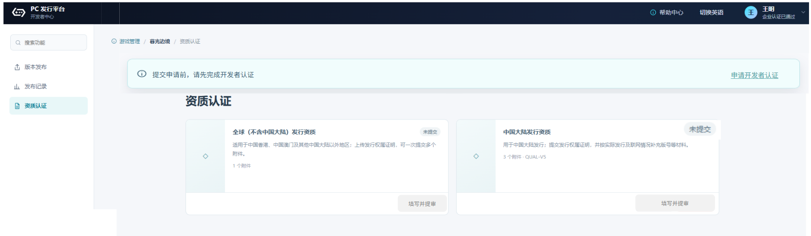

**未认证企业主体：**仅可浏览资料、提交企业认证、预填充游戏发布版本（创建草稿）。

**已认证企业主体：**可提交游戏发布版本、厂商资料管理、资质认证管理

本期范围只支持企业主体发行游戏

#### 3\.1\.4 构建管理（PC 包体上传）

|要素|内容说明|
|---|---|
|功能简介|在构建管理中上传整包或增量包，查看解析和测试状态，并为版本发布提供可选择的 Build。//2026\.9\.22修改|
|场景描述|开发者为首次发布或版本更新准备 PC 包体；完成审核的 Build 在版本发布页只读回显并供选择。//2026\.9\.22修改|
|输入／前置条件|当前版本可编辑。|
|需求描述 |**图示（2张）：** 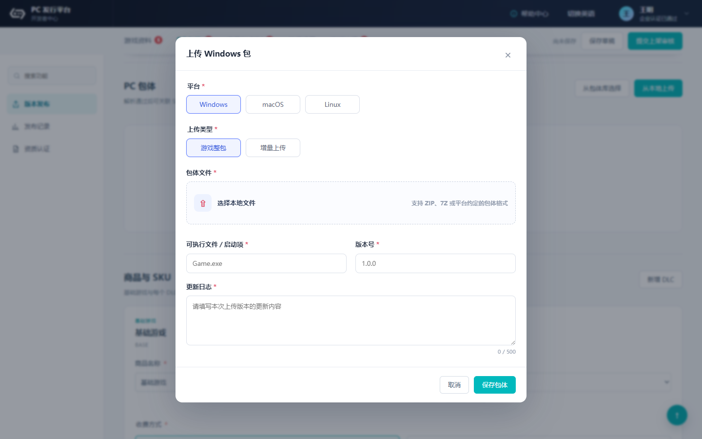  **展示说明：** 1\. 页面提供“从包体库选择”和“从本地上传”。包体库入口本期只作占位。 2\. 上传字段为平台、上传类型、包体文件、启动项、版本号、更新日志；平台支持 Windows、macOS、Linux，上传类型支持游戏整包、增量上传。 3\. 增量上传增加“基础整包”，只列同平台且解析通过的整包；无可用整包时不可保存。 4\. 包体列表分开显示解析状态和测试状态。提交前显示“未进入测试”，提交后显示待测试、测试中、测试通过或测试不通过。 **交互说明：** 1\. 点击“从本地上传”打开上传弹窗，再在“包体文件”中选择本地文件；保存前校验必填项，失败时定位字段并保留输入。更新日志最多 500 字，不提供“游戏启动参数”。 2\. 上传中显示进度，支持断点续传；中断后可继续，失败项可重试，取消未完成上传不生成包体。 3\. 上传完成后进入完整性和结构解析；解析失败显示原因并允许重传，解析通过后可关联 SKU。 4\. 点击“从包体库选择”只提示“包体库选择流程后续补充”，不打开新页面。|
|输出／后置条件|生成包体记录；解析通过后可被当前发布引用，提审后进入包体测试队列。|
|补充说明|解析通过不等于测试通过。测试不通过显示原因和附件；补传后生成新包体和新修订，旧记录只读。|

#### 3\.1\.5 资质认证

|要素|内容说明|
|---|---|
|功能简介|独立管理中国大陆与全球发行资质。|
|场景描述|开发者先提审资质、随版本提审，或发布后变更资质。|
|输入／前置条件|已创建游戏；单独资质提审不要求同时提交版本。|
|需求描述|**图示（2张）：** 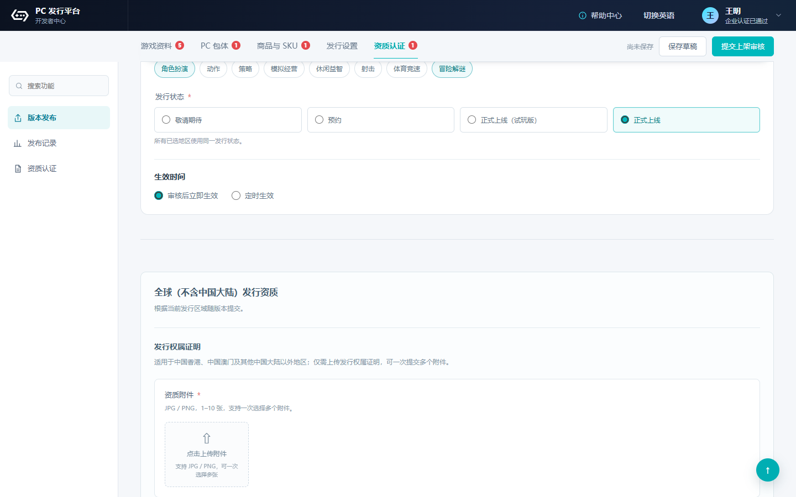 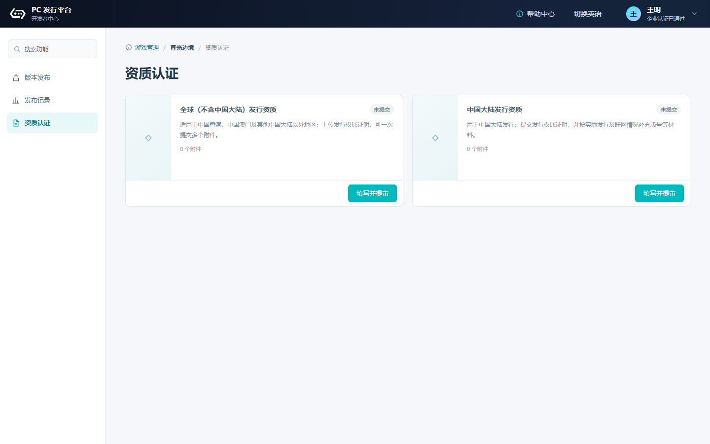 **展示说明：** 1\. 中国大陆与全球（不含中国大陆）分别显示状态、附件数、申请编号和操作；香港、澳门归全球区域。 2\. 中国大陆填写游戏版号并上传审批、权属或授权材料。软件著作权可作辅助证明，不替代版号。 3\. 全球资质以权属或发行授权附件为主，支持多份附件；软件著作权不是统一必填项。 4\. 列表区分初次认证和资质变更。两个区域独立出结果，不互相锁定。 **交互说明：** 1\. 单独提审生成独立资质申请；审核中的区域只读，另一地区仍可编辑。 2\. 版本提审已有有效资质时引用其快照；没有有效资质时，开发者须在版本发布的资质模块补齐材料。提交上架审核时，同一请求创建发布申请和关联资质申请；任一创建失败则整体失败。 3\. 发布后修改生成“资质变更”申请；审核期间旧有效资质继续生效，新资质通过后替换。 4\. 撤销审核须二次确认；确认后恢复编辑，取消不改变状态。|
|输出／后置条件|审核通过生成生效资质版本；发布申请引用提交时的资质快照。|
|补充说明|驳回、需补资料或撤销均不替换旧有效资质，也不改变历史发布快照。 本期暂不支持发行国内区，国区资质暂不制作/2026\.9\.9修改|

#### 3\.1\.6 发布记录

|要素|内容说明|
|---|---|
|功能简介|查询发布申请、结果和只读提交快照。|
|场景描述|开发者查看进度、失败原因或历史版本。|
|输入／前置条件|当前游戏至少提交过一次发布审核。|
|需求描述|**图示（2张）：** 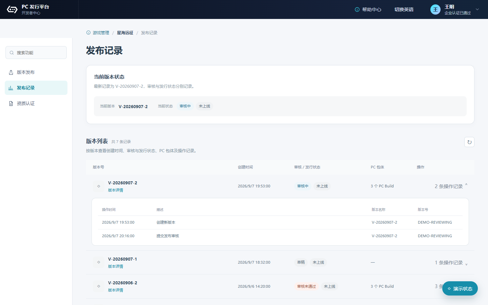 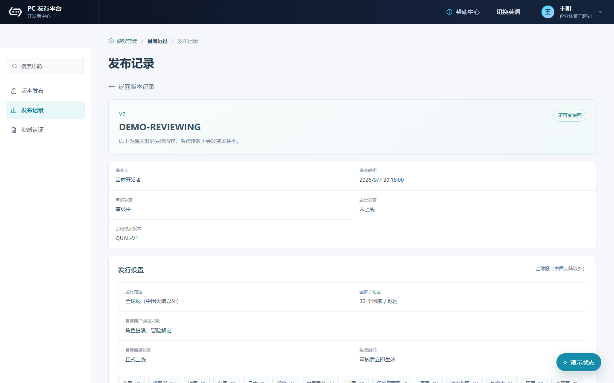 **展示说明：** 1\. 列表每页 20 条，分列展示审核状态和发行状态。审核通过显示“审核通过／未上线”，不能显示“已上线”。 2\. 快照展示游戏资料、PC 包体、商品与 SKU、发行设置、兴趣标签、资质引用、测试结果、审核意见、操作人和时间。 3\. 每次重提生成新记录，旧快照不被当前草稿或新结果覆盖。 4\. 国内发行审核结果通过盖世游戏短信通知；海外发行通过邮件通知。通过只通知审核通过，失败或需补资料引导登录开发者中心查看原因。 **交互说明：** 1\. 点击记录打开只读快照；返回后保留页码和滚动位置。 2\. 审核中、已撤销、已取消不发结果通知，只在页面展示。 3\. 加载失败保留筛选和页码，点击重试后重新查询。|
|输出／后置条件|开发者可追溯每次提交、包体测试和审核结果。|
|补充说明|通知失败不回滚审核结果；服务端记录失败并按通知策略重试。|

### 3\.2 B 端功能需求

#### 3\.2\.1 审核管理

|要素|内容说明|
|---|---|
|功能简介|查询国内或海外的审核申请。|
|场景描述|运营和测试人员定位申请并进入详情。|
|输入／前置条件|已登录运营后台，且拥有对应审核类型和发行区域权限。|
|需求描述|**图示（1张）：** 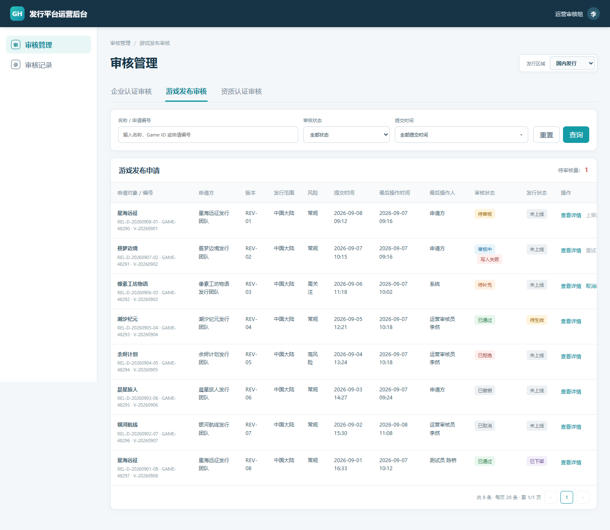 **展示说明：** 1\. 左侧只保留“审核管理、审核记录”。审核管理平铺“企业认证审核、游戏发布审核、资质认证审核”三个 Tab；本 PRD 不定义企业认证审核详情。 2\. 每个 Tab 标题后直接显示“待审核量 N”，不使用参数卡片。**右上通过“发行区域”下拉切换国内发行和海外发行；中国大陆归国内，香港、澳门归海外。（本期不制作发行中国大陆，暂时不做）//2026\.9\.9修改** 3\. 筛选包含关键词、审核状态、提交时间；时间支持昨日、今日、近 7 天、近 30 天和自定义。 4\. 列表显示申请编号、申请方、版本或类型、发行范围、提交时间、最后操作时间、最后操作人、审核状态、发行状态和操作；每页 20 条。 **交互说明：** 1\. 切换审核类型、发行区域或筛选条件后回到第 1 页并重新查询。 2\. 点击详情从右侧打开半屏抽屉；关闭后保留筛选和页码。 3\. 页面不设“领取”或“开始审核”。刷新失败保留原列表和筛选，并显示重试入口。|
|输出／后置条件|打开所选申请详情；审核结果回写开发者端对应记录。|
|补充说明|越权时不返回申请数据；空结果显示“没有匹配的申请”。|

#### 3\.2\.2 发布审核详情

|要素|内容说明|
|---|---|
|功能简介|查看提交快照、完成包体测试并给出发布审核结论。|
|场景描述|测试人员验证包体，发行运营核对本次发布。|
|输入／前置条件|申请为待审核、审核中或需补资料，且当前用户有对应权限。|
|需求描述|**图示（3张）：** 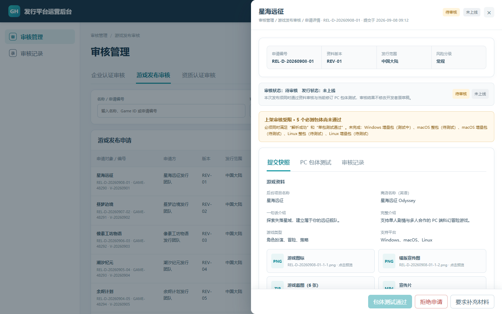 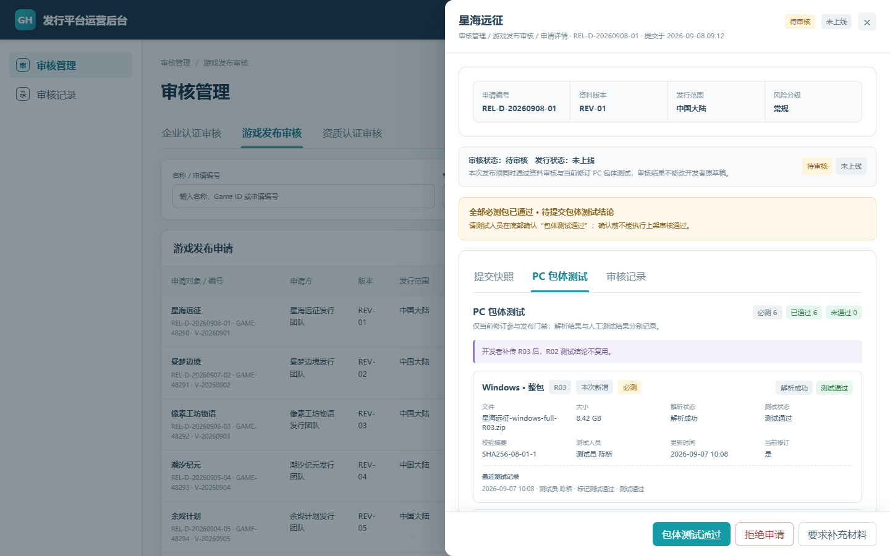 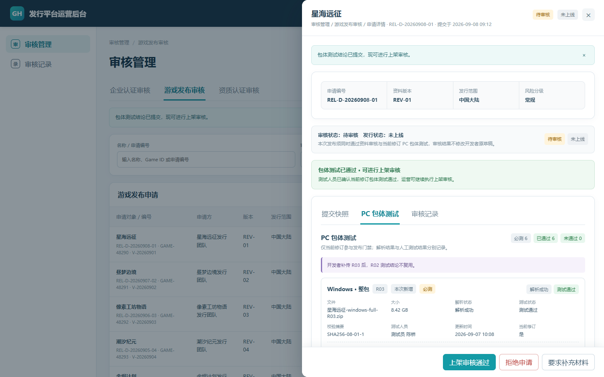 *图 3\.2\.2\-1：右侧半屏审核详情。* *图 3\.2\.2\-2：全部必测包通过，等待提交整次结论。* *图 3\.2\.2\-3：包体测试通过后解锁发布审核。* **展示说明：** 1\. 抽屉头部和底部固定，正文独立滚动；正文展示提交快照、PC 包体测试和本申请审核记录。 2\. 单包状态为待测试、测试中、测试通过、测试不通过；整次结论为待确认、通过、失效。旧修订标记“不参与门禁”。 3\. 各包体卡片内显示“开始测试／标记通过／标记不通过”；门禁区依次显示未完成包体、等待提交整次结论、可进行上架审核。 4\. 底部只承载整次“包体测试通过”、要求补资料、拒绝申请或“上架审核通过”。 **交互说明：** 1\. 测试人员在包体卡片点击“开始测试”后可标记单包通过或不通过；不通过须填写原因，可上传多份测试附件。 2\. 当前修订全部必测包解析成功且单包通过后，底部“包体测试通过”启用；点击后二次确认并生成绑定当前 revisionId 的整次结论。 3\. 整次结论通过后，发行运营才能点击“上架审核通过”；服务端再次校验包体、资料、SKU、发行设置和有效资质，不满足时不改变状态。 4\. 要求补资料或拒绝须填写原因；补资料可由运营取消，取消须二次确认并记录原因。 5\. 审核通过只进入发布执行模块，不直接改变发行状态。|
|输出／后置条件|测试和审核记录写入；通过申请进入发布执行模块，退回申请回到开发者端修改。|
|补充说明|新增、替换包体或生成新修订后，旧整次测试结论失效。并发操作以首个成功终态为准，其他请求返回最新状态。|

#### 3\.2\.3 资质认证审核

|要素|内容说明|
|---|---|
|功能简介|审核初次资质或资质变更。|
|场景描述|资质审核员处理单独提审、随版本提审或发布后变更。|
|输入／前置条件|拥有对应发行区域的资质审核权限。|
|需求描述|**图示（2张）：** 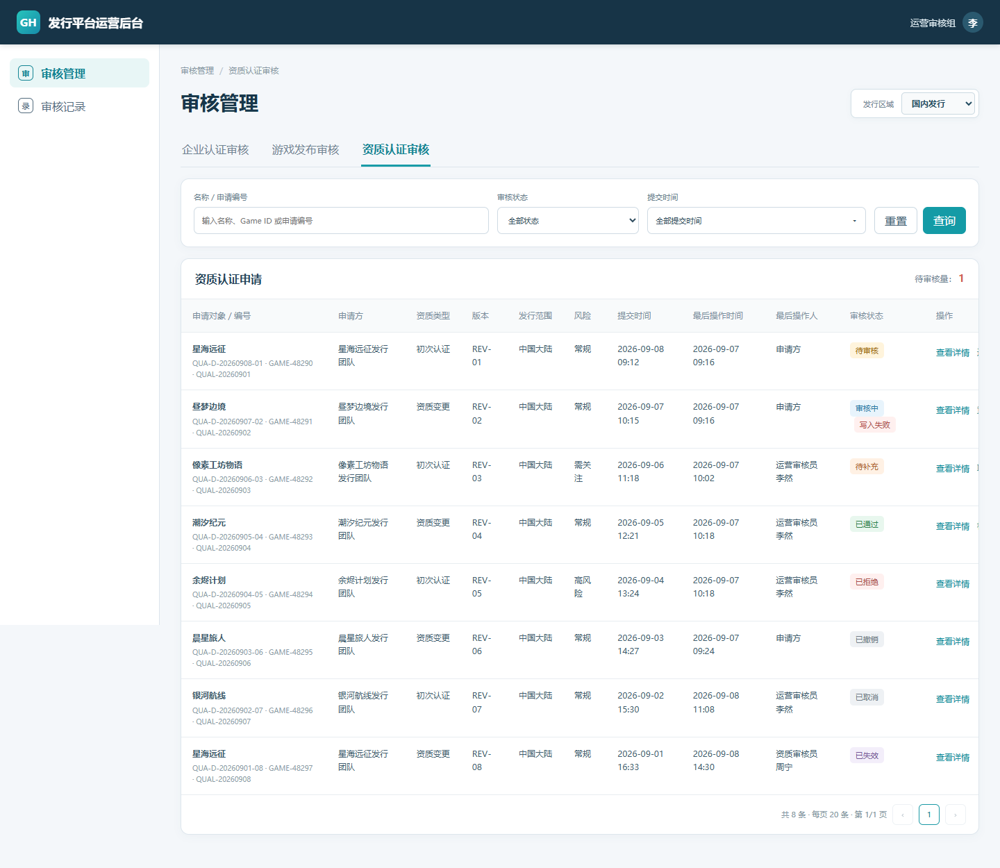 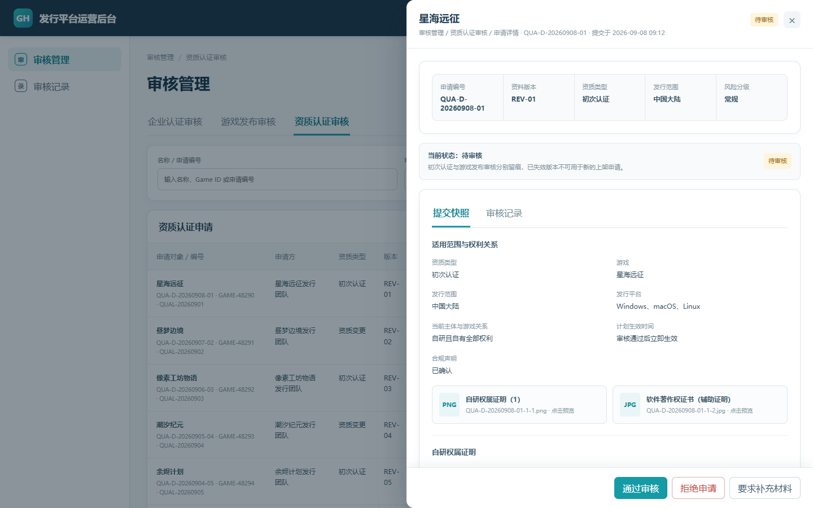 *图 3\.2\.3\-1：资质认证审核列表。* *图 3\.2\.3\-2：资质认证审核详情。* **展示说明：** 1\. 列表标明初次认证／资质变更、国内／海外、提交时间、最后操作人和审核状态。 2\. 详情展示本次附件、适用区域、历史有效资质、版本发布引用关系和操作记录。 3\. 发布审核详情同步展示引用资质快照和当前资质状态；无有效资质时“上架审核通过”禁用。 **交互说明：** 1\. 审核员可通过、拒绝或要求补资料；拒绝和补资料须填写原因，补资料可人工取消并二次确认。 2\. 资质通过后自动重算关联发布申请门禁；资质变更通过后替换旧生效版本。 3\. 申请已被撤销或被他人处理时，当前操作失败并刷新最新状态。|
|输出／后置条件|生成资质审核结果并回写开发者端；通过后更新生效资质版本。|
|补充说明|拒绝、需补资料或撤销不替换旧有效资质；审核记录不可删除。|

**通知规则补充：//2026\.9\.18修改**

1、以开发者认证时的网站语言，中文为国内，发送手机短信\+邮箱，海外为国外，发送邮件

2、涉及多语言，包含中文和英文

##### 游戏版本发布审核结果通知模板

`{game_name}` 为游戏名称（demo内为暮光边境）；`{developer_console_url}` 为后台地址，正式环境取配置，Demo 用 `https://developer.xiaoji.com`。短信、邮件均为固定模板，运营只填平台内原因。

邮件主题统一为“盖世小鸡游戏版本发布审核结果通知”，末尾加“如有疑问，请联系 dev@xiaoji\.com。”

|结果|短信|邮件正文|
|---|---|---|
|通过|【盖世小鸡】您\[\{`game_name`\}\]的版本发布申请已通过，请前往开发者中心查看：\{developer\_console\_url\}|您好，您\[\{`game_name`\}\] 的版本发布申请已通过。请前往开发者中心继续操作：\{developer\_console\_url\}。|
|拒绝|【盖世小鸡】您\[\{`game_name`\}\]的版本发布申请未通过，具体原因请前往开发者中心查看：\{developer\_console\_url\}|您好，您\[\{`game_name`\}\] 的版本发布申请未通过，具体原因请前往开发者中心查看：\{developer\_console\_url\}。|
|下架|【盖世小鸡】您的\[\{`game_name`\}\]游戏已被下架，具体原因请前往开发者中心查看：\{developer\_console\_url\}|您好，您的\[\{`game_name`\}\]游戏 已被下架，具体原因请前往开发者中心查看：\{developer\_console\_url\}。|

#### 3\.2\.4 审核记录

|要素|内容说明|
|---|---|
|功能简介|查询企业认证、游戏发布和资质认证的每次审核操作。|
|场景描述|运营、测试或管理人员回溯申请。|
|输入／前置条件|已登录并具有对应数据权限。|
|需求描述|**图示（1张）：** 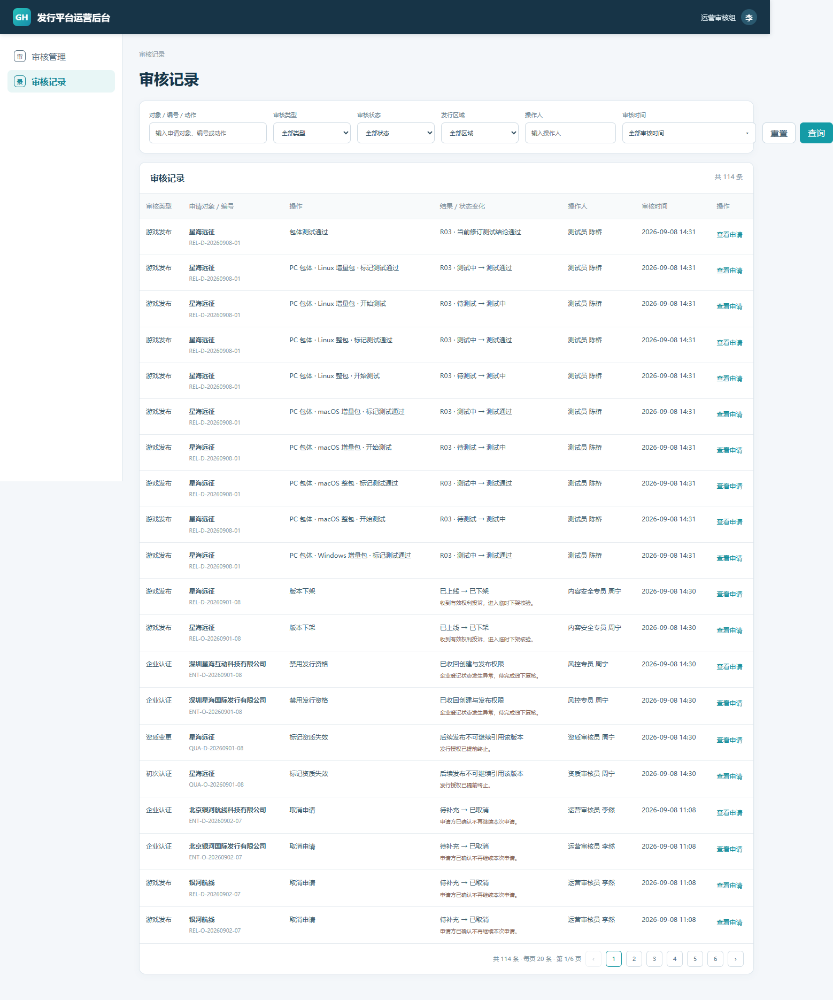 **展示说明：** 1\. 筛选项为关键词、审核类型、发行区域、操作人、审核时间；时间支持昨日、今日、近 7 天、近 30 天和自定义。 2\. 列表展示审核类型、申请对象与编号、动作、结果或状态变化、操作人、审核时间和操作；每页 20 条。 3\. 记录范围包括企业认证、游戏发布、资质认证、单包测试、整次测试、补资料、取消补资料、拒绝、撤销和审核通过。 **交互说明：** 1\. 组合筛选后回到第 1 页；重置清空条件并重新查询。 2\. 点击记录打开对应申请详情；关闭后保留筛选。 3\. 加载失败保留当前结果并显示重试入口。|
|输出／后置条件|用户可定位每一步的申请、动作、结果、操作人和时间。|
|补充说明|记录只读，不可编辑、覆盖或删除；业务操作失败不写成功记录。|

##### 运营角色权限

|角色|权限与范围|禁止与越权|日志|
|---|---|---|---|
|版本发布审核员 |查询申请、看快照和附件、通过、拒绝、补充资料、下架。 |不得改企业提交值或内容配置；越权返回无权限。 |记录附件访问及审核的账号、对象、时间、结果、原因。|
|资质认证审核员 |查询申请、看快照和附件、通过、拒绝、资质失效。 |不得改企业提交值或内容配置；越权返回无权限。 |记录附件访问及审核的账号、对象、时间、结果、原因。|

## 四、支撑及非功能需求

### 4\.1 埋点与数据需求

#### 4\.1\.1 埋点事件

|事件|页面／类型|触发与成功|参数|
|---|---|---|---|
|publisher\_game\_create\_result|C 端／添加游戏|创建请求返回时上报；result=success 表示 Game ID 和 APPID 已生成|event\_time, user\_id, session\_id, game\_id, page\_name, platforms, result, failure\_code|
|publisher\_release\_page\_view|C 端／版本发布|页面数据加载完成后上报一次|event\_time, user\_id, session\_id, game\_id, page\_name, revision\_id|
|publisher\_build\_upload\_result|C 端／PC 包体|单个包体上传任务结束时上报；以服务端任务结果为准|event\_time, user\_id, session\_id, game\_id, page\_name, revision\_id, build\_platform, build\_type, result, failure\_code|
|publisher\_release\_submit\_result|C 端／版本发布|发布提审请求返回时上报；success 表示发布申请及关联资质申请均已创建。成功时定价、Build、控制器和系统要求参数必传；失败时已完成计算则传。//2026\.9\.22修改|event\_time, user\_id, session\_id, game\_id, page\_name, submission\_id, revision\_id, release\_region, target\_user\_interests, sku\_count, paid\_sku\_count, pricing\_strategies, pricing\_override\_count, selected\_build\_count, selected\_app\_count, dlc\_build\_count, controller\_types, windows\_requirements\_complete, result, failure\_code|
|publisher\_review\_withdraw\_result|C 端／版本发布或资质认证|用户确认撤销且请求返回时上报|event\_time, user\_id, session\_id, game\_id, page\_name, submission\_id, review\_type, result, failure\_code|
|publisher\_qualification\_submit\_result|C 端／资质认证|独立资质提审请求返回时上报|event\_time, user\_id, session\_id, game\_id, page\_name, qualification\_submission\_id, release\_region, qualification\_type, result, failure\_code|
|publisher\_release\_record\_view|C 端／发布记录|提交快照加载完成后上报|event\_time, user\_id, session\_id, game\_id, page\_name, submission\_id, review\_status, release\_status|
|admin\_build\_test\_result|B 端／发布审核详情|单包结果或整次测试结论提交完成后上报|event\_time, user\_id, session\_id, game\_id, page\_name, submission\_id, revision\_id, build\_platform, action\_type, result, failure\_code|
|admin\_review\_result|B 端／发布或资质审核|通过、拒绝、要求补资料或取消补资料完成后上报|event\_time, user\_id, session\_id, game\_id, page\_name, submission\_id, review\_type, release\_region, action\_type, result, failure\_code|
|admin\_audit\_record\_view|B 端／审核记录|审核记录列表加载完成后上报一次|event\_time, user\_id, session\_id, game\_id, page\_name, review\_type, release\_region|

#### 4\.1\.2 参数说明

|参数|类型／必填|说明|枚举／示例|
|---|---|---|---|
|event\_time|datetime／是|事件时间，ISO 8601|2026\-09\-08T15:30:00\+08:00|
|user\_id|string／是|当前账号 ID|U\-1024|
|session\_id|string／是|当前登录会话 ID|S\-20260908\-01|
|game\_id|string／否|游戏 ID；创建失败时可为空|GAME\-48290|
|page\_name|string／是|页面标识|game\_create, version\_release, qualification, release\_record, release\_review, audit\_record|
|platforms|array／否|创建时选择的平台|windows, macos, linux|
|submission\_id|string／否|发布或审核申请编号|REL\-D\-20260908\-01|
|qualification\_submission\_id|string／否|资质申请编号|QUAL\-G\-20260908\-01|
|revision\_id|string／否|当前提交修订 ID|REV\-01|
|release\_region|string／否|发行区域|mainland＝中国大陆；global＝全球（不含中国大陆）|
|target\_user\_interests|array／否|提交时选择的游戏兴趣编码|role\_playing, action, strategy, simulation, casual, shooter, sports\_racing, adventure\_puzzle|
|sku\_count|integer／成功必填|本次快照的 SKU 数|3|
|paid\_sku\_count|integer／成功必填|本次快照的收费 SKU 数；全免费传 0|2|
|pricing\_strategies|array／成功必填|收费 SKU 使用的定价方式，去重后上报；全免费传空数组|uniform＝统一价；regional＝分区定价|
|pricing\_override\_count|integer／成功必填|按“SKU×地区”统计当前发行范围内的有效例外价；全免费传 0|4|
|selected\_build\_count|integer／成功必填|本次发布快照选择的 Build 总数。//2026\.9\.22新增|3|
|selected\_app\_count|integer／成功必填|已选 Build 去重后的 App ID 数量。//2026\.9\.22新增|3|
|dlc\_build\_count|integer／成功必填|已选 Build 中 DLC Build 的数量；无 DLC 时传 0。//2026\.9\.22新增|2|
|controller\_types|array／成功必填|支持的控制器类型；不支持控制器时传空数组。//2026\.9\.22新增|xbox, playstation, generic, other|
|windows\_requirements\_complete|boolean／成功必填|Windows 最低配置与推荐配置的必填项是否完整。//2026\.9\.22新增|true|
|build\_platform|string／否|包体平台|windows, macos, linux|
|build\_type|string／否|包体类型|full＝整包；incremental＝增量包|
|review\_type|string／否|审核类型|release＝游戏发布；qualification＝资质认证|
|qualification\_type|string／否|资质提交类型|initial＝初次；change＝变更；with\_release＝随版本提交|
|review\_status|string／否|审核状态|draft, reviewing, changes\_required, rejected, withdrawn, approved|
|release\_status|string／否|发行状态|offline, online, delisted|
|action\_type|string／否|本次操作|start\_test, build\_pass, build\_fail, revision\_pass, approve, reject, request\_changes, cancel\_changes|
|result|string／是|请求或业务处理结果|success, fail|
|failure\_code|string／否|失败码；result=fail 时必填，不上传自由文本原因|validation\_failed, network\_error, permission\_denied, state\_conflict, server\_error|

### 4\.2 技术需求

|需求项|具体要求|
|---|---|
|权限|开发者仅访问本主体游戏；测试、发行运营和资质审核员按角色及国内／海外范围访问。|
|一致性 |02 开发者端提交真实快照和包体供 09 审核后台读取；09 的测试与审核结果回写 02 发布记录。|
|数据存储|每次提审生成 submissionId 与 revisionId；补件重提生成新编号，历史快照、附件和结论不可覆盖。|
|安全|包体、资质和测试附件使用鉴权地址；日志不记录下载凭证。|
|并发|重复点击只处理一次；并发审核以首个成功终态为准，其他请求返回最新状态。|

### 4\.3 运营需求

|需求项|具体要求|
|---|---|
|测试执行|平台准备 Windows、macOS、Linux 测试环境；单包结果绑定包体，整次结论绑定当前修订。|
|审核协同|游戏资料、SKU、发行设置、资质和包体测试可并行；发布审核通过前统一校验。|
|通知|国内发行发送盖世游戏短信，海外发行发送邮件；仅通知审核结果，失败原因在开发者中心查看。|

### 4\.4 合规需求

|需求项|具体要求|
|---|---|
|法务|国内发行需核验游戏版号及审批材料；具体清单由法务确认。|
|版权|中国大陆和全球均须提供权属或发行授权材料；软件著作权仅作辅助证明。|
|其他合规|中国大陆与全球资质独立；香港、澳门按海外发行处理。|

## 五、待确认项

|待确认问题|默认建议|未确认的影响|是否阻塞|
|---|---|---|---|
|包体格式、大小、数量与并发上限|由存储／CDN方案和压测结果确定，前端读取服务端配置|影响上传校验和接口参数 |阻塞接口冻结，不阻塞流程评审 |
|测试附件格式、大小与数量上限|复用平台通用附件规则|影响附件校验|阻塞附件接口冻结 |

## 六、附录

### 6\.1 参考文档

|文档名称|文档链接／位置|说明|
|---|---|---|
|WeGame 开发者文档|[Wiki \- WeGame Developer](https://developer.wegame.com/developer/game-wiki/help/doc/getting-started-overview/zh_CN)|PC 游戏接入与发布参考。|
|Steamworks 上手文档 |[Getting Started \(Steamworks Documentation\)](https://partner.steamgames.com/doc/gettingstarted)|PC 游戏发行对象与流程参考。|

### 6\.2 原型／Demo 索引

|原型／Demo 名称|链接／位置|说明|
|---|---|---|
|开发者端 Demo|**Demo 详细设计：**[开发者平台demo\(前端\)](https://htmlpreview.github.io/?https://cdn.jsdelivr.net/gh/z36358631-ship-it/-@491a6cf9b7a2afc02840b0f3ac37687b1663f9de/demos/%E5%BC%80%E5%8F%91%E8%80%85%E5%90%8E%E5%8F%B0%E4%B8%80%E6%9C%9F/%E5%BC%80%E5%8F%91%E8%80%85%E5%B9%B3%E5%8F%B0demo.html#/P01-01) |本 PRD 的开发者端唯一有效原型；版本发布支持穷举态与缺省态。//2026\.9\.22修改|
|运营审核 Demo||发布审核与包体测试。|
|审核记录 ||三类审核记录。|
